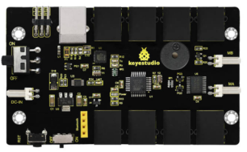
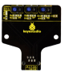
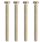
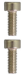
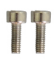
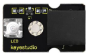
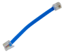
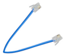
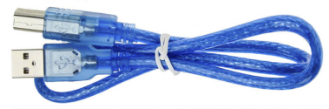

1. Product Introduction
=======================

.. figure:: ./media/89df325228d0c059e98d442107ffe8cf.png
   :alt: ks0353-1

   ks0353-1

1.1 Description
---------------

In the near future, many things might no longer be done by ourselves
because the robots are able to help us do many things. So what does the
future robot look like? What can it do?

He may be controlled by human voice. Do not use the remote control. Just
press the power button and the robot will start do something you said
and never get tired.

In addition to cooking, there may be another magical feature. In the
summer, the weather is very hot. At this time, you definitely want to
drink a glass of juice. As long as you give orders, the robot will pick
up the fruit and put it in his body. After a while, there will be juice
to drink, and he can freeze the juice. The taste is more delicious.
Robots also have a lot of magical features that allow you to enjoy a
simple, fast lifestyle, and the future robots will become more
excellent.

Now, let’s DIY the KEYBOT robot. The KEYBOT robot is based on
easy-to-use and flexible open-source Arduino platform. KEYBOT control
board comes with the RJ11 plug, so it is very easy to connect other
sensor modules with only one cable.

The robot is designed in metal structure, solid and durable. The
assembly is really simple, believing you can install well the KEYBOT
within 30mins.

As for the KEYBOT coding, you will learn how to get started with Arduino
programming C language and Mixly block platform. Even the beginner with
no coding experience can easily understand the graphical program. Take
your brain on an inspiring journey through the world of programming. Get
started now!

1.2 Parameters
--------------

- External power supply range: 7-12V

- Current Range: min 800mA

- Motor Speed: 6.0V 100rpm/min

- Motor control is driven by TB6612

- Three groups of line tracking modules, to detect black-white line with
  higher accuracy and can be used for anti-fall control as well.

- Ultrasonic module is used to detect the obstacle distance, avoiding
  the front obstacle when the distance detected is less than a certain
  value.

- Bluetooth wireless module can be paired with Bluetooth device on
  mobile phone to remotely control the KEYBOT. Turn off the Bluetooth
  when programming.

- The shield has two servo interfaces.

- It can access the external voltage 7~12V.

1.3 List
--------

You can see a pretty beautiful packaging box for the KEYBOT, and inside
the KEYBOT packaging you will find all the parts and screws listed
below.

+-----+----------------+-----+---------------------------------------------------------------------------------------------------------------------------------------------------------------------------------------------+
| No. | Components     | QTY | Picture                                                                                                                                                                                     |
+=====+================+=====+=============================================================================================================================================================================================+
| 1   | KEYBOT Control | 1   | |image-20230417152638175|                                                                                                                                                                   |
|     | Board          |     |                                                                                                                                                                                             |
+-----+----------------+-----+---------------------------------------------------------------------------------------------------------------------------------------------------------------------------------------------+
| 2   | Top Acrylic    | 1   | |image-20230417152829855|                                                                                                                                                                   |
|     | Panel for      |     |                                                                                                                                                                                             |
|     | KEYBOT control |     |                                                                                                                                                                                             |
|     | board          |     |                                                                                                                                                                                             |
+-----+----------------+-----+---------------------------------------------------------------------------------------------------------------------------------------------------------------------------------------------+
| 3   | KEYBOT         | 1   | |image-20230417152856960|                                                                                                                                                                   |
|     | Ultrasonic     |     |                                                                                                                                                                                             |
|     | Sensor         |     |                                                                                                                                                                                             |
+-----+----------------+-----+---------------------------------------------------------------------------------------------------------------------------------------------------------------------------------------------+
| 4   | KEYBOT Line    | 1   | |image-20230417152905953|                                                                                                                                                                   |
|     | Tracking       |     |                                                                                                                                                                                             |
|     | Sensor         |     |                                                                                                                                                                                             |
+-----+----------------+-----+---------------------------------------------------------------------------------------------------------------------------------------------------------------------------------------------+
| 5   | Keyestudio     | 1   | |image-20230417152909568|                                                                                                                                                                   |
|     | Bluetooth      |     |                                                                                                                                                                                             |
|     | Module-(HC-06) |     |                                                                                                                                                                                             |
+-----+----------------+-----+---------------------------------------------------------------------------------------------------------------------------------------------------------------------------------------------+
| 6   | W420 steel     | 1   | |image-20230417152925088|                                                                                                                                                                   |
|     | universal      |     |                                                                                                                                                                                             |
|     | wheel          |     |                                                                                                                                                                                             |
+-----+----------------+-----+---------------------------------------------------------------------------------------------------------------------------------------------------------------------------------------------+
| 7   | single shaft   | 1   | |image-20230417152929686|                                                                                                                                                                   |
|     | gear motor     |     |                                                                                                                                                                                             |
|     | with           |     |                                                                                                                                                                                             |
|     | 2.54-socket    |     |                                                                                                                                                                                             |
|     | KF2510-2P      |     |                                                                                                                                                                                             |
|     | red-black lead |     |                                                                                                                                                                                             |
|     | 200mm Right    |     |                                                                                                                                                                                             |
|     | motor          |     |                                                                                                                                                                                             |
+-----+----------------+-----+---------------------------------------------------------------------------------------------------------------------------------------------------------------------------------------------+
| 8   | single shaft   | 1   | |image-20230417152936683|                                                                                                                                                                   |
|     | gear motor     |     |                                                                                                                                                                                             |
|     | with           |     |                                                                                                                                                                                             |
|     | 2.54-socket    |     |                                                                                                                                                                                             |
|     | KF2510-2P      |     |                                                                                                                                                                                             |
|     | red-black lead |     |                                                                                                                                                                                             |
|     | 140mm Left     |     |                                                                                                                                                                                             |
|     | motor          |     |                                                                                                                                                                                             |
+-----+----------------+-----+---------------------------------------------------------------------------------------------------------------------------------------------------------------------------------------------+
| 9   | 18650 2-cell   | 1   | |image-20230417152942320|                                                                                                                                                                   |
|     | Battery Holder |     |                                                                                                                                                                                             |
+-----+----------------+-----+---------------------------------------------------------------------------------------------------------------------------------------------------------------------------------------------+
| 10  | 6-cell AA      | 1   | |image-20230417153049553|                                                                                                                                                                   |
|     | Battery Case   |     |                                                                                                                                                                                             |
+-----+----------------+-----+---------------------------------------------------------------------------------------------------------------------------------------------------------------------------------------------+
| 11  | black-white    | 2   | |image-20230417153042623|                                                                                                                                                                   |
|     | 6515 robot     |     |                                                                                                                                                                                             |
|     | wheel          |     |                                                                                                                                                                                             |
+-----+----------------+-----+---------------------------------------------------------------------------------------------------------------------------------------------------------------------------------------------+
| 12  | Dual-pass      | 4   | |image-20230417153118403|                                                                                                                                                                   |
|     | M3*40 copper   |     |                                                                                                                                                                                             |
|     | pillar         |     |                                                                                                                                                                                             |
+-----+----------------+-----+---------------------------------------------------------------------------------------------------------------------------------------------------------------------------------------------+
| 13  | Single-pass    | 4   | |image-20230417153122385|                                                                                                                                                                   |
|     | M3*15+6MM hex  |     |                                                                                                                                                                                             |
|     | copper pillar  |     |                                                                                                                                                                                             |
+-----+----------------+-----+---------------------------------------------------------------------------------------------------------------------------------------------------------------------------------------------+
| 14  | M3*30MM        | 4   | |image-20230417153136593|                                                                                                                                                                   |
|     | round-head     |     |                                                                                                                                                                                             |
|     | screw          |     |                                                                                                                                                                                             |
+-----+----------------+-----+---------------------------------------------------------------------------------------------------------------------------------------------------------------------------------------------+
| 15  | M3*8MM         | 4   | |image-20230417153144721|                                                                                                                                                                   |
|     | flat-head      |     |                                                                                                                                                                                             |
|     | screw          |     |                                                                                                                                                                                             |
+-----+----------------+-----+---------------------------------------------------------------------------------------------------------------------------------------------------------------------------------------------+
| 16  | M3*8 stainless | 10  | |image-20230417153206577|\ |image-20230417153207026|\ |image-20230417153207842|\ |image-20230417153208643|\ |image-20230417153209906|                                                       |
|     | steel inner    |     |                                                                                                                                                                                             |
|     | hex screw      |     |                                                                                                                                                                                             |
+-----+----------------+-----+---------------------------------------------------------------------------------------------------------------------------------------------------------------------------------------------+
| 17  | M3*10MM        | 10  | |image-20230417153235458|\ |image-20230417153235750|\ |image-20230417153235913|\ |image-20230417153236153|\ |image-20230417153236460|                                                       |
|     | stainless      |     |                                                                                                                                                                                             |
|     | steel inner    |     |                                                                                                                                                                                             |
|     | hex screw      |     |                                                                                                                                                                                             |
+-----+----------------+-----+---------------------------------------------------------------------------------------------------------------------------------------------------------------------------------------------+
| 18  | M3 Nickel      | 14  | |image-20230417153250577|\ |image-20230417153250850|\ |image-20230417153250989|\ |image-20230417153251208|\ |image-20230417153251446|\ |image-20230417153251678|\ |image-20230417153251838| |
|     | plated nut     |     |                                                                                                                                                                                             |
+-----+----------------+-----+---------------------------------------------------------------------------------------------------------------------------------------------------------------------------------------------+
| 19  | KEYBOT body    | 1   | |image-20230417153309570|                                                                                                                                                                   |
|     | black holder   |     |                                                                                                                                                                                             |
+-----+----------------+-----+---------------------------------------------------------------------------------------------------------------------------------------------------------------------------------------------+
| 20  | Yellow-black   | 1   | |image-20230417153313650|                                                                                                                                                                   |
|     | handle 3*40MM  |     |                                                                                                                                                                                             |
|     | Phillips       |     |                                                                                                                                                                                             |
|     | Screwdriver    |     |                                                                                                                                                                                             |
+-----+----------------+-----+---------------------------------------------------------------------------------------------------------------------------------------------------------------------------------------------+
| 21  | EASY plug      | 1   | |image-20230417153319810|                                                                                                                                                                   |
|     | white Piranha  |     |                                                                                                                                                                                             |
|     | LED module     |     |                                                                                                                                                                                             |
+-----+----------------+-----+---------------------------------------------------------------------------------------------------------------------------------------------------------------------------------------------+
| 22  | 6P6C RJ11      | 1   | |image-20230417153323650|                                                                                                                                                                   |
|     | cable 10CM     |     |                                                                                                                                                                                             |
+-----+----------------+-----+---------------------------------------------------------------------------------------------------------------------------------------------------------------------------------------------+
| 23  | 6P6C RJ11      | 2   | |image-20230417153359762|\ |image-20230417153359943|                                                                                                                                        |
|     | cable 20CM     |     |                                                                                                                                                                                             |
+-----+----------------+-----+---------------------------------------------------------------------------------------------------------------------------------------------------------------------------------------------+
| 24  | Type-L M2.5    | 1   | |image-20230417153421426|                                                                                                                                                                   |
|     | Nickel plated  |     |                                                                                                                                                                                             |
|     | Allen wrench   |     |                                                                                                                                                                                             |
+-----+----------------+-----+---------------------------------------------------------------------------------------------------------------------------------------------------------------------------------------------+
| 25  | USB cable      | 1   | |image-20230417153425523|                                                                                                                                                                   |
+-----+----------------+-----+---------------------------------------------------------------------------------------------------------------------------------------------------------------------------------------------+

1.4 Core Part of KEYBOT
-----------------------

The core is the part that really matters today. In fact, it is very easy
to understand the core. In other word, the core is just like the human
brain. It can receive various kinds of information every day and will
send out various instructions every day.

The core part of our robot is a control board specially designed for
KEYBOT. It integrates both ARDUINO and motor driver, so the use method
of this integrated board is the same as the ARDUINO controller.

Well, let’s first look at what every element and interface of the board
does:

.. figure:: ./media/4faa50cb060fa90ba32976ad0c8848af.jpeg
   :alt: KS0350 -pinouts

   KS0350 -pinouts

.. |image-20230417152856960| image:: ./media/image-20230417152856960.png

.. |image-20230417152925088| image:: ./media/image-20230417152925088.png

.. |image-20230417153118403| image:: ./media/image-20230417153118403.png
.. |image-20230417153122385| image:: ./media/image-20230417153122385.png

.. |image-20230417153144721| image:: ./media/image-20230417153144721.png
.. |image-20230417153206577| image:: ./media/image-20230417153206577.png

.. |image-20230417153207842| image:: ./media/image-20230417153207842.png
.. |image-20230417153208643| image:: ./media/image-20230417153208643.png
.. |image-20230417153209906| image:: ./media/image-20230417153209906.png

.. |image-20230417153235750| image:: ./media/image-20230417153235750.png
.. |image-20230417153235913| image:: ./media/image-20230417153235913.png
.. |image-20230417153236153| image:: ./media/image-20230417153236153.png
.. |image-20230417153236460| image:: ./media/image-20230417153236460.png
.. |image-20230417153250577| image:: ./media/image-20230417153250577.png
.. |image-20230417153250850| image:: ./media/image-20230417153250850.png
.. |image-20230417153250989| image:: ./media/image-20230417153250989.png
.. |image-20230417153251208| image:: ./media/image-20230417153251208.png

.. |image-20230417153251678| image:: ./media/image-20230417153251678.png
.. |image-20230417153251838| image:: ./media/image-20230417153251838.png
.. |image-20230417153309570| image:: ./media/image-20230417153309570.png
.. |image-20230417153313650| image:: ./media/image-20230417153313650.png

.. |image-20230417153359762| image:: ./media/image-20230417153359762.png

