1. Product introduction
=======================

|image1|

1.1 Overview:
-------------

This Smart Home Learning Kit based on the Arduino platform is newly
rolled out by Keyestudio DIY Robot Co. Ltd.

It simulates the real smart home and demonstrates the cozy and
comfortable life for people.

In fact, the logic programming, an invisible hand, controls everything
in smart home: it turns on the air conditioner, boots up the water
heater, secures your home with an electronic lock, and sets your LED
lights and smart curtains to turn on automatically when you get home.
Meanwhile, the intelligent lighting system allows you to create a
comfortable, tranquil atmosphere. Everything is finished by a remote
control or your own cellphone.

As Bill Gates puts it, “In the near future, a house without a smart home
system will be as unfashionable as a home without Internet access
today.”

So, go ahead and get started; let’s build this amazing analog smart
home.

1.2 Kit list
------------

After getting this smart home kit, we need to make sure that there are
not missing components.

+----+-------------------------------+-----+----------------------------------+
| #  | Name                          | QTY | Picture                          |
+====+===============================+=====+==================================+
| 1  | Keyestudio PLUS Control Board | 1   | |image2|                         |
+----+-------------------------------+-----+----------------------------------+
| 2  | Keyestudio Sensor Shield V    | 1   | |image3|                         |
|    | 5.2                           |     |                                  |
+----+-------------------------------+-----+----------------------------------+
| 3  | Wooden Board*10 T=3MM         | 1   | |image-20250423092526992|        |
+----+-------------------------------+-----+----------------------------------+
| 4  | White LED Module              | 1   | |image4|                         |
+----+-------------------------------+-----+----------------------------------+
| 5  | Yellow LED Module             | 1   | |image5|                         |
+----+-------------------------------+-----+----------------------------------+
| 6  | Button Sensor                 | 2   | |image6|                         |
+----+-------------------------------+-----+----------------------------------+
| 7  | Photocell Sensor              | 1   | |image7|                         |
+----+-------------------------------+-----+----------------------------------+
| 8  | PIR Motion Sensor             | 1   | |image8|                         |
+----+-------------------------------+-----+----------------------------------+
| 9  | MQ-2 Gas Sensor               | 1   | |image9|                         |
+----+-------------------------------+-----+----------------------------------+
| 10 | Relay Module                  | 1   | |image10|                        |
+----+-------------------------------+-----+----------------------------------+
| 11 | Bluetooth HM-10 Module        | 1   | |image11|                        |
+----+-------------------------------+-----+----------------------------------+
| 12 | Passive Buzzer Sensor         | 1   | |image12|                        |
+----+-------------------------------+-----+----------------------------------+
| 13 | Fan module                    | 1   | |image13|                        |
+----+-------------------------------+-----+----------------------------------+
| 14 | Steam Sensor                  | 1   | |image14|                        |
+----+-------------------------------+-----+----------------------------------+
| 15 | Servo Motor                   | 2   | |image15|                        |
+----+-------------------------------+-----+----------------------------------+
| 16 | LCD1602 Display Module        | 1   | |image16|                        |
+----+-------------------------------+-----+----------------------------------+
| 17 | Soil Humidity Sensor          | 1   | |image17|                        |
+----+-------------------------------+-----+----------------------------------+
| 18 | USB Cable                     | 1   | |image18|                        |
+----+-------------------------------+-----+----------------------------------+
| 19 | Female to Female Dupont       | 40  | |image19|                        |
|    | Cables                        |     |                                  |
+----+-------------------------------+-----+----------------------------------+
| 20 | Male to female Dupont Cables  | 6   | |image20|                        |
+----+-------------------------------+-----+----------------------------------+
| 21 | M3 Nickel Plated Nuts         | 25  | |image-20250416150440426|        |
+----+-------------------------------+-----+----------------------------------+
| 22 | M2*12MM Round Head Screws     | 6   | |image-20250416150255499|        |
+----+-------------------------------+-----+----------------------------------+
| 23 | M2 Nickel Plated Nuts         | 6   | |image-20250416150222937|        |
+----+-------------------------------+-----+----------------------------------+
| 24 | M3*10MM Dual-pass Copper Bush | 4   | |image-20250416150153520|        |
+----+-------------------------------+-----+----------------------------------+
| 25 | M3*6MM Round Head Screws      | 8   | |image-20250416150130680|        |
+----+-------------------------------+-----+----------------------------------+
| 26 | M3 304 Stainless Steel        | 4   | |image-20250416150119881|        |
|    | Self-locking Nuts             |     |                                  |
+----+-------------------------------+-----+----------------------------------+
| 27 | M3*10MM Round Head Screws     | 20  | |image-20250416150056376|        |
+----+-------------------------------+-----+----------------------------------+
| 28 | M2.5*10MM Round Head Screws   | 6   | |image-20250416150036608|        |
+----+-------------------------------+-----+----------------------------------+
| 29 | M2.5 Nickel Plated Nuts       | 6   | |image-20250416150006617|        |
+----+-------------------------------+-----+----------------------------------+
| 30 | M3*12MM Round Head Screws     | 6   | |image-20250416145907696|        |
+----+-------------------------------+-----+----------------------------------+
| 31 | M3*10MM Flat Head Screws      | 2   | |image-20250416145826473|        |
+----+-------------------------------+-----+----------------------------------+
| 32 | M1.2*5MM Round Head           | 10  | |image-20250416145807856|        |
|    | Self-tapping Screws           |     |                                  |
+----+-------------------------------+-----+----------------------------------+
| 33 | 6-Slot AA Battery Holder with | 1   | |image21|                        |
|    | DC Head and 15cm Dew Line     |     |                                  |
+----+-------------------------------+-----+----------------------------------+
| 34 | Black-yellow Handle 3*40MM    | 1   | |image22|                        |
|    | Cross Screwdriver             |     |                                  |
+----+-------------------------------+-----+----------------------------------+
| 35 | 20cm 2.54 3Pin F-F Jumper     | 13  | |image23|                        |
|    | Wire                          |     |                                  |
+----+-------------------------------+-----+----------------------------------+
| 36 | 20cm 2.54 4Pin F-F Jumper     | 2   | |image24|                        |
|    | Wire                          |     |                                  |
+----+-------------------------------+-----+----------------------------------+

.. |image1| image:: media/1.png
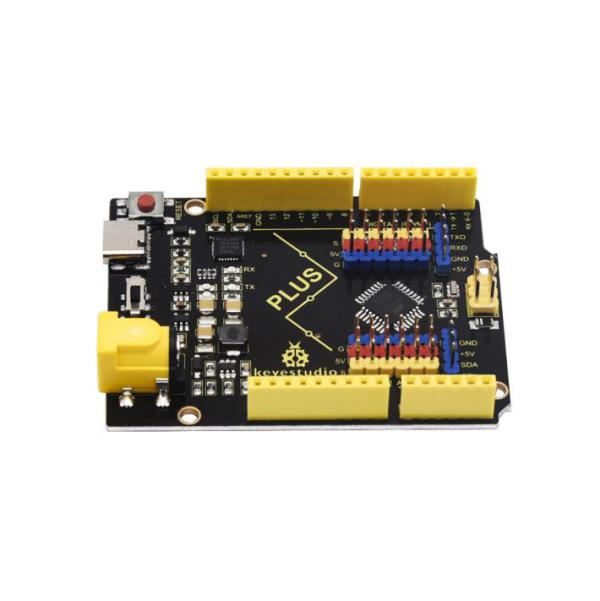
.. |image3| image:: media/3.jpeg
.. |image-20250423092526992| image:: media/4.png
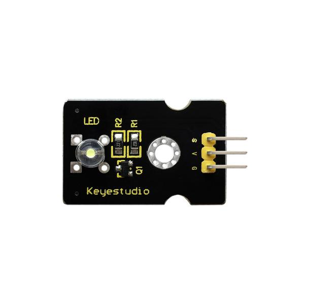
.. |image5| image:: media/6.jpeg
.. |image6| image:: media/7.jpeg
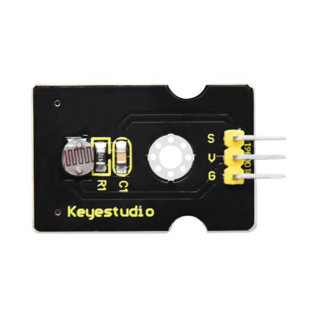
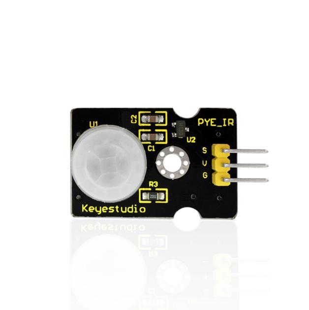
.. |image9| image:: media/10.png
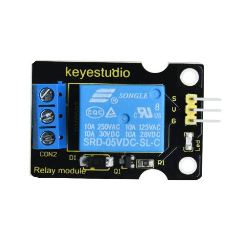
.. |image11| image:: media/12.png
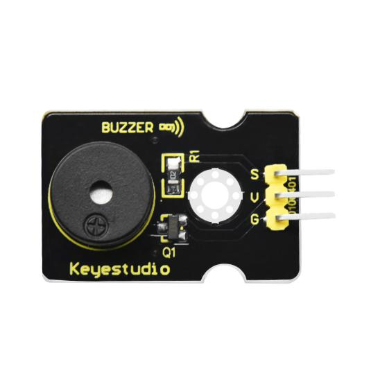
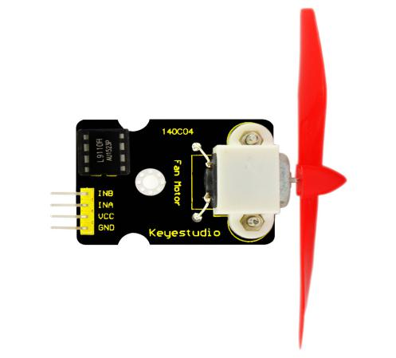
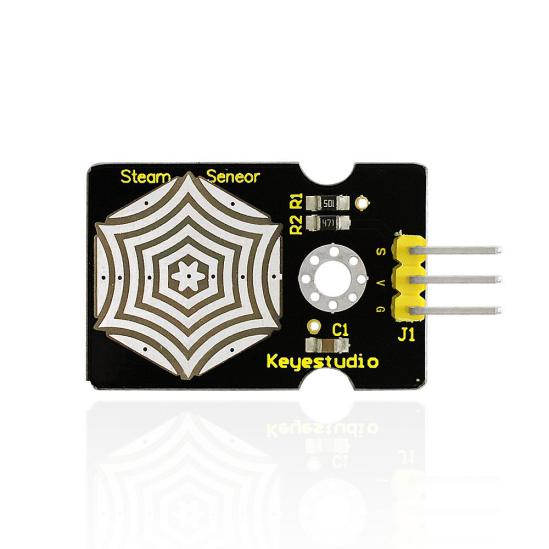
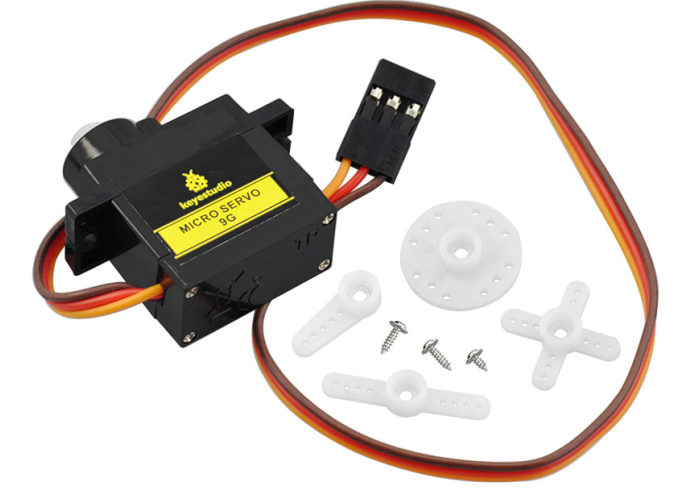
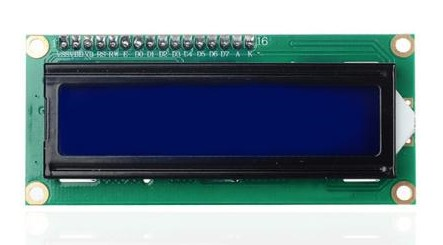
.. |image17| image:: media/18.jpeg
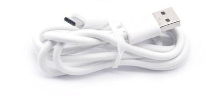
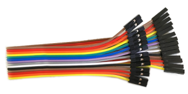
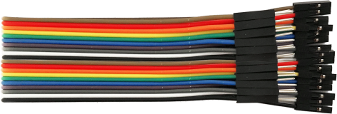
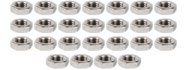
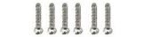
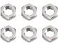
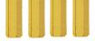
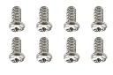
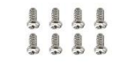
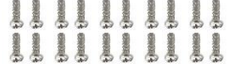
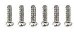
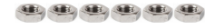
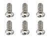
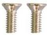
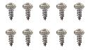
.. |image21| image:: media/34.png
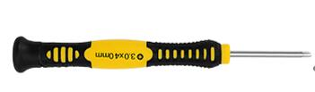
.. |image23| image:: media/36.png
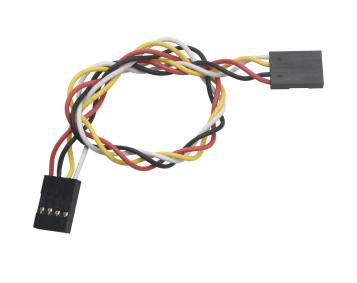
