1. Product introduction
=======================

|image1|

1.1 Introduction
----------------

This motion-sensing glove is developed on the Arduino platform and,
together with the MPU6050 six-axis accelerometer module, can recognize
multiple directional gestures. Compared with traditional button or
toggle operations, gesture control allows you to operate devices at
will.

Through the BT24 Bluetooth master module, the glove can connect to a
mecanum-wheel car, robotic arm, or biped robot, enabling simple gestures
to control car movement, arm gripping, robot walking, and more.

Installation is simple—just snap a few modules together. Additional
modules can be connected on the expansion board to achieve richer
control functions.

To help you better experience the intelligence and convenience of
gesture control, we have prepared multiple Arduino example projects and
code. Starting from the basic control principles of the MPU6050 six-axis
accelerometer module to complex gesture control, you can easily get
started and master the techniques.

1.2 Features
------------

1. Powerful functions: can recognize gestures in different directions.
2. Simple installation: modular assembly with no soldering required.
3. Strong expandability: expansion board reserves common interfaces for
   other sensors.
4. Fundamental programming learning: practice with C language in the
   Arduino IDE.

1.3 Kit list
------------

+-----+---------------------------+-----+-----------------------------------+
| No. | Specification             | Qty | Image                             |
+=====+===========================+=====+===================================+
| 1   | MPU6050 Module            | 1   | |image2|                          |
+-----+---------------------------+-----+-----------------------------------+
| 2   | NANO PLUS Development     | 1   | |image3|                          |
|     | Board                     |     |                                   |
+-----+---------------------------+-----+-----------------------------------+
| 3   | DX-BT24 Bluetooth Master  | 1   | |image4|                          |
|     | Module                    |     |                                   |
+-----+---------------------------+-----+-----------------------------------+
| 4   | NANO Expansion Board      | 1   | |image5|                          |
+-----+---------------------------+-----+-----------------------------------+
| 5   | Glove                     | 1   | |image6|                          |
+-----+---------------------------+-----+-----------------------------------+
| 6   | USB Data Cable            | 1   | |image7|                          |
+-----+---------------------------+-----+-----------------------------------+

1.4 NANO PLUS Development Board
-------------------------------

|image8|

The main-control MCU and USB-to-serial chip on this board are the
ATMEGA328P-AU and CH340, respectively. Its usage is identical to the
Arduino NANO; the only difference is the driver installation method.

It provides 14 digital I/O pins (6 of which can be used as PWM outputs),
8 analog input pins, a 16 MHz crystal oscillator, a Type-C USB port, an
ICSP download header, and a reset button.

The ICSP header is used to flash firmware to the ATMEGA328P-AU via a
computer. Power can be supplied through the Type-C USB port or the VIN +
GND pins (DC 7–12 V).

|image9|

|image10|

The board supports the MCU and can operate via USB power or the VIN +
GND (DC 7–12 V) pins.

Pin/part description:

+-----+-------------------+-----------------------------------------------+
| No. | Pin/Part Name     | Description                                   |
+=====+===================+===============================================+
| 1   | ICSP Header       | Consists of MOSI, MISO, SCK, RESET, VCC, and  |
|     |                   | GND—commonly called the SPI interface. Used   |
|     |                   | to flash firmware to the ATMEGA328P-AU when   |
|     |                   | connected to a PC.                            |
+-----+-------------------+-----------------------------------------------+
| 2   | LED Indicator     | Serial communication indicator. Flashes when  |
|     | (RX)              | the board is receiving data.                  |
+-----+-------------------+-----------------------------------------------+
| 3   | LED Indicator     | Serial communication indicator. Flashes when  |
|     | (TX)              | the board is sending data.                    |
+-----+-------------------+-----------------------------------------------+
| 4   | LED Indicator     | Lights when the board is powered; off         |
|     | (POW)             | otherwise.                                    |
+-----+-------------------+-----------------------------------------------+
| 5   | LED Indicator (L) | Lights when pin D13 is HIGH; off when LOW.    |
+-----+-------------------+-----------------------------------------------+
| 6   | RX0 (D0) TX1 (D1) | 14 digital I/O pins, 6 of which support PWM   |
|     | D2 – D13          | output. These are digital logic input/output  |
|     |                   | pins (0 or 1).                                |
+-----+-------------------+-----------------------------------------------+
| 7   | RST               | Reset pin; an external button can be          |
|     |                   | connected here.                               |
+-----+-------------------+-----------------------------------------------+
| 8   | ATMEGA328P-AU     | The “brain” of the board. See the datasheet   |
|     |                   | for details.                                  |
+-----+-------------------+-----------------------------------------------+
| 9   | Type-C USB        | Serves as power input and for uploading       |
|     |                   | sketches to the board.                        |
+-----+-------------------+-----------------------------------------------+
| 10  | 3V3               | Provides a 3.3 V output.                      |
+-----+-------------------+-----------------------------------------------+
| 11  | REF               | Analog reference pin. Allows an external      |
|     |                   | reference voltage (0 V – 5 V) to be set as    |
|     |                   | the upper limit for analog inputs.            |
+-----+-------------------+-----------------------------------------------+
| 12  | A0–A7             | Eight analog input pins.                      |
+-----+-------------------+-----------------------------------------------+
| 13  | 5V                | 5 V power input/output pin.                   |
+-----+-------------------+-----------------------------------------------+
| 14  | GND               | Ground pin (negative).                        |
+-----+-------------------+-----------------------------------------------+
| 15  | VIN               | External power input pin (DC 7–12 V) for the  |
|     |                   | board.                                        |
+-----+-------------------+-----------------------------------------------+
| 16  | Reset Button      | On-board reset button.                        |
+-----+-------------------+-----------------------------------------------+
| 17  | CH340             | USB-to-serial chip converting USB signals     |
|     |                   | from the PC to serial signals.                |
+-----+-------------------+-----------------------------------------------+
| 18  | AMS1117           | Regulates external DC 7–12 V down to 5 V to   |
|     |                   | power the board.                              |
+-----+-------------------+-----------------------------------------------+

1.5 Gesture-Recognition Glove Expansion Board
---------------------------------------------

This motion-sensing glove expansion board includes a 9 V battery holder,
allowing it to be powered independently.

It features on-board UART and I²C communication interfaces, two buttons
(D7 and D8), and additional sensor connectors.

Assembly is easy—simply plug in the MPU6050 module and the BT24
Bluetooth module.

|image11|

Schematic of operating principle:

|image12|

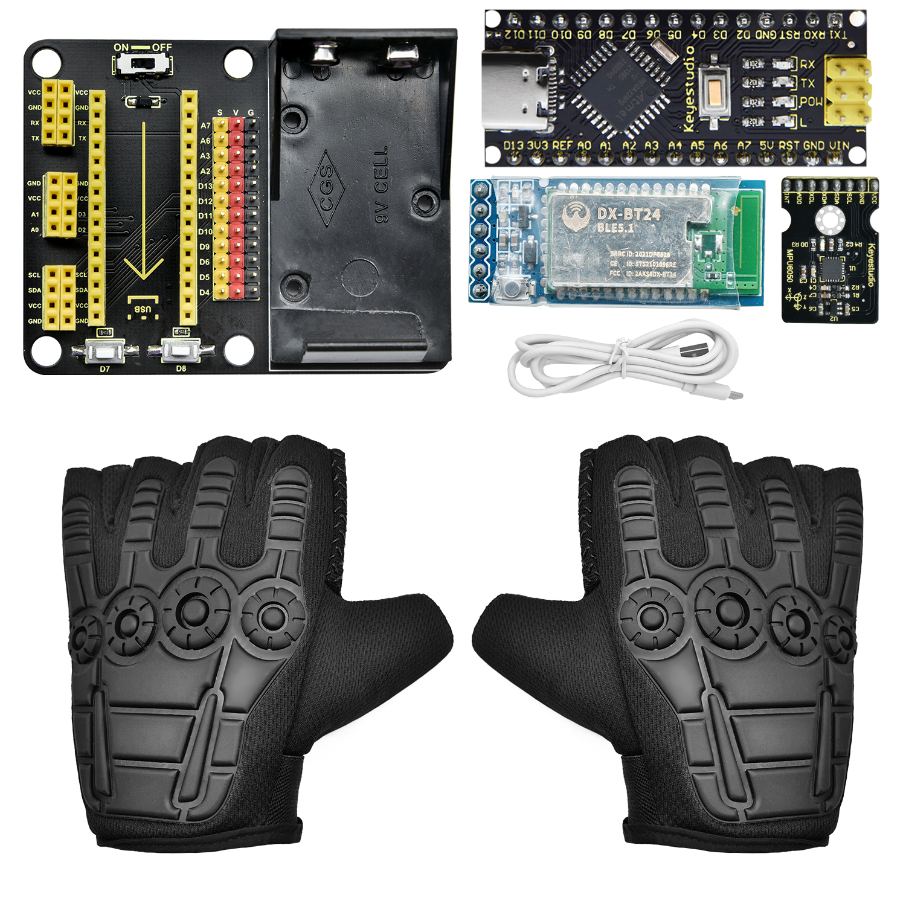
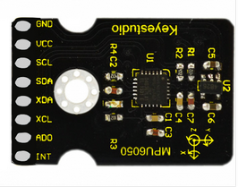
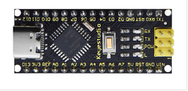
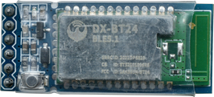
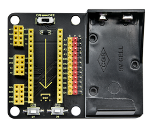
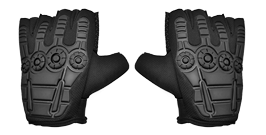
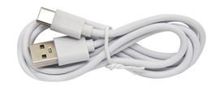
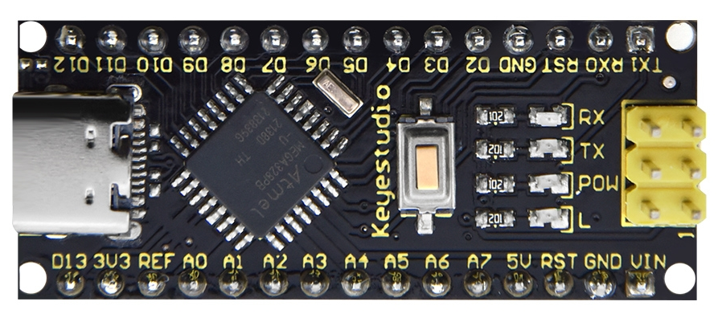
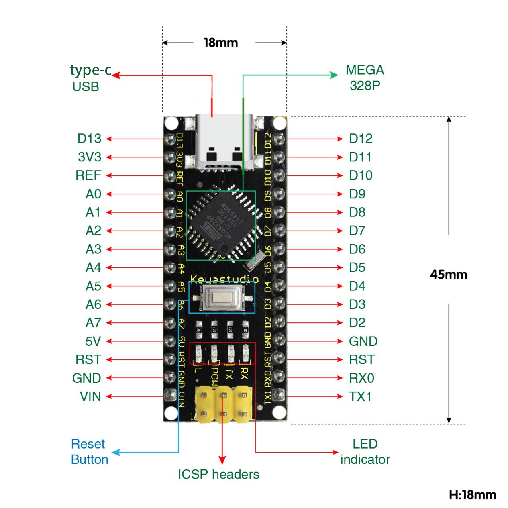
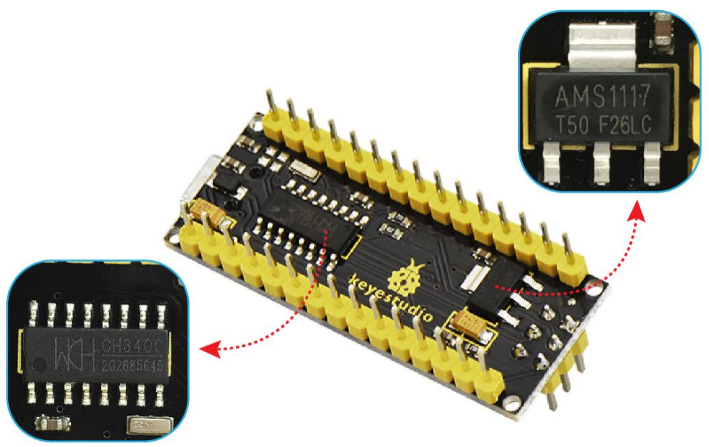
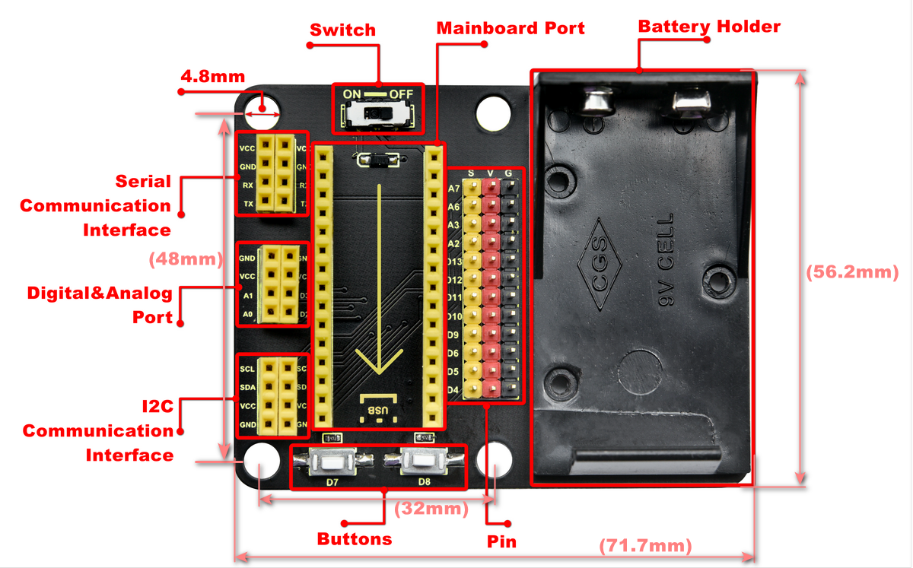
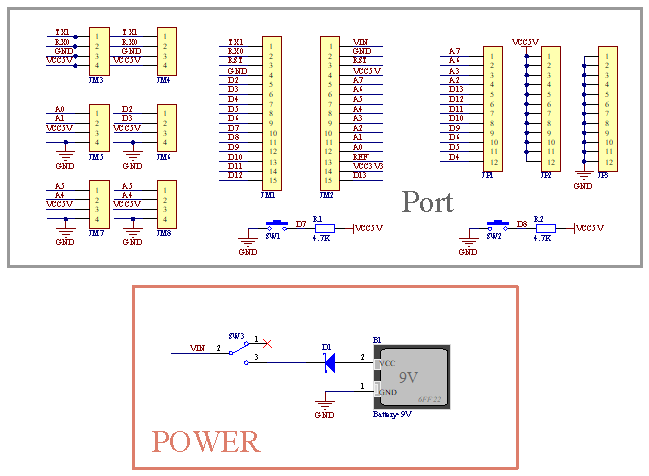
