1. Product introduction
=======================

|image1|

1.1 Introduction
----------------

Nowadays, technological education such as VR, kids’ programming, and
artificial intelligence, has become a mainstream in educational
industry. Thereby, people attach more importance to STEAM education.

As Arduino is notably famous in Maker education sector. Keyestuido surf
this current and launch a smart mini tank robot which is a combination
of Arduino and programming.

So what is Arduino? Arduino is an open-source electronics platform based
on easy-to-use hardware and software. Arduino boards are able to read
inputs - light on a sensor, a finger on a button, or a Twitter message -
and turn it into an output - activating a motor, turning on an LED,
publishing something online.

Based on this, Keyestudio team has designed a mini tank robot. It has a
processor which is programmable using the Arduino IDE, to map its pins
to sensors and actuators by a shield that plug in the processor, and it
reads sensors and controls the actuators and decides how to operate.

It can perform multiple functions like obstacle avoidance, IR remote
control, BT control, light following and so on.

Detailed 15 learning projects, from simple to complex, which guide you
to build up your own smart mini tank robot and provide the basic
knowledge of sensors and modules. Moreover, it is the best choice for
graphical programming education.

1.2 Features
------------

1. Multi-purpose function: Multi-purpose function: Obstacle avoidance,
   following, IR remote control, Bluetooth control, ultrasonic following
   and facial emoticons display.
2. Simple assembly: No soldering circuit required, complete assembly
   easily.
3. High Tenacity: Aluminum alloy bracket, metal motors, high quality
   wheels and tracks.
4. High extension: connect numerous sensors and modules through motor
   driver shield and sensor shield.
5. Multiple controls: IR remote control, App control(iOS and Android
   system)
6. Basic programming：C language code of Arduino IDE.

1.3 Specification
-----------------

- Working voltage: 5v
- Input voltage: 7-12V
- Maximum output current: 2A
- Maximum power dissipation: 25W (T=75℃)
- Motor speed: 5V 200 rpm/min
- Motor drive mode: dual H bridge drive (L298P)
- Ultrasonic induction angle: <15 degrees
- Ultrasonic detection distance: 2cm-400cm
- Infrared remote control distance: 10 meters (measured)
- Bluetooth remote control distance: 50 meters (measured)

1.4 Product List
----------------

+-------------+------------------------------+------+-------------------------+
| Electronic  |                              |      |                         |
| Parts       |                              |      |                         |
+=============+==============================+======+=========================+
| No.         | Name                         | QTY  | Picture                 |
+-------------+------------------------------+------+-------------------------+
| 1           | KEYESTUDIO V4.0 Development  | 1    | |image2|                |
|             | Board                        |      |                         |
+-------------+------------------------------+------+-------------------------+
| 2           | L298P Shield                 | 1    | |image3|                |
+-------------+------------------------------+------+-------------------------+
| 3           | V5 Sensor Shield             | 1    | |image4|                |
+-------------+------------------------------+------+-------------------------+
| 4           | HC-SR04 Ultrasonic Sensor    | 1    | |image5|                |
+-------------+------------------------------+------+-------------------------+
| 5           | HM-10 Bluetooth-4.0 Module   | 1    | |image6|                |
+-------------+------------------------------+------+-------------------------+
| 6           | Remote Control               | 1    | |image7|                |
+-------------+------------------------------+------+-------------------------+
| 7           | 8X16 LED Panel               | 1    | |image8|                |
+-------------+------------------------------+------+-------------------------+
| 8           | HX-2.54 4P Female Dupont     | 1    | |image9|                |
|             | Line                         |      |                         |
+-------------+------------------------------+------+-------------------------+
| 9           | 9G Servo Motor               | 1    | |image10|               |
+-------------+------------------------------+------+-------------------------+
| 10          | IR Receiver Module           | 1    | |image11|               |
+-------------+------------------------------+------+-------------------------+
| 11          | Photocell Sensor             | 2    | |image12|               |
+-------------+------------------------------+------+-------------------------+
| 12          | Red LED                      | 1    | |image13|               |
+-------------+------------------------------+------+-------------------------+
| Components  |                              |      |                         |
+-------------+------------------------------+------+-------------------------+
| 1           | Acrylic Board                | 1    | |image14|               |
+-------------+------------------------------+------+-------------------------+
| 2           | Tank Robot Acrylic Board     | 1    | |image15|               |
+-------------+------------------------------+------+-------------------------+
| 3           | Metal Holder                 | 4    | |image16|               |
+-------------+------------------------------+------+-------------------------+
| 4           | L-type Bracket               | 1    | |image17|               |
+-------------+------------------------------+------+-------------------------+
| 5           | Tank Driver Wheel            | 2    | |image18|               |
+-------------+------------------------------+------+-------------------------+
| 6           | Tank Load-bearing Wheel      | 2    | |image19|               |
+-------------+------------------------------+------+-------------------------+
| 7           | Caterpillar Band             | 2    | |image20|               |
+-------------+------------------------------+------+-------------------------+
| 8           | Metal Motor                  | 2    | |image21|               |
+-------------+------------------------------+------+-------------------------+
| 9           | Plastic Platform (PC)        | 1    | |image22|               |
+-------------+------------------------------+------+-------------------------+
| 10          | USB Cable (1m)               | 1    | |image23|               |
+-------------+------------------------------+------+-------------------------+
| 11          | 2.54 3pin F-F Dupont Wire    | 5    | |image24|               |
|             | 20cm                         |      |                         |
+-------------+------------------------------+------+-------------------------+
| 12          | F-F Dupont Wire (15CM)       | 10   | |image25|               |
+-------------+------------------------------+------+-------------------------+
| 13          | Supportive Parts             | 2    | |image26|               |
|             | (27*27*16MM, Blue)           |      |                         |
+-------------+------------------------------+------+-------------------------+
| 14          | 18650 2-Slot Battery Holder  | 1    | |image27|               |
+-------------+------------------------------+------+-------------------------+
| 15          | （\ **Not                    | 2    | |image28|               |
|             | included**\ ）18650 Battery  |      |                         |
+-------------+------------------------------+------+-------------------------+
| Nuts/Screws |                              |      |                         |
+-------------+------------------------------+------+-------------------------+
| 1           | Copper Bush                  | 2    | |image29|               |
+-------------+------------------------------+------+-------------------------+
| 2           | Flange Bearing               | 4    | |image30|               |
+-------------+------------------------------+------+-------------------------+
| 3           | Hexagon Copper Bush(M3*10MM) | 10   | |image31|               |
+-------------+------------------------------+------+-------------------------+
| 4           | Hexagon Copper Bush          | 4    | |image32|               |
|             | (M3*45MM)                    |      |                         |
+-------------+------------------------------+------+-------------------------+
| 5           | Copper Coupler               | 2    | |image33|               |
+-------------+------------------------------+------+-------------------------+
| 6           | M3*10MM Flat Head Screws     | 3    | |image34|               |
+-------------+------------------------------+------+-------------------------+
| 7           | Inner Hexagon Screws         | 20   | |image35|               |
|             | (M3*6MM)                     |      |                         |
+-------------+------------------------------+------+-------------------------+
| 8           | Inner Hexagon Screws         | 10   | |image36|               |
|             | (M3*8MM)                     |      |                         |
+-------------+------------------------------+------+-------------------------+
| 9           | Inner Hexagon Screws         | 4    | |image37|               |
|             | (M3*25MM)                    |      |                         |
+-------------+------------------------------+------+-------------------------+
| 10          | Inner Hexagon Screws         | 4    | |image38|               |
|             | (M4*12MM)                    |      |                         |
+-------------+------------------------------+------+-------------------------+
| 11          | Inner Hexagon Screws         | 4    | |image39|               |
|             | (M4*40MM)                    |      |                         |
+-------------+------------------------------+------+-------------------------+
| 12          | Inner Hexagon Screws         | 2    | |image40|               |
|             | (M4*50MM)                    |      |                         |
+-------------+------------------------------+------+-------------------------+
| 13          | M3 Nuts                      | 14   | |image41|               |
+-------------+------------------------------+------+-------------------------+
| 14          | M4 Self-locking Nuts         | 2    | |image42|               |
+-------------+------------------------------+------+-------------------------+
| 15          | M2 Nuts                      | 8    | |image43|               |
+-------------+------------------------------+------+-------------------------+
| 16          | M4 Nuts                      | 10   | |image44|               |
+-------------+------------------------------+------+-------------------------+
| 17          | M2*10MM Round Head Screws    | 6    | |image45|               |
+-------------+------------------------------+------+-------------------------+
| 18          | M3*12MM Round Head Screws    | 8    | |image46|               |
+-------------+------------------------------+------+-------------------------+
| Tools       |                              |      |                         |
+-------------+------------------------------+------+-------------------------+
| 1           | 2.0*40MM Blue and Black      | 1    | |image47|               |
|             | Slotted Screwdriver          |      |                         |
+-------------+------------------------------+------+-------------------------+
| 2           | 2.0*40MM Purple and Black    | 1    | |image48|               |
|             | Phillips Screwdriver         |      |                         |
+-------------+------------------------------+------+-------------------------+
| 3           | M1.5 Hex Key Nickel Plated   | 1    | |image49|               |
|             | Allen Wrench                 |      |                         |
+-------------+------------------------------+------+-------------------------+
| 4           | M2.5 Hex Key Nickel Plated   | 1    | |image50|               |
|             | Allen Wrench                 |      |                         |
+-------------+------------------------------+------+-------------------------+
| 5           | M3 Hex Key Nickel Plated     | 1    | |image51|               |
|             | Allen Wrench                 |      |                         |
+-------------+------------------------------+------+-------------------------+
| 6           | Nylon Cable Ties             | 6    | |image52|               |
+-------------+------------------------------+------+-------------------------+
| 7           | 8MM Winding Pipe             | 12CM | |image53|               |
+-------------+------------------------------+------+-------------------------+
| 8           | Decorative Cardboard         | 1    | |image54|               |
+-------------+------------------------------+------+-------------------------+

1.5 Keyestudio V4.0 Development Board
-------------------------------------

You need to know that keyestudio V4.0 development board is the core of
this smart car.

|image55|

keyestudio V4.0 development board is an Arduino uno-compatible board,
which is based on ATmega328P MCU, and with a cp2102 Chip as a
UART-to-USB converter.

|image56|

It has 14 digital input/output pins (of which 6 can be used as PWM
outputs), 6 analog inputs, a 16 MHz quartz crystal, a USB connection, a
power jack, 2 ICSP headers and a reset button.

|image57|

It contains everything needed to support the microcontroller. Simply
connect it to a computer with a USB cable or power it via an external DC
power jack (DC 7-12V) or via female headers Vin/ GND(DC 7-12V) to get
started.

+----------------------+-----------------------------------------------+
| Microcontroller      | ATmega328P-PU                                 |
+======================+===============================================+
| Operating Voltage    | 5V                                            |
+----------------------+-----------------------------------------------+
| Input Voltage        | DC7-12V                                       |
| (recommended)        |                                               |
+----------------------+-----------------------------------------------+
| Digital I/O Pins     | 14 (D0-D13) (of which 6 provide PWM output)   |
+----------------------+-----------------------------------------------+
| PWM Digital I/O Pins | 6 (D3, D5, D6, D9, D10, D11)                  |
+----------------------+-----------------------------------------------+
| Analog Input Pins    | 6 (A0-A5)                                     |
+----------------------+-----------------------------------------------+
| DC Current per I/O   | 20 mA                                         |
| Pin                  |                                               |
+----------------------+-----------------------------------------------+
| DC Current for 3.3V  | 50 mA                                         |
| Pin                  |                                               |
+----------------------+-----------------------------------------------+
| Flash Memory         | 32 KB (ATmega328P-PU) of which 0.5 KB used by |
|                      | bootloader                                    |
+----------------------+-----------------------------------------------+
| SRAM                 | 2 KB (ATmega328P-PU)                          |
+----------------------+-----------------------------------------------+
| EEPROM               | 1 KB (ATmega328P-PU)                          |
+----------------------+-----------------------------------------------+
| Clock Speed          | 16 MHz                                        |
+----------------------+-----------------------------------------------+
| LED_BUILTIN          | D13                                           |
+----------------------+-----------------------------------------------+

.. |image1| image:: ./media/image-20250902113848702.png
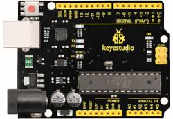
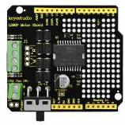
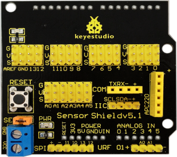
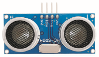
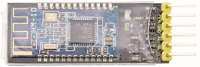

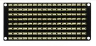
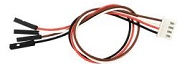
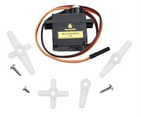
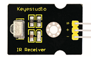
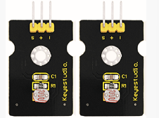
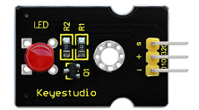

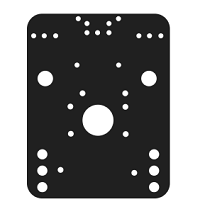
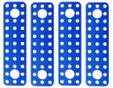
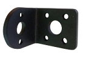
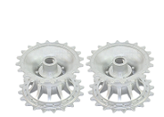
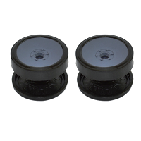
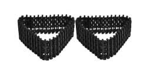
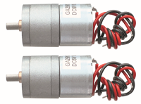
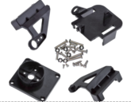
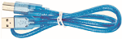
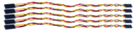
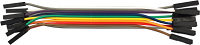
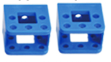
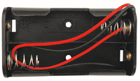
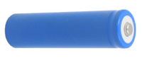
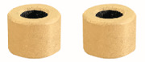
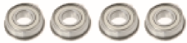
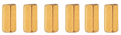
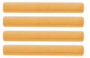
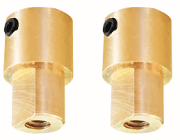
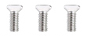
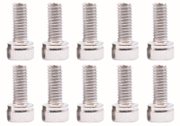
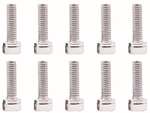
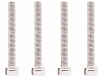
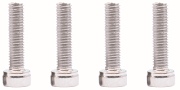
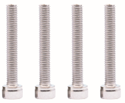
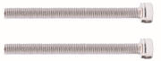
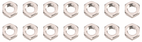
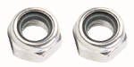
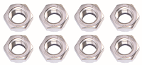
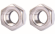
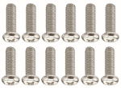
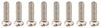
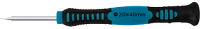
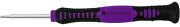

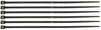
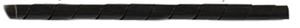

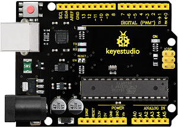
.. |image56| image:: ./media/image-20250902134315550.png
.. |image57| image:: ./media/image-20250902134544777.png
