1.Getting started with 4WD robot
================================

.. figure:: media/A1.png
   :alt: image-20230425133641976

   image-20230425133641976

1.1 Introduction
----------------

The newly upgraded 4WD Multi-purpose car is one of the most popular
Arduino sets. It not only has a beautiful appearance but also powerful
functions. In addition to the usual functions of line tracking, obstacle
avoidance and remote control, it also uses facial expressions to make
lovely expressions.  Furthermore, you empower to expand your own
projects, or add other sensors to complete your exploration. 

Most of the components are connected via screws and copper pillars,
thereby you can build your own robot through a few simple assembly
steps.

What’s more, the basic knowledge such as line tracking, obstacle
avoidance sensors, ultrasonic ranging, Bluetooth communication, motor
drivers as well as IR remote controls are accessible for us to learn.   

This product boasts 17 learning projects, from simple to complex, which will guide you to
make an Arduino robot. 

1.2 Kit list
------------

+-----------------+-----------------+-----------------+-----------------+
| #               | Name            | QTY             | Picture         |
+=================+=================+=================+=================+
| 1               | Keyestudio V4.0 | 1               | |image1|        |
|                 | Board(UNO       |                 |                 |
|                 | compatible)     |                 |                 |
+-----------------+-----------------+-----------------+-----------------+
| 2               | Keyestudio      | 1               | |image2|        |
|                 | Motor Driver    |                 |                 |
|                 | Expansion Board |                 |                 |
+-----------------+-----------------+-----------------+-----------------+
| 3               | Bluetooth       | 1               | |image3|        |
|                 | Module          |                 |                 |
+-----------------+-----------------+-----------------+-----------------+
| 4               | Red LED Module  | 1               | |image4|        |
+-----------------+-----------------+-----------------+-----------------+
| 5               | Ultrasonic      | 1               | |image5|        |
|                 | Sensor          |                 |                 |
+-----------------+-----------------+-----------------+-----------------+
| 6               | Keyestudio Line | 1               | |image6|        |
|                 | Tracking Sensor |                 |                 |
+-----------------+-----------------+-----------------+-----------------+
| 7               | Keyestudio 8*16 | 1               | |image7|        |
|                 | LED Board (4Pin |                 |                 |
|                 | Connection      |                 |                 |
|                 | Wire)           |                 |                 |
+-----------------+-----------------+-----------------+-----------------+
| 8               | Servo           | 1               | |image8|        |
+-----------------+-----------------+-----------------+-----------------+
| 9               | IR Remote       | 1               | |image9|        |
|                 | Control         |                 |                 |
+-----------------+-----------------+-----------------+-----------------+
| 10              | USB Cable       | 1               | |image10|       |
+-----------------+-----------------+-----------------+-----------------+
| 11              | 18650 Battery   | 1               | |image11|       |
|                 | Holder          |                 |                 |
+-----------------+-----------------+-----------------+-----------------+
| 12              | 6 AA Battery    | 1               | |image12|       |
|                 | Holder          |                 |                 |
+-----------------+-----------------+-----------------+-----------------+
| 13              | Cradle Head     | 1               | |image13|       |
+-----------------+-----------------+-----------------+-----------------+
| 14              | 150MM           | 1               | |image14|       |
|                 | JST-PH2.0MM-5P  |                 |                 |
|                 | 24AWG Wire      |                 |                 |
+-----------------+-----------------+-----------------+-----------------+
| 15              | 150MM           | 1               | |image15|       |
|                 | PH2.0mm-4P to   |                 |                 |
|                 | 2.54 Dupont     |                 |                 |
|                 | Wire            |                 |                 |
+-----------------+-----------------+-----------------+-----------------+
| 16              | Acrylic Board   | 1               | |image16|       |
+-----------------+-----------------+-----------------+-----------------+
| 17              | Keyestudio Top  | 1               | |image17|       |
|                 | Board           |                 |                 |
+-----------------+-----------------+-----------------+-----------------+
| 18              | Keyestudio Base | 1               | |image18|       |
|                 | Board           |                 |                 |
+-----------------+-----------------+-----------------+-----------------+
| 19              | Fixed Parts     | 4               | |image19|       |
+-----------------+-----------------+-----------------+-----------------+
| 20              | Wheels          | 4               | |image20|       |
+-----------------+-----------------+-----------------+-----------------+
| 21              | M3*10MM         | 10              | |image21|       |
|                 | Dual-pass       |                 |                 |
|                 | Copper Pillar   |                 |                 |
+-----------------+-----------------+-----------------+-----------------+
| 22              | M3*40MM         | 4               | |image22|       |
|                 | Dual-pass       |                 |                 |
|                 | Copper Pillar   |                 |                 |
+-----------------+-----------------+-----------------+-----------------+
| 23              | M3*30MM Round   | 8               | |image23|       |
|                 | Head Screw      |                 |                 |
+-----------------+-----------------+-----------------+-----------------+
| 24              | M3*6MM Round    | 40              | |image24|       |
|                 | Head Screw      |                 |                 |
+-----------------+-----------------+-----------------+-----------------+
| 25              | M3              | 16              | |image25|       |
|                 | Nickle-plated   |                 |                 |
|                 | Nut             |                 |                 |
+-----------------+-----------------+-----------------+-----------------+
| 26              | M2*8MM Round    | 6               | |image26|       |
|                 | Head Screw      |                 |                 |
+-----------------+-----------------+-----------------+-----------------+
| 27              | M3*8MM Round    | 4               | |image27|       |
|                 | Head Screw      |                 |                 |
+-----------------+-----------------+-----------------+-----------------+
| 28              | M2              | 6               | |image28|       |
|                 | Nickle-plated   |                 |                 |
|                 | Nut             |                 |                 |
+-----------------+-----------------+-----------------+-----------------+
| 29              | M3*10MM Flat    | 3               | |image29|       |
|                 | Head Screw      |                 |                 |
+-----------------+-----------------+-----------------+-----------------+
| 30              | Motor           | 4               | |image30|       |
+-----------------+-----------------+-----------------+-----------------+
| 31              | Screwdriver     | 1               | |image31|       |
+-----------------+-----------------+-----------------+-----------------+
| 32              | Black Tie       | 6               | |image32|       |
+-----------------+-----------------+-----------------+-----------------+
| 33              | Winding Pipe    | 1               | |image33|       |
+-----------------+-----------------+-----------------+-----------------+
| 34              | 20CM 3pin F-F   | 1               | |image34|       |
|                 | Dupont Cable    |                 |                 |
+-----------------+-----------------+-----------------+-----------------+
| 35              | Decorative Card | 1               | |image35|       |
+-----------------+-----------------+-----------------+-----------------+
| 36              | Blue Jumper Cap | 4               | |image36|       |
+-----------------+-----------------+-----------------+-----------------+
| 37              | Red Jumper Cap  | 4               | |image37|       |
+-----------------+-----------------+-----------------+-----------------+
| 38              | Tracking Runway | 1               | |image38|       |
+-----------------+-----------------+-----------------+-----------------+

1.3 Features
------------

- Multi-purpose function: Obstacle avoidance, following, IR remote
  control, Bluetooth control, confined with a circle, gravity control as
  well as facial emoticons display.

- Simple assembly: No soldering circuit required, simple assembly.

- Sturdy construction : 4WD construction, 4 premium motors and wheels.

- High extension: It can expand other sensors and modules via a motor
  driver expansion board.

- Multiple controls: IR remote control, App control(iOS and Android
  system)

- Basic programming：C language code of Arduino IDE.

1.4 Specification
-----------------

- Working voltage: 5V

- Input voltage: 6-9V

- Maximum output current: 2A

- Maximum power dissipation: 25W (T=75℃)

- Motor speed: 5V 200 rpm

- Motor drive mode: DRV8833 motor driver

- Ultrasonic induction angle: <15 degrees

- Ultrasonic detection distance: 2cm-400cm

- Infrared remote control distance: 10M (measured)

- Bluetooth remote control distance: 50M(measured)

- Bluetooth control: support Android and iOS system

1.5 Development Board
---------------------

You need to know that keyestudio V4.0 development board is the core of
this 4WD BT Multi-purpose Car V2.0.

|image39|

Keyestudio V4.0 development board is an Arduino Uno -compatible board,
which is based on ATmega328P MCU, and with a CP2102 chip as a
UART-to-USB converter.

|image40|

It has 14 digital input/output pins (of which 6 can be used as PWM
outputs), 6 analog inputs, a 16 MHz quartz crystal, a USB connection, a
power jack, 2 ICSP headers and a reset button.

|image41|

It contains everything needed to support the microcontroller: simply
connect it to a computer with a USB cable or power it via an external DC
power jack (DC 7-12V) or via female headers Vin/GND (DC 7-12V) to get
started.

+----------------------+-----------------------------------------------+
| Microcontroller      | ATmega328P-PU                                 |
+======================+===============================================+
| Operating Voltage    | 5V                                            |
+----------------------+-----------------------------------------------+
| Input Voltage        | DC 7-12V                                      |
| (recommended)        |                                               |
+----------------------+-----------------------------------------------+
| Digital I/O Pins     | 14 (D0-D13) (of which 6 provide PWM output)   |
+----------------------+-----------------------------------------------+
| PWM Digital I/O Pins | 6 (D3, D5, D6, D9, D10, D11)                  |
+----------------------+-----------------------------------------------+
| Analog Input Pins    | 6 (A0-A5)                                     |
+----------------------+-----------------------------------------------+
| DC Current per I/O   | 20 mA                                         |
| Pin                  |                                               |
+----------------------+-----------------------------------------------+
| DC Current for 3.3V  | 50 mA                                         |
| Pin                  |                                               |
+----------------------+-----------------------------------------------+
| Flash Memory         | 32 KB (ATmega328P-PU) of which 0.5 KB used by |
|                      | bootloader                                    |
+----------------------+-----------------------------------------------+
| SRAM                 | 2 KB (ATmega328P-PU)                          |
+----------------------+-----------------------------------------------+
| EEPROM               | 1 KB (ATmega328P-PU)                          |
+----------------------+-----------------------------------------------+
| Clock Speed          | 16 MHz                                        |
+----------------------+-----------------------------------------------+
| Onboard LED          | D13                                           |
+----------------------+-----------------------------------------------+

1.6 Motor shield
----------------

**Description**\ ：

The 8833 board adopts the 8833 motor driver chip driven by two-channel H
bridges , and the maximum driving current of a single channel is up to
1.5A, and the terminal of PH2.0 is used.

The IR receiver module is also integrated on the board. Furthermore,
there are many PH2.0 expansion interfaces on the board such as
ultrasonic interface, analog interface, three-channel tracking interface
as well as pin interfaces with Bluetooth and motor driver.

**Specification**\ ：

+-------------------------+--------------------------------------------+
| Voltage                 | USB 5V，DC 6-9V                            |
+=========================+============================================+
| Current                 | The maximum output is 3A, the actual       |
|                         | output is about 1A (it’s 2A when the motor |
|                         | is loaded)                                 |
+-------------------------+--------------------------------------------+
| Maximum power           | 27W（The actual value is about 9W）        |
+-------------------------+--------------------------------------------+
| Working temperature     | -10~50 Degree                              |
+-------------------------+--------------------------------------------+
| Dimension               | 69x56x18mm                                 |
+-------------------------+--------------------------------------------+
| Weight                  | 25.5g                                      |
+-------------------------+--------------------------------------------+
| Environmental           | ROHS                                       |
| protection attributes   |                                            |
+-------------------------+--------------------------------------------+

**Function**\ ：

|image42|

**Schematic Diagram**\ ：

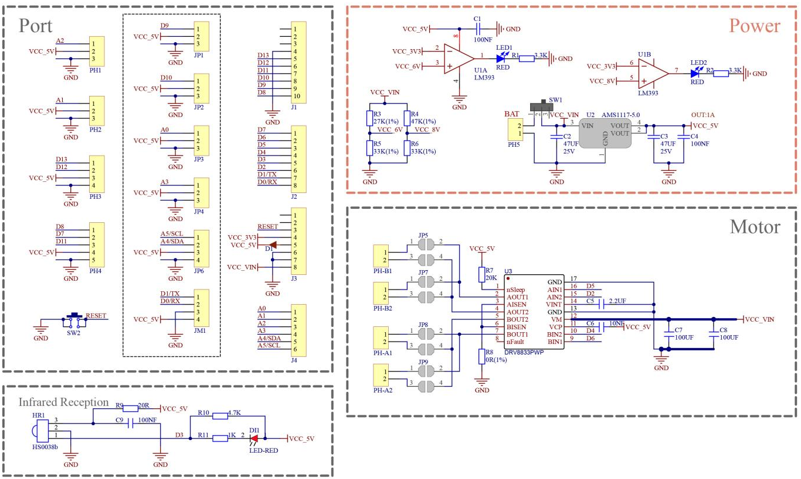

   image-20250513140932577

.. |image1| image:: media/A2.png
.. |image2| image:: media/A3.png
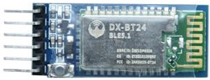
.. |image4| image:: media/A5.png
.. |image5| image:: media/A6.png
.. |image6| image:: media/A7.png
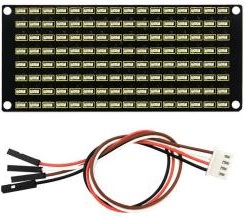
.. |image8| image:: media/A9.jpeg
.. |image9| image:: media/A10.png
.. |image10| image:: media/A11.png
.. |image11| image:: media/A12.png
.. |image12| image:: media/A13.png
.. |image13| image:: media/A14.png
.. |image14| image:: media/A15.png
.. |image15| image:: media/A16.png
.. |image16| image:: media/A17.png
.. |image17| image:: media/A18.png
.. |image18| image:: media/A19.png
.. |image19| image:: media/A20.png
.. |image20| image:: media/A21.png
.. |image21| image:: media/A22.png
.. |image22| image:: media/A23.png
.. |image23| image:: media/A24.png
.. |image24| image:: media/A25.png
.. |image25| image:: media/A26.png
.. |image26| image:: media/A27.png
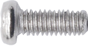
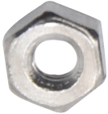
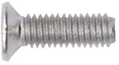
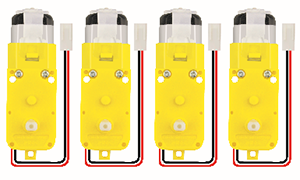
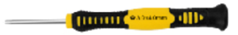
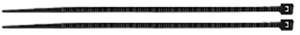
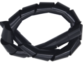
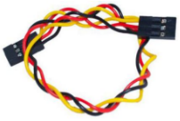
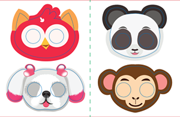
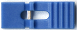
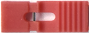
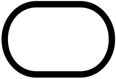
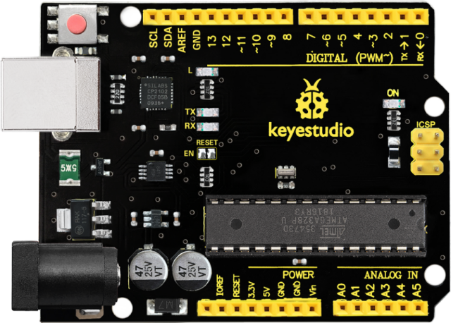
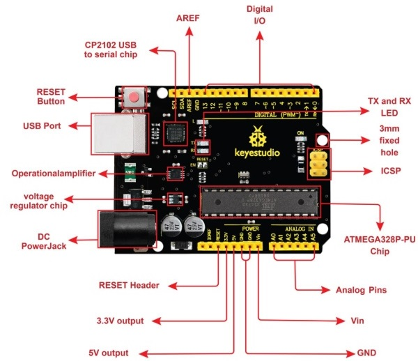
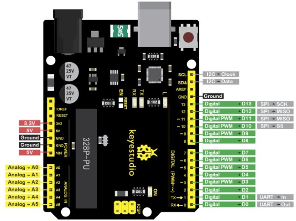
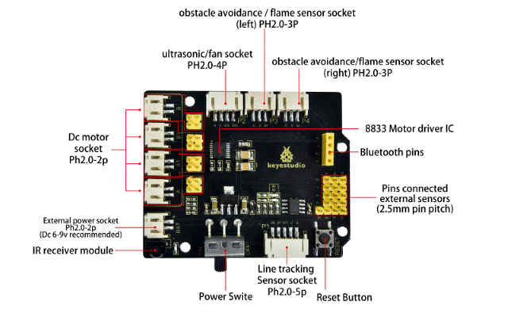
