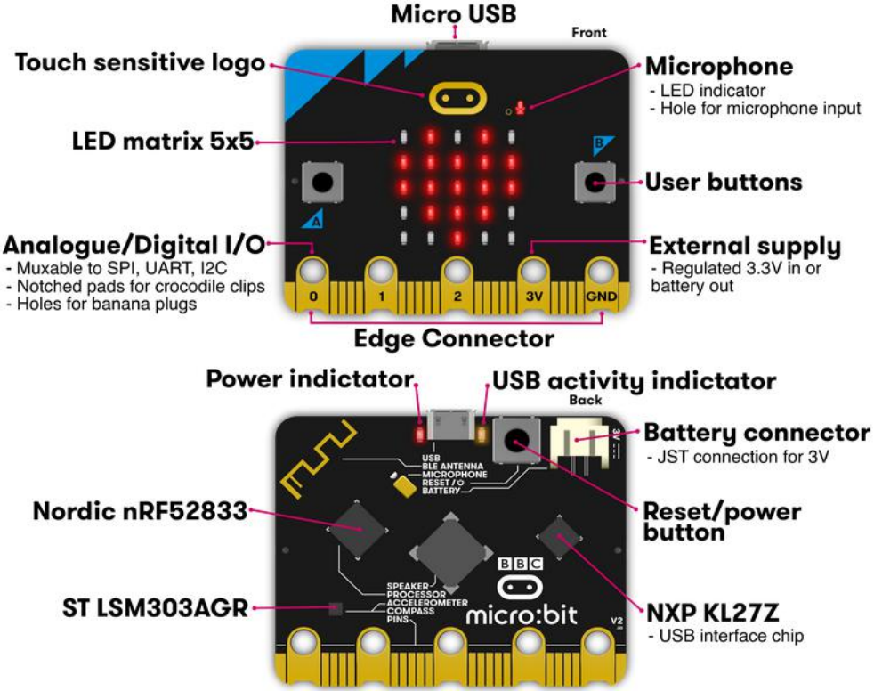
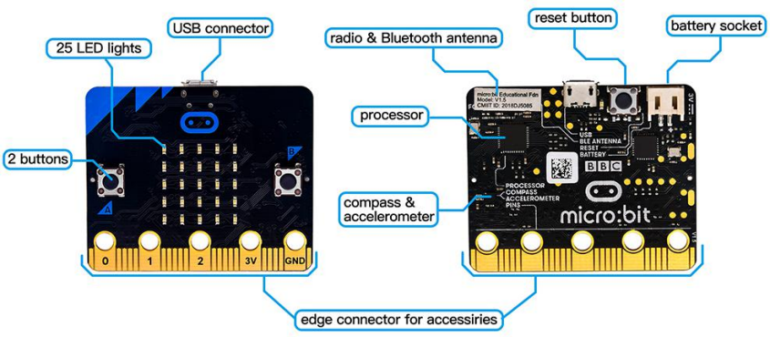
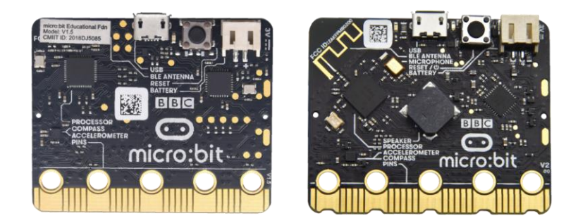
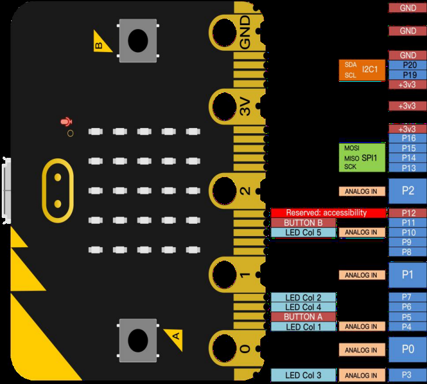
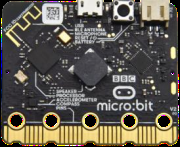
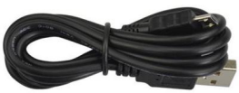
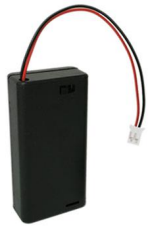
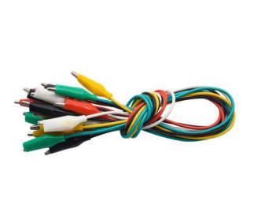
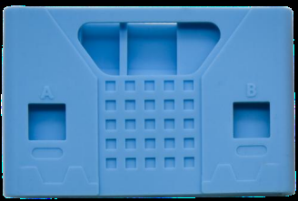

1. Introduction

(1)What is Micro:bit?
~~~~~~~~~~~~~~~~~~~~~

Designed by BBC, Micro:bit main board aims to help children aged above
10 years old to have a better learning of programming.

It is equipped with loads of components, including a :math:`5 \times 5`
LED dot matrix, 2 programmable buttons, a compass, a Micro USB interface
and a Bluetooth module and others. Though it is just the size of a
credit card, it boasts multiple functions. To name just a few, it can be
applied in programming video games,

making interactions between light and sound, controlling a robot,
conducting scientific experiments, developing wearable devices and make
some cool inventions like robots and musical instruments, basically
everything imaginable.

The new version, that’s the version 2.0, of Micro:bit main board has a
touch- sensitive logo and a MEMS microphone. And there is a speaker
built in the other side of the board which makes playing all kinds of
sound possible without any external equipment. The golden fingers and
gears added provide a better fixing of crocodile clips. Moreover, this
board has a sleeping mode to lower power consumption of batteries and it
can be entered if users long press the Reset & Power button on the back
of it. More importantly, the CPU capacity of this version is much better
than that of the V1.5 and the V2 has more RMA.

In final analysis, the Micro:bit main board V2 can allow customers to
explore more functions so as to make more innovative products.

(2) Comparison between V2.0 & V1.5
~~~~~~~~~~~~~~~~~~~~~~~~~~~~~~~~~~

|image1|

Micro:bit main Board V2.0

|image2|

Micro:bit main Board V1.5

More details:
=============

|image3|

+-------------------+-----------------------------+-----------------------------+
|                   | V1.5                        | V2                          |
+===================+=============================+=============================+
| **PROCESSOR**     | Nordic Semiconductor        | Nordic Semiconductor        |
|                   | nRF51822                    | nRF52833                    |
+-------------------+-----------------------------+-----------------------------+
| **MEMORY**        | 256KB Flash, 16KB RAM       | 512KB Flash, 128KB RAM      |
+-------------------+-----------------------------+-----------------------------+
| **INTERFACECHIP** | NXP KL26Z, 16KB RAM         | NXP KL27Z, 32KB RAM         |
+-------------------+-----------------------------+-----------------------------+
| **MICROPHONE**    | N/A                         | MEMS microphone and LED     |
|                   |                             | indicator                   |
+-------------------+-----------------------------+-----------------------------+
| **SPEAKER**       | N/A                         | On board speaker            |
+-------------------+-----------------------------+-----------------------------+
| **TOUCH**         | N/A                         | Touch sensitive logo        |
+-------------------+-----------------------------+-----------------------------+
| **EDGE            | 25pins, PWM, I2C, SPI and   | 25pins, PWM, I2C, SPI and   |
| CONNECTOR**       | Extension interface. 3 ring | Extension interface. 3 ring |
|                   | pins for connecting         | pins for connecting         |
|                   | crocodile clips/banana      | crocodile clips/banana      |
|                   | plugs.                      | plugs.                      |
+-------------------+-----------------------------+-----------------------------+
|                   | 3 dedicated GPIO            | 4 dedicated GPIO, Notched   |
|                   |                             | for easier connection       |
+-------------------+-----------------------------+-----------------------------+
| **I2C**           | Shared (mux) I2C bus        | Dedicated I2C bus           |
+-------------------+-----------------------------+-----------------------------+
| **WIRELESS**      | 2.4GHz Radio/BLE Bluetooth  | 2.4GHz Radio/BLE Bluetooth  |
|                   | 4.0                         | 5.0                         |
+-------------------+-----------------------------+-----------------------------+
| **POWER**         | Micro USB 5V power supply,  | Micro USB 5V power supply,  |
|                   | 3V port or battery power    | 3V port or battery power    |
|                   | supply                      | supply, LED Indicator,      |
|                   |                             | Power off (push and hold    |
|                   |                             | power button)               |
+-------------------+-----------------------------+-----------------------------+
| **CURRENT         | 90mA                        | 200mA                       |
| AVAILABLE**       |                             |                             |
+-------------------+-----------------------------+-----------------------------+
| **MOTION SENSOR** | ST LSM 303                  | ST LSM 303                  |
+-------------------+-----------------------------+-----------------------------+
| **PROGRAMMING     | C++, Makecode, Python,      | C++, Makecode, Python,      |
| SOFTWARE**        | Scratch                     | Scratch                     |
+-------------------+-----------------------------+-----------------------------+
| **SIZE**          | 5cm(W) x 4cm(H)             | 5cm(W) x 4cm(H)             |
+-------------------+-----------------------------+-----------------------------+

For the Micro: Bit main board V2, pressing the Reset & Power button, it
will reset the Micro: Bit and rerun the program. If you hold it tight,
the red LED will slowly get darker. When the power indicator flickers
into darkness, releasing the button and your Micro: Bit board will enter
sleep mode for power saving. This will make your battery more durable.
And you could press this button again to ‘wake up’ your Micro: bit.

(3) Pinout
~~~~~~~~~~

Micro: bit main board V2.0 VS V1.5

|image4|

( 4 )Notes for the application of Micro:bit main board V2.0
~~~~~~~~~~~~~~~~~~~~~~~~~~~~~~~~~~~~~~~~~~~~~~~~~~~~~~~~~~~

a. It is recommended to cover it with a silicone protector to prevent
   short circuit for it has a lot of sophisticated electronic
   components.

b. Its IO port is very weak in driving since it can merely handle
   current less than 300mA. Therefore, do not connect it with devices
   operating in large current,such as servo MG995 and DC motor or it
   will get burnt. Furthermore, you must figure out the current
   requirements of the devices before you use them and it is generally
   recommended to use the board together with a Micro:bit shield.

c. It is recommended to power the main board via the USB interface or
   via the battery of 3V. The IO port of this board is 3V, so it does
   not support sensors of 5V. If you need to connect sensors of 5 V, a
   Micro: Bit expansion board is required.

d.When using pins(P3, P4, P6, P7, P10)shared with the LED dot matrix,
blocking them from the matrix or the LEDs may display randomly and the
data about sensors connected maybe wrong.

e.The battery port of 3V cannot be connected with battery more than 3.3V
or the main board will be damaged. f. Forbid to operate it on metal
products to avoid short circuit.

To put it simple, Micro:bit V2 main board is like a micro computer which
has made programming at our fingertips and enhanced digital innovation.
And about the programming environment, BBC provides a website:

https://microbit.org/code/, which has a graphical MakeCode program easy
for use.

2. Kit List
-----------

+------------+-------------------------+-----+-----------------------------+
| Components |                         |     |                             |
+============+=========================+=====+=============================+
| #          | Model                   | QTY | Picture                     |
+------------+-------------------------+-----+-----------------------------+
| 1          | Micro:bit Main Board V2 | 1   | |图片描述|                  |
+------------+-------------------------+-----+-----------------------------+
| 2          | Micro USB Cable         | 1   | |image5|                    |
+------------+-------------------------+-----+-----------------------------+
| 3          | Battery Holder          | 1   | |image6|                    |
+------------+-------------------------+-----+-----------------------------+
| 4          | Crocodile Clip          | 10  | |image7|                    |
+------------+-------------------------+-----+-----------------------------+
| 5          | Micro:bit Protective    | 1   | |image8|                    |
|            | Case                    |     |                             |
+------------+-------------------------+-----+-----------------------------+

