1. 产品介绍
===========

1.1 产品简介
------------

你想学习编程知识吗?

只要你对科学充满热情，敢于探索新事物，这个Keyes
入门学习套件基础工具包一定是你的最佳选择。这个工具包提供了Arduino编程、scratch图形化编程和mixly图形化编程。用一个控制器（Plus控制板），许多传感器/模块和电子元件，你可以做许多精彩的DIY项目。该工具包的附带20个项目教程，每个教程都有详细的接线图、元件知识和迷人的项目代码等，完全适合初学者。你可以学习电子、物理、科学和编程很多知识。

1.2 清单
--------

当收到这个Keyes
入门学习套件基础工具包的时候，首先看到是一个包装精美的外盒，每个配件被安全且有序的装在外盒里面的小袋子里，先来清点一下：\ **(KE3014含Plus开发板，KE3013不含Plus开发板)**

+------+--------------+------+-------------------------------------------------+
| 序号 | 名称         | 数量 | 图片                                            |
+======+==============+======+=================================================+
| 1    | Plus开发板   | 1    | |image1|                                        |
+------+--------------+------+-------------------------------------------------+
| 2    | 蓝色LED      | 10   | |image2|                                        |
+------+--------------+------+-------------------------------------------------+
| 3    | 红色LED      | 10   | |image3|                                        |
+------+--------------+------+-------------------------------------------------+
| 4    | 黄色LED      | 10   | |image4|                                        |
+------+--------------+------+-------------------------------------------------+
| 5    | 绿色LED      | 10   | |image5|                                        |
+------+--------------+------+-------------------------------------------------+
| 6    | 白色LED      | 10   | |image6|                                        |
+------+--------------+------+-------------------------------------------------+
| 7    | RGB          | 1    | |image7|                                        |
+------+--------------+------+-------------------------------------------------+
| 8    | 220Ω电阻     | 10   | |image8|                                        |
+------+--------------+------+-------------------------------------------------+
| 9    | 10KΩ电阻     | 10   | |image9|                                        |
+------+--------------+------+-------------------------------------------------+
| 10   | 1KΩ电阻      | 10   | |image10|                                       |
+------+--------------+------+-------------------------------------------------+
| 11   | 4.7KΩ电阻    | 10   | |image11|                                       |
+------+--------------+------+-------------------------------------------------+
| 12   | 10KΩ电位器   | 1    | |image12|                                       |
+------+--------------+------+-------------------------------------------------+
| 13   | 有源蜂鸣器   | 1    | |image13|                                       |
+------+--------------+------+-------------------------------------------------+
| 14   | 无源蜂鸣器   | 1    | |image14|                                       |
+------+--------------+------+-------------------------------------------------+
| 15   | 按键开关     | 4    | |image15|                                       |
+------+--------------+------+-------------------------------------------------+
| 16   | 倾斜开关     | 1    | |image16|                                       |
+------+--------------+------+-------------------------------------------------+
| 17   | 光敏电阻     | 3    | |image17|                                       |
+------+--------------+------+-------------------------------------------------+
| 18   | 火焰传感器   | 1    | |image18|                                       |
+------+--------------+------+-------------------------------------------------+
| 19   | 10K热敏电阻  | 1    | |image19|                                       |
+------+--------------+------+-------------------------------------------------+
| 20   | 黄帽         | 2    | |image20|                                       |
+------+--------------+------+-------------------------------------------------+
| 21   | 蓝帽         | 2    | |image21|                                       |
+------+--------------+------+-------------------------------------------------+
| 22   | IC 74HC595N  | 1    | |image22|                                       |
+------+--------------+------+-------------------------------------------------+
| 22   | 一位数码管   | 1    | |image23|                                       |
+------+--------------+------+-------------------------------------------------+
| 23   | 四位数码管   | 1    | |image24|                                       |
+------+--------------+------+-------------------------------------------------+
| 24   | 8*8点阵屏    | 1    | |image25|                                       |
+------+--------------+------+-------------------------------------------------+
| 25   | 1602 I2C LCD | 1    | |image26|                                       |
+------+--------------+------+-------------------------------------------------+
| 26   | S8050三极管  | 2    | |image27|                                       |
+------+--------------+------+-------------------------------------------------+
| 27   | S8550三极管  | 2    | |image28|                                       |
+------+--------------+------+-------------------------------------------------+
| 28   | 风扇叶       | 1    | |image29|                                       |
+------+--------------+------+-------------------------------------------------+
| 29   | 直流电机     | 1    | |image30|                                       |
+------+--------------+------+-------------------------------------------------+
| 30   | 面包板连接线 | 30   | |image31|                                       |
+------+--------------+------+-------------------------------------------------+
| 31   | 公对母杜邦线 | 10   | |image32|                                       |
+------+--------------+------+-------------------------------------------------+
| 32   | 400孔面包板  | 1    | |image33|                                       |
+------+--------------+------+-------------------------------------------------+
| 33   | USB线        | 1    | |image34|                                       |
+------+--------------+------+-------------------------------------------------+
| 34   | 电阻卡       | 1    | |image35|                                       |
+------+--------------+------+-------------------------------------------------+

1.3 Keyestudio Uno PLUS控制板
-----------------------------

在我们开始Keyes 2021入门学习套件高级版工具包之前，我们首先介绍Keyestudio
Uno PLUS控制板，它是所有项目的核心。Keyestudio Uno
PLUS控制板完全兼容Arduino IDE开发环境的控制板，包含Arduino UNO
R3的所有功能，并且在 UNO
R3板的基础上，我们做了一些改进，使它的功能更加强大。它是学习如何构建电路和设计自己的代码的最好的选择。让我们得到更详细的相关信息。

|image36|

规格参数：

微控制器：ATMEGA328P-AU

USB转串口芯片：CP2102

工作电压：DC 5V

外接电源: DC 6-15V（建议9V）

数字I/O引脚: 14 (D0-D13)

PWM通道：6 (D3 D5 D6 D9 D10 D11)

模拟输入通道（ADC）: 8(A0-A7)

每个I/O直流输出能力: 20 mA

3.3V端口输出能力: 50 mA

Flash Memory: 32 KB（其中引导程序使用0.5 KB）

SRAM:2 KB (ATMEGA328P-AU)

EEPROM: 1 KB (ATMEGA328P-AU)

时钟速度:16MHz

板载LED引脚:D13

各个接口和主要元件说明：

|image37|

特殊功能接口说明：

串口通信接口：D0为RX、D1为TX

PWM接口（脉宽调制）：D3 D5 D6 D9 D10 D11

外部中断接口：D2(中断0)和D3 (中断1)

SPI通信接口：D10为SS、D11为MOSI、D12为MISO、D13为SCK

IIC通信端口：A4为SDA、A5为SCL

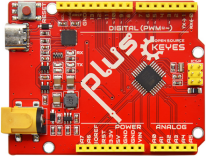
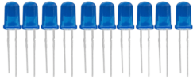
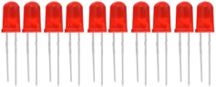
.. |image4| image:: media/679ad0aaef0b7b199aaf0967e1aa5367.png
.. |image5| image:: media/0eead4be7850896afc83477bd7c260d8.png
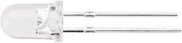
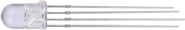
.. |image8| image:: media/7ea6c448cde965cc0c899e3906b16398.png
.. |image9| image:: media/1baebd241a5c0654eb9bc571db904683.png
.. |image10| image:: media/0113c0595ce216f178c0948f77efd03e.png
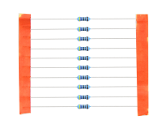
.. |image12| image:: media/d0a42506a43071b51bc17f9e39caa37c.png
.. |image13| image:: media/60a660b4c23562a74563483b7af3f568.png
.. |image14| image:: media/5444cd34945d9cc2dbb825a8be8d49ad.png
.. |image15| image:: media/5b8fea4657b47510d199f740fdcaaa9d.png
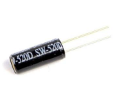
.. |image17| image:: media/7ea5721963dbb796fde0e7c2f3e8e4b5.png
.. |image18| image:: media/adb25a98a644070c6de378fe98017d8b.png
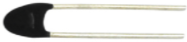
.. |image20| image:: media/8defa4d3994ce0f2291b05c2fd04ee9c.png
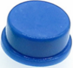
.. |image22| image:: media/e5756d5b6983fb93087e49a42482dcb8.png
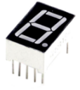
.. |image24| image:: media/85cfe0f4b888f5543316d1eebbfde4f8.png
.. |image25| image:: media/d226a1f3c801ac78321f0692143c853e.png
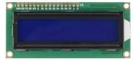
.. |image27| image:: media/9197d4aff9356c585b7ef68e33a6881d.png
.. |image28| image:: media/9197d4aff9356c585b7ef68e33a6881d.png
.. |image29| image:: media/009965e315276ecf1144c22c54a93fd9.png
.. |image30| image:: media/5f8803639698fd86903da6b920f59195.jpeg
.. |image31| image:: media/fac0503511e41d3a6c1aad355baa7abb.png
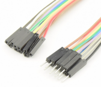
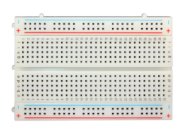
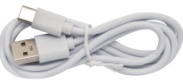
.. |image35| image:: media/89aaafefa692d400a031a0e213879c56.png
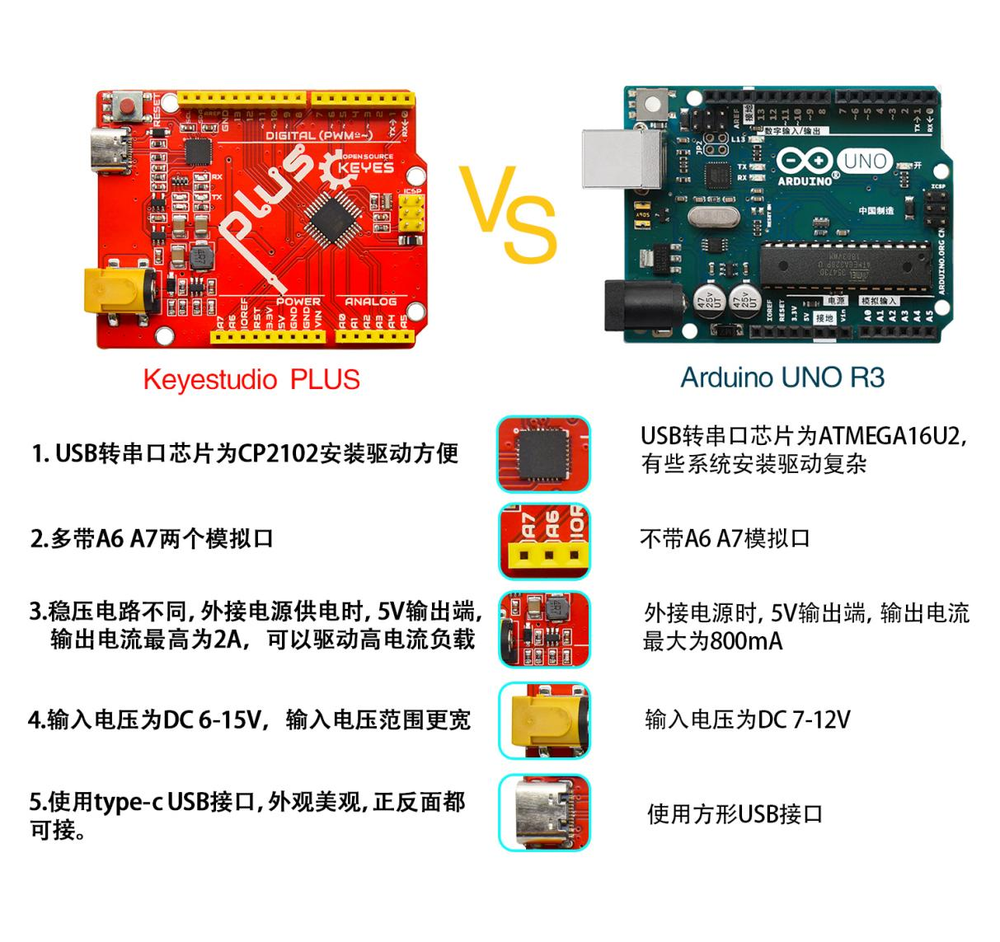
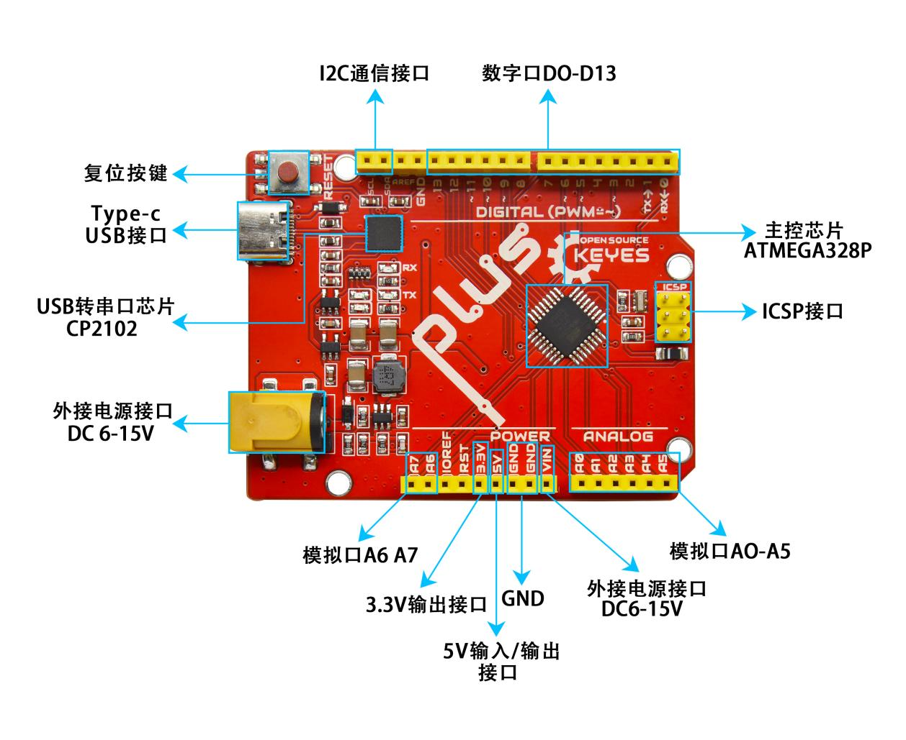
