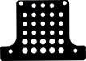
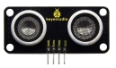
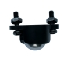
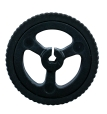
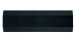
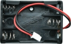
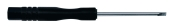
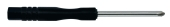

Introduction
============

|image1|

Keyestudio Mini Robot Car is a multifunctional car based on BBC
micro:bit. It is equipped with a wealth of sensors and peripherals to
help you understand how to use the micro:bit and learn more about
electronics.

In addition, it leaves lot of universal jacks of building block holes
for easy connection to other peripheral devices, you can use your
experience and imagination to create more interesting inventions.

Kit List
--------

== ========= ======================== ===
#  Picture   Components               QTY
== ========= ======================== ===
1  |image2|  Expansion Board          1
2  |image3|  Acrylic Board            1
3  |image4|  Ultrasonic Sensor        1
4  |image5|  Universal Wheel          1
5  |image6|  Wheels                   2
6  |image7|  M3*20mm Nylon Column     4
7  |image8|  3AAA Battery Holder      1
8  |image9|  M3*6MM Flat Head Screws  4
9  |image10| M3*10MM Flat Head Screws 6
10 |image11| M3 Nickle-plated Nuts    2
11 |image12| Slotted Screwdriver      1
12 |image13| Cross Screwdriver        1
13 |image14| IR Remote Control        1
== ========= ======================== ===

Note:The following items are not included in this kit and must be
provided by you.

1). Microbit V2 (you need to buy them yourself)

2). Three AAA Batteries (you need to buy them yourself)

Parameters
----------

**Note:** the two colored headlights, two photosensitive sensors, the IR
receiver and two motors are already integrated in the car baseplate.

|image15|

Connector port input: DC 4.5V

Operating voltage of sensors: 3V

Motor speed: 200RPM

Working temperature range: 0-50℃

Dimension: 99\ *78*\ 58mm

Environmental protection attributes: ROHS

The motor speed can be adjusted via the PWM

Due to the small number of IO ports of micro:bit, the micro:bit board
sends control instructions to STC8G1K08 via the IIC, and then ST8G1K08
sends PWM to control HR8833 motor to drive IC, thus controlling the
motor to rotate. LED RGB is controlled in the same way as above.

.. |image1| image:: ./media/KS4036F.png
.. |image2| image:: ./media/wps1.jpg

.. |image9| image:: ./media/wps8.jpg
.. |image10| image:: ./media/wps9.jpg
.. |image11| image:: ./media/wps10.jpg

.. |image14| image:: ./media/wps13.jpg
.. |image15| image:: ./media/KS4036F35.png
