**Bezüglich des Sprachwechsels im Tutorial beachten Sie bitte das
folgende animierte Bild.** **Concernant le changement de langue dans le
tutoriel, veuillez vous référer à l’image animée suivante.** **En
relación con el cambio de idioma en el tutorial, consulte la siguiente
imagen animada.** **Per quanto riguarda il cambio di lingua nel
tutorial, fare riferimento alla seguente immagine animata.** **Jeśli
chodzi o przełączanie języka w samouczku, zapoznaj się z poniższym
obrazkiem animowanym.** **Wat betreft het veranderen van de taal in de
tutorial, zie de volgende geanimeerde afbeelding.** **Angående
språkbytet i handledningen, vänligen se följande animerade bild.**

|image1|

:download:`Arduino Tutorial <./4Arduino/Arduino.7z>`

:download:`Kidsblock Tutorial <./5Kidsblock/Kidsblock.7z>`

1. Product introduction
=======================

|image2|

1.1 Introduction
----------------

This STEM educational V3.0 tank robot is newly upgraded, adding an
line-tracking and a fire- extinguishing function. It vigorously enhances
the relationship between kids and parents, and sparks children’s
imagination through programming and coding.

In the course of assembly process, you can see its multiple functions
like light following, line tracking, IR and BT remote control, speed
adjustment and so on. Additionally, there are some small parts that can
help you assemble the robot car.

There are basic sensors and modules, such as a flame sensor, a BT
sensor, an obstacle avoidance sensor, an line tracking sensor and an
ultrasonic sensor are included.

The two tutorials for C language code of Arduino IDE and KidsBlock
graphical programming are also suitable for the enthusiasts at different
ages.

It is really the best choice for you.

1.2 Features
------------

1. Multiple functions：Confinement, line tracking, fire extinguishing,
   light following, IR and BT remote control, speed control and so on.

2. Easy to build: assemble the robot with some parts.

3. High tenacity: Aluminum alloy brackets, metal motors, high quality
   wheels

4. High extension: connect many sensors and modules through motor driver
   shield and LEGO parts

5. Multiple controls: IR remote control, App control(iOS and Android
   system)

6. Basic programming：C language code of Arduino IDE and KidsBlock
   graphical programming.

1.3 Parameters
--------------

- Working voltage: 5v

- Input voltage: 6-9V

- Maximum output current: 1.5A

- Maximum power dissipation: 32W

- Motor speed: 5V 200 rpm / min

- Motor drive mode: dual H bridge drive(HR8833)

- Ultrasonic induction angle: <15°

- Ultrasonic detection distance: 2cm-300cm

- Infrared remote control distance: 10 meters (measured)

- BT remote control distance: 30 meters (measured)

1.4 Kit List
------------

+-----+-----------------------------------+-----+-----------------------------+
| No. | Name                              | QTY | Picture                     |
+=====+===================================+=====+=============================+
| 1   | Tank Robot Chassis                | 1   | |img|                       |
+-----+-----------------------------------+-----+-----------------------------+
| 2   | Keyestudio V4.0 development board | 1   | |image3|                    |
|     | (compatible Arduino UNO)          |     |                             |
+-----+-----------------------------------+-----+-----------------------------+
| 3   | Keyestudio 8833 Motor Driver      | 1   | |image4|                    |
|     | Expansion Board                   |     |                             |
+-----+-----------------------------------+-----+-----------------------------+
| 4   | DX-BT24 V5.1 BLE BT Module        | 1   | |image5|                    |
+-----+-----------------------------------+-----+-----------------------------+
| 5   | HC-SR04 Ultrasonic Sensor         | 1   | |image6|                    |
+-----+-----------------------------------+-----+-----------------------------+
| 6   | Keyestudio 8*16 LED Panel         | 1   | |image7|                    |
+-----+-----------------------------------+-----+-----------------------------+
| 7   | Yellow LED Module                 | 1   | |2|                         |
+-----+-----------------------------------+-----+-----------------------------+
| 8   | Flame Sensor                      | 2   | |1|                         |
+-----+-----------------------------------+-----+-----------------------------+
| 9   | 130 Motor Module                  | 1   | |5|                         |
+-----+-----------------------------------+-----+-----------------------------+
| 10  | Photoresistor                     | 2   | |4|                         |
+-----+-----------------------------------+-----+-----------------------------+
| 11  | Acrylic Board for 8*16 LED Panel  | 1   | |image8|                    |
+-----+-----------------------------------+-----+-----------------------------+
| 12  | Top Acrylic Board                 | 1   | |image9|                    |
+-----+-----------------------------------+-----+-----------------------------+
| 13  | Acrylic Board                     | 1   | |Img|                       |
+-----+-----------------------------------+-----+-----------------------------+
| 14  | Keyestudio JMFP-4 17-Key Remote   | 1   | |11|                        |
|     | Control (Batteries in KS0555F)    |     |                             |
+-----+-----------------------------------+-----+-----------------------------+
| 15  | Keyestudio 9G 180 ° Servo         | 1   | |image10|                   |
+-----+-----------------------------------+-----+-----------------------------+
| 16  | USB Cable                         | 1   | |image11|                   |
+-----+-----------------------------------+-----+-----------------------------+
| 17  | Winding Pipe                      | 1   | |image12|                   |
+-----+-----------------------------------+-----+-----------------------------+
| 18  | 3.0*40MM Screwdriver              | 1   | |image13|                   |
+-----+-----------------------------------+-----+-----------------------------+
| 19  | 3*100MM Ties                      | 5   | |image14|                   |
+-----+-----------------------------------+-----+-----------------------------+
| 20  | L Type M2.5 Wrench                | 1   | |image15|                   |
+-----+-----------------------------------+-----+-----------------------------+
| 21  | L Type M3 Wrench                  | 1   | |image16|                   |
+-----+-----------------------------------+-----+-----------------------------+
| 22  | L Type M1.5 Wrench                | 1   | |image17|                   |
+-----+-----------------------------------+-----+-----------------------------+
| 23  | Cardboard                         | 1   | |image18|                   |
+-----+-----------------------------------+-----+-----------------------------+
| 24  | 4P M-F PH2.0mm to 2.54 Dupont     | 1   | |image19|                   |
|     | Wire (Green-Blue-Red-Black)       |     |                             |
+-----+-----------------------------------+-----+-----------------------------+
| 25  | 4P HX-2.54 Dupont Wire            | 1   | |image20|                   |
|     | (Black-Red-White-Brown)           |     |                             |
+-----+-----------------------------------+-----+-----------------------------+
| 26  | 5P JST-PH2.0MM Dupont Wire        | 1   | |image21|                   |
+-----+-----------------------------------+-----+-----------------------------+
| 27  | 3P-3P XH2.54 to 2.54 Dupont       | 1   | |9|                         |
|     | Wire（Yellow-Red-Black)           |     |                             |
+-----+-----------------------------------+-----+-----------------------------+
| 28  | 3P-3P XH2.54 to PH2.0 Dupont      | 2   | |10-1|                      |
|     | Wire（Yellow-Red-Black)           |     |                             |
+-----+-----------------------------------+-----+-----------------------------+
| 29  | 4P-3P XH2.54 to PH2.0 Dupont      | 2   | |image22|                   |
|     | Wire（Yellow-Red-Black)           |     |                             |
+-----+-----------------------------------+-----+-----------------------------+
| 30  | 4P XH2.54 to PH2.0 Dupont         | 1   | |8|                         |
|     | Wire（Green-Blue-Red-Black)       |     |                             |
+-----+-----------------------------------+-----+-----------------------------+
| 31  | M1.4*8MM Round-head Screws        | 6   | |image23|                   |
+-----+-----------------------------------+-----+-----------------------------+
| 32  | M1.4 Nuts                         | 6   | |image24|                   |
+-----+-----------------------------------+-----+-----------------------------+
| 33  | M2 Nuts                           | 8   | |image25|                   |
+-----+-----------------------------------+-----+-----------------------------+
| 34  | M2*8MM Round-head Screws          | 8   | |image26|                   |
+-----+-----------------------------------+-----+-----------------------------+
| 35  | M1.2*5MM Round-head Screws        | 6   | |image27|                   |
+-----+-----------------------------------+-----+-----------------------------+
| 36  | M3*6MM Round-head Screws          | 18  | |image28|                   |
+-----+-----------------------------------+-----+-----------------------------+
| 37  | M3*10MM Round-head Screws         | 3   | |image29|                   |
+-----+-----------------------------------+-----+-----------------------------+
| 38  | M3 Nuts                           | 3   | |image30|                   |
+-----+-----------------------------------+-----+-----------------------------+
| 39  | M3*10MM Dual-pass Copper Pillar   | 4   | |image31|                   |
+-----+-----------------------------------+-----+-----------------------------+
| 40  | M3*40MM Dual-pass Copper Pillar   | 4   | |image32|                   |
+-----+-----------------------------------+-----+-----------------------------+
| 41  | 43093 Blue Technic Axle Pin with  | 11  | |image33|                   |
|     | Friction Ridges                   |     |                             |
+-----+-----------------------------------+-----+-----------------------------+
| 42  | 4265c Technic Bush                | 11  | |image34|                   |
+-----+-----------------------------------+-----+-----------------------------+
| 43  | Blue Jumper Cap                   | 4   | |image35|                   |
+-----+-----------------------------------+-----+-----------------------------+
| 44  | Red Jumper Cap                    | 4   | |image36|                   |
+-----+-----------------------------------+-----+-----------------------------+
| 45  | spanner                           | 1   | |image37|                   |
+-----+-----------------------------------+-----+-----------------------------+
| 46  | chassis driving wheel             | 2   | |image38|                   |
+-----+-----------------------------------+-----+-----------------------------+
| 47  | chassis bearing wheel             | 2   | |image39|                   |
+-----+-----------------------------------+-----+-----------------------------+
| 48  | M4*12MM hexagon socket screw      | 2   | |image40|                   |
+-----+-----------------------------------+-----+-----------------------------+
| 49  | M4*12MM hexagon socket screw      | 2   | |image41|                   |
+-----+-----------------------------------+-----+-----------------------------+
| 50  | belt track                        | 2   | |image42|                   |
+-----+-----------------------------------+-----+-----------------------------+

1.5Keyestudio V4.0 Development Board
------------------------------------

You need to know that keyestudio V4.0 development board is the core of
this smart car.

|image43|

Keyestudio V4.0 development board is based on ATmega328P MCU, and with a
CP2102 Chip as a UART-to-USB converter.

|image44|

It has 14 digital input/output pins (of which 6 can be used as PWM
outputs), 6 analog inputs, a 16 MHz quartz crystal, a USB connection, a
power jack, 2 ICSP headers and a reset button.

|image45|

We can power it with a USB cable, the external DC power jack (DC 7-12V)
or female headers Vin/ GND(DC 7-12V)

+----------------------+-----------------------------------------------+
| Micro controller     | ATmega328P-PU                                 |
+======================+===============================================+
| Operating Voltage    | 5V                                            |
+----------------------+-----------------------------------------------+
| Input Voltage        | DC7-12V                                       |
| (recommended)        |                                               |
+----------------------+-----------------------------------------------+
| Digital I/O Pins     | 14 (D0-D13) (of which 6 provide PWM output)   |
+----------------------+-----------------------------------------------+
| PWM Digital I/O Pins | 6 (D3, D5, D6, D9, D10, D11)                  |
+----------------------+-----------------------------------------------+
| Analog Input Pins    | 6 (A0-A5)                                     |
+----------------------+-----------------------------------------------+
| DC Current per I/O   | 20 mA                                         |
| Pin                  |                                               |
+----------------------+-----------------------------------------------+
| DC Current for 3.3V  | 50 mA                                         |
| Pin                  |                                               |
+----------------------+-----------------------------------------------+
| Flash Memory         | 32 KB (ATmega328P-PU) of which 0.5 KB used by |
|                      | bootloader                                    |
+----------------------+-----------------------------------------------+
| SRAM                 | 2 KB (ATmega328P-PU)                          |
+----------------------+-----------------------------------------------+
| EEPROM               | 1 KB (ATmega328P-PU)                          |
+----------------------+-----------------------------------------------+
| Clock Speed          | 16 MHz                                        |
+----------------------+-----------------------------------------------+
| LED_BUILTIN          | D13                                           |
+----------------------+-----------------------------------------------+

.. |image1| image:: ./media/1234567.gif
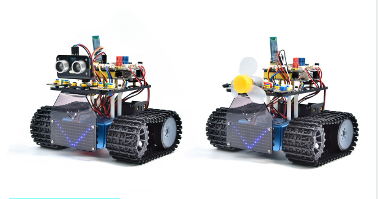
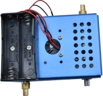
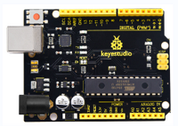
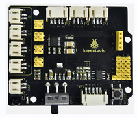
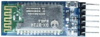
.. |image6| image:: media/b0906d68835b2659491e53a85567569b.png
.. |image7| image:: media/2d831a9e71d1777b7b12132267d22947.png
.. |2| image:: media/0b130b1b8eb4e626a9cad08906af2ef5.png
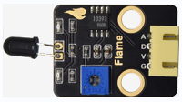
.. |5| image:: media/465d2f91471dcdab8de9b07e44d37cf4.png
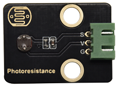
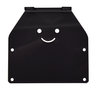
.. |image9| image:: media/704f390bd65080844e77b498d37784f7.jpeg
.. |Img| image:: ./media/img-20240115093710.png
.. |11| image:: media/4bcc6cd652f8101c6a4680b40e40e593.png
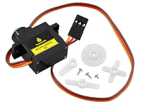
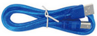
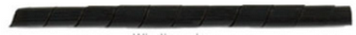
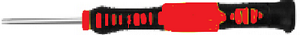

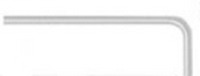

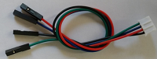
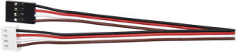
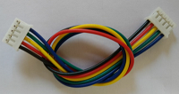
.. |9| image:: media/6a1c8e7c27ca08c62ac0c30a0dbd4578.png
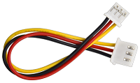
.. |image22| image:: media/7856a38f34cdeb19966cd0fb99b55f85.png
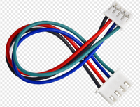
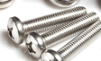
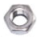

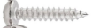

.. |image31| image:: media/0e0fd3c7109c9fdaae633447ace2452f.png
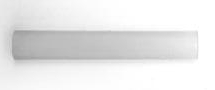
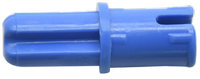
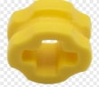
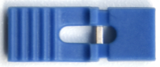
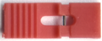
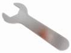
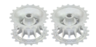
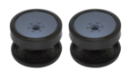
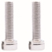
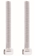
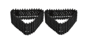
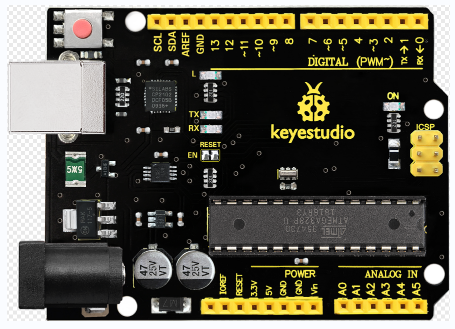
.. |image44| image:: ./media/image-20250709103216112.png
.. |image45| image:: ./media/image-20250709103241560.png
