2. Mixly
========

2.1 资料下载
------------

软件下载（百度网盘）：
https://pan.baidu.com/s/1tJiKGUYVtE4VZKwZhCoy2w?pwd=jvmg

代码和库文件下载：\ `Mixly <./Mixly.7z>`__

2.2 软件安装
------------

1. 下载压缩包，压缩包存放路径不要有中文

|image1|

2. 解压压缩包，打开文件夹，打开\ |image2|\ 。

3. 需要输入的地方全部输入“y”，等待更新即可。

|image3|

4. 更新完毕后，关闭。

   |image4|

5.再次打开文件夹，可以看到软件已存在，点击打开。

|image5|

2.3 软件介绍
------------

1. 打开软件后，选择“Arduino AVR”.

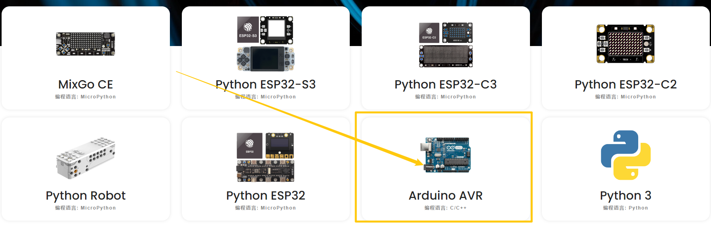

   image-20250610144229368

2. 工具栏介绍

   |image6|

2.4 导入库文件
--------------

1. 点击“设置”—->“管理库”

   |image7|

2.选择本地导入，再选择所需的库文件，选择库文件中的“.xml”后缀的文件导入。

|image8|

2.5 上传代码文件
----------------

1. 点击“文件”—->“打开”

|image9|

2. 找到代码保存的位置，选择“.mix”文件，点击“确定”

|image10|

3. 点击“上传”。

   .. figure:: ./media/image-20250610151751682.png
      :alt: image-20250610151751682

      image-20250610151751682

2.6 项目
--------

**单个传感器项目**

拿到套件后，套件中有37款传感器/模块，有对应的keyes UNO
R3开发板、传感器扩展板和连接线。这里，我们将37款传感器/模块利用自带连接线，单独连接在keyes
UNO
R3开发板和传感器扩展板。然后上传对应的测试代码，单独测试各个传感器/模块的功能。

特别注意：实验时，模块/传感器连接线材时，必须按照资料里的接线方法及位置，电源与信息脚不能错接，否则会损坏模块/传感器。

**模块组合项目**

前面课程中，单独测试了传感器/模块的功能，功能比较单一。在此，可以将多个传感器/模块搭配使用，组合出各种各样的功能。传感器/模块种类比较多，选择几款比较经典的组合实验。当然也可以根据自己的想法，自己设置代码，组合出你想要的特别的功能。

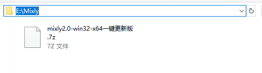
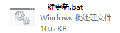
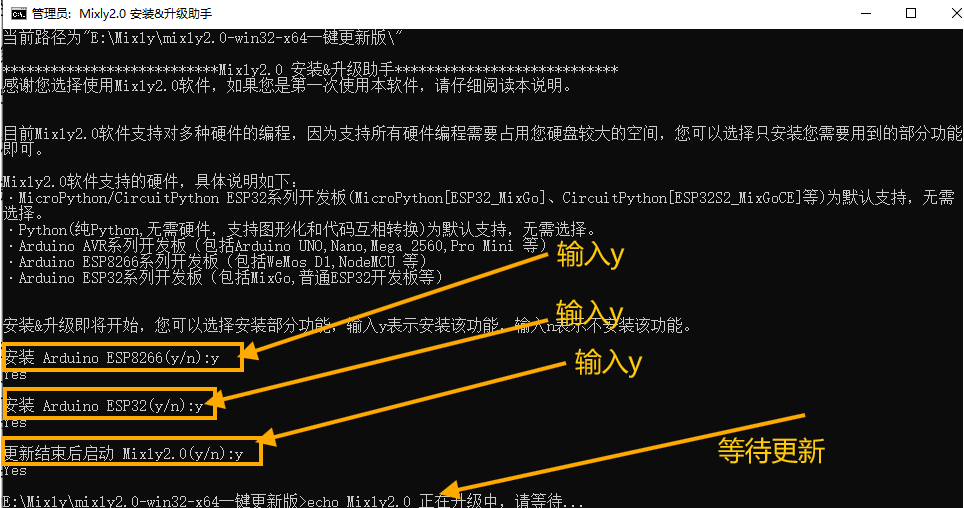
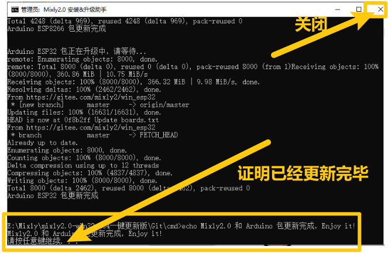
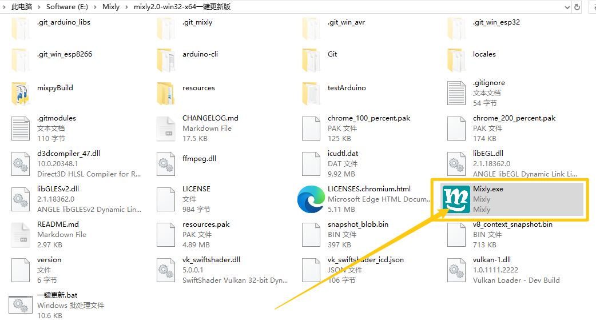
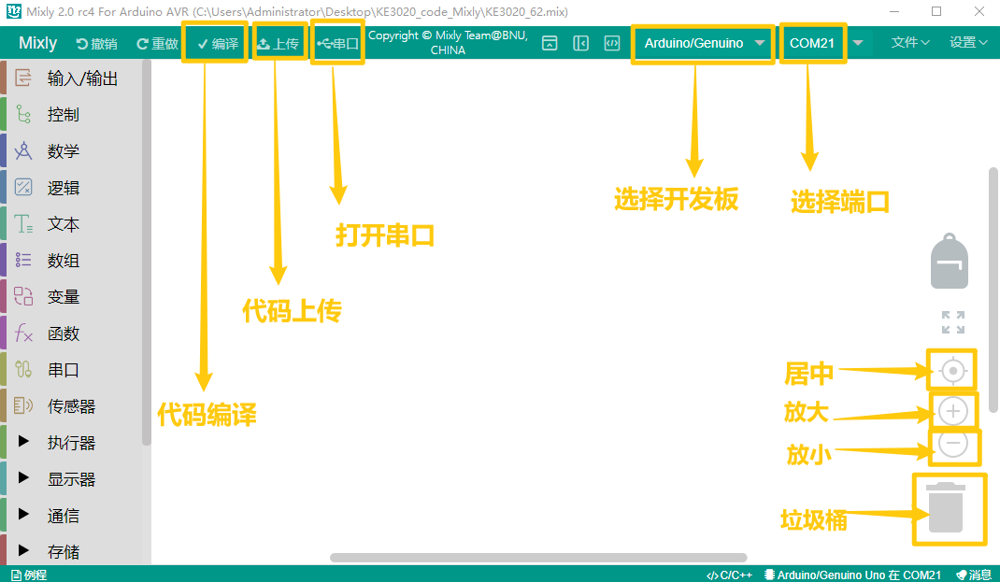
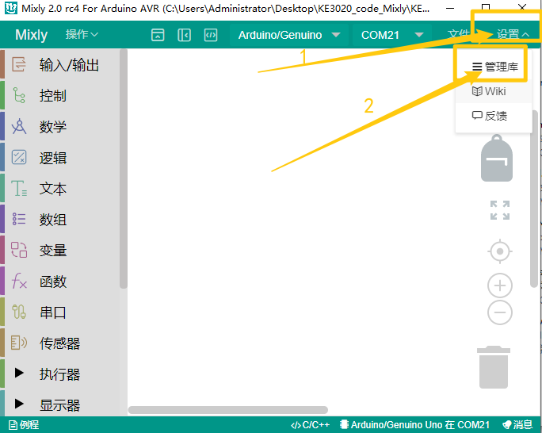
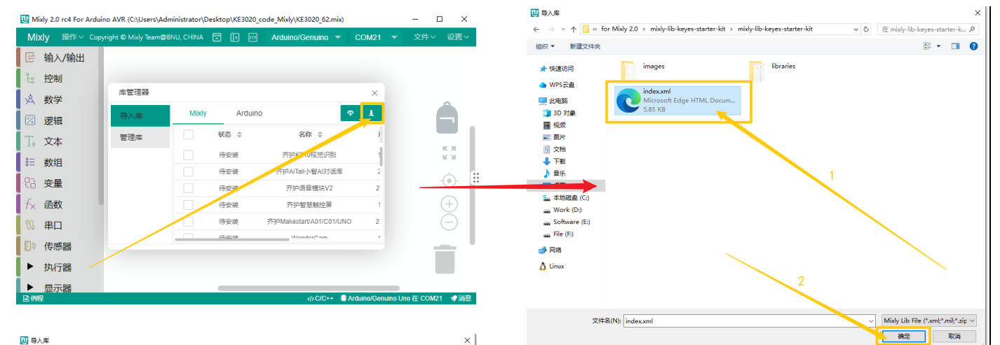
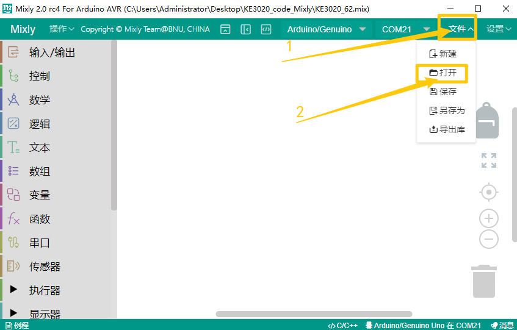
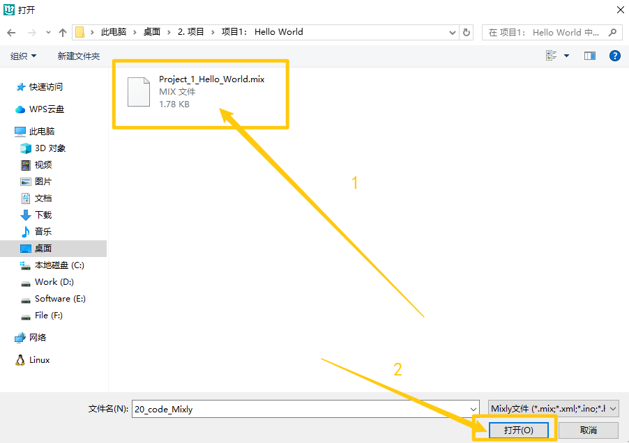
