2. Product installation
=======================

Part 1
~~~~~~

**Components Needed**

|image1|

**Installation Diagram**

|image2|

**Prototype**

|image3|

Part 2
~~~~~~

**Components Needed**

|image4|

**Installation Diagram**

|image5|

**Prototype**

|image6|

Part 3
~~~~~~

**Components Needed**

|image7|

**Installation Diagram**

|image8|

**Prototype**

|image9|

Part 4
~~~~~~

**Set the angle of the servo to 90°**

====== ===============
Servo  Expansion Board
====== ===============
Brown  G
Red    5V
Yellow D9
====== ===============

To adjust the code of the servo,please select it according to the
course.

1.\ **Arduino:**\ Download the code file: :download:`Arduino <./Arduino.7z>`

2.\ **Kidsblock:**\ Download the code file: :download:`Kidsblock <./Kidsblock.7z>`

**Components Needed**

|image10|

**Installation Diagram(mind the installation direction)**

|image11|

**Prototype**

|image12|

Part 5
~~~~~~

**Components Needed**

|image13|

**Installation Diagram**

|image14|

**Prototype**

|image15|

Part 6
~~~~~~

**Components Needed**

|image16|

**Installation Diagram**

|image17|

**Prototype**

|image18|

Part 7
~~~~~~

**Components Needed**

|image19|

**Installation Diagram(mind the direction of the motor)**

|image20|

**Prototype**

|image21|

Part 8
~~~~~~

**Components Needed**

|image22|

**Installation Diagram**

**(Pay attention to the installation direction of the mecanum wheels)**

|image23|

**Prototype**

|image24|

Part 9
~~~~~~

**Components Needed**

|image25|

**Installation Diagram**

|image26|

**Prototype**

|image27|

Part 10
~~~~~~~

**Components Needed**

|image28|

**Installation Diagram**

|image29|

**Prototype**

|image30|

**Insert a Bluetooth module**

|image31|

Wiring Diagram
~~~~~~~~~~~~~~

**The wiring of the ultrasonic module**

========== ======================
ultrasonic Sensor expansion board
========== ======================
Vcc        V
Trig       D12
Echo       D13
Gnd        G
========== ======================

|image32|

|image33|

**The wiring of the servo**

====== ======================
Servo  Sensor expansion board
====== ======================
Brown  G
Red    5V
Orange D9
====== ======================

|image34|

**The wiring of controlling the IR receiver**

|image35|

============ ===============
Driver Board Expansion Board
============ ===============
GND          G
5V           5V
S5           A3
============ ===============

**The wiring of controlling the RGB2812 LED**

|image36|

============ ===============
Driver Board Expansion Board
============ ===============
GND          G
5V           5V
S4           D10
============ ===============

**The wiring of controlling motors and 7-color LEDs**

|image37|

============ ===============
Driver Board Expansion Board
============ ===============
SCL          D2
SDA          D3
5V           D5
GND          D4
============ ===============

**The wiring of controlling the line-tracking sensor**

|image38|

============ ===============
Driver Board Expansion Board
============ ===============
S1           A2
S2           A1
S3           A0
5V           5V
GND          G
============ ===============

**Connect the motors to the corresponding interface as shown in the
figure**

|image39|

**Installation of batteries**

|image40|

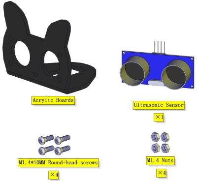
.. |image2| image:: media/wps2.jpg
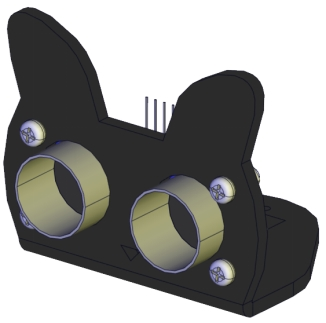
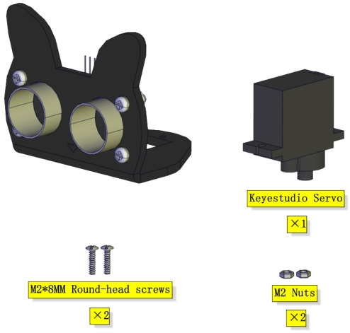
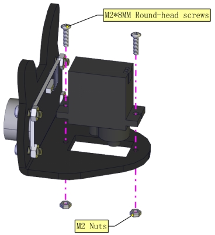
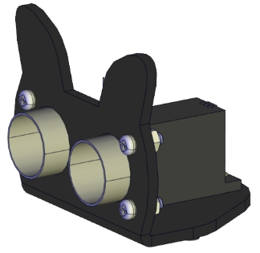
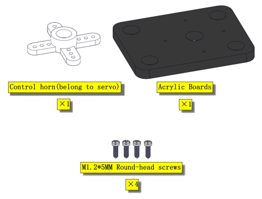
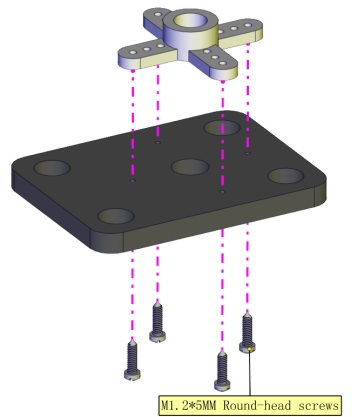
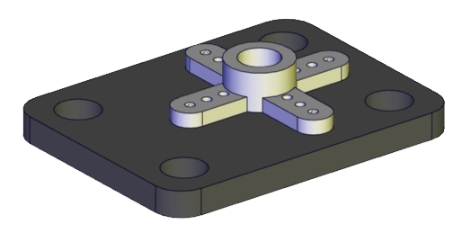
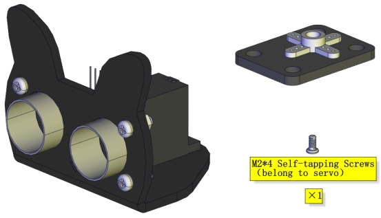
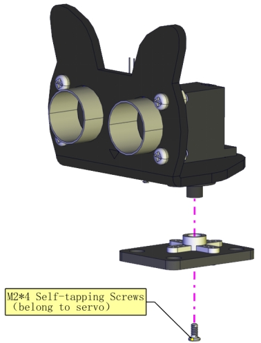
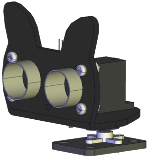
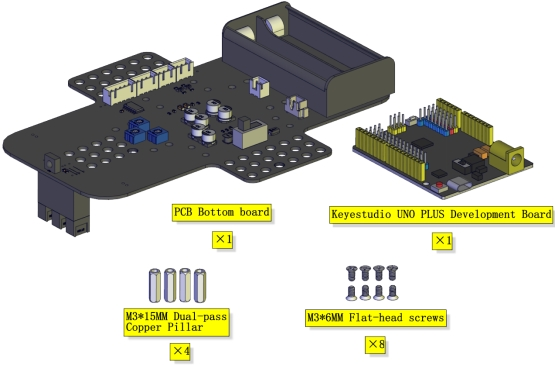
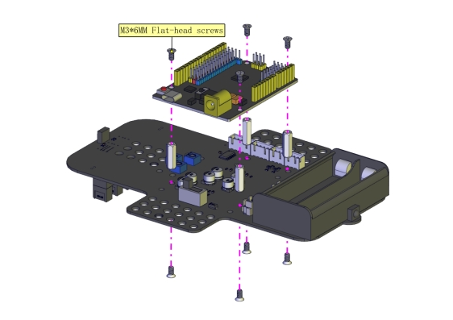
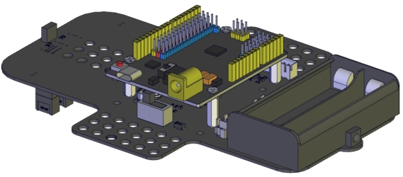
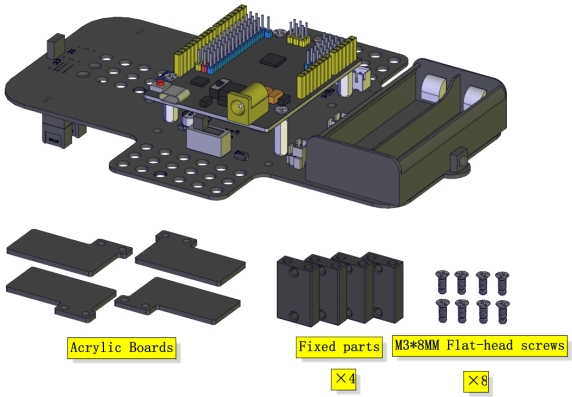
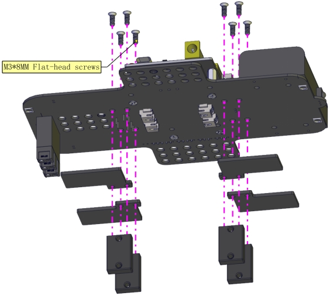
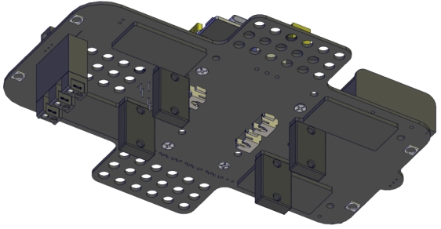
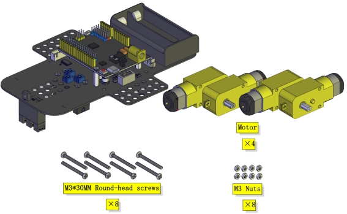
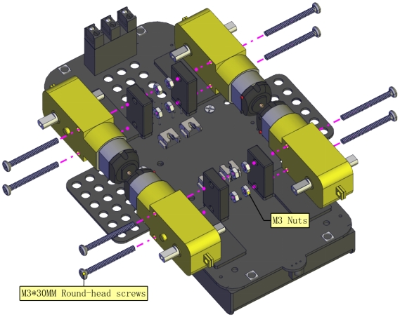
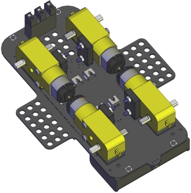
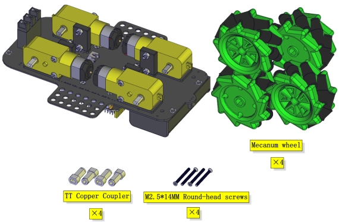
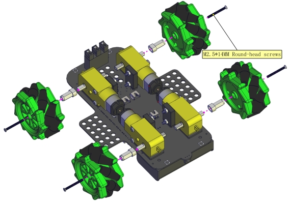
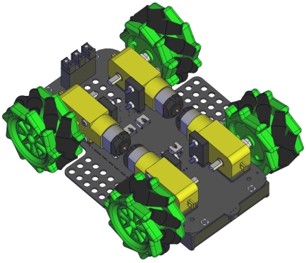
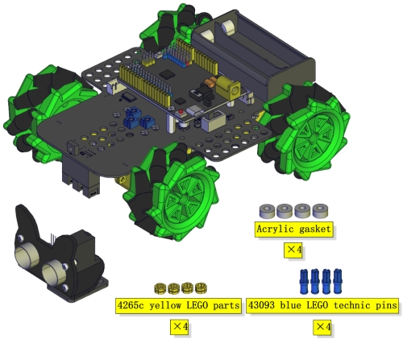
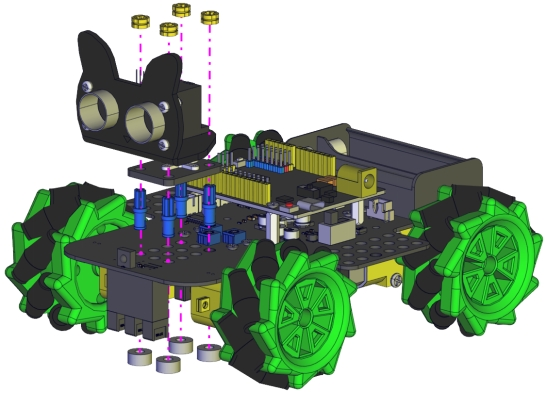
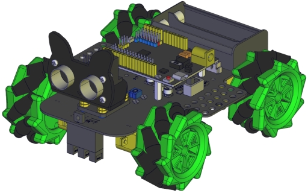
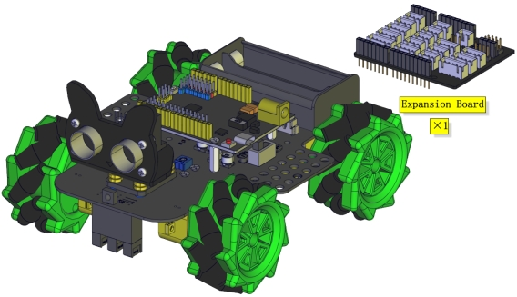
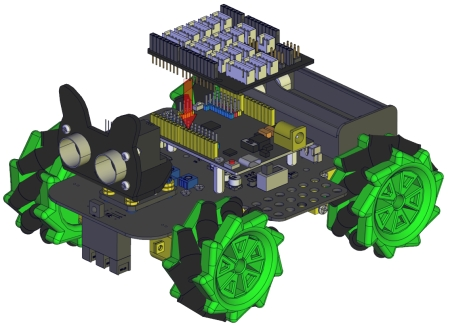
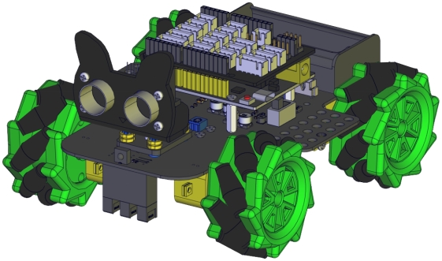
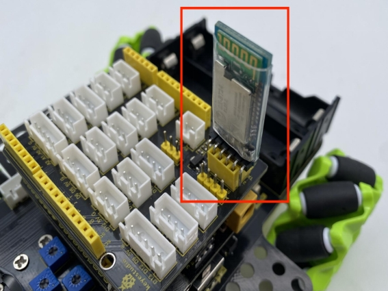
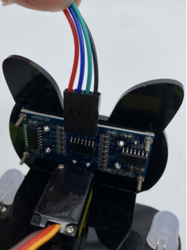
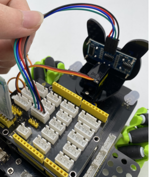
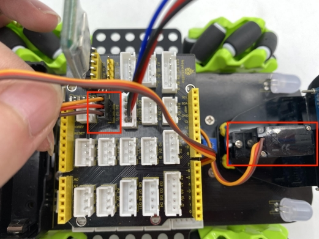
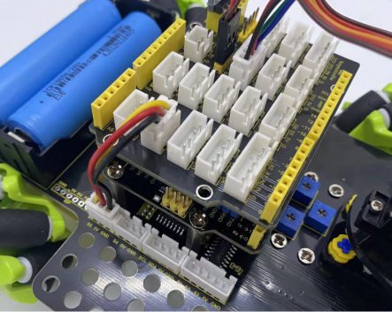
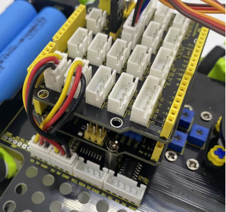
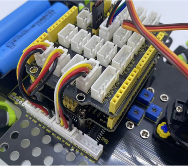
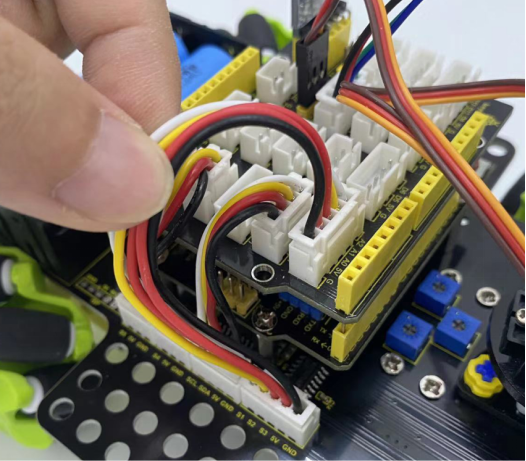
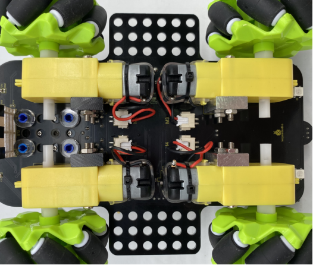
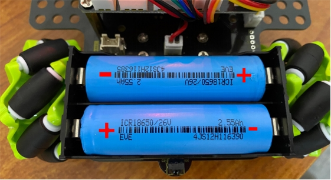
