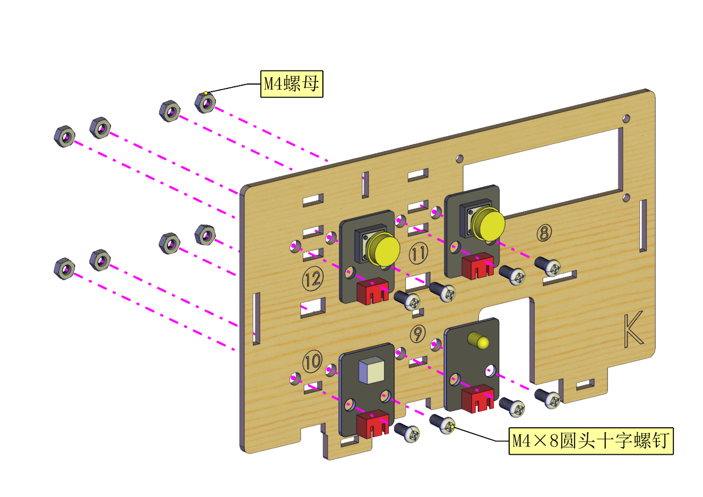
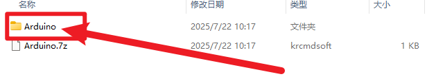
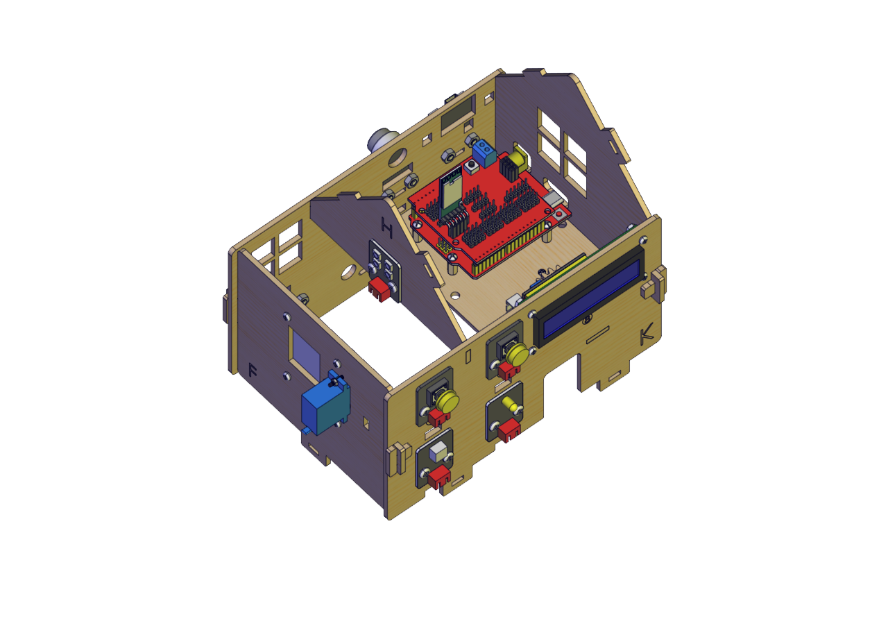
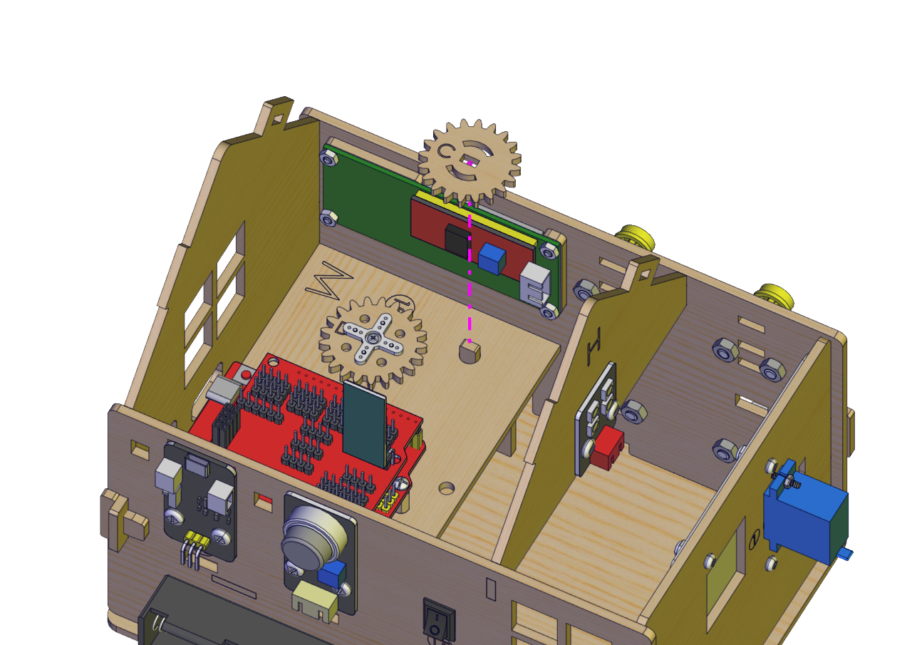
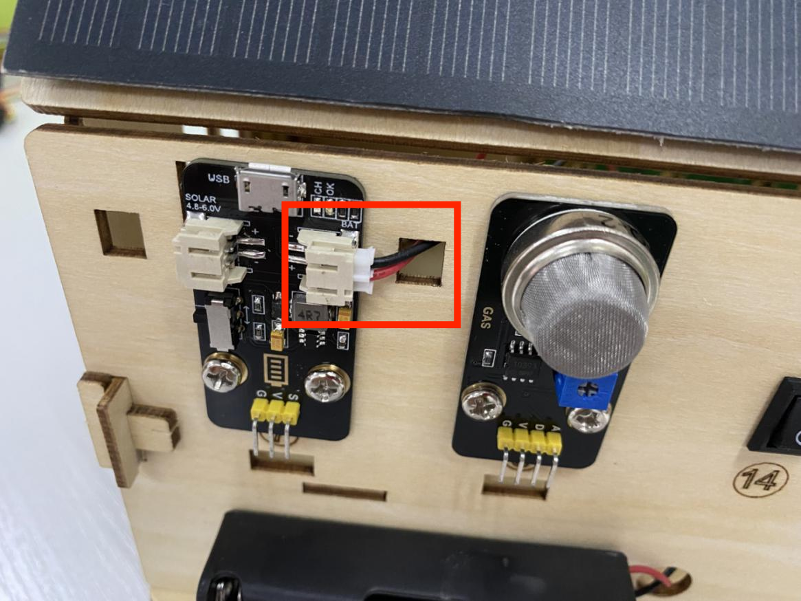

2. 产品安装
-----------

安装1

安装所需零件

|image1|

安装

|image2|

完成

|image3|

安装2

安装所需零件

|image4|

安装

|image5|

完成

|image6|

安装3

安装所需零件

|image7|

安装

|image8|

完成

|image9|

安装4

安装所需零件

|image10|

安装

|image11|

若使用为M1.4*6MM自攻螺丝时，如下图

|image12|

完成

|image13|

安装5

安装所需零件

|image14|

安 装

|image15|

完成

|image16|

将舵机角度调到0度

|image17|

请按如图接好线，根据需要选择调整舵机的代码下载

1. Arduino： :download:`Arduino <./Arduino.7z>`

   |image18|

2. Scratch:  :download:`Scratch <./Scratch.7z>`

   |image19|

3. Mixly:   :download:`Mixly <./Mixly.7z>`

   |image20|

上传代码到开发板，舵机自动转动到0度，再进行安装（注意：这一步很重要）

安装6

安装所需零件

|image21|

安 装（安装自锁螺母时不可拧紧，安装时窗户为闭合状态如下图所示）

|image22|

完成

|image23|

安装7

安装所需零件

|image24|

安装

|image25|

完成

|image26|

安装8

安装所需零件

|image27|

安装

|image28|

完成

|image29|

安装9

安装所需零件

|image30|

安装

|image31|

完成

|image32|

安装10

安装所需零件

|image33|

安装

|image34|

完成

|image35|

安装11

安装所需零件

|image36|

安装

|image37|

完成

|image38|

安装12

安装所需零件

|image39|

安装

|image40|

完成

|image41|

安装13

安装所需零件

|image42|

安装

|image43|

完成

|image44|

安装14

安装所需零件

|image45|

安装

|image46|

完成

|image47|

安装15

安装所需零件

|image48|

安装

|image49|

完成

|image50|

安装16

安装所需零件

|image51|

安装

|image52|

完成

|image53|

安装17

安装所需零件

|image54|

安装

|image55|

完成

|image56|

安装18

安装所需零件

|image57|

安装

|image58|

完成

|image59|

安装到此即可开始接线

人体红外传感器接线

|image60|\ |image61|

人体红外释热传感器

按键模块1接线

|image62|\ |image63|

按键模块2接线

|image64|\ |image65|

黄色LED模块接线

|image66|\ |image67|

黄色LED模块

LCD1602显示屏模块

|image68|\ |image69|

LCD1602显示屏模块

水滴传感器接线

|image70|\ |image71|

水滴传感器

温湿度传感器接线

|image72|\ |image73|

温湿度传感器

光敏传感器接线

|image74|\ |image75|

光敏传感器

风扇模块接线

|image76|\ |image77|

风扇模块

RGB灯模块接线

|image78|\ |image79|

RGB灯模块

无源蜂鸣器模块接线

|image80|\ |image81|

无源蜂鸣器模块

电池盒接线

|image82|\ |image83|\ |image84|

模拟气体传感器接线

|image85|\ |image86|

模拟气体传感器

控制门的舵机接线

|image87|

控制门舵机

控制窗户舵机接线

|image88|

控制窗户舵机

电源接线

|image89|

太阳能板接线

|image90|

接完线后即可安装最后一步

安装所需零件

|image91|

安装

|image92|

完成

|image93|

.. |image1| image:: media/d4903855e20d5a6f982f9ac90a4f81fb.png

.. |image4| image:: media/8761a0a5a90cfb9c073abf84e30bd165.png
.. |image5| image:: media/0fccabbb750d3fe36f7ef7bfc1837c94.png
.. |image6| image:: media/559672aacd3bc96f6a8e6caaaeac24c3.png

.. |image8| image:: media/9ba56371f1d88e666d92c77060299a7b.png
.. |image9| image:: media/4dbb95603f23e0639074fccadf403114.png
.. |image10| image:: media/89_1.png
.. |image11| image:: media/89_2.png
.. |image12| image:: media/100.png

.. |image14| image:: media/58428c9d987974edfaaab39a8b18ea84.png
.. |image15| image:: media/89_4.png
.. |image16| image:: media/89_5.png
.. |image17| image:: media/7860a7fb2fe9685ead6de6578232d883.png

.. |image22| image:: media/bb0993d5c2eee787673c9986fcebbcfa.png
.. |image23| image:: media/92f9f949c080cc89f298781be7532e05.jpg
.. |image24| image:: media/fd29cb2e81308f691a0579d3c5c7c68f.png
.. |image25| image:: media/40c4fbe0acdfb1ec5e9e32a6a915ce75.png
.. |image26| image:: media/b31168fdd6794e81ca5707ad9cdf7d9e.png
.. |image27| image:: media/0b15cc2a0d9f0f13936c2a97e9af18ad.png
.. |image28| image:: media/7f0fa4f189df4857747319585eb94389.png

.. |image30| image:: media/04ec55e45b6dc6f5140de45e25eb5bc4.png
.. |image31| image:: media/35d3d73f1b6a6c01365fc57f8a3f5b6e.png
.. |image32| image:: media/c61120c702cbf945548572864667258d.png
.. |image33| image:: media/5300b5477ec7b8a55263b48a62967c2b.png
.. |image34| image:: media/783b8dbbdc290f151abd72994eba60e6.png
.. |image35| image:: media/ecf4b3efdabfe913bb55e81d045f092b.jpg
.. |image36| image:: media/95335e9584578961f0111daf988bf9de.png
.. |image37| image:: media/e82aee91145ff72453bb46538b4dab9b.png

.. |image40| image:: media/726c4b7d1c495acbf4358ebbdadf9b9e.png

.. |image42| image:: media/8e2d77f1b450f9d3ed146515dea1919c.png
.. |image43| image:: media/9e48e6ff9f03d5d38c9960b4867801e8.png
.. |image44| image:: media/2ce0324018b180f626fb1651ddf0c86d.png
.. |image45| image:: media/1f00c50cd5f91bcca562de30a821f2f7.png

.. |image48| image:: media/d0a025c6406bfc84d9a4952a3d61c375.png
.. |image49| image:: media/4bec70766733615f90691e41f9fe5ac5.png

.. |image52| image:: media/1bfb09f5423df7e0d251847b355472f0.png

.. |image54| image:: media/a31df64dec197768a475d465141e9202.png

.. |image56| image:: media/419e9c258cf9cb09ad2dded744bdf3df.png

.. |image58| image:: media/49a4efde2ec7925161b89feca0953b4e.png

.. |image60| image:: media/60bdd38aecfcdec619c1b4a0a67b1ec9.png

.. |image62| image:: media/daba34016e16242d627132dc2bb1159e.png

.. |image65| image:: media/23b15cd1418ee9954ab17722ec50cd2d.png
.. |image66| image:: media/e7c5d76594146e2f81b21088ce0b62b1.png
.. |image67| image:: media/f7ef18ef64e086b18acc9c7a638c92dc.png
.. |image68| image:: media/1e47d997a3c4d28cbfe66e6f8e1bbd1b.png
.. |image69| image:: media/39f6de0d37027f94d008b1653dd3cbe6.png
.. |image70| image:: media/0b6d7a165cdcaaa748bba28a5b171b96.png
.. |image71| image:: media/35e64a51b865b10718e24b05436cefc0.png

.. |image73| image:: media/7f45c9a1bce12ba0c8f09492b0a22795.png
.. |image74| image:: media/32ce4b51cdb78c27a407f83a8924c20d.png
.. |image75| image:: media/3294f50ba63e3cea8c48f07d34021b19.png
.. |image76| image:: media/564ba0b0164ef71bde4981fe72849197.png
.. |image77| image:: media/f825eed355494dac90ff9d3d5f0a3a88.png
.. |image78| image:: media/70b3a219ae917623e6e2684332d36bf0.png
.. |image79| image:: media/5c334e9a50a0a46f090e28bbaf465578.png

.. |image81| image:: media/92fd3441aa9d9a9c2cb7215907d4547a.png
.. |image82| image:: media/7838738fe32f451c7c83fd0c1d26ec5c.jpg
.. |image83| image:: media/c578509f8562292a7a9c373597abefd4.jpg

.. |image85| image:: media/35bff37e18054d880be500a9b192056e.png
.. |image86| image:: media/912a6f43ef41bcab06261a302772f488.png
.. |image87| image:: media/75a4621ac71645f54e41000312e7b069.png
.. |image88| image:: media/62cd2703550678df34ef73f02d4635f1.png
.. |image89| image:: media/b94e60e297092a199c0c36af26b50b62.png
.. |image90| image:: media/708983877e2b213c72023071500c2e5e.png

