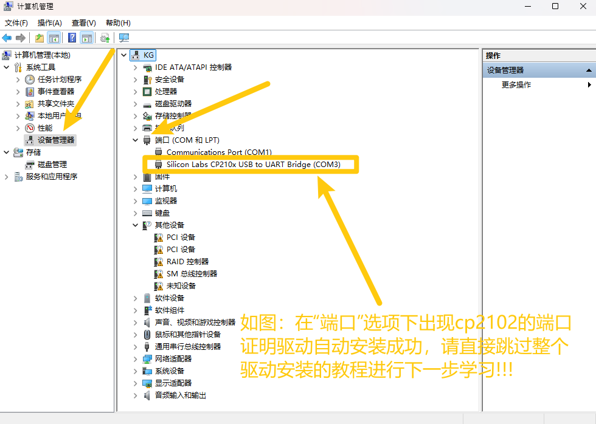
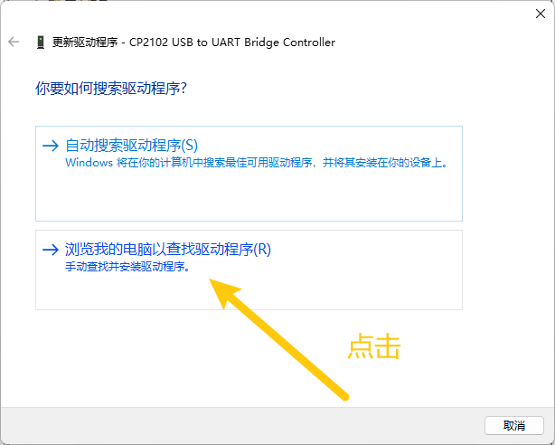
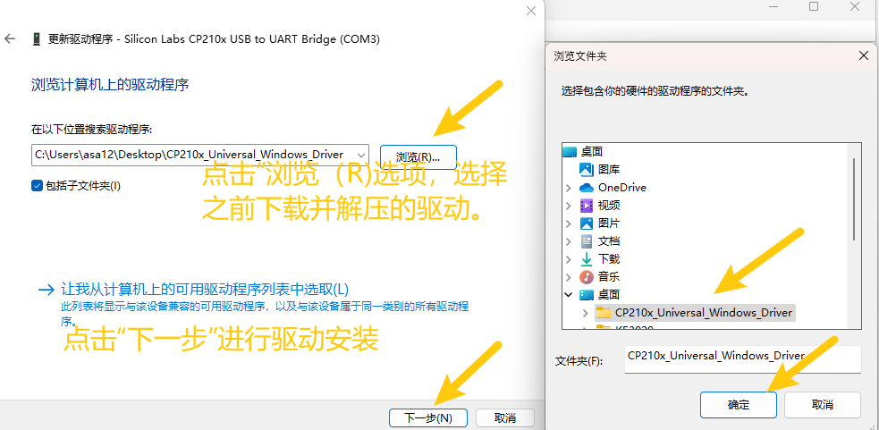
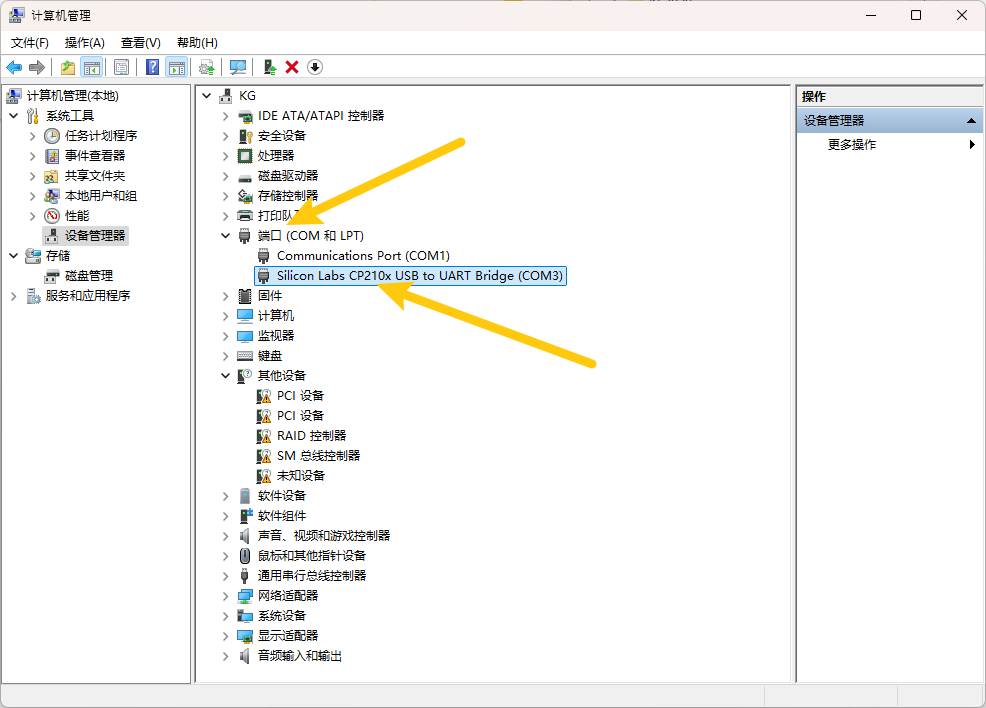
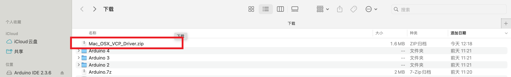
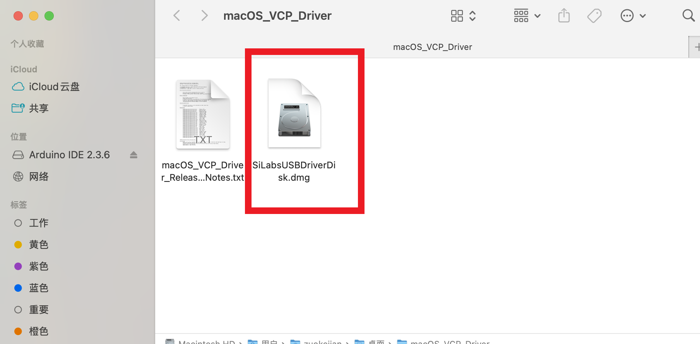
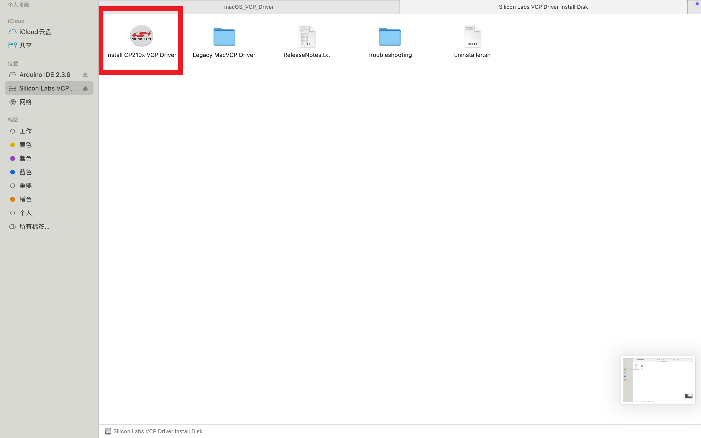

2. 驱动安装
===========

2.1 驱动下载
------------

Windows系统驱动下载：:download:`Windows驱动 <Windows.7z>`

Mac驱动下载：:download:`Mac驱动 <./Mac.7z>`

2.2 Windows系统驱动安装
-----------------------

1、将主板连接到电脑（如图）；

|image1|

2、打开\ **“设备管理器”**.

|image2|

3、检查驱动是否已经安装

情况一：驱动安装完成，请跳过驱动教程，进行下一步学习

|image3|

情况二：驱动没有安装，请进行以下教程手动安装驱动

.. figure:: ./media/4-1748577322114-2.png
   :alt: image-20250528023804455

4.驱动安装

1、鼠标右击\ **“CP2102 USB to UART Bridge
Controller”**\ ，弹出框中选择\ **“更新驱动程序（P）”**.

|image4|

2、点击选择\ **“浏览我的电脑以查找驱动程序（R）”**.

|image5|

3、点击\ **“浏览（R）“**\ 选项，在弹出的方框中找到前面下载到的资料，选择里面的cp2102驱动文件，点击\ **“确定”**\ ，完成后点击\ **“下一步”**\ 进行驱动安装.

|image6|

4、界面显示如下图类似的话语，证明驱动安装成功，点击\ **“关闭”.**

|image7|

5.驱动安装完成后，选择\ **“端口”**\ 选项，如图CP2102的黄色感叹号消失，证明驱动安装完成.

|image8|

2.3 Mac系统驱动安装
-------------------

1、将主板连接到电脑（如图）；

|image9|

2、双击解压下载的驱动压缩包

|image10|

|image11|

|image12|

然后一直\ **“下一步”**\ 安装，直到安装完成

|image13|

.. |image1| image:: ./media/1-1748577322113-1.png
.. |image2| image:: ./media/2-1748577322114-3.png

.. |image4| image:: ./media/5-1748577322114-4.png

.. |image7| image:: ./media/9-1748577322114-9.png

.. |image9| image:: ./media/1-1748577322113-1.png

.. |image13| image:: ./media/7cca827fe946096f228797dadce10661.png
