2. 驱动安装（选读部分）
=======================

*本部分非必读部分，仅在主板无法被电脑识别时使用，如果已经识别可直接跳过！！！*\ （注意：如果主板在Arduiino、Mixly或者Scartch课程无法被识别，请先检查主板是否连接到位并且连接电脑其他USB端口重新测试，如果依旧不行再开始以下驱动安装课程）

2.1Windows系统驱动安装
----------------------

Windows系统驱动下载： :download:`Windows驱动 <./Windows.7z>`

1、将主板连接到电脑（如图）；

|image1|

2、打开\ **“设备管理器”.**

|image2|

3、检查驱动是否已经安装

情况一：驱动安装完成，请跳过驱动教程，进行下一步学习

|image3|

情况二：驱动没有安装，请进行以下教程手动安装驱动

|image4|

4、驱动安装

1. 鼠标右击\ **“USB2.0-Ser”**\ ，在弹出框中选择\ **“更新驱动程序（P）”**.

|image5|

2. 点击选择\ **“浏览我的电脑以查找驱动程序（R）”**.

|image6|

3. 点击\ **“浏览（R）“**\ 选项，在弹出的方框中找到前面下载到的资料，选择里面的CH341SER驱动文件，点击\ **“确定”**\ ，完成后点击\ **“下一步”**\ 进行驱动安装.

|image7|

4. 界面显示如下图类似的话语，证明驱动安装成功，点击\ **“关闭“**.

|image8|

5. 驱动安装完成后，选择\ **“端口”**\ 选项，如图CH340的黄色感叹号消失，证明驱动安装完成.

|image9|

2.2Mac系统驱动安装
------------------

Mac系统驱动下载： :download:`Mac驱动 <./Mac.7z>`

1、下载驱动后解压，在下载路径中找到CH340驱动文件，点击“\ **.dmg文件**\ ”。

|image10|

2、拖拽 “\ **CH34xVCPDriver**\ ”进入操作系统的应用文件夹。

|image11|

打开 “\ **LaunchPad**\ ” → “\ **CH34xVCPDriver**\ ” → “\ **安装**\ ”。

|image12|

然后安装将成功。

|image13|

此时重新操作，主板在编程软件里面已经可以被识别并且可以正常上传代码了！！！

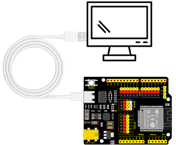
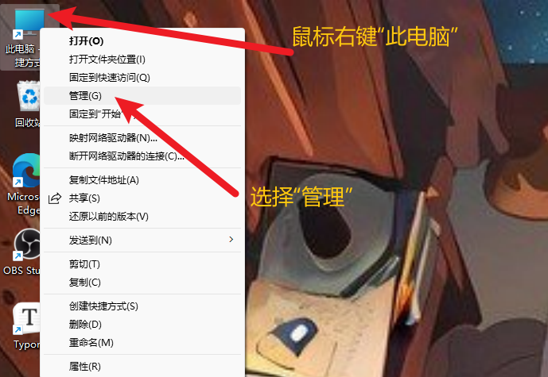
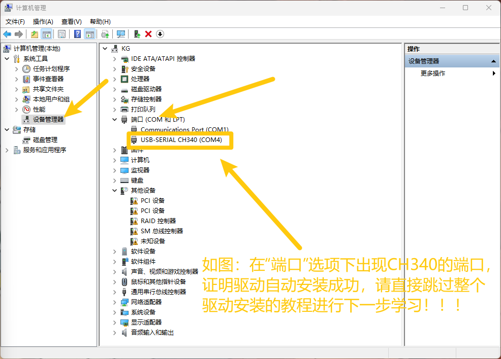
.. |image4| image:: media/04.png
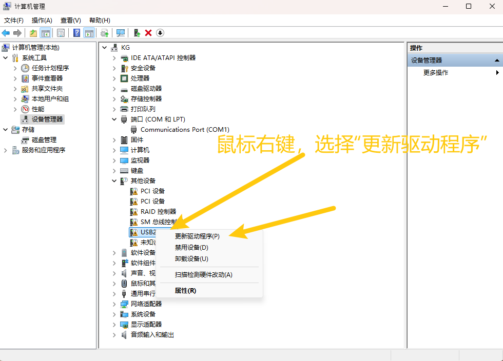
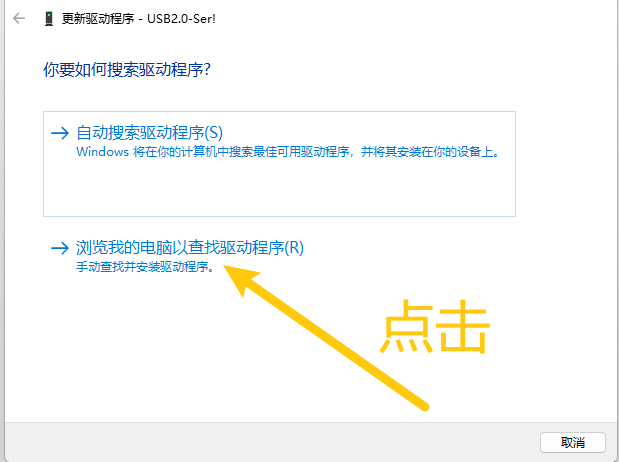
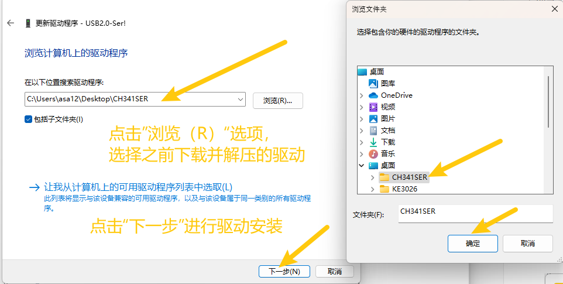
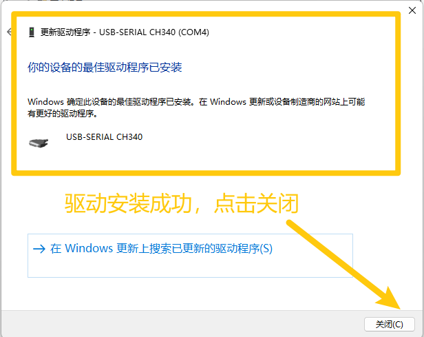
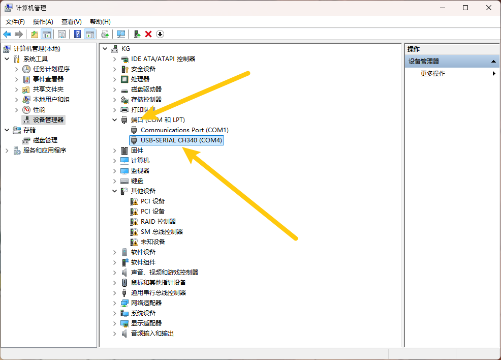
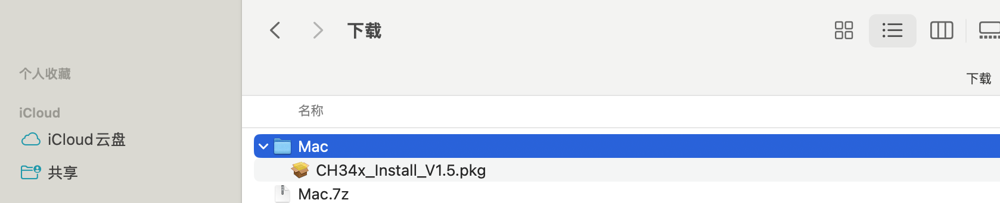
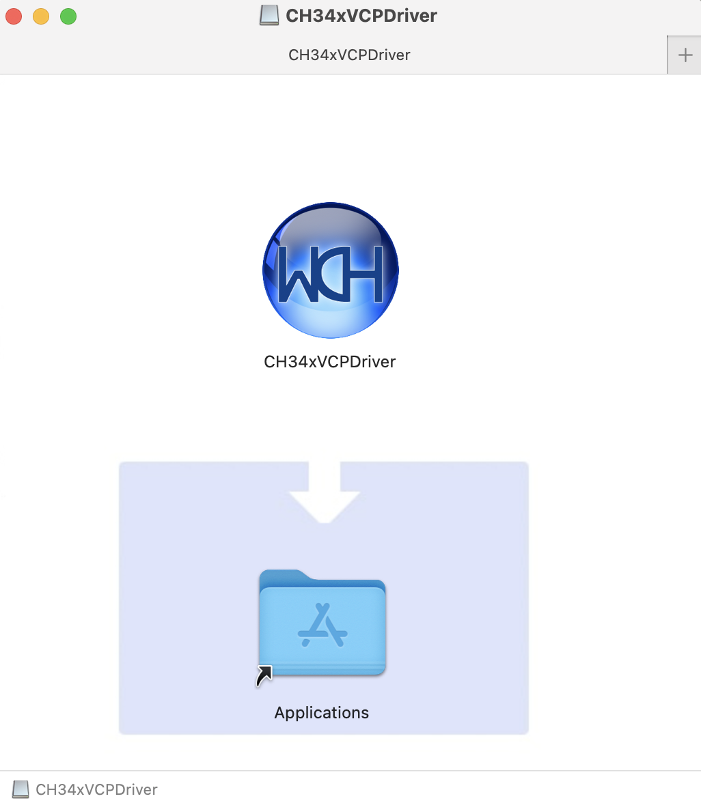
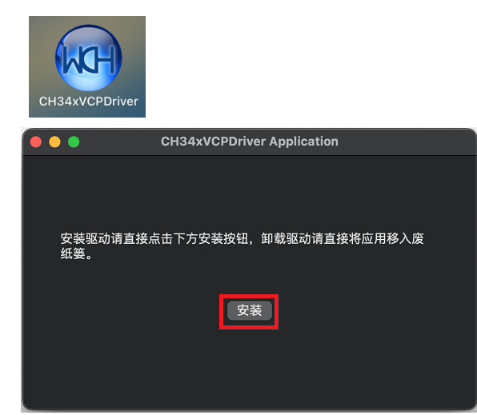
.. |image13| image:: ./media/a27.png
