3.5 Assemble the Robot Car
~~~~~~~~~~~~~~~~~~~~~~~~~~

Before assembly, please tear off the protective film on the acrylic
boards.

|image1|

1.Install the wheels to the car base

|image2|

Couple the protruding end of the wheel with the motor shaft

|image3|

|image4|

|image5|

2.Install acrylic board and battery case

|image6|

|image7|

|image8|

|image9|

|image10|

|image11|

|image12|

Note: Before proceeding with subsequent installation, first connect the
battery box’s power supply wires as shown in the diagram.

|image13|

|image14|

|image15|

3.Install the universal wheel

|image16|

|image17|

|image18|

4.Install the ultrasonic module and the micro:bit

|image19|

|image20|

Micro:bit’s LED matrix faces forward

|image21|

**Things to Note Before Starting the Robot Project：**

1. To avoid poor contact between micro:bit and robot, please make sure
   that the Microbit is correctly inserted into the Microbit interface
   of the car body. The connector need to cover the edge of the Microbit
   round hole.

The LED matrix of the micro:bit facing forward.

|image22|

2. Put AAA batteries into the battery case and connect the case to the
   VCC connector of the car base.

|image23|

3. Turn off the slide switch that controls the power from the batteries.

|image24|

.. |image1| image:: ./media/image-20250421084803390.png
.. |image2| image:: ./media/image-20250421084822843.png
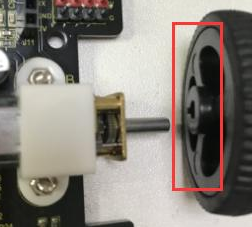
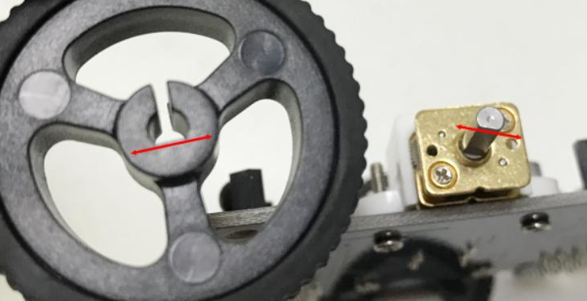
.. |image5| image:: ./media/image-20250421084918504.png
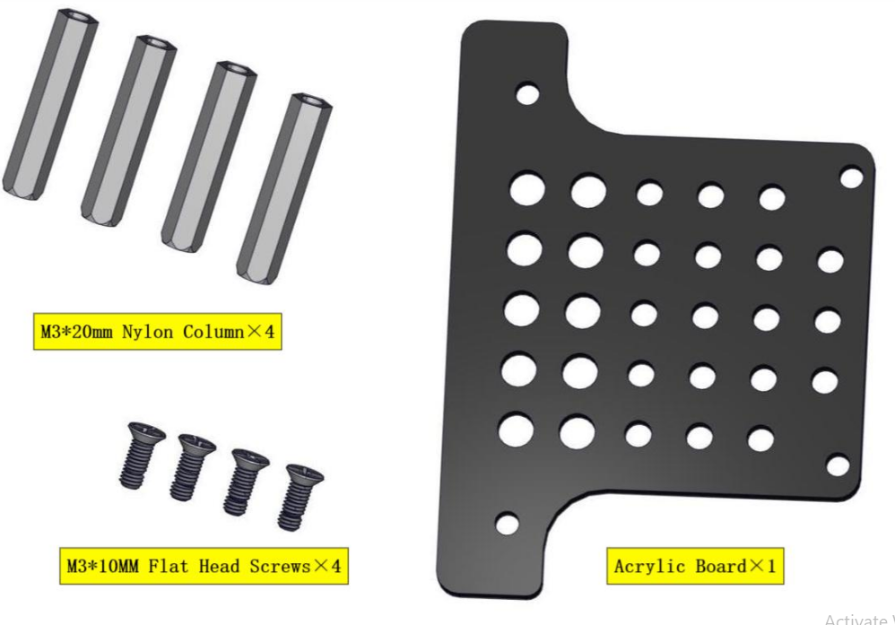
.. |image7| image:: ./media/image-20250421084950731.png
.. |image8| image:: ./media/image-20250421085000236.png
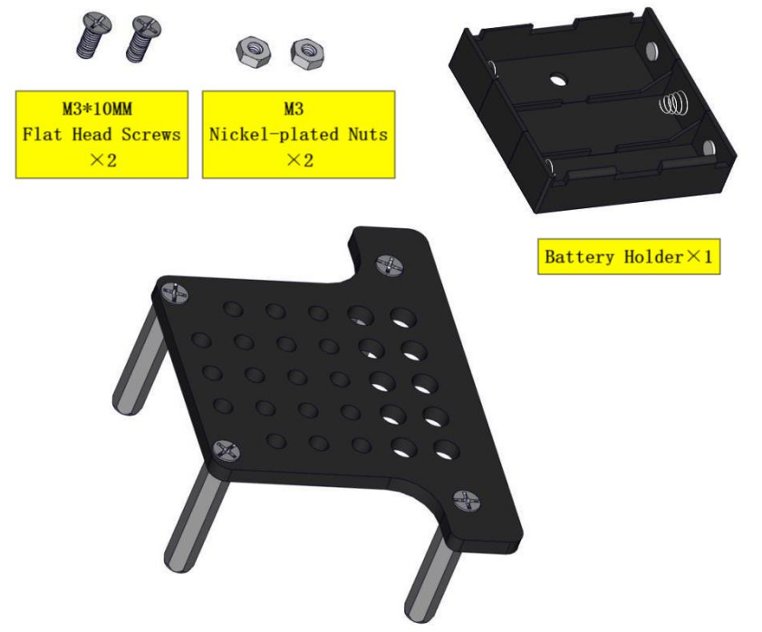
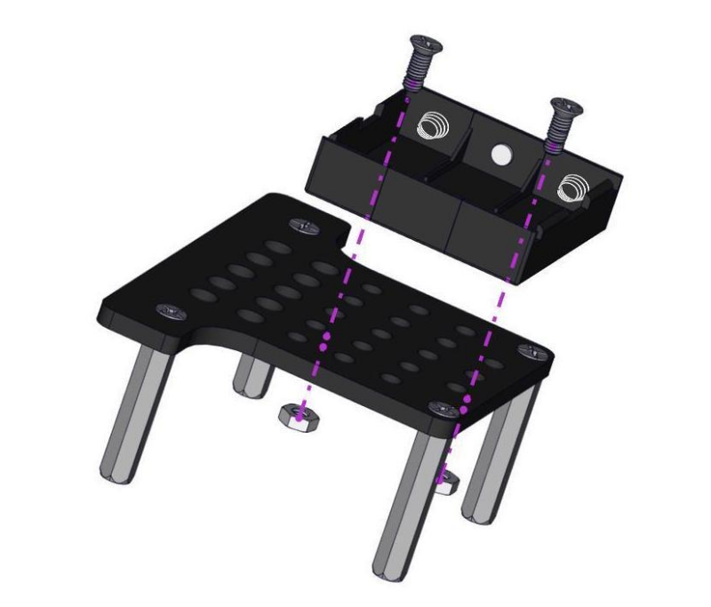
.. |image11| image:: ./media/image-20250421085033137.png
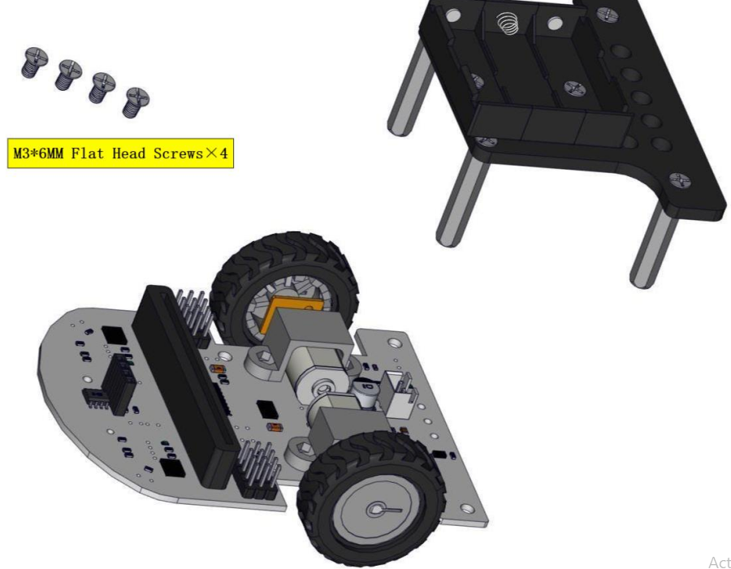
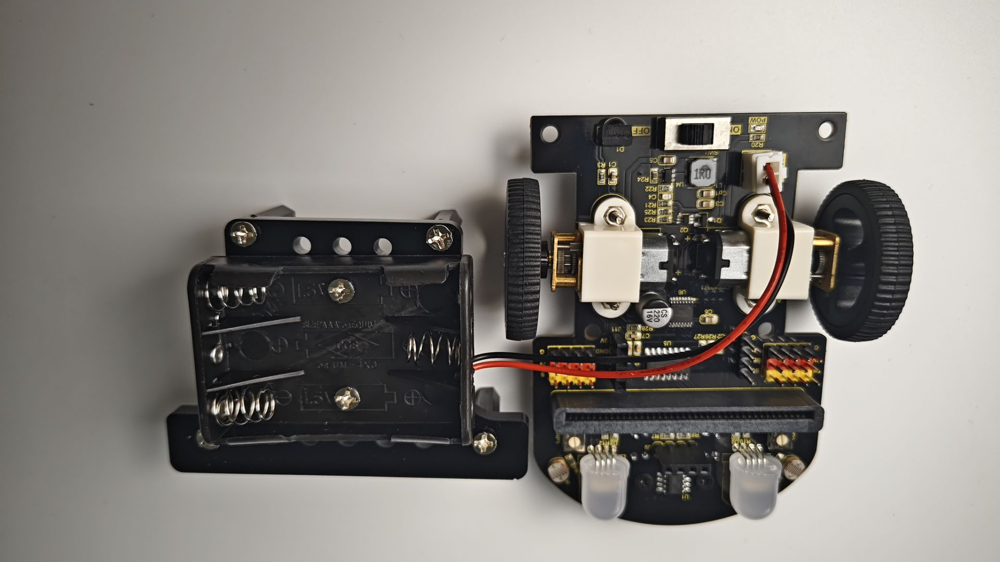
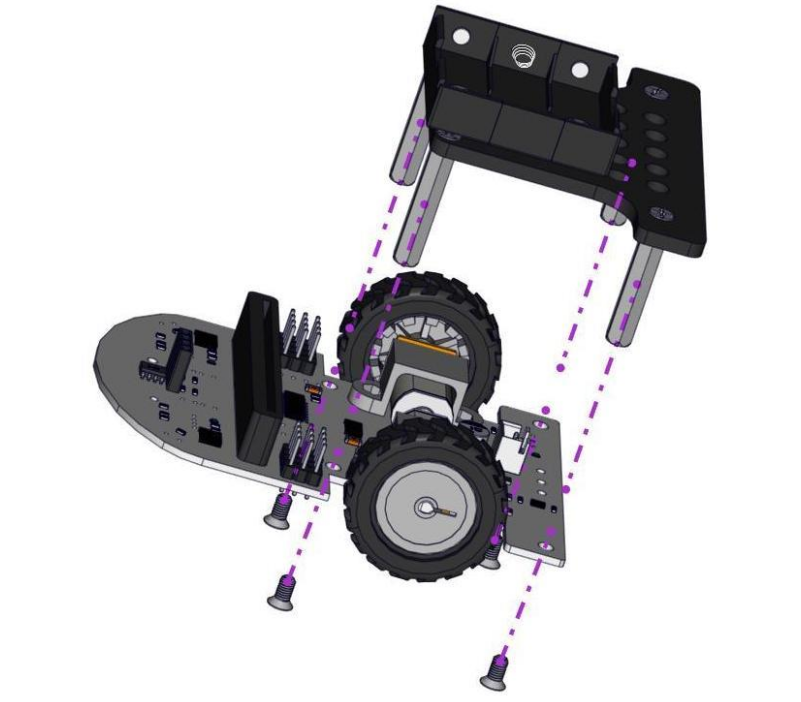
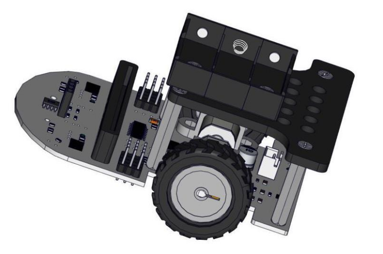
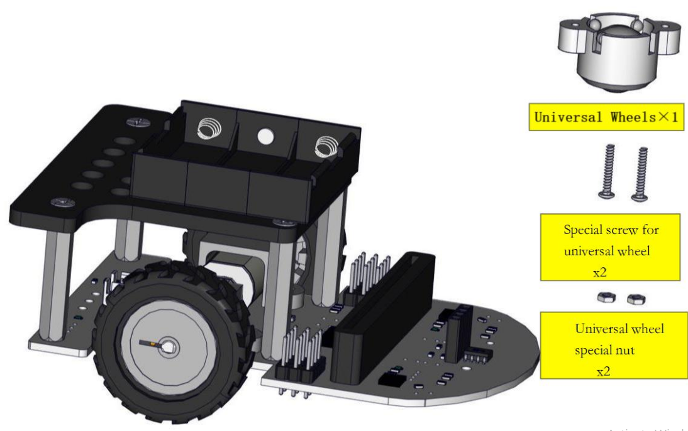
.. |image17| image:: ./media/image-20250421085143743.png
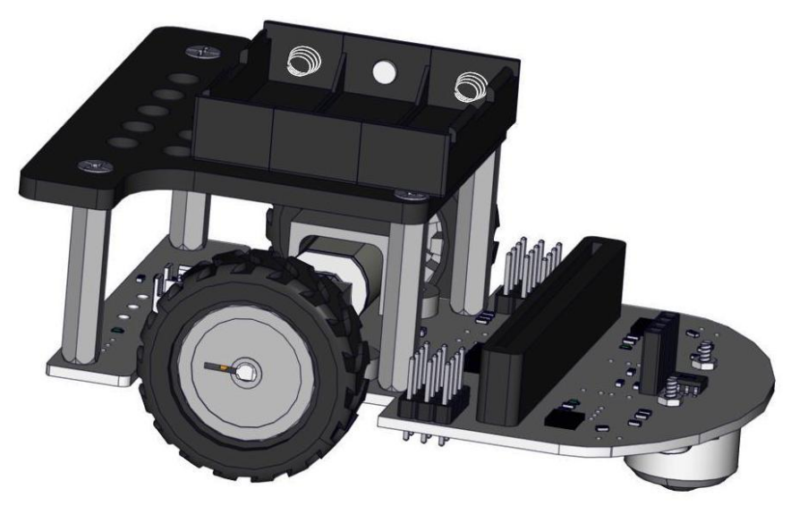
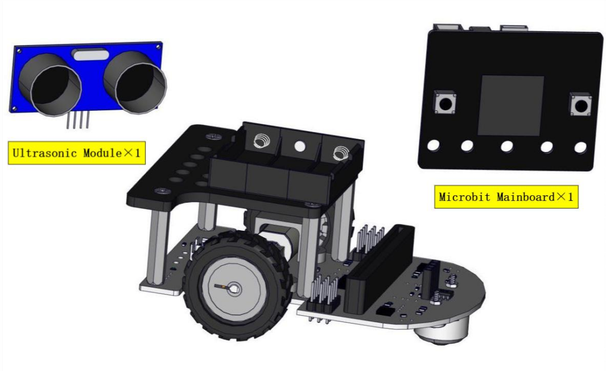
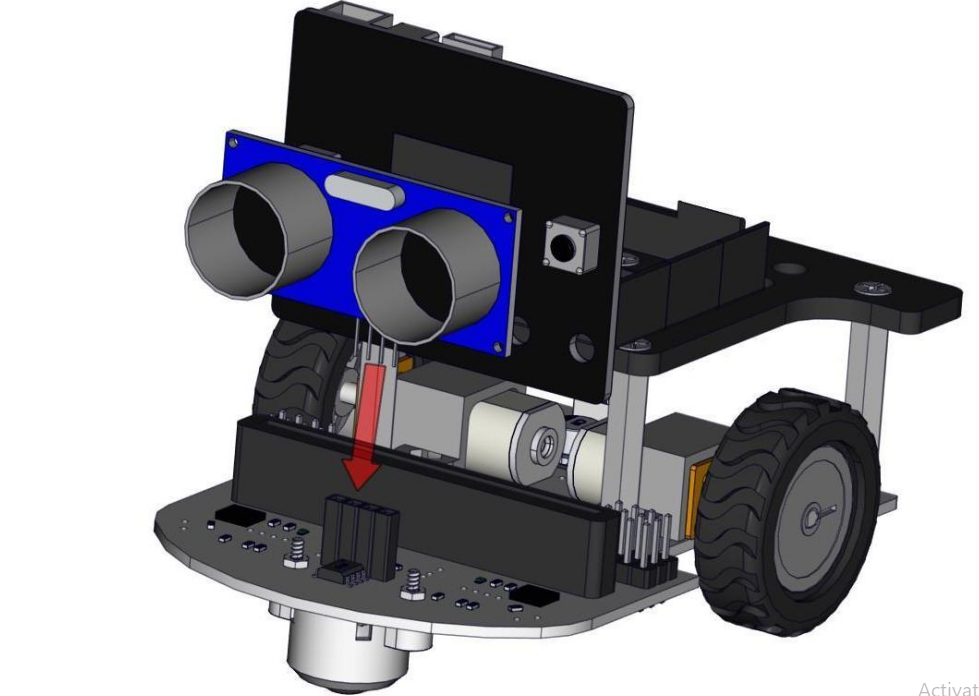
.. |image21| image:: ./media/image-20250421085249494.png
.. |image22| image:: ./media/image-20250421085619362.png
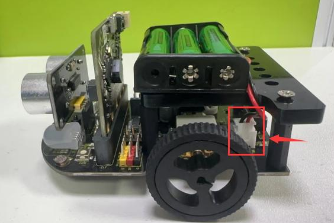
.. |image24| image:: ./media/image-20250421085708011.png
