Tutorial
========

1.Getting Started with Micro:bit
--------------------------------

Step 1: connect the Micro: Bit main board V2 with your computer

Firstly, link the Micro: Bit main board V2 with your computer via the
USB cable.

|image1|

Step 2： if the red LED on the back of the board is on, that means the
board is powered. Then Micro: Bit main board V2 will appear on your
computer as a driver named ‘MICROBIT’. Please note that it is not an
ordinary USB disk as shown below.

|image2|

Step 3: write programs

https://makecode.microbit.org/

|image3|

Congratulations on completing your first code! You should now see the
5x5 LED dot matrix displaying various patterns.

Next, I will demonstrate downloading the written code to the computer
and uploading it using a different method.

|image4|

2. CoolTerm Installation
------------------------

CoolTerm program is used to read the data on serial port.

Download CoolTerm program:

macOS:

`Intel/ARM <https://freeware.the-meiers.org/CoolTermMac.dmg>`__

Win:

`Intel 64Bit <https://freeware.the-meiers.org/CoolTermWin64Bit.zip>`__

`Intel 32Bit <https://freeware.the-meiers.org/CoolTermWin32Bit.zip>`__

`ARM 64Bit <https://freeware.the-meiers.org/CoolTermWinARM64Bit.zip>`__

Linux:

`Intel 64Bit <https://freeware.the-meiers.org/CoolTermLinux64Bit.zip>`__

`Intel 32Bit <https://freeware.the-meiers.org/CoolTermLinux32Bit.zip>`__

(1) After the download, we need to install CoolTerm program file, below
    is Window system taken as an example.

(2) Choose “win” to download the zip file of CoolTerm

(3) Unzip file and open it. (also suitable for Mac and Linux system)

|image5|

The functions of each button on the Toolbar are listed below:

|image6|

========== ================================================
Command    Description
========== ================================================
New        Opens up a new Terminal
Open       Opens a saved Connection
Save       Saves the current Connection to disk
Connect    Opens the Serial Connection
Disconnect Closes the Serial Connection
Clear Data Clears the Received Data
Options    Opens the Connection Options Dialog
HEX        Displays the Terminal Data in Hexadecimal Format
View       Displays the Help Window
========== ================================================

After installation is complete, we will use this tool in our subsequent
lessons.

Project 1: Heartbeat
--------------------

|image7|

:download:`Click to download the code for this lesson <./Code/Heartbeat.hex>`

(1)Project Description
~~~~~~~~~~~~~~~~~~~~~~

(1) Project DescriptionThis project is easy to conduct with a micro:bit
    V2 main board, a Micro USB cable and a computer. The micro:bit LED
    dot matrix will display a relatively big heart-shaped pattern and
    then a smaller one. This alternative change of this pattern is like
    heart beating. This experiment serves as a starter for your entry to
    the programming world.

(2)Components Needed:
~~~~~~~~~~~~~~~~~~~~~

Micro:bit main board V2

Micro USB cable

(3)Test Code:
~~~~~~~~~~~~~

Attach the Micro:bit main board V2 to your computer via the Micro USB
cable and begin editing.

|image8|

Complete Program :

|image9|

Note: the “on start” means that the code in this block only executes
once, while “forever” implies that the code runs cyclically.

(4)Test Results:
~~~~~~~~~~~~~~~~

After uploading the code, you will see a heartbeat effect appear on the
Microbit board.

|image10|

Project 2: Light A Single LED
-----------------------------

|image11|

:download:`Click to download the code for thislesson <./Code/Light-A-Single-LED.hex>`

.. _project-description-1:

(1)Project Description:
~~~~~~~~~~~~~~~~~~~~~~~

(1)Project Description:The LED dot matrix consists of 25 LEDs arranged
in a 5 by 5 square. In order to locate these LEDs quickly, as the figure
shown below, we can regarded this matrix as a coordinate system and
create two aces by marking those in rows from 0 to 4 from top to bottom,
and the ones in columns from 0 to 4 from the left to the right.
Therefore, the LED sat in the second of the first line is (1,0) and the
LED positioned in the fifth of the fourth column is (3,4) and others
likewise.

|image12|

.. _components-needed-1:

(2)Components Needed:
~~~~~~~~~~~~~~~~~~~~~

Micro:bit main board V2

Micro USB cable

.. _test-code-1:

(3)Test Code:
~~~~~~~~~~~~~

Attach the Micro:bit main board V2 to your computer via the Micro USB
cable and begin editing.

|image13|

Complete Program :

|image14|

.. _test-results-1:

(4)Test Results
~~~~~~~~~~~~~~~

After uploading the code, you will observe the Microbit board display
the following effect: (1,0) lights up for 0.5 seconds before turning
off, followed by (3,4) lighting up for 0.5 seconds before turning off,
repeating in a loop.

|image15|

Project 3: LED Dot Matrix
-------------------------

|image16|

:download:`Click to download the code 1 for this lesson <./Code/LED-Dot-Matrix.hex>`

:download:`Click to download the code 2 for this lesson <./Code/LED-Dot-Matrix2.hex>`

.. _project-description-2:

(1)Project Description:
~~~~~~~~~~~~~~~~~~~~~~~

Dot matrices are very commonplace in daily life. They have found wild
applications in LED advertisement screens, elevator floor display, bus
stop announcement and so on.

The LED dot matrix of Micro: Bit main board V2 contains 25 LEDs in a
grid. Previously, we have succeeded in controlling a certain LED to
light by integrating its position value into the test code. Supported by
the same theory, we can turn on many LEDs at the same time to showcase
patterns, digits and characters.

What’s more, we can also click” show icon ” to choose the pattern we
like to display. Last but not the least, we can design our patterns by
ourselves.

.. _components-needed-2:

(2)Components Needed:
~~~~~~~~~~~~~~~~~~~~~

Micro:bit main board V2

Micro USB cable

.. _test-code-1-1:

(3)Test Code 1:
~~~~~~~~~~~~~~~

Link computer with micro:bit board by micro USB cable, and program in
MakeCode editor.

|image17|

Complete Program :

|image18|

.. _test-results-1-1:

(4) Test Results 1:
~~~~~~~~~~~~~~~~~~~

Upload code 1 and power the board, we will see the icon.

.. figure:: ./images/8.gif
   :alt: 7

   7

(5) Test Code 2:
~~~~~~~~~~~~~~~~

Link computer with micro:bit board by micro USB cable, and program in
MakeCode editor.

|image19|

Complete Program :

|image20|

(6)Test Results 2 :
~~~~~~~~~~~~~~~~~~~

After uploading the code to the Microbit, you can see the 5x5 dot matrix
display cycling through the patterns and text specified in the
code.（Note: the “on start” means that the code in this block only
executes once, while “forever” implies that the code runs cyclically.）

|image21|

Project 4: Programmable Buttons
-------------------------------

|image22|

:download:`Click to download the code 1 for this lesson <./Code/Programmable-Buttons.hex>`

:download:`Click to download the code 2 for this lesson <./Code/Programmable-Buttons2.hex>`

.. _project-description-3:

(1)Project Description:
~~~~~~~~~~~~~~~~~~~~~~~

Buttons can be used to control circuits. In an integrated circuit with a
button, the circuit is connected when pressing the button and it is open
the other way around. Micro: Bit main board V2 boasts three buttons, two
are programmable buttons(marked with A and B), and the one on the other
side is a reset button. By pressing the two programmable buttons can
input three different signals. We can press button A or B alone or press
them together and the LED dot matrix shows A,B and AB respectively.
Let’s get started.

.. _components-needed-3:

(2)Components Needed:
~~~~~~~~~~~~~~~~~~~~~

Micro:bit main board V2

Micro USB cable

.. _test-code-1-2:

(3)Test Code 1 :
~~~~~~~~~~~~~~~~

Link computer with micro:bit board by micro USB cable, and program in
MakeCode editor,

|image23|

Complete Code:

|image24|

.. _test-results-1-2:

(4)Test Results 1 :
~~~~~~~~~~~~~~~~~~~

After uploading test code 1 to micro:bit main board V2 , the 5*5 LED dot
matrix shows A if button A is pressed, B if button B pressed, and AB if
button A and B pressed together.

|image25|

.. _test-code-2-1:

(5) Test Code 2 :
~~~~~~~~~~~~~~~~~

|image26|

Complete Program :

|image27|

.. _test-results-2-1:

(6)Test Results 2:
~~~~~~~~~~~~~~~~~~

After uploading test code 2 to micro:bit main board V2, when pressing
the button A the LEDs turning red increase while when pressing the
button B the LEDs turning red reduce.

|image28|

Project 5: Temperature Detection
--------------------------------

|image29|

:download:`Click to download the code 1 for this lesson <./Code/Temperature-Detection.hex>`

:download:`Click to download the code 2 for this lesson <./Code/Temperature-Detection2.hex>`

.. _project-description-4:

(1)Project Description:
~~~~~~~~~~~~~~~~~~~~~~~

The Micro:bit main board V2 is not equipped with a temperature sensor,
but uses the temperature sensor built into NFR52833 chip for temperature
detection. Therefore, the detected temperature is more closer to the
temperature of the chip, and there maybe deviation from the ambient
temperature.

.. _components-needed-4:

(2)Components Needed:
~~~~~~~~~~~~~~~~~~~~~

Micro:bit main board V2

Micro USB cable

.. _test-code-1-3:

(3)Test Code 1 :
~~~~~~~~~~~~~~~~

|image30|

.. _test-results-1-3:

(4)Test Results 1:
~~~~~~~~~~~~~~~~~~

After uploading test code 1 to micro:bit main board V2, powering the
main board via the USB cable, and clicking “Show console Device”, the
data of temperature shows in the serial monitor page as shown below.

|image31|

If you’re running Windows 7 or 8 instead of Windows 10, via

Google Chrome won’t be able to match devices. You’ll need to use the
CoolTerm serial monitor software to read data.You could open CoolTerm
software, click Options, select SerialPort, set COM port and put baud
rate to 115200 (after testing, the baud rate of USB SerialPort
communication on Micro: Bit main board V2 is 115200), click OK, and
Connect. The CoolTerm serial monitor shows the change of temperature in
the current environment, as shown in the figures below :

|image32|

.. _test-code-2-2:

(5)Test Code 2 :
~~~~~~~~~~~~~~~~

Link computer with micro:bit board by micro USB cable, and program in
MakeCode editor,

|image33|

Complete Program :

|image34|

.. _test-results-2-2:

(6)Test Results 2:
~~~~~~~~~~~~~~~~~~

After uploading the code 2, when the ambient temperature is less than
35℃, the 5*5 LED dot matrix shows |image35|. When the temperature is
equivalent to or greater than 35℃, the pattern |image36|\ appears.

Project 6: Geomagnetic Sensor
-----------------------------

:download:`Click to download the code 1 for this lesson <./Code/Geomagnetic-Sensor.hex>`

:download:`Click to download the code 2 for this lesson <./Code/Geomagnetic-Sensor2.hex>`

.. _project-description-5:

(1)Project Description:
~~~~~~~~~~~~~~~~~~~~~~~

(1) Project Description:This project aims to explain the use of the
    Micro: bit geomagnetic sensor, which can not only detect the
    strength of the geomagnetic field, but also be used as a compass to
    find bearings. It is also an important part of the Attitude and
    Heading Reference System (AHRS). Micro: Bit main board V2 uses
    LSM303AGR geomagnetic sensor, and the dynamic range of magnetic
    field is ± 50 gauss. In the board, the magnetometer module is used
    in both magnetic detection and compass. In this experiment, the
    compass will be introduced first, and then the original data of the
    magnetometer will be checked. The main component of a common compass
    is a magnetic needle, which can be rotated by the geomagnetic field
    and point toward the geomagnetic North Pole (which is near the
    geographic South Pole) to determine direction.

.. _components-needed-5:

(2)Components Needed:
~~~~~~~~~~~~~~~~~~~~~

Micro:bit main board V2

Micro USB cable

.. _test-code-1-4:

(3)Test Code 1 :
~~~~~~~~~~~~~~~~

Link computer with micro:bit board by micro USB cable, and program in
MakeCode editor.

|image37|

Complete Program :

|image38|

.. _test-results-1-4:

(4)Test Results 1 :
~~~~~~~~~~~~~~~~~~~

After uploading test code to micro:bit main board V2 and powering the
board via the USB cable, and pressing the button A, the board asks us to
calibrate compass and the LED dot matrix shows “TILT TO FILL SCREEN”.
Then enter the calibration page. Rotate the board until all 25 LEDs are
on red as shown below.

|image39|

calibrate compass:

|image40|

After that, a smile pattern |image41|\ appears, which implies the
calibration is done. When the calibration process is completed, pressing
the button A will make the magnetometer reading display directly on the
screen. And the direction north, east, south and west correspond to 0°,
90°, 180° and 270° respectively.

|image42|

.. _test-code-2-3:

(5) Test Code 2:
~~~~~~~~~~~~~~~~

This module can keep reading data to determine direction, so does point
to the current magnetic North Pole by arrow.

Link computer with micro:bit board by micro USB cable, and program in
MakeCode editor,

|image43|

Complete Program :

|image44|

.. _test-results-2-3:

(6) Test Results 2
~~~~~~~~~~~~~~~~~~

Upload code 2. After calibration, tilt micro:bit board, and the LED dot
matrix displays the direction signs.

|image45|

Project 7: Accelerometer
------------------------

|image46|

:download:`Click to download the code 1 for this lesson <./Code/Accelerometer.hex>`

:download:`Click to download the code 2 for this lesson <./Code/Accelerometer2.hex>`

.. _project-description-6:

(1)Project Description:
~~~~~~~~~~~~~~~~~~~~~~~

The Micro: Bit main board V2 has a built- in LSM303AGR gravity
acceleration sensor, also known as accelerometer, with a resolution of
8/10/12 bits. The code section sets the range to 1g, 2g, 4g, and 8g.

We often use accelerometer to detect the status of machines. In this
project, we will introduce how to measure the position of the board with
the accelerometer. And then have a look at the original three- axis data
output by the accelerometer.

.. _components-needed-6:

(2)Components Needed:
~~~~~~~~~~~~~~~~~~~~~

Micro:bit main board V2

Micro USB cable

.. _test-code-1-5:

(3)Test Code 1 :
~~~~~~~~~~~~~~~~

Link computer with micro:bit board by micro USB cable, and program in
MakeCode editor,

|image47|

Complete Program :

|image48|

.. _test-results-1-5:

(4)Test Results 1:
~~~~~~~~~~~~~~~~~~

After uploading Test Code 1 to the micro:bit V2 board, changing the
board’s orientation will cause the 5x5 dot matrix to display different
numbers.

|image49|

if we shake the Micro: Bit main board V2. no matter at any direction,
the LED dot matrix displays the digit “1”.

When it is kept upright ( make its logo above the LED dot matrix), the
number 2 shows.

|image50|

When it is kept upside down( make its logo below the LED dot matrix), it
shows as below.

|image51|

When it is placed still on the desk, showing its front side, the number
4 appears.

|image52|

When it is placed still on the desk, showing its back side, the number 5
exhibits.

When the board is tilted to the left, the LED dot matrix shows the
number 6 as shown below.

|image53|

When the board is tilted to the right, the LED dot matrix displays the
number 7 as shown below

|image54|

When the board is knocked to the floor, this process can be considered
as a free fall and the LED dot matrix shows the number 8. (please note
that this test is not recommended for it may damage the main board.)

Attention: if you’d like to try this function, you can also set the
acceleration to 3g, 6g or 8g. But still, we do not recommend.

.. _test-code-2-4:

(5)Test Code 2 :
~~~~~~~~~~~~~~~~

|image55|

Complete Program :

|image56|

.. _test-results-2-4:

(6) Test Results 2
~~~~~~~~~~~~~~~~~~

Upload test code to micro:bit main board V2, power the main board via
the USB cable, and click “Show console Device”.

The following interface shows the decomposition value of acceleration in
X axis, Y axis and Z axis respectively, as well as acceleration
synthesis (acceleration synthesis of gravity and other external forces).

|image57|

After referring to the MMA8653FC data manual and the hardware schematic
diagram of the Micro: Bit main board V2, the accelerometer coordinate of
the Micro: Bit V2 motherboard are shown in the figure below:

|image58|

If you’re running Windows 7 or 8 instead of Windows 10, via Google
Chrome won’t be able to match devices. You’ll need to use the CoolTerm
serial monitor software to read data.You could open CoolTerm software,
click Options, select SerialPort, set COM port and put baud rate to
115200 (after testing, the baud rate of USB SerialPort communication on
Micro: Bit main board V2 is 115200), click OK, and Connect. The CoolTerm
serial monitor shows the data of X axis, Y axis and Z axis, as shown in
the figures below:

|image59|

Project 8: Light Detection
--------------------------

|image60|

:download:`Click to download the code for thislesson <./Code/Light-Detection.hex>`

.. _project-description-7:

(1) Project Description:
~~~~~~~~~~~~~~~~~~~~~~~~

In this project, we focus on the light detection function of the Micro:
Bit main board V2. It is achieved by the LED dot matrix since the main
board is not equipped with a photoresistor.

.. _components-needed-7:

(2)Components Needed:
~~~~~~~~~~~~~~~~~~~~~

Micro:bit main board V2

Micro USB cable

.. _test-code-3:

(3)Test Code:
~~~~~~~~~~~~~

Link computer with micro:bit board by micro USB cable, and program in
MakeCode editor,

|image61|

Complete Program :

|image62|

.. _test-results-3:

(4)Test Results:
~~~~~~~~~~~~~~~~

Upload the test code to micro:bit main board V2, power the board via the
USB cable and click “Show console Device”.

When the LED dot matrix is covered by hand, the light intensity showed
is approximately 0; when the LED dot matrix is exposed to light, the
light intensity displayed gets stronger with the light as shown below.

|image63|

If you’re running Windows 7 or 8 instead of Windows 10, via Google
Chrome won’t be able to match devices. You’ll need to use the CoolTerm
serial monitor software to read data.

You could open CoolTerm software, click Options, select SerialPort, set
COM port and put baud rate to 115200 (after testing, the baud rate of
USB SerialPort communication on Micro: Bit main board V2 is 115200),
click OK, and Connect. The CoolTerm serial monitor shows the value of
light intensity, as shown in the figures below :

|image64|

Project 9: Speaker
------------------

|image65|

:download:`Click to download the code for this lesson <./Code/Speaker.hex>`

.. _project-description-8:

(1)Project Description:
~~~~~~~~~~~~~~~~~~~~~~~

The Micro: Bit main board V2 has an built- in speaker, which makes
adding sound to the programs easier. We can program the speaker to air
all kinds of tones, like playing the son *Ode to Joy.*

.. _components-needed-8:

(2)Components Needed:
~~~~~~~~~~~~~~~~~~~~~

Micro:bit main board V2

Micro USB cable

.. _test-code-4:

(3)Test Code :
~~~~~~~~~~~~~~

Link computer with micro:bit board by micro USB cable, and program in
MakeCode editor,

|image66|

Complete Program :

|image67|

.. _test-results-4:

(4)Test Results:
~~~~~~~~~~~~~~~~

After uploading the test code to micro:bit main board V2 and powering
the board via the USB cable, the speaker utters sound and the LED dot
matrix shows the logo of music.

|image68|

Project 10: Touch-sensitive Logo
--------------------------------

|image69|

:download:`Click to download the code for thislesson <./Code/Touch-sensitive-Logo.hex>`

.. _project-description-9:

(1)Project Description:
~~~~~~~~~~~~~~~~~~~~~~~

The Micro: Bit main board V2 is equipped with a golden touch- sensitive
logo, which can act as an input component and function like an extra
button.

It contains a capacitive touch sensor that senses small changes in the
electric field when pressed (or touched), just like your phone or tablet
screen do.When you press it , you can activate the program.

.. _components-needed-9:

(2)Components Needed:
~~~~~~~~~~~~~~~~~~~~~

Micro:bit main board V2

Micro USB cable

.. _test-code-5:

(3)Test Code :
~~~~~~~~~~~~~~

Link computer with micro:bit board by micro USB cable, and program in
MakeCode editor,

|image70|

Complete Program :

|image71|

.. _test-results-5:

(4)Test Results:
~~~~~~~~~~~~~~~~

After uploading the code, touching the logo with your hand will display
a heart shape on the dot matrix. Releasing your touch will reveal a
number, with longer contact times displaying larger numbers.

|image72|

Project 11: Microphone
----------------------

|image73|

:download:`Click to download the code 1 for this lesson <./Code/Microphone.hex>`

:download:`Click to download the code 2 for thislesson <./Code/Microphone2.hex>`

.. _project-description-10:

(1)Project Description:
~~~~~~~~~~~~~~~~~~~~~~~

The Micro: Bit main board V2 is built with a microphone which can test
the volume of ambient environment. When you clap, the microphone LED
indicator turns on. Since it can measure the intensity of sound, you can
make a noise scale or disco lighting changing with music. The microphone
is placed on the opposite side of the microphone LED indicator and in
proximity with holes that lets sound pass. When the board detects sound,
the LED indicator lights up.

.. _components-needed-10:

(2) Components Needed:
~~~~~~~~~~~~~~~~~~~~~~

Micro:bit main board V2

Micro USB cable

.. _test-code-1-6:

(3) Test Code 1:
~~~~~~~~~~~~~~~~

Link computer with micro:bit board by micro USB cable, and program in
MakeCode editor,

|image74|

Complete Program :

|image75|

.. _test-results-1-6:

(4)Test Results 1:
~~~~~~~~~~~~~~~~~~

After uploading the code, display a large heart icon when ambient sound
is detected, and a small heart icon when the surroundings are quiet
(Note: Sounds too faint to detect will not trigger the response).

|image76|

.. _test-code-2-5:

(5)Test Code 2:
~~~~~~~~~~~~~~~

Link computer with micro:bit board by micro USB cable, and program in
MakeCode editor,

|image77|

Complete Program :

|image78|

.. _test-results-2-5:

(6)Test Results 2:
~~~~~~~~~~~~~~~~~~

|image79|

After uploading the code, the dot matrix pulses in sync with sound
changes. Pressing the “A” key displays the numerical value of the
current sound.

Project 12: Bluetooth Wireless Communication
--------------------------------------------

|image80|

.. _project-description-11:

(1)Project Description:
~~~~~~~~~~~~~~~~~~~~~~~

Note: This lesson focuses on explaining how to upload code via Bluetooth
using an app, so no code is provided. Please follow the steps in the
animated gif.

The Micro: Bit main board V2 comes with a nRF52833 processor (with a
built- in BLE(Bluetooth Low Energy) device Bluetooth 5.1 ) and a 2.4GHz
antenna for Bluetooth wireless communication and 2.4GHz wireless
communication. With the help of them, the board is able to communicate
with a variety of Bluetooth devices, including smart phones and tablets.

In this project, we mainly concentrate on the Bluetooth wireless
communication function of this main board. Linked with Bluetooth, it can
transmit code or signals. To this end, we should connect an Apple device
(a phone or an iPad) to the board.

Since setting up Android phones to achieve wireless

transmission is similar to that of Apple devices, no need to illustrate
again.

(2) Preparation
~~~~~~~~~~~~~~~

Attachment of Micro:bit main board V2 to your computer via the Micro USB
cable.

An Apple device (a phone or an iPad) or an Android device;

(3) Install Micro:bit:
~~~~~~~~~~~~~~~~~~~~~~

For Android

|image81|

For ios

|image82|

(4)Test Code :

Next, we’ll use our phones to write code and connect via Bluetooth
(Note: The process is identical for both Android and iOS devices; this
demonstration uses an Android phone).

1、Open the software and connect to Bluetooth.

|image83|

2、Press Microbit’s button A, button B, and the reset button on the back
in sequence. The main board will then display an icon.

|image84|

3、Enter the pattern displayed in step two into the phone interface.

|image85|

Write code and upload

1、Enter the code programming interface and write a code.

|image86|

2、Press button A, button B, and the reset button in sequence. (Note:
This procedure must be repeated each time code is uploaded via the app.)

|image87|

3、After confirming that the Microbit icon matches the one displayed on
your phone, simply click “Next.”

|image88|

Finally, you can see the Microbit board displaying the pattern from the
code.

Here, we have completed the process of uploading code to the phone. It
is important to note:

1. To connect the phone to the Microbit board, press the A, B, and Reset
   buttons in sequence. The dot matrix display will then show a pattern,
   which should be entered into the phone.
2. The Microbit board can be powered via a USB cable or by supplying 3V
   to the board’s power input through a battery pack. Note: The voltage
   must not exceed 3V, as exceeding this limit will damage the board.

.. |image1| image:: ./images/image-20250903152629814.png
.. |image2| image:: ./images/image-20250903153355910.png
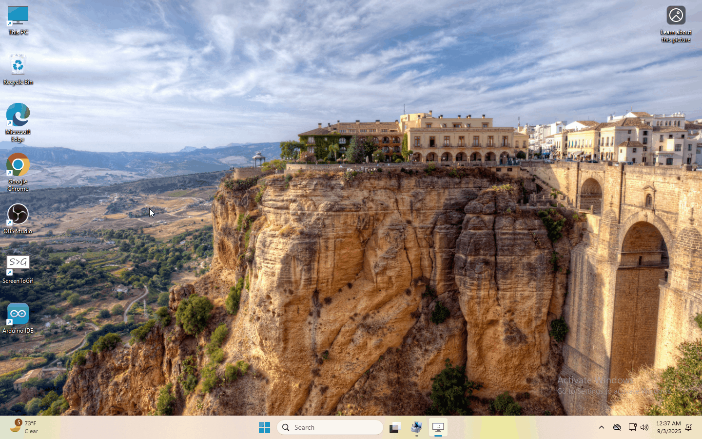
.. |image4| image:: ./images/MicrobitD.gif
.. |image5| image:: ./images/Animation1.gif
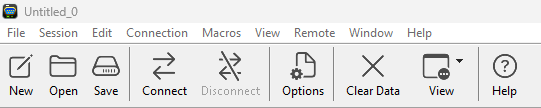
.. |image7| image:: images/2356ba4c94ae3584430f119173f91469925077124a6252fd80568bc2c68f8d83.jpg
.. |image8| image:: ./images/2.gif
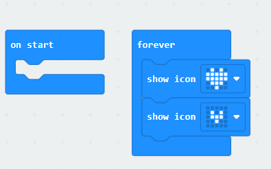
.. |image10| image:: ./images/Heartbeat1.gif
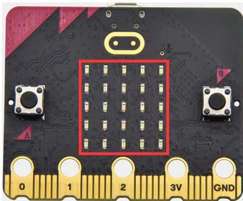
.. |image12| image:: ./images/image-20250904102610952.png
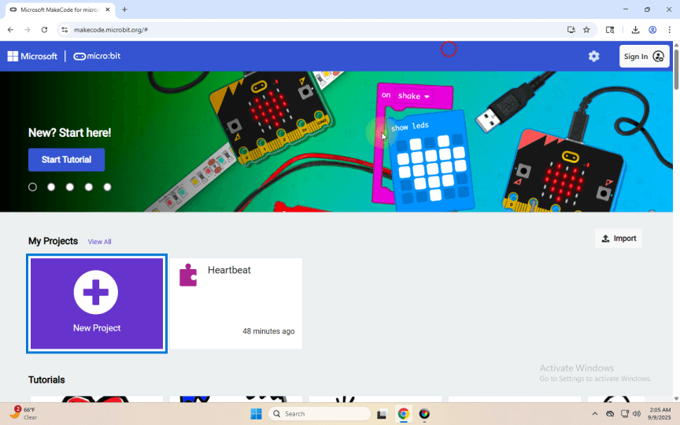
.. |image14| image:: ./images/4.png
.. |image15| image:: ./images/5.gif
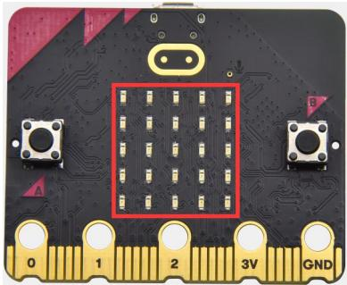
.. |image17| image:: ./images/6.gif
.. |image18| image:: ./images/77.png
.. |image19| image:: ./images/9.gif
.. |image20| image:: ./images/image-20250910093151810.png
.. |image21| image:: ./images/10.gif
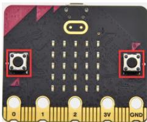
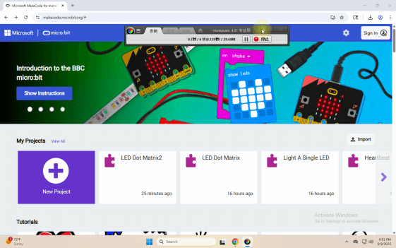
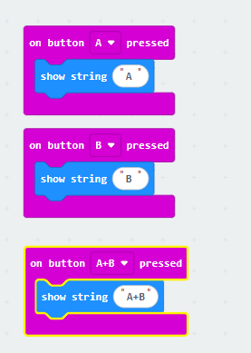
.. |image25| image:: ./images/12.gif
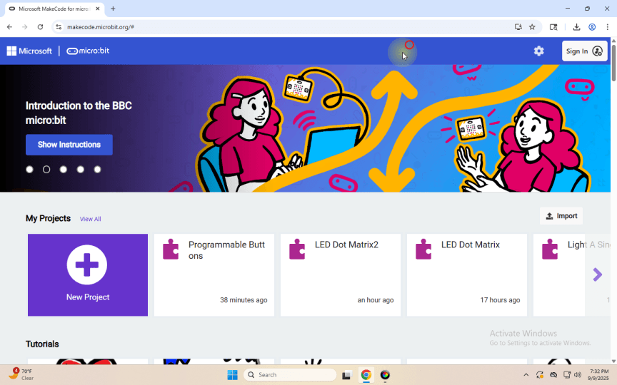
.. |image27| image:: ./images/image-20250910104143540.png
.. |image28| image:: ./images/14.gif
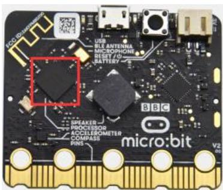
.. |image30| image:: ./images/15.gif
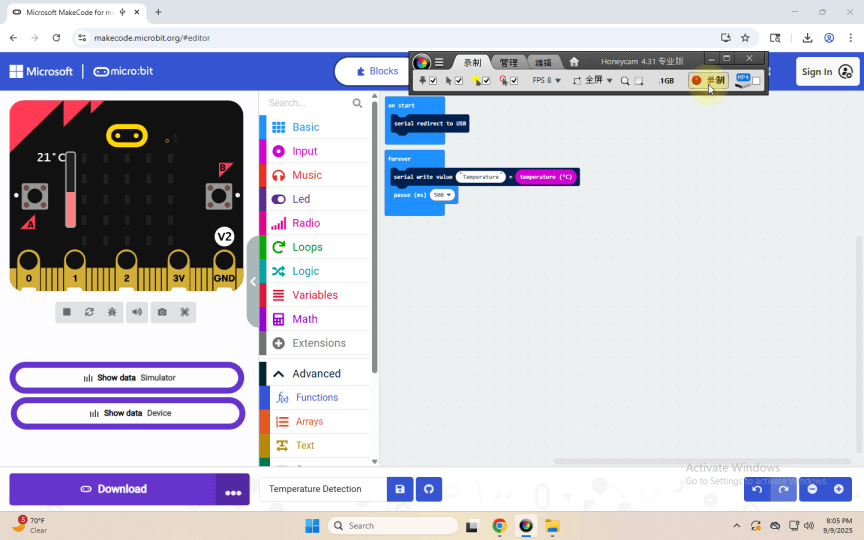
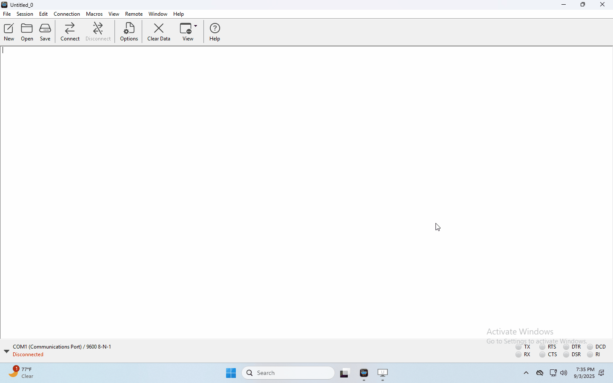
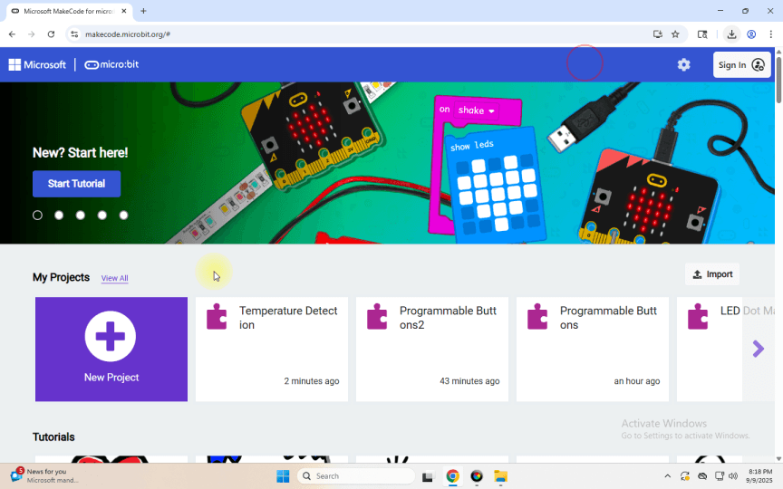
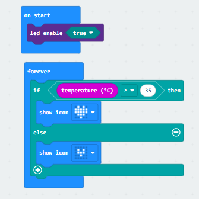
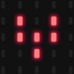
.. |image36| image:: ./images/image-20250905140444458.png
.. |image37| image:: ./images/18.gif
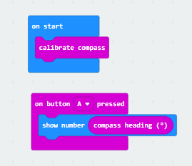
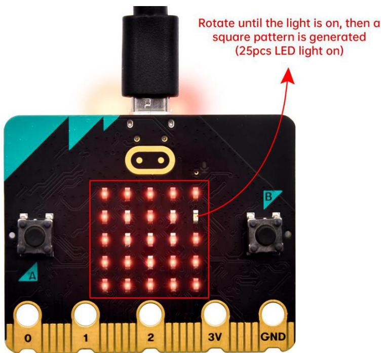
.. |image40| image:: ./images/19.gif
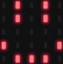
.. |image42| image:: ./images/20.gif
.. |image43| image:: ./images/21.gif
.. |image44| image:: ./images/image-20250911133851330.png
.. |image45| image:: ./images/22.gif
.. |image46| image:: images/1cb21f5abd6e06cd7081d135128579f0ef6870d66a6b9fdf92496a2263d51a24.jpg
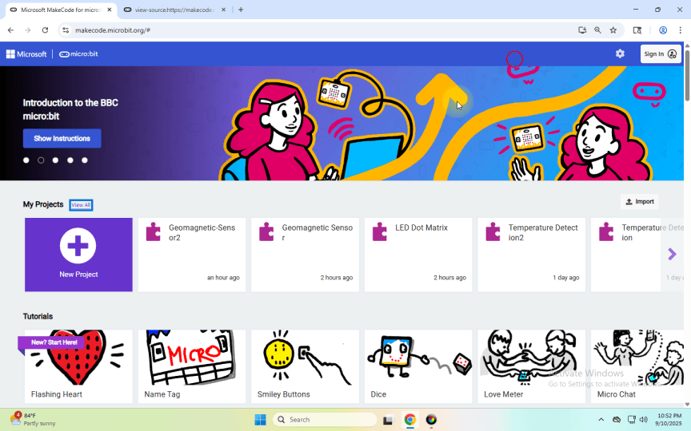
.. |image48| image:: ./images/image-20250911135905779.png
.. |image49| image:: ./images/24.gif
.. |image50| image:: images/7b4f4d9814baf3cae97287c65207a0a0fa990ded2fdf55bdb80f5b0f820c60cc.jpg
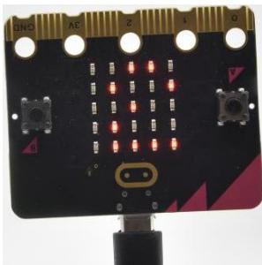
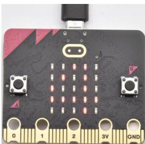
.. |image53| image:: images/30099649e3d210eeb8bcb37957598674e74f569818ed17e8b30230d7de3ca42b.jpg
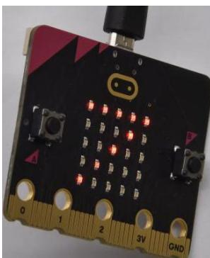
.. |image55| image:: ./images/25.gif
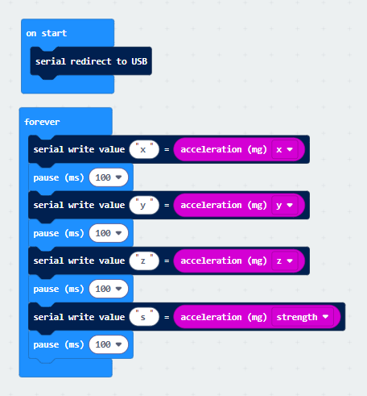
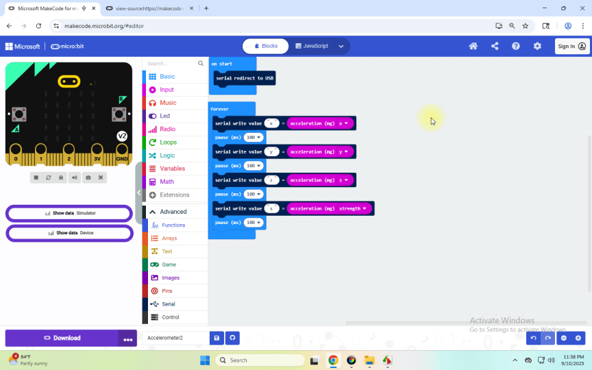
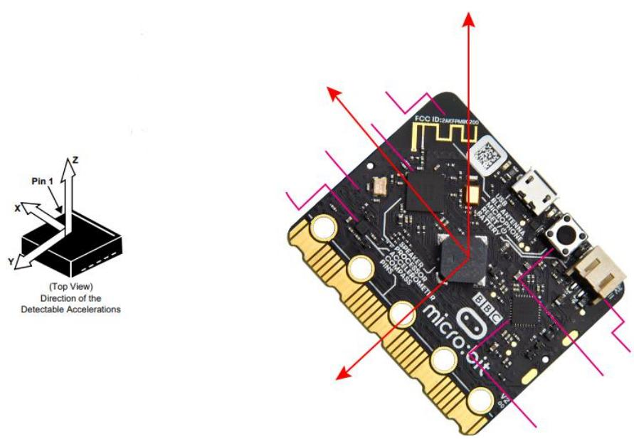
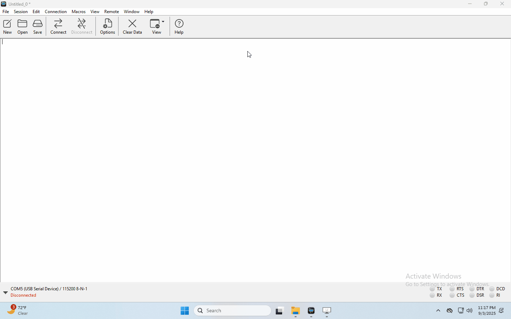
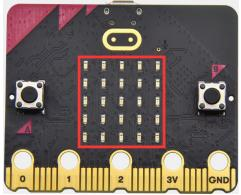
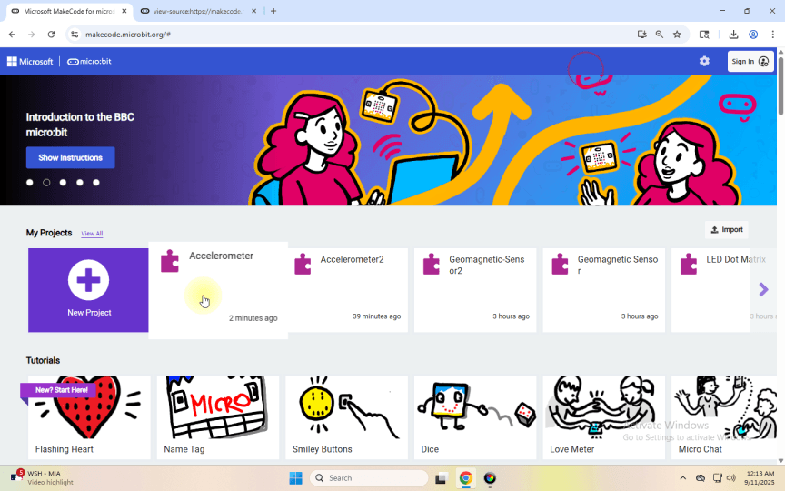
.. |image62| image:: ./images/image-20250911152049091.png
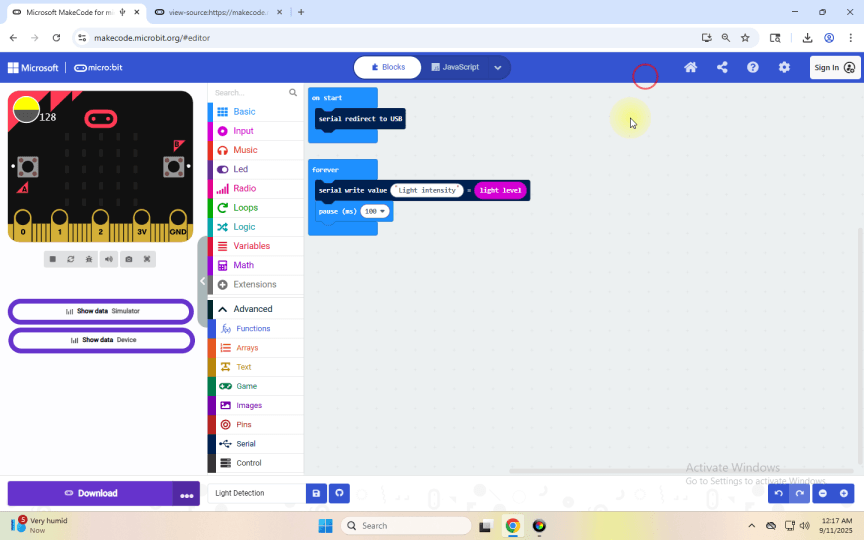
.. |image64| image:: ./images/Animation5.gif
.. |image65| image:: images/e08dd451289c9ff2a732e808f80595ca4a3ccbc339d27818157912ae9229e0f9.jpg
.. |image66| image:: ./images/29.gif
.. |image67| image:: ./images/image-20250911175254769.png
.. |image68| image:: ./images/30.gif
.. |image69| image:: images/df7f211e9ad34bde973f72646fd16f0685ec25421a11aa4b7c0a5f306698d544.jpg
.. |image70| image:: ./images/31.gif
.. |image71| image:: ./images/image-20250912094108039.png
.. |image72| image:: ./images/32.gif
.. |image73| image:: images/3c397f3ca2a8045d397ebba2d5252d6814516443ae43fc9d039a9b75d8357866.jpg
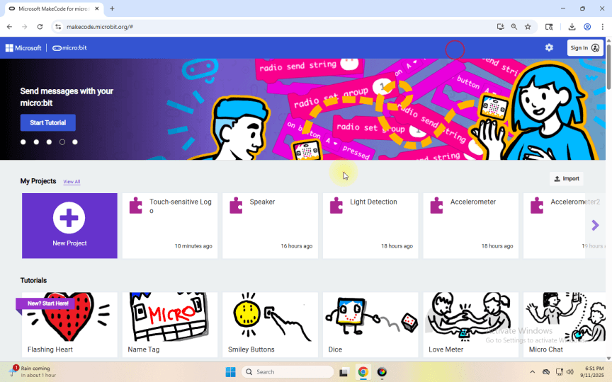
.. |image75| image:: ./images/image-20250912095411405.png
.. |image76| image:: ./images/35.gif
.. |image77| image:: ./images/36.gif
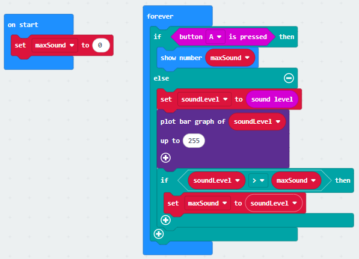
.. |image79| image:: ./images/37.gif
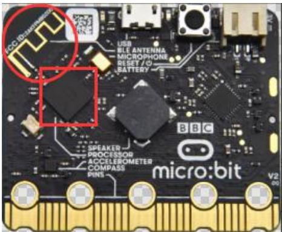
.. |image81| image:: ./images/android.gif

.. |image83| image:: ./images/38.gif
.. |image84| image:: ./images/39.gif
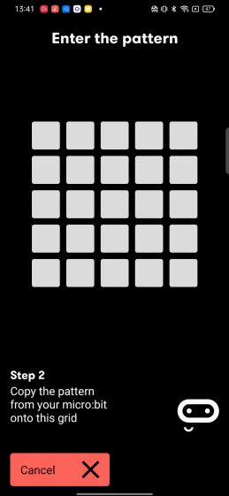
.. |image86| image:: ./images/41.gif
.. |image87| image:: ./images/42.gif
.. |image88| image:: ./images/43.gif
