3. Arduino教程
==============

3.1 资料下载
------------

**Arduino资料包含库文件和项目代码，请点击下载才能进行后续的学习！！！！**

下载： :download:`Arduino资料 <./Arduino.7z>`

**教程所需APP安装包！！！**

下载： :download:`APP <../APP.7z>`

3.2 Windows系统软件下载、安装和开发环境配置
-------------------------------------------

**软件下载**

1. 打开\ `Software \|
   Arduino <https://www.arduino.cc/en/software>`__\ 下载软件，然后选择对应的系统下载，下面以window系统为例。

（\ |image1|)

**注意：win11系统点击\ \ 此处进行到下载页面\ ,无需进行第2步操作.**

2. 然后选择”\ **只需下载**\ ”，再一次选择”\ **只需下载**\ ”，就可以看到正在下载的页面.

|image2|

**软件安装**

1. 点击此处文件夹\ |image3|\ 进入到下载中心，双击\ |image4|\ 进行安装。

2. 选择”\ **我同意(I)**\ ”，跳转页面后选择”\ **仅为我安装（Administrator)**\ ”,再点击”\ **下一步**\ ”。

   |image5|

3. 跳转页面后，点击”\ **浏览（B）**\ ”，可把软件放到指定位置（请用纯英文路径），点击”\ **安装**\ ”，安装完成后，点击”\ **完成**\ ”。

|image6|

**注：点击”完成“后，如果后面出现弹框，请选择肯定的回复，例如选择”是“、”安装“.**

**安装ESP32开发环境**

3.3 MAC系统软件下载、安装和开发环境配置
---------------------------------------

**软件下载**

1、打开浏览器，搜索”https://www.arduino.cc/en/software”，选择macOS版本下载，如图：

   image-20250625103131679

2、之后弹出的界面选择\ **“JUST DOWNLOAD”**\ 。

3、等待下载完成

4、双击下载的软件包等待软件运行，正常打开证明软件安装完成。

.. figure:: ./media/2025-06-23%2009.27.48.png
   :alt: 2025-06-23 09.27.48

3.4 Arduino IDE设置和工具栏介绍
-------------------------------

1. 点击电脑桌面上的\ |image7|\ 图标，打开Arduino IDE。

|image8|

2. 选择正确的Arduino板名称，选择“工具”→“开发板”→“esp32”→“ESP32 Dev
   Module”。

|image9|

3. 选择对应的COM口（安装驱动成功后可看到对应COM口），选择“工具”→“端口”→“对应电脑上的接口（例如图片中的COM3）”

|image10|

4. 认识程序工具栏中的符号功能。

|image11|

A - 用于检查是否存在任何编译错误。

B - 用于将程序上传到Arduino板。

C - 用于从板接收串行数据并将串行数据发送到板的串行监视器。

启动你的第一个程序

3.5 库文件的添加
----------------

**请在此处下载好资料，资料里面包含所需库文件：**

|image12|

1、首先选择\ **“项目”**\ ，选择\ **“导入库”**\ ，再选择“添加.ZIP库”.

|image13|

2、选择要导入的库，点击\ **“打开”**.

|image14|

3、出现“Library installed”证明库导入成功.

|image15|

3.6上传第一个代码
-----------------

1. 开始第一个程序，打开“文件”→“示例”→“01.BASIC”→“Blink”。

|image16|

2. 按照前面方法选择开发板和COM口，IDE右下角显示对应板和COM口。

|image17|

3. 点击\ |image18|\ 图标开始编译程序。

   |image19|

4. 点击\ |image20|\ 图标开始上传程序，显示“上传成功”，证明程序上传成功。

|image21|

程序上传成功，开发板上的LED灯亮一秒钟，灭一秒钟！

3.7 Arduino课程
---------------

项目一 Hello World
~~~~~~~~~~~~~~~~~~

1.1 项目介绍

对于ESP32的初学者，先从一些简单的开始学习吧！在这个项目中，你只需要一个ESP32主板，USB线和计算机就可以完成“Hello
World!”项目。它不仅是ESP32主板和计算机的通信测试，也是ESP32的初级项目。这也是一个入门实验，让你进入计算机的编程世界。

1.2 实验组件

================= =========
|img|             |image22|
================= =========
ESP32 Plus主板 x1 USB线 x1
================= =========

1.3 实验接线图

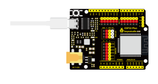

   011301

1.4 实验代码

本项目中使用的代码保存在文件夹“\*\*:raw-latex:`\程序代码`:raw-latex:`\Arduino`\_代码\ **”中，我们可以在此路径下打开代码文件’’**\ HelloWorld.ino*\*“。

.. code:: cpp

   /*
    * 名称   : Hello World
    * 功能   : 输入字母R，串口显示“Hello World”。
    * 作者   : http://www.keyes-robot.com/
   */
   char val;     // 定义变量val 

   void setup()
   {
       Serial.begin(115200);     // 设置波特率为115200
   }

   void loop()
   {
     if (Serial.available() > 0) 
     {
       val=Serial.read();     // 读取赋值给"val"的值
       if(val=='R')     // 检查输入的字母“R”
       {  // if so,    
        Serial.println("Hello World!");      //显示“Hello World !”
       }
     }
   }

1.5 代码说明

+----------------------+----------------------------------------------------------------------------------------------------+
| 代码                 | 说明                                                                                               |
+======================+====================================================================================================+
| char val             | 定义一个变量val                                                                                    |
+----------------------+----------------------------------------------------------------------------------------------------+
| Serial.begin(115200) | 设置波特率为115200                                                                                 |
+----------------------+----------------------------------------------------------------------------------------------------+
| Serial.available( )  | 获取串口上可读取的数据的字节数，该数据已经到达并存储在接收缓存（共有64字节）中。Serial.available() |
|                      | > 0表示串口接收到了数据，可以读取。                                                                |
+----------------------+----------------------------------------------------------------------------------------------------+
| Serial.read( )       | 读取写入的串行数据。                                                                               |
+----------------------+----------------------------------------------------------------------------------------------------+
| if( ){ }             | 如果“（ ）”里的条件满足，则执行“{ }”里的程序。                                                     |
+----------------------+----------------------------------------------------------------------------------------------------+
| Serial.println( )    | 换行输出数据。从串行端口输出数据，跟随一个回车和一个换行符。                                       |
+----------------------+----------------------------------------------------------------------------------------------------+

--------------

1.6 实验结果

代码上传成功后，单击串口监视器图标\ |image23|\ 进入串口监视器，设置波特率为\ **115200**\ ，接着在文本框输入字母“\ **R**\ ”。

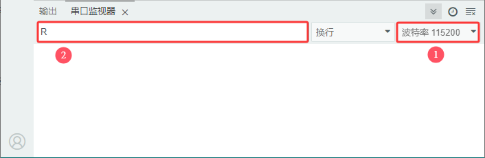

   011501

按下键盘上的回车键，在串口监视器上打印“\ **Hello World!**\ ”。

--------------

项目二 LED
~~~~~~~~~~

1.1 项目介绍

LED，即发光二极管的简称。由含镓（Ga）、砷（As）、磷（P）、氮（N）等的\ `化合物 <https://baike.baidu.com/item/化合物/1142931>`__\ 制成。当电子与\ `空穴 <https://baike.baidu.com/item/空穴/3517781>`__\ 复合时能辐射出可见光，因而可以用来制成发光二极管。在电路及仪器中作为指示灯，或者组成文字或数字显示。砷化镓二极管发红光，磷化镓二极管发绿光，碳化硅二极管发黄光，氮化镓二极管发蓝光。因化学性质又分有机发光二极管OLED和无机发光二极管LED。

为了实验的方便，我们将紫色LED发光二极管做成了一个紫色LED模块。它的控制方法非常简单，只要让LED两端有一定的电压就可以点亮LED。在这个项目中，我们用一个最基本的测试代码来控制LED，亮一秒钟，灭一秒钟，来实现闪烁的效果。你可以改变代码中LED灯亮灭的时间，实现不同的闪烁效果。我们通过编程控制信号端S的高低电平，从而控制LED的亮灭。LED模块信号端S为高电平时LED亮起，S为低电平时LED熄灭。

1.2 模块参数

工作电压：DC 3.3-5V

控制信号：数字信号

尺寸：32 x 23.5 x 12 mm

定位孔大小：直径为 4.8 mm

接口：间距为2.54 mm 3pin防反接口

1.3 模块原理图

.. figure:: ./media/021301.jpg
   :alt: img

这是一个常用的LED模块，它采用F5-白发紫LED（外观白色，显示紫光）元件。同时，模块上自带一个间距为
2.54mm 的 3pin 防反插红色端子。控制时，模块上GND
VCC供电后，信号端S为高电平时，模块上LED亮起。

模块兼容各种单片机控制板，如arduino系列单片机。

1.4 实验组件

+----------------+----------------+-------------------+--------------+
| |img|          | |image24|      | |image25|         | |image26|    |
+================+================+===================+==============+
| ESP32 Plus主板 | Keyes          | XH2.54-3P         | USB线 x1     |
| x1             | 紫色LED模块 x1 | 转杜邦线母单线 x1 |              |
+----------------+----------------+-------------------+--------------+

1.5 模块接线图

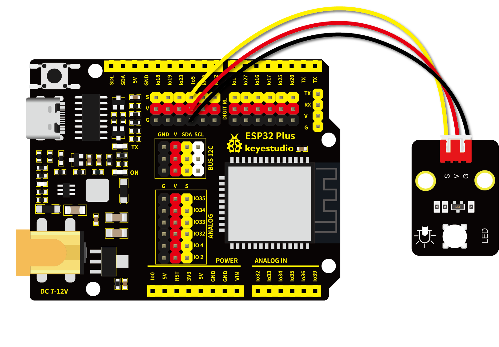

   021501

1.6 实验代码

本项目中使用的代码保存在文件夹“\*\*:raw-latex:`\程序代码`:raw-latex:`\Arduino`\_代码\ **”中，我们可以在此路径下打开代码文件’’**\ blink.ino*\*“。

.. code:: cpp

   /*
    * 名称   : Blink
    * 功能   : led 闪烁 1s
    * 作者   : http://www.keyes-robot.com/
   */
   int ledPin = 5;       //定义LED引脚连接到GPIO5

   void setup() 
   {
     pinMode(ledPin, OUTPUT);      //设置输出模式
   }

   void loop() 
   {
     digitalWrite(ledPin, HIGH);       //输出高电平，打开led
     delay(1000);//延时 1000 ms
     digitalWrite(ledPin, LOW);        //输出低电平，关闭led
     delay(1000);//延时 1000 ms
   }

1.7 代码说明

+----------------------+-------------------------------------------------------------------------+
| 代码                 | 说明                                                                    |
+======================+=========================================================================+
| pinMode(ledPin,      | 设置引脚的模式。OUTPUT为输出模式；INPUT为输入模式                       |
| OUTPUT);             |                                                                         |
+----------------------+-------------------------------------------------------------------------+
| digitalWrite(ledPin, | 设置引脚的输出电压为高电平，LOW为低电平。                               |
| HIGH);               |                                                                         |
+----------------------+-------------------------------------------------------------------------+
| delay(1000)          | 将程序的执行暂停1000毫秒，也就是延时，使LED灯保持亮或灭的状态1000毫秒。 |
+----------------------+-------------------------------------------------------------------------+

1.8 实验结果

代码上传成功后，你会看到模块上的紫色LED一亮一灭，循环闪烁。

.. figure:: ./media/021701.png
   :alt: img

   img

.. figure:: ./media/021702.png
   :alt: img

   img

项目三 交通灯模块
~~~~~~~~~~~~~~~~~

1.1 项目介绍

交通灯，也就是马路上十字路口的红绿灯，在我们的日常生活中很常见。交通灯是由红、黄、绿三种颜色组成的，根据一定的时间规律循环交替亮起或熄灭。每个人都应该遵守交通规则，这可以避免许多交通事故。

想学习交通灯的原理吗？我们可以用红、黄、绿3个LED外接电路来模拟马路上的交通灯。因此我们特别设计了这款交通灯模块，模块上的红、黄、绿3个LED灯模拟交通灯。

1.2 模块参数

工作电压 : DC 5V

电流 ：100 mA

最大功率 ：0.5 W

工作温度 ：-10°C ~ +50°C

输入信号 : 数字信号

尺寸 ：47.6 x 23.8 x 11.8 mm

定位孔大小：直径为 4.8 mm

接口 ：间距为2.54 mm 5pin防反接口

1.3 模块原理图

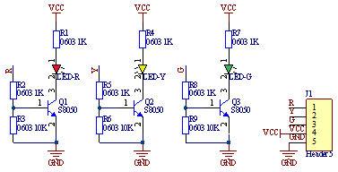

   031301

上一课我们学习了如何控制一个LED，由原理图可以得知，控制这个模块就好比分别控制3个独立的LED灯(我们这个灯可直接由单片机IO口驱动)，给对应颜色灯高电平就亮起对应的颜色。比如，我们给信号“R”输出高电平，也就是3.3V，则红色LED点亮。

1.4 实验组件

+----------------+----------------+-------------------+--------------+
| |img|          | |image27|      | |image28|         | |image29|    |
+================+================+===================+==============+
| ESP32 Plus主板 | Keyes          | XH2.54-5P         | USB线 x1     |
| x1             | 交通灯模块 x1  | 转杜邦线母单线 x1 |              |
+----------------+----------------+-------------------+--------------+

1.5 模块接线图

.. figure:: media/031501.jpg
   :alt: img

   img

1.6 实验代码

本项目中使用的代码保存在文件夹“\*\*:raw-latex:`\程序代码`:raw-latex:`\Arduino`\_代码\ **”中，我们可以在此路径下打开代码文件’’**\ Traffic_Light.ino*\*“。

.. code:: cpp

   /*
    * 名称   : Traffic_Light
    * 功能   : 模拟交通灯
    * 作者   : http://www.keyes-robot.com/ 
   */
   int redPin = 5;          // 红色LED连接GPIO5
   int yellowPin = 13;   // 黄色LED连接到GPIO13
   int greenPin = 12;    // 绿色LED连接GPIO12

   void setup() 
   {
     //LED接口设置为输出模式
     pinMode(greenPin, OUTPUT);
     pinMode(yellowPin, OUTPUT);
     pinMode(redPin, OUTPUT);
   }

   void loop() 
   {
     digitalWrite(greenPin, HIGH);   //点亮绿色LED
     delay(5000);   //亮5秒
     digitalWrite(greenPin, LOW);   //关闭绿色LED
     for (int i = 0; i < 3; i++) //循环三次
     {  
       digitalWrite(yellowPin, HIGH);  //点亮黄色LED
       delay(500);  //亮0.5秒
       digitalWrite(yellowPin, LOW);  //熄灭黄色LED
       delay(500);  //灭0.5秒
     }
     digitalWrite(redPin, HIGH);   //点亮红色LED
     delay(5000);  //亮5秒
     digitalWrite(redPin, LOW);   //关闭红色LED
   }

1.7 代码说明

.. code:: cpp

   for (int i = 0; i < 3; i++) {  //循环三次
       digitalWrite(yellowPin, HIGH);  //点亮黄色LED
       delay(500);  //亮0.5秒
       digitalWrite(yellowPin, LOW);  //熄灭黄色LED
       delay(500);  //灭0.5秒
   }

这段代码的作用是让 **黄色LED灯闪烁3次**\ ，每次亮0.5秒，灭0.5秒。

**逐行分析：**

1. ``for (int i = 0; i < 3; i++)``

   - 这是一个 ``for`` 循环，会执行 **3次**\ （\ ``i`` 从 ``1``
     开始，每次 ``+1``\ ，直到 ``i < 3`` 不成立）。

2. ``digitalWrite(yellowPin, HIGH);``

   - 让 ``yellowPin`` 引脚输出 **高电平（HIGH）**\ ，点亮黄色LED。

3. ``delay(500);``

   - 程序暂停 **500毫秒（0.5秒）**\ ，保持LED亮。

4. ``digitalWrite(yellowPin, LOW);``

   - 让 ``yellowPin`` 引脚输出 **低电平（LOW）**\ ，关闭LED。

5. ``delay(500);``

   - 再暂停 **0.5秒**\ ，保持LED灭。

6. ``}``

   - 循环结束，回到 ``for`` 开头，检查是否继续执行。

--------------

``for`` 循环的原理和作用

**基本结构：**

::

   for (初始化; 条件; 更新) {
       // 循环执行的代码
   }

========== ==================================== =============
部分       作用                                 示例
========== ==================================== =============
**初始化** 设置循环变量初始值                   ``int i = 0``
**条件**   每次循环前检查，若为 ``true`` 则继续 ``i < 3``
**更新**   每次循环后修改变量                   ``i++``
========== ==================================== =============

**执行流程：**

1. **初始化** ``i = 0``
2. **检查条件** ``i < 3``\ （成立）→ 执行循环体
3. **执行完循环体** → **更新** ``i++``\ （\ ``i`` 变为 ``1``\ ）
4. 重复步骤 2~3，直到 ``i = 3`` 时条件不成立 → 退出循环

1.8 实验结果

代码上传成功后，你会看到模块上绿色LED亮5秒然后熄灭，黄色LED闪烁3秒然后熄灭，红色LED亮5秒然后熄灭。模块按此顺序循环亮灭。

.. figure:: media/031701.gif
   :alt: 031701

   031701

项目四 激光头传感器模块发出激光
~~~~~~~~~~~~~~~~~~~~~~~~~~~~~~~

1.1 项目介绍

在这个套件中，有一个Keyes
激光头传感器，激光与常见的光不同。一方面，激光的单色性好。另一方面，激光发射器内部特定的结构，使得激光能够被聚集成单束光，朝着同一方向射出，亮度高，方向性好。

正是由于这些特性，激光被广泛用于对特定材料进行切割、焊接、表面处理等等。激光的能量非常高，玩具激光笔照射人眼可能导致眩光，长时间可能导致视网膜损害，我国也禁止用激光照射航行的飞机。因此，\ **请注意不要用激光发射器对准人眼。**

1.2 模块参数

工作电压 ：DC 5V

工作温度 ：-10°C ~ +50°C

输入信号 ：数字信号

尺寸 ：32 x 23.8 x 10 mm

定位孔大小 ：直径为 4.8 mm

接口 ：间距为2.54 mm 3pin防反接口

1.3 模块原理图

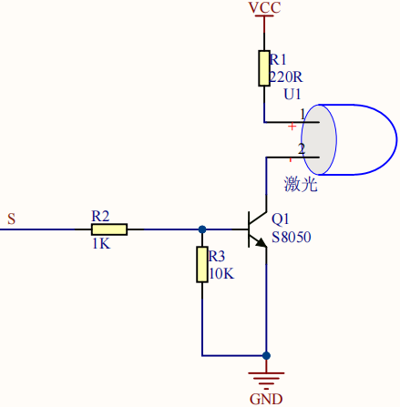

   img

激光头传感器主要由激光头组成，激光头由发光管芯、聚光透镜、铜可调套筒三部分组成。

从激光模块的电路原理图我们可以知道，它是用三极管驱动的。激光头的 1
脚始终上拉到VCC，在信号端 S
处输入一个高电平数字信号，NPN三极管Q1导通，激光头的 2
脚被下拉到GND，此时传感器开始工作。在信号端 S
处输入低电平时NPN三极管Q1不导通，传感器停止工作。

1.4 实验组件

+----------------+----------------+-------------------+--------------+
| |img|          | |image30|      | |image31|         | |image32|    |
+================+================+===================+==============+
| ESP32 Plus主板 | Keyes 激光模块 | XH2.54-3P         | USB线 x1     |
| x1             | x1             | 转杜邦线母单线 x1 |              |
+----------------+----------------+-------------------+--------------+

1.5 模块接线图

.. figure:: ./media/041501.png
   :alt: img

   img

1.6 实验代码

本项目中使用的代码保存在文件夹“\*\*:raw-latex:`\程序代码`:raw-latex:`\Arduino`\_代码\ **”中，我们可以在此路径下打开代码文件’’**\ Laser.ino*\*“。

.. code:: cpp

   /*
    * 名称   : Laser sensor
    * 功能   : 激光灯闪光
    * 作者   : http://www.keyes-robot.com/
   */
   int laserPin = 5;                //定义激光引脚为GPIO5

   void setup() 
   {
     pinMode(laserPin, OUTPUT);     //将激光引脚定义为输出模式
   }

   void loop() 
   {
     digitalWrite(laserPin, HIGH);     //打开激光
     delay(2000);                      //延迟2秒
     digitalWrite(laserPin, LOW);      //关闭激光
     delay(2000);                      //延迟2秒
   }

1.7 代码说明

此课程代码与第二课代码类似，这里就不多做介绍了。

1.8 实验结果

代码上传成功后，能看到模块上激光管发射红色激光信号2秒，然后关闭发射2秒，循环交替。

.. figure:: ./media/041701.png
   :alt: 041701

   041701

项目五 呼吸灯
~~~~~~~~~~~~~

1.1 项目介绍

在第二课我们学习了如何让LED闪烁。但是LED的玩法远不仅如此。在日常生活中你有没有遇到过灯光慢慢变亮或者慢慢变暗呢？这叫呼吸灯。所谓呼吸灯，就是控制LED逐渐变亮，然后逐渐变暗，循环交替。上一课我们学会了直接用高电平点亮LED，低电平熄灭LED。如果要让LED不那么亮但又不完全熄灭，介于中间状态，只需控制流过LED的电流就可以实现。电流减小LED变暗，电流增大LED变亮。所以只需要调节LED两端的电压减小或增大（电流也会随之减小或增大）就能控制LED的亮暗程度了。

数字端口电压输出只有LOW与HIGH两个开关，对应的就是0V与3.3V（或5V）的电压输出。可以把LOW定义为0，HIGH定义为1，1秒内让单片机输出500个0或者1的信号。如果这500个信号全部为1，那就是完整的3.3V；如果全部为0，那就是0V。如果010101010101这样输出，刚好一半，端口输出的平均电压就为1.65V了。这和放映电影是一个道理。我们所看的电影并不是完全连续的，它其实是每秒输出25张图片，人的肉眼分辨不出来，看上去就是连续的了，PWM也是同样的道理。如果想要不同的电压，就控制0与1的输出比例就可以了。当然这和真实的连续输出还是有差别的，单位时间内输出的0,1信号越多，控制的就越精确。

那么什么是PWM呢？PWM简称脉宽调制，是利用微处理器的数字输出来对模拟电路进行控制的一种非常有效的技术。

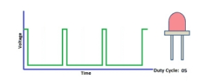

   img

PWM的频率是指在1秒钟内，信号从高电平到低电平再回到高电平的次数，也就是说一秒钟PWM有多少个周期，单位Hz。

PWM的周期，T=1/f，T是周期，f是频率。如果频率为50Hz
，也就是说一个周期是20ms，那么一秒钟就有 50次PWM周期。

占空比，是一个脉冲周期内，高电平的时间与整个周期时间的比例，单位是%
(0%-100%) 一个周期的长度。如下图所示。

.. figure:: ./media/061102.jpg
   :alt: img

   img

这一课学习使用PWM来控制0与1的输出比例实现控制电压。

1.2 模块参数

工作电压 : DC 3.3 ~ 5V

工作温度 ：-10°C ~ +50°C

控制信号 : 数字信号

尺寸 ：32 x 23.8 x 12 mm

定位孔大小：直径为 4.8 mm

接口 ：间距为2.54 mm 3pin防反接口

1.3 模块原理图

.. figure:: ./media/021301.jpg
   :alt: img

   img

前面实验二我们就学习了如何控制一个LED，由原理图可以得知，控制时，模块上GND
VCC供电后，信号端S为高电平时，模块上LED亮起。

1.4 实验组件

+----------------+----------------+-------------------+--------------+
| |img|          | |image33|      | |image34|         | |image35|    |
+================+================+===================+==============+
| ESP32 Plus主板 | Keyes          | XH2.54-3P         | USB线 x1     |
| x1             | 紫色LED模块 x1 | 转杜邦线母单线 x1 |              |
+----------------+----------------+-------------------+--------------+

1.5 模块接线图

   img

1.6 实验代码

本项目中使用的代码保存在文件夹“\*\*:raw-latex:`\程序代码`:raw-latex:`\Arduino`\_代码\ **”中，我们可以在此路径下代码文件’’**\ Breath.ino*\*“。

.. code:: cpp

   /*
    * 名称   : Breathing Led
    * 功能   : 让led灯像呼吸一样忽明忽暗。
    * 作者   : http//www.keyestudio.com
   */
   const int PWM_LED_Pin = 5;  // LED 的 GPIO 引脚

   void setup()
   {
     pinMode(PWM_LED_Pin, OUTPUT);  // 将 LED 引脚设置为输出模式
   }

   void loop() 
   {
     for (int i = 0; i < 255; i++) // 让灯光渐亮
     {  
       analogWrite(PWM_LED_Pin, i);   //输出 PWM
       delay(10);                     //延迟 10ms
     }
     for (int i = 255; i >= 0; i--) // 让光线逐渐减弱消失
     {  
       analogWrite(PWM_LED_Pin, i);    //输出 PWM
       delay(10);                      //延迟 10ms
     }
   }

1.7 代码说明

.. code:: cpp

     for (int i = 0; i < 255; i++) {  // 让灯光渐亮
       analogWrite(PWM_LED_Pin, i);   // 输出 PWM
       delay(10);                     // 延迟 10ms
     }

**渐亮过程**\ ：

- PWM值从0逐步增加到255
- 每次增加1，间隔10ms
- LED亮度从完全关闭逐渐变为最亮

.. code:: cpp

     for (int i = 255; i >= 0; i--) 
     {  // 让光线逐渐减弱消失
       analogWrite(PWM_LED_Pin, i);    // 输出 PWM
       delay(10);                      // 延迟 10ms
     }

**渐暗过程**\ ：

- PWM值从255逐步减少到0
- 每次减少1，间隔10ms
- LED亮度从最亮逐渐变为完全关闭

1.8 实验结果

代码上传成功后，能看到模块上的紫色LED从暗逐渐变亮，再从亮逐渐变暗，就像呼吸一样。

项目六 RGB模块调节LED颜色
~~~~~~~~~~~~~~~~~~~~~~~~~

1.1 项目介绍

在这个套件中，有一个Keyes
共阴RGB模块，它采用F10-全彩RGB雾状共阴LED元件。控制时，我们需要将模块的R、G、B脚连接至单片机的PWM口。由于我们这个RGB模块是共阴的，公共管脚就接GND（共阳RGB公共管脚接VCC)。

RGB三色也就是三基色，红色、绿色、蓝色。人眼对RGB三色最为敏感，大多数的颜色可以通过RGB三色按照不同的比例合成产生。同样绝大多数单色光也可以分解成RGB三种色光。这是色度学的最基本原理，即三基色原理。RGB三基色按照不同的比例相加合成混色称为相加混色，除了相加混色法之外还有相减混色法。可根据需要相加相减调配颜色。

接下来，我们基于刚刚学习的三基色原理，通过PWM端口控制R、G、B各色的占空比，使R、G、B三色按照不同的比例合成产生多重颜色显示在LED上。

1.2 模块参数

工作电压 ：DC 3.3 ~ 5V

工作温度 ：-10°C ~ +50°C

输入信号 ：PWM信号

尺寸 ：32 x 23.8 x 16.9 mm

定位孔大小 ：直径为 4.8 mm

接口 ：间距为2.54 mm 4pin防反接口

1.3 模块原理图

.. figure:: ./media/061301.png
   :alt: img

   img

通过调节R、G、B、三个灯的PWM值，控制LED元件显示红光、绿光和蓝光的比例，从而控制RGB模块上LED显示不同颜色灯光。当设置的PWM值越大，对应显示的颜色比例越重。理论上来说，通过调节这3中颜色光的混合比例，可以模拟出所有颜色的灯光。

1.4 实验组件

+----------------+----------------+---------------------+-------------+
| |img|          | |image36|      | |image37|           | |image38|   |
+================+================+=====================+=============+
| ESP32 Plus主板 | Keyes          | XH2.54-4P           | USB线 x1    |
| x1             | 共阴RGB模块 x1 | 转杜邦线母单线 x1   |             |
+----------------+----------------+---------------------+-------------+

1.5 模块接线图

.. figure:: ./media/061501.png
   :alt: img

   img

1.6 实验代码

本项目中使用的代码保存在文件夹“\*\*:raw-latex:`\程序代码`:raw-latex:`\Arduino`\_代码\ **”中，我们可以在此路径下打开代码文件’’**\ RGB.ino*\*“。

.. code:: cpp

   /*
    * 名称   : RGB
    * 功能   : 使用RGBLED显示随机颜色
    * 作者   : http://www.keyes-robot.com/ 
   */
   // RGB引脚定义
   #define RED_PIN   32
   #define GREEN_PIN 4
   #define BLUE_PIN  2

   void setup() 
   {
     //将控制引脚设置为输出模式
     pinMode(RED_PIN,OUTPUT);
     pinMode(GREEN_PIN,OUTPUT);
     pinMode(BLUE_PIN,OUTPUT);
   }

   void loop() 
   {
     // 生成随机颜色值 (0~255)
     int r = random(256);
     int g = random(256);
     int b = random(256);

     analogWrite(RED_PIN,r);
     analogWrite(GREEN_PIN,g);
     analogWrite(BLUE_PIN,b);
     delay(1000);
   }

1.7 代码说明

+-------------------------+----------------------------------------------+
| 代码                    | 说明                                         |
+=========================+==============================================+
| const int freq = 5000;  | PWM频率，5000Hz适合LED，避免闪烁。           |
+-------------------------+----------------------------------------------+
| const int resolution =  | 8位精度，可设置亮度值                        |
| 8;                      | 0~255（0最暗，255最亮）。                    |
+-------------------------+----------------------------------------------+
| random(256);            | 生成 0~255 的随机数，覆盖所有亮度级别。      |
+-------------------------+----------------------------------------------+
| analogWrite(RED_PIN,r); | 生成随机R值。                                |
+-------------------------+----------------------------------------------+

1.8 实验结果

代码上传成功后，能看到模块上RGB LED开始随机显示颜色。

.. figure:: ./media/061701.png
   :alt: img

   img

.. figure:: ./media/061702.png
   :alt: img

   img

项目七 按键传感器检测实验
~~~~~~~~~~~~~~~~~~~~~~~~~

1.1 项目介绍

在这个套件中，有一个Keyes单路按键模块，它主要由1个轻触开关组成，自带1个黄色按键帽。第二课我们学习了怎么让单片机的引脚输出一个高电平或者低电平，这节课程我们就来学习怎么读取引脚的电平。

按键模块的按键按下，单片机读取到低电平，松开按键读取到高电平。通过读取传感器上S端的高低电平，判断按键是否按下，并且在串口监视器上显示测试结果。

1.2 模块参数

工作电压 : DC 3.3 ~ 5V

工作温度 ：-10°C ~ +50°C

控制信号 : 数字信号

尺寸 ：32 x 23.8 x 15.6 mm

定位孔大小：直径为 4.8 mm

接口 ：间距为2.54 mm 3pin防反接口

1.3 模块原理图

.. figure:: ./media/071301.png
   :alt: img

   img

按键有四个引脚，其中1与3相连，2与4相连。按键未被按下时，13与24是断开的。信号端S读取的电平是被4.7K的上拉电阻R1所拉高的高电平。而当按键被按下时，13和24连通，原本上拉的13脚被24脚接的GND下拉至低电平，此时信号端S读取到低电平。即按下按键，传感器信号端S为低电平；松开按键时，信号端S为高电平。

1.4 实验组件

+----------------+----------------+-------------------+--------------+
| |img|          | |image39|      | |image40|         | |image41|    |
+================+================+===================+==============+
| ESP32 Plus主板 | Keyes          | XH2.54-3P         | USB线 x1     |
| x1             | 单路按键模块   | 转杜邦线母单线 x1 |              |
|                | x1             |                   |              |
+----------------+----------------+-------------------+--------------+

1.5 模块接线图

.. figure:: ./media/071501.png
   :alt: img

   img

1.6 实验代码

本项目中使用的代码保存在文件夹“\*\*:raw-latex:`\程序代码`:raw-latex:`\Arduino`\_代码\ **”中，我们可以在此路径下打开代码文件’’**\ button.ino*\*“。

.. code:: cpp

   /*
    * 名称   : button
    * 功能   : 读键值
    * 作者   : http://www.keyes-robot.com/ 
   */
   int val = 0;            //用于存储键值
   int button = 5;         //将按钮的引脚连接到GPIO5

   void setup() 
   {
     Serial.begin(115200);      //启动串口监视器，设置波特率为115200
     pinMode(button, INPUT);  //设置按钮引脚为输入模式
   }

   void loop() 
   {
     val = digitalRead(button);  // 读取按钮状态（0或1）
     Serial.print(val);          // 打印原始电平值

     if (val == 0) 
     {             // 按钮按下（低电平）
       Serial.println("\t Press the botton");
       delay(100);               // 防抖延迟
     }
     else 
     {                      // 按钮松开（高电平）
       Serial.println("\t Loosen the botton");
       delay(100);               // 防抖延迟
     }
   }

1.7 代码说明

.. code:: cpp

   void loop()
   {
     val = digitalRead(button);  // 读取按钮状态（0或1）
     Serial.print(val);          // 打印原始电平值

     if (val == 0) 
     {             // 按钮按下（低电平）
       Serial.println("\t Press the button");
       delay(100);               // 防抖延迟
     }
     else 
     {                      // 按钮松开（高电平）
       Serial.println("\t Loosen the button");
       delay(100);               // 防抖延迟
     }
   }

- ``digitalRead(button)``\ ：读取按钮引脚的电平。

  - **通常逻辑**\ ：

    - ``0``\ （低电平）：按钮按下（引脚接地）。
    - ``1``\ （高电平）：按钮松开（引脚接上拉电阻至VCC）。

- ``if``\ ：判断按钮是否按下。

  .. code:: cpp

     if (val == 0) {               // 检查按钮是否按下（val为0）
         Serial.println("\t Press the button");  // 按下时打印信息
     }

  - **作用**\ ：当 ``val`` 等于 ``0``\ （按钮按下）时，执行大括号 ``{}``
    内的代码（打印”Press the button”）；否则跳过。

  .. code:: cpp

     else {                        // 否则（val不等于0）
         Serial.println("\t Loosen the button"); // 松开时打印信息
     }

  - **作用**\ ：当 ``if`` 条件不成立时（即 ``val`` 不是 ``0``\ ），执行
    ``else`` 部分的代码（打印”Loosen the button”）。

- ``delay(100)``\ ：简易防抖，避免机械抖动导致误判。

1.8 实验结果

代码上传成功后，打开串口监视器，设置波特率为\ **115200**\ 。

当按下传感器模块上的按键时，按键值value为0，串口监视器打印出“\ **0 Press
the button**\ ”；松开按键时，按键值value为1，串口监视器打印出“\ **1
Loosen the button**\ ”字符。

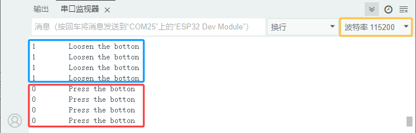

   img

--------------

项目八 电容触摸传感器检测实验
~~~~~~~~~~~~~~~~~~~~~~~~~~~~~

1.1 项目介绍

在这个套件中，有一个Keyes 电容触摸模块，它主要由1个触摸检测芯片
TTP223-BA6
构成。模块上提供一个触摸按键，功能是用可变面积的按键取代传统按键。当我们上电之后，传感器需要约0.5秒的稳定时间，此时间段内不要触摸按键，此时所有功能都被禁止，始终进行自校准，校准周期约为4秒。

1.2 模块参数

工作电压 ：DC 3.3 ~ 5V

最大功率 ：0.3 W

工作温度 ：-10°C ~ +50°C

输出信号 ：数字信号

尺寸 ：32 x 23.8 x 9 mm

定位孔大小 ：直径为 4.8 mm

接口 ：间距为2.54 mm 3pin防反接口

1.3 模块原理图

.. figure:: ./media/081301.png
   :alt: img

   img

TTP223N-BA6 的输出通过 AHLB（4）引脚选择高电平或低电平有效。通过
TOG（6）引脚选择直接模式或触发模式。

=== ==== =====================
TOG AHLB 引脚Q的功能
=== ==== =====================
0   0    直接模式，高电平有效
0   1    直接模式，低电平有效
1   0    触发模式，上电状态为0
1   1    触发模式，上电状态为1
=== ==== =====================

从原理图我们可以知道 TOG 脚和 AHLB
脚是悬空的，此时输出为直接模式，高电平有效。

当我们用手指触摸模块上的感应区时，信号端 S
输出高电平（上一课学习的按键模块与之相反，当按键感应到按下输出低电平），板载红色LED点亮，我们通过读取模块上
S 端的高低电平，判断电容触摸模块上的感应区是否感应到触摸。

1.4 实验组件

+----------------+----------------+-------------------+--------------+
| |img|          | |image42|      | |image43|         | |image44|    |
+================+================+===================+==============+
| ESP32 Plus主板 | Keyes          | XH2.54-3P         | USB线 x1     |
| x1             | 电容触摸模块   | 转杜邦线母单线 x1 |              |
|                | x1             |                   |              |
+----------------+----------------+-------------------+--------------+

1.5 模块接线图

.. figure:: media/081501.png
   :alt: img

   img

1.6 实验代码

本项目中使用的代码保存在文件夹“\*\*:raw-latex:`\程序代码`:raw-latex:`\Arduino`\_代码\ **”中，我们可以在此路径下打开代码文件’’**\ Touch_sensor.ino*\*“。

.. code:: cpp

   /*
    * 名称   : Touch sensor
    * 功能   : 读取触摸模块的值
    * 作者   : http://www.keyes-robot.com/ 
   */
   int val = 0;
   int touch = 5;            //定义触摸引脚 

   void setup() 
   {
     Serial.begin(115200);     //波特率为115200
     pinMode(touch, INPUT);  //设置触摸引脚为输入模式
   }

   void loop() 
   {
     val = digitalRead(touch); //读取触摸引脚的值
     Serial.print(val);        //打印触摸引脚的值
     if (val == 1) 
     {  //按下为高电平
       Serial.println("\t Press the button");
       delay(100);
     }
     else 
     {          //释放为低电平
       Serial.println("\t Loosen the button");
       delay(100);
     }
   }

--------------

1.7 代码说明

此课程代码与第七课代码类似，这里就不多做介绍了。

1.8 实验结果

代码上传成功后，打开串口监视器，设置波特率为\ **115200**\ 。

当触摸模块上的感应区感应到触摸时，板载红色LED点亮，value 值为
1，串口监视器打印出“\ **Press the button**\ ”。

.. figure:: ./media/081702.png
   :alt: img

   img

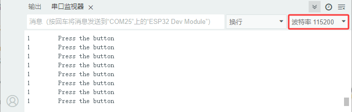

   081703

当没有感应到触摸时，板载红色LED熄灭，value 值为
0，串口监视器打印出“\ **Loosen the button**\ ”。

.. figure:: ./media/081701.png
   :alt: img

   img

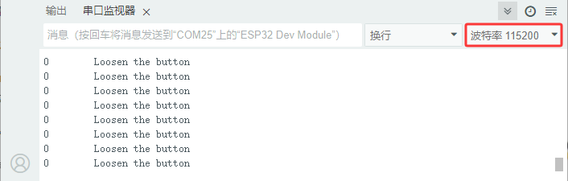

   081704

项目九 避障传感器检测障碍物
~~~~~~~~~~~~~~~~~~~~~~~~~~~

1.1 项目介绍

在这个套件中，有一个Keyes
避障传感器，它主要由一对红外线发射与接收管元件组成。实验中，我们通过读取传感器上S端高低电平，判断是否存在障碍物。

1.2 模块参数

工作电压 : DC 5V

电流 : 50 mA

最大功率 : 0.3 W

工作温度 ：-10°C ~ +50°C

输出信号 : 数字信号

感应距离 : 2 ~ 40 cm

尺寸 ：32 x 23.8 x 11 mm

定位孔大小：直径为 4.8 mm

接口 ：间距为2.54 mm 3pin防反接口

1.3 模块原理图

.. figure:: ./media/091301.jpg
   :alt: img

   img

NE555时基电路提供给发射管TX发射出一定频率的红外信号，红外信号会随着传送距离的加大逐渐衰减，如果遇到障碍物，就会形成红外反射。当检测方向RX遇到反射回来的信号比较弱时，接收检测引脚输出高电平，说明障碍物比较远；当反射回来的信号比较强，接收检测引脚输出低电平，说明障碍物比较近，此时指示灯亮起。传感器上有两个电位器，一个用于调节发送功率，一个用于调节接收频率，通过调节两个电位器，我们可以调节它的有效距离。

1.4 实验组件

+----------------+----------------+-------------------+--------------+
| |img|          | |image45|      | |image46|         | |image47|    |
+================+================+===================+==============+
| ESP32 Plus主板 | Keyes          | XH2.54-3P         | USB线 x1     |
| x1             | 避障传感器 x1  | 转杜邦线母单线 x1 |              |
+----------------+----------------+-------------------+--------------+

1.5 模块接线图

.. figure:: ./media/091501.png
   :alt: img

   img

1.6 实验代码

本项目中使用的代码保存在文件夹“\*\*:raw-latex:`\程序代码`:raw-latex:`\Arduino`\_代码\ **”中，我们可以在此路径下打开代码文件’’**\ obstacle_avoidance_sensor.ino*\*“。

.. code:: cpp

   /*
    * 名称   : obstacle avoidance sensor
    * 功能   : 读取避障值
    * 作者   : http://www.keyes-robot.com/ 
   */
   int val = 0;
   void setup() 
   {
     Serial.begin(115200);   //设置波特率为115200
     pinMode(5, INPUT);    //设置引脚GPIO5为输入模式
   }

   void loop() 
   {
     val = digitalRead(5);  //读取数字电平
     Serial.print(val);     //打印读取的电平信号
     if (val == 0) 
     {  //障碍物检测
       Serial.println("\t There are obstacles");
       delay(100);
     }
     else 
     {  //未发现障碍物
       Serial.println("\t All going well");
       delay(100);
     }
   }

1.7 代码说明

此课程代码与第七课代码类似，这里就不多做介绍了。

1.8 实验结果

代码上传成功后，\ **需要调节传感器模块上的两个电位器**\ ，使得检测障碍物的距离最长。

避障传感器上有两个电位器，分别是接收频率调节电位器和发射功率调节电位器，如下图所示。

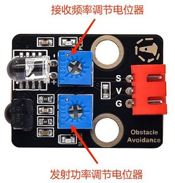

   img

先调节发射功率调节电位器，先将电位器顺时针拧到尽头，然后逆时针慢慢往回调，当调节到SLED灯亮起时，微调使传感器上SLED灯介于亮与不亮之间的\ **不亮**\ 状态。

接着设置接收频率调节电位器，同样将电位器顺时针拧到尽头，然后逆时针慢慢往回调，当SLED灯亮起时，微调使传感器上SLED灯介于亮与不亮之间的\ **不亮**\ 状态，此时能检测障碍物的距离最长。

打开串口监视器，设置波特率为\ **115200**\ 。当传感器检测到障碍物时，value
值为 **0**\ ，SLED 灯亮，串口监视器打印出 “\ **0 There are
obstacles**\ ” ；没有检测到障碍物时，value 值为 **1**\ ，SLED
灯灭，串口监视器打印出 “\ **1 All going well**\ ” 。

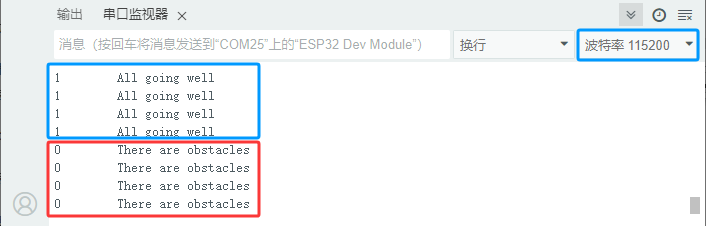

   img

.. figure:: ./media/091703.png
   :alt: img

   img

.. figure:: ./media/091704.png
   :alt: img

   img

项目十 循迹传感器检测黑白线
~~~~~~~~~~~~~~~~~~~~~~~~~~~

1.1 项目介绍

在这个套件中，有一个Keyes 单路循线传感器，它主要由1个TCRT5000
反射型黑白线识别传感器元件组成。

1.2 模块参数

工作电压 ：DC 3.3 ~ 5V

工作温度 ：-10°C ~ +50°C

输入信号 ：PWM信号

尺寸 ：32 x 23.8 x 9.4 mm

定位孔大小 ：直径为 4.8 mm

接口 ：间距为2.54 mm 3pin防反接口

1.3 模块原理图

.. figure:: ./media/101301.png
   :alt: 041301

   041301

上一课我们学习了避障传感器的原理，而巡线传感器的原理也是相类似的。TCRT5000
反射型传感器包含了一个红外发射器和光电探测器，彼此相邻。巡线传感器的红外发射器持续发出红外线，红外线经过反射后被接收。接收后会产生电流，这个电流随着红外线光增强而变大。接收后利用电压比较器
LM393 ，将接收到红外线后 LM393 的 3 脚的电压值与可调电位器给 LM393 的 2
脚设置的阈值电压进行比较。

当发射出的红外线没有被反射回来或被反射回来但强度不够大时，红外接收管一直处于关闭状态，此时
R3 处的电压接近VCC，即 LM393 的 3 脚电压接近 VCC。而LM393 的 2
脚电压小于 VCC，通过 LM393 比较器后比较 1
脚输出高电平，LED不导通。随着反射回来的红外线光增强，电流也随之变大。此时
3 脚的电压值等于 VCC - I*R3，随着电流的增大，3
脚的电压就会越来越小。当电压小到比 2 脚的电压还小的时候，接收检测引脚 1
脚输出低电平，LED导通，被点亮。

当红外信号发送到黑色轨道时，由于黑色吸光能力比较强，红外信号发送出去后就会被吸收掉，反射部分很微弱。而白色反射率高，所以白色轨道就会把大部分红外信号反射回来。即检测到黑色或没检测到物体时，信号端为高电平；检测到白色物体时，信号端为低电平。它的检测高度为
0—3cm。我们可以通过旋转传感器上电位器，调节灵敏度，即调节检测高度。当旋转电位器，使传感器上红色
LED介于不亮与亮之间的临界点时，灵敏度最好。

1.4 实验组件

+----------------+------------------+-------------------+--------------+
| |img|          | |image48|        | |image49|         | |USB|        |
+================+==================+===================+==============+
| ESP32 Plus主板 | Keyes            | XH2.54-3P         | USB线 x1     |
| x1             | 单路循线传感器x1 | 转杜邦线母单线 x1 |              |
+----------------+------------------+-------------------+--------------+

1.5 模块接线图

.. figure:: ./media/101501.png
   :alt: img

   img

1.6 实验代码

本项目中使用的代码保存在文件夹“\*\*:raw-latex:`\程序代码`:raw-latex:`\Arduino`\_代码\ **”中，我们可以在此路径下打开代码文件’’**\ Line_tracking.ino*\*“。

.. code:: cpp

   /*
    * 名称   : line tracking
    * 功能   : 读取循迹传感器值
    * 作者   : http://www.keyes-robot.com/ 
   */
   int val = 0;

   void setup() 
   {
     Serial.begin(115200); //设置波特率为115200
     pinMode(5, INPUT);  //将传感器引脚设置为输入模式
   }

   void loop() 
   {
     val = digitalRead(5);   //读取循迹传感器的数字电平输出
     Serial.print(val);      //打印循迹传感器的读取到的数字电平的值
     if (val == 0) 
     {  //检测到白色值为0
       Serial.println("\t White");
       delay(100);
     }
     else 
     {  //检测到黑色值为1
       Serial.println("\t Black");
       delay(100);
     }
   }

1.7 代码说明

此课程代码与第七课代码类似，这里就不多做介绍了。

1.8 实验结果

代码上传成功后，打开串口监视器，设置波特率为\ **115200**\ 。

串口监视器打印出对应的数据和字符。当传感器检测到黑色物体检测距离太远时，value值为
1 ，LED不亮，串口监视器打印出“\ **1
Black**\ ”；检测到白色物体（能够反光）时，value值为 0
，LED亮，串口监视器打印出“\ **0 White**\ ”。

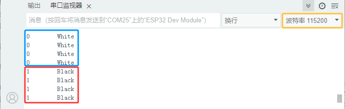

   101701

--------------

项目十一 光折断计数
~~~~~~~~~~~~~~~~~~~

1.1 项目介绍

在这个套件中，有一个Keyes 光折断模块，它主要由 1 个 ITR-9608
光电开关组成，它属于对射光电开关传感器。

这一课，我们通过设置代码，模拟出流水线上利用类似传感器实现对产品进行计数的功能。

1.2 模块参数

工作电压 ：DC 3.3 ~ 5V

工作温度 ：-10°C ~ +50°C

输入信号 ：PWM信号

尺寸 ：32 x 23.8 x 13 mm

定位孔大小 ：直径为 4.8 mm

接口 ：间距为2.54 mm 3pin防反接口

1.3 模块原理图

光电开关是是利用被检测物体对光束的遮挡或反射，由同步回路选通电路，从而检测遮挡物体的有无。所有能反射光线的物体都可以被检测。光电开关将输入的电流在发射器上转换为光信号并射出，然后接收器根据接收到的光线强弱或有无，对目标物体进行检测。

.. figure:: ./media/111301.jpg
   :alt: img

   img

当用不透明物体放置在传感器凹槽时，C 脚与 VCC 连通，传感器信号端 S
为高电平，自带红色 LED熄灭；传感器凹槽没有任何东西时，传感器信号端被 R2
拉低为低电平，自带红色LED亮起。

1.4 实验组件

+---------------+-----------------+--------------------+---------------+
| |img|         | |image50|       | |image51|          | |image52|     |
+===============+=================+====================+===============+
| ESP32         | Keyes           | XH2.54-3P          | USB线 x1      |
| Plus主板 x1   | 光折断模块 x1   | 转杜邦线母单线 x1  |               |
+---------------+-----------------+--------------------+---------------+

1.5 模块接线图

.. figure:: ./media/111501.png
   :alt: img

   img

1.6 实验代码

本项目中使用的代码保存在文件夹“\*\*:raw-latex:`\程序代码`:raw-latex:`\Arduino`\_代码\ **”中，我们可以在此路径下打开代码文件’’**\ Photo
Interrupt.ino*\*“。

.. code:: cpp

   /*
    * 名称   : Photo_Interrupt
    * 功能   : 光传感器计数
    * 作者   : http://www.keyes-robot.com/ 
   */
   int PushCounter = 0;  //count变量的初始值为0
   int State = 0;        //存储传感器当前的输出状态
   int lastState = 0;    //存储传感器最后的输出状态

   void setup() 
   {
     Serial.begin(115200); //设置波特率为115200
     pinMode(5, INPUT);  //将光捕捉传感器引脚设置为输入模式
   }

   void loop() 
   {
     State = digitalRead(5);   //读取当前状态
     delay(20);                //消抖，防止因信号抖动导致的误判，从而提高准确性
     if (State != lastState) 
     { //如果状态与上次读取的不同
       if (State == 1) 
       {       //遮挡光线时
         PushCounter = PushCounter + 1; //计数 + 1
         Serial.println(PushCounter);   //打印计数 
       }
     }
     lastState = State;  //更新状态
   }

1.7 代码说明

+--------------------+-------------------------------------------------+
| 代码               | 说明                                            |
+====================+=================================================+
| int PushCounter =  | 记录遮挡次数（每次遮挡 +1）。                   |
| 0;                 |                                                 |
+--------------------+-------------------------------------------------+
| int State = 0;     | 当前传感器输出的电平（\ ``0``\ 或\ ``1``\ ）。  |
+--------------------+-------------------------------------------------+
| int lastState = 0; | 上一次读取的传感器状态，用于判断状态是否变化。  |
+--------------------+-------------------------------------------------+

.. code:: cpp

   void loop() {
     State = digitalRead(5);   // 读取传感器当前状态
     delay(20);                // 消抖延时（20毫秒）

     if (State != lastState) { // 状态发生变化时
       if (State == 1) {       // 如果当前状态为高电平（遮挡触发）
         PushCounter++;        // 计数器+1（等价于 PushCounter = PushCounter + 1）
         Serial.println(PushCounter); // 打印当前计数
       }
     }
     lastState = State;        // 更新上一次状态
   }

- **``digitalRead(5)``**\ ：读取传感器电平（\ ``0``\ =无遮挡，\ ``1``\ =有遮挡，具体取决于传感器类型）。
- **``delay(20)``**\ ：简易消抖，避免机械振动或信号抖动导致误判。
- **状态变化检测**\ ：

  - 仅当 ``State`` 与 ``lastState`` 不同时（如从
    ``0``\ →\ ``1``\ ），才判断为有效触发。
  - 触发条件为 ``State == 1``\ （有遮挡）。

- **计数更新**\ ：每次有效触发后，计数器加1并串口打印

1.8 实验结果

代码上传成功后，打开串口监视器，设置波特率为\ **115200**\ 。

串口监视器打印出 PushCounter
的数据，物体每穿过传感器凹槽一次，PushCounter 数据加 1。

.. figure:: ./media/111701.png
   :alt: img

   img

.. figure:: ./media/111702.png
   :alt: img

   img

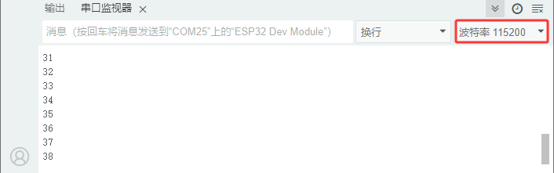

   111703

--------------

项目十二 倾斜模块的原理
~~~~~~~~~~~~~~~~~~~~~~~

1.1 项目介绍

在这个套件中，有一个Keyes
倾斜传感器，主要由一个倾斜开关组成，其内部带有一颗滚珠，用来监测倾斜情况。倾斜开关可以依据模块是否倾斜而输出不同的电平信号。当开关高于水平位置倾斜时开关导通，低于水平位置时开关断开。倾斜模块可用于倾斜检测、报警器制作或者其他检测。

1.2 模块参数

工作电压 : DC 3.3 ~ 5V

电流 : 50 mA

最大功率 : 0.3 W

工作温度 ：-10°C ~ +50°C

输出信号 : 数字信号

尺寸 ：32 x 23.8 x 8 mm

定位孔大小：直径为 4.8 mm

接口 ：间距为2.54 mm 3pin防反接口

1.3 模块原理图

.. figure:: ./media/121301.png
   :alt: img

   img

Keyes
倾斜传感器的原理非常简单，主要是利用滚珠在开关内随不同倾斜角度的变化使滚珠开关P1的引脚1和2导通或者不导通，当滚珠开关P1的引脚1和2导通时，由于1脚接GND，所以信号端S被拉低为低电平，此时红色LED和R2组成的电路形成回路，电流经过红色LED，点亮红色LED；当滚珠开关P1的引脚1和2不导通时，滚珠开关P1的引脚2被4.7K的上拉电阻R1拉高使得信号端S为高电平，电流不经过红色LED，红色LED熄灭。

1.4 实验组件

+----------------+----------------+-------------------+--------------+
| |img|          | |image53|      | |image54|         | |image55|    |
+================+================+===================+==============+
| ESP32 Plus主板 | Keyes          | XH2.54-3P         | USB线 x1     |
| x1             | 倾斜传感器 x1  | 转杜邦线母单线 x1 |              |
+----------------+----------------+-------------------+--------------+

1.5 模块接线图

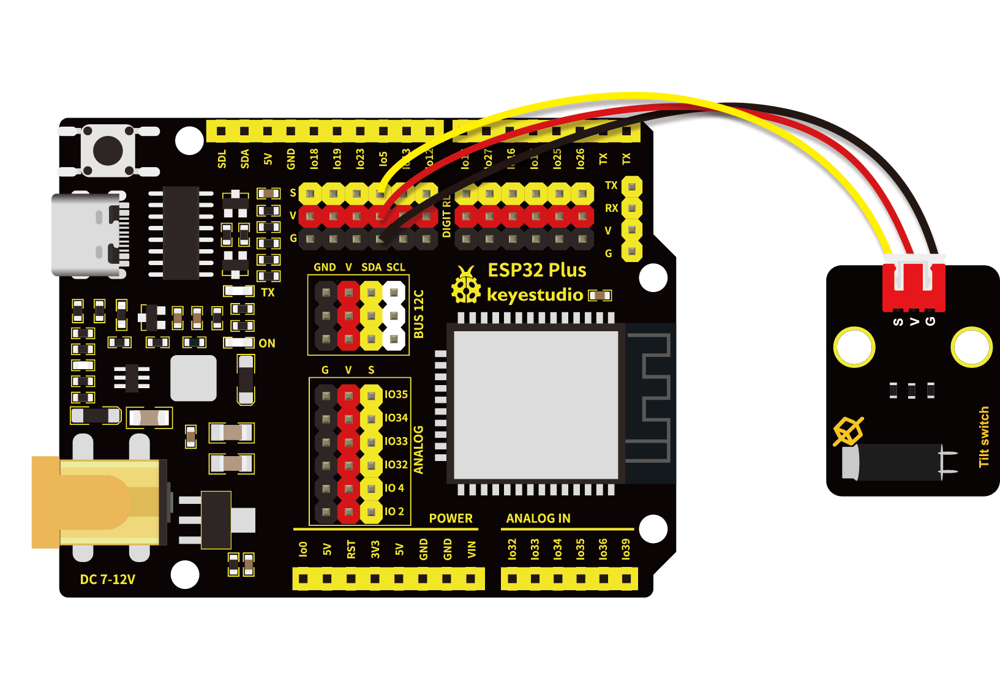

   img

1.6 实验代码

本项目中使用的代码保存在文件夹“\*\*:raw-latex:`\程序代码`:raw-latex:`\Arduino`\_代码\ **”中，我们可以在此路径下打开代码文件’’**\ Tilt
switch.ino*\*“。

.. code:: cpp

   /*
    * 名称   : Tilt switch
    * 功能   : 读取倾斜传感器值
    * 作者   : http://www.keyes-robot.com/ 
   */
   int val; //定义一个变量val用来存储倾斜传感器输出的电平值

   void setup() 
   {
     Serial.begin(115200);
     pinMode(5, INPUT);  //将倾斜传感器的引脚连接到GPIO5，设置为输入模式
   }

   void loop() 
   {
     val = digitalRead(5); //读取模块电平信号
     Serial.println(val);  //打印倾斜传感器输出的电平值
     delay(100);   //延迟100毫秒
   }

1.7 代码说明

此课程代码与第七课代码类似，这里就不多做介绍了。

1.8 实验结果

代码上传成功后，打开串口监视器，设置波特率为\ **115200**\ 。

将倾斜模块往某一边倾斜，若模块上的红色LED\ **不亮**\ ，串口监视器打印数字电平信号“\ **1**\ ”；若模块上的红色LED点\ **亮**\ ，串口监视器打印数字电平信号“\ **0**\ ”。

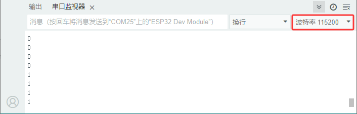

   121701

.. figure:: ./media/121702.png
   :alt: img

   img

.. figure:: ./media/121703.png
   :alt: img

   img

项目十三 碰撞传感器的原理
~~~~~~~~~~~~~~~~~~~~~~~~~

1.1 项目介绍

在这个套件中，有一个Keyes
碰撞传感器。上一课我们学习的倾斜模块用的是滚珠开关，这一课我们学习的碰撞传感器用的是轻触开关。碰撞传感器常用于3D打印机内做限位开关。

1.2 模块参数

工作电压 ：DC 3.3 ~ 5V

控制信号 ：数字信号

尺寸 ：39.5 x 23.5 x 9.2 mm

定位孔大小 ：直径为 4.8 mm

接口 ：间距为2.54 mm 3pin防反接口

1.3 模块原理图

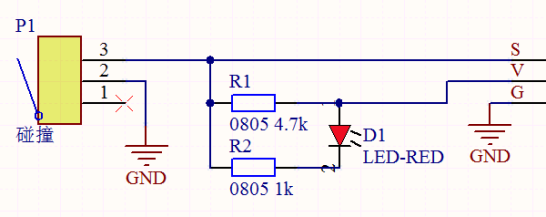

   img

碰撞传感器主要由 1 个轻触开关组成。当物体碰到轻触开关弹片，下压时，2
脚和 3 脚导通，传感器信号端 S 被下拉为低电平，模块上自带的红色 LED
点亮；当没有物体碰撞轻触开关时，2 脚和 3 脚不导通，3 脚被 4.7 K的电阻 R1
上拉为高电平，即传感器信号端S为高电平，此时自带红色 LED
熄灭。碰撞传感器的原理与倾斜模块的电路原理几乎一样，不同之处在于导通方式。

1.4 实验组件

+---------------+---------------+---------------------+---------------+
| |img|         | |image56|     | |image57|           | |image58|     |
+===============+===============+=====================+===============+
| ESP32         | Keyes         | XH2.54-3P           | USB线 x1      |
| Plus主板 x1   | 碰撞传感器 x1 | 转杜邦线母单线 x1   |               |
+---------------+---------------+---------------------+---------------+

1.5 模块接线图

.. figure:: ./media/131501.png
   :alt: img

   img

1.6 实验代码

本项目中使用的代码保存在文件夹“\*\*:raw-latex:`\程序代码`:raw-latex:`\Arduino`\_代码\ **”中，我们可以在此路径下打开代码文件’’**\ collision_sensor.ino*\*“。

.. code:: cpp

   /*
    * 名称   : collision sensor
    * 功能   : 读取碰撞传感器的值
    * 作者   : http://www.keyes-robot.com/ 
   */
   int val = 0;

   void setup() 
   {
     Serial.begin(115200);  //波特率设置为115200
     pinMode(5, INPUT);   //设置碰撞传感器的引脚GPIO5为输入模式
   }

   void loop() 
   {
     val = digitalRead(5);  //读取碰撞传感器的值
     Serial.print(val);      //打印碰撞传感器的值
     if (val == 0) 
     {   //碰撞
       Serial.println("\t The end of this!");
       delay(100);
     }
     else 
     {    //无碰撞
       Serial.println("\t All going well");
       delay(100);
     }
   }

1.7 代码说明

此课程代码与第十二课代码类似，这里就不多做介绍了。

1.8 实验结果

代码上传成功后，打开串口监视器，设置波特率为\ **115200**\ 。

将传感器的上弹片下压时，value值为0，模块上LED点亮，串口监视器打印出“\ **0
The end of this!**\ ”
；当松开弹片时，value值为1，模块上LED熄灭，串口监视器打印出“\ **1 All
going well!**\ ”。

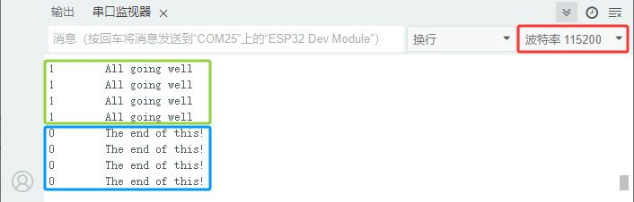

   131701

--------------

项目十四 霍尔传感器检测南极磁场
~~~~~~~~~~~~~~~~~~~~~~~~~~~~~~~

1.1 项目介绍

在这个套件中，有一个Keyes 霍尔传感器，它主要由 A3144
线性霍尔元件组成。该元件是由电压调整器、霍尔电压发生器、差分放大器、史密特触发器，温度补偿电路和集电极开路的输出级组成的磁敏传感电路，其输入为磁感应强度，输出是一个数字电压讯号。

   img

霍尔效应传感器有两种主要类型，一种提供模拟输出，另一种提供数字输出。
A3144 是数字输出霍尔传感器。

1.2 模块参数

工作电压：DC 3.3 ~ 5V

控制信号：数字信号

尺寸：32 x 23.5 x 9.2 mm

定位孔大小：直径为 4.8 mm

接口：间距为2.54 mm 3pin防反接口

1.3 模块原理图

.. figure:: ./media/141301.jpg
   :alt: img

   img

传感器感应到无磁场或北极磁场时，信号端为高电平；感应到南极磁场时，信号端为低电平。当感应磁场强度越强时，感应距离越长。

1.4 实验组件

+-----------------+---------------+--------------------+---------------+
| |img|           | |image59|     | |image60|          | |image61|     |
+=================+===============+====================+===============+
| ESP32 Plus主板  | Keyes         | XH2.54-3P          | USB线 x1      |
| x1              | 霍尔传感器 x1 | 转杜邦线母单线 x1  |               |
+-----------------+---------------+--------------------+---------------+

1.5 模块接线图

.. figure:: ./media/141501.png
   :alt: img

   img

1.6 实验代码

本项目中使用的代码保存在文件夹“\*\*:raw-latex:`\程序代码`:raw-latex:`\Arduino`\_代码\ **”中，我们可以在此路径下打开代码文件’’**\ Hall
magnetic.ino*\*“。

.. code:: cpp

   /*
    * 名称   : Hall magnetic
    * 功能   : 读取霍尔磁传感器的值
    * 作者   : http://www.keyes-robot.com/ 
   */
   int val = 0;
   int hallPin = 5;  //霍尔传感器引脚连接GPIO5
   void setup() 
   {
     Serial.begin(115200);  //波特率设置为115200
     pinMode(hallPin, INPUT);  //设置引脚为输入模式
   }

   void loop() 
   {
     val = digitalRead(hallPin);  //读取霍尔传感器的值
     Serial.print(val);  //打印值
     if (val == 0) 
     {  //感应到南极磁场
       Serial.println("\t The magnetic field at the South Pole!");
     }
     else 
     {  //没有感应到南极磁场
       Serial.println("\t Just be all normal!");
     }
     delay(100);
   }

1.7 代码说明

此课程代码与第七课代码类似，这里就不多做介绍了。

1.8 实验结果

代码上传成功后，打开串口监视器，设置波特率为\ **115200**\ 。

当传感器感应到北极磁场或无磁场感应时，串口监视器打印出“\ **1 Just be all
normal!**\ ”，且传感器上的LED处于熄灭状态；当传感器感应到南极磁场时，串口监视器打印出“\ **0
The magnetic field at the South Pole!**\ ”，且模块上的LED被点亮。

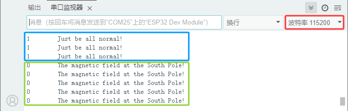

   141701

项目十五课 干簧管检测附近磁场
~~~~~~~~~~~~~~~~~~~~~~~~~~~~~

1.1 项目介绍

在这个套件中，有一个Keyes 干簧管模块，它主要由一个MKA10110
绿色磁簧元件组成。簧管是干式舌簧管的简称，是一种有触点的无源电子开关元件，具有结构简单，体积小便于控制等优点。它的外壳是一根密封的玻璃管，管中装有两个铁质的弹性簧片电板，还灌有一种惰性气体。

实验中，我们通过读取模块上S端高低电平，判断模块附近是否存在磁场；并且在串口监视器上显示测试结果。

1.2 模块参数

工作电压 : DC 3.3 ~ 5V

电流 : 50 mA

最大功率 : 0.3 W

工作温度 ：-10°C ~ +50°C

输出信号 : 数字信号

尺寸 ：32 x 23.8 x 7.4 mm

定位孔大小：直径为 4.8 mm

接口 ：间距为2.54 mm 3pin防反接口

1.3 模块原理图

.. figure:: ./media/151301.png
   :alt: img

   img

一般状态下，玻璃管中的两个由特殊材料制成的簧片是分开的，此时信号端S被电阻R2上拉为高电平，LED熄灭。当有磁性物质靠近玻璃管时，在磁场磁力线的作用下，管内的两个簧片被磁化而互相吸引接触，簧片就会吸合在一起，使结点所接的电路连通，即信号端S连通GND，此时LED点亮。外磁力消失后，两个簧片由于本身的弹性而分开，线路也就断开了。该传感器就是利用元件这一特性，搭建电路将磁场信号转换为高低电平变换信号。

1.4 实验组件

+----------------+----------------+-------------------+--------------+
| |img|          | |image62|      | |image63|         | |image64|    |
+================+================+===================+==============+
| ESP32 Plus主板 | Keyes          | XH2.54-3P         | USB线 x1     |
| x1             | 干簧管模块 x1  | 转杜邦线母单线 x1 |              |
+----------------+----------------+-------------------+--------------+

1.5 模块接线图

.. figure:: ./media/151501.png
   :alt: img

   img

1.6 实验代码

本项目中使用的代码保存在文件夹“\*\*:raw-latex:`\程序代码`:raw-latex:`\Arduino`\_代码\ **”中，我们可以在此路径下打开代码文件’’**\ Reed_Switch.ino*\*“。

**注意：若上传代码失败，请先断开所有接线，再重新尝试上传。**

.. code:: cpp

   /*
    * 名称   : Reed Switch
    * 功能   : 读取簧片传感器的值
    * 作者   : http://www.keyes-robot.com/ 
   */
   int val = 0;
   int reedPin = 5;   //定义连接到干簧管模块的信号引脚为GPIO5

   void setup() 
   {
     Serial.begin(115200);  //波特率设置为115200
     pinMode(reedPin, INPUT);  //设置干簧管模块信号引脚为输入模式
   }

   void loop() 
   {
     val = digitalRead(reedPin);  //读取干簧管模块信号引脚数字电平
     Serial.print(val);  //在串口打印出来
     if (val == 0) 
     {   //附近有一个磁场
       Serial.println("\t A magnetic  field");
     }
     else 
     {   //附近没有磁场
       Serial.println("\t There is no magnetic field");
     }
     delay(100);
   }

1.7 代码说明

此课程代码与第上一课代码类似，这里就不多做介绍了。

1.8 实验结果

代码上传成功后，打开串口监视器，设置波特率为\ **115200**\ 。

拿一块带有磁性的物体靠近干簧管模块，当模块检测到磁场时，value值为0且模块上的红色LED点亮，串口监视器打印出“\ **0
A magnetic
field**\ ”；没有检测到磁场时，value值为1，模块上红色LED熄灭，串口监视器打印出“\ **1
There is no magnetic field**\ ”。

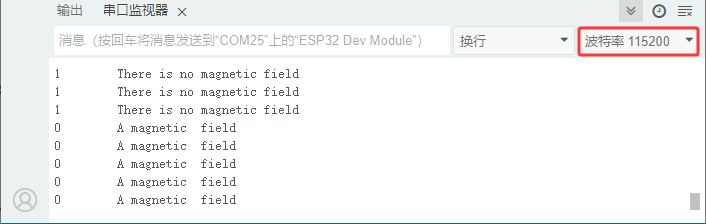

   151701

项目十六 附近有人吗
~~~~~~~~~~~~~~~~~~~

1.1 项目介绍

在这个套件中，有一个Keyes
人体红外热释传感器，它主要由一个RE200B-P传感器元件组成。它是一款基于热释电效应的人体热释运动传感器，能检测到人体或动物身上发出的红外线，配合菲涅尔透镜能使传感器探测范围更远更广。

实验中，通过读取模块上S端高低电平，判断附近是否有人在运动；并且在串口监视器上显示测试结果。

1.2 模块参数

工作电压 : DC 3.3 ~ 5V

工作电流 : 50 mA

最大功率 : 0.3 W

静态电流 : <50 uA

工作温度 ：-10°C ~ +50°C

控制信号 : 数字信号

触发方式 : L 不可重复触发/H 重复触发

最大检测距离 : 7米

感应角度 : <100 度锥角

尺寸 ：32 x 23.8 x 7.4 mm

定位孔大小：直径为 4.8 mm

接口 ：间距为2.54 mm 3pin防反接口

1.3 模块原理图

.. figure:: ./media/161301.jpg
   :alt: img

   img

这个模块的原理图可能较前面的模块稍复杂，我们一部分一部分来看。先看电压转换部分，作用是将5V输入电压转换为3.3V输入电压。因为我们模块上用到的热释电红外传感器的工作电压是3.3V，不能直接用5V电压供电使用。有了这个电压转换部分，3.3V输入电压和5V输入电压都适用于此热释电红外传感器。

当红外热释传感器没有检测到红外信号时，红外热释传感器的1脚输出低电平，此时模块上的LED两端有电压差，有电流流过，LED被点亮，MOS管Q1导通（Q1是NPN
MOS管，型号为2N7002。由于红外热释传感器的1脚输出低电平，所以Q1的源极Vs=0，而Q1的栅极Vg=3.3V，于是Q1的栅极G和Q1的源极S之间的电压
Vgs = 3.3V 大于Q1的阈值电压 2.5V，Q1导通。），信号端S检测到低电平。

当红外热释传感器检测到红外信号时，红外热释传感器的1脚输出高电平，此时模块上的LED熄灭，MOS管Q1不导通，则信号端S检测到被10K上拉电阻R5拉高的高电平。

1.4 实验组件

+----------------+--------------------+-------------------+--------------+
| |img|          | |image65|          | |image66|         | |image67|    |
+================+====================+===================+==============+
| ESP32 Plus主板 | Keyes              | XH2.54-3P         | USB线 x1     |
| x1             | 人体红外热释传感器 | 转杜邦线母单线 x1 |              |
|                | x1                 |                   |              |
+----------------+--------------------+-------------------+--------------+

1.5 模块接线图

.. figure:: ./media/161501.png
   :alt: img

   img

1.6 实验代码

本项目中使用的代码保存在文件夹“\*\*:raw-latex:`\程序代码`:raw-latex:`\Arduino`\_代码\ **”中，我们可以在此路径下打开代码文件’’**\ PIR_motion.ino*\*“。

.. code:: cpp

   /*
    * 名称   : PIR motion
    * 功能   : 读取人体红外传感器的数值
    * 作者   : http://www.keyes-robot.com/ 
   */
   int val = 0;
   int pirPin = 5;   //PIR运动传感器的引脚定义为GPIO5

   void setup() 
   {
     Serial.begin(115200);   
     pinMode(pirPin, INPUT);    //将传感器设置为输入模式
   }

   void loop() 
   {
     val = digitalRead(pirPin);    //读取传感器值
     Serial.print(val);    //打印传感器值
     if (val == 1) 
     {    //附近有人移动，输出高电平
       Serial.println("\t Some body is in this area!");
     }
     else 
     {    //如果附近没有人移动，输出低电平
       Serial.println("\t No one!");
     }
     delay(100);
   }

1.7 代码说明

此课程代码与第七课代码类似，这里就不多做介绍了。

1.8 实验结果

代码上传成功后，打开串口监视器，设置波特率为\ **115200**\ 。

当传感器检测到附近有人在运动时，value值为1，模块上LED熄灭，串口监视器显示“\ **1
Somebody is in this
area!**\ ”；没有检测到附近有人在运动时，value值为0，模块上LED点亮，串口监视器显示“\ **0
No one!**\ ”。

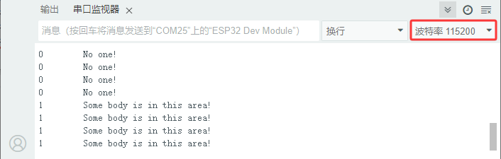

   161701

项目十七 有源蜂鸣器模块播放声音
~~~~~~~~~~~~~~~~~~~~~~~~~~~~~~~

1.1 项目介绍

在这个套件中，有一个有源蜂鸣器模块，还有一个功放模块（原理相当于无源蜂鸣器）。在这个实验中，我们来学习尝试控制有源蜂鸣器发出声音。有源蜂鸣器元件内部自带震荡电路，使用时，我们只需要给蜂鸣器元件足够的电压，蜂鸣器就会自动响起。

1.2 模块参数

工作电压 : DC 3.3 ~ 5V

工作温度 ：-10°C ~ +50°C

输入信号 : 数字信号

尺寸 ：32 x 23.8 x 12.3 mm

定位孔大小：直径为 4.8 mm

接口 ：间距为2.54 mm 3pin防反接口

1.3 模块原理图

.. figure:: ./media/171301.jpg
   :alt: img

   img

从原理图我们可以得知，蜂鸣器的1脚通过串联一个电阻R2连接到电压正极；蜂鸣器的2脚连接到NPN三极管Q1的C极，集电极；Q1的B极，也就是基极通过串联一个电阻R1连接到S信号端；发射集接到GND。

当三极管Q1导通时，蜂鸣器的2脚连通GND，有源蜂鸣器便会工作。那么如何让三极管Q1导通呢？NPN三极管的导通条件是基极（B）电压比发射极（E）电压高
0.3V
以上，只需要基极（B）被上拉至高电平即可。虽然三极管Q1的基极（B）有一个下拉电阻R3导致其不导通，但是R3电阻的阻值大，使其为弱下拉电阻。三极管Q1的基极（B）还连接了一个阻值小的强上拉电阻R1，只要我们用单片机IO口给S信号端输入高电平，强上拉电阻R1会将三极管Q1的基极（B）强上拉为高电平，三极管Q1就会导通，有源蜂鸣器就会工作。

1.4 实验组件

+----------------+----------------+-------------------+--------------+
| |img|          | |image68|      | |image69|         | |image70|    |
+================+================+===================+==============+
| ESP32 Plus主板 | Keyes          | XH2.54-3P         | USB线 x1     |
| x1             | 有源蜂鸣器模块 | 转杜邦线母单线 x1 |              |
|                | x1             |                   |              |
+----------------+----------------+-------------------+--------------+

1.5 模块接线图

.. figure:: ./media/171501.png
   :alt: img

   img

1.6 实验代码

本项目中使用的代码保存在文件夹“\*\*:raw-latex:`\程序代码`:raw-latex:`\Arduino`\_代码\ **”中，我们可以在此路径下打开代码文件’’**\ Active_buzzer.ino*\*“。

.. code:: cpp

   /*
    * 名称   : Active buzzer
    * 功能   : 有源蜂鸣器产生声音
    * 作者   : http://www.keyes-robot.com/
   */
   int buzzer = 5;   //定义蜂鸣器接收器引脚为GPIO5

   void setup()
   {
     pinMode(buzzer, OUTPUT);    //设置输出模式
   }

   void loop() 
   {
     digitalWrite(buzzer, HIGH); //发声
     delay(1000);
     digitalWrite(buzzer, LOW);  //停止发声
     delay(1000);
   }

1.7 代码说明

========================== =============================
代码                       说明
========================== =============================
digitalWrite(buzzer, HIGH) GPIO5口输出高电平给有源蜂鸣器
digitalWrite(buzzer, LOW)  GPIO5口输出低电平有源蜂鸣器
========================== =============================

1.8 实验结果

代码上传成功后，有源蜂鸣器响1秒，停1秒，循环交替。

项目十八 8002b功放 喇叭模块
~~~~~~~~~~~~~~~~~~~~~~~~~~~

1.1 项目介绍

在这个套件中，有一个Keyes 8002b功放
喇叭模块，这个模块主要由一个可调电位器、一个喇叭和一个音频放大芯片组成。上一课我们学习了有源蜂鸣器模块的使用方法，这一课我们来学习套件中的8002b功放
喇叭模块的使用方法。这个模块主要功能是：可以对输出的小音频信号进行放大，大概放大倍数为8.5倍，并且可以通过自带的小功率喇叭播放出来，也可以用来播放音乐，作为一些音乐播放设备的外接扩音设备。

1.2 模块参数

工作电压 : DC 5V

工作电流 : ≥100 mA

最大功率 : 2.5 W

喇叭功率 : 0.15 W

喇叭声音 : 80 db

放大芯片 : SC8002B

工作温度 ：-10°C ~ +50°C

尺寸 ：47.6 x 23.8 x 10 mm

定位孔大小：直径为 4.8 mm

接口 ：间距为2.54 mm 3pin防反接口

1.3 模块原理图

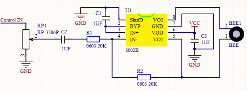

   img

其实这个喇叭就类似于于一个无源蜂鸣器，上一课我们介绍过，有源蜂鸣器自带振荡源，只要我们给它足够的电压就能响起来，而无源蜂鸣器元件内部不带震荡电路，需要在元件正极（也就是1脚）输入不同频率的方波，负极（也就是2脚）接地，从而控制蜂鸣器响起不同频率的声音。

1.4 实验组件

+----------------+------------------+-------------------+--------------+
| |img|          | |image71|        | |image72|         | |image73|    |
+================+==================+===================+==============+
| ESP32 Plus主板 | Keyes 8002b功放  | XH2.54-3P         | USB线 x1     |
| x1             | 喇叭模块 x1      | 转杜邦线母单线 x1 |              |
+----------------+------------------+-------------------+--------------+

1.5 模块接线图

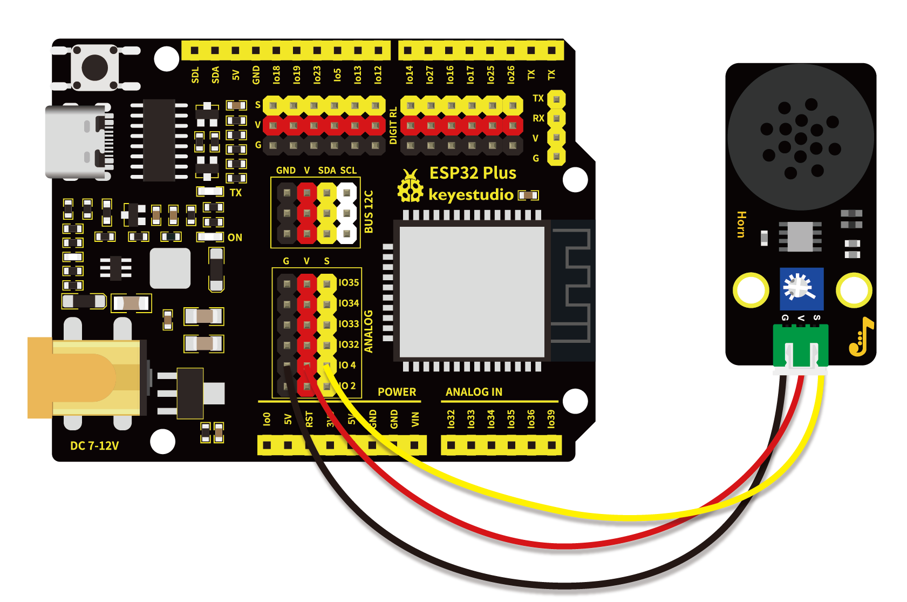

   img

1.6 实验代码

本项目中使用的代码保存在文件夹“\*\*:raw-latex:`\程序代码`:raw-latex:`\Arduino`\_代码\ **”中，我们可以在此路径下打开代码文件’’**\ Passive_buzzer.ino*\*“。

.. code:: cpp

   /*
    * 名称   : Passive Buzzer
    * 功能   : 喇叭播放音乐
    * 作者   : http://www.keyes-robot.com/ 
   */
   #define AUDIO_PIN 4  // 音频输出引脚

   // 音符频率定义 (Hz)
   #define NOTE_C4  262
   #define NOTE_D4  294
   #define NOTE_E4  330
   #define NOTE_F4  349
   #define NOTE_G4  392
   #define NOTE_A4  440
   #define NOTE_B4  494
   #define NOTE_C5  523
   #define NOTE_REST 0   // 休止符

   // 《小星星》简谱
   int melody[] = 
   {
     NOTE_C4, NOTE_C4, NOTE_G4, NOTE_G4, NOTE_A4, NOTE_A4, NOTE_G4,
     NOTE_F4, NOTE_F4, NOTE_E4, NOTE_E4, NOTE_D4, NOTE_D4, NOTE_C4,
     NOTE_G4, NOTE_G4, NOTE_F4, NOTE_F4, NOTE_E4, NOTE_E4, NOTE_D4,
     NOTE_G4, NOTE_G4, NOTE_F4, NOTE_F4, NOTE_E4, NOTE_E4, NOTE_D4,
     NOTE_C4, NOTE_C4, NOTE_G4, NOTE_G4, NOTE_A4, NOTE_A4, NOTE_G4,
     NOTE_F4, NOTE_F4, NOTE_E4, NOTE_E4, NOTE_D4, NOTE_D4, NOTE_C4
   };

   // 每个音符的持续时间 (ms)
   int noteDurations[] = 
   {
     400, 400, 400, 400, 400, 400, 800,
     400, 400, 400, 400, 400, 400, 800,
     400, 400, 400, 400, 400, 400, 800,
     400, 400, 400, 400, 400, 400, 800,
     400, 400, 400, 400, 400, 400, 800,
     400, 400, 400, 400, 400, 400, 800
   };

   void setup() {
     pinMode(AUDIO_PIN, OUTPUT);
   }

   void loop() 
   {
     playMelody();
     delay(2000); // 播放完后等待2秒再重复
   }

   //遍历乐谱数组，依次播放每个音符
   void playMelody() 
   {
     int numNotes = sizeof(melody) / sizeof(melody[0]);
     for (int i = 0; i < numNotes; i++) 
     {
       int noteDuration = noteDurations[i];
       if (melody[i] == NOTE_REST)
       {
         delay(noteDuration); // 休止符
       } 
       else 
       {
         playTone(melody[i], noteDuration);
       }
       // 音符间短暂间隔
       delay(noteDuration * 0.3);
     }
   }

   //生成指定频率的方波信号
   void playTone(int frequency, int duration)
   {
     if (frequency == 0) return;
     long period = 1000000L / frequency; // 周期(微秒)
     long elapsedTime = 0;
     while (elapsedTime < duration * 1000L)
     {
       digitalWrite(AUDIO_PIN, HIGH); 
       delayMicroseconds(period / 2); // 半周期高电平
       digitalWrite(AUDIO_PIN, LOW);
       delayMicroseconds(period / 2); // 半周期低电平
       elapsedTime += period;
     }
   }

1.7 代码说明

=================== ================
代码                说明
=================== ================
#define NOTE_C4 262 中音Do (Hz)
#define NOTE_D4 294 中音Re
#define NOTE_REST 0 休止符，表示静音
=================== ================

.. code:: cpp

   void playTone(int frequency, int duration) {
     long period = 1000000L / frequency; // 计算周期(μs)
     while(...) {
       digitalWrite(AUDIO_PIN, HIGH);
       delayMicroseconds(period / 2); // 半周期高电平
       digitalWrite(AUDIO_PIN, LOW);
       delayMicroseconds(period / 2); // 半周期低电平
     }
   }

声音的本质是空气振动，喇叭的振膜需要通过电流驱动。方波的快速高低电平切换会产生脉冲电流，迫使振膜往复运动，从而发声。

- **数学关系**\ ： 频率 ``f`` → 周期 ``T = 1/f`` → 半周期 ``T/2``
  例如：262Hz (C4) → 半周期=1908μs
- **物理实现**\ ： 通过交替输出 **高电平-低电平** 产生方波，驱动喇叭振动

1.8 实验结果

代码上传成功后，功放喇叭模块循环播放音乐。如果觉得喇叭声音太大或太小，可以使用十字螺丝刀调节模块上的电位器以调整音量大小。

项目十九 130电机模块
~~~~~~~~~~~~~~~~~~~~

1.1 项目介绍

在这个套件中，有一个Keyes
130电机驱动模块。HR1124S是应用于直流电机方案的单通道H桥驱动器芯片。HR1124S的H桥驱动部分采用低导通电阻的PMOS和NMOS功率管。低导通电阻保证芯片低的功率损耗，使得芯片安全工作更长时间。此外HR1124S拥有低待机电流，低静态工作电流，这些性能使HR1124S易用于玩具方案。

实验中，我们可通过输出到两个信号端IN+和IN-的电压方向来控制电机的转动方向，让电机转动起来。

1.2 模块参数

工作电压 : DC 3.3 ~ 5V

电流 : 50 mA

最大功率 : 0.3 W

工作温度 ：-10°C ~ +50°C

输出信号 : 数字信号

尺寸 ：32 x 23.8 x 24.5 mm

定位孔大小：直径为 4.8 mm

接口 ：间距为2.54 mm 4pin防反接口

1.3 模块原理图

.. figure:: ./media/191301.jpg
   :alt: img

   img

HR1124S芯片的作用是助于驱动电机。而电机所需电流较大，无法用三极管驱动更无法直接用IO口驱动。让电机转动起来的方法很简单，给电机两端添加电压即可。不同电压方向电机转向也不相同，额度电压内，电压越大，电机转动得越快；反之电压越低，电机转动得越慢，甚至无法转动。所以我们可以用PWM口来控制电机的转速，这一课我们先学习用高低电平来控制电机。

1.4 实验组件

+---------------------+---------------------+-------------------------+
| |img|               | |image74|           | |image75|               |
+=====================+=====================+=========================+
| ESP32 Plus主板 x1   | Keyes 130电机模块   | XH2.54-4P               |
|                     | x1                  | 转杜邦线母单线 x1       |
+---------------------+---------------------+-------------------------+
| |image76|           | |image77|           | |image78|               |
+---------------------+---------------------+-------------------------+
| USB线 x1            | 6节5号电池盒 x1     | 5号电池(自备) x6        |
+---------------------+---------------------+-------------------------+

**注意：电机与风扇叶是分开装的，需要组合到一起。**

1.5 模块接线图

**注意：请勿用手握住风扇叶，将风扇叶对着空旷的地方，以免受伤。**

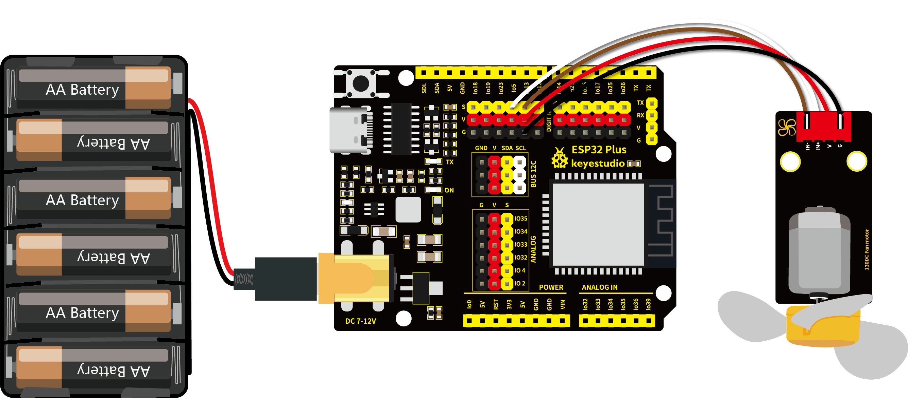

   img

1.6 实验代码

本项目中使用的代码保存在文件夹“\*\*:raw-latex:`\程序代码`:raw-latex:`\Arduino`\_代码\ **”中，我们可以在此路径下打开代码文件’’**\ Motor.ino*\*“。

.. code:: cpp

   /*
    * 名称   : 130DC Fan motor
    * 功能   : 电机正、负旋转
    * 作者   : http://www.keyes-robot.com/
   */
   //定义电机的两个引脚接口，分别为5和13
   int INA = 5;   //INA对应IN+
   int INB = 13;  //INB对应IN-

   void setup() 
   {
     //将电机引脚设置为输出
     pinMode(INA, OUTPUT);
     pinMode(INB, OUTPUT);
   }

   void loop() 
   {
     //逆时针方向转
     digitalWrite(INA, HIGH);
     digitalWrite(INB, LOW);
     delay(2000);
     //停止
     digitalWrite(INA, LOW);
     digitalWrite(INB, LOW);
     delay(1000);
     //顺时针方向转
     digitalWrite(INA, LOW);
     digitalWrite(INB, HIGH);
     delay(2000);
     //停止
     digitalWrite(INA, LOW);
     digitalWrite(INB, LOW);
     delay(1000);
   }

1.7 代码说明

**电机驱动原理**

1. H桥电路控制

========== ========== ================
INA（IN+） INB（IN-） 电机状态
========== ========== ================
HIGH       LOW        逆时针旋转
LOW        HIGH       顺时针旋转
LOW        LOW        停止（自由制动）
HIGH       HIGH       紧急制动（短路）
========== ========== ================

**注意：避免** ``INA`` **和** ``INB`` **同时为**
``HIGH``\ **（会导致H桥短路）**\ 。

1.8 实验结果

**注意：上传代码前，勿将模块平放在桌面，以免电机烧坏。勿用手握住风扇叶，避免受伤。**

代码上传成功后，拔下USB线断电，按照接线图正确接好模块，外接电源，上电后风扇逆时针转动2秒；停止1秒；顺时针转动2秒；停止1秒；循环执行。

项目二十 读取旋转电位器传感器的值
~~~~~~~~~~~~~~~~~~~~~~~~~~~~~~~~~

1.1 项目介绍

在这个套件中，有一个Keyes
旋转电位器传感器，它一个模拟传感器。前面我们学习过的传感器，都是数字传感器。例如我们前面学习的按键模块，当按键没有按下去时，我们读取到高电平（3.3V），当按键按下去时，我们读取到低电平（0V），而在0
~
3.3V中间的电压值，我们数字IO口无法读取到，当然按键模块也只能输出高低电平。而模拟传感器就可以通过我们ESP32主板上的16个ADC模拟口读取中间的电压值。

1.2 模块参数

工作电压 : DC 3.3 ~ 5V

工作电流 : 20 mA

工作功率 : 0.1 W

工作温度 ：-10°C ~ +50°C

输出信号 : 模拟信号

尺寸 ：32 x 23.8 x 28.4 mm

定位孔大小：直径为 4.8 mm

接口 ：间距为2.54 mm 3pin防反接口

1.3 模块原理图

.. figure:: ./media/201301.png
   :alt: img

   img

旋转电位器原理是靠电刷在电阻体上滑动，在电路中获取与输入电压形成一定关系地输出电压。Keyes
旋转电位器传感器选用了一个10K可调电阻。通过旋转电位器，我们可以改变电阻大小，信号端S检测到电压变化（0
~
3.3V），而这个电压变化是一个连续变化的模拟量，也就是在0~3.3V内可以取任意值，我们必须先对这个模拟量进行ADC采集，来测量连续的这些模拟量。A/D
是模拟量到数字量的转换，依靠的是模数转换器(Analog to Digital
Converter)，简称ADC。我们的ESP32主板已经集成了ADC采集，可以直接使用。

我们的ESP32主板ADC位数是12位。一个 n 位的 ADC 表示这个 ADC 共有 2 的 n
次方个刻度，12位的 ADC，输出的是从0～4095一共4096个数字量，也就是 2 的
12 次方个数据刻度，每个刻度就是3.3V/4095≈0.00081V，这也叫分辨率。

ADC：ADC是一种电子集成电路，用于将模拟信号(如电压)转换为由1和0表示的数字信号。我们在ESP32上的ADC的范围是12位（ADC的位数表示将模拟量转换成数字量后所用的二进制位数），其可存储数字量范围为：0
~ 2^12即0 ~
4096。假设它的参考电压是3.3V，也就是说把参考电压分成4095份，最小分辨率为3.3V/4095，模拟值的范围对应于ADC值。因此，ADC拥有的比特越多，模拟的分区就越密集，最终转换的精度也就越高。

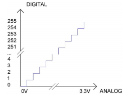

   img

纵坐标数字0 : 0V ~ 3.3/4095V 范围内的模拟量（横坐标）;

纵坐标数字1 : 3.3/ 4095V ~ 2*3.3 /4095V 范围内的模拟量（横坐标）;

……

模拟将被相应地划分。换算公式如下：

.. figure:: ./media/201303.png
   :alt: img

   img

DAC：这一过程的可逆需要DAC，数字到模拟转换器。数字I/O端口可以输出高电平和低电平(0或1)，但不能输出中间电压值，这就是DAC有用的地方。ESP32有两个8位精度的DAC输出引脚GPIO25和GPIO26，可以将VCC(这里是3.3V)分成2\ *8=256个部分。例如，当数字量为1时，输出电压值为3.3/256*
1V，当数字量为128时，输出电压值为3.3/256 \*128=1.65V,
DAC的精度越高，输出电压值的精度就越高。

换算公式如下：

.. figure:: ./media/201304.png
   :alt: img

   img

ADC on ESP32：

ESP32有16个引脚，可以用来测量模拟信号。GPIO引脚序列号和模拟引脚定义如下表所示：

======================= =====================
**ADC number in ESP32** **ESP32 GPIO number**
======================= =====================
ADC0                    GPIO 36
ADC3                    GPIO 39
ADC4                    GPIO 32
ADC5                    GPIO33
ADC6                    GPIO34
ADC7                    GPIO 35
ADC10                   GPIO 4
ADC11                   GPIO0
ADC12                   GPIO2
ADC13                   GPIO15
ADC14                   GPIO13
ADC15                   GPIO 12
ADC16                   GPIO 14
ADC17                   GPIO27
ADC18                   GPIO25
ADC19                   GPIO26
======================= =====================

DAC on ESP32：

ESP32有两个8位数字模拟转换器，分别连接到GPIO25和GPIO26引脚，它是不可变的。如下表所示：

======================= ===============
**Simulate pin number** **GPIO number**
======================= ===============
DAC1                    GPIO25
DAC2                    GPIO26
======================= ===============

1.4 实验组件

+----------------+------------------+-------------------+--------------+
| |img|          | |image79|        | |image80|         | |image81|    |
+================+==================+===================+==============+
| ESP32 Plus主板 | Keyes            | XH2.54-3P         | USB线 x1     |
| x1             | 旋转电位器传感器 | 转杜邦线母单线 x1 |              |
|                | x1               |                   |              |
+----------------+------------------+-------------------+--------------+

1.5 模块接线图

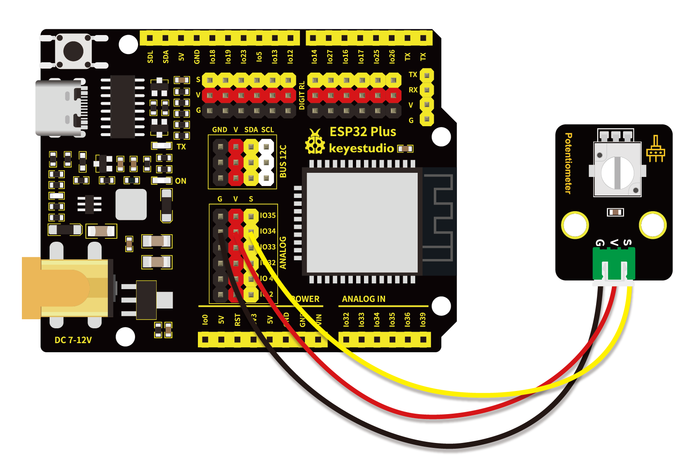

   img

1.6 实验代码

本项目中使用的代码保存在文件夹“\*\*:raw-latex:`\程序代码`:raw-latex:`\Arduino`\_代码\ **”中，我们可以在此路径下打开代码文件’’**\ Rotary_potentiometer.ino*\*“。

.. code:: cpp

   /*  
    * 名称   : Rotary_potentiometer
    * 功能   : 读取旋转电位器传感器的值，将其转化为ADC、DAC和电压值
    * 作者   : http://www.keyes-robot.com/ 
   */
   #define PIN_ANALOG_IN  34  //电位器的引脚

   void setup()
   {
     Serial.begin(115200);
   }

   //在loop()中，使用analogRead()函数获取ADC值，
   //然后使用map()函数将该值转换为8位精度DAC值。
   //输入输出电压按下面公式计算，
   //最后，将信息打印出来。
   void loop() 
   {
     int adcVal = analogRead(PIN_ANALOG_IN);
     int dacVal = map(adcVal, 0, 4095, 0, 255);
     double voltage = adcVal / 4095.0 * 3.3;
     Serial.printf("ADC Val: %d, \t DAC Val: %d, \t Voltage: %.2fV\n", adcVal, dacVal, voltage);
     delay(200);
   }

代码说明

+-----------------------------------+------------------------------------------------------------------------------------------------------------+
| 代码                              | 说明                                                                                                       |
+===================================+============================================================================================================+
| int adcVal =                      | 读取ADC原始值（12位，0-4095）.\ **``analogRead()``**\ ：ESP32的ADC默认分辨率为12位                         |
| analogRead(PIN_ANALOG_IN);        |                                                                                                            |
+-----------------------------------+------------------------------------------------------------------------------------------------------------+
| int dacVal = map(adcVal, 0, 4095, | 映射为8位DAC值。                                                                                           |
| 0, 255);                          | **``map()``\ 函数**\ ：线性映射公式\ ``输出值 = (输入值 - 输入最小值) × (输出范围/输入范围) + 输出最小值`` |
+-----------------------------------+------------------------------------------------------------------------------------------------------------+
| double voltage = adcVal / 4095.0  | 计算实际电压。 **电压计算公式**\ ： ``电压(V) = (ADC值 / 最大ADC值) × 参考电压(3.3V)``                     |
| \* 3.3;                           |                                                                                                            |
+-----------------------------------+------------------------------------------------------------------------------------------------------------+
| Serial.printf(“ADC Val: %d,       | **串口输出格式示例**\ ： ``ADC Val: 2048,     DAC Val: 128,     Voltage: 1.65V``                           |
| :raw-latex:`\t D`AC Val: %d,      |                                                                                                            |
| :raw-latex:`\t V`oltage:          |                                                                                                            |
| %.2fV:raw-latex:`\n`”, adcVal,    |                                                                                                            |
| dacVal, voltage);                 |                                                                                                            |
+-----------------------------------+------------------------------------------------------------------------------------------------------------+

1.8 实验结果

代码上传成功后，拔下USB线断电，按照接线图正确接好模块后再用USB线连接到计算机上电，打开串口监视器，设置波特率为\ **115200**\ 。

转动电位器手柄时，串口监视器打印出此时电位器的ADC值、DAC值和电压的值。

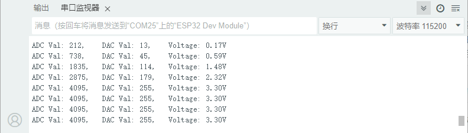

   201701

项目二十一 水滴水蒸气传感器
~~~~~~~~~~~~~~~~~~~~~~~~~~~

1.1 项目介绍

在这个套件中，有一个Keyes
水滴传感器，它是一个模拟（数字）输入模块，也叫雨水、雨量传感器。可用于各种天气状况的监测，检测是否下雨及雨量的大小，转成数字信号（DO）和模拟信号（AO）输出，并广泛应用于Arduino
机器人套件，雨滴，下雨传感器，可用于各种天气状况的监测，并转成数定信号和
AO 输出，也可用于汽车自动刮水系统、智能灯光系统和智能天窗系统等。

1.2 模块参数

工作电压 : DC 3.3 ~ 5V

电流 : 30 mA

最大功率 : 0.15 W

工作温度 ：-10°C ~ +50°C

控制信号 : 模拟信号

尺寸 ：32 x 23.8 x 9.3 mm

定位孔大小：直径为 4.8 mm

接口 ：间距为2.54 mm 3pin防反接口

1.3 模块原理图

.. figure:: ./media/211301.jpg
   :alt: img

   img

Keyes
水滴传感器通过电路板上裸露的印刷平行线检测水量的大小。水量越多，就会有更多的导线被联通，随着导电的接触面积增大，雨滴感应区
2 脚输出的电压就会逐步上升。信号端 S
检测到的模拟值就越大。除了可以检测水量的大小，它还可以检测空气中的水蒸气。

1.4 实验组件

+----------------+----------------+-------------------+--------------+
| |img|          | |image82|      | |image83|         | |image84|    |
+================+================+===================+==============+
| ESP32 Plus主板 | Keyes          | XH2.54-3P         | USB线 x1     |
| x1             | 水滴传感器 x1  | 转杜邦线母单线 x1 |              |
+----------------+----------------+-------------------+--------------+

1.5 模块接线图

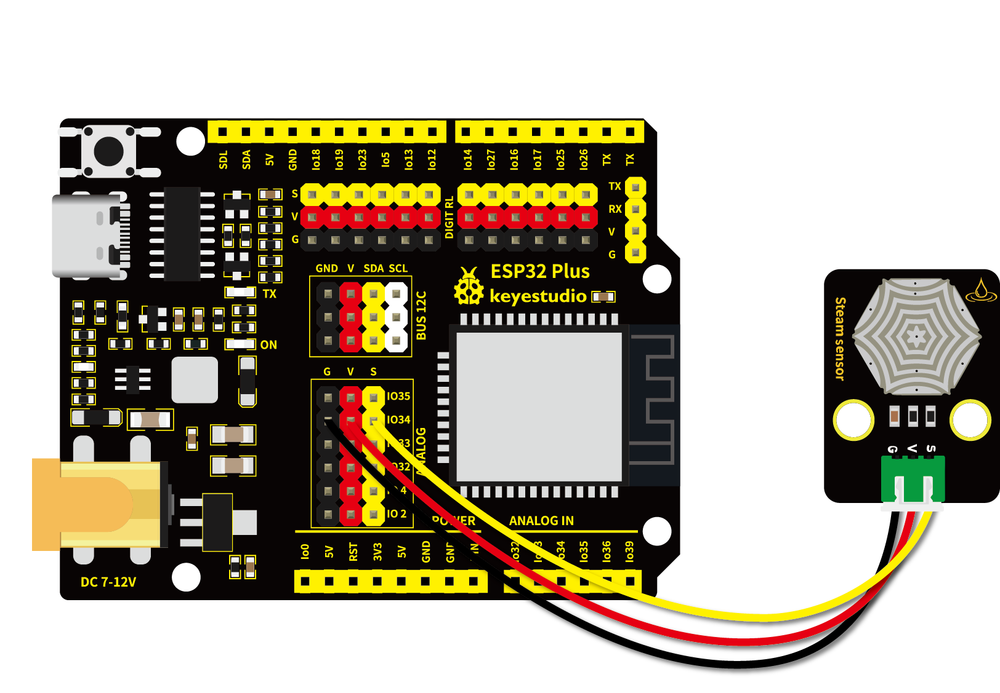

   img

1.6 实验代码

本项目中使用的代码保存在文件夹“\*\*:raw-latex:`\程序代码`:raw-latex:`\Arduino`\_代码\ **”中，我们可以在此路径下打开代码文件’’**\ Steam_sensor.ino*\*“。

.. code:: cpp

   /*  
    * 名称   : Steam sensor
    * 功能   : 读取水滴传感器的值，将其转化为ADC、DAC和电压值
    * 作者   : http://www.keyes-robot.com/
   */
   #define PIN_ANALOG_IN  34  //蒸汽传感器的引脚

   void setup() 
   {
     Serial.begin(115200);
   }

   //在loop()中，使用analogRead()函数获取ADC值，
   //然后使用map()函数将该值转换为8位精度DAC值。
   //输入输出电压按下面公式计算，
   //打印信息。
   void loop() 
   {
     int adcVal = analogRead(PIN_ANALOG_IN);
     int dacVal = map(adcVal, 0, 4095, 0, 255);
     double voltage = adcVal / 4095.0 * 3.3;
     Serial.printf("ADC Val: %d, \t DAC Val: %d, \t Voltage: %.2fV\n", adcVal, dacVal, voltage);
     delay(200);
   }

1.7 代码说明

此课程代码与第二十课代码类似，这里就不多做介绍了。

1.8 实验结果

代码上传成功后，打开串口监视器，设置波特率为\ **115200**\ 。

.. figure:: ./media/211701.png
   :alt: img

   img

在水滴传感器的感应区滴几滴水（\ **小心用水，注意不要滴到感应区以外的其他任何地方，包括ESP32主板**\ ），串口监视器打印出此时水滴传感器的ADC值、DAC值和电压的值。水量变化，ADC值、DAC值和电压值也会发生变化。水量越多，输出的ADC值，DAC值和电压值越大。

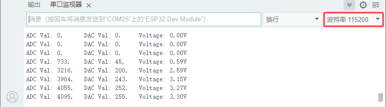

   211702

项目二十二 声音传感器检测声量
~~~~~~~~~~~~~~~~~~~~~~~~~~~~~

1.1 项目介绍

在这个套件中，有一个Keyes
声音传感器。实验中，我们利用这个传感器测试当前环境中的声音对应的ADC值、DAC值和输出的电压值。声音越大，ADC值、DAC值和电压值越大；并在串口监视器上显示测试结果。

1.2 模块参数

工作电压 : DC 3.3 ~ 5V

工作电流 : 100 mA

最大功率 : 0.5 W

工作温度 ：-10°C ~ +50°C

输出信号 : 模拟信号

尺寸 ：32 x 23.8 x 10.3 mm

定位孔大小：直径为 4.8 mm

接口 ：间距为2.54 mm 3pin防反接口

1.3 模块原理图

.. figure:: ./media/221301.png
   :alt: img

   img

Keyes
声音传感器主要由一个高感度麦克风元件和LM386音频功率放大器芯片组成。高感度麦克风元件用于检测外界的声音。利用LM386音频功率放大器芯片设计对高感度麦克风检测到的声音进行放大的电路，最大倍数为200倍。使用时我们可以通过旋转传感器上电位器，调节声音的放大倍数。顺时针调节电位器到尽头，放大倍数最大。

1.4 实验组件

+----------------+----------------+-------------------+--------------+
| |img|          | |image85|      | |image86|         | |image87|    |
+================+================+===================+==============+
| ESP32 Plus主板 | Keyes          | XH2.54-3P         | USB线 x1     |
| x1             | 声音传感器 x1  | 转杜邦线母单线 x1 |              |
+----------------+----------------+-------------------+--------------+

1.5 模块接线图

.. figure:: ./media/221501.png
   :alt: img

   img

1.6 实验代码

本项目中使用的代码保存在文件夹“\*\*:raw-latex:`\程序代码`:raw-latex:`\Arduino`\_代码\ **”中，我们可以在此路径下打开代码文件’’**\ MicroPhone.ino*\*“。

.. code:: cpp

   /*  
    * 名称   : MicroPhone
    * 功能   : 将接收到的声音转化为对应的ADC值、DAC值和电压值
    * 作者   : http://www.keyes-robot.com/ 
   */
   #define PIN_ANALOG_IN  34  //声音传感器的引脚

   void setup() 
   {
     Serial.begin(115200);
   }

   //在loop()中，使用analogRead()函数获取ADC值，
   //然后使用map()函数将该值转换为8位精度DAC值。
   //输入输出电压按下面公式计算，
   //打印信息
   void loop() 
   {
     int adcVal = analogRead(PIN_ANALOG_IN);
     int dacVal = map(adcVal, 0, 4095, 0, 255);
     double voltage = adcVal / 4095.0 * 3.3;
     Serial.printf("ADC Val: %d, \t DAC Val: %d, \t Voltage: %.2fV\n", adcVal, dacVal, voltage);
     delay(200);
   }

1.7 代码说明

此课程代码与第二十课代码类似，这里就不多做介绍了。

1.8 实验结果

代码上传成功后，打开串口监视器，设置波特率为\ **115200**\ 。

串口监视器打印出声音传感器接收到的声音对应的ADC值、DAC值和电压值。对准MIC头大声说话，可以看到接收到的声音对应的ADC值、DAC值和电压值变大。

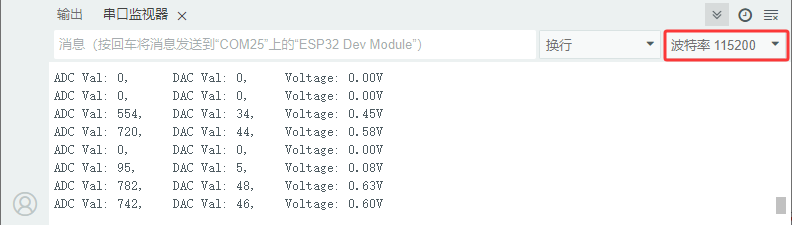

   221701

项目二十三 光敏电阻传感器
~~~~~~~~~~~~~~~~~~~~~~~~~

1.1 项目介绍

在这个套件中，有一个Keyes
光敏电阻传感器，这是一个常用的光敏电阻传感器，它主要由一个光敏电阻元件组成。光敏电阻元件的阻值随着光照强度的变化而变化，此传感器就是利用光敏电阻元件这一特性，设计电路将阻值变化转换为电压变化。光敏电阻传感器可以模拟人对环境光线的强度的判断，方便做出与人友好互动的应用。

1.2 模块参数

工作电压 : DC 3.3 ~ 5V

电流 : 20 mA

最大功率 : 0.1 W

工作温度 ：-10°C ~ +50°C

输出信号 : 模拟信号

尺寸 ：32 x 23.8 x 7.4 mm

定位孔大小：直径为 4.8 mm

接口 ：间距为2.54 mm 3pin防反接口

1.3 模块原理图

.. figure:: ./media/231301.png
   :alt: img

   img

当没有光照射时，电阻大小为0.2
MΩ，光敏电阻的信号端（2脚）检测的电压接近0。随着光照强度增大，光线传感器的电阻值越来越小，所以信号端能检测到的电压越来越大。

1.4 实验组件

+----------------+----------------+-------------------+--------------+
| |img|          | |image88|      | |image89|         | |image90|    |
+================+================+===================+==============+
| ESP32 Plus主板 | Keyes          | XH2.54-3P         | USB线 x1     |
| x1             | 光敏电阻传感器 | 转杜邦线母单线 x1 |              |
|                | x1             |                   |              |
+----------------+----------------+-------------------+--------------+

1.5 模块接线图

.. figure:: ./media/231501.png
   :alt: img

   img

1.6 实验代码

本项目中使用的代码保存在文件夹“\*\*:raw-latex:`\程序代码`:raw-latex:`\Arduino`\_代码\ **”中，我们可以在此路径下打开代码文件’’**\ Photoresistance.ino*\*“。

.. code:: cpp

   /*  
    * 名称   : Photoresistance
    * 功能   : 将光敏电阻的阻值转换成ADC,DAC和电压值
    * 作者   : http://www.keyes-robot.com/
   */
   #define PIN_ANALOG_IN  34  //光敏电阻的引脚

   void setup() 
   {
     Serial.begin(115200);
   }

   //在loop()中，使用analogRead()函数获取ADC值，
   //然后使用map()函数将该值转换为8位精度DAC值。
   //输入输出电压按下面公式计算，
   //将信息打印出来
   void loop() 
   {
     int adcVal = analogRead(PIN_ANALOG_IN);
     int dacVal = map(adcVal, 0, 4095, 0, 255);
     double voltage = adcVal / 4095.0 * 3.3;
     Serial.printf("ADC Val: %d, \t DAC Val: %d, \t Voltage: %.2fV\n", adcVal, dacVal, voltage);
     delay(200);
   }

1.7 代码说明

此课程代码与第二十课代码类似，这里就不多做介绍了。

1.8 实验结果

代码上传成功后，打开串口监视器，设置波特率为\ **115200**\ 。

串口监视器打印出光敏传感器的ADC值、DAC值和电压值。光照越强，可以看到ADC值，DAC值和电压值越大。

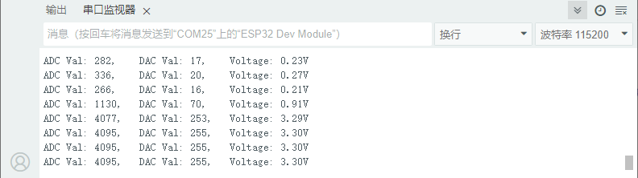

   231701

项目二十四 NTC-MF52AT模拟温度传感器
~~~~~~~~~~~~~~~~~~~~~~~~~~~~~~~~~~~

1.1 项目介绍

在这个套件中，有一个Keyes
NTC-MF52AT模拟温度传感器，它的原理与光敏电阻传感器类似，只是感应的器件不同。将传感器信号端接到ESP32主板模拟口，可以读出对应的ADC值，电压值和温度值。我们可以利用ADC值，输出电压值，通过特定公式，计算出当前环境的温度。

1.2 模块参数

工作电压 : DC 3.3 ~ 5V

电流 : 20 mA

最大功率 : 0.1 W

工作温度 ：-10°C ~ +50°C

输出信号 : 模拟信号

尺寸 ：32 x 23.8 x 7.4 mm

定位孔大小：直径为 4.8 mm

接口 ：间距为2.54 mm 3pin防反接口

1.3 模块原理图

.. figure:: ./media/241301.png
   :alt: img

   img

Keyes
NTC-MF52AT模拟温度传感器主要由NTC-MF52AT热敏电阻元件组成。NTC-MF52AT热敏电阻元件能够感知周边环境温度的变化，随着温度的升高，热敏电阻的阻值降低，4.7K电阻两端的电压上升，从而引起信号端S的电压变化。

**NTC 热敏电阻温度计算公式：Rt = R \* EXP( B \* (1/T1-1/T2) ) 。**

其中，T1和T2指的是K度，即开尔文温度。K度=273.15(绝对温度)+摄氏度。

Rt 是热敏电阻在周围温度为T1（当前温度）时的电阻值。

R是热敏电阻在周围温度为T2常温（常温取25℃）时的标称阻值。参考规格书可知我们用的NTC-MF52AT模拟温度传感器在
25℃ 下热敏电阻的零功率电阻值为10KΩ ± 5%（即R=10K），T2=(273.15+25) 。

B值是热敏电阻的重要参数，为材料常数，在25℃下测得。参考规格书可知B值为
3950±1%。

EXP() 是e^()，e的n次方。

通过转换可以得到温度T1与电阻Rt的关系：T1=1 / (ln(Rt/R) /B+1/T2)
，这里可以将ln换算成log，即T1=1/ ( log(Rt/R)/B + 1/T2 ) 。

那么我们唯一需要知道的就是Rt的值。回到上面的原理图，设热敏电阻两端电压为VRt，固定的
R1电阻两端的电压为VR，由电阻分压知识VR/VRt = R1/Rt可以知道：Rt = R1
*(3.3-VR)/VR 。而我们实际得到的VR是转换后的ADC值，需要转换成电压值，即VR
= adcValue / 4095.0* 3.3。

**注意**\ ：计算出来的温度是开尔文温度，因此需要减去K值，对应的摄氏温度
t = T1 - 273.15，同时加上0.5的误差矫正。

1.4 实验组件

+----------------+--------------------------+-------------------+--------------+
| |img|          | |image91|                | |image92|         | |image93|    |
+================+==========================+===================+==============+
| ESP32 Plus主板 | NTC-MF52AT模拟温度传感器 | XH2.54-3P         | USB线 x1     |
| x1             | x1                       | 转杜邦线母单线 x1 |              |
+----------------+--------------------------+-------------------+--------------+

1.5 模块接线图

.. figure:: ./media/241501.png
   :alt: img

   img

1.6 实验代码

本项目中使用的代码保存在文件夹“\*\*:raw-latex:`\程序代码`:raw-latex:`\Arduino`\_代码\ **”中，我们可以在此路径下打开代码文件’’**\ Temperature_sensor.ino*\*“。

.. code:: cpp

   /*  
    * 名称   : Temperature sensor
    * 功能   : 用热敏电阻制作温度计
    * 作者   : http://www.keyes-robot.com/
   */
   #define PIN_ANALOG_IN   34

   void setup() 
   {
     Serial.begin(115200);
   }

   void loop() 
   {
     int adcValue = analogRead(PIN_ANALOG_IN);    //读ADC引脚
     float Rt=0;      //NTC 热敏电阻
     float R=10000;   //具有固定电阻值的10K电阻
     float T2=273.15+25; //转换成开尔文温度
     float B=3950;    //B值是热敏电阻的一个重要参数
     float K=273.15;  //开氏度 (K°)
     float VR=0;
     VR = (float)(adcValue / 4095.0 * 3.3);  //转换成电压值
     Rt = (3.3 - VR) / VR * 4700;    //计算NTC热敏电阻
     float temp = 1/(1/T2+log(Rt/R)/B)-K+0.5;//计算温度
     Serial.printf("ADC value : %d,\tVoltage : %.2fV, \tTemperature : %.2fC\n", adcValue, VR, temp);
     delay(1000);
   }

1.7 代码说明

+----------------------------+-----------------------------------------------------------------+
| 代码                       | 说明                                                            |
+============================+=================================================================+
| VR = (float)(adcValue /    | 将R1电阻两端转换后的ADC值转换成电压值，数据类型为单精度浮点型。 |
| 4095.0 \* 3.3)             |                                                                 |
+----------------------------+-----------------------------------------------------------------+
| Rt = (3.3 - VR) / VR \*    | 计算热敏电阻在当前温度下的电阻值。                              |
| 4700                       |                                                                 |
+----------------------------+-----------------------------------------------------------------+
| float temp =               | 计算当前环境的温度，数据类型为单精度浮点型。                    |
| 1/(1/T2+log(Rt/R)/B)-K+0.5 |                                                                 |
+----------------------------+-----------------------------------------------------------------+

1.8 实验结果

代码上传成功后，打开串口监视器，设置波特率为\ **115200**\ 。

串口监视器打印出热敏传感器当前所处环境下的ADC值、电压值和温度值。

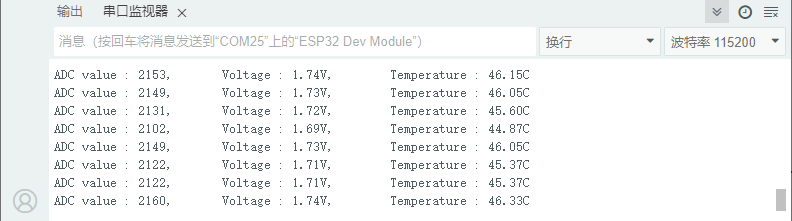

   241701

项目二十五 薄膜压力传感器
~~~~~~~~~~~~~~~~~~~~~~~~~

1.1 项目介绍

在这个套件中，有一个Keyes
薄膜压力传感器，薄膜压力传感器是基于新型纳米压敏材料辅以舒适杨式模量的超薄薄膜衬底一次性贴片而成，兼具防水和压敏双重功能。

通过采集模块上S端模拟信号，判断压力大小。ADC值、DAC值和电压值越小，压力越大；并在串口监视器上显示测试结果。

1.2 模块参数

工作电压 : DC 3.3 ~ 5V

电流 : 20 mA

最大功率 : 0.1W

量程 : 0-5KG

响应点 : 150g

重复性 : ＜±9.7%（60%负载）

一致性 : ±10%

耐久性 : ＞100万次

初始电阻 : 大于10MΩ(无负载)

响应时间 : ＜1ms

恢复时间 : ＜15ms

工作温度 ：-10°C ~ +50°C

输出信号 : 模拟信号

尺寸 ：32 x 23.8 x 7.4 mm

定位孔大小：直径为 4.8 mm

接口 ：间距为2.54 mm 3pin防反接口

1.3 模块原理图

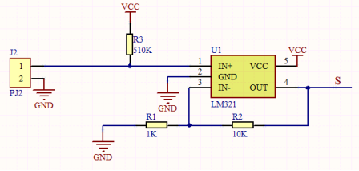

   img

当传感器感知到外界压力时，传感器的电阻值发生变化。Keyes
薄膜压力传感器使用LM321运算放大器芯片将传感器感知到的压力变化的压力信号转换成相应变化强度的电信号输出。这样就可以通过检测电压信号变化得知压力变化情况。

1.4 实验组件

+----------------+----------------+-------------------+--------------+
| |img|          | |image94|      | |image95|         | |image96|    |
+================+================+===================+==============+
| ESP32 Plus主板 | Keyes          | XH2.54-3P         | USB线 x1     |
| x1             | 薄膜压力传感器 | 转杜邦线母单线 x1 |              |
|                | x1             |                   |              |
+----------------+----------------+-------------------+--------------+

1.5 模块接线图

.. figure:: ./media/251501.png
   :alt: img

   img

1.6 实验代码

本项目中使用的代码保存在文件夹“\*\*:raw-latex:`\程序代码`:raw-latex:`\Arduino`\_代码\ **”中，我们可以在此路径下打开代码文件’’**\ Film_pressure_sensor.ino*\*“。

.. code:: cpp

   /*  
    * 名称   : Film pressure sensor
    * 功能   : 将薄膜压力传感器感受到的压力值转换为ADC,DAC和电压
    * 作者   : http://www.keyes-robot.com/
   */
   #define PIN_ANALOG_IN  34  //薄膜压力传感器的引脚

   void setup()
   {
     Serial.begin(115200);
   }

   //在loop()中，使用analogRead()函数获取ADC值，
   //然后使用map()函数将该值转换为8位精度DAC值。
   //输入输出电压按上式计算，
   //最后将信息打印出来。
   void loop() 
   {
     int adcVal = analogRead(PIN_ANALOG_IN);
     int dacVal = map(adcVal, 0, 4095, 0, 255);
     double voltage = adcVal / 4095.0 * 3.3;
     Serial.printf("ADC Val: %d, \t DAC Val: %d, \t Voltage: %.2fV\n", adcVal, dacVal, voltage);
     delay(200);
   }

1.7 代码说明

此课程代码与第二十课代码类似，这里就不多做介绍了。

1.8 实验结果

代码上传成功后，打开串口监视器，设置波特率为\ **115200**\ 。为了使实验数据最精准，请将薄膜压力传感器尽量平放。

串口监视器打印出薄膜压力传感器的ADC值、DAC值和电压值。用手按压薄膜时，随着力量的增大，可以看到ADC值，DAC值和电压值逐渐变小。

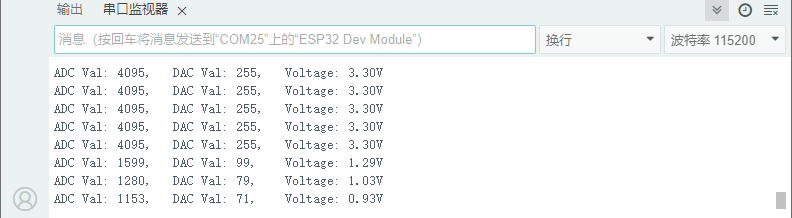

   251701

项目二十六 火焰传感器
~~~~~~~~~~~~~~~~~~~~~

1.1 项目介绍

在这个套件中，有一个Keyes
火焰传感器，它对火焰光谱特别灵敏，且灵敏度可调。性能稳定，是救火机器人的必备部件。火焰传感器上有一个远红外火焰探头，起着非常重要的作用，它可以用作机器人的眼睛来寻找火源或足球。利用它可以制作灭火机器人、足球机器人等。

该传感器有两个信号输出端，分别可输出数字信号与模拟信号。实验中，我们分别读取模块传感器数字信号与模拟信号，将测试结果在串口监视器上显示。

1.2 模块参数

工作电压 : DC 3.3 ~ 5V

电流 : 100 mA

最大功率 : 0.5 W

输出信号 ：模拟信号和数字信号

工作温度 ：-10°C ~ +50°C

尺寸 ：32 x 23.8 x 9.2 mm

定位孔大小：直径为 4.8 mm

接口 ：间距为2.54 mm 4pin防反接口

1.3 模块原理图

红外火焰传感器能够探测到波长在700纳米～1000纳米范围内的红外光，探测角度为60，其中红外光波长在880纳米附近时，其灵敏度达到最大。从电路原理图我们可以看到，上电后红色LED2先点亮，红色LED1处于熄灭状态，检测到火焰时，数字信号端D0输出低电平，红色LED1将点亮。红外火焰探头将外界红外光的强弱变化转化为电流的变化，通过A/D转换器反映为0～255范围内数值的变化。外界红外光越强，数值越小；红外光越弱，数值越大。

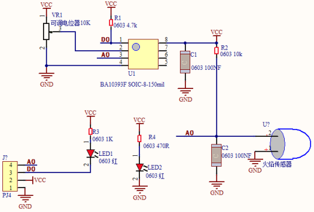

   img

1.4 实验组件

+----------------+----------------+-------------------+--------------+
| |img|          | |image97|      | |image98|         | |image99|    |
+================+================+===================+==============+
| ESP32 Plus主板 | Keyes          | XH2.54-4P         | USB线 x1     |
| x1             | 火焰传感器 x1  | 转杜邦线母单线 x1 |              |
+----------------+----------------+-------------------+--------------+

1.5 模块接线图

.. figure:: ./media/261501.png
   :alt: img

   img

1.6 实验代码

本项目中使用的代码保存在文件夹“\*\*:raw-latex:`\程序代码`:raw-latex:`\Arduino`\_代码\ **”中，我们可以在此路径下打开代码文件’’**\ Flame_sensor.ino*\*“。

.. code:: cpp

    /*  
    * 名称   : Flame sensor
    * 功能   : 火焰传感器接收到的模拟值转换为ADC,DAC和电压值
    * 作者   : http://www.keyes-robot.com/
   */
   //火焰传感器的两个引脚分别是13和34
   #define PIN_ANALOG_IN  34 
   int digitalPin = 13;

   //以下两个变量分别保存数字信号和adc值
   int analogVal = 0;
   int adcVal = 0;

   void setup() {
     Serial.begin(115200);
     pinMode(digitalPin, INPUT); //数字引脚13设置为输入模式
   }

   //在loop()中，digitalRead()函数用于获取数字值，
   //analogRead()函数用于获取ADC值。
   //然后使用map()函数将该值转换为8位精度DAC值。
   //输入输出电压按上式计算，
   //最后将信息打印出来。
   void loop() {
     int digitalVal = digitalRead(digitalPin);  //读取数字信号
     int adcVal = analogRead(PIN_ANALOG_IN);
     int dacVal = map(adcVal, 0, 4095, 0, 255);
     double voltage = adcVal / 4095.0 * 3.3;
     Serial.printf("digitalVal: %d, \t ADC Val: %d, \t DAC Val: %d, \t Voltage: %.2fV\n",digitalVal, adcVal, dacVal, voltage);
     delay(200);
   }

1.7 代码说明

此课程代码与第二十课代码类似，这里就不多做介绍了。

1.8 实验结果

代码上传成功后，火焰传感器上的红色LED2点亮。旋转火焰传感器上的电位器，微调使传感器上红色\ **LED1**\ 灯介于亮与不亮之间的\ **不亮**\ 状态。

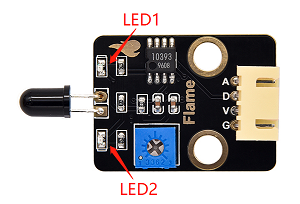

   img

打开串口监视器，设置波特率为\ **115200**\ 。串口监视器打印出火焰传感器的digital值，ADC值，DAC值和电压值。当传感器检测到火焰时，红色LED1点亮，在串口监视器中可以看到数字值由1变为0，ADC值，DAC值和电压值变小。

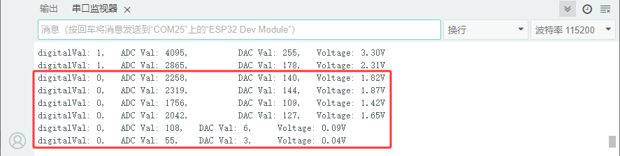

   261702

项目二十七 MQ-2 烟雾传感器
~~~~~~~~~~~~~~~~~~~~~~~~~~

1.1 项目介绍

在这个套件中，有一个Keyes MQ-2模拟气体传感器，它主要用到了MQ-2
可燃气体、烟雾传感器元件。该元件所使用的气敏材料是在清新空气中电导率较低的二氧化锡(SnO2)。当传感器所处环境中存在可燃气体时，传感器的电导率随空气中可燃气体浓度的增加而增大。该传感器对液化气、丙烷、氢气的灵敏度高，对天然气和其它可燃蒸汽的检测也很理想。它可检测多种可燃性气体，是一款适合多种应用的低成本传感器。

实验中，我们读取传感器 A 端模拟值，和 D
端数字值，判断空气中气体的含量，以及它们是否超标。

1.2 模块参数

工作电压 : DC 5V

电流 : 100 mA

最大功率 : 0.5 W

输出信号 ：模拟信号和数字信号

工作温度 ：-10°C ~ +50°C

尺寸 ：47.6 x 23.8 x 17.9 mm

定位孔大小：直径为 4.8 mm

接口 ：间距为2.54 mm 4pin防反接口

1.3 模块原理图

当Keyes
MQ-2模拟气体传感器与烟雾接触时，晶粒间界处的势垒受到烟雾的浓度变化而变化，就会引起表面导电率的变化。利用这一点就可以获得这种烟雾存在的信息，烟雾的浓度越大，导电率越大，输出电阻越低，则输出的模拟信号就越大。

使用时，A 端读取对应气体的模拟值；D
端连接一个LM393芯片（电压比较器），我们可以通过电位器调节测量气体报警临界点，在
D 端输出数字值。当测量气体含量超过临界点时，D
端输出低电平；测量气体含量没超过临界点时，D 端输出高电平。

.. figure:: ./media/271301.png
   :alt: img

   img

1.4 实验组件

+----------------+--------------------+-------------------+--------------+
| |img|          | |image100|         | |image101|        | |image102|   |
+================+====================+===================+==============+
| ESP32 Plus主板 | Keyes              | XH2.54-4P         | USB线 x1     |
| x1             | MQ-2模拟气体传感器 | 转杜邦线母单线 x1 |              |
|                | x1                 |                   |              |
+----------------+--------------------+-------------------+--------------+

1.5 模块接线图

.. figure:: media/271501.png
   :alt: 271501

   271501

1.6 实验代码

本项目中使用的代码保存在文件夹“\*\*:raw-latex:`\程序代码`:raw-latex:`\Arduino`\_代码\ **”中，我们可以在此路径下打开代码文件’’**\ MQ-2.ino*\*“。

.. code:: cpp

   /*  
    * 名称   : MQ2
    * 功能   : MQ-2模拟气体传感器检测到的气体转化为ADC,DAC和电压值
    * 作者   : http://www.keyes-robot.com/ 
   */
   //MQ_2两个引脚分别为13、34
   #define PIN_ANALOG_IN  34 
   int digitalPin =  13;

   //以下两个变量分别保存数字信号和adc值
   int analogVal = 0;
   int adcVal = 0;

   void setup() {
     Serial.begin(115200);
     pinMode(digitalPin, INPUT); //数字引脚13设置为输入模式
   }

   //在loop()中，digitalRead()函数用于获取数字值，
   //analogRead()函数用于获取ADC值。
   //然后使用map()函数将该值转换为8位精度DAC值。
   //输入输出电压按下面公式计算，
   //最后将信息打印出来。
   void loop() {
     int digitalVal = digitalRead(digitalPin);  //读取数字信号;
     int adcVal = analogRead(PIN_ANALOG_IN);
     int dacVal = map(adcVal, 0, 4095, 0, 255);
     double voltage = adcVal / 4095.0 * 5;
     Serial.printf("digitalVal: %d, \t ADC Val: %d, \t DAC Val: %d, \t Voltage: %.2fV",digitalVal, adcVal, dacVal, voltage);
     if (digitalVal == 1) {
       Serial.println("\t Normal");
     }
     else {
       Serial.println("\t Exceeding");
     }
     delay(200); //延迟时间200ms
   }

1.7 代码说明

此课程代码与第二十课代码类似，这里就不多做介绍了。

1.8 实验结果

代码上传成功后，旋转MQ-2模拟气体传感器上的电位器，微调使传感器上红色LED灯介于亮与不亮之间的\ **不亮**\ 状态。

打开串口监视器，设置波特率为\ **115200**\ 。串口监视器打印出对应的数据和字符，当传感器检测到烟雾或可燃性气体时，红色LED点亮，在串口监视器中可以看到数字值由1变为0，ADC值，DAC值和电压值变大。

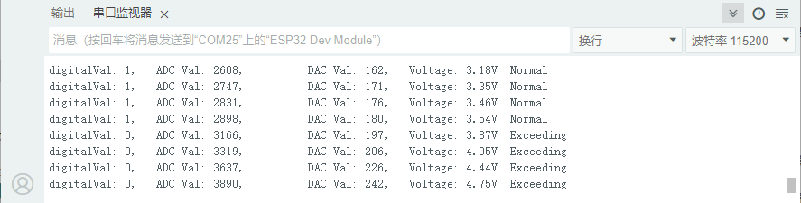

   271701

项目二十八 MQ-3 酒精传感器
~~~~~~~~~~~~~~~~~~~~~~~~~~

1.1 项目介绍

在这个套件中，有一个Keyes
MQ-3酒精传感器，它跟我们上一课学习的烟雾传感器原理几乎相同，只有检测器件不同。它到的是MQ-3
酒精、乙醇蒸汽传感器元件。该元件所使用的气敏材料是在清新空气中电导率较低的二氧化锡(SnO2)。当传感器所处环境中存在酒精蒸汽时，传感器的电导率随空气中酒精气体浓度的增加而增大。使用简单的电路即可将电导率的变化转换为与该气体浓度相对应的输出信号。

实验中，我们读取传感器A 端模拟值，和D
端数字值，判断空气中气体的含量，以及它们是否超标。

1.2 模块参数

工作电压 : DC 5V

电流 : 100 mA

最大功率 : 0.5 W

输出信号 ：模拟信号和数字信号

工作温度 ：-10°C ~ +50°C

尺寸 ：47.6 x 23.8 x 17.9 mm

定位孔大小：直径为 4.8 mm

接口 ：间距为2.54 mm 4pin防反接口

1.3 模块原理图

当Keyes
MQ-2模拟气体传感器与烟雾接触时，晶粒间界处的势垒受到烟雾的浓度变化而变化，就会引起表面导电率的变化。利用这一点就可以获得这种烟雾存在的信息，烟雾的浓度越大，导电率越大，输出电阻越低，则输出的模拟信号就越大。

使用时，A 端读取对应气体的模拟值；D
端连接一个LM393芯片（电压比较器），我们可以通过电位器调节测量气体报警临界点，在
D 端输出数字值。当测量气体含量超过临界点时，D
端输出低电平；测量气体含量没超过临界点时，D 端输出高电平。

.. figure:: ./media/281301.png
   :alt: img

   img

1.4 实验组件

+----------------+----------------+-------------------+--------------+
| |img|          | |image103|     | |image104|        | |image105|   |
+================+================+===================+==============+
| ESP32 Plus主板 | Keyes          | XH2.54-4P         | USB线 x1     |
| x1             | MQ-3酒精传感器 | 转杜邦线母单线 x1 |              |
|                | x1             |                   |              |
+----------------+----------------+-------------------+--------------+

1.5 模块接线图

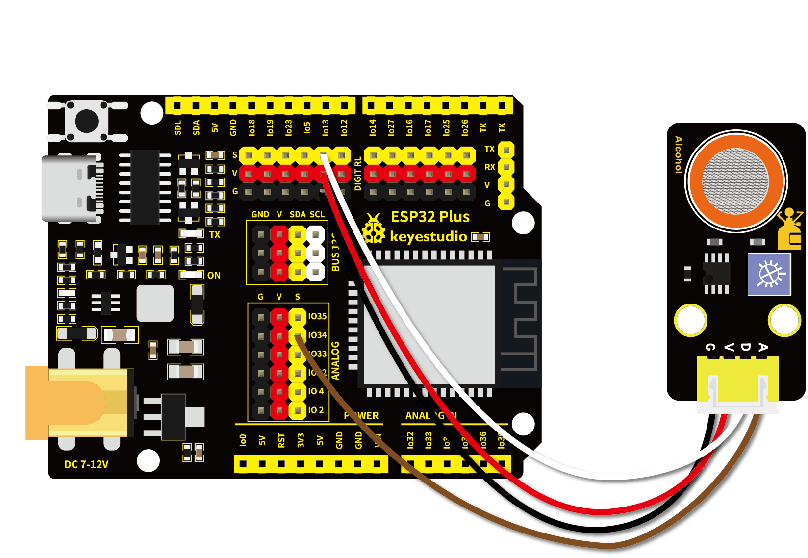

   281501

1.6 实验代码

本项目中使用的代码保存在文件夹“\*\*:raw-latex:`\程序代码`:raw-latex:`\Arduino`\_代码\ **”中，我们可以在此路径下打开代码文件’’**\ MQ-3.ino*\*“。

.. code:: cpp

   /*  
    * 名称   : MQ3
    * 功能   : 将检测到的模拟值转换为ADC，DAC和电压值
    * 作者   : http://www.keyes-robot.com/ 
   */
   //MQ_3两个引脚分别为13、34
   #define PIN_ANALOG_IN  34
   int digitalPin =  13;

   //以下两个变量分别保存数字信号和adc值
   int analogVal = 0;
   int adcVal = 0;

   void setup()
   {
     Serial.begin(115200);
     pinMode(digitalPin, INPUT); //数字引脚13设置为输入模式
   }

   //在loop()中，digitalRead()函数用于获取数字值，
   //analogRead()函数用于获取ADC值。
   //然后使用map()函数将该值转换为8位精度DAC值。
   //输入输出电压按下面公式计算，
   //最后将信息打印出来。
   void loop() {
     int digitalVal = digitalRead(digitalPin);  //读取数字信号;

     int adcVal = analogRead(PIN_ANALOG_IN);
     int dacVal = map(adcVal, 0, 4095, 0, 255);
     double voltage = adcVal / 4095.0 * 5;
     Serial.printf("digitalVal: %d, \t ADC Val: %d, \t DAC Val: %d, \t Voltage: %.2fV",digitalVal, adcVal, dacVal, voltage);
     if (digitalVal == 1) {
       Serial.println("\t Normal");
     }
     else {
       Serial.println("\t Exceeding");
     }
     delay(200); //延迟时间200ms
   }

1.7 代码说明

此课程代码与第二十课代码类似，这里就不多做介绍了。

1.8 实验结果

代码上传成功后，旋转MQ-3酒精传感器上的电位器，微调使传感器上黄绿色LED灯介于亮与不亮之间的\ **不亮**\ 状态。

打开串口监视器，设置波特率为\ **115200**\ 。串口监视器打印出对应的数据和字符，当传感器检测到酒精气体时，黄绿色LED点亮，在串口监视器中可以看到数字值由1变为0，ADC值，DAC值和电压值变大。

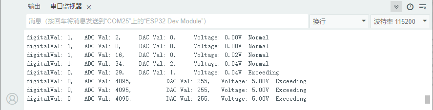

   281701

项目二十九 五路AD按键
~~~~~~~~~~~~~~~~~~~~~

1.1 项目介绍

第七课我们学习了单路按键模块，当按下按键时输出低电平，松开按键时输出高电平，只能读取到这两个数字信号。在这个套件中，有一个Keyes
五路AD按键模块，与单路按键模块原理不同，五路AD按键模块只占用一个模拟量端口，节省资源。模拟量采集，按下不同的按键输出不同的电压。

1.2 模块参数

工作电压 : DC 3.3 ~ 5V

电流 : 20 mA

最大功率 : 0.1 W

数据类型 : 模拟信号

工作温度 ：-10°C ~ +50°C

尺寸 ：47.6 x 23.8 x 9.3 mm

定位孔大小：直径为 4.8 mm

接口 ：间距为2.54 mm 3pin防反接口

1.3 模块原理图

.. figure:: ./media/291301.png
   :alt: img

   img

当没有按下按键时，输出到信号端S的OUT被R1拉低，此时我们读取到的是低电平0V；

当按下按键SW1时，输出到信号端S的OUT相当于直接连接到了VCC，此时我们读取到的是高电平3.3V；

当按下按键SW2时，我们读取到的信号OUT端电压就是R2与R1之间的电压，即VCC*R1/(R2+R1)，约为2.63V，模拟值约为3244；

当按下按键SW3时，我们读取到的信号OUT端电压就是R2+R3与R1之间的电压，即VCC*R1/(R3+R2+R1)，约为1.98V，模拟值约为2386；

当按下按键SW4时，我们读取到的信号OUT端电压就是R2+R3+R4与R1之间的电压，即VCC*R1/(R4+R3+R2+R1)，约为1.31V，模拟值约为1530；

当按下按键SW5时，我们读取到的信号OUT端电压就是R2+R3+R4+R5与R1之间的电压，即VCC*R1/(R5+R4+R3+R2+R1)，约为0.68V，模拟值约为707。

1.4 实验组件

+----------------+----------------+-------------------+--------------+
| |img|          | |image106|     | |image107|        | |image108|   |
+================+================+===================+==============+
| ESP32 Plus主板 | Keyes          | XH2.54-3P         | USB线 x1     |
| x1             | 五路AD按键模块 | 转杜邦线母单线 x1 |              |
|                | x1             |                   |              |
+----------------+----------------+-------------------+--------------+

1.5 模块接线图

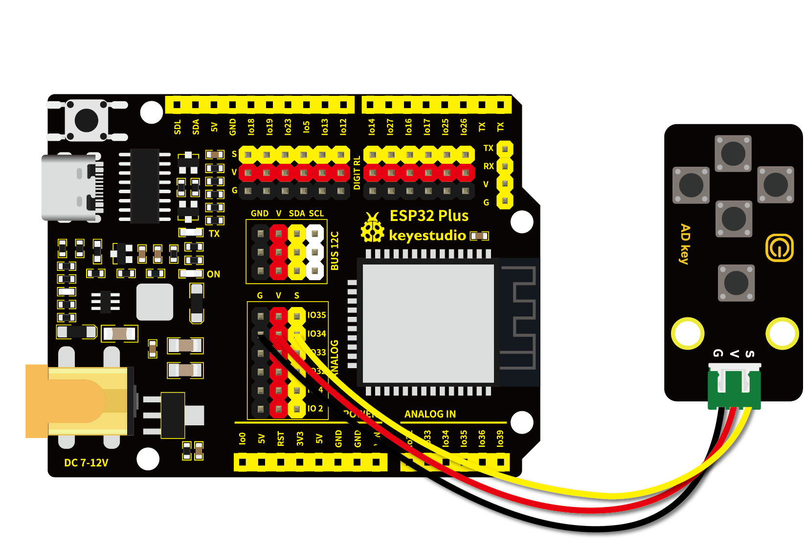

   img

1.6 实验代码

本项目中使用的代码保存在文件夹“\*\*:raw-latex:`\程序代码`:raw-latex:`\Arduino`\_代码\ **”中，我们可以在此路径下打开代码文件’’**\ Five_AD_keys.ino*\*“。

.. code:: cpp

   /*  
    * 名称   : Five AD Keys
    * 功能   : 读取五路AD按键的值
    * 作者   : http://www.keyes-robot.com/ 
   */
   int val = 0;
   int ADkey = 34; //定义五路AD按键连接到GPIO34

   void setup() 
   {
     Serial.begin(115200); 
   }

   void loop() 
   {
     val = analogRead(ADkey);  //读取五路AD引脚的模拟值，并将其赋给变量val
     Serial.print(val);  //换行符输出变量val
     if (val <= 500) 
     { //没有按下按钮时，Val小于或等于500
       Serial.println("   no key  is pressed");
     } 
     else if (val <= 1000) 
     { //当按下5键时，val在500到1000之间
       Serial.println("   SW5 is pressed");
     } 
     else if (val <= 2000) 
     { //当按下4键时，val在1000到2000之间
       Serial.println("   SW4 is pressed");
     } 
     else if (val <= 3000)
     { //当按下3键时，val在2000到3000之间
       Serial.println("   SW3 is pressed");
     } 
     else if (val <= 4000) 
     { //当按下2键时，val在3000 ~ 4000之间
       Serial.println("   SW2 is pressed");
     } 
     else 
     {  //当按下1键时，val大于4000
       Serial.println("   SW1 is pressed");
     }
     delay(100);
   }

1.7 代码说明

将读取到的模拟值赋给变量val，串口监视器打印出val的值。

对读取到的模拟值进行判断，当模拟值低于500时，判断按键没有被按下；当模拟值处于500
~ 1000之间时，判断按键SW5被按下；当模拟值处于1000 ~
2000之间时，判断按键SW4被按下；当模拟值处于2000 ~
3000之间时，判断按键SW3被按下；当模拟值处于3000 ~
4000之间时，判断按键SW2被按下；当模拟值大于4000时，判断按键SW1被按下。

1.8 实验结果

代码上传成功后，打开串口监视器，设置波特率为\ **115200**\ 。

当按下按键时，串口监视器打印出对应的信息。

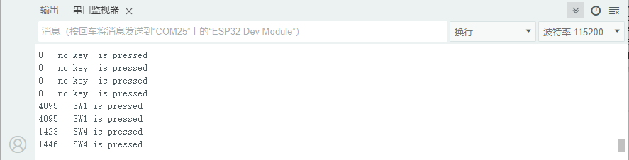

   291701

项目三十 摇杆模块
~~~~~~~~~~~~~~~~~

1.1 项目介绍

你看过游戏手柄吗？游戏手柄上有按键，还有摇杆。摇杆是什么工作原理呢？在我们这个套件中，就有一个Keyes
摇杆模块，它的主要元件是PS2手柄摇杆。控制时，我们需要将模块的X端口和Y端口连接至单片机的模拟口。B端口连接至单片机数字口，V端口接至单片机电源输出端（3.3-5V），GND接单片机GND。通过读取两个模拟值和一个数字口的高低电平情况，可以判断模块上摇杆的工作状态。

1.2 模块参数

工作电压 : DC 3.3 ~ 5V

电流 : 50 mA

最大功率 : 0.25 W

输出信号 : 信号端X、Y 模拟电压输出

信号端B : 数字电平输出

工作温度 ：-10°C ~ +50°C

控制信号 : 数字信号

尺寸 ：47.6 x 23.8 x 34.5 mm

定位孔大小：直径为 4.8 mm

接口 ：间距为2.54 mm 5pin防反接口

1.3 模块原理图

.. figure:: ./media/301301.png
   :alt: img

   img

其实它的原理非常简单，内部相当于两个可调电位器（左右和上下）和一个按键。按键没有按下时被R1下拉为低电平，按下时接通VCC即为高电平，与我们前面学习过的按键模块的电平值是相反的。摇动摇杆时内部的电位器就会根据摇杆的摇动调节，从而输出不同的电压，可以读取到模拟值。

1.4 实验组件

+----------------+----------------+-------------------+--------------+
| |img|          | |image109|     | |image110|        | |image111|   |
+================+================+===================+==============+
| ESP32 Plus主板 | Keyes 摇杆模块 | XH2.54-5P         | USB线 x1     |
| x1             | x1             | 转杜邦线母单线 x1 |              |
+----------------+----------------+-------------------+--------------+

1.5 模块接线图

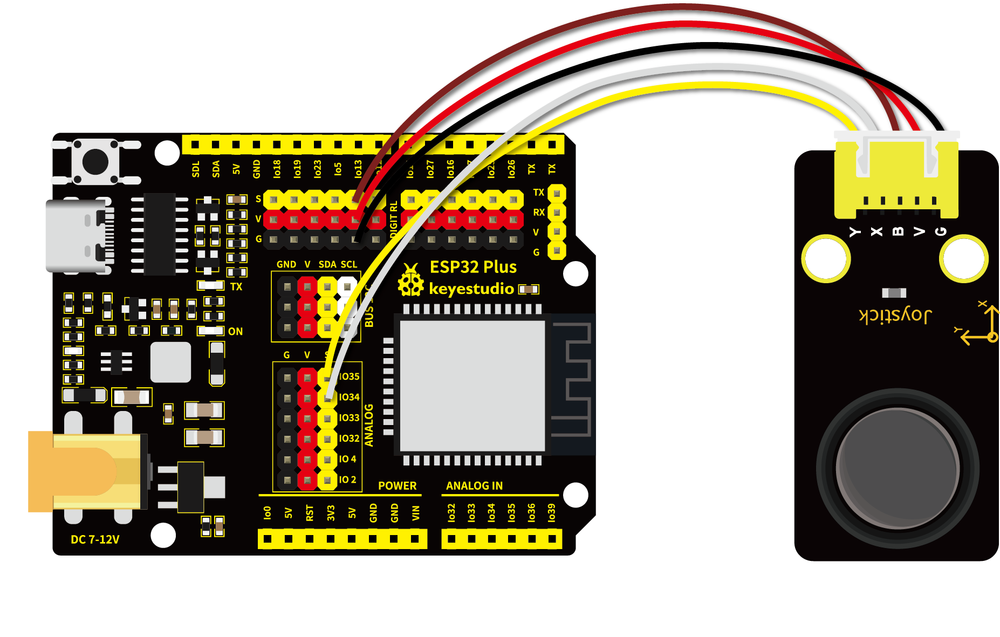

   img

1.6 实验代码

本项目中使用的代码保存在文件夹“\*\*:raw-latex:`\程序代码`:raw-latex:`\Arduino`\_代码\ **”中，我们可以在此路径下打开代码文件’’**\ Joystick.ino*\*“。

.. code:: cpp

   /*  
    * 名称   : Joystick
    * 功能   : 从摇杆读取数据
    * 作者   : http://www.keyes-robot.com/ 
   */
   int xyzPins[] = {34, 35, 13};   //x,y,z 引脚

   void setup() 
   {
     Serial.begin(115200);
     pinMode(xyzPins[0], INPUT); //x轴
     pinMode(xyzPins[1], INPUT); //y轴 
     pinMode(xyzPins[2], INPUT_PULLUP);   //z轴是一个按钮
   }

   // 在loop()中，使用analogRead()读取x轴和y轴的值
   //并使用digitalRead()读取z轴的值，然后显示它们。
   void loop() 
   {
     int xVal = analogRead(xyzPins[0]);
     int yVal = analogRead(xyzPins[1]);
     int zVal = digitalRead(xyzPins[2]);
     Serial.println("X,Y,Z: " + String(xVal) + ", " +  String(yVal) + ", " + String(zVal));
     delay(500);
   }

1.7 代码说明

+-------------------------+-------------------------------------------------------------------------+
| 代码                    | 说明                                                                    |
+=========================+=========================================================================+
| pinMode(xyzPins[2],     | Z轴启用内部上拉电阻，按钮未按下时为高电平（1），按下时接地为低电平（0） |
| INPUT_PULLUP);          |                                                                         |
+-------------------------+-------------------------------------------------------------------------+
| analogRead范围          | ESP32的ADC默认12位（0 ~ 4095），X/Y值越大表示摇杆偏转越大               |
+-------------------------+-------------------------------------------------------------------------+
| delay(500);             | 降低数据刷新率，避免串口拥堵                                            |
+-------------------------+-------------------------------------------------------------------------+

1.8 实验结果

代码上传成功后，打开串口监视器，设置波特率为\ **115200**\ 。

串口监视器窗口将打印出当前摇杆X轴和Y轴对应的模拟值以及Z轴对应的数字值，移动摇杆或按下它将改变串口更让人监视器中的模拟值和数字值。当按下摇杆时，Z值为1；未按下摇杆时，Z值为0。X值从左到右由0增长到4095。Y值从下到上由0增长到4095。

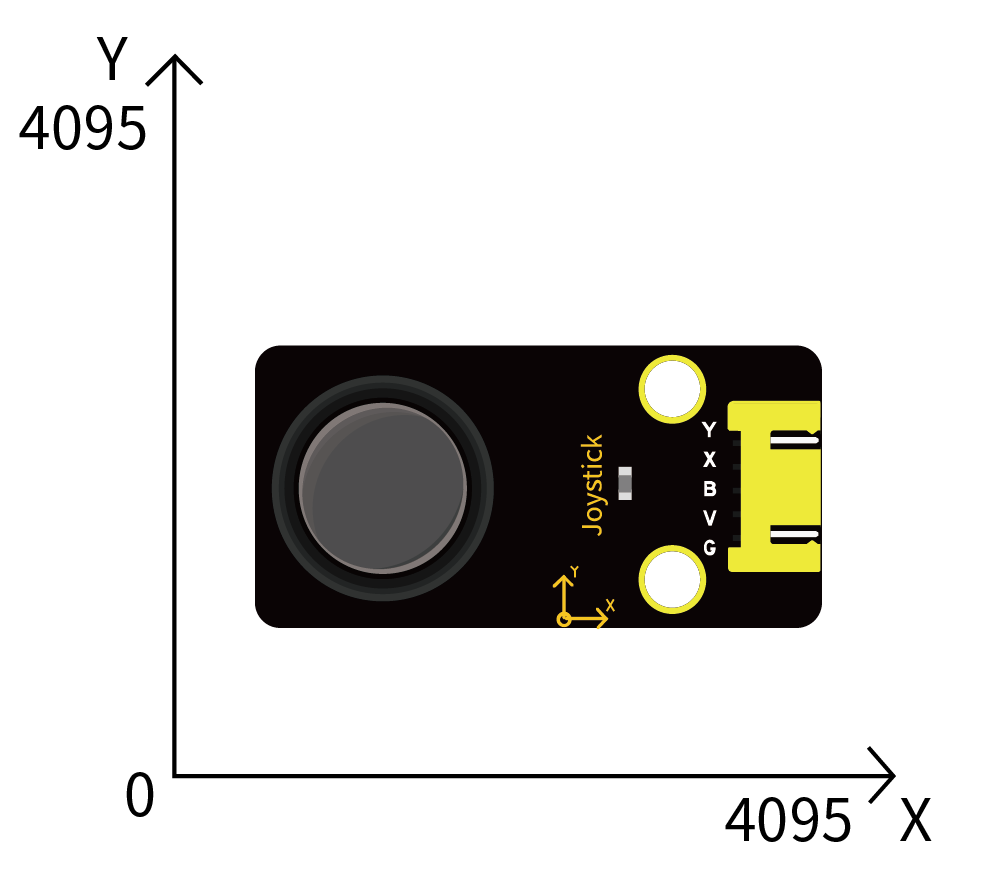

   img

移动摇杆，能看到数据变化。

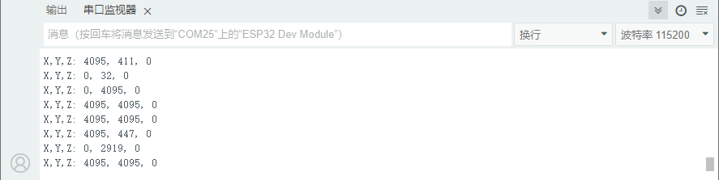

   301702

项目三十一 继电器模块
~~~~~~~~~~~~~~~~~~~~~

1.1 项目介绍

在日常生活中，一般使用交流电来驱动电气设备，有时我们会用开关来控制电器。如果将开关直接连接到交流电路上，一旦发生漏电，人就有危险。从安全的角度考虑，我们特别设计了这款具有NO（常开）端和NC（常闭）端的继电器模块。

1.2 模块参数

工作电压 : DC 5V

电流 : 50 mA

最大功率 : 0.25 W

输入信号 : 数字信号

触电电流 : 小于 3 A

工作温度 ：-10°C ~ +50°C

控制信号 : 数字信号

尺寸 ：47.6 x 23.8 x 19 mm

定位孔大小：直径为 4.8 mm

接口 ：间距为2.54 mm 3pin防反接口

1.3 模块原理图

.. figure:: ./media/311301.png
   :alt: img

   img

一个继电器拥有一个动触点以及两个静触点A和B。

当开关K断开时，继电器线路无电流通过，此时动触点与静触点B相接触，上半部分的电路导通。静触点B被称为常闭触点（NC）。常闭——NC（normal
close）通常情况下是关合状态，即线圈未得电的情况下闭合的。

当开关K闭合时，继电器电路通过电流产生磁力，此时动触点与静触点A相接触，下半部分电路导通。静触点A被称为常开触点（NO）。常开——NO（normal
open）通常情况下是断开状态，即线圈未得电的情况下断开的。

而动触点也被称为公共触点（COM）。

继电器简单来说就是一个开关，VCC表示电源正极、GND表示电源负极、IN表示信号输入脚，COM表示公共端，NC（normal
close）表示常闭端，NO(normal open)表示常开端。

.. figure:: ./media/311302.png
   :alt: img

   img

继电器能兼容多种单片机控制板，是用小电流去控制大电流运作的一种“自动开关”。它可以让单片机控制板驱动3A以下负载，如LED灯带、直流马达、微型水泵、电磁阀可插拔式接口设计，方便使用。

1.4 实验组件

+----------------+------------------+-------------------+--------------+
| |img|          | |image112|       | |image113|        | |image114|   |
+================+==================+===================+==============+
| ESP32 Plus主板 | Keyes            | XH2.54-3P         | USB线 x1     |
| x1             | 单路5V继电器模块 | 转杜邦线母单线 x1 |              |
|                | x1               |                   |              |
+----------------+------------------+-------------------+--------------+

1.5 模块接线图

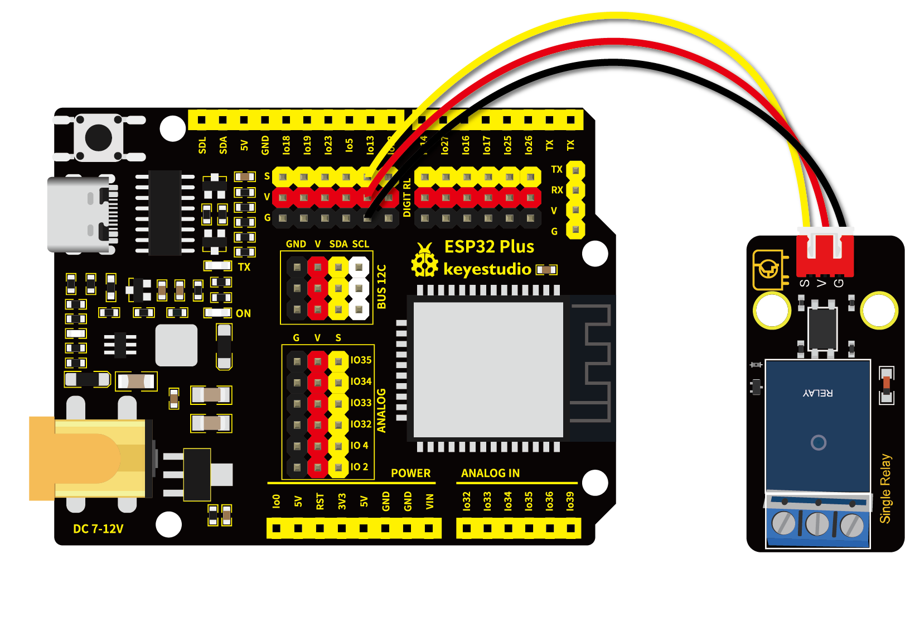

   img

1.6 实验代码

本项目中使用的代码保存在文件夹“\*\*:raw-latex:`\程序代码`:raw-latex:`\Arduino`\_代码\ **”中，我们可以在此路径下打开代码文件’’**\ Relay.ino*\*“。

.. code:: cpp

   /*
    * 名称   : Relay
    * 功能   : 继电器开、关
    * 作者   : http://www.keyes-robot.com/ 
   */
   #define  Relay  13 //定义继电器的引脚为GPIO13
   void setup()
   {
     pinMode(Relay, OUTPUT); //设置“继电器”为“输出”
   }

   void loop()
   {
     digitalWrite(Relay, HIGH); //打开继电器
     delay(1000); //延迟1秒
     digitalWrite(Relay, LOW);  //关闭继电器
     delay(1000); //延迟1秒
   }

1.7 代码说明

此课程代码与第二课代码类似，这里就不多做介绍了。

1.8 实验结果

代码上传成功后，继电器将循环开与关，开启1秒，关闭1秒。同时可以听到继电器开与关的声音，还可以看到继电器上的指示灯指示状态的变化。

项目三十二 SK6812 RGB
~~~~~~~~~~~~~~~~~~~~~

1.1 项目介绍

第六课学习了插件RGB模块，利用PWM信号对模块的三个引脚进行调色。我们这个套件中，还有一个Keyes
6812 RGB模块。SK6812 RGB
模块驱动原理与插件RGB模块的驱动原理不相同，只需要一个引脚控制。这是一个集控制电路与发光电路于一体的智能外控LED光源。每个LED原件其外型与一个5050LED灯珠相同，每个元件即为一个像素点，我们这个模块上有四个灯珠即四个像素点。

1.2 模块参数

工作电压 : DC 3.3 ~ 5V

最大功率 : 1W

光源 : SMD 5050 RGB

IC型号 : 4颗/WS2811

灰度等级 : 256级

发光角度 : 180°

发光颜色 : 可以通过控制器调为白，红，黄，蓝，绿,等

工作温度 ：-10°C ~ +50°C

尺寸 ：32 x 23.8 x 7.4 mm

定位孔大小：直径为 4.8 mm

接口 ：间距为2.54 mm 3pin防反接口

1.3 模块原理图

.. figure:: ./media/321301.png
   :alt: img

   img

从原理图中我们可以看出，这四个像素点灯珠串联。其实不论多少个灯珠串联，我们都可以用一个引脚控制其中任意一个灯让它显示任意一种颜色。像素点内部包含了智能数字接口数据锁存信号整形放大驱动电路，还包含有高精度的内部振荡器和12V高压可编程定电流控制部分，有效保证了像素点光的颜色高度一致。

数据协议采用单线归零码的通讯方式，像素点在上电复位以后，S端接受从控制器传输过来的数据，首先送过来的24bit数据被第一个像素点提取后，送到像素点内部的数据锁存器。这个6812RGB通讯协议与驱动已经在底层封装好了，我们直接调用函数的接口就可以使用。

1.4 实验组件

+----------------+----------------+-------------------+--------------+
| |img|          | |image115|     | |image116|        | |image117|   |
+================+================+===================+==============+
| ESP32 Plus主板 | Keyes 6812     | XH2.54-3P         | USB线 x1     |
| x1             | RGB模块 x1     | 转杜邦线母单线 x1 |              |
+----------------+----------------+-------------------+--------------+

1.5 模块接线图

.. figure:: ./media/321501.png
   :alt: img

   img

1.6 实验代码

本项目中使用的代码保存在文件夹“\*\*:raw-latex:`\程序代码`:raw-latex:`\Arduino`\_代码\ **”中，我们可以在此路径下打开代码文件’’**\ SK6812.ino*\*“。

.. code:: cpp

   /*  
    * 名称   : sk6812 RGB LED
    * 功能   : 打开sk6812 RGB LED
    * 作者   : http://www.keyes-robot.com/ 
   */
   #include <Adafruit_NeoPixel.h>
   #define PIN 4
   Adafruit_NeoPixel strip = Adafruit_NeoPixel(60, PIN, NEO_GRB + NEO_KHZ800);

   void setup()
   {
     strip.begin();
     strip.show(); // 将所有像素点（灯）初始化为“off”，即关闭
   }

   void loop() 
   {
     // 显示颜色
     colorWipe(strip.Color(255, 0, 0), 50); // 红色
     colorWipe(strip.Color(0, 255, 0), 50); // 绿色 
     colorWipe(strip.Color(0, 0, 255), 50); // 蓝色
   }

   // 用一种颜色一个接一个地填充这些点
   void colorWipe(uint32_t c, uint8_t wait) 
   {
     for(uint16_t i=0; i<strip.numPixels(); i++) 
     {
         strip.setPixelColor(i, c);
         strip.show();
         delay(wait);
     }
   }

1.7 代码说明

+----------------------------+----------------------------------------------------+
| 代码                       | 说明                                               |
+============================+====================================================+
| colorWipe(strip.Color(255, | 用一种颜色一个接一个地填充RGB                      |
| 0, 0), 50)                 | LED。第一个参数strip是指灯带；第二个参数Color(255, |
|                            | 0, 0)是颜色,代表红色；第三个参数50是等待时间。     |
+----------------------------+----------------------------------------------------+

1.8 实验结果

代码上传成功后，拔下USB线断电，按照接线图正确接好模块后再用USB线连接到计算机上电，我们可以看到模块上的4个RGB
LED一个接一个地填充红色、绿色、蓝色。

.. figure:: ./media/321701.png
   :alt: img

   img

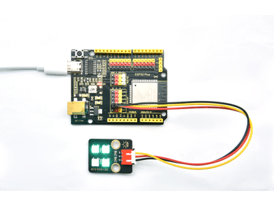

   191702

项目三十三 旋转编码器模块计数
~~~~~~~~~~~~~~~~~~~~~~~~~~~~~

1.1 项目介绍

在这个套件中，有一个Keyes
旋转编码器模块，也叫开关编码器、旋转编码器。此款编码器有20脉冲20定位点、15脉冲30定位点两种。编码器主要用于汽车电子、多媒体音响、仪器仪表、家用电器、智能家居、计算机周边、医疗器械等领域。主要用于频率调节、亮度调节、温度调节、音量调节的参数控制等。

1.2 模块参数

工作电压 : DC 5V

电流 : 20 mA

最大功率 : 0.1 W

工作温度 ：-10°C ~ +50°C

控制信号 : 数字信号

尺寸 ：32 x 23.8 x 30.6 mm

定位孔大小：直径为 4.8 mm

接口 ：间距为2.54 mm 5pin防反接口

1.3 模块原理图

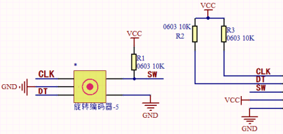

   img

增量式编码器是将位移转换成周期性的电信号，再把这个电信号转变成计数脉冲，用脉冲的个数表明位移的巨细。Keyes
旋转编码器模块采用的是20脉冲旋转编码器元件，它可以通过旋转计数正方向和反方向转动过程中输出脉冲的次数，这种转动计数是没有限制的，复位到初始状态，即从0开始计数。

旋转编码器提供两种交互方式： - **按钮**
单击旋钮以按下按钮。按下时，按钮将 SW 引脚与 GND
引脚连接，也就是SW引脚的电平为低电平。

- **旋转** 每次旋转旋钮时，会在 DT 和 CLK 引脚上产生一个 LOW 信号。

  - 顺时针旋转会导致 CLK 引脚首先变低，然后 DT 引脚也变低。

  - 逆时针旋转会导致 DT 引脚先变低，然后 CLK 引脚变低。

  两个引脚将在几毫秒内返回高电平。如下图所示：

  .. figure:: ./media/331302.png
     :alt: img

     img

1.4 实验组件

+----------------+----------------+-------------------+--------------+
| |img|          | |image118|     | |image119|        | |image120|   |
+================+================+===================+==============+
| ESP32 Plus主板 | Keyes          | XH2.54-5P         | USB线 x1     |
| x1             | 旋转编码器模块 | 转杜邦线母单线 x1 |              |
|                | x1             |                   |              |
+----------------+----------------+-------------------+--------------+

1.5 模块接线图

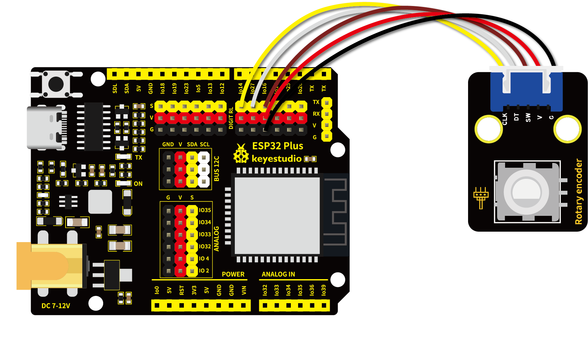

   img

1.6 实验代码

本项目中使用的代码保存在文件夹“\*\*:raw-latex:`\程序代码`:raw-latex:`\Arduino`\_代码\ **”中，我们可以在此路径下打开代码文件’’**\ Encoder.ino*\*“。

.. code:: cpp

   /*  
    * 名称   : Encoder
    * 功能   : 旋转编码器模块计数
    * 作者   : http://www.keyes-robot.com/ 
   */

   int Encoder_DT  = 27;
   int Encoder_CLK  = 14;
   int Encoder_Switch = 16;
   int Encoder_Count;

   void setup() 
   {
     Serial.begin(115200);
     pinMode (Encoder_DT, INPUT);
     pinMode (Encoder_CLK, INPUT);
     pinMode (Encoder_Switch, INPUT);
   }
    
   int lastClk = HIGH;
   void loop() 
   {
     int newClk = digitalRead(Encoder_CLK);
     if (newClk != lastClk) 
     {
       // 在CLK引脚上有一个变化
       lastClk = newClk;
       int dtValue = digitalRead(Encoder_DT);
       if (newClk == LOW && dtValue == HIGH) 
       {
         Encoder_Count ++;
         Serial.println(Encoder_Count);
       }
       if (newClk == LOW && dtValue == LOW) 
       {
         Encoder_Count--;
         Serial.println(Encoder_Count);
       }
     }

     if (digitalRead(Encoder_Switch) == 0)
     {
       delay(5);
       if (digitalRead(Encoder_Switch) == 0) 
       {
         Serial.println("Switch pressed");
         while (digitalRead(Encoder_Switch) == 0);
       }
     }
   }

1.7 代码说明

+-----------------------------+--------------------------------------------------------------------------------------------+
| 代码                        | 说明                                                                                       |
+=============================+============================================================================================+
| if (newClk == LOW &&        | 如果CLK引脚为低的同时DT引脚为高，也就是CLK引脚先变低，然后DT引脚再变低。顺时针旋转旋钮。   |
| dtValue == HIGH)            |                                                                                            |
+-----------------------------+--------------------------------------------------------------------------------------------+
| if (newClk == LOW &&        | 如果CLK引脚为低的同时DT引脚也为低，也就是DT引脚先变低，然后CLK引脚再变低。逆时针旋转旋钮。 |
| dtValue == LOW)             |                                                                                            |
+-----------------------------+--------------------------------------------------------------------------------------------+
| digitalRead(Encoder_Switch) | 按下旋钮。                                                                                 |
| == 0                        |                                                                                            |
+-----------------------------+--------------------------------------------------------------------------------------------+

1.8 实验结果

代码上传成功后，打开串口监视器，设置波特率为\ **115200**\ 。

顺时针旋转编码器，串口监视器打印出来的数据\ **增大**\ ；逆时针旋转编码器，串口监视器打印出来的数据\ **减小**\ ；按下编码器中间按键，串口监视器打印“\ **Switch
pressed**\ ”。

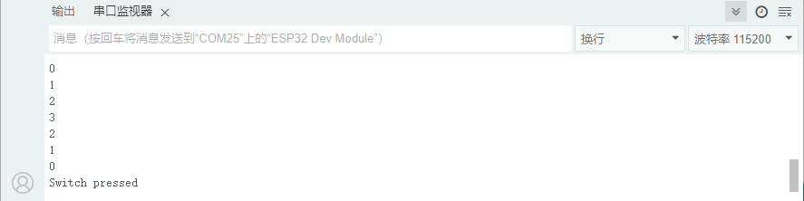

   331701

项目三十四 舵机的控制原理
~~~~~~~~~~~~~~~~~~~~~~~~~

1.1 项目介绍

.. figure:: ./media/341101.png
   :alt: img

   img

舵机是一种位置伺服的驱动器，主要是由外壳、电路板、无核心马达、齿轮与位置检测器所构成。舵机有很多规格，但所有的舵机都有外接三根线。由于舵机品牌不同，颜色也会有所差异，我们实验用到的这款舵机分别用棕、红、橙三种颜色进行区分，棕色为接地线，红色为电源正极，橙色为信号线。

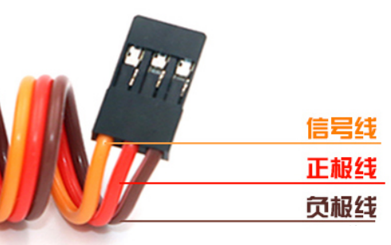

   img

舵机分为360度舵机、180度舵机和90度舵机，我们实验用到的这款舵机为90度舵机，但是它转动的角度范围最大接近180度，所以我们也可把它当做180度舵机使用，控制原理都是一样的。

.. figure:: ./media/341103.png
   :alt: img

   img

1.2 模块参数

工作电压 : DC 3.3 ~ 5V

工作温度 ：-10°C ~ +50°C

尺寸 ：32.25 x 12.25 x 30.42 mm

接口 ：间距为2.54 mm 3pin接口

1.3 模块原理图

.. figure:: ./media/341301.png
   :alt: img

   img

舵机的控制信号是周期为20ms （50Hz）的PWM（脉冲宽度调制）信号。

舵机的转动的角度是通过调节PWM信号的占空比来实现的，一般在 0.5ms ~ 2.5ms
的范围内去控制，总间隔为 2ms，相对应舵盘的位置为0度 ~
180度，呈线性变化。当脉冲宽度为 1.5ms 时，舵机旋转至中间角度，大于 1.5ms
时舵机旋转角度增大，小于 1.5ms 时舵机旋转角度减小。

也就是说，舵机的控制需要单片机产生一个周期为20ms的脉冲信号，以0.5ms到2.5ms的高电平来控制舵机转动的角度。具体脉冲参数下图所示：

.. figure:: ./media/341302.png
   :alt: img

   img

注意，由于舵机品牌不同，对于同一信号，不同品牌的舵机旋转的角度也会有所不同。

1.4 实验组件

+--------------------------+--------------------+----------------------+
| |img|                    | |image121|         | |image122|           |
+==========================+====================+======================+
| ESP32 Plus主板 x1        | 9G 180度数字舵机   | USB线 x1             |
|                          | x1                 |                      |
+--------------------------+--------------------+----------------------+

1.5 实验

1.5.1 实验①：

（1）实验接线图

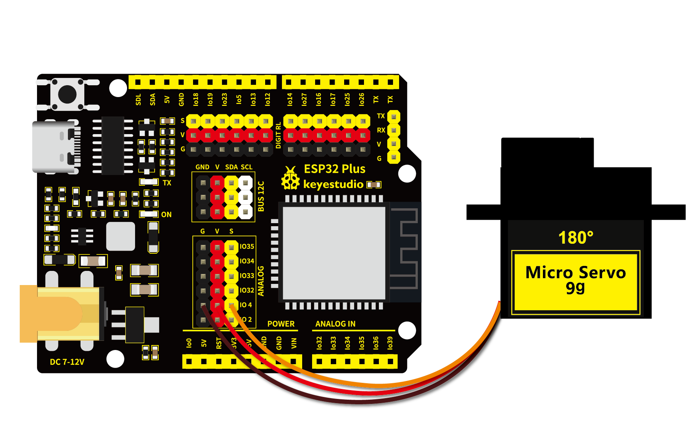

   img

（2）实验代码

**注意**\ ：上传代码前要添加库文件，先点击“\ **项目**\ ”，选择“\ **加载库**\ ”，最后选择“\ **添加.ZIP库**\ ”。

打开库文件夹，选中”\ **ESP32Servo.zip**\ “，单击“\ **打开**\ ”，库文件成功添加。

本项目中使用的代码保存在文件夹“\*\*:raw-latex:`\程序代码`:raw-latex:`\Arduino`\_代码\ **”中，我们可以在此路径下打开代码文件’’**\ servo_1.ino*\*“。

.. code:: cpp

   /*
    * 名称   : Servo_1
    * 功能   : 舵机旋转角度0 -> 90 -> 180，重复
    * 作者   : http://www.keyes-robot.com/ 
   */
   #include <ESP32Servo.h>

   Servo myservo;  //创建伺服对象来控制伺服电机

   int servoPin = 4;  // 伺服电机引脚

   void setup() 
   {
     myservo.setPeriodHertz(50);           //设置伺服电机频率为50Hz
     myservo.attach(servoPin, 500, 2500);  //将servoPin上的值映射到伺服对象上
   }

   void loop() 
   {
     myservo.write(0); //旋转到0度
     delay(1000); //延迟1s
     myservo.write(90); //旋转到90度
     delay(1000); //延迟1s
     myservo.write(180); //旋转到180度
     delay(1000); //延迟1s
   }

（3）实验结果

代码上传成功后，舵机由0度转到90度，停顿1秒；再转到180度，停顿1秒；然后回到0度，停顿1秒，循环转动。

1.5.2 实验②：

（1）实验接线图

   img

（2）实验代码

本项目中使用的代码保存在文件夹“\*\*:raw-latex:`\程序代码`:raw-latex:`\Arduino`\_代码\ **”中，我们可以在此路径下打开代码文件’’**\ servo_2.ino*\*“。

.. code:: cpp

   /*
    * 名称   : Servo_2
    * 功能   : 控制伺服电机进行扫动
    * 作者   : http//www.keyestudio.com
   */
   #include <ESP32Servo.h>

   Servo myservo;  //创建伺服对象来控制伺服电机

   int posVal = 0;    // 定义一个变量，存储伺服电机位置
   int servoPin = 4;  // 伺服电机引脚

   void setup() 
   {
     myservo.setPeriodHertz(50);           //设置伺服电机频率为50Hz
     myservo.attach(servoPin, 500, 2500);  //将servoPin上的值映射到伺服对象上
   }

   void loop() 
   {
     for (posVal = 0; posVal <= 180; posVal += 1) 
     { // 将servoPin上的伺服附加到伺服对象上
       // 以1度为步
       myservo.write(posVal);       // 告诉伺服电机到变量“pos”的位置
       delay(15);                   // 等待15ms让伺服电机到达位置
     }
     for (posVal = 180; posVal >= 0; posVal -= 1) 
     { // 从180°到0°
       myservo.write(posVal);       // 告诉伺服电机到变量“pos”的位置
       delay(15);                   // 等待15ms让伺服电机到达位置
     }
   }

（3）实验结果

代码上传成功后，舵机在0度 ~ 180度之间来回转动，每15ms转动一度。

1.6 代码说明

+----------------------------+----------------------------------------------------------------------------+
| 代码                       | 说明                                                                       |
+============================+============================================================================+
| #include <ESP32Servo.h>    | Arduino专门为了esp32推出的servo库，用来操作伺服舵机。                      |
+----------------------------+----------------------------------------------------------------------------+
| Servo myservo              | 创建一个伺服对象来控制伺服。                                               |
+----------------------------+----------------------------------------------------------------------------+
| myservo.setPeriodHertz(50) | 设置舵机频率为50Hz。                                                       |
+----------------------------+----------------------------------------------------------------------------+
| myservo.attach(servoPin,   | 设置控制脉冲范围为500~2500us。                                             |
| 500, 2500)                 |                                                                            |
+----------------------------+----------------------------------------------------------------------------+
| myservo.write(posVal)      | 向舵机写入一个数值，来直接控制舵机的轴，角度控制。舵机转动到posVal角度值。 |
+----------------------------+----------------------------------------------------------------------------+

项目三十五 超声波传感器的原理
~~~~~~~~~~~~~~~~~~~~~~~~~~~~~

1.1 项目介绍

蝙蝠和某些海洋动物都能够利用高频率的声音进行回声定位或信息交流。它们能通过口腔或鼻腔把从喉部产生的超声波发射出去，利用折回的声波来定向，并判定附近物体的位置、大小以及是否在移动。超声波是一种频率高于20000赫兹的声波，它的方向性好，穿透能力强，易于获得较集中的声能，在水中传播距离远，可用于测距、测速、清洗、焊接、碎石、杀菌消毒等。在医学、军事、工业、农业上有很多的应用。超声波因其频率下限大于人的听觉上限而得名。科学家们将每秒钟振动的次数称为声音的频率，它的单位是赫兹(Hz)。

在这个套件中，有一个HC-SR04超声波传感器，它可以发送出一种频率很高的人类无法听到的超声波信号，这些超声波的信号碰到障碍物，就会立刻反射回来。在接收到返回的信息之后，根据发射信号和接收信号的时间差，计算出传感器和障碍物的详细距离，和蝙蝠飞行的原理一样。

1.2 模块参数

超声波传感器工作电压 : DC 5V

超声波传感器工作电流 : 15 mA

超声波传感器工作频率 : 40 Hz

超声波传感器射程范围 : 2 cm ~ 4 m

超声波传感器测量角度 : <= 15度

超声波传感器输入触发信号 : 10 uS 的TTL脉冲

超声波传感器输出回响信号 : 输出TTL电平信号与射程成正比

工作温度 ：-10°C ~ +50°C

超声波传感器尺寸 ：45.5 x 26.7 x 17.6 mm

超声波转接板模块尺寸 ：32 x 23.8 x 11.85 mm

超声波转接板模块定位孔大小：直径为 4.8 mm

超声波转接板模块接口 ：间距为2.54 mm 4pin防反接口

1.3 模块原理图

最常用的超声测距的方法是回声探测法。当有脉冲电压触发时（单片机给Trig引脚发送高电平），超声波发射器探头里的晶片就会振动，继而产生超声波。在超声波发射时刻的同时计数器开始计时，超声波在空气中传播，途中碰到障碍物面阻挡就立即反射回来（Echo引脚发送高电平信号给单片机），超声波接收器收到反射回的超声波就立即停止计时。

超声波是一种声波，其声速V与温度有关。一般情况下超声波在空气中的传播速度为340m/s，根据计时器记录的时间t，就可以计算出超声波探头发射点距障碍物面的距离s，即：s=340t/2
。

.. figure:: ./media/351301.png
   :alt: img

   img

HC-SR04超声波测距模块可提供范围为2厘米至4米的非接触式距离感测功能，测距精度可达高到3mm。超声波传感器包括超声波发射器、超声波接收器与控制电路。其基本工作原理：

(1)采用IO口Trig触发测距，给至少10us的高电平信号;

(2)模块自动发送8个40khz的方波，自动检测是否有信号返回；

(3)有信号返回，通过IO口Echo输出一个高电平，高电平持续的时间就是超声波从发射到返回的时间。

.. figure:: ./media/351302.png
   :alt: img

   img

1.4 实验组件

+------------+----------------+---------------+----------------+------------+
| |img|      | |image123|     | |image124|    | |image125|     | |image126| |
+============+================+===============+================+============+
| ESP32      | Keyes          | HC-SR04       | XH2.54-4P      | USB线 x1   |
| Plus主板   | 超声波转接模块 | 超声波传感器  | 转杜邦线母单线 |            |
| x1         | x1             | x1            | x1             |            |
+------------+----------------+---------------+----------------+------------+

1.5 模块接线图

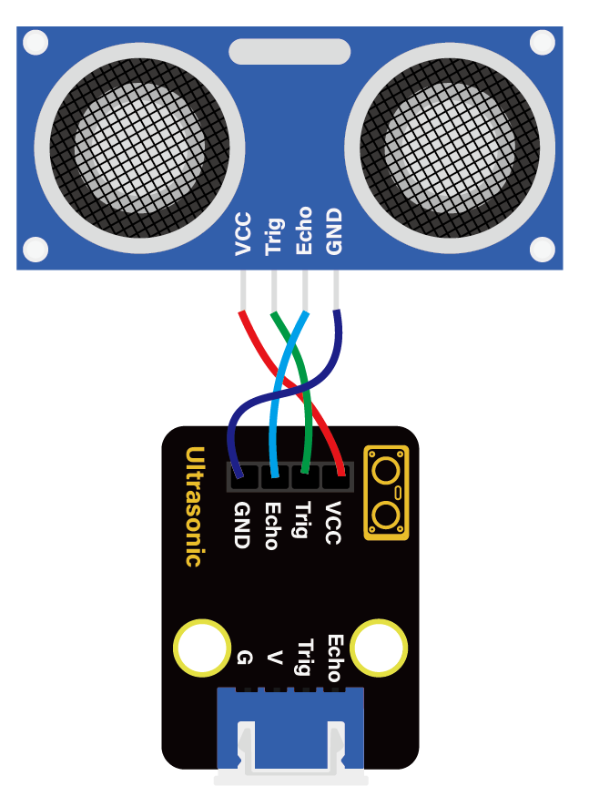

   img

.. figure:: ./media/351502.png
   :alt: img

   img

1.6 实验代码

本项目中使用的代码保存在文件夹“\*\*:raw-latex:`\程序代码`:raw-latex:`\Arduino`\_代码\ **”中，我们可以在此路径下打开代码文件’’**\ Ultrasonic.ino*\*“。

.. code:: cpp

   /*  
    * 名称   : Ultrasonic
    * 功能   : 使用超声波模块测量距离
    * 作者   : http://www.keyes-robot.com/ 
   */
   const int TrigPin = 13; // 定义TrigPin
   const int EchoPin = 12; // 定义EchoPin
   int duration = 0; // 将持续时间的初始值定义为0
   int distance = 0; // 将距离的初始值定义为0

   void setup() 
   {
     pinMode(TrigPin , OUTPUT); // 设置trigPin为输出模式
     pinMode(EchoPin , INPUT);  // 设置echoPin为输入模式
     Serial.begin(115200);        
   }

   void loop()
   {
     // 使trigPin输出高电平持续10μs触发HC_SR04
     digitalWrite(TrigPin , HIGH);
     delayMicroseconds(10);
     digitalWrite(TrigPin , LOW);
     // 等待HC-SR04回到高电平并测量这个等待时间
     duration = pulseIn(EchoPin , HIGH);
     // 根据时间计算距离
     distance = (duration/2) / 28.5 ;
     Serial.print("Distance: ");
     Serial.print(distance); //串口打印距离值
     Serial.println("cm");
     delay(200); //ping之间等待200毫秒。
   }

1.7 代码说明

+-------------------------+---------------------------------------------------------------------------------------------------+
| 代码                    | 说明                                                                                              |
+=========================+===================================================================================================+
| duration =              | pulseIn是内置函数，专门用来读取脉冲时间间隔。这里读取的高电平的时间就是超声波从发射到返回的时间。 |
| pulseIn(EchoPin , HIGH) |                                                                                                   |
+-------------------------+---------------------------------------------------------------------------------------------------+
| distance = (duration/2) | 超声波数据转换算法。                                                                              |
| / 28.5                  |                                                                                                   |
+-------------------------+---------------------------------------------------------------------------------------------------+

1.8 实验结果

代码上传成功后，打开串口监视器，设置波特率为\ **115200**\ 。

放置障碍物在超声波传感器探头前感应，串口监视器窗口打印出超声波传感器与障碍物之间的距离值。

|image127|

项目三十六 红外遥控与接收
~~~~~~~~~~~~~~~~~~~~~~~~~

1.1 项目介绍

红外线遥控是目前使用最广泛的一种通信和遥控手段。因红外线遥控装置具有体积小、功耗低、功能强、成本低等特点，录音机、音响设备、空凋机以及玩具等其它小型电器装置上纷纷采用红外线遥控。红外遥控的发射电路是采用红外发光二极管发出经过调制的红外光波；红外接收电路由红外接收二极管、三极管或硅光电池组成，它们将红外发射器发射的红外光转换为相应的电信号，再送到后置放大器。

Keyes
红外接收模块选择的是VS1838B红外接收传感器元件，该元件是集接收、放大、解调一体的器件，内部IC就已经完成了解调，输出的就是数字信号。它可接收标准38KHz调制的遥控器信号。

1.2 模块参数

工作电压 : DC 3.3 ~ 5V

电流 : 50 mA

最大功率 : 0.25 W

工作温度 ：-10°C ~ +50°C

控制信号 : 数字信号

尺寸 ：32 x 23.8 x 10.8 mm

定位孔大小：直径为 4.8 mm

接口 ：间距为2.54 mm 3pin防反接口

1.3 模块原理图

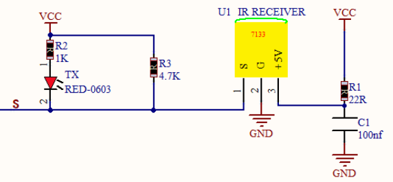

   img

红外遥控系统的主要部分为调制、发射和接收。红外遥控是以调制的方式发射数据，就是把数据和一定频率的载波进行“与”操作，这样既可以提高发射效率又可以降低电源功耗。调制载波频率一般在30khz到60khz之间，大多数使用的是38kHz，占空比1/3的方波。红外接收的信号端加上了4.7K的上拉电阻R3，工作时，首先等待检测低电平，接收到信号后，信号端立即由高电平转为低电平。

1.4 实验组件

+------------+--------------+----------------+----------------+------------+
| |img|      | |image128|   | |image129|     | |image130|     | |image131| |
+============+==============+================+================+============+
| ESP32      | Keyes        | Keyes 遥控器   | XH2.54-3P      | USB线 x1   |
| Plus主板   | 红外接收模块 | x1             | 转杜邦线母单线 |            |
| x1         | x1           |                | x1             |            |
+------------+--------------+----------------+----------------+------------+

1.5 模块接线图

.. figure:: ./media/361501.png
   :alt: img

   img

1.6 实验代码

**注意**\ ：上传代码前要添加库文件，先点击“\ **项目**\ ”，选择“\ **加载库**\ ”，最后选择“\ **添加.ZIP库**\ ”。

打开库文件夹，选中”\ **IRremote.zip**\ “，单击“\ **打开**\ ”，库文件成功添加。

本项目中使用的代码保存在文件夹“\*\*:raw-latex:`\程序代码`:raw-latex:`\Arduino`\_代码\ **”中，我们可以在此路径下打开代码文件’’**\ IR_Receiver.ino*\*“。

.. code:: cpp

   /*  
    * 名称   : IR_Receiver
    * 功能   : 解码红外线遥控器，通过串口打印出来
    * 作者   : http://www.keyes-robot.com/ 
   */
   #include <IRremote.hpp>  // 引入 IRremote 库

   #define DECODE_NEC  // 只启用 NEC 协议

   const int IR_Pin = 4;  //红外接收模块数据引脚为IO4

   void setup() 
   {
     Serial.begin(115200);  // 初始化串口通信
     while (!Serial);  // 等待串口初始化完成
     Serial.println(F("Ready to receive NEC IR signals..."));
     IrReceiver.begin(IR_Pin, ENABLE_LED_FEEDBACK);  // 启动接收，使用引脚 IO4
   }

   void loop()
   {
     if (IrReceiver.decode()) 
     {  // 检测是否接收到红外信号
       if (IrReceiver.decodedIRData.protocol != UNKNOWN) 
       {
         // 打印接收到的按键值，转换为十进制
         long IR_Value = IrReceiver.decodedIRData.command;
         Serial.print("IR Value:");
         Serial.println(IR_Value);  // 以十进制打印按键值
         delay(100);
       }
       IrReceiver.resume();  // 准备接收下一个红外信号
     }
   }

1.7 代码说明

+-----------------------------------------+------------------------------------------+
| 代码                                    | 说明                                     |
+=========================================+==========================================+
| IrReceiver.begin(IR_Pin,                | 启动红外接收。                           |
| ENABLE_LED_FEEDBACK);                   |                                          |
+-----------------------------------------+------------------------------------------+
| IrReceiver.decode()                     | 检测是否接收到红外信号。                 |
+-----------------------------------------+------------------------------------------+
| long IR_Value =                         | 将接收到的按键值存储在\ ``IR_Value``\ 。 |
| IrReceiver.decodedIRData.command;       |                                          |
+-----------------------------------------+------------------------------------------+
| IrReceiver.resume();                    | 恢复，等待接收下一个红外遥控信号。       |
+-----------------------------------------+------------------------------------------+

1.8 实验结果

Keyes 遥控器上每一个按键都对应着一个按键值，如下图所示。

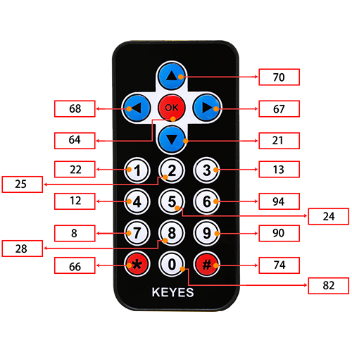

   361701

代码上传成功后，打开串口监视器，设置波特率为\ **115200**\ 。

**拔出红外遥控器的绝缘片**\ 。对准红外接收模块的红外接收传感器接收头，按下遥控器任意按键，接收到信号后，串口监视器窗口打印出当前接收到的按键值，同时，红外接收传感器上的LED会闪烁。

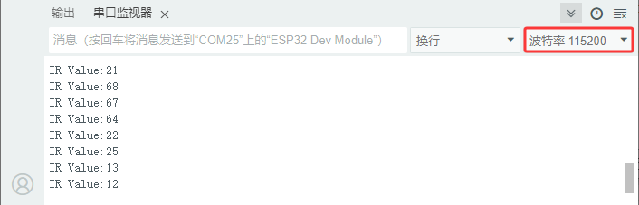

   361702

项目三十七 DS18B20温度传感器检测温度
~~~~~~~~~~~~~~~~~~~~~~~~~~~~~~~~~~~~

1.1 项目介绍

在这个套件中，有一个Keyes DS18B20温度传感器，DS18B20
是美国DALLAS公司的一款温度传感器，单片机可以通过 1-Wire 协议与 DS18B20
进行通信，最终将温度读出。测试结果为℃,范围为-55℃到+125℃。

1.2 模块参数

工作电压 : DC 5V

电流 : 20 mA

最大功率 : 0.1 W

工作温度 ：-10°C ~ +50°C

测量精度 ：±0.5℃（-10℃至+85℃范围内）

输出信号 : 数字信号

尺寸 ：32 x 23.8 x 9.35 mm

定位孔大小：直径为 4.8 mm

接口 ：间距为2.54 mm 3pin防反接口

1.3 模块原理图

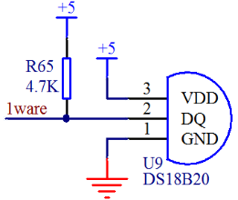

   img

1-Wire 总线的硬件接口很简单，只需要把 DS18B20 的数据引脚和单片机的一个
IO
口接上就可以了。硬件简单，随之而来的，就是软件时序的复杂。1-Wire总线的时序比较复杂，很多同学在这里独立看时序图都看不明白，我们在库里面已经把复杂的时序操作封装好了，直接使用库函数就可以。我们来看一下
DS18B20 的硬件原理图，如图所示。 DS18B20 通过编程，可以实现最高 12
位的温度存储值，在寄存器中，以补码的格式存储，如下图所示。

1.4 实验组件

+----------------+-------------------+-------------------+--------------+
| |img|          | |image132|        | |image133|        | |image134|   |
+================+===================+===================+==============+
| ESP32 Plus主板 | DS18B20温度传感器 | XH2.54-3P         | USB线 x1     |
| x1             | x1                | 转杜邦线母单线 x1 |              |
+----------------+-------------------+-------------------+--------------+

1.5 模块接线图

.. figure:: ./media/371501.png
   :alt: img

   img

1.6 实验代码

**注意**\ ：上传代码前要添加库文件，先点击“\ **项目**\ ”，选择“\ **加载库**\ ”，最后选择“\ **添加.ZIP库**\ ”。

打开库文件夹，选中”\ **DS18B20.zip**\ “，单击“\ **打开**\ ”，库文件成功添加。

本项目中使用的代码保存在文件夹“\*\*:raw-latex:`\程序代码`:raw-latex:`\Arduino`\_代码\ **”中，我们可以在此路径下打开代码文件’’**\ DS18B20.ino*\*“。

.. code:: cpp

   /*  
    * 名称   : DS18B20
    * 功能   : 读取DS18B20的温度
    * 作者   : http://www.keyes-robot.com/ 
   */
   #include <DS18B20.h>

   //DS18B20引脚为13
   DS18B20 ds18b20(13);

   void setup()
   {
     Serial.begin(115200);
   }

   void loop() 
   {
     double temp = ds18b20.GetTemp();//读取温度
     temp *= 0.0625;//转换精度为0.0625/LSB
     Serial.print("Temperature: ");
     Serial.print(temp);
     Serial.println("C");
     delay(1000);
   }

1.7 代码说明

+-----------------------------+--------------------------------------------------------+
| 代码                        | 说明                                                   |
+=============================+========================================================+
| DS18B20 ds18b20(13);        | 获取温度的管脚设置为GPIO13，获取温度的单位为℃。        |
+-----------------------------+--------------------------------------------------------+
| double temp =               | 设置一个double小数变量，为temp，将所测结果赋值给temp。 |
| ds18b20.GetTemp();          |                                                        |
+-----------------------------+--------------------------------------------------------+
| float temp =                | 计算当前环境的温度，数据类型为单精度浮点型。           |
| 1/(1/T2+log(Rt/R)/B)-K+0.5  |                                                        |
+-----------------------------+--------------------------------------------------------+

1.8 实验结果

代码上传成功后，打开串口监视器，设置波特率为\ **115200**\ 。

串口监视器打印出当前环境的温度值。

|image135|

项目三十八 XHT11温湿度传感器检测温湿度
~~~~~~~~~~~~~~~~~~~~~~~~~~~~~~~~~~~~~~

1.1 项目介绍

在这个套件中，有一个Keyes
XHT11温湿度传感器。XHT11作为一款低价的入门级温湿度传感器，它主要由一个电阻式感湿元件和一个NTC测温元件组成。XHT11为4针单排引脚封装，采用单线制串行接口，只需加适当的上拉电阻，信号传输距离可达20米以上，Keyes
XHT11温湿度传感器具有超快响应、抗干扰能力强、性价比极高等优点。

1.2 模块参数

工作电压 : DC 3.3 ~ 5V

电流 : 50 mA

最大功率 : 0.25 W

工作温度 : -25°C ~ +60°C

温度范围 : 0 ~ 50°C ± 2℃

湿度范围 : 20% ~ 90%RH ± 5%RH

输出信号 : 数字双向单总线

尺寸 ：32 x 23.8 x 9.7 mm

定位孔大小：直径为 4.8 mm

接口 ：间距为2.54 mm 3pin防反接口

1.3 模块原理图

.. figure:: ./media/381301.png
   :alt: img

   img

单片机与
XHT11之间的通讯和同步，采用单总线数据格式，一次通讯时间4ms左右，数据分小数部分和整数部分，具体格式在下面说明，当前小数部分用于以后扩展，现读出为零，操作流程：一次完整的数据传输为40bit，高位先出。

数据格式：8bit湿度整数数据+8bit湿度小数数据+8bi温度整数数据+8bit温度小数数据+8bit校验和。

8位校验和：8bit湿度整数数据+8bit湿度小数数据+8bi温度整数数据+8bit温度小数数据”相加所得结果的末8位。

1.4 实验组件

+----------------+-------------------+-------------------+--------------+
| |img|          | |image136|        | |image137|        | |image138|   |
+================+===================+===================+==============+
| ESP32 Plus主板 | Keyes             | XH2.54-3P         | USB线 x1     |
| x1             | XHT11温湿度传感器 | 转杜邦线母单线 x1 |              |
|                | x1                |                   |              |
+----------------+-------------------+-------------------+--------------+

1.5 模块接线图

.. figure:: ./media/381501.png
   :alt: img

   img

1.6 实验代码

**注意**\ ：上传代码前要添加库文件，先点击“\ **项目**\ ”，选择“\ **加载库**\ ”，最后选择“\ **添加.ZIP库**\ ”。

打开库文件夹，选中”\ **xht11.zip**\ “，单击“\ **打开**\ ”，库文件成功添加。

本项目中使用的代码保存在文件夹“\*\*:raw-latex:`\程序代码`:raw-latex:`\Arduino`\_代码\ **”中，我们可以在此路径下打开代码文件’’**\ XHT11.ino*\*“。

.. code:: cpp

   /*  
    * 名称   : xht11
    * 功能   : 读取XHT11的温度和湿度值
    * 作者   : http://www.keyes-robot.com/ 
   */
   #include "xht11.h"
   xht11 xht(13);
   unsigned char dht[4] = {0, 0, 0, 0};// 只接收数据的前32位，不接收奇偶校验位

   void setup() 
   {
     Serial.begin(115200);
   }

   void loop() 
   {
     if (xht.receive(dht)) 
     { //正确检查时返回true
       Serial.print("RH:");
       Serial.print(dht[0]); //湿度的积分部分DHT[1]为小数部分系列。打印(“%”);
       Serial.print("  Temp:");
       Serial.print(dht[2]); //温度的积分部分DHT[3]为小数部分
       Serial.println("°C");
     } 
     else 
     {    //Read error
       Serial.println("sensor error");
     }
     delay(1000);  //等待设备读取需要1000ms
   }

1.7 代码说明

+------------------------------+----------------------------------------------+
| 代码                         | 说明                                         |
+==============================+==============================================+
| unsigned char dht[4] = {0,   | 将读取到的温湿度数据存放到dht[4]这个数组当中 |
| 0, 0, 0}                     |                                              |
+------------------------------+----------------------------------------------+

1.8 实验结果

代码上传成功后，打开串口监视器，设置波特率为\ **115200**\ 。

串口监视器打印出当前环境的温湿度值。

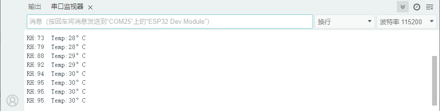

   381701

项目三十九 DS1307时钟模块
~~~~~~~~~~~~~~~~~~~~~~~~~

1.1 项目介绍

这个模块主要用到的芯片是美国DALLAS公司推出的I2C总线接口实时时钟芯片DS1307，它可独立于CPU工作，不受CPU主晶振及其电容的影响；计时准确，月累积误差一般小于10秒。此芯片还具有主电源掉电情况下的时钟保护电路，DS1307的时钟靠后备电池维持工作，拒绝CPU对其读出和写入访问。同时还具有备用电源自动切换控制电路，因而可在主电源掉电和其它一些恶劣环境场合中保证系统时钟的定时准确性。DS1307具有产生秒、分、时、日、月、年等功能，且具有闰年自动调整功能。同时，DS1307芯片内部还集成有一定容量、具有掉电保护特性的静态RAM，可用于保存一些关键数据。

1.2 模块参数

中断类型 : 全天时间

存储器容量 : 56 bytes

存储器类型 : RAM

接口类型 : Serial, I2C

时钟频率 : 32.768kHz

特点 : 方波输出

电压, Vcc 最大 : 5V

电源电压 最小 : 4.5V

类型 : RTC

工作温度 ：-10°C ~ +50°C

通讯方式 ：I2C通讯

尺寸 ：47.6 x 23.8 x 9.3 mm

定位孔大小：直径为 4.8 mm

接口 ：间距为2.54 mm 4pin防反接口

1.3 模块原理图

.. figure:: ./media/391301.png
   :alt: img

   img

DS1307 把8 个寄存器和56 字节的RAM
进行了统一编址，记录年、月、日、时、分、秒及星期; AM、PM
分别表示上午和下午; 56 个字节的NVRAM存放数据; 2线串口;
可编程的方波输出;电源故障检测及自动切换电路;电池电流小于500nA。

主要引脚定义如下：

========== ====================
DS1307引脚 定义
========== ====================
X1、X2     32.768kHz 晶振接入端
VBAT       +3V 电池电压输入
VCC        电源电压
SQW        方波驱动器
SCL        串行时钟
SDA        串行数据
========== ====================

1.4 实验组件

+---------------+----------------------+------------------+-------------+
| |img|         | |image139|           | |image140|       | |image141|  |
+===============+======================+==================+=============+
| ESP32         | Keyes                | XH2.54-4P        | USB线 x1    |
| Plus主板 x1   | DS1307时钟传感器模块 | 转杜邦线母单线   |             |
|               | x1                   | x1               |             |
+---------------+----------------------+------------------+-------------+

1.5 模块接线图

.. figure:: ./media/391501.png
   :alt: img

   img

1.6 实验代码

**注意**\ ：上传代码前要添加库文件，先点击“\ **项目**\ ”，选择“\ **加载库**\ ”，最后选择“\ **添加.ZIP库**\ ”。

打开库文件夹，选中”\ **Rtc_by_Makuna.zip**\ “，单击“\ **打开**\ ”，库文件成功添加。

本项目中使用的代码保存在文件夹“\*\*:raw-latex:`\程序代码`:raw-latex:`\Arduino`\_代码\ **”中，我们可以在此路径下打开代码文件’’**\ DS1307.ino*\*“。

.. code:: cpp

   /*  
    * 名称   : DS1307 Real Time Clock
    * 功能   : 读取DS1307时钟模块的年/月/日/时/分/秒/周
    * 作者   : http://www.keyes-robot.com/ 
   */
   #include <Wire.h>
   #include "RtcDS1307.h"  //DS1307时钟模块库
   RtcDS1307<TwoWire> Rtc(Wire);//I2C接口

   void setup(){
     Serial.begin(115200);
     Rtc.Begin();
     Rtc.SetIsRunning(true);

     Rtc.SetDateTime(RtcDateTime(__DATE__, __TIME__));  
   }

   void loop(){
     // 打印年/月/日/小时/分/ 秒/周
     Serial.print(Rtc.GetDateTime().Year());
     Serial.print("/");
     Serial.print(Rtc.GetDateTime().Month());
     Serial.print("/");
     Serial.print(Rtc.GetDateTime().Day());
     Serial.print("    ");
     Serial.print(Rtc.GetDateTime().Hour());
     Serial.print(":");
     Serial.print(Rtc.GetDateTime().Minute());
     Serial.print(":");
     Serial.print(Rtc.GetDateTime().Second());
     Serial.print("    ");
     Serial.println(Rtc.GetDateTime().DayOfWeek());
     delay(1000);//延迟1秒
   }

1.7 代码说明

============================= ==========================
代码                          说明
============================= ==========================
Rtc.Begin()                   启动DS1307实时时钟。
Rtc.GetDateTime()             获取当前系统的时间和日期。
Rtc.SetDateTime()             设置时间。
Rtc.GetDateTime().Year()      返回年份。
Rtc.GetDateTime().Month()     返回月份。
Rtc.GetDateTime().Day()       返回日期。
Rtc.GetDateTime().Hour()      返回小时。
Rtc.GetDateTime().Minute()    返回分钟。
Rtc.GetDateTime().Second()    返回秒数。
Rtc.GetDateTime().DayOfWeek() 返回星期。
============================= ==========================

1.8 实验结果

确保模块上电池已安装好，代码上传成功后，打开串口监视器，设置波特率为\ **115200**\ 。

串口监视器打印出年、月、日、时、分、秒、周，并每秒刷新一次，显示如下图。

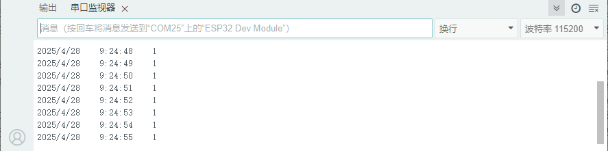

   img

项目四十 ADXL345加速度传感器
~~~~~~~~~~~~~~~~~~~~~~~~~~~~

1.1 项目介绍

在这个套件中，有一个Keyes ADXL345加速度传感器模块，它主要由 ADXL345BCCZ
芯片组成。ADXL345BCCZ
是一款小而薄的低功耗3轴加速度计芯片，分辨率高（13位），测量范围达±16g，既能测量运动或冲击导致的动态加速度，也能测量静止加速度，例如重力加速度，使得器件可作为倾斜传感器使用。

1.2 模块参数

工作电压 ：DC 3.3 ~ 5V

测量范围 ：±16 g

工作温度 ：-10°C ~ +50°C

通讯方式 ：IIC/SPI 通信协议

尺寸 ：47.6 x 23.8 x 9.3 mm

定位孔大小：直径为 4.8 mm

接口 ：间距为2.54 mm 4pin防反接口

1.3 模块原理图

   img

ADXL345是一款完整的3轴加速度测量系统，可选择的测量范围有±2 g，±4 g，±8
g或±16
g。它数字输出数据为16位二进制补码格式，可通过SPI（3线或4线）或I2C数字接口访问。该传感器可以在倾斜检测应用中测量静态重力加速度，还可以测量运动或冲击导致的动态加速度。其高分辨率(3.9mg/LSB)，能够测量不到1.0°的倾斜角度变化。

1.4 实验组件

+---------------+-------------------------+------------------+-------------+
| |img|         | |image142|              | |image143|       | |image144|  |
+===============+=========================+==================+=============+
| ESP32         | Keyes                   | XH2.54-4P        | USB线 x1    |
| Plus主板 x1   | ADXL345加速度传感器模块 | 转杜邦线母单线   |             |
|               | x1                      | x1               |             |
+---------------+-------------------------+------------------+-------------+

1.5 模块接线图

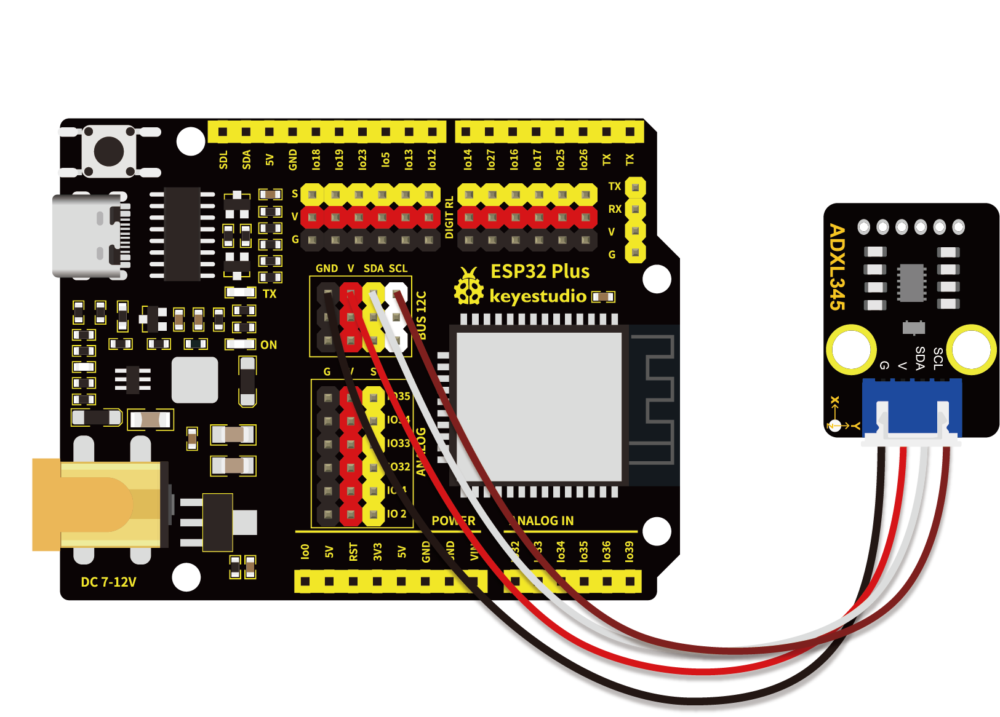

   img

1.6 实验代码

**注意**\ ：上传代码前要添加库文件，先点击“\ **项目**\ ”，选择“\ **加载库**\ ”，最后选择“\ **添加.ZIP库**\ ”。

打开库文件夹，选中”\ **adxl345_io.zip**\ “，单击“\ **打开**\ ”，库文件成功添加。

本项目中使用的代码保存在文件夹“\*\*:raw-latex:`\程序代码`:raw-latex:`\Arduino`\_代码\ **”中，我们可以在此路径下打开代码文件’’**\ adxl345.ino*\*“。

.. code:: cpp

   /*  
    * 名称   : ADXL345
    * 功能   : 读取ADXL345的X/Y/Z值
    * 作者   : http://www.keyes-robot.com/ 
   */
   #include "adxl345_io.h"
   adxl345 adxl345(21, 22);

   float out_X, out_Y, out_Z;

   void setup() 
   {
     Serial.begin(115200);
     adxl345.Init();
   }

   void loop() 
   {
     adxl345.readXYZ(&out_X, &out_Y, &out_Z);
     Serial.print(out_X);
     Serial.print("g   ");
     Serial.print(out_Y);
     Serial.print("g   ");
     Serial.print(out_Z);
     Serial.println("g");
     delay(100);
   }

1.7 代码说明

+-----------------------------+--------------------------------------------------------+
| 代码                        | 说明                                                   |
+=============================+========================================================+
| float out_X, out_Y, out_Z   | 设置3个小数变量，将所测结果赋值给out_X、out_Y、out_Z。 |
+-----------------------------+--------------------------------------------------------+
| adxl345.Init();             | 初始化ADXX345加速度传感器。                            |
+-----------------------------+--------------------------------------------------------+
| adxl345.readXYZ(&out_X,     | 获取X轴的加速度值返回给变量out_X,out_Y,out_Z。         |
| &out_Y, &out_Z);            |                                                        |
+-----------------------------+--------------------------------------------------------+

1.8 实验结果

代码上传成功后，打开串口监视器，设置波特率为\ **115200**\ 。

串口监视器打印出三轴加速度对应的值，单位为g。

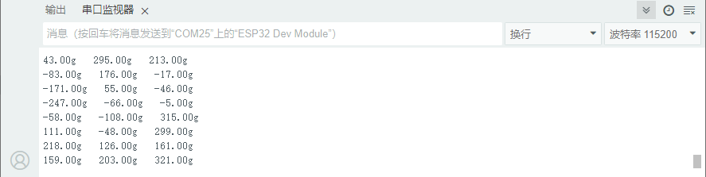

   401701

项目四十一 TM1650四位数码管模块
~~~~~~~~~~~~~~~~~~~~~~~~~~~~~~~

1.1 项目介绍

Keyes TM1650四位数码管模块选用的 0.36
英寸红色共阴4位数码管的驱动芯片是TM1650。TM1650是一种带键盘扫描接口的LED驱动控制专用电路的芯片。内部集成有MCU输入输出控制数字接口、数据锁存器、LED
驱动、键盘扫描等电路。TM1650性能稳定、质量可靠、抗干扰能力强，可适用于24小时长期连续工作的应用场合。TM1650采用两线串行传输协议通讯（注意：该数据传输协议不是标准的I2C协议）。该芯片只需要通过两个引脚与MCU通讯就可以完成数码管的驱动，可以节省MCU引脚资源。

实验中使用Keyes
TM1650四位数码管模块时，我们只需要2根信号线即可使单片机控制4位数码管，大大节约了控制板IO口资源。

1.2 模块参数

工作电压 : DC 5V

电流 : 100 mA

最大功率 : 0.5 W

数码管显示颜色 : 红色

LED极性 : 共阴

通讯方式 ：2线高速串行接口（CLK,DAT）

工作温度 ：-10°C ~ +50°C

尺寸 ：47.6 x 23.8 x 10.6 mm

定位孔大小：直径为 4.8 mm

接口 ：间距为2.54 mm 4pin防反接口

1.3 模块原理图

TM1650与MCU之间的通讯采用2线高速串行接口（CLK,DAT），这两个连线分别是数据线DAT和同步时钟线CLK。其中DAT为双向数据传输线，TM1650既用该线从MCU接收数据，也用该线向MCU发送数据。

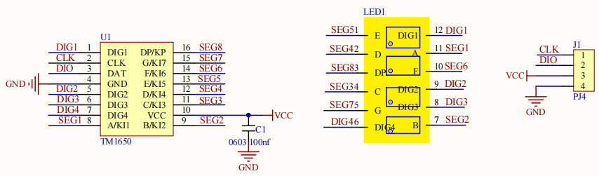

   411301

实验中我们使用封装好的库函数。

如果大家有兴趣也可以接着往下学习了解 1.3.1 TM1650通讯时序格式和 1.3.2
指令集说明，然后再去了解底层的库函数是如何实现的。

**1.3.1 TM1650通讯时序格式**

TM1650采用下图1 中2线串行传输协议通讯：

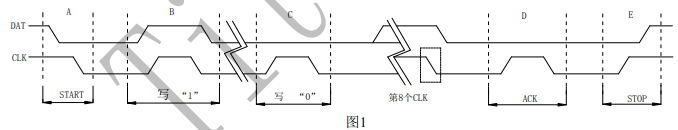

   img

（1）开始信号（START）/结束信号(STOP)

开始信号：保持 CLK 为“1”电平，DAT 从“1”跳“0”，认为是开始信号，如上图1的
A 段； 结束信号：保持 CLK 为“1”电平，DAT
从“0”跳“1”，认为是结束信号，如上图1的 E 段；

（2）ACK 信号

如果本次通讯正常，芯片在串行通讯的第 8 个时钟下降沿后，TM1650 主动把 DAT
拉低，直到 CLK 检测到上升沿，DAT 释放为输入状态（对芯片而言）,如上图1的
D 段。

（3） 写“1”和写“0”

写“1”：保持 DAT 为“1”电平，CLK
从“0”跳到“1”,再从“1”跳到“0”，则认为是写入“1” ，如上图 1的 B 段。
写“0”：保持 DAT 为“0”电平，CLK
从“0”跳到“1”,再从“1”跳到“0”，则认为是写入“0” ，如上图 1的 C 段。

（4） 一个字节（8 位）数据传输格式

.. figure:: ./media/411303.png
   :alt: img

   img

一个字节数据的传输格式如图上 2，数据发送时 MSB 在前，LSB
在后，即高位先进。微处理器的数据通过 2 线 串行接口和 TM1650 通信，当 CLK
是高电平时，DAT 上的信号必须保持不变；只有 CLK 上的时钟信号为低电平时，
DAT 上的信号才能改变。数据输入的开始条件是 CLK 为高电平时，DAT
由高变低；结束条件是 CLK 为高时，DAT 由低电平变为高电平。

（5）写显示操作

.. figure:: ./media/411304.png
   :alt: img

   img

ADDRESS：显示地址（68H、6AH、6CH、6EH）； DATA：显示数据。

（6）完整操作时序

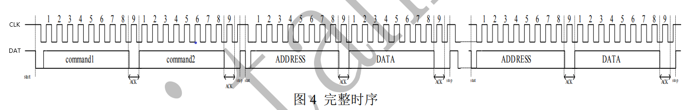

   img

command1：系统命令 48H； command2：系统参数设置；
ADDRESS：显示地址（68H、6AH、6CH、6EH）； DATA：显示数据。

备注：
1、设置系统参数和写入显存数据是两个独立的过程，它们之间的顺序不影响实际应用；
2、每次输入系统命令（48H）和系统参数设置命令都会改变系统参数，请特别注意待机指令操作。

#1.3.2 指令集说明

（1）数据命令设置

   img

注意：使用的指令是 16 进制 H，输入数据和读取数据都是从高位开始。

所以在代码中我们数据命令设置为
0x48，使用TM1650点亮数码管的功能，而不使用按键扫描的功能。

（2）显示命令设置

.. figure:: ./media/411307.png
   :alt: img

   img

注意：在发送上述系统显示命令前需要先输入系统命令48H,如48H+11H=1级亮度开屏显示。

B[7:0] 这里实际是一个字节数据，只是不同位部分代表不同功能。 B[6:4]
：设置数码管亮度。注意，000 最亮。 B[3] ：设置是否显示小数点。 B[0]
：设置数码管的开屏、关屏。

（3） 显存地址

.. figure:: ./media/411308.png
   :alt: img

   img

如果要显示小数点，则必须先需要将段模式设置为 8 段输出。

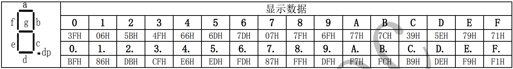

   img

1.4 实验组件

+---------------+----------------------+------------------+-------------+
| |img|         | |image145|           | |image146|       | |image147|  |
+===============+======================+==================+=============+
| ESP32         | Keyes                | XH2.54-4P        | USB线 x1    |
| Plus主板 x1   | TM1650四位数码管模块 | 转杜邦线母单线   |             |
|               | x1                   | x1               |             |
+---------------+----------------------+------------------+-------------+

1.5 模块接线图

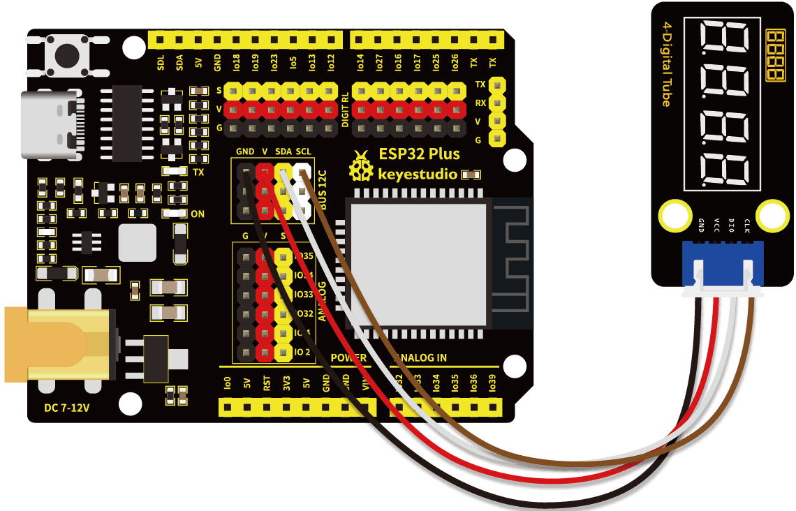

   img

1.6 实验代码

**注意**\ ：上传代码前要添加库文件，先点击“\ **项目**\ ”，选择“\ **加载库**\ ”，最后选择“\ **添加.ZIP库**\ ”。

打开库文件夹，选中”\ **TM1650.zip**\ “，单击“\ **打开**\ ”，库文件成功添加。

本项目中使用的代码保存在文件夹“\*\*:raw-latex:`\程序代码`:raw-latex:`\Arduino`\_代码\ **”中，我们可以在此路径下打开代码文件’’**\ Four_digital_tube.ino*\*“。

.. code:: cpp

   /*  
    * 名称   : TM1650 Four digital tube
    * 功能   : TM1650四数码管显示0-9999
    * 作者   : http://www.keyes-robot.com/ 
   */
   #include "TM1650.h"
   #define CLK 22    //TM1650的引脚定义，可以更改为其他端口      
   #define DIO 21
   TM1650 DigitalTube(CLK,DIO);

   void setup
   {
     DigitalTube.setBrightness();  //设置亮度，0- 7，默认值:2
     DigitalTube.displayOnOFF();   //显示打开或关闭，0=显示关闭，1=显示打开，默认值:1
     for(char b=1;b<5;b++)
     {
       DigitalTube.clearBit(b);    //清晰显示位
     }
     // DigitalTube.displayDot(1,true); //Bit0显示点，在displayBit()之前使用
     DigitalTube.displayBit(1,0);    //DigitalTube.display(bit,number); bit=0~3，number=0~9
   }

   void loop()
   {
     for(int num=0; num<10000; num++)
     {
       displayFloatNum(num);
       delay(100);
     }
   }

   void displayFloatNum(float num)
   {
     if(num > 9999)
       return;
     int dat = num*10;
      //DigitalTube.displayDot(2,true); //Bit0显示点，在displayBit()之前使用
     if(dat/10000 != 0)
     {
       DigitalTube.displayBit(1, dat%100000/10000);  
       DigitalTube.displayBit(2, dat%10000/1000);
       DigitalTube.displayBit(3, dat%1000/100);
       DigitalTube.displayBit(4, dat%100/10);
       return;
     }
     if(dat%10000/1000 != 0)
     {
       DigitalTube.clearBit(1); 
       DigitalTube.displayBit(2, dat%10000/1000); 
       DigitalTube.displayBit(3, dat%1000/100);
       DigitalTube.displayBit(4, dat%100/10);
       return;
     }
     if(dat%1000/100 != 0)
     {
     DigitalTube.clearBit(1); 
     DigitalTube.clearBit(2);
     DigitalTube.displayBit(3, dat%1000/100);
     DigitalTube.displayBit(4, dat%100/10);  
     return;
   }
     DigitalTube.clearBit(1); 
     DigitalTube.clearBit(2);
     DigitalTube.clearBit(3);
     DigitalTube.displayBit(4, dat%100/10);
   }

1.7 代码说明

+-----------------------------+--------------------------------------------------+
| 代码                        | 说明                                             |
+=============================+==================================================+
| DigitalTube.setBrightness() | 设置亮度，0- 7，默认值:2 。                      |
+-----------------------------+--------------------------------------------------+
| DigitalTube.displayOnOFF()  | 显示打开或关闭，0=显示关闭，1=显示打开，默认值:1 |
|                             | 。                                               |
+-----------------------------+--------------------------------------------------+
| DigitalTube.clearBit(b)     | 清除位显示。                                     |
+-----------------------------+--------------------------------------------------+

1.8 实验结果

代码上传成功后，4位数码管显示数字，从0开始，每100毫秒加1，直至加到9999后又从0开始循环。

.. figure:: ./media/411701.png
   :alt: img

   img

项目四十二 HT16K33_8X8点阵模块
~~~~~~~~~~~~~~~~~~~~~~~~~~~~~~

1.1 项目介绍

点阵，多个LED组成的阵列，他们的集合称为“阵”，其中单个单元称为“点”。8X8点阵共由64个发光二极管组成，且每个发光二极管是放置在行线和列线的交叉点上。

第二课我们学习了一个IO口控制一个led，这节课我们来学习用更少的IO口控制更多的led。

1.2 模块参数

工作电压 : DC 5V

电流 : 200 mA

最大功率 : 1 W

工作温度 ：-10°C ~ +50°C

通讯方式 ：I2C通讯

I2C通信地址 ：0X70

点阵屏显示颜色 ：蓝色

尺寸 ：32 x 23.8 x 9.3 mm

定位孔大小：直径为 4.8 mm

接口 ：间距为2.54 mm 4pin防反接口

1.3 模块原理图

.. figure:: ./media/421301.png
   :alt: img

   img

如原理图所示，如果想要点亮第一行第一列的LED灯，只需要将C1置高电平、R1置低电平就可以了。如果我们想让第一行led全部点亮，只需要将R1置为低电平，C1~C8全部置为高电平就可以了。原理非常简单，但是这样设置的话我们总共需要用到16个IO口，非常浪费单片机资源。为了节省IO口不浪费单片机资源，我们特别设计了这个HT16K33_8X8点阵模块，利用HT16K33芯片驱动1个8*8点阵，只需要利用单片机的I2C通信端口就能控制点阵的64个发光二极管。

我们这款Keyes HT16K33_8X8点阵模块已经固定了通信地址，地址为0x70。

1.4 实验组件

+----------------+---------------------+------------------+-------------+
| |img|          | |image148|          | |image149|       | |image150|  |
+================+=====================+==================+=============+
| ESP32 Plus主板 | Keyes               | XH2.54-4P        | USB线 x1    |
| x1             | HT16K33_8X8点阵模块 | 转杜邦线母单线   |             |
|                | x1                  | x1               |             |
+----------------+---------------------+------------------+-------------+

1.5 模块接线图

.. figure:: ./media/421501.png
   :alt: img

   img

1.6 实验代码

**注意**\ ：上传代码前要添加库文件，先点击“\ **项目**\ ”，选择“\ **加载库**\ ”，最后选择“\ **添加.ZIP库**\ ”。

打开库文件夹，选中”\ **HT16K33_Lib_For_ESP32.zip**\ “，单击“\ **打开**\ ”，库文件成功添加。

本项目中使用的代码保存在文件夹“\*\*:raw-latex:`\程序代码`:raw-latex:`\Arduino`\_代码\ **”中，我们可以在此路径下打开代码文件’’**\ HT16K33_88_dot_matrix.ino*\*“。

.. code:: cpp

    /*
    * 名称   : 8×8 Dot-matrix Display
    * 功能   : 8x8 LED点阵显示“笑脸”图案
    * 作者   : http://www.keyes-robot.com/ 
   */
   #include "HT16K33_Lib_For_ESP32.h"
   #define SDA 21
   #define SCL 22
   ESP32_HT16K33 matrix = ESP32_HT16K33();

   //亮度值可设置为1 ~ 15，其中1最暗，15最亮
   ###define  A  15

   byte result[8][8];
   byte test1[8] = {0x00,0x42,0x41,0x09,0x09,0x41,0x42,0x00};

   void setup()
   {
     matrix.init(0x70, SDA, SCL);//初始化矩阵
     matrix.showLedMatrix(test1,0,0);
     matrix.show();
   }

   void loop()
   {
     for (int i = 0; i <= 7; i++)
     {
       matrix.setBrightness(i);
       delay(100);
     }
     for (int i = 7; i > 0; i--)
     {
       matrix.setBrightness(i);
       delay(100);
     }
   }

1.7 代码说明

点阵上的图案是由一个字节数据类型的数组构成的，我们用下面的表格表示。其中1表示亮，0表示灭，我们可以看到是一个“笑脸”图案。

.. figure:: ./media/421801.png
   :alt: img

   img

一列一列来看，可以知道点亮“笑脸”图案的矩阵代码为{0x00,0x42,0x41,0x09,0x09,0x41,0x42,0x00}。

1.8 实验结果

代码上传成功后，HT16K33_8X8点阵模块显示“笑脸”图案。

.. figure:: ./media/421701.png
   :alt: img

   img

若代码上传成功后点阵屏不显示“笑脸”图案，尝试按一下RESET键。

.. figure:: ./media/RESET.jpg
   :alt: img

   img

项目四十三 LCD_128X32_DOT模块
~~~~~~~~~~~~~~~~~~~~~~~~~~~~~

1.1 项目介绍

在这个套件中，有一个Keyes
LCD_128X32_DOT模块，它是一个像素为128*32的液晶屏模块，驱动芯片为
ST7567A。此模块使用IIC通信方式。我们提供了包含所有英文字母和常用符号的库，可以直接调用，还能设置大小。

1.2 模块参数

工作电压 ：DC 5V

分辨率 ：128 X 32

电流 ：100 mA

最大功率 ：0.5W

工作温度 ：0°C ~ +40°C

通讯方式 ：IIC/SPI 通信协议

尺寸 ：47.6 x 23.8 x 9.3 mm

定位孔大小：直径为 4.8 mm

接口 ：间距为2.54 mm 4pin防反接口

1.3 模块原理图

.. figure:: ./media/431301.png
   :alt: img

   img

该模块使用IIC通讯原理，底层函数已经封装在库里面，直接调用库函数就可以。如果感兴趣的话可以自行了解底层驱动。

1.4 实验组件

+----------------+--------------------+-------------------+--------------+
| |img|          | |image151|         | |image152|        | |image153|   |
+================+====================+===================+==============+
| ESP32 Plus主板 | Keyes              | XH2.54-4P         | USB线 x1     |
| x1             | LCD_128X32_DOT模块 | 转杜邦线母单线 x1 |              |
|                | x1                 |                   |              |
+----------------+--------------------+-------------------+--------------+

1.5 模块接线图

.. figure:: ./media/431501.png
   :alt: img

   img

1.6 实验代码

**注意**\ ：上传代码前要添加库文件，先点击“\ **项目**\ ”，选择“\ **加载库**\ ”，最后选择“\ **添加.ZIP库**\ ”。

打开库文件夹，选中”\ **lcd128_32_io.zip**\ “，单击“\ **打开**\ ”，库文件成功添加。

本项目中使用的代码保存在文件夹“\*\*:raw-latex:`\程序代码`:raw-latex:`\Arduino`\_代码\ **”中，我们可以在此路径下打开代码文件’’**\ lcd128_32.ino*\*“。

.. code:: cpp

   /*  
    * 名称   : lcd128*32
    * 功能   : Lcd128 *32 显示字符串
    * 作者   : http://www.keyes-robot.com/ 
   */
   #include "lcd128_32_io.h"

   //sda--->21， scl--->22
   lcd lcd(21, 22);

   void setup()
   {
     lcd.Init(); //初始化
     lcd.Clear();  //清屏
   }

   void loop() 
   {
     lcd.Cursor(0, 7); //设置显示位置
     lcd.Display("KEYES"); //设置视图显示
     lcd.Cursor(1, 0);
     lcd.Display("ABCDEFGHIJKLMNOPQR");
     lcd.Cursor(2, 0);
     lcd.Display("123456789+-*/<>=$@");
     lcd.Cursor(3, 0);
     lcd.Display("%^&(){}:;'|?,.~\\[]");
   }

1.7 代码说明

================ ==============
代码             说明
================ ==============
lcd.Init()       初始化显示屏。
lcd.Clear()      清除显示。
lcd.Cursor( , )  设置显示位置。
lcd.Display(” “) 设置显示字符。
================ ==============

1.8 实验结果

代码上传成功后，模块显示屏第一行显示“\ **KEYES**\ ”、第二行显示“\ **ABCDEFGHIJKLMNOPQR**\ ”、第三行显示“\ **123456789+-/<>=$@\*\ ”、第四行显示“**\ %^&(){}:;’\|?,.~\\[]*\*”。

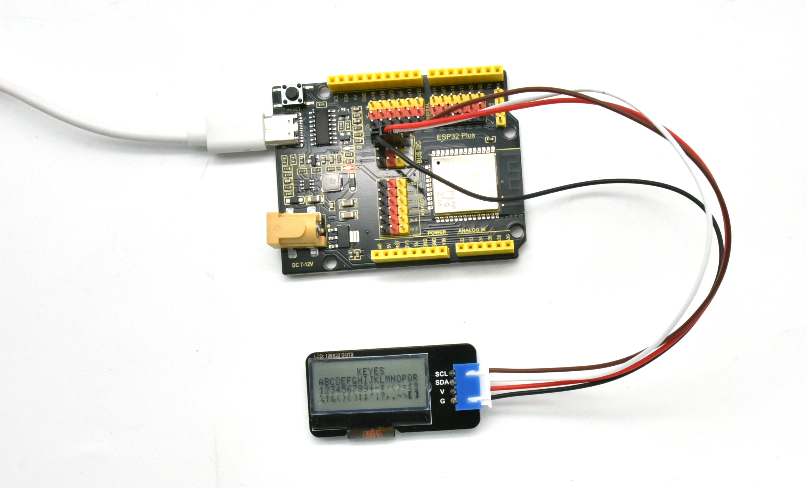

   img

项目四十四 RFID刷卡模块
~~~~~~~~~~~~~~~~~~~~~~~

1.1 项目介绍

在这个套件中，有一个Keyes
RFID刷卡模块。RFIDRFID-RC522射频模块采用Philips
MFRC522原装芯片设计读卡电路，使用方便，成本低廉，适用于设备开发、读卡器开发等高级应用的用户，也适用于需要进行射频卡终端设计/生产的用户。本模块可直接装入各种读卡器模具,通过IIC接口简单的2条线就可以直接与用户任何CPU主板或单片机相连接通信。
实验中用刷卡模块读取到的数据是4个16进制数，我们把这四个16进制数串以字符串的形式打印出来。例如本实验中读取到的IC卡的数据为：0xED、0xF7、0x94、0x5A，在串口监视器显示出信息字符串就是ED
F7 94
5A；读取钥匙扣的数据为：0x4C、0x09、0x6B、0x6E，在串口监视器打印出来的信息字符串就是4C
09 6B
6E。有时候看到的不是两位数，是因为前面有个0省略了，如0a它显示的就是a。不同的IC卡和钥匙扣，其数据是不一样的。

1.2 模块参数

工作电压 : DC 5V

工作电流 : 13 ~ 100 mA /DC 5V

空闲电流 : 10 ~ 13 mA /DC 5V

休眠电流 : < 80 uA

峰值电流 : < 100 mA

工作频率 : 13.56 MHz

最大功率 : 0.5 W

支持的卡类型：mifare1 S50、mifare1 S70、mifare UltraLight、mifare
Pro、mifare Desfire

数据传输速率：最大10Mbit/s

工作温度 ：-10°C ~ +50°C

尺寸 ：47.6 x 23.8 x 9.3 mm

定位孔大小：直径为 4.8 mm

接口 ：间距为2.54 mm 4pin防反接口

1.3 模块原理图

.. figure:: ./media/441301.png
   :alt: img

   img

RFID（Radio Frequency
Identification）：无线射频识别，读卡器由频射模块及高平磁场组成。Tag应答器为待感应设备，此设备不包含电池。他只包含微型集成电路芯片及存储数据的介质以及接收和发送信号的天线。读取tag中的数据，首先要放到读卡器的读取范围内。读卡器会产生一个磁场，因为磁能生电由楞次定律，RFID
Tag就会供电，从而激活设备。

.. figure:: ./media/441302.png
   :alt: img

   img

1.4 实验组件

+---------------------+---------------------+-------------------------+
| |img|               | |image154|          | |image155|              |
+=====================+=====================+=========================+
| ESP32 Plus主板 x1   | Keyes RFID刷卡模块  | XH2.54-4P               |
|                     | x1                  | 转杜邦线母单线 x1       |
+---------------------+---------------------+-------------------------+
| |image156|          | |3210|              | |IC|                    |
+---------------------+---------------------+-------------------------+
| USB线 x1            | 钥匙扣 x1           | IC卡 x1                 |
+---------------------+---------------------+-------------------------+

1.5 模块接线图

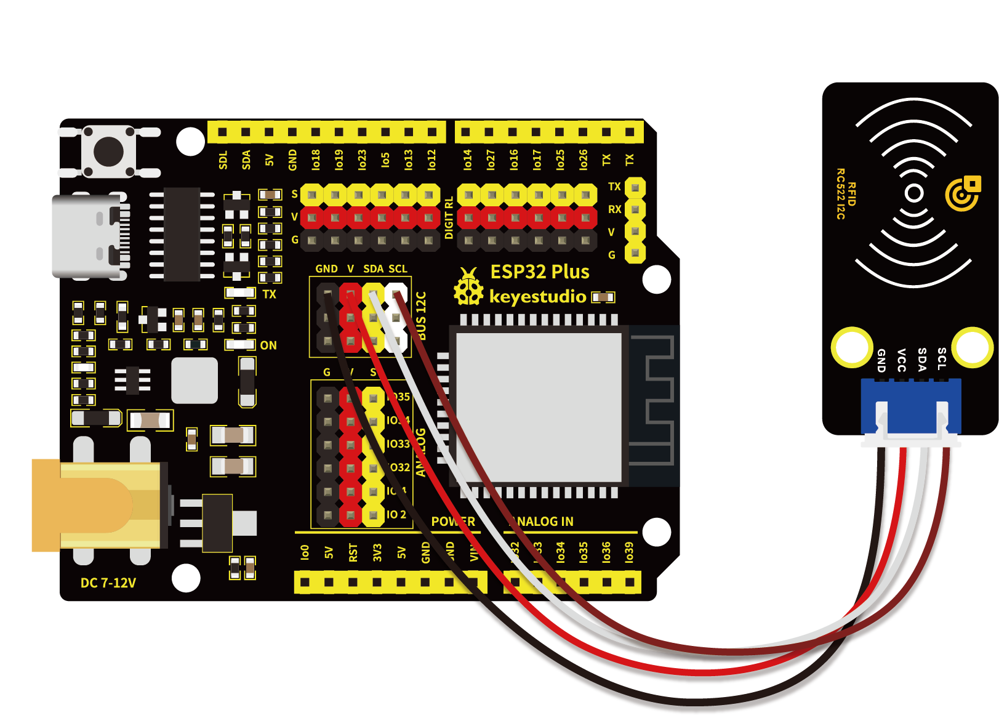

   img

1.6 实验代码

**注意**\ ：上传代码前要添加库文件，先点击“\ **项目**\ ”，选择“\ **加载库**\ ”，最后选择“\ **添加.ZIP库**\ ”。

打开库文件夹，选中”\ **MFRC522_I2C.zip**\ “，单击“\ **打开**\ ”，库文件成功添加。

本项目中使用的代码保存在文件夹“\*\*:raw-latex:`\程序代码`:raw-latex:`\Arduino`\_代码\ **”中，我们可以在此路径下打开代码文件’’**\ RFID.ino*\*“。

.. code:: cpp

   /*  
    * 名称   : RFID
    * 功能   : RFID读取器UID
    * 作者   : http://www.keyes-robot.com/ 
   */
   #include <Wire.h>
   #include "MFRC522_I2C.h"
   // IIC引脚默认为ESP32的GPIO21和GPIO22
   // 0x28是SDA的i2c地址，如果不匹配，请与i2c核对你的地址。
   MFRC522 mfrc522(0x28);   // 创建MFRC522

   void setup()
   {
     Serial.begin(115200);           
     Wire.begin();        // 初始化I2C
     mfrc522.PCD_Init();  // 初始化MFRC522
     ShowReaderDetails(); // 显示PCD - MFRC522读卡机
     Serial.println(F("Scan PICC to see UID, type, and data blocks..."));
   }

   void loop() 
   {
     if ( ! mfrc522.PICC_IsNewCardPresent() || ! mfrc522.PICC_ReadCardSerial() ) 
     {
       delay(50);
       return;
     }
     
     // 选择一张门卡，UID和SAK分别为mfrc522.uid  
     // 保存UID
     Serial.print(F("Card UID:"));
     for (byte i = 0; i < mfrc522.uid.size; i++) 
     {
       Serial.print(mfrc522.uid.uidByte[i] < 0x10 ? " 0" : " ");
       Serial.print(mfrc522.uid.uidByte[i], HEX);
     } 
     Serial.println();
   }

   void ShowReaderDetails() 
   {
     //  获得MFRC522软件
     byte v = mfrc522.PCD_ReadRegister(mfrc522.VersionReg);
     Serial.print(F("MFRC522 Software Version: 0x"));
     Serial.print(v, HEX);
     if (v == 0x91)
       Serial.print(F(" = v1.0"));
     else if (v == 0x92)
       Serial.print(F(" = v2.0"));
     else
       Serial.print(F(" (unknown)"));
     Serial.println("");
     // 返回0x00或0xFF时，可能是通信信号传输失败
     if ((v == 0x00) || (v == 0xFF)) 
     {
       Serial.println(F("WARNING: Communication failure, is the MFRC522 properly connected?"));
     }
   }

1.7 代码说明

+--------------------------------------+----------------------------------------------------------------------------------+
| 代码                                 | 说明                                                                             |
+======================================+==================================================================================+
| PICC_IsNewCardPresent()              | 检测是否有新卡片靠近                                                             |
+--------------------------------------+----------------------------------------------------------------------------------+
| PICC_ReadCardSerial()                | 读取卡片序列号                                                                   |
+--------------------------------------+----------------------------------------------------------------------------------+
| Serial.print(mfrc522.uid.uidByte[i], | UID格式：通常为4字节（如\ ``0x12 0x34 0x56 0x78``\ ），7字节或10字节卡可能不同。 |
| HEX); // 以16进制打印UID }           |                                                                                  |
+--------------------------------------+----------------------------------------------------------------------------------+

1.8 实验结果

代码上传成功后，打开串口监视器，设置波特率为\ **115200**\ 。用IC卡和钥匙扣靠近RFID模块，串口监视器打印出RFID刷卡模块读取到的数据信息。

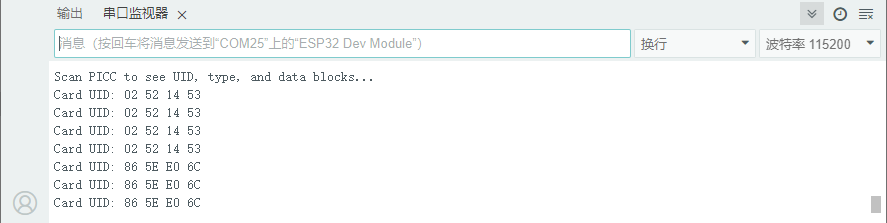

   441701

**注意：不同的IC卡和钥匙扣，其数据是不一样的。**

若代码上传成功后串口监视器不打印数据信息，尝试按一下RESET键。

.. figure:: ./media/RESET.jpg
   :alt: img

   img

项目四十五 按键控制LED灯
~~~~~~~~~~~~~~~~~~~~~~~~

1.1 项目介绍

从前面的实验课程中我们学习了按键模块，按下按键我们的单片机读取到低电平，松开按键读取到高电平。在这一实验课程中，我们将按键模块和紫色LED模块组合实验，实现按下按键LED点亮，再次按下按键LED熄灭，再次按下再次点亮的效果。

1.2 实验组件

+-------------+--------------+-------------+----------------+------------+
| |img|       | |image157|   | |image158|  | |image159|     | |image160| |
+=============+==============+=============+================+============+
| ESP32       | Keyes        | Keyes       | XH2.54-3P      | USB线 x1   |
| Plus主板 x1 | 单路按键模块 | 紫色LED模块 | 转杜邦线母单线 |            |
|             | x1           | x1          | x2             |            |
+-------------+--------------+-------------+----------------+------------+

1.3 实验接线图

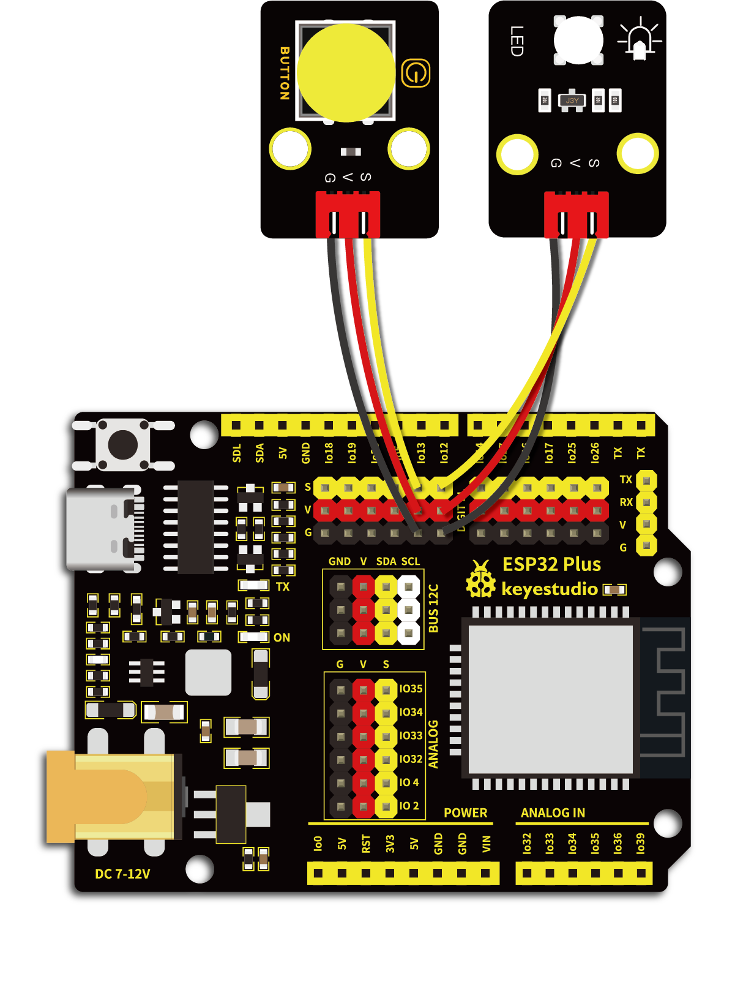

   img

1.4 实验代码

本项目中使用的代码保存在文件夹“\*\*:raw-latex:`\程序代码`:raw-latex:`\Arduino`\_代码\ **”中，我们可以在此路径下打开代码文件’’**\ button_control_LED.ino*\*“。

.. code:: cpp

   /* 
    * 名称   : button_control_LED
    * 功能   : 做一盏台灯
    * 作者   : http://www.keyes-robot.com/ 
   */
   #define PIN_LED    12
   #define PIN_BUTTON 13
   bool ledState = false;

   void setup() 
   {
   // 初始化数字引脚PIN_LED作为输出
     pinMode(PIN_LED, OUTPUT);
     pinMode(PIN_BUTTON, INPUT);
   }

   // 循环函数会一直运行下去
   void loop() 
   {
     if (digitalRead(PIN_BUTTON) == LOW) 
     {
       delay(20);
       if (digitalRead(PIN_BUTTON) == LOW) 
       {
         reverseGPIO(PIN_LED);
       }
       while (digitalRead(PIN_BUTTON) == LOW);
     }
   }

   void reverseGPIO(int pin) 
   {
     ledState = !ledState;
     digitalWrite(pin, ledState);
   }

1.5 代码说明

+--------------------------+------------------------------------------------------------------------------------------------------------------------------------------------------------------------------------------------------------------------------------------------------------------------------------------------------------------------------------------+
| 代码                     | 说明                                                                                                                                                                                                                                                                                                                                     |
+==========================+==========================================================================================================================================================================================================================================================================================================================================+
| bool ledState = false    | 布尔型（bool）变量的值只有真 （true) 和假 （false）。 C++中如果值非零就为True,为零就是False。这里可以知道ledState初始值为0。                                                                                                                                                                                                             |
+--------------------------+------------------------------------------------------------------------------------------------------------------------------------------------------------------------------------------------------------------------------------------------------------------------------------------------------------------------------------------+
| ledState = !ledState     | 将ledState的当前值取反后再赋值给ledState本身。                                                                                                                                                                                                                                                                                           |
+--------------------------+------------------------------------------------------------------------------------------------------------------------------------------------------------------------------------------------------------------------------------------------------------------------------------------------------------------------------------------+
| delay(20)                | 这里延时的作用是软件方法消抖。按键机械触点断开、闭合时，由于触点的弹性作用，按键开关不会马上稳定接通或一下子断开，在闭合及断开的瞬间均伴随有一连串的抖动，为了不产生这种现象而作的措施就是按键消抖。代码中检测出键闭合后执行一个延时程序，20ms的延时，让前沿抖动消失后再一次检测键的状态，如果仍保持闭合状态电平，则确认为真正有键按下。 |
+--------------------------+------------------------------------------------------------------------------------------------------------------------------------------------------------------------------------------------------------------------------------------------------------------------------------------------------------------------------------------+
| while                    | 循环PIN_BUTTON) == LOW，直至松开按键跳出while循环。作用是按下按键不松开时LED保持当前状态。若没有while循环，ledState会不断取反，也就是LED灯会不断地快速亮灭。                                                                                                                                                                             |
| (digitalRead(PIN_BUTTON) |                                                                                                                                                                                                                                                                                                                                          |
| == LOW)                  |                                                                                                                                                                                                                                                                                                                                          |
+--------------------------+------------------------------------------------------------------------------------------------------------------------------------------------------------------------------------------------------------------------------------------------------------------------------------------------------------------------------------------+

1.6 实验结果

代码上传成功后，按下按键，LED点亮，再次按下，LED熄灭。循环进行。

.. figure:: ./media/451501.png
   :alt: img

   img

.. figure:: ./media/451502.png
   :alt: img

   img

项目四十六 障碍物报警实验
~~~~~~~~~~~~~~~~~~~~~~~~~

1.1 项目介绍

在前面实验课程中中，我们使用一个输入模块控制另一个输出模块。在这一实验中，我们还是用一个模块控制另一个模块。

生活中，我们可以利用一个检测传感器控制一个有源蜂鸣器响起或者LED点亮，做声光报警设备，如检测磁场（干簧管）、检测倾斜（倾斜模块）等等。这一实验课程中我们将避障传感器和有源蜂鸣器模块组合实验，实现避障传感器检测到障碍物时有源蜂鸣器响起的效果。

1.2 实验组件

+-------------+-------------+----------------+----------------+------------+
| |img|       | |image161|  | |image162|     | |image163|     | |image164| |
+=============+=============+================+================+============+
| ESP32       | Keyes       | Keyes          | XH2.54-3P      | USB线 x1   |
| Plus主板 x1 | 避障传感器  | 有源蜂鸣器模块 | 转杜邦线母单线 |            |
|             | x1          | x1             | x2             |            |
+-------------+-------------+----------------+----------------+------------+

1.3 实验接线图

.. figure:: ./media/461301.png
   :alt: img

   img

1.4 实验代码

本项目中使用的代码保存在文件夹“\*\*:raw-latex:`\程序代码`:raw-latex:`\Arduino`\_代码\ **”中，我们可以在此路径下打开代码文件’’**\ Avoiding_alarm.ino*\*“。

.. code:: cpp

   /*  
    * 名称   : Avoiding alarm
    * 功能   : 避障传感器控制蜂鸣器
    * 作者   : http://www.keyes-robot.com/ 
   */
   int item = 0;

   void setup() 
   {
     pinMode(12, INPUT);  //避障传感器连接GPIO12，设置为输入模式
     pinMode(13, OUTPUT); //将蜂鸣器连接到GPIO13上并设置为输出模式
   }

   void loop() 
   {
     item = digitalRead(12);//读取避障传感器输出的电平值
     if (item == 0) 
     {//障碍物检测
       digitalWrite(13, HIGH);//蜂鸣器响起
     } 
     else 
     { //未检测到障碍物
       digitalWrite(13, LOW); //蜂鸣器关闭
     }
     delay(100);//延迟100ms
   }

1.5 代码说明

====================== ========================
代码                   说明
====================== ========================
item == 0              避障传感器检测到障碍物。
digitalWrite(13, HIGH) 有源蜂鸣器发出声响。
digitalWrite(13, LOW)  有源蜂鸣器停止发出声响。
====================== ========================

1.6 实验结果

代码上传成功后，当避障传感器检测到障碍物时，避障传感器上SLED灯亮起，同时有源蜂鸣器发出声响；当避障传感器检测不到障碍物时，有源蜂鸣器停止发出声响。

.. figure:: ./media/461501.png
   :alt: img

   img

项目四十七 入侵检测报警器
~~~~~~~~~~~~~~~~~~~~~~~~~

1.1 项目介绍

上一课实验中我们学习了使用避障传感器检测障碍物进行报警提醒。在这一实验课程中我们将人体红外热释传感器、紫色LED模块和有源蜂鸣器模块组合实验，实现人体红外热释传感器检测到附近有人经过时有源蜂鸣器响起，紫色LED快速闪烁的效果。

1.2 实验组件

+---------------------+-------------------------+---------------------+
| |img|               | |image165|              | |image166|          |
+=====================+=========================+=====================+
| ESP32 Plus主板 x1   | Keyes                   | Keyes               |
|                     | 人体红外热释传感器 x1   | 有源蜂鸣器模块 x1   |
+---------------------+-------------------------+---------------------+
| |image167|          | |image168|              | |image169|          |
+---------------------+-------------------------+---------------------+
| Keyes 紫色LED模块   | XH2.54-3P               | USB线 x1            |
| x1                  | 转杜邦线母单线 x3       |                     |
+---------------------+-------------------------+---------------------+

1.3 模块接线图

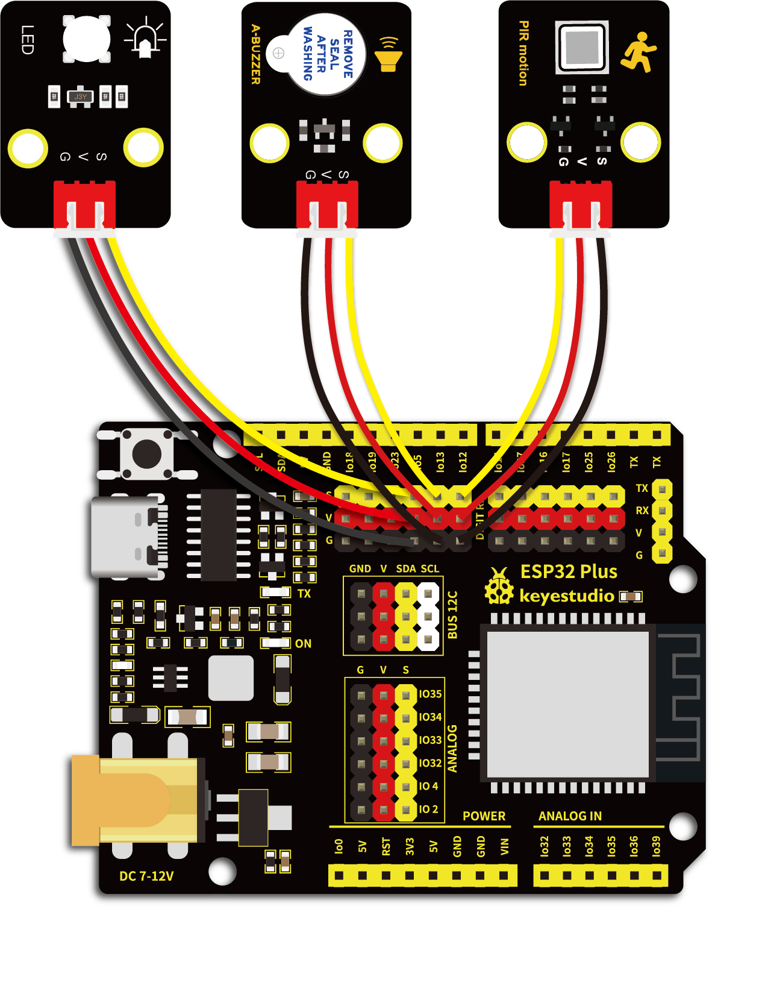

   img

1.4 实验代码

本项目中使用的代码保存在文件夹“\*\*:raw-latex:`\程序代码`:raw-latex:`\Arduino`\_代码\ **”中，我们可以在此路径下打开代码文件’’**\ PIR_alarm.ino*\*“。

.. code:: cpp

   /*  
    * 名称   : PIR alarm
    * 功能   : PIR控制蜂鸣器
    * 作者   : http://www.keyes-robot.com/ 
   */
   int item = 0;

   void setup() 
   {
     pinMode(12, INPUT);  //PIR运动传感器连接GPIO12，设置为输入模式
     pinMode(13, OUTPUT); //将主用蜂鸣器连接到GPIO13上，并设置为输出模式
     pinMode(5, OUTPUT);  //将LED连接到GPIO5上，并设置为输出模式
   }

   void loop() 
   {
     item = digitalRead(12);//读取红外热释传感器输出的数字液位信号
     if (item == 1) 
     {  //运动检测
       digitalWrite(13, HIGH); //打开蜂鸣器
       digitalWrite(5, HIGH);  //打开LED
       delay(200);//延迟 200ms
       digitalWrite(13, LOW); //关掉蜂鸣器
       digitalWrite(5, LOW);  //关闭LED
       delay(200);//延迟 200ms
     } 
     else 
     {  //没有检测到任何信号或数据
       digitalWrite(13, LOW); //关掉蜂鸣器
       digitalWrite(5, LOW);  //关闭LED
     }
   }

1.5 代码说明

====================== ========================================
代码                   说明
====================== ========================================
item = digitalRead(12) 人体红外热释传感器读取数字电平信号输出。
item == 1              运动检测，检测到有人经过。
digitalWrite(13, HIGH) 有源蜂鸣器响起发出警报。
digitalWrite(5, HIGH)  紫色LED灯快速闪烁。
====================== ========================================

1.6 实验结果

代码上传成功后，当人体红外热释传感器检测到附近有人经过时，人体红外热释传感器上的红灯灭，有源蜂鸣器发出警报，紫色LED灯快速闪烁。

.. figure:: ./media/471501.png
   :alt: img

   img

.. figure:: ./media/471502.png
   :alt: img

   img

项目四十八 模拟灭火机器人
~~~~~~~~~~~~~~~~~~~~~~~~~

1.1 项目介绍

你知道灭火机器人吗？发生火灾时，为了营救人员和灭火，非常需要消防员等人力资源。随着技术的进步、机器人技术的发展，未来很有可能使用机器人代替消防员灭火。这将提高灭火的效率，也能保障消防员的生命安全。

在这个项目中，我们将学习如何使用ESP32主板构建一个非常简单的灭火机器人。用火焰传感器检测火焰，并启动130电机吹灭火源。

1.2 实验组件

+----------------+----------------+----------------+-------------------+
| |img|          | |image170|     | |image171|     | |image172|        |
+================+================+================+===================+
| ESP32 Plus主板 | Keyes          | Keyes          | XH2.54-4P         |
| x1             | 130电机模块 x1 | 火焰传感器 x1  | 转杜邦线母单线 x2 |
+----------------+----------------+----------------+-------------------+
| |image173|     | |image174|     | |image175|     |                   |
+----------------+----------------+----------------+-------------------+
| USB线 x1       | 6节5号电池盒   | 5号电池(自备)  |                   |
|                | x1             | x6             |                   |
+----------------+----------------+----------------+-------------------+

1.3 模块接线图

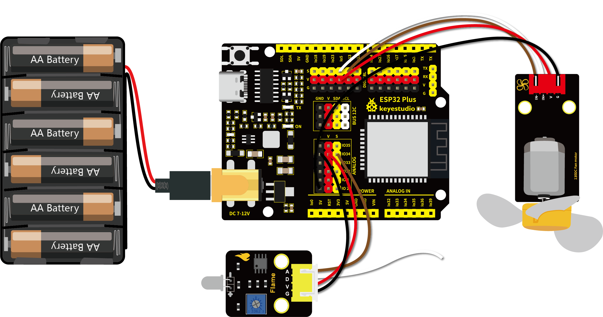

   img

**注意：130电机模块的GND线一定要接到图示位置，电池盒也必须接上，否则容易造成瞬时电流过大。**

1.4 实验代码

本项目中使用的代码保存在文件夹“\*\*:raw-latex:`\程序代码`:raw-latex:`\Arduino`\_代码\ **”中，我们可以在此路径下打开代码文件’’**\ Fire-fighting_robot.ino*\*“。

.. code:: cpp

   /*  
    * 名称   : Fire-fighting robot
    * 功能   : 火焰传感器控制130风扇模块
    * 作者   : http://www.keyes-robot.com/ 
   */
   int item = 0;

   void setup()
   {
     Serial.begin(115200);
     pinMode(5, OUTPUT); //INA对应IN+，将GPIO5设置为输出模式
     pinMode(13, OUTPUT);//INB对应IN-，将GPIO13置为输出模式
   }

   void loop() 
   {
     item = analogRead(34);//将火焰传感器连接到GPIO34上，将模拟值读取到Item
     Serial.print(item); //串口显示模拟值
     if (item < 3000) 
     {//3000以下
       Serial.println("\t Put out a fire");
       delay(100);
       digitalWrite(5, LOW);//打开电风扇
       digitalWrite(13, HIGH);
     } 
     else 
     {//否则，关闭风扇
       Serial.println("\t No flame detected");
       delay(100);
       digitalWrite(5, LOW);
       digitalWrite(13, LOW);
     } 
   }

1.5 代码说明

在代码中我们设置了阈值为3000（item <
3000），阈值可以根据实际情况更改。当火焰传感器检测到ADC值低于这个阈值时，风扇将自动开启；否则关闭。

1.6 实验结果

由于风扇在转动时，所需的电流比其他传感器要大，会引起电路中电压电流波动。特别是风扇进行正反转时，电压电流波动过大，ESP32开发板的电压电流过低，会导致复位。

代码上传成功后，打开串口监视器，设置波特率为\ **115200**\ 。

串口监视器上打印出火焰的ADC值，当ADC值低于3000时打开风扇灭火，串口监视器打印出“\ **Put
out a fire**\ ”；当ADC值高于3000时关闭风扇，串口监视器打印出“\ **No
flame detected**\ ”。这个ADC阈值可以根据实际情况设置。

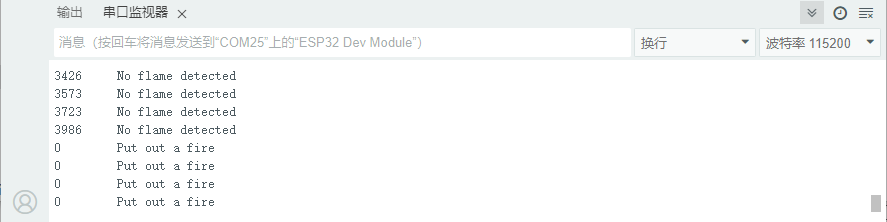

   img

项目四十九 旋转编码器控制RGB
~~~~~~~~~~~~~~~~~~~~~~~~~~~~

1.1 项目介绍

在第三十三课的实验中我们学习了使用旋转编码器计数。在这一实验课程中我们将旋转编码器模块和共阴RGB模块组合实验，通过旋转编码器计数的结果，控制RGB模块上LED显示不同的颜色。

1.2 实验组件

+------------------------+------------------------+--------------------+
| |img|                  | |image176|             | |image177|         |
+========================+========================+====================+
| ESP32 Plus主板 x1      | Keyes 旋转编码器模块   | Keyes 共阴RGB模块  |
|                        | x1                     | x1                 |
+------------------------+------------------------+--------------------+
| |image178|             | |image179|             | |image180|         |
+------------------------+------------------------+--------------------+
| XH2.54-5P              | XH2.54-4P              | USB线 x1           |
| 转杜邦线母单线 x1      | 转杜邦线母单线 x1      |                    |
+------------------------+------------------------+--------------------+

1.3 模块接线图

.. figure:: ./media/491301.png
   :alt: img

   img

1.4 实验代码

本项目中使用的代码保存在文件夹“\*\*:raw-latex:`\程序代码`:raw-latex:`\Arduino`\_代码\ **”中，我们可以在此路径下打开代码文件’’**\ Encoder_control_RGB.ino*\*“。

.. code:: cpp

   /*  
    * 名称   : Encoder control RGB
    * 功能   : 旋转编码器控制RGB来呈现不同的效果
    * 作者   : http://www.keyes-robot.com/ 
   */
   //旋转编码器接口
   int Encoder_DT  = 27;
   int Encoder_CLK  = 14;
   int Encoder_Switch = 16;

   int Previous_Output;
   int Encoder_Count;

   // RGB引脚定义
   #define RED_PIN   32
   #define GREEN_PIN 4
   #define BLUE_PIN  2
   int red, green, blue;

   int val;
   void setup() {
     Serial.begin(115200);

     //引脚模式声明
     pinMode (Encoder_DT, INPUT);
     pinMode (Encoder_CLK, INPUT);
     pinMode (Encoder_Switch, INPUT);
     pinMode (RED_PIN, OUTPUT);
     pinMode (GREEN_PIN, OUTUT);
     pinMode (BLUE_PIN, OUTUT);

     Previous_Output = digitalRead(Encoder_DT); //读取输出DT的初始值
   }

   void loop() 
   {
     if (digitalRead(Encoder_DT) != Previous_Output)
     {
       if (digitalRead(Encoder_CLK) != Previous_Output)
       {
         Encoder_Count ++;
         val = Encoder_Count % 3;
         Serial.printf("%d\t%d\n",Encoder_Count,val);
       }
       else
       {
         Encoder_Count--;
         val = Encoder_Count % 3;
         Serial.printf("%d\t%d\n",Encoder_Count,val);
       }
       delay(100);
     }

     Previous_Output = digitalRead(Encoder_DT);

     if (digitalRead(Encoder_Switch) == 0)
     {
       delay(5);
       if (digitalRead(Encoder_Switch) == 0) {
         Serial.println("Switch pressed");
         while (digitalRead(Encoder_Switch) == 0);
       }
     }
     if (val == 0) 
     {
       setColor(255, 0, 0); //红色
     } 
     else if (val == 1) 
     {
       setColor(0, 255, 0); //绿色
     } 
     else 
     {
       setColor(0, 0, 255); //蓝色
     }
   }

   void setColor(int red, int green, int blue)
   {
     analogWrite(RED_PIN,red);
     analogWrite(GREEN_PIN,green);
     analogWrite(BLUE_PIN,blue);
   }

1.5 代码说明

+--------------------------+--------------------------------------------------------------------+
| 代码                     | 说明                                                               |
+==========================+====================================================================+
| ous_Output =             | 读取输出DT的初始值。                                               |
| digitalRead(Encoder_DT)  |                                                                    |
+--------------------------+--------------------------------------------------------------------+
| ledcSetup(chns[i], 1000, | 设置pwm通道，1KHz,8bit。                                           |
| 8)                       |                                                                    |
+--------------------------+--------------------------------------------------------------------+
| al = Encoder_Count % 3   | %是模除运算符。代码中模除的结果是旋转编码器计数的值与3相除的余数。 |
+--------------------------+--------------------------------------------------------------------+

1.6 实验结果

代码上传成功后，打开串口监视器，设置波特率为\ **115200**\ 。

任意方向旋转编码器，串口监视器打印出对应余数；RGB模块上的LED显示余数对应的颜色：余数0显示红色、余数1显示绿色、余数2显示蓝色。按下旋转编码器，RGB模块上LED保持当前颜色不变。

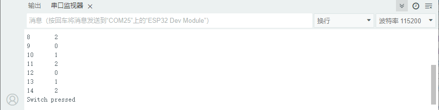

   491501

项目五十 电位器调节灯光亮度
~~~~~~~~~~~~~~~~~~~~~~~~~~~

1.1 项目介绍

从前面的课程实验中我们学习了设计呼吸灯和按键控制LED灯。在这一实验课程中我们尝试将呼吸灯和按键控制LED灯这两个实验现象组合起来，用可调电位器代替按键，实现利用旋转可调电位器读取到的模拟值控制紫色LED亮度的效果。可调电位器模拟值的范围是0
~ 4095；LED的亮度由PWM值控制，范围为0 ~ 255。

1.2 实验组件

+-------------+------------------+-------------+----------------+------------+
| |img|       | |image181|       | |image182|  | |image183|     | |image184| |
+=============+==================+=============+================+============+
| ESP32       | Keyes            | Keyes       | XH2.54-3P      | USB线 x1   |
| Plus主板 x1 | 旋转电位器传感器 | 紫色LED模块 | 转杜邦线母单线 |            |
|             | x1               | x1          | x2             |            |
+-------------+------------------+-------------+----------------+------------+

1.3 模块接线图

.. figure:: ./media/501301.png
   :alt: img

   img

1.4 实验代码

本项目中使用的代码保存在文件夹“\*\*:raw-latex:`\程序代码`:raw-latex:`\Arduino`\_代码\ **”中，我们可以在此路径下打开代码文件’’**\ adjust_the_light.ino*\*“。

.. code:: cpp

   /*  
    * 名称   : adjust the light
    * 功能   : 通过电位器控制LED的亮度
    * 作者   : http://www.keyes-robot.com/ 
   */
   #define POT_PIN 34    // 电位器连接GPIO34 (ADC1_CH6)
   #define LED_PIN 5     // LED连接GPIO5（支持PWM的引脚）

   void setup() {
     Serial.begin(115200);
     pinMode(LED_PIN, OUTPUT);
     analogReadResolution(12);  // 设置ADC为12位精度（0-4095）
   }

   void loop() {
     // 1. 读取电位器值（12位ADC，0-4095）
     int potValue = analogRead(POT_PIN);
     
     // 2. 映射为LED的PWM占空比（8位：0-255）
     int pwmDuty = map(potValue, 0, 4095, 0, 255);
     
     // 3. 手动生成PWM信号控制LED
     manualPWM(LED_PIN, pwmDuty, 1000);  // 频率约1kHz
     
     // 4. 串口打印调试信息
     Serial.printf("Pot: %4d | PWM Duty: %3d\n", potValue, pwmDuty);
     delay(20);
   }

   // 手动PWM生成函数（不使用ledc）
   void manualPWM(int pin, int duty, int freqHz) {
     int periodMicros = 1000000 / freqHz;          // 计算周期（微秒）
     int onTime = periodMicros * duty / 255;       // 计算高电平时间
     int offTime = periodMicros - onTime;          // 计算低电平时间
     
     digitalWrite(pin, HIGH);
     delayMicroseconds(onTime);
     digitalWrite(pin, LOW);
     delayMicroseconds(offTime);
   }

1.5 代码说明

.. code:: cpp

   void loop() 
   {
     int potValue = analogRead(POT_PIN);       // 读取电位器值（0-4095）
     int pwmDuty = map(potValue, 0, 4095, 0, 255);  // 映射为8位PWM值
     manualPWM(LED_PIN, pwmDuty, 1000);       // 生成1kHz PWM信号
     Serial.printf("Pot: %d, Duty: %d\n", potValue, pwmDuty); // 调试输出
     delay(20);                               // 降低串口刷新率
   }

- **信号流**\ ： ``电位器旋转`` → ``ADC值变化`` → ``映射为PWM占空比`` →
  ``LED亮度变化``

.. code:: cpp

   void manualPWM(int pin, int duty, int freqHz) 
   {
     int periodMicros = 1000000 / freqHz;     // 计算周期（μs）
     int onTime = periodMicros * duty / 255;  // 高电平时间
     int offTime = periodMicros - onTime;     // 低电平时间
     
     digitalWrite(pin, HIGH);
     delayMicroseconds(onTime);               // 保持高电平
     digitalWrite(pin, LOW);
     delayMicroseconds(offTime);              // 保持低电平
   }

**PWM参数计算**\ ：

- 周期 T=1freqHzT=freqHz1 （如1kHz → 1000μs）
- 高电平时间 Ton=T×duty255Ton=T×255duty
- 低电平时间 Toff=T−TonToff=T−Ton

1.6 实验结果

代码上传成功后，旋转电位器，可以调节紫色LED的亮度。

.. figure:: ./media/501501.png
   :alt: img

   img

.. figure:: ./media/501502.png
   :alt: img

   img

项目五十一 模拟智能窗户
~~~~~~~~~~~~~~~~~~~~~~~

1.1 项目介绍

生活中能看到各种各样的智能产品，例如智能窗帘、智能窗户、智能电视、智能灯光等等。这一课我们来学习做一个智能窗帘，利用水滴水蒸气传感器模块检测雨水，然后通过设置舵机的角度来达到关窗和开窗的效果。

当然，这只是我们模拟的一个场景，主要用于加深我们的印象，达到对模块学以致用的效果。现实生活中，智能窗户并不是使用舵机来开关的。

1.2 实验组件

+-------------+-------------+---------------+----------------+------------+
| |img|       | |image185|  | |image186|    | |image187|     | |image188| |
+=============+=============+===============+================+============+
| ESP32       | Keyes       | 9G            | XH2.54-3P      | USB线 x1   |
| Plus主板 x1 | 水滴传感器  | 180度数字舵机 | 转杜邦线母单线 |            |
|             | x1          | x1            | x1             |            |
+-------------+-------------+---------------+----------------+------------+

1.3 模块接线图

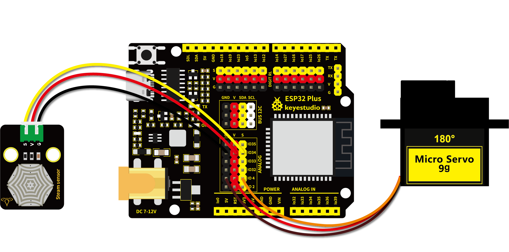

   img

1.4 实验代码

本项目中使用的代码保存在文件夹“\*\*:raw-latex:`\程序代码`:raw-latex:`\Arduino`\_代码\ **”中，我们可以在此路径下打开代码文件’’**\ Smart_window.ino*\*“。

.. code:: cpp

   /*  
    * 名称   : smart window
    * 功能   : 水滴传感器控制舵机转动
    * 作者   : http://www.keyes-robot.com/ 
   */
   #include <ESP32Servo.h> //导入舵机库文件
   int adcVal = 0;         //保存液滴传感器输出的ADC值的变量
   int servoPin = 4;       // 定义伺服引脚
   Servo myservo;          //定义舵机类的实例
   #define PIN_ADC    34   //水滴传感器的引脚

   void setup()
   {
     Serial.begin(115200);
     pinMode(PIN_ADC, INPUT);
     myservo.setPeriodHertz(50);           //标准50赫兹伺服
     myservo.attach(servoPin, 500, 2500);  // 将servoPin上的伺服附加到伺服对象上
   }

   void loop()
   {
     adcVal = analogRead(PIN_ADC); //液滴传感器连接到模拟端口GP34
     Serial.println(adcVal);
     if (adcVal > 2000) 
     { //模拟值大于2000
       myservo.write(0);  //关上窗户
       delay(500); //给舵机转向的时间
     } 
     else 
     { // 没有下雨
       myservo.write(180); //打开窗户
       delay(500); //延迟500毫秒
     }
   }

1.5 代码说明

此课程代码与第四十八课代码类似，这里就不多做介绍了。

1.6 实验结果

代码上传成功后，当水滴传感器检测到一定水量，舵机转动达到关窗的效果。否则舵机转动到另一个角度，达到开窗的效果。

项目五十二 声控灯
~~~~~~~~~~~~~~~~~

1.1 项目介绍

如今智能家居发展迅速，你使用过智能家居当中的智能声控灯吗？当我们跺跺脚或者拍拍手时，智能声控灯自动亮起；当没有声音时，智能声控灯处于熄灭状态。智能声控灯上安装有声音探测传感器，这些传感器将外界声音的大小，转换成对应数值。智能声控灯设置一个临界点，当声音转换后对应的数值超过该临界点时，灯光亮起一段时间。

在这一实验课程中，我们将声音传感器和紫色LED模块组合实验，学习制作一个最简单的智能声控灯。

1.2 实验组件

+-------------+-------------+-------------+----------------+------------+
| |img|       | |image189|  | |image190|  | |image191|     | |image192| |
+=============+=============+=============+================+============+
| ESP32       | Keyes       | Keyes       | XH2.54-3P      | USB线 x1   |
| Plus主板 x1 | 声音传感器  | 紫色LED模块 | 转杜邦线母单线 |            |
|             | x1          | x1          | x2             |            |
+-------------+-------------+-------------+----------------+------------+

1.3 模块接线图

|image193|

1.4 实验代码

本项目中使用的代码保存在文件夹“\*\*:raw-latex:`\程序代码`:raw-latex:`\Arduino`\_代码\ **”中，我们可以在此路径下打开代码文件’’**\ sound-controlled_lights.ino*\*“。

.. code:: cpp

   /*  
    * 名称   : sound-controlled lights
    * 功能   : 声音传感器控制LED开关
    * 作者   : http://www.keyes-robot.com/ 
   */
   int ledPin = 5;    //LED连接到GPIO5
   int microPin = 34; //声音传感器连接到GPIO34

   void setup() 
   {
     Serial.begin(115200);
     pinMode(ledPin, OUTPUT); //LED为输出模式
   }

   void loop() 
   {
     int val = analogRead(microPin); //读取模拟值
     Serial.print(val); // 串口打印
     if(val > 400)
     { //超过阈值
       digitalWrite(ledPin, HIGH); //LED亮3s，并打印相应信息
       Serial.println("  led on");
       delay(3000);
     }
     else
     { //否则
       digitalWrite(ledPin, LOW); //关闭LED并打印相应信息
       Serial.println("  led off");
     }
     delay(100);
   }

1.5 代码说明

============================== ==================
代码                           说明
============================== ==================
int val = analogRead(microPin) 读取模拟值。
Serial.print(val)              串口打印出模拟值。
============================== ==================

1.6 实验结果

代码上传成功后，打开串口监视器，设置波特率为\ **115200**\ 。

串口监视器打印出声音传感器接收到的声音对应的ADC值，接收到的声音增大时ADC值也增大，当ADC值大于400时，LED模块上LED亮起3秒，然后熄灭。

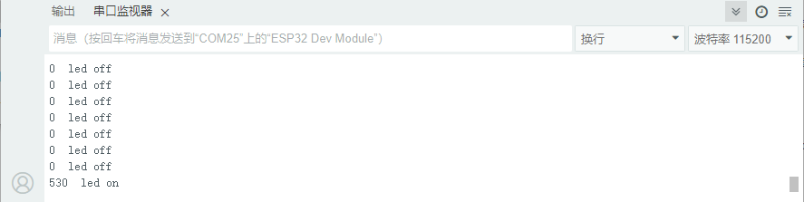

   521501

项目五十三 火焰报警
~~~~~~~~~~~~~~~~~~~

1.1 项目介绍

生活中，火灾的危害是相当大的。这一课我们来学习制作一个火灾报警系统，它虽然简单，但却是非常具有意义的。原理很简单，利用火焰传感器检测，检测的结果控制一个有源蜂鸣器响起。

1.2 实验组件

+------------------------+------------------------+--------------------+
| |img|                  | |image194|             | |image195|         |
+========================+========================+====================+
| ESP32 Plus主板 x1      | Keyes 有源蜂鸣器模块   | Keyes 火焰传感器   |
|                        | x1                     | x1                 |
+------------------------+------------------------+--------------------+
| |image196|             | |image197|             | |image198|         |
+------------------------+------------------------+--------------------+
| XH2.54-3P              | XH2.54-4P              | USB线 x1           |
| 转杜邦线母单线 x1      | 转杜邦线母单线 x1      |                    |
+------------------------+------------------------+--------------------+

1.3 模块接线图

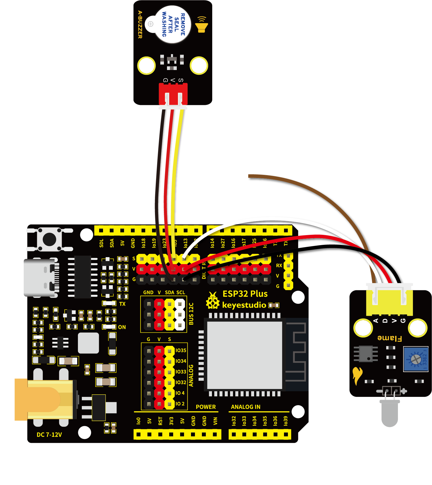

   img

1.4 实验代码

本项目中使用的代码保存在文件夹“\*\*:raw-latex:`\程序代码`:raw-latex:`\Arduino`\_代码\ **”中，我们可以在此路径下打开代码文件’’**\ Flame_alarm.ino*\*“。

.. code:: cpp

   /*  
    * 名称   : Flame Alarm
    * 功能   : 通过火焰传感器控制蜂鸣器
    * 作者   : http://www.keyes-robot.com/ 
   */
   int item = 0;

   void setup() 
   {
     Serial.begin(115200);
     pinMode(13, INPUT);  //火焰传感器数字引脚连接到GPIO13
     pinMode(5, OUTPUT);  //蜂鸣器引脚连接GPIO5
   }

   void loop() 
   {
     item = digitalRead(13); //读取火焰传感器的数字电平输出
     Serial.println(item);   //换行打印电平信号
     if (item == 0) 
     { //火焰探测
       digitalWrite(5, HIGH); //打开蜂鸣器
     } 
     else 
     { //否则，请关闭蜂鸣器
       digitalWrite(5, LOW);
     }
     delay(100); //延迟100毫秒
   }

1.5 代码说明

此课程代码与第四十八课代码类似，这里就不多做介绍了。

1.6 实验结果

代码上传成功后，火焰传感器上的红色LED2点亮。旋转火焰传感器上的电位器，微调使传感器上红色LED1灯介于亮与不亮之间的\ **不亮**\ 状态。

   img

当火焰传感器检测到火焰时，有源蜂鸣器响起，否则有源蜂鸣器不响。

项目五十四 烟雾报警器
~~~~~~~~~~~~~~~~~~~~~

1.1 项目介绍

在前面课程中，我们学习了如何使用有源蜂鸣器模块、学习了如何使用MQ-2
烟雾传感器检测可燃气体、还学会了如何控制四位数码管显示数字或字符。这一课程，我们尝试着将这三个实验结合在一起，制作一个烟雾报警器。制作思路是通过烟雾传感器测试出可燃气体的浓度，然后利用检测结果控制有源蜂鸣器报警、四位数码管显示检测到的值

1.2 实验组件

+------------------+------------------+----------------+----------------+
| |img|            | |image199|       | |image200|     | |image201|     |
+==================+==================+================+================+
| ESP32 Plus主板   | Keyes            | Keyes          | Keyes          |
| x1               | 有源蜂鸣器模块   | 模拟气体传感器 | 四位数码管模块 |
|                  | x1               | x1             | x1             |
+------------------+------------------+----------------+----------------+
| |image202|       | |image203|       | |image204|     |                |
+------------------+------------------+----------------+----------------+
| XH2.54-3P        | XH2.54-4P        | USB线 x1       |                |
| 转杜邦线母单线   | 转杜邦线母单线   |                |                |
| x1               | x2               |                |                |
+------------------+------------------+----------------+----------------+

1.3 模块接线图

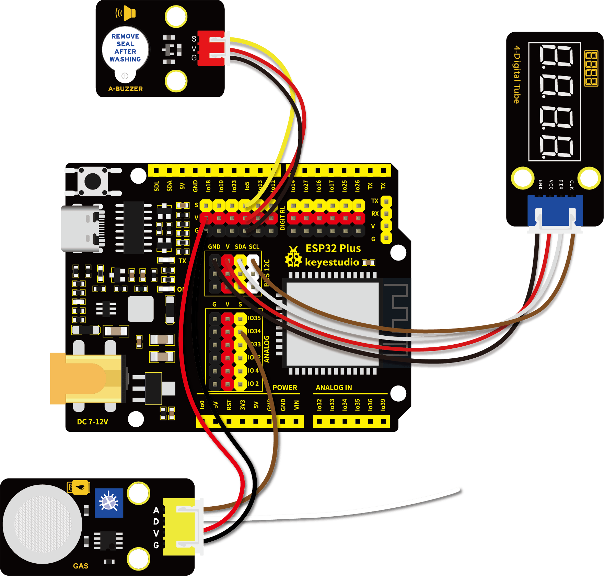

   541301

1.4 实验代码

本项目中使用的代码保存在文件夹“\*\*:raw-latex:`\程序代码`:raw-latex:`\Arduino`\_代码\ **”中，我们可以在此路径下打开代码文件’’**\ smoke_alarm.ino*\*“。

.. code:: cpp

   /*  
    * 名称   : smoke alarm
    * 功能   : MQ2控制一个蜂鸣器和一个四位数模拟烟雾测试仪
    * 作者   : http://www.keyes-robot.com/ 
   */
   #include "TM1650.h" //导入TM1650库文件
   int adcVal = 0; 
   //接口为GPIO21和GPIO22
   #define DIO 21
   #define CLK 22
   TM1650 DigitalTube(CLK,DIO);

   void setup() {
     DigitalTube.setBrightness();  //设置亮度，0- 7，默认值:2
     DigitalTube.displayOnOFF();   //显示打开或关闭，0=显示关闭，1=显示打开，默认值:1
     for(char b=1;b<5;b++){
       DigitalTube.clearBit(b);    //DigitalTube.clearBit(0 to 3); 清空位显示
     }
     // DigitalTube.displayDot(1,true); //Bit0 显示点。在displayBit()之前使用。
     DigitalTube.displayBit(1,0);    //DigitalTube.Display (,);位= 0 - 3号= 0 - 9
     pinMode(5, OUTPUT);//蜂鸣器连接GPIO5
   }

   void loop() 
   {
     adcVal = analogRead(34); //读取MQ2的ADC值
     displayFloatNum(adcVal);;//四位数管显示adcVal值
     delay(100);//延迟100毫秒
     if (adcVal > 3000) 
     {//ADC值大于3000
       digitalWrite(5, HIGH);// 蜂鸣报警器
     } 
     else 
     {//否则
       digitalWrite(5, LOW); //关掉蜂鸣器
     }
     delay(100);//延迟100毫秒
   }

   void displayFloatNum(float adcVal)
   {
     if(adcVal > 9999)
       return;
     int dat = adcVal*10;
      //DigitalTube.displayDot(2,true); //Bit0 显示点。在displayBit()之前使用。
     if(dat/10000 != 0)
     {
       DigitalTube.displayBit(0, dat%100000/10000);  
       DigitalTube.displayBit(1, dat%10000/1000);
       DigitalTube.displayBit(2, dat%1000/100);
       DigitalTube.displayBit(3, dat%100/10);
       return;
     }
     if(dat%10000/1000 != 0)
     {
       DigitalTube.clearBit(0); 
       DigitalTube.displayBit(1, dat%10000/1000); 
       DigitalTube.displayBit(2, dat%1000/100);
       DigitalTube.displayBit(3, dat%100/10);
       return;
     }
     if(dat%1000/100 != 0)
     {
     DigitalTube.clearBit(0); 
     DigitalTube.clearBit(1);
     DigitalTube.displayBit(2, dat%1000/100);
     DigitalTube.displayBit(3, dat%100/10);  
     return;
    }
     DigitalTube.clearBit(0); 
     DigitalTube.clearBit(1);
     DigitalTube.clearBit(2);
     DigitalTube.displayBit(3, dat%100/10);
   }

1.5 代码说明

定义一个整数变量adcVal，用于存储传感器检测到烟雾的ADC值，最大为4095。然后将这个ADC值显示在四位数码管中，再设置一个阈值（阈值为3000，可以根据实际情况重新更改），达到这个阈值时有源蜂鸣器响起。

1.6 实验结果

代码上传成功，当传感器检测到可燃气体浓度超标（ADC值大于3000）时，有源蜂鸣器模块发出警报，四位数码管显示浓度值。

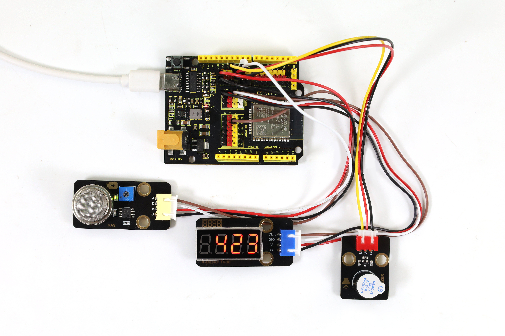

   541501

.. figure:: media/541502.png
   :alt: 541502

   541502

项目五十五 酒精报警器
~~~~~~~~~~~~~~~~~~~~~

1.1 项目介绍

在上一课程中，我们制作了烟雾报警器，这一课利用同样的原理，使用有源蜂鸣器模块，MQ-3
酒精传感器，四位数码管制作一个酒精报警器。通过酒精传感器测试出酒精浓度，然后利用浓度大小控制有源蜂鸣器发出警报、四位数码管显示浓度值。从而达到酒精检测仪的模拟效果。

1.2 实验组件

+------------------+------------------+---------------+----------------+
| |img|            | |image205|       | |image206|    | |image207|     |
+==================+==================+===============+================+
| ESP32 Plus主板   | Keyes            | Keyes         | Keyes          |
| x1               | 有源蜂鸣器模块   | 酒精传感器 x1 | 四位数码管模块 |
|                  | x1               |               | x1             |
+------------------+------------------+---------------+----------------+
| |image208|       | |image209|       | |image210|    |                |
+------------------+------------------+---------------+----------------+
| XH2.54-3P        | XH2.54-4P        | USB线 x1      |                |
| 转杜邦线母单线   | 转杜邦线母单线   |               |                |
| x1               | x2               |               |                |
+------------------+------------------+---------------+----------------+

1.3 模块接线图

|image211|

1.4 实验代码

本项目中使用的代码保存在文件夹“\*\*:raw-latex:`\程序代码`:raw-latex:`\Arduino`\_代码\ **”中，我们可以在此路径下打开代码文件’’**\ smoke_alarm.ino*\*“。

.. code:: cpp

   /*  
    * 名称   : breathalyzer
    * 功能   : MQ3控制一个蜂鸣器和一个四位数码管来模拟酒精检测仪
    * 作者   : http://www.keyes-robot.com/ 
   */
   #include "TM1650.h" //导入TM1650库文件
   int adcVal = 0; 
   //接口为GPIO21和GPIO22
   #define DIO 21
   #define CLK 22
   TM1650 DigitalTube(CLK,DIO);

   void setup() 
   {
     Serial.begin(115200);
     DigitalTube.setBrightness();  //设置亮度，0- 7，默认值:2
     DigitalTube.displayOnOFF();   //显示打开或关闭; 0=关闭, 1=打开, default : 1
     for(char b=1;b<5;b++)
     {
       DigitalTube.clearBit(b);    //DigitalTube.clearBit(0 to 3); 清空位显示
     }
     // DigitalTube.displayDot(1,true); //Bit0显示点。在displayBit()之前使用。
     DigitalTube.displayBit(1,0);  //DigitalTube.Display(bit,number); 位= 0 - 3,号= 0 - 9
     pinMode(5, OUTPUT);//蜂鸣器连接GPIO5
   }

   void loop() 
   {
     adcVal = analogRead(34);//读取MQ3的ADC值
     displayFloatNum(adcVal);//四位数管显示adcVal值
     if (adcVal > 3000) 
     {//ADC值大于740
       digitalWrite(5, HIGH);// 蜂鸣报警器
     } 
     else
     {//否则
       digitalWrite(5, LOW); //关掉蜂鸣器
     }
     delay(100);//延迟100毫秒
   }

   void displayFloatNum(float adcVal)
   {
     if(adcVal > 9999)
       return;
     int dat = adcVal*10;
      //DigitalTube.displayDot(2,true); //Bit0 display dot. Use before displayBit().
     if(dat/10000 != 0)
     {
       DigitalTube.displayBit(0, dat%100000/10000);  
       DigitalTube.displayBit(1, dat%10000/1000);
       DigitalTube.displayBit(2, dat%1000/100);
       DigitalTube.displayBit(3, dat%100/10);
       return;
     }
     if(dat%10000/1000 != 0)
     {
       DigitalTube.clearBit(0); 
       DigitalTube.displayBit(1, dat%10000/1000); 
       DigitalTube.displayBit(2, dat%1000/100);
       DigitalTube.displayBit(3, dat%100/10);
       return;
     }
     if(dat%1000/100 != 0)
     {
       DigitalTube.clearBit(0); 
       DigitalTube.clearBit(1);
       DigitalTube.displayBit(2, dat%1000/100);
       DigitalTube.displayBit(3, dat%100/10);  
       return;
     }
     DigitalTube.clearBit(0); 
     DigitalTube.clearBit(1);
     DigitalTube.clearBit(2);
     DigitalTube.displayBit(3, dat%100/10);
   }

1.5 代码说明

此课程代码与第五十四课代码类似，这里就不多做介绍了。

1.6 实验结果

代码上传成功后，当传感器检测到可燃气体浓度超标（ADC值大于3000，阈值3000可调，可参考第二十八课的实验结果设置）时，有源蜂鸣器模块发出警报，四位数码管显示浓度值。

.. figure:: media/551501.png
   :alt: 551501

   551501

项目五十六 超声波雷达
~~~~~~~~~~~~~~~~~~~~~

1.1 项目介绍

蝙蝠飞行与获取猎物是通过回声定位的。回声定位：某些动物能通过口腔或鼻腔把从喉部产生的超声波发射出去，利用折回的声音来定向，这种空间定向的方法称为回声定位。科学家们从蝙蝠身上得到的启示发明了雷达，即雷达的天线相当于蝙蝠的嘴,而天线发出的无线电波就相当于蝙蝠的超声波,雷达接收电波的荧光屏就相当于蝙蝠的耳朵。

这一课我们就来学习制作一个简易雷达。将HC-SR04 超声波传感器、8002b功放
喇叭模块、共阴RGB模块和TM1650四位数码管模块组合实验，利用距离大小控制功放喇叭模块模块响起对应频率的声音、RGB亮起对应颜色，然后把这个距离显示在四位数码管上。这样就搭建好了一个简易的超声波雷达系统。

1.2 实验组件

+----------------------+----------------------+-----------------------+
| |img|                | |image212|           | |image213|            |
+======================+======================+=======================+
| ESP32 Plus主板 x1    | HC-SR04 超声波传感器 | Keyes 超声波转接模块  |
|                      | x1                   | x1                    |
+----------------------+----------------------+-----------------------+
| |image214|           | |image215|           | |image216|            |
+----------------------+----------------------+-----------------------+
| Keyes 8002b功放      | Keyes 共阴RGB模块 x1 | Keyes                 |
| 喇叭模块 x1          |                      | TM1650四位数码管模块  |
|                      |                      | x1                    |
+----------------------+----------------------+-----------------------+
| |image217|           | |image218|           | |image219|            |
+----------------------+----------------------+-----------------------+
| XH2.54-3P            | XH2.54-4P            | USB线 x1              |
| 转杜邦线母单线 x1    | 转杜邦线母单线 x3    |                       |
+----------------------+----------------------+-----------------------+

1.3 模块接线图

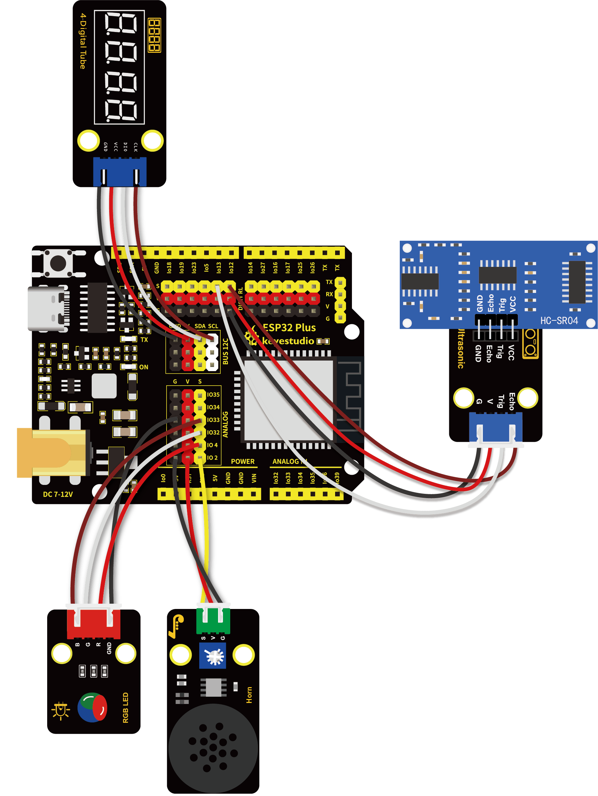

   img

1.4 实验代码

本项目中使用的代码保存在文件夹“\ **/home/pi/代码**\ ”中，我们可以在此路径下打开代码文件’’\ **Ultrasonic_radar.ino**\ ”。

.. code:: cpp

   /*  
    * 名称   : Ultrasonic radar
    * 功能   : 超声波控制四位数管，蜂鸣器和RGB灯模拟超声波雷达
    * 作者   : http://www.keyes-robot.com/ 
   */
   #include "TM1650.h" //导入TM1650库文件
   //接口为GPIO21和GPIO22
   #define DIO 21
   #define CLK 22
   TM1650 DigitalTube(CLK,DIO);

   #define AUDIO_PIN   2    //定义喇叭引脚为GPIO2

   int TrigPin = 13; //设置Trig引脚为GPIO13
   int EchoPin = 12; //设置Echo引脚为GPIO12
   int distance;     //超声波测量距离

   // RGB引脚定义
   #define RED_PIN   4
   #define GREEN_PIN 32
   #define BLUE_PIN  33

   float checkdistance() 
   { //得到的距离
     // 事先给一个短的低电平，以确保一个干净的高脉冲;
     digitalWrite(TrigPin, LOW);
     delayMicroseconds(2);
     // 传感器由10微秒或更长时间的高脉冲触发
     digitalWrite(TrigPin, HIGH);
     delayMicroseconds(10);
     digitalWrite(TrigPin, LOW);
     // 从传感器读取信号:一个高电平脉冲
     // 它的持续时间是从发送ping命令到从对象接收回显的时间(以微秒为单位)
     float distance = pulseIn(EchoPin, HIGH) / 58.00;  //转换成距离
     delay(300);
     return distance;
   }

   void setup() 
   {
     pinMode(AUDIO_PIN, OUTPUT);  // 设置喇叭为输出模式
     DigitalTube.setBrightness();  //设置亮度，0- 7，默认值:2
     DigitalTube.displayOnOFF();   //显示打开或关闭，0=显示关闭，1=显示打开，默认值:1
     for(char b=1;b<5;b++){
       DigitalTube.clearBit(b);    //DigitalTube.clearBit(0 to 3); 清空位显示
     }
     
     DigitalTube.displayBit(1,0);  //DigitalTube.Display(bit,number); bit= 0 - 3，number= 0 - 9
     pinMode(TrigPin, OUTPUT);     //设置Trig引脚作为输出
     pinMode(EchoPin, INPUT);      //设置Echo引脚作为输入
   }

   void loop() 
   {
     distance = checkdistance();//超声波测距
     displayFloatNum(distance); //数码管显示距离
     if (distance <= 10) 
     {  
       setColor(255, 0, 0); //红色 
       playTone(1000, 1000);  // 频率1kHz，持续1秒
     } 
     else if (distance > 10 && distance <= 20) 
     {
       setColor(0, 255, 0); //绿色
     } 
     else 
     {
       setColor(0, 0, 255); //蓝色
     }
   }

   void displayFloatNum(float distance)
   {
     if(distance > 9999)
       return;
     int dat = distance*10;
     if(dat/10000 != 0)
     {
       DigitalTube.displayBit(0, dat%100000/10000);  
       DigitalTube.displayBit(1, dat%10000/1000);
       DigitalTube.displayBit(2, dat%1000/100);
       DigitalTube.displayBit(3, dat%100/10);
       return;
     }
     if(dat%10000/1000 != 0)
     {
       DigitalTube.clearBit(0); 
       DigitalTube.displayBit(1, dat%10000/1000); 
       DigitalTube.displayBit(2, dat%1000/100);
       DigitalTube.displayBit(3, dat%100/10);
       return;
     }
     if(dat%1000/100 != 0)
     {
       DigitalTube.clearBit(0); 
       DigitalTube.clearBit(1);
       DigitalTube.displayBit(2, dat%1000/100);
       DigitalTube.displayBit(3, dat%100/10);  
       return;
     }
     DigitalTube.clearBit(0); 
     DigitalTube.clearBit(1);
     DigitalTube.clearBit(2);
     DigitalTube.displayBit(3, dat%100/10);
   }

   void setColor(int red, int green, int blue) 
   {
     analogWrite(RED_PIN,red);
     analogWrite(GREEN_PIN,green);
     analogWrite(BLUE_PIN,blue);
   }

   void playTone(int freq, int durationMs) 
   {
     long periodUs = 1000000 / freq;      // 计算周期（微秒）
     long halfPeriod = periodUs / 2;      // 半周期时间
     long startTime = millis();

     while (millis() - startTime < durationMs) 
     {
       digitalWrite(AUDIO_PIN, HIGH);
       delayMicroseconds(halfPeriod);     // 高电平半周期
       digitalWrite(AUDIO_PIN, LOW);
       delayMicroseconds(halfPeriod);     // 低电平半周期
     }
   }

1.5 代码说明

+-------------------+----------------------------------------------------------------+
| 代码              | 说明                                                           |
+===================+================================================================+
| pulseIn()         | 计算回波时间，转换为距离（\ ``距离cm = 回波时间μs / 58``\ ）。 |
+-------------------+----------------------------------------------------------------+
| checkdistance()   | 测距函数。                                                     |
+-------------------+----------------------------------------------------------------+
| displayFloatNum() | 数码管显示，将浮点距离×10转为整数处理。                        |
+-------------------+----------------------------------------------------------------+
| playTone()        | 蜂鸣器控制，手动生成PWM方波（1kHz），阻塞式发声（持续1秒）。   |
+-------------------+----------------------------------------------------------------+
| setColor()        | RGB控制，通过\ ``analogWrite()``\ 调节三色亮度（0-255）。      |
+-------------------+----------------------------------------------------------------+

1.6 实验结果

代码上传成功后，当超声波传感器检测到障碍物距离范围在10cm 以内时，RGB
LED灯亮红色，并将检测到障碍物的距离显示在四位数码管上。同时8002b功放
喇叭模块发出声响，起到提示的作用。

.. figure:: ./media/561501.png
   :alt: img

   img

当超声波传感器检测到障碍物距离范围在10cm ~ 20cm 以内时，RGB
LED灯亮绿色，并将检测到障碍物的距离显示在四位数码管上。

.. figure:: ./media/561502.png
   :alt: img

   img

当超声波传感器检测到障碍物距离范围在20cm 以外时，RGB
LED灯亮蓝色，并将检测到障碍物的距离显示在四位数码管上。

.. figure:: ./media/561503.png
   :alt: img

   img

项目五十七 红外遥控灯
~~~~~~~~~~~~~~~~~~~~~

1.1 项目介绍

在前面实验中，我们学会了点亮或熄灭LED、学会了利用PWM调节灯光的亮度、学会了使用红外接收模块，并将接收到的遥控器对应的键值打印出来。在这一实验课程中，我们将红外接收模块和紫色LED模块组合实验，实现用红外遥控器控制紫色LED的亮灭以及控制紫色LED显示不同亮度。

当红外接收模块接收到红外遥控器的按键值时，通过设置此按键值的输出PWM值实现设置不同LED亮度的效果，控制LED的亮灭也一样。

在这一实验课程中我们使用
“①“、”②“、”③”三个按键来控制紫色LED实现弱亮、正常亮、强亮三种不同亮度。如果想要使用
“OK”
键这一个按键来控制LED亮和灭的两种情况该如何实现呢？这一实验课程我们将学习使用一个新的基本数据类型
—— boolean，来实现同一个按键控制LED亮灭的效果。

**boolean 数据类型**\ ，变量存储为 8位（1 个字节）的数值形式，\ **只能是
True 或是 False**\ 。boolean 变量的值显示为 True 或 False（在使用 Print
的时候），或者 #TRUE# 或 #FALSE#（在使用 Write #
的时候）。使用关键字True 与 False 可将 boolean
变量赋值为这两个状态中的一个。

设置代码，按下“OK”键且满足某一条件，点亮LED；按下“OK”键且满足另一条件，熄灭LED。这个条件我们用
boolean 来实现是最简单方便的，因为 boolean 只有 True 或是 False
两种状态。我们只需要设置按下“OK”键的同时 flag 为
true，即可点亮LED；同理按下“OK”键的同时 flag 为 false，熄灭LED。

1.2 实验组件

+--------------------------+-----------------------+-------------------+
| |img|                    | |image220|            | |image221|        |
+==========================+=======================+===================+
| ESP32 Plus主板 x1        | Keyes 红外接收模块 x1 | Keyes 紫色LED模块 |
|                          |                       | x1                |
+--------------------------+-----------------------+-------------------+
| |image222|               | |image223|            | |image224|        |
+--------------------------+-----------------------+-------------------+
| Keyes 遥控器 x1          | XH2.54-3P             | USB线 x1          |
|                          | 转杜邦线母单线 x2     |                   |
+--------------------------+-----------------------+-------------------+

1.3 模块接线图

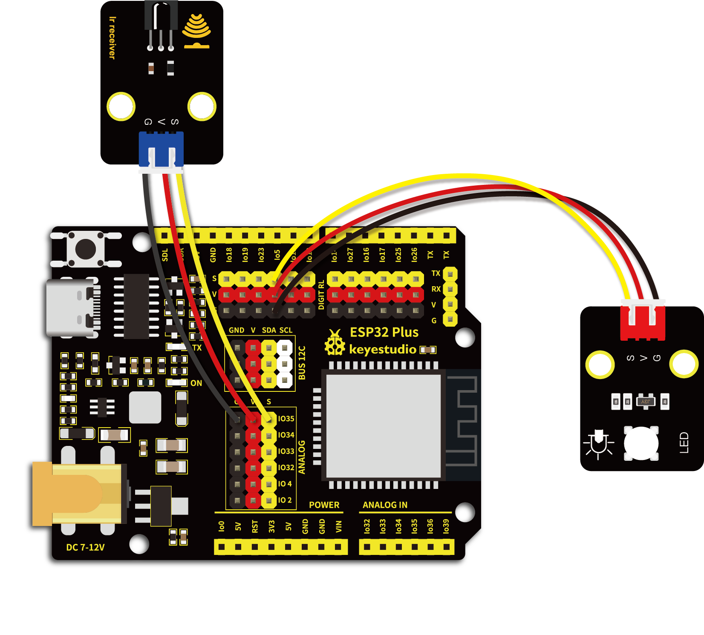

   img

1.4 实验代码

本项目中使用的代码保存在文件夹“\*\*:raw-latex:`\程序代码`:raw-latex:`\Arduino`\_代码\ **”中，我们可以在此路径下打开代码文件’’**\ IR_control_LED.ino*\*“。

.. code:: cpp

   /*  
    * 名称   : IR Control LED
    * 功能   : 红外遥控LED开关
    * 作者   : http://www.keyes-robot.com/ 
   */

   #include <IRremote.hpp>  // 引入 IRremote 库
   #define DECODE_NEC  // 只启用 NEC 协议
   const int IR_Pin = 35;  //红外接收模块数据引脚为IO35
   int led = 5;//LED连接到GPIO5
   boolean flag = true;  //LED标志位

   void setup() 
   {
     Serial.begin(115200);
     pinMode(led, OUTPUT);
     while (!Serial);  // 等待串口初始化完成
     Serial.println(F("Ready to receive NEC IR signals..."));
     IrReceiver.begin(IR_Pin, ENABLE_LED_FEEDBACK);  // 启动接收，使用引脚 IO35
   }

   void loop() 
   {
     if (IrReceiver.decode()) 
     {  // 检测是否接收到红外信号
       if (IrReceiver.decodedIRData.protocol != UNKNOWN) 
       {
         // 打印接收到的按键值，转换为十进制
         long IR_Value = IrReceiver.decodedIRData.command;
         Serial.print("IR Value:");
         Serial.print(IR_Value);  // 以十进制打印按键值
         delay(100);
         handleControl(IR_Value);      // 处理来自远程控制的命令
       }
       IrReceiver.resume();  // 准备接收下一个红外信号
     }
   }

   void handleControl(unsigned long value)
   {
     if (value == 64 && flag == true)
     { // 接收数字“OK” 
       analogWrite(led, 255); //打开LED
       delay(10);
       Serial.println("\tled on");
       flag = false;
     } 
     else if (value == 64 && flag == false)
     { // 接收数字“OK”
       analogWrite(led, 0); //关闭LED
       delay(10);
       Serial.println("\tled off"); 
       flag = true;
     }
     else if(value == 22)
     {
       analogWrite(led, 85);
       Serial.println("\tweak light");
       delay(10);
     } 
     else if(value == 25)
     {
       analogWrite(led, 170);
       delay(10);
       Serial.println("\tnormal light");
     } 
     else if(value == 13)
     {
       analogWrite(led, 255);
       delay(10);
       Serial.println("\tstrong light");
     }
   }

1.5 代码说明

+----------------+-----------------------------------------------------+
| 代码           | 说明                                                |
+================+=====================================================+
| boolean flag = | 设置一个变量 flag 为 boolean 数据类型，数值为       |
| true           | true。                                              |
+----------------+-----------------------------------------------------+
| flag = false   | boolean 数据类型的 flag 赋值为 false                |
|                | ，以便再次按下再次按下 “OK”键时满足熄灭LED的条件。  |
+----------------+-----------------------------------------------------+

1.6 实验结果

代码上传成功后，拔下USB线断电，按照接线图正确接好模块后再用USB线连接到计算机上电，打开串口监视器，设置波特率为\ **115200**\ 。

第一次按下红外遥控器上的 “\ **OK**\ ”
键，紫色LED被点亮，实现开灯的效果。串口监视器打印出按下的按键值和LED灯的亮灭情况：“\ **64
led on**\ ” 。

再次按下红外遥控器上的 “\ **OK**\ ”
键，紫色LED熄灭，实现关灯的效果。串口监视器打印出按下的按键值和LED灯的亮灭情况：“\ **64
led off**\ ” 。

按下红外遥控器上的 “\ **①**\ ”
键，紫色LED被设置为弱亮。串口监视器打印出按下的按键值和LED灯的亮灭情况：“\ **22
weak light**\ ” 。

按下红外遥控器上的 “\ **②**\ ”
键，紫色LED被设置为正常亮。串口监视器打印出按下的按键值和LED灯的亮灭情况：“\ **25
normal light**\ ” 。

按下红外遥控器上的 “\ **③**\ ”
键，紫色LED被设置为强亮。串口监视器打印出按下的按键值和LED灯的亮灭情况：“\ **13
strong light**\ ” 。

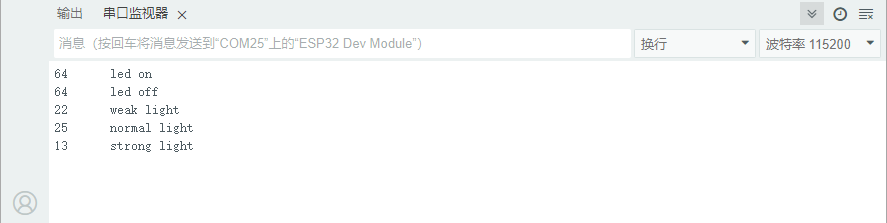

   571501

项目五十八 模拟温度散热装置
~~~~~~~~~~~~~~~~~~~~~~~~~~~

1.1 项目介绍

生活中，我们的电脑或者电路板芯片等器件会由于工作时间过长或者功耗过大的问题而发热严重，所以我们常常需要一个散热装置。

在前面的课程我们学习了如何使用温度传感器和电机模块，这一课我们学习把它们结合起来做成一个智能散热装置。当检测到环境温度高于某一个值时的时候，电机开启，从而达到降低环境温度、散热效果。再把此刻的温度值显示在四位数码管中。

1.2 实验组件

+--------------------+-----------------------+------------------------+
| |img|              | |image225|            | |image226|             |
+====================+=======================+========================+
| ESP32 Plus主板 x1  | Keyes 130电机模块 x1  | Keyes                  |
|                    |                       | TM1650四位数码管模块   |
|                    |                       | x1                     |
+--------------------+-----------------------+------------------------+
| |image227|         | |image228|            | |image229|             |
+--------------------+-----------------------+------------------------+
| Keyes              | XH2.54-3P             | XH2.54-4P              |
| 18B20温度传感器 x1 | 转杜邦线母单线 x1     | 转杜邦线母单线 x2      |
+--------------------+-----------------------+------------------------+
| |image230|         | |image231|            | |image232|             |
+--------------------+-----------------------+------------------------+
| USB线 x1           | 6节5号电池盒 x1       | 5号电池(自备) x6       |
+--------------------+-----------------------+------------------------+

1.3 模块接线图

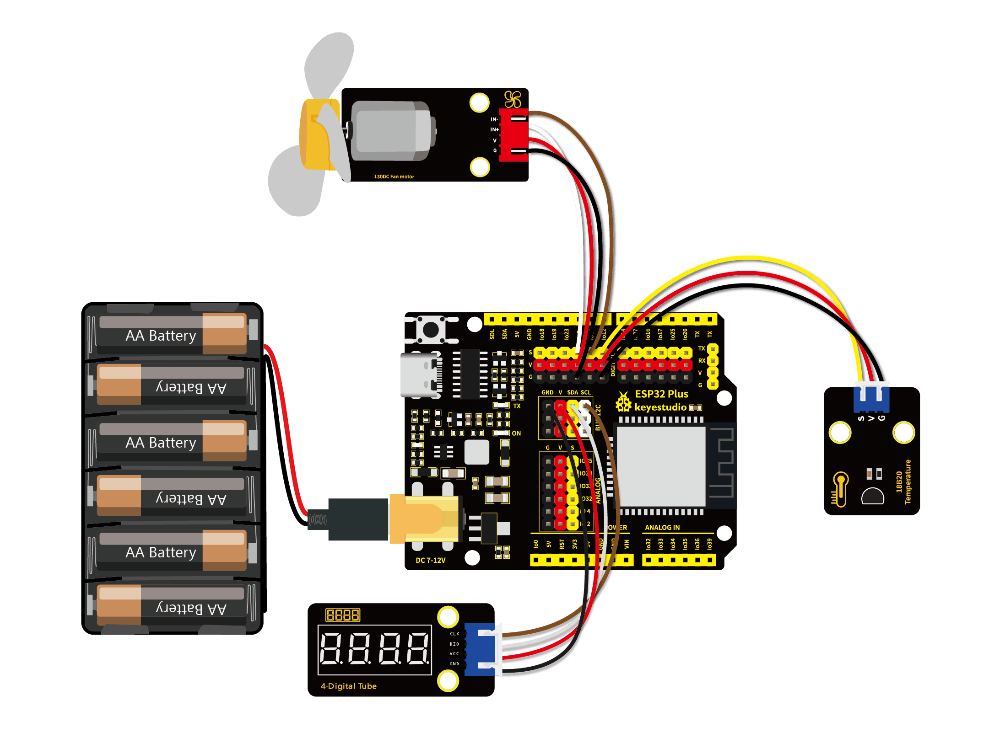

   img

1.4 实验代码

本项目中使用的代码保存在文件夹“\*\*:raw-latex:`\程序代码`:raw-latex:`\Arduino`\_代码\ **”中，我们可以在此路径下打开代码文件’’**\ heat_abstractor.ino*\*“。

.. code:: cpp

   /*  
    * 名称   : heat abstractor
    * 功能   : DS18B20控制一个四位数管和一个电机模拟散热装置
    * 作者   : http://www.keyes-robot.com/ 
   */
   #include <DS18B20.h>
   #include "TM1650.h" //导入TM1650库文件
   //两个端口分别为GP21和GP22
   #define DIO 21
   #define CLK 22
   TM1650 DigitalTube(CLK,DIO);

   //DS18B20引脚为12
   DS18B20 ds18b20(12);
   void setup()
   {
     Serial.begin(115200);
     DigitalTube.setBrightness();  //设置亮度，0- 7，默认值:2
     DigitalTube.displayOnOFF();   //显示打开或关闭，0=显示关闭，1=显示打开，默认值:1
     for(char b=1;b<5;b++)
     {
       DigitalTube.clearBit(b);    //DigitalTube.clearBit(0~3);清晰位显示
     }
     // DigitalTube.displayDot(1,true);//Bit0显示点。在displayBit()之前使用。
     DigitalTube.displayBit(1,0);  //DigitalTube.Display(bit,number); bit=0---3  number=0---9
     //电机连接到5 13
     pinMode(5, OUTPUT);
     pinMode(13, OUTPUT);
   }

   void loop() 
   {
     double temp = ds18b20.GetTemp();//读取温度
     temp *= 0.0625;//转换精度为0.0625/LSB
     Serial.println(temp);
     displayFloatNum(temp);//4位数码管显示温度值
     if (temp > 30) 
     {//当温度超过30℃时，打开风扇
       digitalWrite(5, LOW);
       digitalWrite(13, HIGH);
     } 
     else 
     {//否则，请关闭风扇
       digitalWrite(5, LOW);
       digitalWrite(13, LOW);
     }
     delay(100);
   }

   void displayFloatNum(float temp)
   {
     if(temp > 9999)
       return;
     int dat = temp*10;
      //DigitalTube.displayDot(2,true); //Bit0显示点  在displayBit()之前使用。
     if(dat/10000 != 0)
     {
       DigitalTube.displayBit(0, dat%100000/10000);  
       DigitalTube.displayBit(1, dat%10000/1000);
       DigitalTube.displayBit(2, dat%1000/100);
       DigitalTube.displayBit(3, dat%100/10);
       return;
     }
     if(dat%10000/1000 != 0)
     {
       DigitalTube.clearBit(0); 
       DigitalTube.displayBit(1, dat%10000/1000); 
       DigitalTube.displayBit(2, dat%1000/100);
       DigitalTube.displayBit(3, dat%100/10);
       return;
     }
     if(dat%1000/100 != 0)
     {
       DigitalTube.clearBit(0); 
       DigitalTube.clearBit(1);
       DigitalTube.displayBit(2, dat%1000/100);
       DigitalTube.displayBit(3, dat%100/10);  
       return;
     }
     DigitalTube.clearBit(0); 
     DigitalTube.clearBit(1);
     DigitalTube.clearBit(2);
     DigitalTube.displayBit(3, dat%100/10);
   }

1.5 代码说明

变量的设置与存储检测值，与前面我们学习的一样，也是通过设置一个温度的阈值（阈值30可以根据实际情况重新更改），超过这个阈值进行控制电机转动，四位数码管显示温度值。

1.6 实验结果

按照接线图正确接好模块后再用USB线连接到计算机，外接电池盒，上传代码。上传成功后可以在四位数码管模块上看到当前温度值，当温度超过代码中设定的30°C时，风扇转动，散热。

.. figure:: ./media/581501.png
   :alt: img

   img

项目五十九 智能门禁系统
~~~~~~~~~~~~~~~~~~~~~~~

1.1 项目介绍

生活中，很多门禁系统都是使用射频模块进行开锁的，既方便又安全。这一课，学习利用RFID522刷卡模块和舵机设置一个智能门禁系统。

原理很简单，使用RFID522刷卡模块感应，使用IC卡或者钥匙卡来开锁，舵机的作用即门禁锁。

1.2 实验组件

+----------------+----------------+-------------------+--------------+
| |img|          | |image233|     | |image234|        | |image235|   |
+================+================+===================+==============+
| ESP32 Plus主板 | Keyes          | 钥匙扣 x1         | USB线 x1     |
| x1             | RFID刷卡模块   |                   |              |
|                | x1             |                   |              |
+----------------+----------------+-------------------+--------------+
| |image236|     | |image237|     | |image238|        |              |
+----------------+----------------+-------------------+--------------+
| IC卡 x1        | 9G             | XH2.54-4P         |              |
|                | 180度数字舵机  | 转杜邦线母单线 x1 |              |
|                | x1             |                   |              |
+----------------+----------------+-------------------+--------------+

1.3 模块接线图

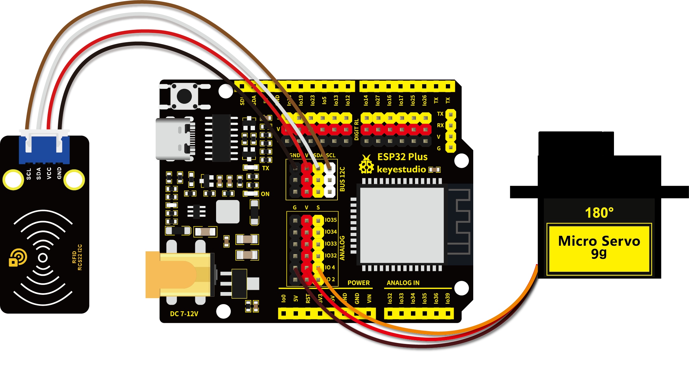

   img

1.4 实验代码

本项目中使用的代码保存在文件夹“\*\*:raw-latex:`\程序代码`:raw-latex:`\Arduino`\_代码\ **”中，我们可以在此路径下打开代码文件’’**\ Intelligent_access_control.ino*\*“。

**特别注意：对于不同的IC卡和钥匙扣，其读取的IC卡和钥匙扣的UID码值可能都不一样。在代码运行前，需要将你自己的IC卡和钥匙扣的UID码值替换程序代码中的UID码（UID码在第四十四课完成实验可以得知），替换位置如下图所示。**

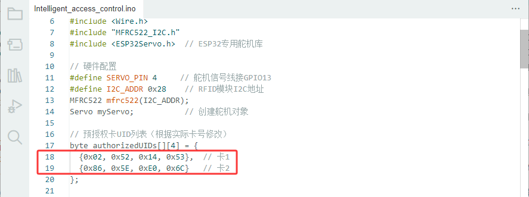

   591401

.. code:: cpp

   /* 
    * 名称   : Intelligent_access_control
    * 功能   : RFID控制舵机模拟开门
    * 作者   : http://www.keyes-robot.com/ 
   */
   #include <Wire.h>
   #include "MFRC522_I2C.h"
   #include <ESP32Servo.h>  // ESP32专用舵机库

   // 硬件配置
   #define SERVO_PIN 4     // 舵机信号线接GPIO13
   #define I2C_ADDR 0x28    // RFID模块I2C地址
   MFRC522 mfrc522(I2C_ADDR);
   Servo myServo;           // 创建舵机对象

   // 预授权卡UID列表（根据实际卡号修改）
   byte authorizedUIDs[][4] = 
   {
     {0x02, 0x52, 0x14, 0x53},  // 卡1
     {0x86, 0x5E, 0xE0, 0x6C}   // 卡2
   };

   void setup() 
   {
     Serial.begin(115200);
     
     // 初始化舵机
     myServo.attach(SERVO_PIN);
     myServo.write(0);      // 上电归零

     // 初始化RFID
     Wire.begin();
     mfrc522.PCD_Init();
     if (!checkRFIDConnection()) 
     {
       Serial.println("RFID initialization failed!");
       while(1); // 停止执行
     }
     Serial.println("Waiting for authorized card...");
   }

   void loop() 
   {
     // 检测RFID卡
     if (mfrc522.PICC_IsNewCardPresent() && mfrc522.PICC_ReadCardSerial()) 
     {
       // 验证UID
       if (checkAuthorization()) 
       {
         Serial.println("Access Granted!");
         activateServo();
       } 
       else 
       {
         Serial.println("Access Denied - Unauthorized card");
       }
       mfrc522.PICC_HaltA(); // 停止读卡
     }
     delay(100);
   }

   // 舵机控制函数
   void activateServo() 
   {
     myServo.write(180);    // 转到180度
     Serial.println("Open the door!");
     delay(2000);           // 保持2秒
     myServo.write(0);      // 返回0度
     Serial.println("Close the door!");
   }

   // 验证卡权限
   bool checkAuthorization() 
   {
     Serial.print("Scanned UID:");
     // 打印当前卡片UID
     for (byte i = 0; i < mfrc522.uid.size; i++) 
     {
       Serial.print(mfrc522.uid.uidByte[i] < 0x10 ? " 0" : " ");
       Serial.print(mfrc522.uid.uidByte[i], HEX);
     }
     Serial.println();
     
     // 检查是否在授权列表中
     for (int i = 0; i < sizeof(authorizedUIDs)/4; i++) 
     {
       if (memcmp(mfrc522.uid.uidByte, authorizedUIDs[i], 4) == 0)     {
         return true;
       }
     }
     return false;
   }

   // 检查RFID连接
   bool checkRFIDConnection() 
   {
     byte v = mfrc522.PCD_ReadRegister(mfrc522.VersionReg);
     if (v == 0x00 || v == 0xFF) 
     {
       Serial.println("RFID module not found!");
       return false;
     }
     Serial.print("RFID Firmware Version: 0x");
     Serial.println(v, HEX);
     return true;
   }

1.5 代码说明

在前面的课程中，使用RFID刷卡模块已经测试出来了IC卡和钥匙扣的UID码。这一课利用对应的UID码信息来控制舵机转动对应的角度，模拟开门的效果。

1.6 实验结果

代码上传成功后打开串口监视器，波特率设置为\ **115200**\ 。使用正确的IC卡或者钥匙扣刷卡时，串口监视器打印出卡的UID码并提示“\ **open
the door!**\ ”，同时舵机转动到相应的角度模拟开门的效果。

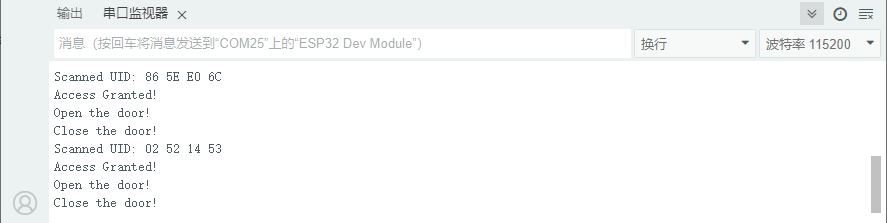

   591501

项目六十 Bluetooth
~~~~~~~~~~~~~~~~~~

1.1 项目介绍

ESP32是一系列低成本，低功耗的单片机微控制器，集成了Wi-Fi和双模蓝牙。ESP32
可作为独立系统运行应用程序或作为主机 MCU 的从设备，通过 SPI / SDIO 或
I2C / UART 接口提供 Wi-Fi 和蓝牙功能。

蓝牙是一种短距离通信系统，其简单的数据传输有两种模式：主设备工作模式和从设备工作模式。蓝牙技术规定每一对设备之间进行蓝牙通讯时，必须一个为\ **主端**\ ，另一个为\ **从端**\ ，才能进行通信。通信时，必须由主端进行查找，发起配对，建链成功后，双方即可收发数据。

- **主设备工作模式**
  ：主设备是能够搜索并\ **主动建立连接**\ 的一方，从扫描状态转化而来的。其可以和一个或多个从设备进行连接通信，它会\ **定期的扫描**\ 周围的广播状态设备发送的广播信息，可以对周围设备进行搜索并选择所需要连接的从设备进行配对连接，\ **建立通信链路成功后，主从双方就可以发送接收数据**\ 。例如智能手机，数据传输中做主机的蓝牙模块。

  **一个蓝牙设备以主模式发起连接时，需要知道从设备的地址，配对密码等信息，配对完成后，可直接连接。**\ 同时主设备可以\ **设置默认连接**\ 从设备的地址，这样主设备模块上电会自动搜索该地址的从设备并且进行连接。并且\ **支持白名单功能**\ ，用户只需要把需要连接的设备的地址写入白名单中，模块搜索到符合白名单的设备时就进行连接。主从透传协议相同时，用户不需要关注串口数据与无线数据包之间的数据转换过程，只需通过简单的参数设置，即可实现主设备串口与从设备串口之间的数据透传。

  为保证连接的稳定性，预防断电、信号等异常问题导致模块之间断开连接，可以开启断线重连功能，当异常干扰问题消失，模块工作环境恢复正常，主设备会自动搜索刚刚断连的从设备，尽可能减少数据的丢失，提高系统稳定性。

- **从设备工作模式**
  ：从设备模式是从广播者模式转化而来的，未被连接的从设备首先进入广播状态，\ **等待被主机搜索**\ 。当从设备被主机扫描到并\ **建立连接后**\ ，就可以和主机设备\ **进行数据的收发**\ 。从设备\ **不能主动建立连接**\ 。从设备模式的蓝牙模块是可以被连接的，定期的和主机进行连接和数据传输，在数据传输过程中作从机。例如蓝牙手表手环，蓝牙鼠标等工作在从设备模式。

一对一应用中从设备可以设为两种类型。一是静默状态，即只能与指定的主设备通信，不被别的蓝牙设备查找；二是开发状态，既可被指定主设备查找，也可以被别的蓝牙设备查找后建立连接。

当手机与ESP32进行数据交换时，\ **手机通常处于主设备工作模式，ESP32为从设备工作模式。**

这一实验课程我们先学习利用ESP32的蓝牙功能与手机进行简单的数据传输，然后学习用蓝牙控制LED灯的亮灭。

1.2 实验组件

在本课程中，我们需要使用一个名为”串行蓝牙终端”的蓝牙应用程序来协助实验。

点击安装：\ https://www.appsapk.com/serial-bluetooth-terminal/

+-----------+-------------+----------------+------------+------------------------+
| |img|     | |image239|  | |image240|     | |image241| | |image242|             |
+===========+=============+================+============+========================+
| ESP32     | Keyes       | XH2.54-3P      | USB线 x1   | “串行蓝牙终端”应用程序 |
| Plus主板  | 紫色LED模块 | 转杜邦线母单线 |            |                        |
| x1        | x1          | x1             |            |                        |
+-----------+-------------+----------------+------------+------------------------+

1.3 实验

1.3.1 实验①：

（1）实验接线图

   img

（2）实验代码

本项目中使用的代码保存在文件夹“\*\*:raw-latex:`\程序代码`:raw-latex:`\Arduino`\_代码\ **”中，我们可以在此路径下打开代码文件’’**\ Classic_Bluetooth.ino*\*“。

.. code:: cpp

   /*
    * 名称   : Classic Bluetooth
    * 功能   : ESP32通过蓝牙与手机通信，并通过串口打印手机数据
    * 作者   : http://www.keyes-robot.com/ 
   */
   #include "BluetoothSerial.h"

   BluetoothSerial SerialBT;
   String buffer;
   void setup() 
   {
     Serial.begin(115200);
     SerialBT.begin("ESP32test"); //蓝牙设备名称
     Serial.println("\nThe device started, now you can pair it with bluetooth!");
   }

   void loop() 
   {
     if (Serial.available()) 
     {
       SerialBT.write(Serial.read());
     }
     if (SerialBT.available()) 
     {
       Serial.write(SerialBT.read());
     }
     delay(20);
   }

（3）实验结果

代码上传成功后，打开串口监视器，设置波特率为\ **115200**\ 。当串口监视器打印出如下图所示的内容时表示ESP32的蓝牙功能已就绪，等待与手机连接。

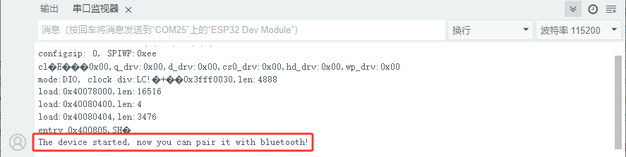

   601301

**注意：如果打开串口监视器且设置好波特率，串口监视器窗口还是没有显示任何信息，可以尝试按下ESP32的RESET按键。**

.. figure:: ./media/RESET.jpg
   :alt: RESET

   RESET

确保你的手机已经打开蓝牙且已安装“串口蓝牙终端”应用程序。搜索附近的蓝牙设备，选择
“ESP32test” 进行连接。

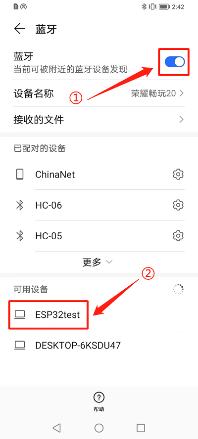

   img

出现蓝牙配对请求，选择“\ **配对**\ ”。

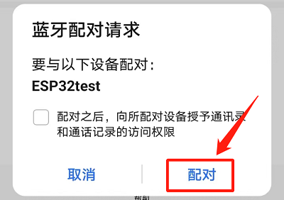

   img

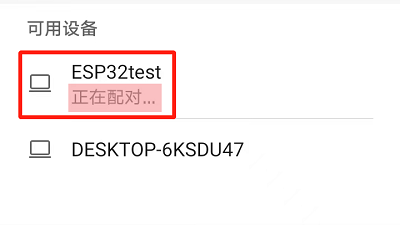

   img

配对成功。

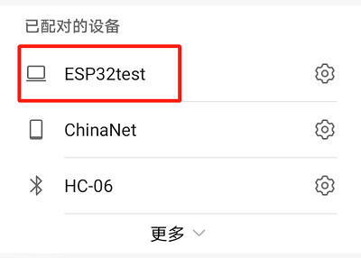

   img

打开“串口蓝牙终端”应用程序，单击图示箭头所指地方。选择 “**Devices**”。

   img

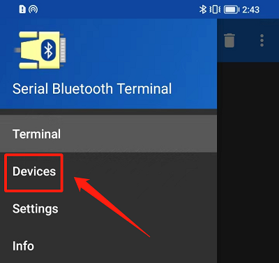

   img

选择经典蓝牙模式下的”\ **ESP32test**\ ”。

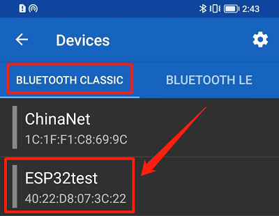

   img

出现连接的成功提示，现在ESP32与你的手机已经建链成功了，可以在ESP32与你的手机之间传输数据了。

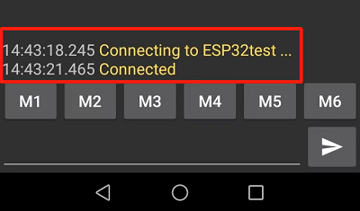

   img

先来尝试一下主设备传输数据到从设备。

在“串口蓝牙终端”应用程序发送框内输入 “Hello！”
并发送。ESP32接收成功，在串口监视器打印出接收到的信息。

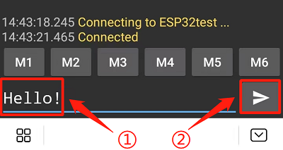

   img

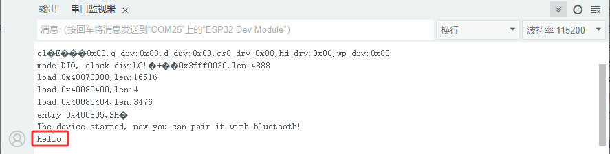

   img

接下来尝试一下从设备传输数据到主设备。 在串口监视器的输入框内输入 “Hi！”
并发送。手机蓝牙接收成功，在“串口蓝牙终端”应用程序内打印出接收到的信息。

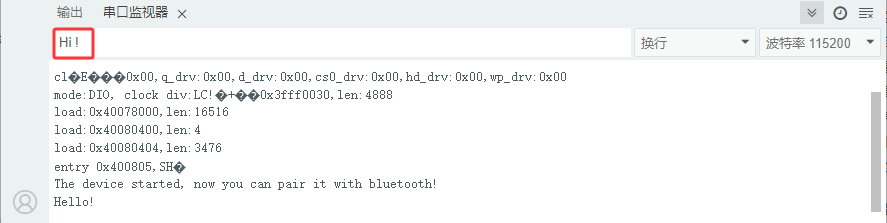

   img

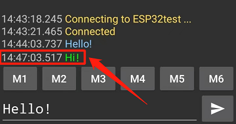

   img

--------------

**1.3.1 实验②：**

（1）实验接线图

.. figure:: ./media/601318.png
   :alt: img

   img

（2）实验代码

本项目中使用的代码保存在文件夹“\*\*:raw-latex:`\程序代码`:raw-latex:`\Arduino`\_代码\ **”中，我们可以在此路径下打开代码文件’’**\ Bluetooth_Control_LED.ino*\*“。

.. code:: cpp

   /*
    * 名称   : Bluetooth Control LED
    * 功能   : 手机通过蓝牙控制esp32的led
               当手机发送“LED_on”时，ESP32的LED灯就会打开。
               当手机发送“LED_off”时，ESP32的LED灯就会关闭。
    * 作者   : http://www.keyes-robot.com/ 
   */
   #include "BluetoothSerial.h"
   #include "string.h"
   #define LED 5
   BluetoothSerial SerialBT;
   char buffer[20];
   static int count = 0;

   void setup() 
   {
     pinMode(LED, OUTPUT);
     SerialBT.begin("ESP32test"); //蓝牙设备名称
     Serial.begin(115200);
     Serial.println("\nThe device started, now you can pair it with bluetooth!");
   }

   void loop() 
   {
     while(SerialBT.available())
     {
       buffer[count] = SerialBT.read();
       count++;
     }
     if(count>0)
     {
       Serial.print(buffer);
       if(strncmp(buffer,"led_on",6)==0)
       {
         digitalWrite(LED,HIGH);
       }
       if(strncmp(buffer,"led_off",7)==0){
         digitalWrite(LED,LOW);
       }
       count=0;
       memset(buffer,0,20);
     }
   }

（3）实验结果

代码上传成功后，拔下USB线断电，按照接线图正确接好模块后再用USB线连接到计算机上电，打开串口监视器，设置波特率为\ **115200**\ 。

参照 **1.3.1 实验①**
的内容，确保蓝牙已配对。在串行蓝牙终端的蓝牙应用程序上发送 “**led_on**”
实现紫色LED灯亮的效果。串口监视器打印出 “\ **led_on**\ ”。

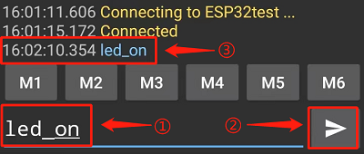

   img

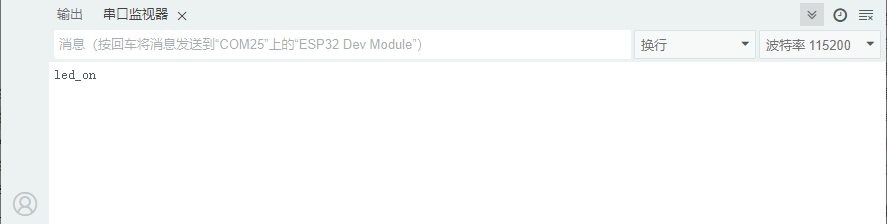

   601314

在串行蓝牙终端的蓝牙应用程序上发送 “**led_off**”
实现紫色LED灯灭的效果。串口监视器打印出 “\ **led_off**\ ”。

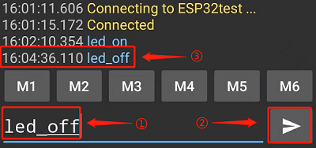

   img

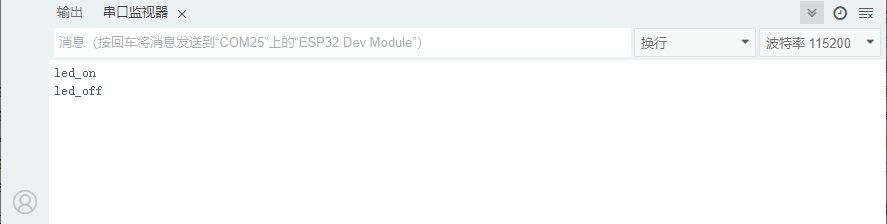

   601316

**注意**\ ：如果发送的内容不是 “**led_on**\ “
或”\ **led_off**\ ”，那么LED的当前状态不会被改变。如当LED亮时，接收到不相关内容时，LED保持亮的状态；当LED灭时，接收到不相关内容时，LED保持灭的状态。

1.6 代码说明

+---------------------------------+----------------------------------------------------------------------------------------------------------------------------------------------------------------------------+
| 代码                            | 说明                                                                                                                                                                       |
+=================================+============================================================================================================================================================================+
| SerialBT.begin(“ESP32test”)     | 设置蓝牙设备的名称。                                                                                                                                                       |
+---------------------------------+----------------------------------------------------------------------------------------------------------------------------------------------------------------------------+
| SerialBT.read()                 | 读取手机发送的数据。                                                                                                                                                       |
+---------------------------------+----------------------------------------------------------------------------------------------------------------------------------------------------------------------------+
| int strncmp(const char str1,    | 把 str1 和 str2 进行比较，最多比较前 n 个字节。                                                                                                                            |
| const char str2, size_t n)      |                                                                                                                                                                            |
+---------------------------------+----------------------------------------------------------------------------------------------------------------------------------------------------------------------------+
| strncmp(buffer,“led_on”,6)      | 把 buffer 的前6个字节和 “led_on” 进行比较。                                                                                                                                |
+---------------------------------+----------------------------------------------------------------------------------------------------------------------------------------------------------------------------+
| void memset(void ptr, int       | 复制 value 的值到 ptr 所指向的字符串的前 num                                                                                                                               |
| value, size_t num)              | 个字节。ptr：指向任意类型的指针，即指向我们需要修改的对象，譬如传进来一个数组首地址buff。value：赋给ptr所指对象的值。num:确定将ptr所指的对象中的num个字节全都用value代替。 |
+---------------------------------+----------------------------------------------------------------------------------------------------------------------------------------------------------------------------+
| memset(buffer,0,20)             | 复制字符 “0” 到参数 buffer 所指向的字符串的前20个字节全部用 “0” 替代。                                                                                                     |
+---------------------------------+----------------------------------------------------------------------------------------------------------------------------------------------------------------------------+

项目六十一 WiFi Station Mode
~~~~~~~~~~~~~~~~~~~~~~~~~~~~

1.1 项目介绍

ESP32有3种不同的WiFi工作模式：

- Station模式（作为WiFi设备主动连接路由器，也叫做WiFi Client）
- AP模式（作为一个Access Point，让其他WiFi设备来连接）即WiFi热点
- Station+AP共存模式（ESP32连接路由器的同时自身也是一个热点供其他WiFi设备来连接）

所有WiFi编程项目在使用WiFi前必须配置WiFi运行模式，否则无法使用WiFi。在这节实验课程中，我们将学习使用ESP32的WiFi
Station模式。

**Station 模式：**

当ESP32选择Station模式时，它作为一个WiFi客户端。它可以连接路由器网络，通过WiFi连接与路由器上的其他设备通信。如下图所示，PC和路由器已经连接，ESP32如果要与PC通信，需要将PC和路由器连接起来。

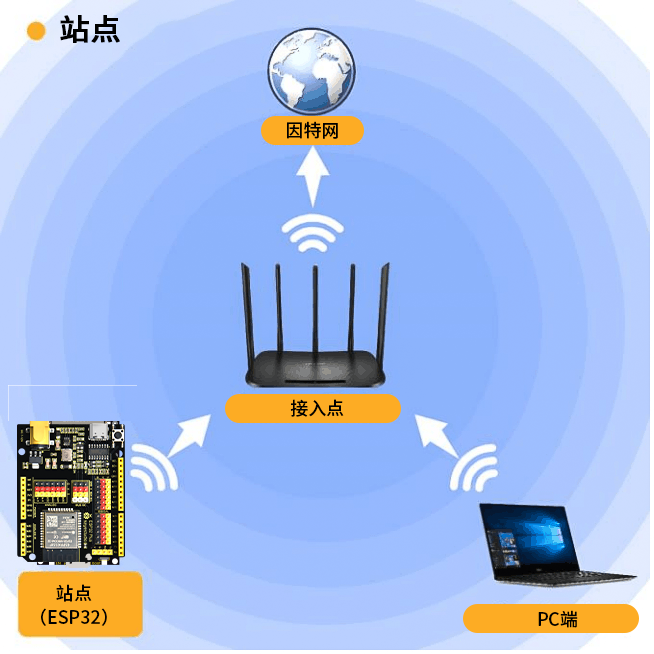

   img

1.2 实验组件

================= ==========
|img|             |image243|
================= ==========
ESP32 Plus主板 x1 USB线 x1
================= ==========

1.3 模块接线图

   img

1.4 实验代码

本项目中使用的代码保存在文件夹“\*\*:raw-latex:`\程序代码`:raw-latex:`\Arduino`\_代码\ **”中，我们可以在此路径下打开代码文件’’**\ WiFi_Station_Mode.ino*\*“。

路由器的SSID是无线网的无线名称。SSID是 ServiceSetldentifier
的缩写，意思是:服务集标识。SSID技术可以将一个无线局域网分为几个需要不同身份验证的子网络，每一个子网络都需要独立的身份验证，只有通过身份验证的用户才可以进入相应的子网络，防止未被授权的用户进入本网络。所以在代码运行之前，需要配置
WiFi 名称和密码，将其修改为你自己使用的WiFi 名称和密码，如下图所示。

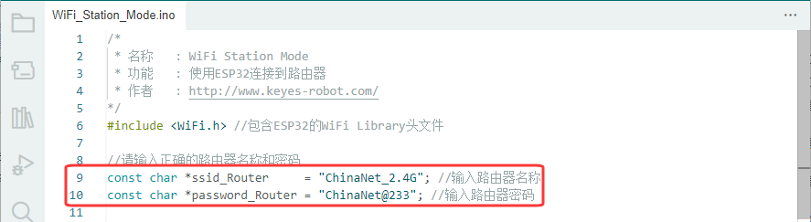

   611401

.. code:: cpp

   /*
    * 名称   : WiFi Station Mode
    * 功能   : 使用ESP32连接到路由器
    * 作者   : http://www.keyes-robot.com/ 
   */
   #include <WiFi.h> //包含ESP32的WiFi Library头文件

   //请输入正确的路由器名称和密码
   const char *ssid_Router     = "ChinaNet_2.4G"; //输入路由器名称
   const char *password_Router = "ChinaNet@233"; //输入路由器密码

   void setup()
   {
     Serial.begin(115200);
     delay(2000);
     Serial.println("Setup start");
     WiFi.begin(ssid_Router, password_Router);//将ESP32设置为站模式并将其连接到路由器
     Serial.println(String("Connecting to ")+ssid_Router);
   //每0.5s检查ESP32与路由器连接是否成功
     while (WiFi.status() != WL_CONNECTED)
     {
       delay(500);
       Serial.print(".");
     }
     Serial.println("\nConnected, IP address: ");
     Serial.println(WiFi.localIP());//串口监视器输出分配给ESP32的IP地址
     Serial.println("Setup End");
   }
    
   void loop() 
   {
   }

1.5 代码说明

+---------------------------+------------------------------------------------------------------------------------------------------------------------------------------------------------------------+
| 代码                      | 说明                                                                                                                                                                   |
+===========================+========================================================================================================================================================================+
| WiFi.begin(ssid_Router,   | 连接初始化连接。ssid_Router为 WiFi 名称，password_Router为连接 WiFi 所用的密码。                                                                                       |
| password_Router)          |                                                                                                                                                                        |
+---------------------------+------------------------------------------------------------------------------------------------------------------------------------------------------------------------+
| WiFi.status()             | 调用完成后，wifi并不会立即就连接上。此接口函数的作用就是检查wifi是否已经连接上。当返回值为WL_CONNECTED时表示已经连接上。该函数还有其它返回值，表示wifi连接失败等情况。 |
+---------------------------+------------------------------------------------------------------------------------------------------------------------------------------------------------------------+
| WiFi.localIP()            | 显示本机ip。                                                                                                                                                           |
+---------------------------+------------------------------------------------------------------------------------------------------------------------------------------------------------------------+

1.6 实验结果

代码上传成功后，打开串口监视器，设置波特率为\ **115200**\ 。

开始连接，串口监视器打印出“\ **Connecting to ChinaNet_2.4G**\ ”
提示正在连接到路由器的SSID，当ESP32成功连接到路由器的 SSID
时，串行监视器将打印出 WiFi 分配给ESP32的\ **IP地址**\ 。

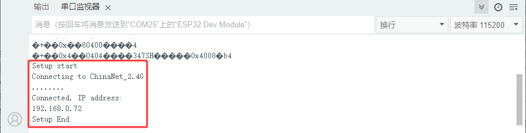

   611501

**注意：如果打开串口监视器且设置好波特率，串口监视器窗口还是没有显示任何信息，可以尝试按下ESP32的RESET按键。**

.. figure:: ./media/RESET.jpg
   :alt: RESET

   RESET

项目六十二 WiFi AP Mode
~~~~~~~~~~~~~~~~~~~~~~~

1.1 项目介绍

从上一课实验中我们知道ESP32有3种不同的WiFi工作模式：

- Station模式（作为WiFi设备主动连接路由器，也叫做WiFi Client）
- AP模式（作为一个Access Point，让其他WiFi设备来连接）即WiFi热点
- Station+AP共存模式（ESP32连接路由器的同时自身也是一个热点供其他WiFi设备来连接）

所有WiFi编程项目在使用WiFi前必须配置WiFi运行模式，否则无法使用WiFi。在这节实验课程中，我们将接着学习使用ESP32的WiFi
AP模式。

**AP模式：**

接入点Access Point（AP）是一种提供 Wi-Fi
网络访问的设备，并将其连接到有线网络的装置。ESP32除了不具有与有线网络的接口外，还可以提供类似的功能。这种操作模式称为软接入点（soft-AP）。可以同时连接到soft-AP的最大站数可以设置4，默认为4。

当ESP32单独处于AP模式下时，可以被认为是一个无法访问外网的局域网WiFi路由器节点，它可以接受各类设备的连接请求。并可以和连接设备进行TCP、UDP连接，实现数据流。在局域物联网的设计中可以承担数据收发节点的作用。如下图所示，以ESP32为热点。如果手机或PC需要与ESP32通信，则必须连接到ESP32的热点。只有通过与ESP32建立连接后才能进行通信。

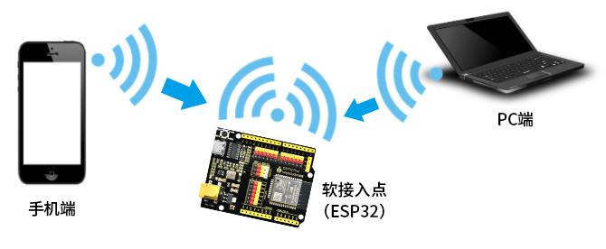

   img

1.2 实验组件

================= ==========
|img|             |image244|
================= ==========
ESP32 Plus主板 x1 USB线 x1
================= ==========

1.3 模块接线图

   img

1.4 实验代码

本项目中使用的代码保存在文件夹“\*\*:raw-latex:`\程序代码`:raw-latex:`\Arduino`\_代码\ **”中，我们可以在此路径下打开代码文件’’**\ WiFi_AP_Mode.ino*\*“。

在代码运行之前，需要配置ESP32的
AP名称和连接密码，如下图所示。当然，你也可以不修改它，使用默认的名称和连接密码。

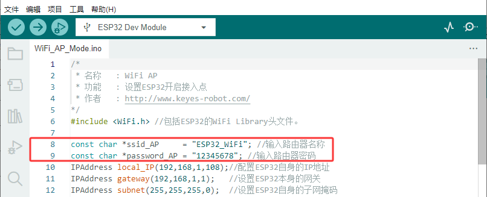

   img

.. code:: cpp

   /*
    * 名称   : WiFi AP
    * 功能   : 设置ESP32开启接入点
    * 作者   : http://www.keyes-robot.com/ 
   */
   #include <WiFi.h> //包括ESP32的WiFi Library头文件。

   const char *ssid_AP     = "ESP32_WiFi"; //输入路由器名称
   const char *password_AP = "12345678"; //输入路由器密码
   IPAddress local_IP(192,168,1,108);//配置ESP32自身的IP地址
   IPAddress gateway(192,168,1,1);   //设置ESP32本身的网关
   IPAddress subnet(255,255,255,0);  //设置ESP32自身的子网掩码

   void setup()
   {
     Serial.begin(115200);
     delay(2000);
     Serial.println("Setting soft-AP configuration ... ");
     WiFi.disconnect();
     WiFi.mode(WIFI_AP);
     Serial.println(WiFi.softAPConfig(local_IP, gateway, subnet) ? "Ready" : "Failed!");
     Serial.println("Setting soft-AP ... ");
     boolean result = WiFi.softAP(ssid_AP, password_AP);
     if(result)
     {
       Serial.println("Ready");
       Serial.println(String("Soft-AP IP address = ") + WiFi.softAPIP().toString());
       Serial.println(String("MAC address = ") + WiFi.softAPmacAddress().c_str());
     }
     else
     {
       Serial.println("Failed!");
     }
     Serial.println("Setup End");
   }
    
   void loop() {
   }

1.5 代码说明

================================= ===========================
代码                              说明
================================= ===========================
IPAddress local_IP(192,168,1,108) 配置ESP32自身的IP地址。
IPAddress gateway(192,168,1,1)    配置ESP32自身的网关IP地址。
IPAddress subnet(255,255,255,0)   设置ESP32自身的子网掩码。
WiFi.mode(WIFI_AP)                设置WIFI模式为AP模式。
================================= ===========================

1.6 实验结果

代码上传成功后，打开串口监视器，设置波特率为\ **115200**\ ，出现AP 以及
MAC 的IP地址。

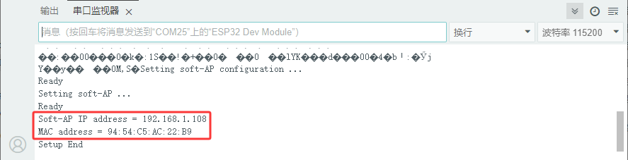

   621501

**注意：如果打开串口监视器且设置好波特率，串口监视器窗口还是没有显示任何信息，可以尝试按下ESP32的RESET按键。**

.. figure:: ./media/RESET.jpg
   :alt: RESET

   RESET

打开手机的 WiFi 扫描功能，可以看到ESP32的 SSID ，在本课程代码中的名称为
“\ **ESP32_WiFi**\ ” 。

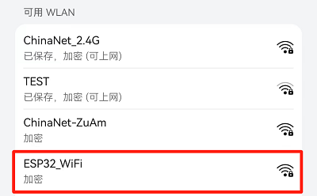

   img

你可以输入密码 “\ **12345678**\ ”
连接它，也可以通过修改程序代码来修改它的AP名称和密码。

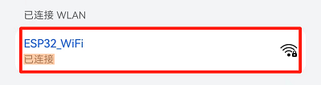

   img

项目六十三 WiFi Station+AP Mode
~~~~~~~~~~~~~~~~~~~~~~~~~~~~~~~

1.1 项目介绍

从第六十一课实验中我们知道ESP32有3种不同的WiFi工作模式：

- Station模式（作为WiFi设备主动连接路由器，也叫做WiFi Client）
- AP模式（作为一个Access Point，让其他WiFi设备来连接）即WiFi热点
- Station+AP共存模式（ESP32连接路由器的同时自身也是一个热点供其他WiFi设备来连接）

所有WiFi编程项目在使用WiFi前必须配置WiFi运行模式，否则无法使用WiFi。在这节实验课程中，我们将接着学习使用ESP32的WiFi
Station+AP模式。

**AP+Station模式：**

ESP32除AP模式和Station模式外，还可以同时使用AP模式和Station模式。此模式包含前两种模式的功能。打开ESP32的Station模式，将其连接到路由器网络，它可以通过路由器与Internet通信。同时开启其AP模式，创建热点网络。其他WiFi设备可以选择连接路由器网络或热点网络与ESP32通信。

1.2 实验组件

================= ==========
|img|             |image245|
================= ==========
ESP32 Plus主板 x1 USB线 x1
================= ==========

1.3 模块接线图

   img

1.4 实验代码

本项目中使用的代码保存在文件夹“\*\*:raw-latex:`\程序代码`:raw-latex:`\Arduino`\_代码\ **”中，我们可以在此路径下打开代码文件’’**\ WiFi_Station_AP_Mode.ino*\*“。

在代码运行之前，需要配置 WiFi 名称和密码、ESP32的
AP名称和连接密码，如下图所示。

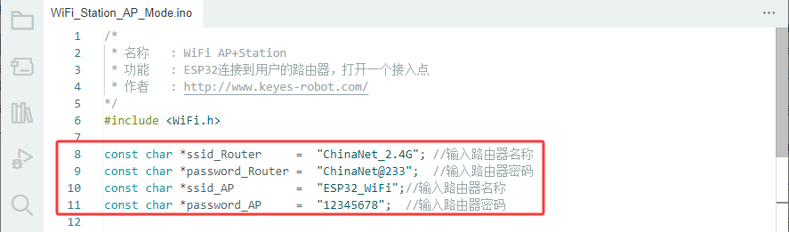

   631401

.. code:: cpp

   /*
    * 名称   : WiFi AP+Station
    * 功能   : ESP32连接到用户的路由器，打开一个接入点
    * 作者   : http://www.keyes-robot.com/ 
   */
   #include <WiFi.h>
    
   const char *ssid_Router     =  "ChinaNet_2.4G"; //输入路由器名称
   const char *password_Router =  "ChinaNet@233";  //输入路由器密码
   const char *ssid_AP         =  "ESP32_WiFi";//输入路由器名称
   const char *password_AP     =  "12345678";  //输入路由器密码

   void setup()
   {
     Serial.begin(115200);
     Serial.println("Setting soft-AP configuration ... ");
     WiFi.disconnect();
     WiFi.mode(WIFI_AP);
     Serial.println("Setting soft-AP ... ");
     boolean result = WiFi.softAP(ssid_AP, password_AP);
     if(result)
     {
       Serial.println("Ready");
       Serial.println(String("Soft-AP IP address = ") + WiFi.softAPIP().toString());
       Serial.println(String("MAC address = ") + WiFi.softAPmacAddress().c_str());
     }
     else
     {
       Serial.println("Failed!");
     }
     
     Serial.println("\nSetting Station configuration ... ");
     WiFi.begin(ssid_Router, password_Router);
     Serial.println(String("Connecting to ")+ ssid_Router);
     while (WiFi.status() != WL_CONNECTED)
     {
       delay(500);
       Serial.print(".");
     }
     Serial.println("\nConnected, IP address: ");
     Serial.println(WiFi.localIP());
     Serial.println("Setup End");
   }

   void loop() 
   {
   }

1.5 代码说明

此课程代码与第六十二课代码类似，这里就不多做介绍了。

1.6 实验结果

代码上传成功后，打开串口监视器，设置波特率为\ **115200**\ 。

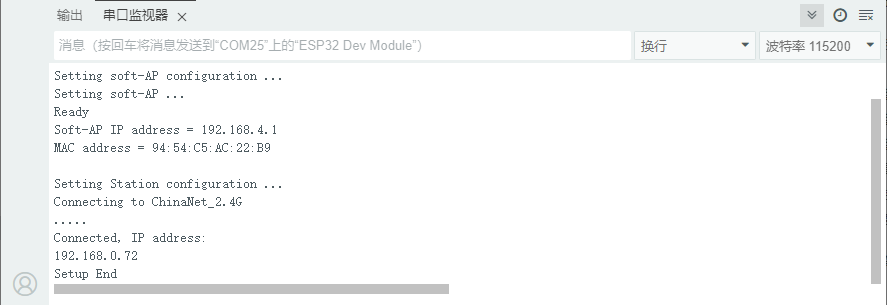

   img

**注意：如果打开串口监视器且设置好波特率，串口监视器窗口还是没有显示任何信息，可以尝试按下ESP32的RESET按键。**

.. figure:: ./media/RESET.jpg
   :alt: RESET

   RESET

打开手机 WiFi 扫描功能，可以看到ESP32的SSID，名称为 “\ **ESP32_WiFi**\ ”
。

   img

项目六十四 综合实验
~~~~~~~~~~~~~~~~~~~

1.1 项目介绍

我们已经学习了所有的模块和传感器的使用方法，也学习了将它们搭配在一起组合实验。在这一实验课程中我们将搭配更多的模块和传感器组合在一起。参考前面实验编程的方法，利用按键模块，实现每按一次按键，功能就变换一次的效果。

实验多种多样，大家可以发挥想象力，搭配模块和传感器做出更多具有意义的实验。

1.2 实验组件

+-----------------+---------------+-----------------+-----------------+
| |img|           | |image246|    | |image247|      | |image248|      |
+=================+===============+=================+=================+
| ESP32 Plus主板  | Keyes         | Keyes           | Keyes           |
| x1              | 紫色LED模块   | 单路按键模块 x1 | 旋转电位器模块  |
|                 | x1            |                 | x1              |
+-----------------+---------------+-----------------+-----------------+
| |image249|      | |image250|    | |image251|      | |image252|      |
+-----------------+---------------+-----------------+-----------------+
| Keyes           | Keyes         | HC-SR04         | Keyes           |
| 避障传感器 x1   | 摇杆模块 x1   | 超声波传感器 x1 | 超声波转接模块  |
|                 |               |                 | x1              |
+-----------------+---------------+-----------------+-----------------+
| |image253|      | |image254|    | |image255|      | |image256|      |
+-----------------+---------------+-----------------+-----------------+
| Keyes           | Keyes         | XH2.54-3P       | XH2.54-4P       |
| 共阴RGB模块 x1  | 白色LED模块   | 转杜邦线母单线  | 转杜邦线母单线  |
|                 | x1            | x4              | x2              |
+-----------------+---------------+-----------------+-----------------+
| |image257|      |               |                 |                 |
+-----------------+---------------+-----------------+-----------------+
| XH2.54-5P       |               |                 |                 |
| 转杜邦线母单线  |               |                 |                 |
| x1              |               |                 |                 |
+-----------------+---------------+-----------------+-----------------+

1.3 模块接线图

.. figure:: ./media/641301.png
   :alt: img

   img

1.4 实验代码

本项目中使用的代码保存在文件夹“\*\*:raw-latex:`\程序代码`:raw-latex:`\Arduino`\_代码\ **”中，我们可以在此路径下打开代码文件’’**\ Comprehensive_experiment.ino*\*“。

.. code:: cpp

   /*
    * 名称   : Comprehensive experiment
    * 功能   : 多个传感器/模块协同工作
    * 作者   : http://www.keyes-robot.com/ 
   */
   // RGB引脚定义
   #define RED_PIN   32
   #define GREEN_PIN 4
   #define BLUE_PIN  2
   #define POT_PIN 35    // 电位器

   // 摇杆模块接口
   int xyzPins[] = {33, 34, 18};   //x, y, z
   // 避障传感器引脚
   int Avoid = 14;
   // LED引脚
   #define PIN_LED   5
   // 超声波传感器接口
   int Trig = 13;
   int Echo = 12;
   // 按键引脚
   int button = 23;
   // 全局变量
   int PushCounter = 0;
   int yushu = 0;
   unsigned long lastDebounceTime = 0;  // 上次按键状态变化时间
   unsigned long debounceDelay = 50;    // 消抖延时(ms)
   int lastButtonState = HIGH;          // 上次按键状态
   int buttonState;                     // 当前按键状态

   void setup() 
   {
     Serial.begin(115200);
     // 初始化各引脚
     pinMode(xyzPins[0], INPUT);  // x轴
     pinMode(xyzPins[1], INPUT);  // y轴
     pinMode(xyzPins[2], INPUT_PULLUP);  // z轴按钮
     pinMode(RED_PIN, OUTPUT);
     pinMode(GREEN_PIN, OUTPUT);
     pinMode(BLUE_PIN, OUTPUT);
     pinMode(button, INPUT_PULLUP);  // 使用内部上拉电阻
     pinMode(Avoid, INPUT);
     pinMode(Trig, OUTPUT);
     pinMode(Echo, INPUT);
     pinMode(PIN_LED, OUTPUT);
   }

   void loop() 
   {
     // 读取按键状态（带消抖处理）
     int reading = digitalRead(button);
     // 检查按键状态是否变化
     if (reading != lastButtonState) 
     {
       lastDebounceTime = millis();
     }
     // 消抖处理
     if ((millis() - lastDebounceTime) > debounceDelay)
     {
       // 如果按键状态与当前存储状态不同
       if (reading != buttonState) 
       {
         buttonState = reading;
         // 检测到按键按下（下降沿）
         if (buttonState == LOW) 
         {
           PushCounter++;
           Serial.print("Button pressed. Mode: ");
           Serial.println(PushCounter % 5);
         }
       }
     }
     
     lastButtonState = reading;
     // 根据按键次数选择功能模式
     yushu = PushCounter % 5;
     switch(yushu)
     {
       case 0:  // RGB随机颜色
         yushu_0();
         break;
       case 1:  // 避障传感器检测
         yushu_1();
         break;
       case 2:  // 摇杆值显示
         yushu_2();
         break;
       case 3:  // 电位器控制LED
         yushu_3();
         break;
       case 4:  // 超声波测距
         yushu_4();
         break;
     }
   }

   // RGB随机颜色
   void yushu_0() 
   {
     int r = random(256);
     int g = random(256);
     int b = random(256);
     analogWrite(RED_PIN, r);
     analogWrite(GREEN_PIN, g);
     analogWrite(BLUE_PIN, b);
     delay(100);
   }

   // 避障传感器检测
   void yushu_1() 
   {
     int val = digitalRead(Avoid);
     Serial.print(val);
     if (val == 0) 
     {
       Serial.println("\tThere are obstacles");
     } 
     else 
     {
       Serial.println("\tAll going well");
     }
     delay(100);
   }

   // 摇杆值显示
   void yushu_2() 
   {
     int xVal = analogRead(xyzPins[0]);
     int yVal = analogRead(xyzPins[1]);
     int zVal = digitalRead(xyzPins[2]);
     Serial.println("X,Y,Z: " + String(xVal) + ", " + String(yVal) + ", " + String(zVal));
     delay(100);
   }

   // 电位器控制LED
   void yushu_3() 
   {
     int potValue = analogRead(POT_PIN);
     int pwmDuty = map(potValue, 0, 4095, 0, 255);
     analogWrite(PIN_LED, pwmDuty);
     Serial.println("Potentiometer: " + String(potValue) + " -> PWM: " + String(pwmDuty));
     delay(100);
   }

   // 超声波测距
   void yushu_4() 
   {
     float distance = checkdistance();
     Serial.print("Distance: ");
     Serial.print(distance);
     Serial.println("cm");
     delay(100);
   }

   // 超声波测距函数
   float checkdistance() 
   {
     digitalWrite(Trig, LOW);
     delayMicroseconds(2);
     digitalWrite(Trig, HIGH);
     delayMicroseconds(10);
     digitalWrite(Trig, LOW);
     float distance = pulseIn(Echo, HIGH) / 58.00;
     delay(10);
     return distance;
   }

1.5 实验结果

代码上传成功后，拔下USB线断电，按照接线图正确接好模块后再用USB线连接到计算机上电，打开串口监视器，设置波特率为\ **115200**\ 。

（1）初始时没有按下按键，按键次数为 0 ，余数为 0
，RGB模块循环闪烁随机颜色。

.. figure:: ./media/641507.png
   :alt: img

   img

（2）按一下按键（时间稍长以便能检测到按键按下），RGB
LED灯停止闪烁。此时按键次数为 1 ，余数为 1
，实验实现避障传感器检测障碍物并读取高低电平的功能。

当传感器没有检测到障碍物时，val为\ **1**\ ，串口监视器打印出 “\ **1 All
going well**\ ” ，灯 SLED **不亮**\ ；
当传感器检测到障碍物时，val为\ **0**\ ，串口监视器打印出 “\ **0 There
are obstacles**\ ” ，灯 SLED **亮**\ 。

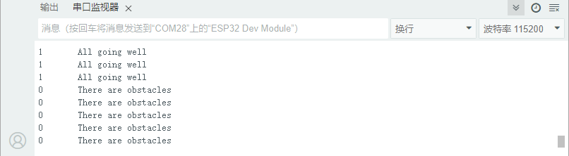

   641501

.. figure:: ./media/641505.png
   :alt: img

   img

.. figure:: ./media/641506.png
   :alt: img

   img

（3）再按一下按键，按键次数为 2 ，余数为 2
。实验实现读取当前摇杆X轴和Y轴对应的模拟值以及Z轴（B接口）对应的数字值的功能。串口监视器打印出当前摇杆X轴、Y轴和Z轴对应的值。

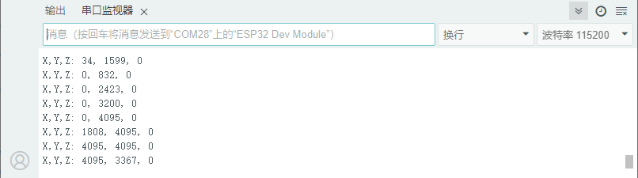

   641502

（4）再按一下按键，按键次数为 3 ，余数为 3
。实验实现利用可调电位器模块调节
LED（GPIO5）接口输出的PWM值，从而实现调节LED模块上LED亮度的功能。串口监视器打印出当前输出的模拟值。

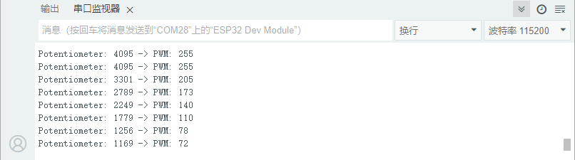

   641503

（5）再按一下按键，按键次数为 4 ，余数为 4
。实验实现的功能是利用超声波模块检测距离并在串口打印出来，串口监视器显示图如下。

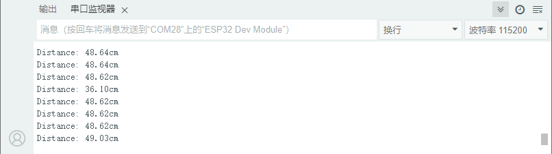

   641504

（6）再按一下按键，按键次数为 5 ，余数为 0
。实现初始时RGB循环闪烁随机颜色的效果。不断地按下按键，余数循环变化，实验功能也循环变化。

项目六十五 WiFi智能家居
~~~~~~~~~~~~~~~~~~~~~~~

1.1 项目介绍

在前面的实验中，我们已经了解了ESP32的WiFi Station、WiFi AP和WiFi
AP+Station三种模式。在本课程实验中，我们将利用ESP32的WiFi
Station模式通过APP连接WIFI来控制多个传感器/模块工作，模拟实现WiFi控制智能家居的效果。

1.2 实验组件

+----------------+---------------+------------------+-------------------------+
| |img|          | |image258|    | |image259|       | |image260|              |
+================+===============+==================+=========================+
| ESP32 Plus主板 | Keyes         | Keyes            | Keyes XHT11 温度传感器  |
| x1             | 130电机模块   | 单路5V继电器模块 | x1                      |
|                | x1            | x1               |                         |
+----------------+---------------+------------------+-------------------------+
| |image261|     | |image262|    | |image263|       | |image264|              |
+----------------+---------------+------------------+-------------------------+
| HC-SR04        | 9G            | XH2.54-3P        | XH2.54-4P               |
| 超声波传感器   | 180度数字舵机 | 转杜邦线母单线   | 转杜邦线母单线 x2       |
| x1             | x1            | x2               |                         |
+----------------+---------------+------------------+-------------------------+
| |image265|     | |image266|    | |image267|       | |image268|              |
+----------------+---------------+------------------+-------------------------+
| USB线 x1       | 6节5号电池盒  | 5号电池(自备) x6 | 智能手机/平板电脑(自备) |
|                | x1            |                  | x1                      |
+----------------+---------------+------------------+-------------------------+

1.3 模块接线图

.. figure:: ./media/651301.png
   :alt: img

   img

1.4 安装APP

**安卓系统设备（手机/平板）APP：**

我们提供了Android APP 的安装包：

|image269|

将Android APP 的安装包中的 keyes wifi.apk
文件转移到安卓系统手机或平板电脑上，点击 **keyes wifi.apk**
文件进入安装页面。

.. figure:: ./media/651402.png
   :alt: img

   img

点击 “\ **ALLOW**\ ” 按钮。

   img

然后点击 “\ **INSTALL**\ ” 按钮。

.. figure:: ./media/651404.png
   :alt: img

   img

稍等片刻，安装完成后点击 “\ **OPEN**\ ” 就可以进入APP界面。

**IOS系统设备（手机/iPad）APP**

打开APP Store

.. figure:: ./media/651405.png
   :alt: img

   img

在搜索框输入 keyes link ，点击搜索，出现下载界面，点击\ |image270|,下载
keyes link 。

1.5实验代码

本项目中使用的代码保存在文件夹“\*\*:raw-latex:`\程序代码`:raw-latex:`\Arduino`\_代码\ **”中，我们可以在此路径下打开代码文件’’**\ WiFi_Smart_Home.ino*\*“。

在代码运行之前，需要配置 WiFi 名称和密码，将其修改为你自己使用的WiFi
名称和密码，如下图所示。

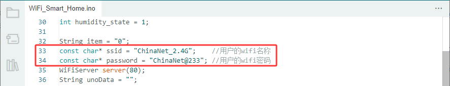

   651501

**注意：若上传代码失败，请先断开所有接线，再重新尝试上传。**

.. code:: cpp

   /*  
    * 名称   : WiFi Smart Home.
    * 功能   : WiFi APP控制多个传感器/模块工作，实现WiFi智能家居的效果
    * 作者   : http://www.keyes-robot.com/ 
   */
   #include <Arduino.h>
   #include <WiFi.h>
   #include <ESPmDNS.h>
   #include <WiFiClient.h>

   #include "xht11.h"
   //gpio27
   xht11 xht(27);
   unsigned char dht[4] = {0, 0, 0, 0};

   #include <ESP32Servo.h>
   Servo myservo;
   int servoPin = 32;
   #define Relay  4
   #define IN1 23 //IN1 对应IN+
   #define IN2 5  //IN2 对应IN-
   #define trigPin  12
   #define echoPin  13

   int distance1;
   String dis_str;
   int ip_flag = 1;
   int ultra_state = 1;
   int temp_state = 1;
   int humidity_state = 1;

   String item = "0";
   const char* ssid = "ChinaNet_2.4G";    //用户的wifi名称
   const char* password = "ChinaNet@233"; //用户wifi的密码
   WiFiServer server(80);
   String unoData = "";

   void setup() {
     Serial.begin(115200);
     pinMode(Relay, OUTPUT);
     myservo.setPeriodHertz(50);   
     myservo.attach(servoPin, 500, 2500);
     pinMode(IN1, OUTPUT);
     pinMode(IN2, OUTPUT);
     
     WiFi.begin(ssid, password);
     while (WiFi.status() != WL_CONNECTED) {
       delay(500);
       Serial.print(".");
     }
     Serial.println("");
     Serial.print("Connected to ");
     Serial.println(ssid);
     Serial.print("IP address: ");
     Serial.println(WiFi.localIP());
     server.begin();
     Serial.println("TCP server started");
     MDNS.addService("http", "tcp", 80);

     digitalWrite(IN1, LOW);
     digitalWrite(IN2, LOW);
     digitalWrite(Relay, LOW);
     pinMode(trigPin, OUTPUT);
     pinMode(echoPin, INPUT);
   }

   void loop() {
     WiFiClient client = server.available();
     if (!client) {
         return;
     }
     while(client.connected() && !client.available()){
         delay(1);
     }
     String req = client.readStringUntil('\r');
     int addr_start = req.indexOf(' ');
     int addr_end = req.indexOf(' ', addr_start + 1);
     if (addr_start == -1 || addr_end == -1) {
         Serial.print("Invalid request: ");
         Serial.println(req);
         return;
     }
     req = req.substring(addr_start + 1, addr_end);
     item=req;
     Serial.println(item);
     String s;
     if (req == "/")
     {
         IPAddress ip = WiFi.localIP();
         String ipStr = String(ip[0]) + '.' + String(ip[1]) + '.' + String(ip[2]) + '.' + String(ip[3]);
         s = "HTTP/1.1 200 OK\r\nContent-Type: text/html\r\n\r\n<!DOCTYPE HTML>\r\n<html>Hello from ESP32 at ";
         s += ipStr;
         s += "</html>\r\n\r\n";
         Serial.println("Sending 200");
         client.println(s);
     }
     else if(req == "/btn/0")
     {
       Serial.write('a');
       client.println(F("turn on the relay"));
       digitalWrite(Relay, HIGH);
     }
     else if(req == "/btn/1")
     {
       Serial.write('b');
       client.println(F("turn off the relay"));
       digitalWrite(Relay, LOW);
     }
     else if(req == "/btn/2")
     {
       Serial.write('c');
       client.println("Bring the steering gear over 180 degrees");
       myservo.write(180); 
       delay(200);
     }
     else if(req == "/btn/3")
     {
       Serial.write('d');
       client.println("Bring the steering gear over 0 degrees");
       myservo.write(0); 
       delay(200);
     }
     else if(req == "/btn/4")
     {
       Serial.write('e');
       client.println("esp32 already turn on the fans");
       digitalWrite(IN1, LOW); 
       digitalWrite(IN2, HIGH);
     }
     else if(req == "/btn/5")
     {
       Serial.write('f');
       client.println("esp32 already turn off the fans");
       digitalWrite(IN1, LOW); 
       digitalWrite(IN2, LOW);
     }
     else if(req == "/btn/6")
     {
       Serial.write('g');
       while(Serial.available() > 0)
       {
         unoData = Serial.readStringUntil('#');
         client.println("Data");
       }
       while(ultra_state>0)
          {
             Serial.print("Distance = "); 
             Serial.print(checkdistance());
             Serial.println("#");
             Serial1.print("Distance = "); 
             Serial1.print(checkdistance());
             Serial1.println("#");  
             int t_val1 = checkdistance();
             client.print("Distance(cm) = ");
             client.println(t_val1); 
             ultra_state = 0;
           }
     }
     else if(req == "/btn/7")
     {
       Serial.write('h');
       client.println("turn off the ultrasonic");
       ultra_state = 1;
     }
     else if(req == "/btn/8")
     {
       Serial.write('i');
       while(Serial.available() > 0)
        {
         unoData = Serial.readStringUntil('#');
         client.println(unoData);
        }
       while(temp_state>0)
         {
           if (xht.receive(dht)) {
             Serial.print("Temperature = "); 
             Serial.print(dht[2],1);
             Serial.println("#");
             Serial1.print("Temperature = "); 
             Serial1.print(dht[2],1);
             Serial1.println("#");
             int t_val2 = dht[2];
             client.print("Temperature(℃) = ");
             client.println(t_val2);
           }
           temp_state = 0;
         }
     }
     else if(req == "/btn/9")
     {
       Serial.write('j');
       client.println("turn off the temperature");
       temp_state = 1;
     }
     else if(req == "/btn/10")
     {
       Serial.write('k');
       while(Serial.available() > 0)
        {
          unoData = Serial.readStringUntil('#');
          client.println(unoData);
        }
       while(humidity_state > 0)
         {
           if (xht.receive(dht)) {
             Serial.print("Humidity = "); 
             Serial.print(dht[0],1);
             Serial.println("#");
             Serial1.print("Humidity = "); 
             Serial1.print(dht[0],1);
             Serial1.println("#");
             int t_val3 = dht[0];
             client.print("Humidity(%) = ");
             client.println(t_val3);
           }
           humidity_state = 0;
         }
     }
     else if(req == "/btn/11")
     {
       Serial.write('l');
       client.println("turn off the humidity");
       humidity_state = 1;
       }
     //client.print(s);
     client.stop();
   }

   int checkdistance() {
     digitalWrite(12, LOW);
     delayMicroseconds(2);
     digitalWrite(12, HIGH);
     delayMicroseconds(10);
     digitalWrite(12, LOW);
     int distance = pulseIn(13, HIGH) / 58;
     
     delay(10);
     return distance;
   }

1.6 实验结果

特别注意：\ 确保计算机网络，手机/平板的网络，ESP32主板，路由器，代码中输入你自己的WiFi名称和密码都必须是在同一个局域网（WiFi）下。

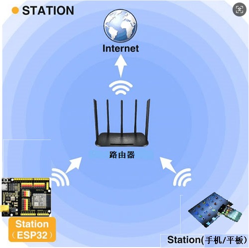

   Img

代码上传成功后，按照接线图正确接好模块。打开串口监视器，设置波特率为\ **115200**\ ，串口显示IP信息如下图所示。

.. figure:: ./media/651601.png
   :alt: img

   img

**注意：如果打开串口监视器且设置好波特率，串口监视器窗口还是没有显示任何信息，可以尝试按下ESP32的RESET按键。**

.. figure:: ./media/RESET.jpg
   :alt: img

   img

接着打开APP，在下图所示的白框里输入上面步骤检测到的WIFI的IP地址（192.168.0.77），接着点击
“\ **connect**\ ” 连接WIFI。

.. figure:: ./media/651602.png
   :alt: img

   img

当下图所示的白框显示 “\ **Hello from ESP32 at 192.168.0.77**\ ”
时，说明APP已经成功连接上了WIFI。

   img

+---------------+----------+---------------------------------------------------+
| 按钮          | 点击     | 效果                                              |
+===============+==========+===================================================+
| |image271|    | 首次点击 | 继电器打开，APP上显示 “turn on the                |
|               |          | relay”，模块上的指示灯点亮。                      |
+---------------+----------+---------------------------------------------------+
| |image272|    | 再次点击 | 继电器关闭，APP上显示 “turn off the relay”        |
|               |          | ，模块上指示灯灭。                                |
+---------------+----------+---------------------------------------------------+
| |image273|    | 首次点击 | 舵机转动180°，APP上显示 “Bring the steering gear  |
|               |          | over 180”。                                       |
+---------------+----------+---------------------------------------------------+
| |image274|    | 再次点击 | 舵机转动0°，APP上显示“Bring the steering gear     |
|               |          | over 0” 。                                        |
+---------------+----------+---------------------------------------------------+
| |image275|    | 首次点击 | 电机（带小风扇叶)转动，APP 上显示 “esp32 already  |
|               |          | turn on the fans”。                               |
+---------------+----------+---------------------------------------------------+
| |image276|    | 再次点击 | 关闭电机，APP 上显示 “esp32 already turn off the  |
|               |          | fans” 。                                          |
+---------------+----------+---------------------------------------------------+
| |image277|    | 首次点击 | 超声波传感器测距，在超声波传感器前放一个物体，APP |
|               |          | 上显示 “Distance(cm) = X” ，X代表实测距离。       |
+---------------+----------+---------------------------------------------------+
| |image278|    | 再次点击 | 关闭超声波传感器测距功能，APP 上显示 “turn off    |
|               |          | the ultrasonic” 。                                |
+---------------+----------+---------------------------------------------------+
| |image279|    | 首次点击 | 温湿度传感器测量环境中的温度，APP上显示 “         |
|               |          | Temperature(°C) = X”                              |
|               |          | ，X代表温度值，说明此时的环境温度为X°C 。         |
+---------------+----------+---------------------------------------------------+
| |image280|    | 再次点击 | 关闭温湿度传感器，APP上显示 “turn off the         |
|               |          | temperature”。                                    |
+---------------+----------+---------------------------------------------------+
| |image281|    | 首次点击 | 温湿度传感器测量环境中的湿度，APP上显示           |
|               |          | ”Humidity(%) = X“                                 |
|               |          | ，X代表湿度值，说明此时的环境湿度为X% 。          |
+---------------+----------+---------------------------------------------------+
| |image282|    | 再次点击 | 关闭温湿度传感器，APP上显示 ”trun off the         |
|               |          | humidity” 。                                      |
+---------------+----------+---------------------------------------------------+

--------------

.. |image2| image:: ./media/4.png
.. |image3| image:: ./media/2.png

.. |image5| image:: ./media/6-1750145126730-1.png
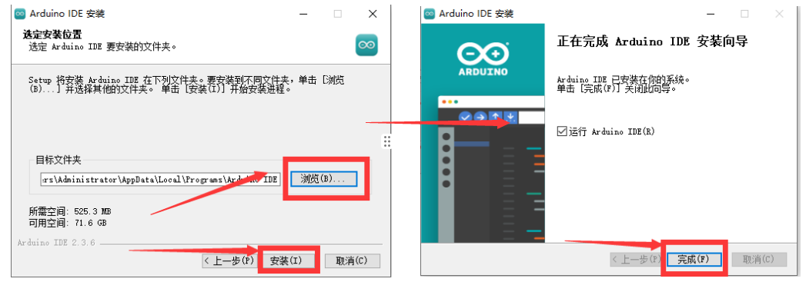

.. |image8| image:: ./media/image-20250604193725575.png
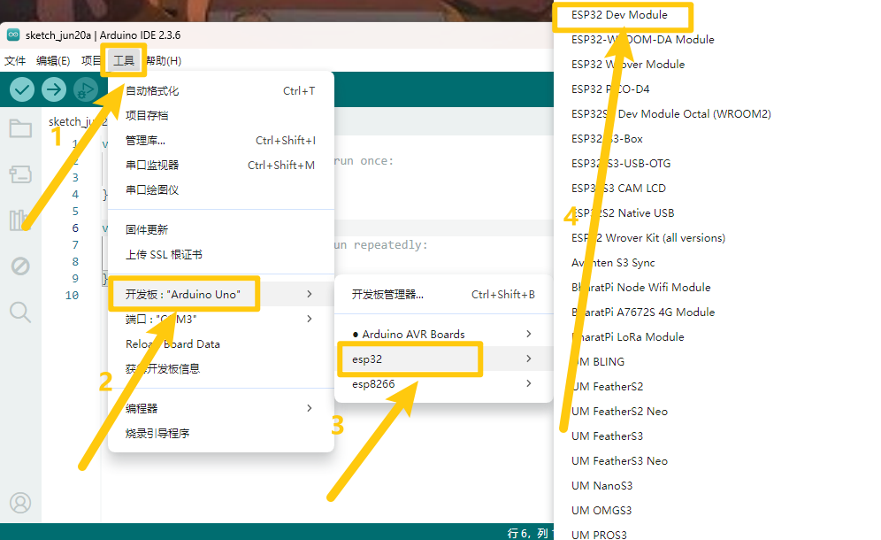
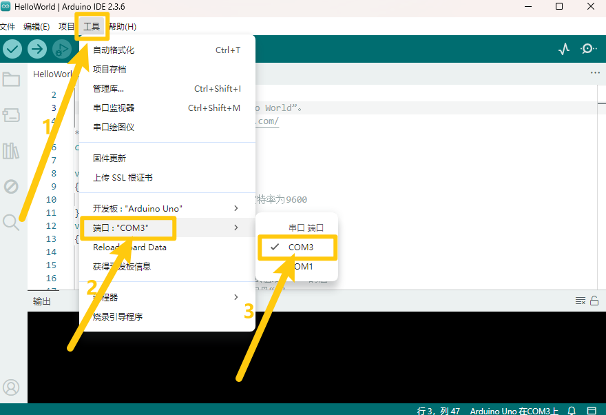
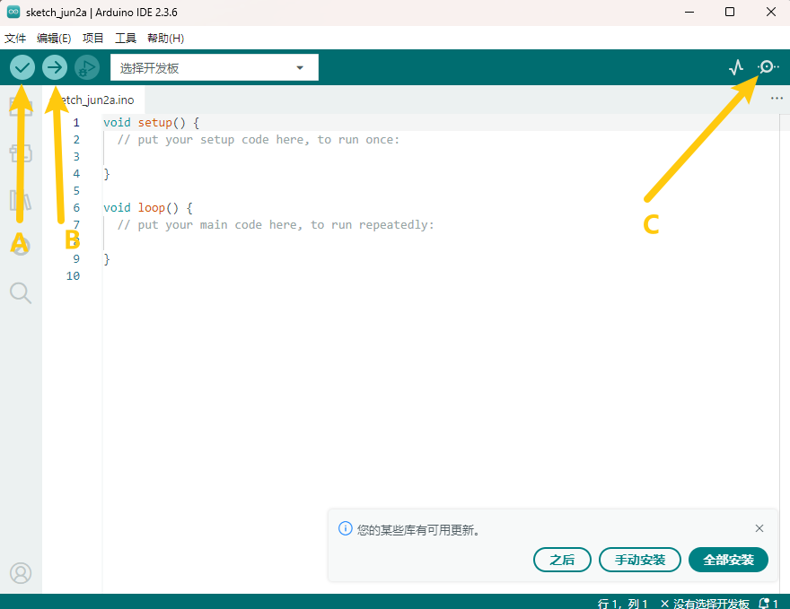

.. |image13| image:: ./media/image-20250604200612868.png
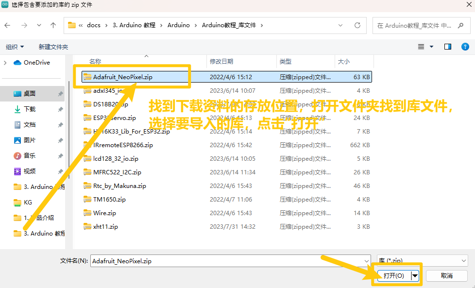
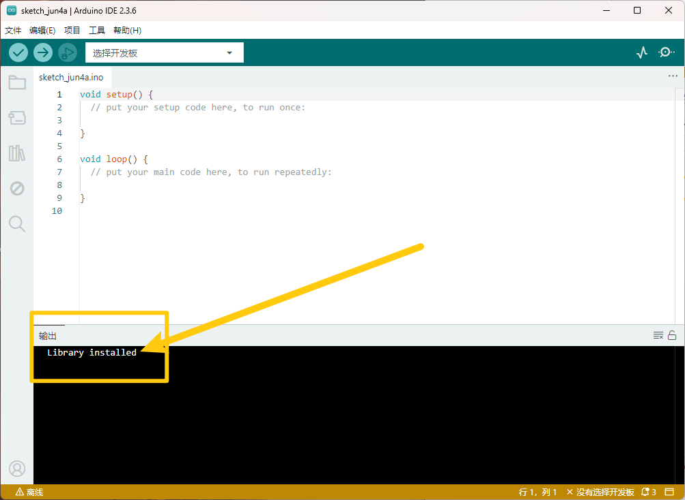
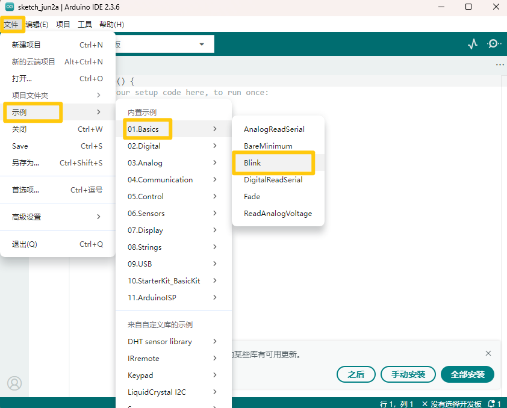
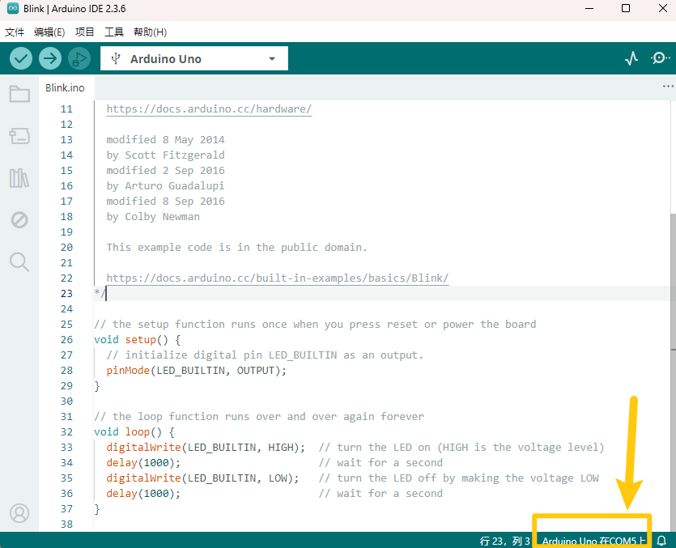

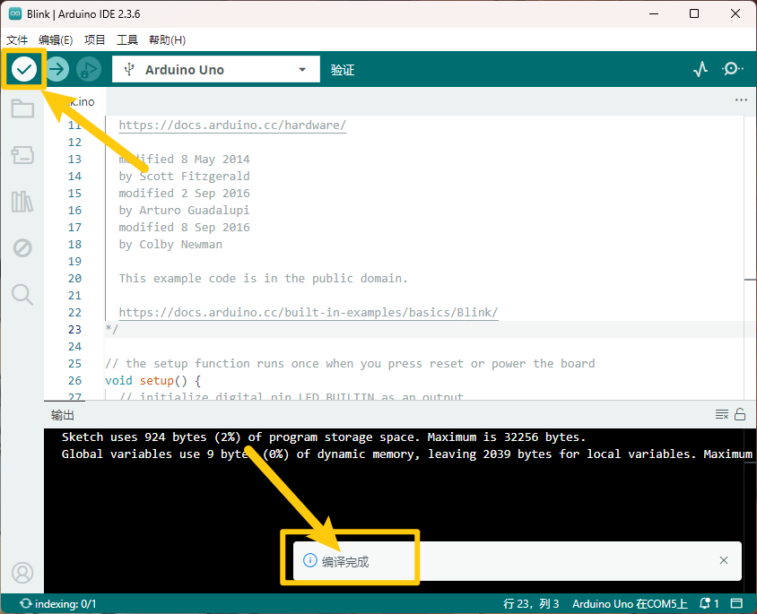
.. |image20| image:: ./media/image-20250604194343886.png
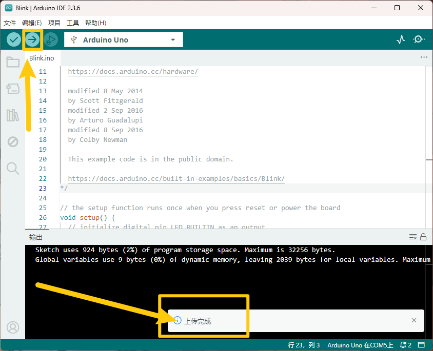
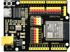
.. |image22| image:: ./media/USB.jpg
.. |image23| image:: ./media/06.jpg
.. |image24| image:: ./media/KE4001.png
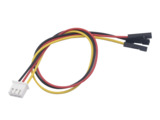
.. |image26| image:: ./media/USB.jpg

.. |image28| image:: ./media/5pin.jpg
.. |image29| image:: ./media/USB.jpg
.. |image30| image:: ./media/KE4043.png

.. |image32| image:: ./media/USB.jpg
.. |image33| image:: ./media/KE4001.png

.. |image35| image:: ./media/USB.jpg
.. |image36| image:: ./media/KE4074.png
.. |image37| image:: ./media/4pin.jpg
.. |image38| image:: ./media/USB.jpg
.. |image39| image:: ./media/KE4012.png

.. |image41| image:: ./media/USB.jpg
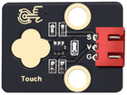

.. |image44| image:: ./media/USB.jpg
.. |image45| image:: ./media/KE4019.png

.. |image47| image:: ./media/USB.jpg
.. |image48| image:: ./media/KE4024.png

.. |USB| image:: media/USB.jpg
.. |image50| image:: ./media/KE4014.png

.. |image52| image:: ./media/USB.jpg
.. |image53| image:: ./media/KE4017.png

.. |image55| image:: ./media/USB.jpg
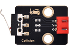

.. |image58| image:: ./media/USB.jpg
.. |image59| image:: ./media/KE4016.png

.. |image61| image:: ./media/USB.jpg
.. |image62| image:: ./media/KE4015.png

.. |image64| image:: ./media/USB.jpg
.. |image65| image:: ./media/KE4018.png

.. |image67| image:: ./media/USB.jpg
.. |image68| image:: ./media/KE4010.png

.. |image70| image:: ./media/USB.jpg
.. |image71| image:: ./media/KE4067.png

.. |image73| image:: ./media/USB.jpg
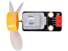
.. |image75| image:: ./media/4pin.jpg
.. |image76| image:: ./media/USB.jpg
.. |image77| image:: ./media/OR0266.png
.. |image78| image:: ./media/6.png
.. |image79| image:: ./media/KE4030.png

.. |image81| image:: ./media/USB.jpg
.. |image82| image:: ./media/KE4048.png

.. |image84| image:: ./media/USB.jpg
.. |image85| image:: ./media/KE4027.png

.. |image87| image:: ./media/USB.jpg
.. |image88| image:: ./media/KE4026.png

.. |image90| image:: ./media/USB.jpg
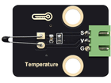

.. |image93| image:: ./media/USB.jpg
.. |image94| image:: ./media/KE4069.png

.. |image96| image:: ./media/USB.jpg
.. |image97| image:: ./media/KE4020.png
.. |image98| image:: ./media/4pin.jpg
.. |image99| image:: ./media/USB.jpg
.. |image100| image:: ./media/KE4029.png
.. |image101| image:: ./media/4pin.jpg
.. |image102| image:: ./media/USB.jpg
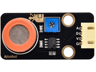
.. |image104| image:: ./media/4pin.jpg
.. |image105| image:: ./media/USB.jpg
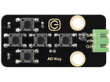

.. |image108| image:: ./media/USB.jpg
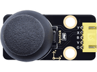
.. |image110| image:: ./media/5pin.jpg
.. |image111| image:: ./media/USB.jpg
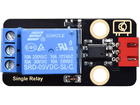

.. |image114| image:: ./media/USB.jpg
.. |image115| image:: ./media/KE4009.png

.. |image117| image:: ./media/USB.jpg
.. |image118| image:: ./media/KE4049.png
.. |image119| image:: ./media/5pin.jpg
.. |image120| image:: ./media/USB.jpg
.. |image121| image:: ./media/9G.jpg
.. |image122| image:: ./media/USB.jpg
.. |image123| image:: ./media/KE4039.png
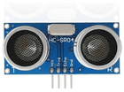
.. |image125| image:: ./media/4pin.jpg
.. |image126| image:: ./media/USB.jpg
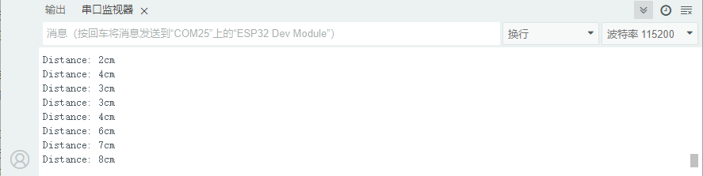
.. |image128| image:: ./media/KE4036.png
.. |image129| image:: ./media/remote_control.png

.. |image131| image:: ./media/USB.jpg
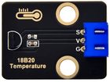

.. |image134| image:: ./media/USB.jpg
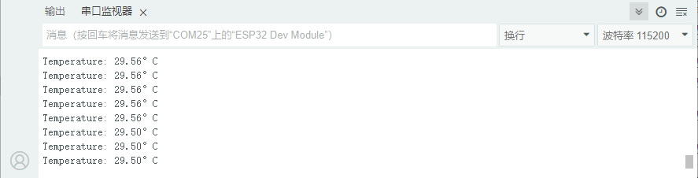
.. |image136| image:: ./media/KE4033.png

.. |image138| image:: ./media/USB.jpg
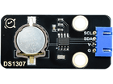
.. |image140| image:: ./media/4pin.jpg
.. |image141| image:: ./media/USB.jpg
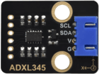
.. |image143| image:: ./media/4pin.jpg
.. |image144| image:: ./media/USB.jpg
.. |image145| image:: ./media/KE4060.png
.. |image146| image:: ./media/4pin.jpg
.. |image147| image:: ./media/USB.jpg
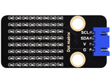
.. |image149| image:: ./media/4pin.jpg
.. |image150| image:: ./media/USB.jpg
.. |image151| image:: ./media/KE4061.png
.. |image152| image:: ./media/4pin.jpg
.. |image153| image:: ./media/USB.jpg
.. |image154| image:: ./media/KE4065.png
.. |image155| image:: ./media/4pin.jpg
.. |image156| image:: ./media/USB.jpg
.. |3210| image:: media/3210.png

.. |image157| image:: ./media/KE4012.png
.. |image158| image:: ./media/KE4001.png

.. |image160| image:: ./media/USB.jpg
.. |image161| image:: ./media/KE4019.png
.. |image162| image:: ./media/KE4010.png

.. |image164| image:: ./media/USB.jpg
.. |image165| image:: ./media/KE4018.png
.. |image166| image:: ./media/KE4010.png
.. |image167| image:: ./media/KE4001.png

.. |image169| image:: ./media/USB.jpg

.. |image171| image:: ./media/KE4020.png
.. |image172| image:: ./media/4pin.jpg
.. |image173| image:: ./media/USB.jpg
.. |image174| image:: ./media/OR0266.png
.. |image175| image:: ./media/6.png
.. |image176| image:: ./media/KE4049.png
.. |image177| image:: ./media/KE4074.png
.. |image178| image:: ./media/5pin.jpg
.. |image179| image:: ./media/4pin.jpg
.. |image180| image:: ./media/USB.jpg
.. |image181| image:: ./media/KE4030.png
.. |image182| image:: ./media/KE4001.png

.. |image184| image:: ./media/USB.jpg
.. |image185| image:: ./media/KE4048.png
.. |image186| image:: ./media/9G.jpg

.. |image188| image:: ./media/USB.jpg
.. |image189| image:: ./media/KE4027.png
.. |image190| image:: ./media/KE4001.png

.. |image192| image:: ./media/USB.jpg
.. |image193| image:: ./media/521301.png
.. |image194| image:: ./media/KE4010.png
.. |image195| image:: ./media/KE4020.png

.. |image197| image:: ./media/4pin.jpg
.. |image198| image:: ./media/USB.jpg
.. |image199| image:: ./media/KE4010.png
.. |image200| image:: ./media/KE4029.png
.. |image201| image:: ./media/KE4060.png

.. |image203| image:: ./media/4pin.jpg
.. |image204| image:: ./media/USB.jpg
.. |image205| image:: ./media/KE4010.png

.. |image207| image:: ./media/KE4060.png

.. |image209| image:: ./media/4pin.jpg
.. |image210| image:: ./media/USB.jpg
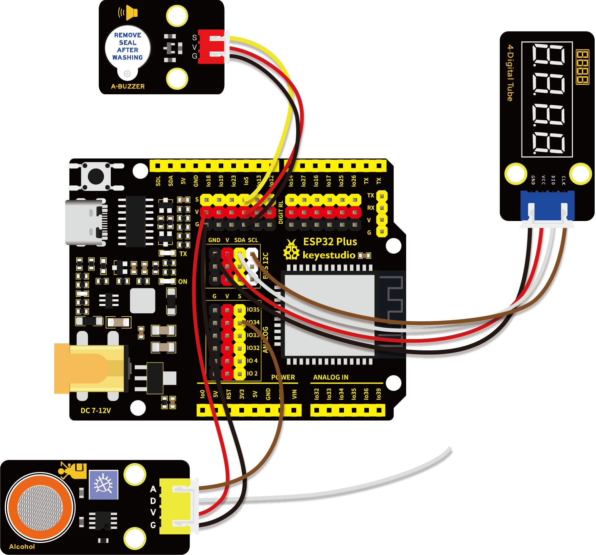

.. |image213| image:: ./media/KE4039.png
.. |image214| image:: ./media/KE4067.png
.. |image215| image:: ./media/KE4074.png
.. |image216| image:: ./media/KE4060.png

.. |image218| image:: ./media/4pin.jpg
.. |image219| image:: ./media/USB.jpg
.. |image220| image:: ./media/KE4036.png
.. |image221| image:: ./media/KE4001.png
.. |image222| image:: ./media/remote_control.png

.. |image224| image:: ./media/USB.jpg

.. |image226| image:: ./media/KE4060.png

.. |image229| image:: ./media/4pin.jpg
.. |image230| image:: ./media/USB.jpg
.. |image231| image:: ./media/OR0266.png
.. |image232| image:: ./media/6.png
.. |image233| image:: ./media/KE4065.png
.. |image234| image:: ./media/3210.png
.. |image235| image:: ./media/USB.jpg

.. |image237| image:: ./media/9G.jpg
.. |image238| image:: ./media/4pin.jpg
.. |image239| image:: ./media/KE4001.png

.. |image241| image:: ./media/USB.jpg
.. |image242| image:: ./media/serial-Bluetooth-terminal-APK.png
.. |image243| image:: ./media/USB.jpg
.. |image244| image:: ./media/USB.jpg
.. |image245| image:: ./media/USB.jpg
.. |image246| image:: ./media/KE4001.png
.. |image247| image:: ./media/KE4012.png
.. |image248| image:: ./media/KE4030.png
.. |image249| image:: ./media/KE4019.png

.. |image252| image:: ./media/KE4039.png
.. |image253| image:: ./media/KE4074.png
.. |image254| image:: ./media/USB.jpg

.. |image256| image:: ./media/4pin.jpg
.. |image257| image:: ./media/5pin.jpg

.. |image260| image:: ./media/KE4033.png

.. |image262| image:: ./media/9G.jpg

.. |image264| image:: ./media/4pin.jpg
.. |image265| image:: ./media/USB.jpg
.. |image266| image:: ./media/OR0266.png
.. |image267| image:: ./media/6.png
.. |image268| image:: ./media/pc.png

.. |image279| image:: ./media/651608.png
.. |image280| image:: ./media/651608.png
.. |image281| image:: ./media/651609.png
.. |image282| image:: ./media/651609.png
