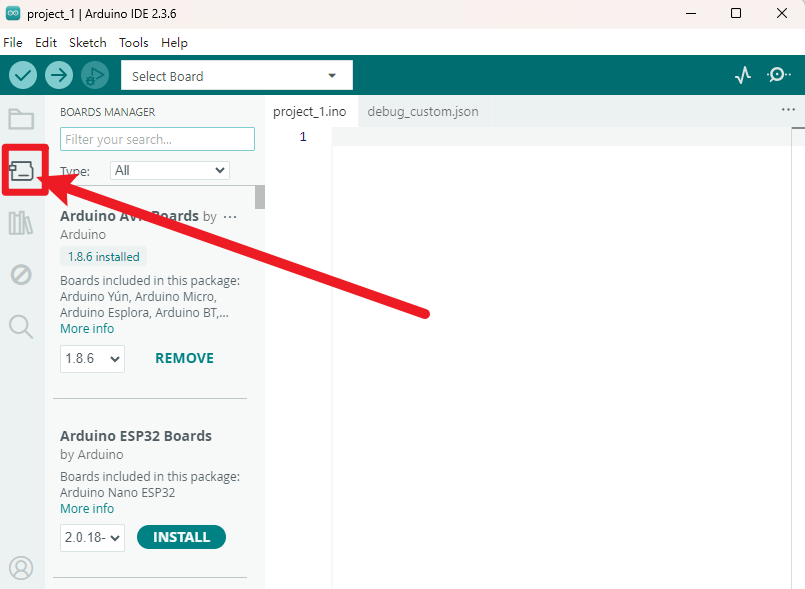
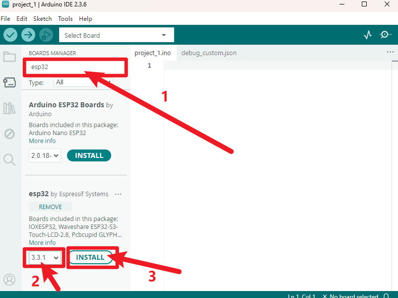
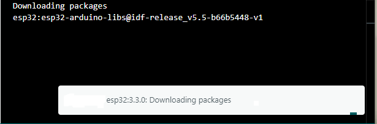
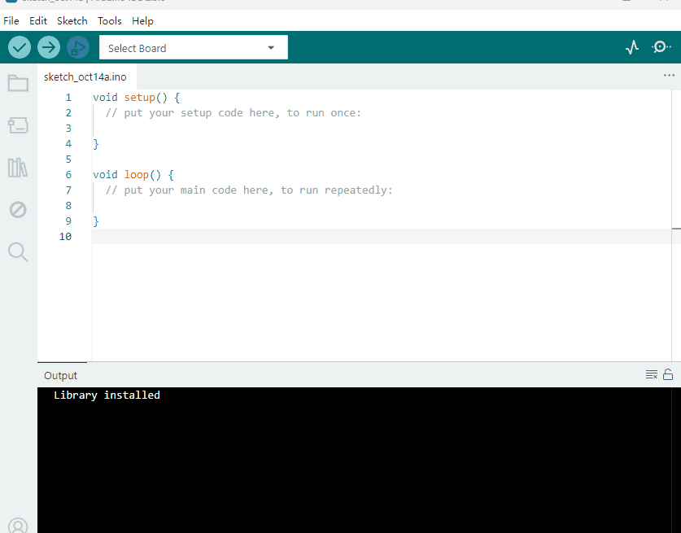

3. Arduino Tutorial
===================

3.1 Data download
-----------------

Arduino information contains library files and project code ,please
click to download for follow-up study.

Data download: :download:`Arduino Data <./Arduino.7z>`

3.2 Software Download
---------------------

When we get control board, we need to download Arduino IDE and driver
firstly.

You could download Arduino IDE from the official
website:https://www.arduino.cc/en/software.

There are various versions for Arduino,just download a suitable version
for your system,we will take WINDOWS system as an example to show you
how to download and install.

|image1|

You just need to click JUSTDOWNLOAD,then click the downloaded file to
install it.

And when the ZIP file is downloaded,you can directly unzip and start it.

|image2|

3.3 Installation and configuration of ESP32 environment
-------------------------

1. Click “File” and select “Preferences”.

   |image3|

2. Click“\ |image4| ”，Copy and paste the ESP32 development board link:
   ``https://espressif.github.io/arduino-esp32/package_esp32_index.json``
   into the text box, then click ‘**OK**’.

   |image5|

3. Click ‘OK’ again.

   |image6|

4. Click the small development board icon on the left to open the
   development board options.

|image7|

5. In the development board search box, search for “ESP32”, select
   version “3.2.1”, and click install.

|image8|

**Note: You can see the installation progress of the development board
in the lower right corner. Please wait a few minutes for the
installation to complete. During the installation, keep your network
stable. If the installation fails, repeat the above steps and reinstall
the development board.**

|image9|

3.4 Set Arduino IDE
-------------------

1、Connecting the board to the computer.

|image10|

3.5 Add Library
---------------

Libraries are a collection of code that makes it easy for you to connect
to a sensor,display, module, etc.

There are hundreds of additional libraries available on the Internet for
download.

We will introduce the most simple way for you to add libraries .

|image11|

.. |image1| image:: ./media/Animati.gif
.. |image2| image:: ./media/Animat.gif
.. |image3| image:: media/image-20251011164127663.png
.. |image4| image:: media/image-20251011162812091.png
.. |image5| image:: media/image-20251011165323871.png
.. |image6| image:: media/image-20251011165426044.png

.. |image10| image:: ./media/Anima.gif

3.6 Project
---------------

.. toctree::
    :maxdepth: 1

    Project/Project1
    Project/Project2
    Project/Project3
    Project/Project4
    Project/Project5
    Project/Project6
    Project/Project7
    Project/Project8
    Project/Project9
    Project/Project10
    Project/Project11
    Project/Project12
    Project/Project13
    Project/Project14
    Project/Project15
    Project/Project16
    Project/Project17
    Project/Project18
    Project/Project19
    Project/Project20
    Project/Project21
    Project/Project22
    Project/Project23
    Project/Project24
    Project/Project25
    Project/Project26
    Project/Project27
    Project/Project28
    Project/Project29
    Project/Project30
    Project/Project31
    Project/Project32
    Project/Project33
    Project/Project34
    

