3. Arduino Tutorial
===================

3.1 Data download
-----------------

Arduino information contains library files and project code ,please
click to download for follow-up study.

Data download: :download:`Arduino Data <./Arduino.7z>`

3.2 Software Download
---------------------

When we get control board, we need to download Arduino IDE and driver
firstly.

You could download Arduino IDE from the official
website:https://www.arduino.cc/en/software.

There are various versions for Arduino,just download a suitable version
for your system.

Windows:

|image1|

You just need to click JUSTDOWNLOAD,then click the downloaded file to
install it.

And when the ZIP file is downloaded,you can directly unzip and start it.

|image2|

Mac:

.. figure:: media/3.gif
   :alt: qqqq8

3.3 Set Arduino IDE
-------------------

Connecting the board to the computer.

|image3|

3.4 Add Library
---------------

What are Libraries ?

Libraries are a collection of code that makes it easy for you to connect
to a sensor,display, module, etc.

There are hundreds of additional libraries available on the Internet for
download.

We will introduce the most simple way for you to add libraries .

3.5 Project
-----------

Project 1 MPU6050 Basic Information
~~~~~~~~~~~~~~~~~~~~~~~~~~~~~~~~~~~

Note: G and GND on the expansion board are negative poles to connect
with G, GND and - on sensors, while V and VCC are positive poles to
connect with 5V power interfaces like V, VCC and +.

**1.MPU6050**

MPU6050 is a 6-axis motion processor(one 3-axis gyroscope and one 3-axis
accelerometer). The two sensors are integrated on one chip which can
detect static and dynamic motion states, including angular velocity,
angle and acceleration.

This module is equipped with a 16-pin ADC, which simultaneously reads
6-axis data. Thus, the angular speed, angular angle and the acceleration
of the object can be measured.

It also contains a temperature sensor to detect and monitor the
temperature of the chip when operating.

Furthermore, it incorporates an DMP (Digital Motion Processor) to
acquire the state of object from original data of gyroscope and
accelerometer.

|image4|

**2.Circuit diagram**

|image5|

+-----+------+--------------------------------------------------------------+
| No. | Name | Description                                                  |
+=====+======+==============================================================+
| 1   | GND  | Negative pole interface (0V)                                 |
+-----+------+--------------------------------------------------------------+
| 2   | VCC  | Positive pole interface (compatible with 3.3V and 5V)        |
+-----+------+--------------------------------------------------------------+
| 3   | SDA  | I2C Data Line. It connects to MCU to transmit data.          |
+-----+------+--------------------------------------------------------------+
| 4   | SCL  | I2C Clock Line. It connects to MCU to synchronize data       |
|     |      | transmission.                                                |
+-----+------+--------------------------------------------------------------+
| 5   | XDA  | I2C Data Line. It connects to external sensors to transmit   |
|     |      | data.                                                        |
+-----+------+--------------------------------------------------------------+
| 6   | XCL  | I2C Clock Line. It connects to external sensors to           |
|     |      | synchronize data transmission.                               |
+-----+------+--------------------------------------------------------------+
| 7   | AD0  | I2C sub-address. The address is 0x69 when the board is at a  |
|     |      | high level, while the address is 0x68 when at low.           |
+-----+------+--------------------------------------------------------------+
| 8   | INT  | An external interrupt pin. It detects MPU6050 internal       |
|     |      | interrupt time.                                              |
+-----+------+--------------------------------------------------------------+

- Operating voltage: 3.3V, 5V
- Static current: 5μA
- Rotating current: 3mA
- Maximum rotation speed: 2000°/s
- Acceleration scales: ±2g, ±4g, ±8g, ±16g
- Temperature range: –10°C ~ +65°C

**\*For detailed parameters, please refer to the data sheet.\***

**3.Gyroscope**

A gyroscope, also called rotating angular ratemeter, is a device used to
measure rotation speed.

Generally, a gyroscope consists of a magnetoresistor (measuring the
gyroscopic force), amplifying and adjusting circuits, and an output
circuit.

The gyroscope accurately measures the rotation speed to get precise
information. Virtually, it is usually applied in vehicle driving
direction detection, aircraft attitude angle measurement as well as
precision instrument control systems.

|image6|

**4.Accelerometer**

An accelerometer measures the acceleration of gravity to calculate the
tilt angle of a device relative to the horizon and to deduce the
movement way of the device.

It also allows robots to know their surroundings and attitudes, and is
even utilized to analyze engine vibration.

**MPU6050adopts gyroscope to measure angles and uses accelerometer to
measure the acceleration.**

**5.Acquire Data**

MPU-6050 boasts I2C serial communication protocol to acquire data.

I2C(Inter-Integrated Circuit, or IIC) is also called two-wire system or
TWI (Two-Wire Interface), which is a two-wire bus communication protocol
in a host-subordinate model.

The biggest advantage of I2C is that it transmits data only by two
wires. In addition, its bus connects 127 nodes in parallel for multiple
host devices, and slave devices generally do not need an external power
supply as the bus transfers power to them.

|image7|

Please pay attention that, the host device manipulates clock signals and
data transmission, while the slave ones only receives.

I2C bus is composed of SCL (Serial Clock takes charge of the clock
signal) and SDA (Serial Data controls data transmission), and it uses an
8-digit transmission mode. Usually, a byte contains nine clock signals,
eight of which transmit data and the last one indicates the end of
transmission.

Meanwhile, the bus supports multiple bytes transmission by repeating the
previous process.

Basic parts of I2C protocol:

- Starting signal: Before sending data, the sender transmits a starting
  signal to inform the receiver to prepare for receiving.
- Address code: It tells the receiver that to whom the data is to be
  sent.
- Data: It is transmitted through one byte each time.
- Stopping signal: The sender ends the data in a stopping signal to note
  the receiver to prepare for stopping receive.

Serial Port Protocol Timing:

**For more details, please refer to :** https://www.nxp.com/

|image8|

|image9|

Arduino provides an I2C protocol collection named as Wire.h, so you can
directly call its functions to realize I2C and I2C/TWI devices
communication.

For detailed introduction, please refer to:
https://www.arduino.cc/reference/en/language/functions/communication/wire/

**6.Wiring**

Connect Arduino NANO mainboard and MPU6050 to the expansion board.

|image10|

Connect Arduino NANO to your computer via a USB cable and open Arduino
IDE.

**7.Data Acquiring Process**

Flow chart 1：

|image11|

Flow chart 2：

|image12|

Acquire Sensor ID

Obtain the internal ID of MPU6050 and compare it with the counterpart in
the data sheet (0x68).

Code

::

   //Acquire the ID value of MPU6050 sensor

   uint8_t c = mpu.readByte(MPU6050_ADDRESS, WHO_AM_I_MPU6050);

Set Data Scales

Set the scales of gyroscope and accelerometer. Refer to the register
sheet and we know:

Resolution of Accelerometer:

|image13|

Resolution of Gyroscope:

|image14|

Code

::

   //scales are as followings:
   // GFS_250DPS:250 DPS (0x00), GFS_500DPS:500 DPS (0x01)
   // GFS_1000DPS:1000 DPS (0x10), GFS_2000DPS:2000 DPS (0x11)
   // AFS_2G:2 Gs (0x00), AFS_4G: 4 Gs (0x01)
   // AFS_8G:8 Gs (0x10), AFS_16G:16 Gs  (0x11)
   //Set the scales of MPU6050 sensor.

   mpu.settings(AFS_2G, GFS_250DPS); 

Self-Test

Upload the self-test code to ensure the accurate data and effective
output.

Code

::

   //[use in step()] MPU6050 inspects itself and stores 3-axis data of accelerometer  and gyroscope in SelfTest[6]. 

   //Set the scales of acceleration to 8g and scales of gyroscope to 250dps when they are in their self-test.

   // Self-test value storing container

   float SelfTest[6];        

   // MPU6050 conducts a self-test

   mpu.MPU6050SelfTest(SelfTest); 

Calibration

Upload the calibration code.

Readings are impacted by temperature, humidity, vibration and external
magnetic field. Thus, a calibration process guarantees the accuracy.

Code

::

   //[Use in step()] calibrate accelerometer  and gyroscope, and load biases in the bias register and store the values in gyroBias[3] and accelBias[3].

   float gyroBias[3] = {0, 0, 0}; // Correct gyroscope and accelerometer  bias. 

   float accelBias[3] = {0, 0, 0};

   mpu.calibrateMPU6050(gyroBias, accelBias);

Initialization

Initialize the device.

Cut off the interrupt interface and AUX IIC interface, ban FIFO, and set
the gyroscope sampling rate and the DLPF.

This step can calibrate the sensor to make sure a normal state.

Code

::

   //[use in step()] initialize MPU6050

   mpu.initMPU6050();

Data Preparation

Check whether data are prepared for collection.

Code

::

   //Determine whether data are prepared

   if(mpu.readByte(MPU6050_ADDRESS, INT_STATUS) & 0x01)
   {
   }

Read Sensor Data

Read the value of the accelerometer, gyroscope and temperature sensor.

Code

::

   //Read the initial value of accelerometer, gyroscope and temperature senor

   int16_t accelCount[3];      // Store 16-bit signed output of accelerometer

   int16_t gyroCount[3];      // Store 16-bit signed output of gyroscope

   int16_t tempCount;        // Store the real internal chip temperature in degrees Celsius

    

   // Read the initial value of accelerometer

   mpu.readAccelData(accelCount);

   // Read the initial value of gyroscope

   mpu.readGyroData(gyroCount);

   //Read the initial value of temperature sensor

   tempCount = mpu.readTempData();

**8.Test Results**

Place the expansion board smoothly, press and hold the reset button. The
more balanced the MPU6050 is, the more accurate the data it acquired
will be.

Open Arduino IDE serial monitor, and you will see that the angular
speed, gyroscope data and temperature refresh per 0.5s.

|image15|

1. The initialization of MPU6050 will spend about 3s. Initialize it once
   only. Please put the expansion board and MPU6050 smoothly in
   initialization.
2. Initial acceleration value of MPU6050.
3. Initial gyroscope value of MPU6050.
4. Initial temperature value of MPU6050.

**9.Test Code**

::

   #include <MPU6050.h>

   MPU6050lib mpu;
   int16_t accelCount[3];      // Store 16-bit signed output of accelerometer 
   int16_t gyroCount[3];      // Store 16-bit signed output of gyroscope
   int16_t tempCount;        // Store the real internal chip temperature in degrees Celsius

   float gyroBias[3] = {0, 0, 0}; // Correct gyroscope and accelerometer  bias。
   float accelBias[3] = {0, 0, 0};
   float SelfTest[6];        // Self-test value storing container。

   void setup()
   {
     Wire.begin();
     Serial.begin(9600);
      
     // Read the WHO_AM_I register, this is a good test of communication
     // Read WHO_AM_I register for MPU-6050
      
     uint8_t c = mpu.readByte(MPU6050_ADDRESS, WHO_AM_I_MPU6050);  
     Serial.print("I AM ");
     Serial.print(c, HEX);
      
     //Set the minimum scale if the device is in self-test
     // Possible gyro scales (and their register bit settings) are: 
     // 250 DPS (0x00), 500 DPS (0x01), 1000 DPS (0x10), and 2000 DPS  (0x11).
     // Possible accelerometer scales (and their register bit settings) are:
     // 2 Gs (0x00), 4 Gs (0x01), 8 Gs (0x10), and 16 Gs  (0x11).

     mpu.settings(AFS_8G, GFS_250DPS);// version WHO_AM_I should always be 0x68 //MPU6050 address 1: 0x68, address 2: 0x98

     if (c == 0x68 || c == 0x98) 
     {
       Serial.println("MPU6050 is online...");// Start by performing self test.
       mpu.MPU6050SelfTest(SelfTest);
       if (SelfTest[0] < 1.0f && SelfTest[1] < 1.0f && SelfTest[2] < 1.0f && SelfTest[3] < 1.0f && SelfTest[4] < 1.0f && SelfTest[5] < 1.0f) 
       {
         Serial.println("Pass Selftest!");// Calibrate gyro and accelerometers, load biases in bias registers
         mpu.calibrateMPU6050(gyroBias, accelBias);
         mpu.settings(AFS_2G, GFS_250DPS);
         mpu.initMPU6050();// Initialize device for active mode read of accelerometer , gyroscope, and temperature.
         Serial.println("MPU6050 initialized for active data mode...."); 
       }
       else
       {
         Serial.print("Could not connect to MPU6050: 0x");
         Serial.println(c, HEX);// Loop forever if communication doesn't happen
         while (1) ; 
       }
     }
   }

   void loop()
   {
     // If data ready bit set, all data registers have new data
     // check if data ready interrupt
     if (mpu.readByte(MPU6050_ADDRESS, INT_STATUS) & 0x01) 
     {
       // Read the x/y/z adc values
       mpu.readAccelData(accelCount);
       // Read the x/y/z adc values
       mpu.readGyroData(gyroCount);
       Serial.println("--------");
       Serial.print("Accel X:");
       Serial.println(accelCount[0]);
       Serial.print("Accel Y:");
       Serial.println(accelCount[1]);
       Serial.print("Accel Z:");
       Serial.println(accelCount[2]);
       Serial.println("--------");
       Serial.print("Gyro X:");
       Serial.println(gyroCount[0]);
       Serial.print("Gyro Y:");
       Serial.println(gyroCount[1]);
       Serial.print("Gyro Z:");
       Serial.println(gyroCount[2]);
       Serial.println("--------");
       // Read the x/y/z adc values
       tempCount = mpu.readTempData();
       // Temperature in degrees Centigrade
       Serial.print("Initial TEMP values:");
       Serial.println(tempCount);
       Serial.println("--------");
       delay(500);
     }
   }

**10. Expansion Code**

The initial temperature value of MPU6050 cannot be applied in our daily
use, hence it needs to be converted to the usual unit.

Conversion Formula：

.. math::

   Temperature in degrees C =\frac{TEMPOUT Register Value as a signed quantity}{340} + 36.53

::

   #include <MPU6050.h>
   MPU6050lib mpu;
   int16_t tempCount;        // Store the real internal chip temperature in degrees Celsius

   float temperature;        // Store the actual temperature in degrees Centigrade
   float gyroBias[3] = {0, 0, 0}; // Correct gyroscope and accelerometer  bias
   float accelBias[3] = {0, 0, 0};
   float SelfTest[6];        // Self-test value storing container

   void setup()
   {
     Wire.begin();
     Serial.begin(9600);
     // Read the WHO_AM_I register, this is a good test of communication
     // Read WHO_AM_I register for MPU-6050
     uint8_t c = mpu.readByte(MPU6050_ADDRESS, WHO_AM_I_MPU6050);  
     Serial.print("I AM ");
     Serial.print(c, HEX);
     //Set the minimum scales if the device is in self-test
     // Possible gyro scales (and their register bit settings) are: 
     // 250 DPS (0x00), 500 DPS (0x01), 1000 DPS (0x10), and 2000 DPS  (0x11).
     // Possible accelerometer scales (and their register bit settings) are:
     // 2 Gs (0x00), 4 Gs (0x01), 8 Gs (0x10), and 16 Gs  (0x11).
     mpu.settings(AFS_8G, GFS_250DPS);
     // version WHO_AM_I should always be 0x68 //MPU6050 address 1: 0x68, address 2: 0x98.
     if (c == 0x68 || c == 0x98) 
     {
       Serial.println("MPU6050 is online...");// Start by performing self test.
       mpu.MPU6050SelfTest(SelfTest);
       if (SelfTest[0] < 1.0f && SelfTest[1] < 1.0f && SelfTest[2] < 1.0f && SelfTest[3] < 1.0f && SelfTest[4] < 1.0f && SelfTest[5] < 1.0f) 
       {
         Serial.println("Pass Selftest!");// Calibrate gyro and accelerometers, load biases in bias registers.
         mpu.calibrateMPU6050(gyroBias, accelBias);
         mpu.settings(AFS_2G, GFS_250DPS);
         mpu.initMPU6050();// Initialize device for active mode read of accelerometer , gyroscope, and temperature
         Serial.println("MPU6050 initialized for active data mode...."); 
       }
       else
       {
         Serial.print("Could not connect to MPU6050: 0x");
         Serial.println(c, HEX);// Loop forever if communication doesn't happen.
         while (1) ; 
       }
     }
   }

   void loop()
   {
       // If data ready bit set, all data registers have new data.
       // check if data ready interrupt.
     if (mpu.readByte(MPU6050_ADDRESS, INT_STATUS) & 0x01) 
     {
       tempCount = mpu.readTempData(); // Read the x/y/z adc values.
       temperature = ((float) tempCount) / 340. + 36.53; // Temperature in degrees Centigrade
     }
     Serial.println("--------");// Temperature in degrees Centigrade
     Serial.print("TEMP values:");
     Serial.println(temperature);
     Serial.println("--------");
     delay(500);
   }

Output the actual temperature value:

|image16|

Project 2 MPU6050 Attitude
~~~~~~~~~~~~~~~~~~~~~~~~~~

Make an Attitude Fusion Solution on the accelerometer and gyroscope
data.

To solve problems of universal joint deadlock of Euler Angles and to
simplify calculation, a quaternion (three real numbers and an imaginary
number) is adopted to represent the attitude in an Attitude Fusion
Solution.

After processing, the quaternion converts into Euler Angle, which gets
more precise rotation information to control drones, mobile robots and
other devices.

**1.Attitude**

MPU6050 measures the attitude of an object in three dimensions: Roll,
Pitch and Yaw. It also detects the acceleration to gain the speed and
position after calculation.

Three-Axis:

|image17|

An Euler Angle is a rotation angle of an object in three dimensional
space whose axis is arbitrarily adjustable.

It includes three angles: Roll Angle, Pitch Angle and Yaw Angle.

+--------------+-------------------------------------------------------+
| Roll Angle   | A rotation angle with x-axis as the rotational axis   |
+==============+=======================================================+
| **Pitch      | **A rotation angle with y-axis as the rotational      |
| Angle**      | axis**                                                |
+--------------+-------------------------------------------------------+
| **Yaw        | **A rotation angle with z-axis as the rotational      |
| Angle**      | axis**                                                |
+--------------+-------------------------------------------------------+

|image18|

When acquiring Yaw Angle, MPU6050 internal gyroscope automatically
calibrates and sets its own angle to 0, which will cause a Yaw Angle
Null Shift.

A Null shift, which is unavoidable and limited by hardware, is an effect
that the detected data occasionally drifts from its null point.

Therefore, we add a magnetometer to calibrate MPU6050.

Hence, in the following tutorials, our main contents are Roll Angle and
Pitch Angle.

**2.Acquire Attitude**

In a filtering algorithm, errors reduce and 6-axis data are converted
into quaternions, which will then convert to Euler Angle to indicate the
concrete data of attitude.

Ways to acquire quaternions:

1. Use the built-in DMP. An embedded motion driver library is prepared
   for outputting attitude solutions quaternions.
2. Use the high-efficiency locating filter of Sebastian Madgwick.

This filter adopts a modelless estimation algorithm to estimate the
attitude for inertia/magnetic sensor arrays.

The computational intensity of the quaternion filtering algorithm is
much small. This is the reason why it can operate on Arduino Pro Mini
development board with a speed of 8MHz.

In the algorithm, the change angle is expressed as a quaternion, and it
effectively filters out noises and reduces positioning errors.

Attitude estimation formula:

.. math::

   (Δφ = qt * qt-1)

.. math::

   qt+1 = qt + (1/α) * Δφ

Δφ: the difference value of quaternions, which represents the change
angle between two quaternons.

qt: the current quaternon (present attitude)

qt-1: the last read quaternon (last attitude)

qt+1: the next quaternon (next attitude), which is calculated through
the current quaternion and its difference.

α: an adjustable parameter, which controls the sensitivity of the
filter.

**3.Wiring**

|image19|

Install MPU6050 on the expansion board and connect it to your computer
via USB cable.

**4.Attitude Acquiring Process**

Flow chart:

|image20|

Convert Accelerometer Data

Convert the underlying data of accelerometer into the actual data.

Acceleration Calculation Formula:

.. math::

   Acceleration=\frac{Original Acceleration Value}{Data Resolution}(m/s^2)

For example, set the scale to ±2g. If the reading of ADC is ±32768，ADC
value of 1g is +32768/2=16384LSB/g.

Code

::

   mpu.readAccelData(accelCount); //Read the x/y/z adc values

   aRes = mpu.getAres();//Now we'll calculate the accleration value into actual g's    

   ax = (float)accelCount[0] * aRes; //get actual g value, this depends on scale being set

   ay = (float)accelCount[1] * aRes;

   az = (float)accelCount[2] * aRes;

Convert Gyroscope Data

Convert the underlying data of gyroscope into the actual data.

Angular Speed Calculation Formula:

.. math::

   Angular Speed=\frac{Original Angular Speed Value}{Data Resolution}(°/s)

ADC output range is ±32768.

If we set the measuring range to ±2000°/s, and original ADC reading is
300, the data resolution will be 32768/2000=16.384LSB/(°/s), and the
angular speed will be 300/16.384=18.3105(°/s).

Code

::

   mpu.readGyroData(gyroCount);    // Read the x/y/z adc values

   gRes = mpu.getGres();       //Acquire the converted value

   // Calculate the gyro value into actual degrees per second

   gyrox = (float)gyroCount[0] * gRes; // get actual gyro value, this depends on scale being set

   gyroy = (float)gyroCount[1] * gRes;

   gyroz = (float)gyroCount[2] * gRes;

Calculate Integration Interval

Acquire the time to calculate the integration interval, and convert it
to quaternion .

Code

::

   // Acquire the current time of the system in ms

   Now = micros();

   // set integration time by time elapsed since last filter update

   deltat = ((Now - lastUpdate) / 1000000.0f);

   lastUpdate = Now;

   if(lastUpdate - firstUpdate > 10000000uL) 
   {

     beta = 0.041; // decrease filter gain after stabilized

     zeta = 0.015; // increase gyro bias drift gain after stabilized

   }

Convert 6-Axis Data to Quaternion

Convert the accelerometer and gyroscope data into quaternion.

Each axis value needs to be translated into a radian before quaternion
conversion.

According to proportional relation,“gyrox \* PI / 180.0f”means the
conversion of gyrox angle to radian, as radians belong to angular
measurement while angles are circular measurement.

Code

::

   // convert gyroscope data to 

   gyrox = gyrox  * PI / 180.0f;

   gyroy = gyroy * PI / 180.0f;

   gyroz = gyroz * PI / 180.0f;

   // Quaternion conversion function

   MadgwickQuaternionUpdate(ax, ay, az, gyrox, gyroy, gyroz);

Quaternion Conversion Function

Quaternion filter computational function.

Define variables, including bias, auxiliary operation values, norm and
Jacobian elements.

Flow chart：

1. First calculate the vector norm of acceleration, and its norm is the
   length of vector. Here is the formula:

.. math::

   norm = sqrt (ax * ax + ay * ay + az * az)

(ax, ay and az respectively means the acceleration on axis x, y and z)

2. Calculate Jacobian.
3. Compute the gradient via Jacobian multiplication.
4. Normalize gradient.
5. Compute estimated gyroscope biases.
6. Compute and remove gyroscope biases.
7. Compute the quaternion derivative.
8. Integrate estimated quaternion derivative.
9. Normalize the quaternion.

Code

::

   // Implementation of Sebastian Madgwick's "...efficient orientation filter for... inertial/magnetic sensor arrays".
   // which fuses acceleration and rotation rate to produce a quaternion-based estimate of relative.
   // device orientation -- which can be converted to yaw, pitch, and roll. Useful for stabilizing quadcopters, etc.
   // The performance of the orientation filter is at least as good as conventional Kalman-based filtering algorithms.
   // but is much less computationally intensive---it can be performed on a 3.3 V Pro Mini operating at 8 MHz!

   void MadgwickQuaternionUpdate(float ax, float ay, float az, float gyrox, float gyroy, float gyroz)
   {
       // short name local variable for readability.
       float q1 = q[0], q2 = q[1], q3 = q[2], q4 = q[3]; 
       
       // vector norm.
       float norm;
       
       // objective function elements.
       float f1, f2, f3;
       
       // objective function Jacobian elements.
       float J_11or24, J_12or23, J_13or22, J_14or21, J_32, J_33; 
       float qDot1, qDot2, qDot3, qDot4;
       float hatDot1, hatDot2, hatDot3, hatDot4;
       
       // gyro bias error.
       float gerrx, gerry, gerrz, gbiasx, gbiasy, gbiasz;

       // Auxiliary variables to avoid repeated arithmetic.
       float _halfq1 = 0.5f * q1;
       float _halfq2 = 0.5f * q2;
       float _halfq3 = 0.5f * q3;
       float _halfq4 = 0.5f * q4;
       float _2q1 = 2.0f * q1;
       float _2q2 = 2.0f * q2;
       float _2q3 = 2.0f * q3;
       float _2q4 = 2.0f * q4;
       float _2q1q3 = 2.0f * q1 * q3;
       float _2q3q4 = 2.0f * q3 * q4;

       // Normalize accelerometer measurement.
       norm = sqrt(ax * ax + ay * ay + az * az);
       if (norm == 0.0f) return; // handle NaN
       norm = 1.0f/norm;
       ax *= norm;
       ay *= norm;
       az *= norm;

       // Compute the objective function and Jacobian.
       f1 = _2q2 * q4 - _2q1 * q3 - ax;
       f2 = _2q1 * q2 + _2q3 * q4 - ay;
       f3 = 1.0f - _2q2 * q2 - _2q3 * q3 - az;
       J_11or24 = _2q3;
       J_12or23 = _2q4;
       J_13or22 = _2q1;
       J_14or21 = _2q2;
       J_32 = 2.0f * J_14or21;
       J_33 = 2.0f * J_11or24;

       // Compute the gradient (matrix multiplication).
       hatDot1 = J_14or21 * f2 - J_11or24 * f1;
       hatDot2 = J_12or23 * f1 + J_13or22 * f2 - J_32 * f3;
       hatDot3 = J_12or23 * f2 - J_33 *f3 - J_13or22 * f1;
       hatDot4 = J_14or21 * f1 + J_11or24 * f2;

       // Normalize the gradient.
       norm = sqrt(hatDot1 * hatDot1 + hatDot2 * hatDot2 + hatDot3 * hatDot3 + hatDot4 * hatDot4);
       hatDot1 /= norm;
       hatDot2 /= norm;
       hatDot3 /= norm;
       hatDot4 /= norm;
    
       // Compute estimated gyroscope biases.
       gerrx = _2q1 * hatDot2 - _2q2 * hatDot1 - _2q3 * hatDot4 + _2q4 * hatDot3;
       gerry = _2q1 * hatDot3 + _2q2 * hatDot4 - _2q3 * hatDot1 - _2q4 * hatDot2;
       gerrz = _2q1 * hatDot4 - _2q2 * hatDot3 + _2q3 * hatDot2 - _2q4 * hatDot1;

       // Compute and remove gyroscope biases.
       gbiasx += gerrx * deltat * zeta;
       gbiasy += gerry * deltat * zeta;
       gbiasz += gerrz * deltat * zeta;
       gyrox -= gbiasx;
       gyroy -= gbiasy;
       gyroz -= gbiasz;

       // Compute the quaternion derivative.
       qDot1 = -_halfq2 * gyrox - _halfq3 * gyroy - _halfq4 * gyroz;
       qDot2 =  _halfq1 * gyrox + _halfq3 * gyroz - _halfq4 * gyroy;
       qDot3 =  _halfq1 * gyroy - _halfq2 * gyroz + _halfq4 * gyrox;
       qDot4 =  _halfq1 * gyroz + _halfq2 * gyroy - _halfq3 * gyrox;

       // Compute then integrate estimated quaternion derivative.
       q1 += (qDot1 -(beta * hatDot1)) * deltat;
       q2 += (qDot2 -(beta * hatDot2)) * deltat;
       q3 += (qDot3 -(beta * hatDot3)) * deltat;   
       q4 += (qDot4 -(beta * hatDot4)) * deltat;

       // Normalize the quaternion.
       norm = sqrt(q1 * q1 + q2 * q2 + q3 * q3 + q4 * q4);   // normalize quaternion
       norm = 1.0f/norm;
       q[0] = q1 * norm;
       q[1] = q2 * norm;
       q[2] = q3 * norm;
       q[3] = q4 * norm;
   }

Project 3 Bluetooth Data Transmission
~~~~~~~~~~~~~~~~~~~~~~~~~~~~~~~~~~~~~

**1.Hardware Overview**

Master Bluetooth module (straight-pin version):

|image21|

The DX-BT24 master Bluetooth module uses the Dialog 14531 chip, complies
with the BLE 5.1 protocol, and provides transparent wireless
transmission via UART.

Default serial settings: **9600 bps / 8 data bits / no parity / 1 stop
bit**.

Key features

- Flexible baud-rate and name configuration
- Ultra-low power: 2 µA
- Master/slave LOS range: 20 m / 90 m
- Up to 115 200 bps transparent throughput

**2.Wiring**

======= ===========
Arduino BT24 Master
======= ===========
RX      TX
TX      RX
VCC     VCC
GND     GND
======= ===========

Example hookup

|image22|

**3.BT24 One-Click Master–Slave Pairing (No AT Commands)**

This method requires **no AT commands**—the first pairing and bind
information are completed solely with the **on-board buttons**.

**(1)Procedure**

(The gesture-control kit includes a BT24 master module. A BT24 slave
module—typically mounted on a smart car—must be purchased separately.
The demo below uses the keyestudio mecanum-wheel car.)

Prepare

Both BT24 modules (master and slave) are powered correctly and not
connected to other devices.

After power-up, both indicator LEDs blink, meaning “not connected”.

|image23|

Press Buttons Simultaneously

**Long-press** the buttons on both modules for about 3–5 s until the
LEDs on both sides **change from blinking to solid ON**

- Blinking → searching/pairing
- Solid ON → paired and connected

|image24|

Pairing Complete

Release the buttons. A steady LED indicates that the **transparent link
is established** and will auto-reconnect after power loss.

|image25|

**(2)Status & Indicator LED**

+----------------+-------------------+--------------------------------+
| LED State      | Module Status     | Action                         |
+================+===================+================================+
| Blinking       | Not connected /   | No action needed, or           |
|                | waiting to pair   | long-press again to enter      |
|                |                   | pairing                        |
+----------------+-------------------+--------------------------------+
| Solid ON       | Connected /       | Ready to send & receive data   |
|                | transparent link  |                                |
|                | open              |                                |
+----------------+-------------------+--------------------------------+
| Blinking       | Clear binding     | Short-press once to erase      |
| (after short   |                   | pairing info                   |
| press)         |                   |                                |
+----------------+-------------------+--------------------------------+

To pair with a new device: short-press the buttons on master and slave →
LEDs blink → repeat steps 3.1.

**4.Arduino Sending Example**

|image26|

Insert the **BT24 Bluetooth master module** into the expansion board and
upload the following sketch to the **Nano board**:

::

   /* lesson_3_master_send.ino
      Continuously sends characters A and B to the paired slave */
      
   void setup() 
   {
     Serial.begin(9600);       // Must match BT24 master/slave baud rate
   }

   void loop() 
   {
     Serial.println("A");
     delay(500);
     Serial.println("B");
     delay(500);
   }

When uploading code, **remove the BT24 module first** to avoid
serial-port conflict.

Re-insert the module after programming is finished.

**5.Transmission Verification**

1. Master and slave LEDs are solid ON (connection OK).
2. Connect the slave to a PC with a second USB-to-Serial adapter and
   open a serial monitor at 9600 bps.
3. You should see the strings **“A”** and **“B”** alternating every 0.5
   s:

|image27|

This confirms that the master’s data is transparently transmitted to the
slave.

**6.Common Troubleshooting**

+-----------------+-----------------------------------------------------+
| Symptom         | Checklist                                           |
+=================+=====================================================+
| No serial       | 1. Master/slave not connected: are LEDs             |
| output          | blinking?2.Baud rate mismatch between Arduino Nano  |
|                 | and BT24                                            |
+-----------------+-----------------------------------------------------+
| Garbled text    | Monitor baud rate differs from module setting       |
+-----------------+-----------------------------------------------------+
| Cannot enter    | 1.Were both buttons held simultaneously until LEDs  |
| pairing         | blinked?2.Old binding not cleared—short-press to    |
|                 | erase, then retry                                   |
+-----------------+-----------------------------------------------------+

You have now completed **data transmission from the BT24 master to the
slave** and can extend this approach to more complex wireless
communication scenarios.

Project 4 Gesture Detection
~~~~~~~~~~~~~~~~~~~~~~~~~~~

By mounting an MPU6050 on the glove we can read the Roll and Pitch
angles in real time and output the corresponding gestures through the
serial port, paving the way for later Bluetooth transmission or
mecanum-car control.

**1.Attitude-Angle Overview**

With only an MPU6050 on the glove, the Yaw (heading) angle drifts, so we
read only Roll and Pitch.

For complete three-axis angles, add a magnetometer for calibration.

**Roll (Y-axis)**

Fingers pointing forward; rotate the hand left/right around the palm.

====== ==================
Angle  Gesture
====== ==================
0 °    Hand level
–180 ° Fully rolled left
+180 ° Fully rolled right
====== ==================

|image28|

**Pitch (X-axis)**

Fingers pointing forward; raise/lower the hand around the palm.

====== =================
Angle  Gesture
====== =================
0 °    Hand level
–180 ° Hand raised
+180 ° Hand pressed down
====== =================

|image29|

**2.Example Gesture Ranges**

When the angles fall into the ranges below, you can treat them as the
corresponding gestures (feel free to adjust):

1. Level: X and Y both –10 ° ~ 10 °
2. Roll-left: Y axis –20 ° ~ –90 °
3. Roll-right: Y axis 20 ° ~ 90 °
4. Raise-up: X axis 20 ° ~ 90 °
5. Press-down: X axis –20 ° ~ –90 °

Keep Bluetooth disconnected while uploading code; after flashing, open
the Serial Monitor to view real-time angles and gesture text.

**3.Code**

::

   #include "MPU6050.h"
   MPU6050lib mpu;

   /* -------- Global Variables -------- */
   float aRes, gRes;
   int16_t accelCount[3];
   int16_t gyroCount[3];
   float ax, ay, az;
   float gyrox, gyroy, gyroz;
   float gyroBias[3]  = {0, 0, 0};
   float accelBias[3] = {0, 0, 0};
   int16_t tempCount;
   float temperature;
   float SelfTest[6];
   float q[4] = {1.0f, 0.0f, 0.0f, 0.0f};
   float pitch, yaw, roll;

   float GyroMeasError = PI * (40.0f / 180.0f);      // 40 °/s
   float beta = sqrt(3.0f / 4.0f) * GyroMeasError;   // Madgwick parameter
   float GyroMeasDrift = PI * (2.0f / 180.0f);       // 2 °/s
   float zeta = sqrt(3.0f / 4.0f) * GyroMeasDrift;   // Drift parameter
   float deltat = 0.0f;
   uint32_t lastUpdate = 0, firstUpdate = 0;
   uint32_t Now = 0;

   /* -------- Setup -------- */
   void setup()
   {
     Wire.begin();
     Serial.begin(9600);
     uint8_t c = mpu.readByte(MPU6050_ADDRESS, WHO_AM_I_MPU6050);
     Serial.print("I AM 0x"); 
     Serial.println(c, HEX);
     mpu.settings(AFS_8G, GFS_250DPS);               // temporary range
     if (c == 0x68)                                  // device found
     {
       Serial.println("MPU6050 is online...");
       mpu.MPU6050SelfTest(SelfTest);                // run self-test

       if (SelfTest[0] < 1.0f && SelfTest[1] < 1.0f && SelfTest[2] < 1.0f &&SelfTest[3] < 1.0f && SelfTest[4] < 1.0f && SelfTest[5] < 1.0f)
       {
         Serial.println("Self-test passed!");
         mpu.calibrateMPU6050(gyroBias, accelBias);  // bias calibration
         mpu.settings(AFS_2G, GFS_250DPS);           // final range
         mpu.initMPU6050();                          // start data mode
         Serial.println("MPU6050 initialized.");
       }
     }
     else
     {
       Serial.print("Could not connect to MPU6050: 0x");
       Serial.println(c, HEX);
       while (1);                                    // halt
     }
   }

   /* -------- Main Loop -------- */
   void loop()
   {
     /* 1) Read IMU data */
     if (mpu.readByte(MPU6050_ADDRESS, INT_STATUS) & 0x01)
     {
       mpu.readAccelData(accelCount);
       aRes = mpu.getAres();
       ax = (float)accelCount[0] * aRes;
       ay = (float)accelCount[1] * aRes;
       az = (float)accelCount[2] * aRes;

       mpu.readGyroData(gyroCount);
       gRes = mpu.getGres();
       gyrox = (float)gyroCount[0] * gRes;
       gyroy = (float)gyroCount[1] * gRes;
       gyroz = (float)gyroCount[2] * gRes;

       tempCount  = mpu.readTempData();
       temperature = ((float)tempCount) / 340.0f + 36.53f;
     }

     /* 2) Madgwick filter */
     Now = micros();
     deltat = (Now - lastUpdate) / 1000000.0f;       // Δt in seconds
     lastUpdate = Now;
     if (lastUpdate - firstUpdate > 10000000UL)      // after 10 s relax β, ζ
     {
       beta = 0.041f;
       zeta = 0.015f;
     }

     gyrox *= PI / 180.0f;
     gyroy *= PI / 180.0f;
     gyroz *= PI / 180.0f;
     MadgwickQuaternionUpdate(ax, ay, az, gyrox, gyroy, gyroz);

     /* 3) Convert to Euler angles */
     pitch = -asin(2.0f * (q[1] * q[3] - q[0] * q[2])) * 180.0f / PI;
     roll  =  atan2(2.0f * (q[0] * q[1] + q[2] * q[3]),q[0]*q[0] - q[1]*q[1] - q[2]*q[2] + q[3]*q[3])* 180.0f / PI;

     /* 4) Output gesture text */
     if (abs(pitch) <= 40 && abs(roll) <= 40)
       Serial.println("Gestures:Horizontal");
     else if (pitch <= -40 && pitch >= -90 && abs(roll) <= 40)
       Serial.println("Gestures:Hand to the left");
     else if (pitch >=  40 && pitch <=  90 && abs(roll) <= 40)
       Serial.println("Gestures:Hand to the right");
     else if (roll  <= -40 && roll  >= -90 && abs(pitch) <= 40)
       Serial.println("Gestures:Hand down");
     else if (roll  >=  20 && roll  <=  90 && abs(pitch) <= 40)
       Serial.println("Gestures:Hand up");

     delay(100);                                     // update every 100 ms
   }

   /* -------- Sebastian Madgwick Quaternion Filter -------- */
   void MadgwickQuaternionUpdate(float ax, float ay, float az,float gyrox, float gyroy, float gyroz)
   {
     float q1 = q[0], q2 = q[1], q3 = q[2], q4 = q[3];
     float norm;
     float f1, f2, f3;
     float J_11or24, J_12or23, J_13or22, J_14or21, J_32, J_33;
     float qDot1, qDot2, qDot3, qDot4;
     float hatDot1, hatDot2, hatDot3, hatDot4;
     float gerrx, gerry, gerrz, gbiasx, gbiasy, gbiasz;

     float _halfq1 = 0.5f * q1;
     float _halfq2 = 0.5f * q2;
     float _halfq3 = 0.5f * q3;
     float _halfq4 = 0.5f * q4;
     float _2q1 = 2.0f * q1;
     float _2q2 = 2.0f * q2;
     float _2q3 = 2.0f * q3;
     float _2q4 = 2.0f * q4;
     float _2q1q3 = 2.0f * q1 * q3;
     float _2q3q4 = 2.0f * q3 * q4;

     /* Normalize accelerometer */
     norm = sqrt(ax*ax + ay*ay + az*az);
     if (norm == 0.0f) return;
     norm = 1.0f / norm;
     ax *= norm; ay *= norm; az *= norm;

     /* Objective function and Jacobian */
     f1 = _2q2 * q4 - _2q1 * q3 - ax;
     f2 = _2q1 * q2 + _2q3 * q4 - ay;
     f3 = 1.0f - _2q2 * q2 - _2q3 * q3 - az;
     J_11or24 = _2q3;
     J_12or23 = _2q4;
     J_13or22 = _2q1;
     J_14or21 = _2q2;
     J_32 = 2.0f * J_14or21;
     J_33 = 2.0f * J_11or24;

     hatDot1 = J_14or21 * f2 - J_11or24 * f1;
     hatDot2 = J_12or23 * f1 + J_13or22 * f2 - J_32 * f3;
     hatDot3 = J_12or23 * f2 - J_33 * f3 - J_13or22 * f1;
     hatDot4 = J_14or21 * f1 + J_11or24 * f2;

     norm = sqrt(hatDot1*hatDot1 + hatDot2*hatDot2 +
                 hatDot3*hatDot3 + hatDot4*hatDot4);
     hatDot1 /= norm; hatDot2 /= norm; hatDot3 /= norm; hatDot4 /= norm;

     /* Estimate and cancel gyroscope drift */
     gerrx = _2q1*hatDot2 - _2q2*hatDot1 - _2q3*hatDot4 + _2q4*hatDot3;
     gerry = _2q1*hatDot3 + _2q2*hatDot4 - _2q3*hatDot1 - _2q4*hatDot2;
     gerrz = _2q1*hatDot4 - _2q2*hatDot3 + _2q3*hatDot2 - _2q4*hatDot1;

     gbiasx += gerrx * deltat * zeta;
     gbiasy += gerry * deltat * zeta;
     gbiasz += gerrz * deltat * zeta;
     gyrox  -= gbiasx;
     gyroy  -= gbiasy;
     gyroz  -= gbiasz;

     /* Integrate quaternion rate and normalize */
     qDot1 = -_halfq2*gyrox - _halfq3*gyroy - _halfq4*gyroz;
     qDot2 =  _halfq1*gyrox + _halfq3*gyroz - _halfq4*gyroy;
     qDot3 =  _halfq1*gyroy - _halfq2*gyroz + _halfq4*gyrox;
     qDot4 =  _halfq1*gyroz + _halfq2*gyroy - _halfq3*gyrox;

     q1 += (qDot1 - beta*hatDot1) * deltat;
     q2 += (qDot2 - beta*hatDot2) * deltat;
     q3 += (qDot3 - beta*hatDot3) * deltat;
     q4 += (qDot4 - beta*hatDot4) * deltat;

     norm = sqrt(q1*q1 + q2*q2 + q3*q3 + q4*q4);
     norm = 1.0f / norm;
     q[0] = q1 * norm;
     q[1] = q2 * norm;
     q[2] = q3 * norm;
     q[3] = q4 * norm;
   }

**3.Detailed Code Explanation**

(1)Include Library & Create Object

::

   #include "MPU6050.h"   // Load the MPU6050 sensor library
   MPU6050lib mpu;        // Create an MPU6050 object

Prepares for all subsequent MPU6050 read/write operations.

(2)Global Variable Declarations

Stores sensor data, intermediate values, and attitude results.

(3)\ ``setup()`` – Initialization

Initializes I²C and Serial, checks the MPU6050, performs self-test and
calibration, then switches to active data mode.

(4)\ ``loop()`` – Main Routine

1. Acquire accelerometer & gyroscope data.
2. Fuse the data with the Madgwick algorithm to get orientation.
3. Convert the quaternion to Euler angles \* pitch \* and \* roll \*.
4. Compare the angles with thresholds and print the gesture text every
   100 ms.

(5)MadgwickQuaternionUpdate()

Mathematical implementation of Sebastian Madgwick’s filter:

- Normalizes acceleration
- Builds the objective function & Jacobian
- Compensates gyro drift
- Integrates quaternion rate
- Normalizes the quaternion for the current hand orientation

Project 5 Gesture-Controlled Mecanum-Wheel Car
~~~~~~~~~~~~~~~~~~~~~~~~~~~~~~~~~~~~~~~~~~~~~~

**1.Project Overview**

The glove reads Pitch/Roll attitude angles via the MPU-6050 and
wirelessly sends gesture characters from the BT24 (master) to the
car-side BT24 (slave).

The car-side Arduino receives a character and drives the four
mecanum-wheel motors to achieve omni-directional motion.

A mecanum car supports combinations such as forward, backward, turn
left/right, side-move, diagonal-move, and in-place rotation.

|image30|

**Mecanum-car product link:** `keyestudio mecanum
robot <https://www.keyestudio.com/products/keyestudio-4wd-mecanum-robot-car-for-arduino-stem-smart-diy-robot-car-kit>`__

**2.System Components**

+--------+-------------------------------------------+-------------------+
| Module | Key Parts                                 | Function          |
+========+===========================================+===================+
| Glove  | NanoMPU-6050BT24 Bluetooth (master)       | Read attitude →   |
| Side   |                                           | send command      |
+--------+-------------------------------------------+-------------------+
| Car    | UNOTB6612 motor driver4 × geared DC motor | Parse command →   |
| Side   | + mecanum wheelBT24 Bluetooth (slave)     | drive motors      |
+--------+-------------------------------------------+-------------------+

Default serial baud-rate : 9600 bps.

**3.Quick BT24 Master-Slave Pairing**

1. **Power-on** – LED fast flashes (~5 Hz) = not connected. If it is not
   flashing fast, short-press the key (< 1 s) to clear old bindings.
2. **Simultaneous long-press** – Press and hold both BT24 keys for 3–5
   s. Release when LEDs change from fast flashing to steady-on → pairing
   succeeds and is stored in flash.
3. **Subsequent use** – On the next power-up they auto-reconnect. To
   re-bind, short-press either button so the LED returns to fast
   flashing, then repeat step 2.

**4.Gesture Recognition & Command Mapping**

Gesture Set 1 (±40° – 60°, fine control)

+-----------------------+---------------------+---------+-------------+
| Gesture               | Euler Angle         | Sent    | Car Action  |
|                       |                     | Char    |             |
+=======================+=====================+=========+=============+
| Hand up (40°-60°)     | −40° ≥ pitch ≥ −60° | ``a``   | Forward     |
+-----------------------+---------------------+---------+-------------+
| Hand down (40°-60°)   | 40° ≤ pitch ≤ 60°   | ``c``   | Backward    |
+-----------------------+---------------------+---------+-------------+
| Tilt left (40°-60°)   | −40° ≥ roll ≥ −60°  | ``b``   | Turn left   |
+-----------------------+---------------------+---------+-------------+
| Tilt right (40°-60°)  | 40° ≤ roll ≤ 60°    | ``d``   | Turn right  |
+-----------------------+---------------------+---------+-------------+
| Level                 | —                   | ``s``   | Brake /     |
|                       |                     |         | Stop        |
+-----------------------+---------------------+---------+-------------+

Gesture Set 2 (±60° – 120°, wide motion)

+-----------------------+----------------------+---------+------------+
| Gesture               | Euler Angle          | Sent    | Car Action |
|                       |                      | Char    |            |
+=======================+======================+=========+============+
| Hand up (60°-120°)    | −60° ≥ pitch ≥ −120° | ``f``   | Drift left |
+-----------------------+----------------------+---------+------------+
| Hand down (60°-120°)  | 60° ≤ pitch ≤ 120°   | ``e``   | Drift      |
|                       |                      |         | right      |
+-----------------------+----------------------+---------+------------+
| Tilt left (60°-120°)  | −60° ≥ roll ≥ −120°  | ``k``   | Strafe     |
|                       |                      |         | left       |
+-----------------------+----------------------+---------+------------+
| Tilt right (60°-120°) | 60° ≤ roll ≤ 120°    | ``h``   | Strafe     |
|                       |                      |         | right      |
+-----------------------+----------------------+---------+------------+

Car-Side Command Table

+-------------------+------------------+-------------------------+------------------+
| Received Char     | Function         | Received Char           | Function         |
+===================+==================+=========================+==================+
| ``s``             | Stop             | ``h``                   | Strafe right     |
+-------------------+------------------+-------------------------+------------------+
| ``a``             | Forward          | ``k``                   | Strafe left      |
+-------------------+------------------+-------------------------+------------------+
| ``c``             | Backward         | ``f``                   | Drift left       |
+-------------------+------------------+-------------------------+------------------+
| ``b``             | Turn left        | ``e``                   | Drift right      |
+-------------------+------------------+-------------------------+------------------+
| ``d``             | Turn right       | ``l``/``j``/``g``/``i`` | Diagonal moves   |
+-------------------+------------------+-------------------------+------------------+
| ``x`` ``v`` ``w`` | Independent      | ``p`` ``q`` ``r``       | Other extended   |
| ``y`` + ``0–255`` | wheel speed      |                         | functions        |
+-------------------+------------------+-------------------------+------------------+

**5.Main Control-System Flowchart**

|image31|

**6.Example Code**

Code 1

(The source is already included below; only the Chinese comments have
been translated into English where needed. Code logic is unchanged.)

::

   #include "Wire.h"
   #include "MPU6050.h"

   MPU6050lib mpu;
   float aRes, gRes;        // scale resolutions per LSB for the sensors.

   int16_t accelCount[3];      // Stores the 16-bit signed accelerometer sensor output.
   int16_t gyroCount[3];      // Stores the 16-bit signed gyro sensor output.

   float SelfTest[6];
   float gyroBias[3] = {0, 0, 0};
   float accelBias[3] = {0, 0, 0}; // Bias corrections for gyro and accelerometer.
   float q[4] = {1.0f, 0.0f, 0.0f, 0.0f};// vector to hold quaternion.
   float pitch, yaw, roll;

   // parameters for 6 DoF sensor fusion calculations.
   float GyroMeasError = PI * (40.0f / 180.0f);    // gyroscope measurement error in rads/s (start at 60 deg/s), then reduce after ~10 s to 3.
   float beta = sqrt(3.0f / 4.0f) * GyroMeasError;  // compute beta(β).
   float GyroMeasDrift = PI * (2.0f / 180.0f);    // gyroscope measurement drift in rad/s/s (start at 0.0 deg/s/s).
   float zeta = sqrt(3.0f / 4.0f) * GyroMeasDrift;  // compute zeta, the other free parameter in the Madgwick scheme usually set to a small or zero value.
   float deltat = 0.0f;                // integration interval for both filter schemes.

   uint32_t lastUpdate = 0, firstUpdate = 0;     // used to calculate integration interval.
   uint32_t Now = 0;                 // used to calculate integration interval.
   double ax,ay,az; // Output of the filter.
   double gyrox,gyroy,gyroz; // Output of the filter.

   int btnA = 7; // Define two buttons.
   int btnB = 8;
   int btnAv = 0;  // Acquire the two button values.
   int btnBv = 0;

   void setup()
   {
     Wire.begin();
     Serial.begin(115200);
     uint8_t c = mpu.readByte(MPU6050_ADDRESS, WHO_AM_I_MPU6050);  // Read WHO_AM_I register for MPU-6050.
       
     Serial.print("I AM ");
     Serial.println(c, HEX);
     mpu.settings(AFS_8G, GFS_250DPS);

       if (c == 0x68) // WHO_AM_I should always be 0x68
     {
           Serial.println("MPU6050 is online...");// Start by performing self test and reporting values
       mpu.MPU6050SelfTest(SelfTest); 
       Serial.print("x-axis self test: acceleration trim within : ");
       Serial.print(SelfTest[0],1); 
       Serial.println("% of factory value");

       Serial.print("y-axis self test: acceleration trim within : ");
       Serial.print(SelfTest[1],1); 
       Serial.println("% of factory value");

       Serial.print("z-axis self test: acceleration trim within : ");
       Serial.print(SelfTest[2],1); 
       Serial.println("% of factory value");

       Serial.print("x-axis self test: gyration trim within : ");
       Serial.print(SelfTest[3],1); 
       Serial.println("% of factory value");

       Serial.print("y-axis self test: gyration trim within : ");
       Serial.print(SelfTest[4],1);
       Serial.println("% of factory value");

       Serial.print("z-axis self test: gyration trim within : ");
       Serial.print(SelfTest[5],1);
       Serial.println("% of factory value");

       if (SelfTest[0] < 1.0f && SelfTest[1] < 1.0f && SelfTest[2] < 1.0f && SelfTest[3] < 1.0f && SelfTest[4] < 1.0f && SelfTest[5] < 1.0f) 
       {
         Serial.println("Pass Selftest!");// Calibrate gyro and accelerometers, load biases in bias registers.
         mpu.calibrateMPU6050(gyroBias, accelBias); 
         Serial.println("MPU6050 bias");
         Serial.println(" x\t  y\t  z  ");
         Serial.print((int)(1000 * accelBias[0])); Serial.print('\t');
         Serial.print((int)(1000 * accelBias[1])); Serial.print('\t');
         Serial.print((int)(1000 * accelBias[2]));
         Serial.println(" mg");

         Serial.print(gyroBias[0], 1); Serial.print('\t');
         Serial.print(gyroBias[1], 1); Serial.print('\t');
         Serial.print(gyroBias[2], 1);
         Serial.println(" o/s");

         mpu.settings(AFS_8G, GFS_2000DPS);
         mpu.initMPU6050(); 

           // Initialize device for active mode read of accelerometer , gyroscope, and temperature.
             Serial.println("MPU6050 initialized for active data mode...."); 
       }
     }
     else
     {
       Serial.print("Could not connect to MPU6050: 0x");
       Serial.println(c, HEX);
       while(1); // Loop forever if communication doesn't happen.
     }

     for(int i = 0; i < 300;i++)
     {
         if (mpu.readByte(MPU6050_ADDRESS, INT_STATUS) & 0x01)  // check if data ready interrupt.
         {
         mpu.readAccelData(accelCount);   // Read the x/y/z adc values
         mpu.readGyroData(gyroCount);    // Read the x/y/z adc values
       }
     }
   }

   void loop()
   {
      // If data ready bit set, all data registers have new data.
     if (mpu.readByte(MPU6050_ADDRESS, INT_STATUS) & 0x01)  // check if data ready interrupt.
     {
       mpu.readAccelData(accelCount);   // Read the x/y/z adc values.
       // Kalman_Filter(accelCount[0],accelCount[1],accelCount[2]);
       // Now we'll calculate the accleration value into actual g's.
       
       aRes = mpu.getAres();// Acquire the converted value.
       ax = (float)accelCount[0] * aRes; // get actual g value, this depends on scale being set.
       ay = (float)accelCount[1] * aRes;
       az = (float)accelCount[2] * aRes;

       mpu.readGyroData(gyroCount);    // Read the x/y/z adc values
       // Kalman_Filter(gyroCount[0],gyroCount[1],gyroCount[2]);
       gRes = mpu.getGres();       //Acquire the converted value
      // Calculate the gyro value into actual degrees per second
       gyrox = (float)gyroCount[0] * gRes;// get actual gyro value, this depends on scale being set.
       gyroy = (float)gyroCount[1] * gRes;
       gyroz = (float)gyroCount[2] * gRes;
     }

     // Acquire the current time of the system in ms.
     Now = micros();
     // set integration time by time elapsed since last filter update
     deltat = ((Now - lastUpdate) / 1000000.0f);
     lastUpdate = Now;

     if(lastUpdate - firstUpdate > 10000000uL) 
     {
       beta = 0.041; // decrease filter gain after stabilized.
       zeta = 0.015; // increase gyro bias drift gain after stabilized.
     }

     // Convert the gyro data to radians
     gyrox = gyrox  * PI / 180.0f;
     gyroy = gyroy * PI / 180.0f;
     gyroz = gyroz * PI / 180.0f;
     // Quaternion conversion function
     MadgwickQuaternionUpdate(ax, ay, az, gyrox, gyroy, gyroz);
     // yaw  = atan2(2.0f * (q[1] * q[2] + q[0] * q[3]), q[0] * q[0] + q[1] * q[1] - q[2] * q[2] - q[3] * q[3]);

     pitch = -asin(2.0f * (q[1] * q[3] - q[0] * q[2]));
     roll  = atan2(2.0f * (q[0] * q[1] + q[2] * q[3]), q[0] * q[0] - q[1] * q[1] - q[2] * q[2] + q[3] * q[3]);
    
     pitch *= 180.0f / PI;
     yaw  *= 180.0f / PI;
     roll  *= 180.0f / PI;

     //Button A
     if(!digitalRead(btnA))
     {
       delay(100);
       if(!digitalRead(btnA))
       {
         btnAv = ~btnAv;
       }
     }

     //Button B
     if(!digitalRead(btnB))
     {
       delay(100);
       if(!digitalRead(btnB))
       {
         btnBv = ~btnBv;
       }
     }

     // Serial.print("roll:");Serial.println(roll);
     // Serial.print("pitch:");Serial.println(pitch);

     if(btnAv == -1) Serial.println("t");//light up the colorful LED开七彩灯
     else Serial.print("u");//turn on the colorful LED

     if(btnBv == -1) Serial.println("m");// toggle the color of 2812
     else Serial.print("o");//turn off the 2812

     if(40 >= pitch && pitch >= -40 && 40 >= roll && roll >= -40)
     {
       Serial.print("s");//stop
     }
     else if (-40 >= pitch && pitch >= -60&& 40 >= roll && roll >= -40)
     {
       Serial.print("b");//turn left
     }
     else if(-60 >= pitch && pitch >= -120&& 40 >= roll && roll >= -40)
     {
         Serial.print("k");//move left
     }
     else if (60>= pitch && pitch >= 40&& 40 >= roll && roll >= -40)
     {
       Serial.print("d");//turn right 
     }
     else if(120 >= pitch && pitch >= 60&& 40 >= roll && roll >= -40)
     {
       Serial.print("h");//move right
     }
     else if (-40 >= roll && roll >= -60&& 40 >= pitch && pitch >= -40)
     {
       Serial.print("c");// go backwards
     }
     else if(-60 >= roll && roll >= -120&& 40 >= pitch && pitch >= -40)
     {
       Serial.print("f");//drift
     }
     else if (60 >= roll && roll >= 40&& 40 >= pitch && pitch >= -40)
     {
         Serial.print("a");//go forwards
     }
     else if(120 >= roll && roll >= 60&& 40 >= pitch && pitch >= -40)
     {
         Serial.print("e");//drift
     }
     delay(50);
   }

   // Implementation of Sebastian Madgwick's "...efficient orientation filter for... inertial/magnetic sensor arrays".
   // which fuses acceleration and rotation rate to produce a quaternion-based estimate of relative.
   // device orientation -- which can be converted to yaw, pitch, and roll. Useful for stabilizing quadcopters, etc.
   // The performance of the orientation filter is at least as good as conventional Kalman-based filtering algorithms.
   // but is much less computationally intensive---it can be performed on a 3.3 V Pro Mini operating at 8 MHz!

   void MadgwickQuaternionUpdate(float ax, float ay, float az, float gyrox, float gyroy, float gyroz)
   {
       float q1 = q[0], q2 = q[1], q3 = q[2], q4 = q[3];     // short name local variable for readability.
     float norm;                        // vector norm
     float f1, f2, f3;                     // objective function elements
     float J_11or24, J_12or23, J_13or22, J_14or21, J_32, J_33; // objective function Jacobian elements
     float qDot1, qDot2, qDot3, qDot4;
     float hatDot1, hatDot2, hatDot3, hatDot4;
     float gerrx, gerry, gerrz, gbiasx, gbiasy, gbiasz;     // gyro bias error

     // Auxiliary variables to avoid repeated arithmetic
     float _halfq1 = 0.5f * q1;
     float _halfq2 = 0.5f * q2;
     float _halfq3 = 0.5f * q3;
     float _halfq4 = 0.5f * q4;
     float _2q1 = 2.0f * q1;
     float _2q2 = 2.0f * q2;
     float _2q3 = 2.0f * q3;
     float _2q4 = 2.0f * q4;
     float _2q1q3 = 2.0f * q1 * q3;
     float _2q3q4 = 2.0f * q3 * q4;

     // Normalise accelerometer measurement.
     norm = sqrt(ax * ax + ay * ay + az * az);
     if (norm == 0.0f) return; // handle NaN
     norm = 1.0f/norm;
     ax *= norm;
     ay *= norm;
     az *= norm;

     // Compute the objective function and Jacobian
     f1 = _2q2 * q4 - _2q1 * q3 - ax;
     f2 = _2q1 * q2 + _2q3 * q4 - ay;
     f3 = 1.0f - _2q2 * q2 - _2q3 * q3 - az;
     J_11or24 = _2q3;
     J_12or23 = _2q4;
     J_13or22 = _2q1;
     J_14or21 = _2q2;
     J_32 = 2.0f * J_14or21;
     J_33 = 2.0f * J_11or24;
        
     // Compute the gradient (matrix multiplication)
     hatDot1 = J_14or21 * f2 - J_11or24 * f1;
     hatDot2 = J_12or23 * f1 + J_13or22 * f2 - J_32 * f3;
     hatDot3 = J_12or23 * f2 - J_33 *f3 - J_13or22 * f1;
     hatDot4 = J_14or21 * f1 + J_11or24 * f2;

     // Normalize the gradient
     norm = sqrt(hatDot1 * hatDot1 + hatDot2 * hatDot2 + hatDot3 * hatDot3 + hatDot4 * hatDot4);
     hatDot1 /= norm;
     hatDot2 /= norm;
     hatDot3 /= norm;
     hatDot4 /= norm;

     // Compute estimated gyroscope biases
     gerrx = _2q1 * hatDot2 - _2q2 * hatDot1 - _2q3 * hatDot4 + _2q4 * hatDot3;
     gerry = _2q1 * hatDot3 + _2q2 * hatDot4 - _2q3 * hatDot1 - _2q4 * hatDot2;
     gerrz = _2q1 * hatDot4 - _2q2 * hatDot3 + _2q3 * hatDot2 - _2q4 * hatDot1;

     // Compute and remove gyroscope biases
     gbiasx += gerrx * deltat * zeta;
     gbiasy += gerry * deltat * zeta;
     gbiasz += gerrz * deltat * zeta;
     gyrox -= gbiasx;
     gyroy -= gbiasy;
     gyroz -= gbiasz;

     // Compute the quaternion derivative
     qDot1 = -_halfq2 * gyrox - _halfq3 * gyroy - _halfq4 * gyroz;
     qDot2 =  _halfq1 * gyrox + _halfq3 * gyroz - _halfq4 * gyroy;
     qDot3 =  _halfq1 * gyroy - _halfq2 * gyroz + _halfq4 * gyrox;
     qDot4 =  _halfq1 * gyroz + _halfq2 * gyroy - _halfq3 * gyrox;

     // Compute then integrate estimated quaternion derivative
     q1 += (qDot1 -(beta * hatDot1)) * deltat;
     q2 += (qDot2 -(beta * hatDot2)) * deltat;
     q3 += (qDot3 -(beta * hatDot3)) * deltat;
     q4 += (qDot4 -(beta * hatDot4)) * deltat;

     // Normalize the quaternion
     norm = sqrt(q1 * q1 + q2 * q2 + q3 * q3 + q4 * q4);   // normalise quaternion
     norm = 1.0f/norm;
     q[0] = q1 * norm;
     q[1] = q2 * norm;
     q[2] = q3 * norm;
     q[3] = q4 * norm;
   }

Code 2

(The following sketch already contains the mecanum-car motion control
and can be uploaded to the car-side Arduino as-is.)

::

   /*
     Keyestudio 4WD Mecanum Robot – Lite Control
     --------------------------------------------------------
     Motion commands : s a b c d e f g h i j k l
     Motor speed     : v / w / x / y  + value(0-100) + '#'
   */

   #include "MecanumCar_v2.h"
   mecanumCar mecanumCar(3, 2);          // Soft-I²C : SDA=D3, SCL=D2

   /* ---- Speed variables declared extern in the library ---- */
   extern uint8_t speed_Upper_R;
   extern uint8_t speed_Lower_R;
   extern uint8_t speed_Upper_L;
   extern uint8_t speed_Lower_L;

   char   cmd;
   String valStr;                        // single string buffer

   void setup() 
   {
     Serial.begin(9600);
     Serial.setTimeout(30);              // shorter timeout
     mecanumCar.Init();
     mecanumCar.Stop();
     Serial.println(F("Mecanum ready"));
   }

   void loop() 
   {
     if (!Serial.available()) return;    // no data → exit
     cmd = Serial.read();
     Serial.println(cmd);                // echo for debugging
     switch (cmd) 
     {
       /* ---- Motion commands ---- */
       case 's': mecanumCar.Stop();        break;
       case 'a': mecanumCar.Advance();     break;
       case 'c': mecanumCar.Back();        break;
       case 'b': mecanumCar.Turn_Left();   break;
       case 'd': mecanumCar.Turn_Right();  break;
       case 'k': mecanumCar.L_Move();      break;
       case 'h': mecanumCar.R_Move();      break;
       case 'l': mecanumCar.LU_Move();     break;
       case 'j': mecanumCar.LD_Move();     break;
       case 'g': mecanumCar.RU_Move();     break;
       case 'i': mecanumCar.RD_Move();     break;
       case 'e': mecanumCar.drift_left();  break;
       case 'f': mecanumCar.drift_right(); break;

       /* ---- Speed-adjust commands ---- */
       case 'v':   // left-front wheel
         valStr = Serial.readStringUntil('#');
         speed_Upper_L = map(valStr.toInt(), 0, 100, 0, 255);
         break;
       case 'w':   // left-rear wheel
         valStr = Serial.readStringUntil('#');
         speed_Lower_L = map(valStr.toInt(), 0, 100, 0, 255);
         break;
       case 'x':   // right-front wheel
         valStr = Serial.readStringUntil('#');
         speed_Upper_R = map(valStr.toInt(), 0, 100, 0, 255);
         break;
       case 'y':   // right-rear wheel
         valStr = Serial.readStringUntil('#');
         speed_Lower_R = map(valStr.toInt(), 0, 100, 0, 255);
         break;

       default:  break;                   // ignore others
     }
   }

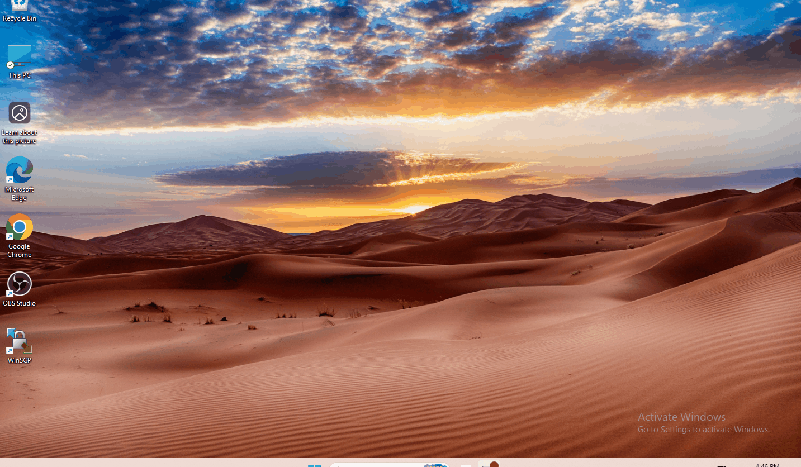
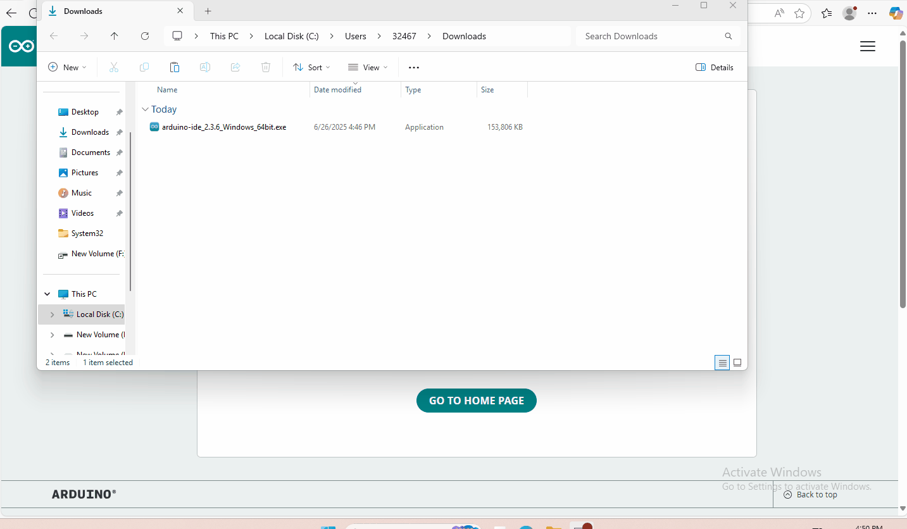

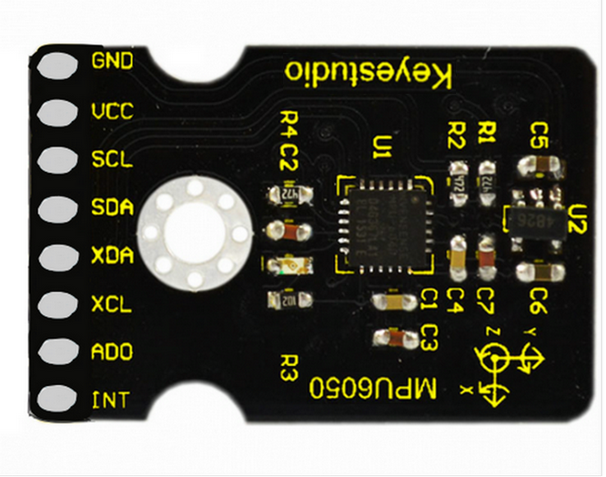
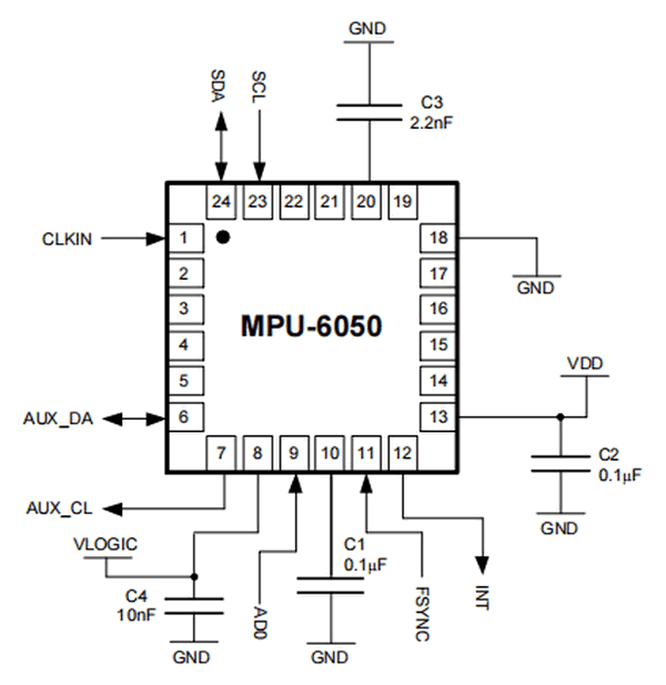
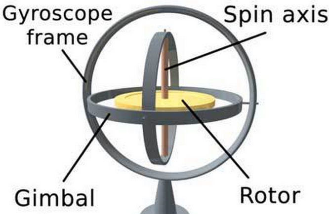
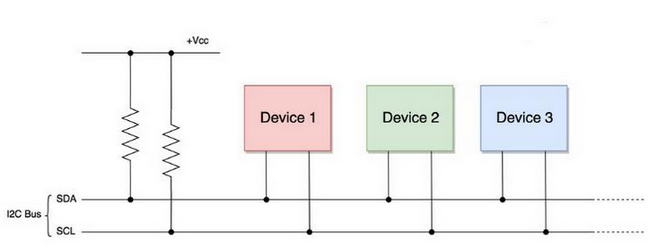
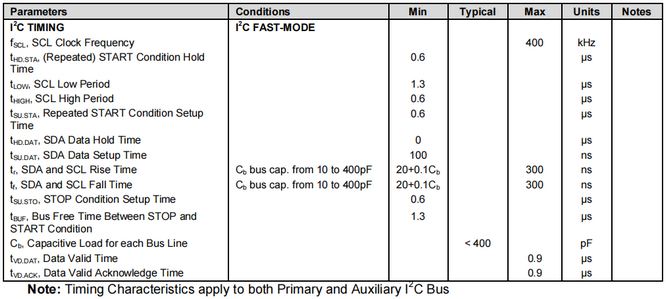
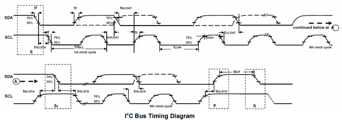
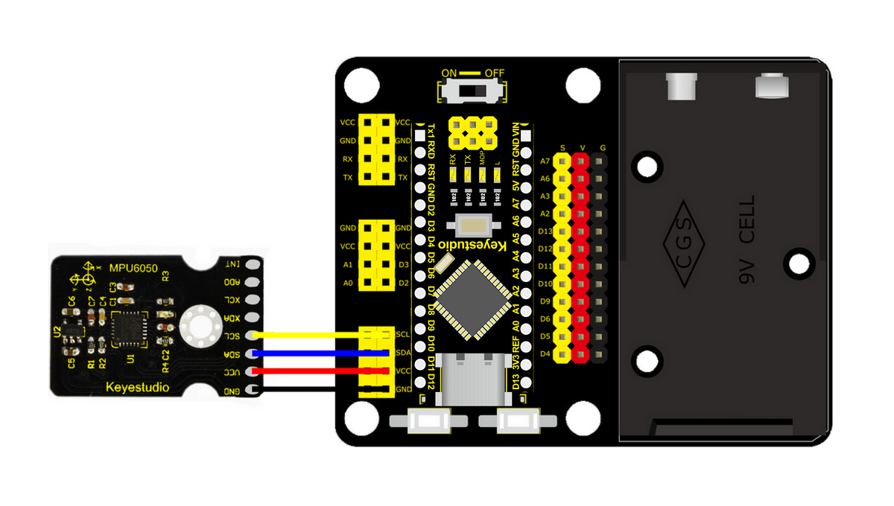
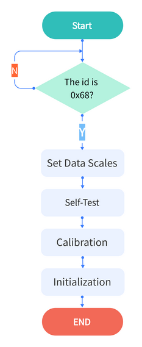
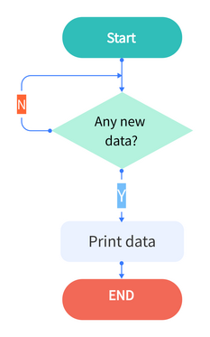
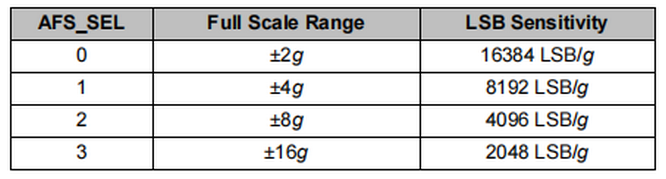
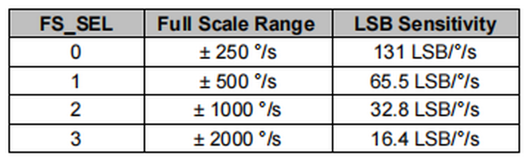
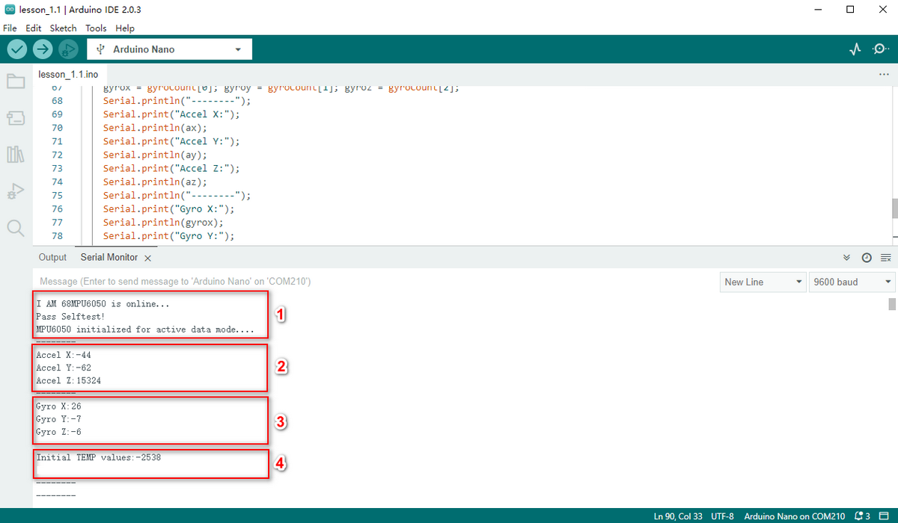
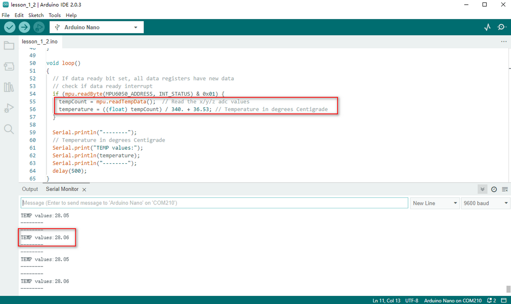
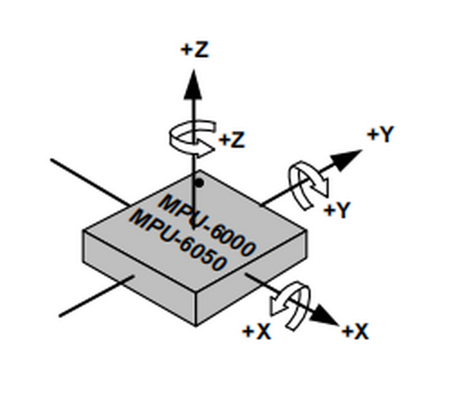
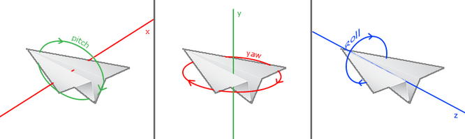

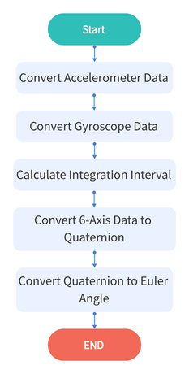
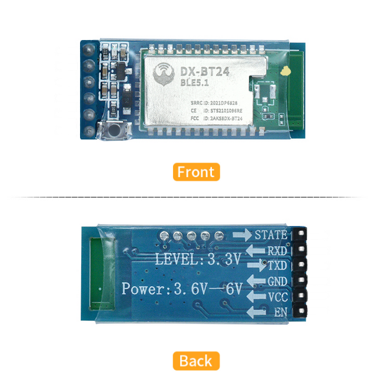
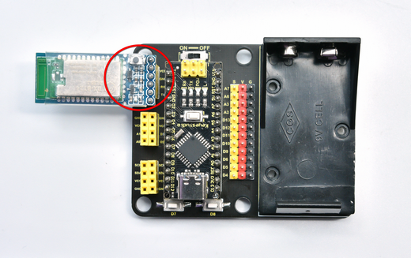
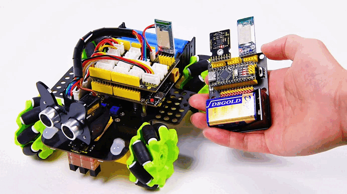
.. |image24| image:: media/26.gif
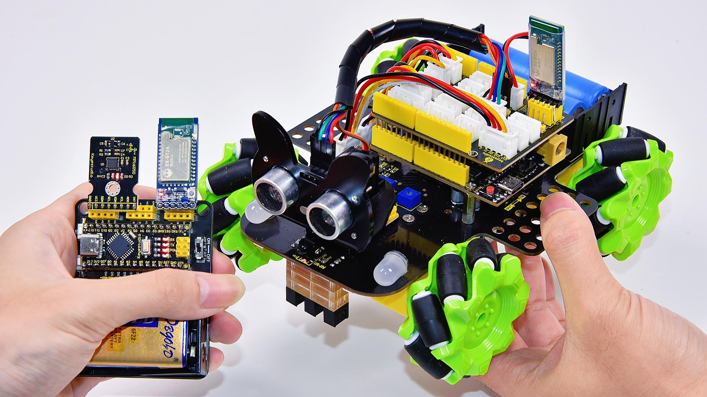
.. |image26| image:: media/28.png
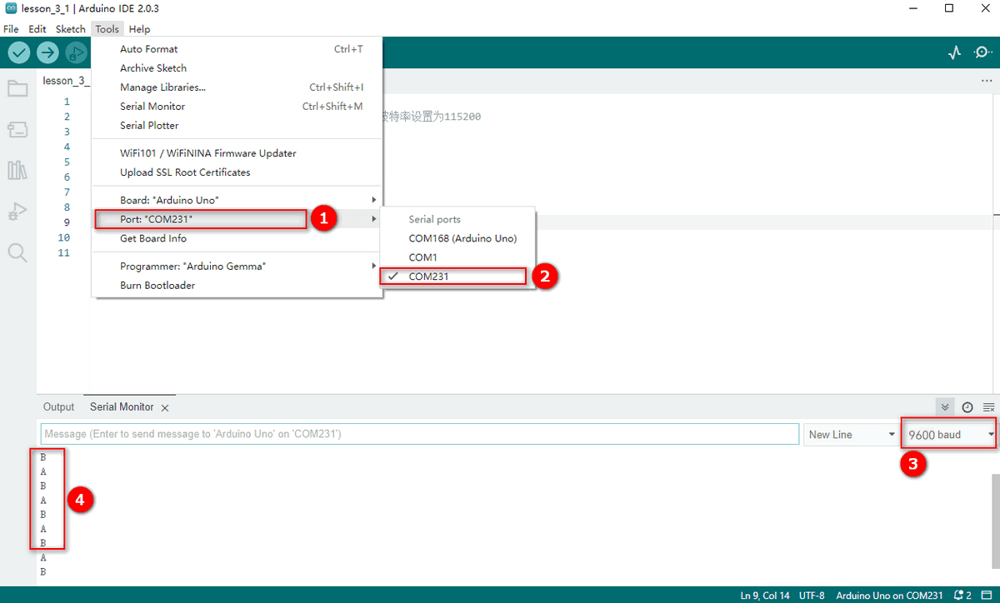
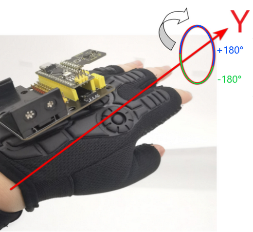
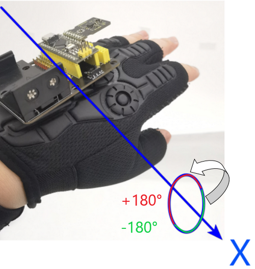
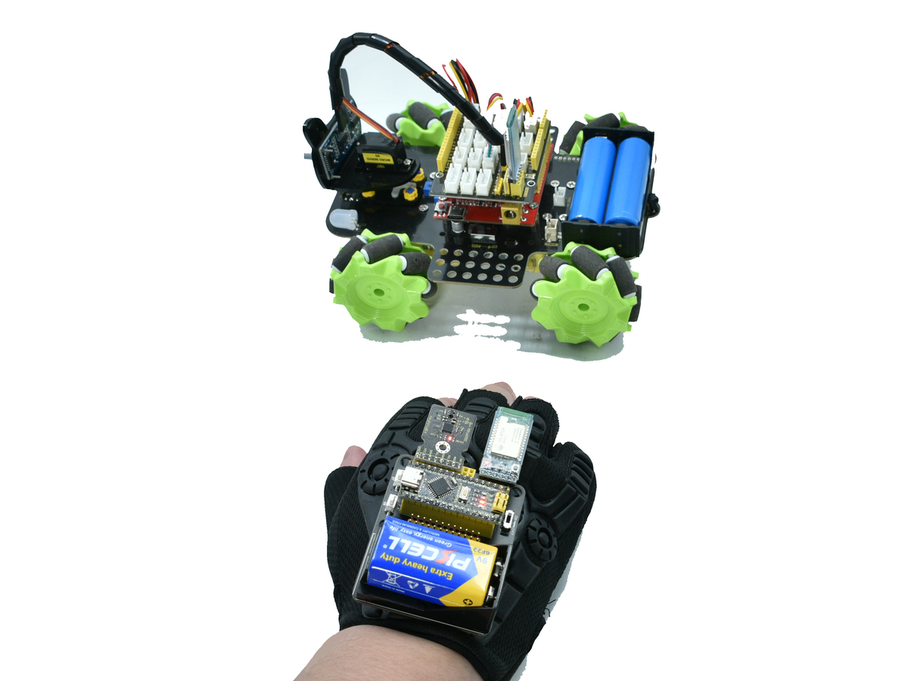
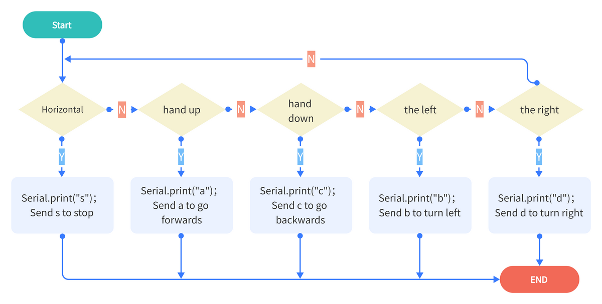
