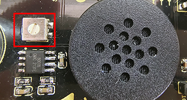
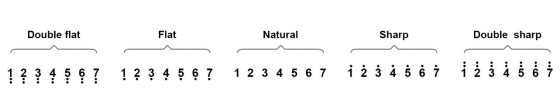

### Project 8 Music Performer

**1. Description**

In this project, we will use a power amplifier speaker to play music. This speaker can not only play simple songs, but also perform what you desire. Thus, you can program other interesting codes in the project to accomplish splendid learning outcomes.

**2.  Working Principle**


The electrical signal is input from pin 1 of RP1 (adjusts signal intensity, which is also the sound volume).

After coupling in C4 and passing R5, the signal reaches IN- pin of 8002B, in which it is operationally amplified and output to BEE1 speaker. 

**Frequency Comparison Table in C**

|    Note     | Frequency(Hz) |      Note      | Frequency(Hz) |     Note     | Frequency(Hz) |
| :---------: | :-----------: | :------------: | :-----------: | :----------: | :-----------: |
| Flat  1  Do |      262      | Natural  1  Do |      523      | Sharp  1  Do |     1047      |
| Flat  2  Re |      294      | Natural  2  Re |      587      | Sharp  2  Re |     1175      |
| Flat  3  Mi |      330      | Natural  3  Mi |      659      | Sharp  3  Mi |     1319      |
| Flat  4  Fa |      349      | Natural  4  Fa |      698      | Sharp  4  Fa |     1397      |
| Flat  5  So |      392      | Natural  5  So |      784      | Sharp  5  So |     1568      |
| Flat  6  La |      440      | Natural  6  La |      880      | Sharp  6  La |     1760      |
| Flat  7  Si |      494      | Natural  7  Si |      988      | Sharp  7  Si |     1967      |

**3.  Wiring Diagram**


**4. Test Code**

```
/*
  keyestudio ESP32 Inventor Learning Kit 
  Project 8.1 Music Performer 
  http://www.keyestudio.com
*/
int beeppin = 5; //Define the speaker pin to IO5

void setup() 
{
  pinMode(beeppin, OUTPUT);//Define the IO5 port to output mode 
}

void loop() 
{
  tone(beeppin, 262);//Flat DO plays 500ms
  delay(500);
  tone(beeppin, 294);//Flat Re plays 500ms
  delay(500);
  tone(beeppin, 330);//Flat Mi plays 500ms
  delay(500);
  tone(beeppin, 349);//Flat Fa plays 500ms
  delay(500);
  tone(beeppin, 392);//Flat So plays 500ms
  delay(500);
  tone(beeppin, 440);//Flat La plays 500ms 
  delay(500);
  tone(beeppin, 494);//Flat Si plays 500ms 
  delay(500);
  noTone(beeppin);//Stop for 1s 
  delay(1000);
}
```

**5. Test Result**

After uploading code and powering on, the amplifier circularly plays music tones with corresponding frequency: DO, Re, Mi, Fa, So, La, Si.

**Power amplifier sound adjustment：**

 **There is a potentiometer next to the speaker. We can adjust the sound of the speaker by twisting it. ** (Note: Please use appropriate strength to adjust it, so as not to break the potentiometer) 



**6. Knowledge Expansion**

 Let's play a birthday song. The wirings remain unchanged.

**Numbered musical notation:**


**Comparison Diagram of Flat, Natural and Sharp**



```
/*
  keyestudio ESP32 Inventor Learning Kit  
  Project 8.2 Music Performer
  http://www.keyestudio.com
*/
int beeppin = 5; //Define the speaker pin to IO5
// do、re、mi、fa、so、la、si

int doremi[] = {262, 294, 330, 370, 392, 440, 494,      //Falt 0-6
                523, 587, 659, 698, 784, 880, 988,      //Natural 7-13
                1047,1175,1319,1397,1568,1760,1967};    //Sharp 14-20
int happybirthday[] = {5,5,6,5,8,7,5,5,6,5,9,8,5,5,12,10,8,7,6,11,11,10,8,9,8};   //Find the number in arrey doremi[] according to the numbered musical notation 
int meter[] = {1,1,2,2,2,4, 1,1,2,2,2,4, 1,1,2,2,2,2,2, 1,1,2,2,2,4};    // Beats

void setup() 
{
  pinMode(beeppin, OUTPUT); //Set IO5 pin to output mode 
}

void loop() 
{
  for( int i = 0 ; i <= 24 ;i++)
  {       //i<=24, because there are only 24 tones in this song
    //Use tone()function to generate a waveform in "frequency"
   tone(beeppin, doremi[happybirthday[i] - 1]);
   delay(meter[i] * 200); //Wait for 1000ms
   noTone(beeppin);//Stop singing
  }
}
```

**7. Code Explanation**

**doremi[]{ … };**
Linear array is used to store data, which generally are considered as a series of variables of the same type. 
Analogically, data are neatly put in ordered boxes, so that we can take the sequenced numbers to use corresponding data.

**tone(pin, frequency)；** 
"pin" is the arduino pin generating tones in a total of 6 pins. "frequency" is the note frequency in the unit of Hz. 

**unsigned int** is the data type within range of 0 ~ 65, 535 ((2^16) - 1).

1. "tone" function controls the module to generate square waves in certain frequency(duty cycle of 50％). It sings until "noTone()"(Stop to sing) is activated. 
2. Tones can be emitted by connecting the pin to a piezoelectric buzzer or other speakers. 
3. For each time, tone() generates only one type of tone. Thus, if a tone is played on some pins, this function will be invalid. 
4. tone()function disturbs the PWM output on pin 3 and pin 11 (on any board excluding Mega). 
5. The sound frequency generated by tone() must be more than 31Hz. So when you play tones in different frequency on numerous pins, noTone() is necessary on one pin and followed by tone() on next pin.

**noTone(beeppin);**
It stops the tone generation(stops singing). You can directly add the pin number. 

