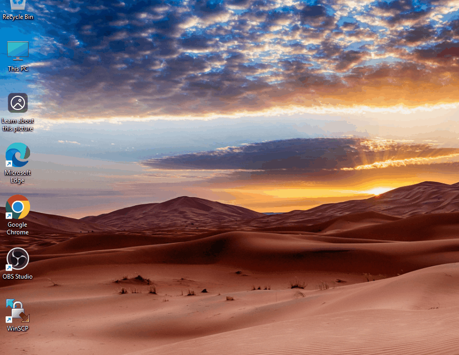
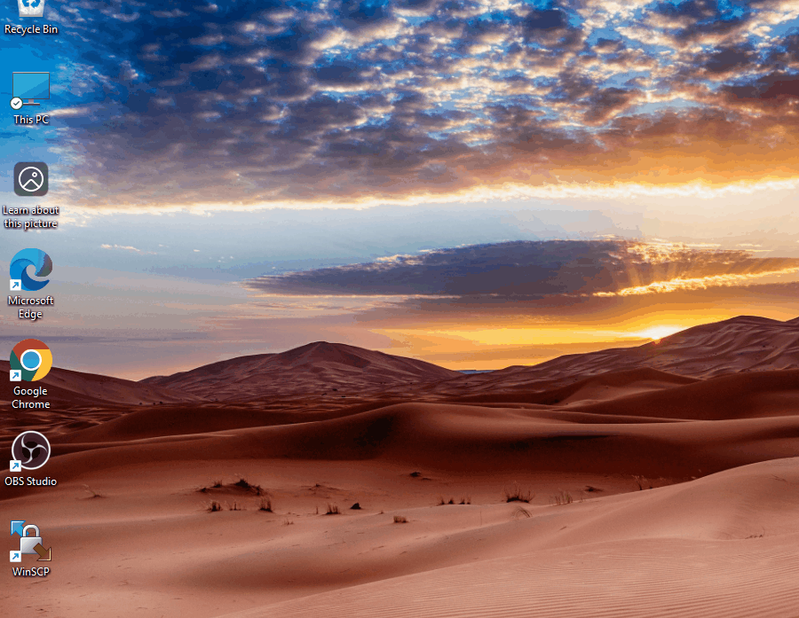
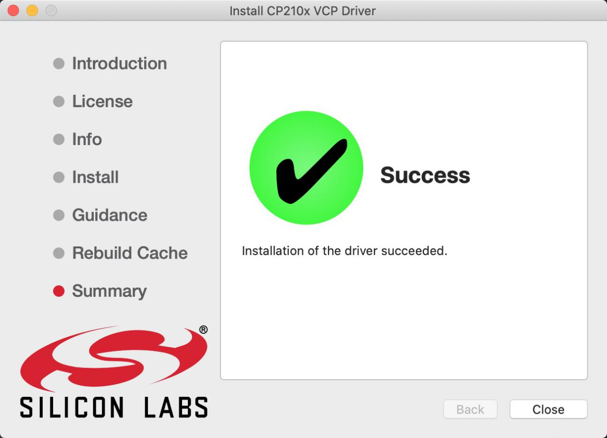

3. Driver installation
======================

一、Windows System
------------------

1.1Checking the driver
~~~~~~~~~~~~~~~~~~~~~~

1、Connect the motherboard to the computer.

.. figure:: ./media/KES0486连接电脑%20拷贝.jpg
   :alt: KES0486连接电脑 拷贝

2、Open Device Manager，Open the device manager, if the prompt
**“Silicon Labs CP210x USB to UART Bridge (COMx)”** appears to prove
that the driver has been installed, please skip the **“Driver
installation”** part.

1.2 Manual driver installation
~~~~~~~~~~~~~~~~~~~~~~~~~~~~~~

1、Driver download

- Windowns System:  :download:`Windowns System driver <./Window.7z>`

2、Connect the motherboard to the computer, open the device manager, if
there is a yellow exclamation mark in front of the driver in the
picture, it proves that the driver is not installed, please download the
driver and install it manually.

   Animation

二、MAC System
--------------

.. _checking-the-driver-1:

2.1Checking the driver
----------------------

Connect the development board to the computer, according to [Tools] —>
[Port] to select the development board port (Note: If you can not
confirm which port is the development board, please connect the
motherboard to take pictures to record all the ports, and then unplug
the development board to re-take pictures to record all the ports, and
then compare to find the disappeared ports, and then unplug the
motherboard after the disappeared ports is the port of the board, and
then select the port on the line)If you can not recognize the port,
please replace the computer USB port or around the phone cable to
re-recognize the port, if it still does not work refer to the following
steps to install the driver.

.. figure:: ./media/截屏2025-06-26%2015.43.43.png
   :alt: 截屏2025-06-26 15.43.43

.. _manual-driver-installation-1:

2.2 Manual driver installation
------------------------------

1、Driver download

Mac System:  :download:`Mac System driver <./Mac.7z>`

2、double-click to decompress the downloaded driver zip package

.. figure:: ./media/image-20250417083615847-1749262759458-8.png
   :alt: image-20250417083615847-1749262759458-8

.. figure:: ./media/image-20250417083758947-1749262759458-7.png
   :alt: image-20250417083758947-1749262759458-7

.. figure:: ./media/image-20250417083918581-1749262759458-5.png
   :alt: image-20250417083918581-1749262759458-5

3、After that keep **“Next ”** installing until the installation is
complete

At this point, the port can be recognized by plugging in the board
again.

4、Then go to the Arduino IDE, click on “Tools”, select the board
Arduino Uno and the recognized development board port。

.. figure:: ./media/截屏2025-06-26%2015.55.14.png
   :alt: 截屏2025-06-26 15.55.14

16.Click\ |image-20250417085312966|\ to upload code and show “Done
uploading”.

.. figure:: ./media/截屏2025-06-26%2015.55.14-1750924665950-2.png
   :alt: 截屏2025-06-26 15.55.14

.. |image-20250417085312966| image:: ./media/image-20250417085312966-1749262759459-18.png
