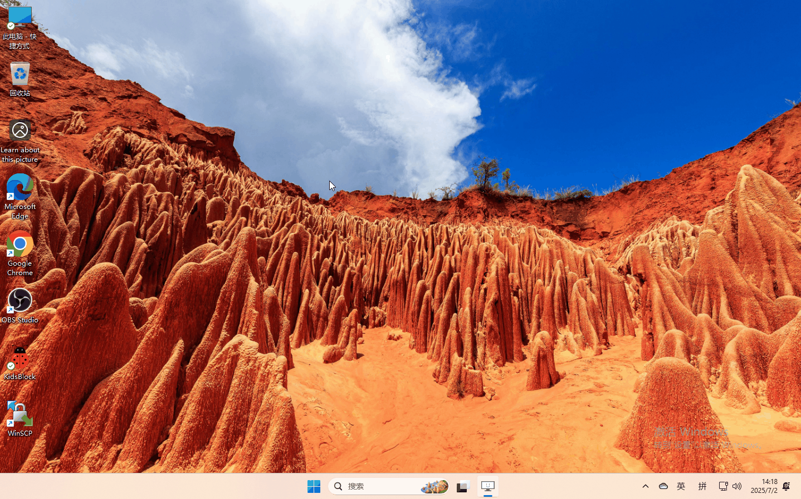
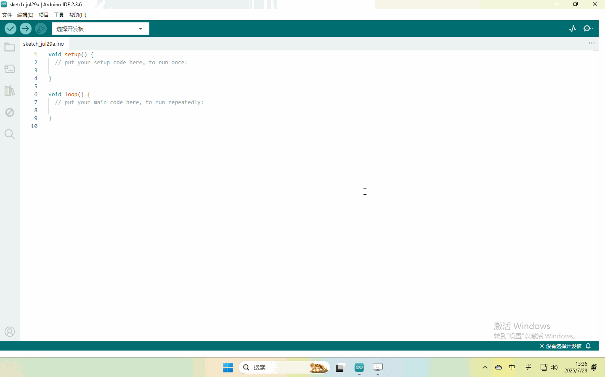
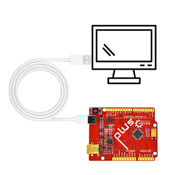
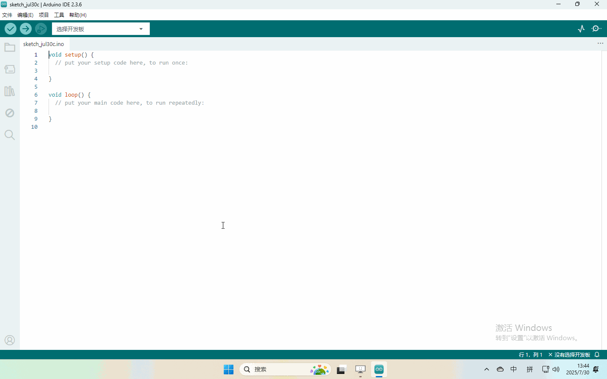

4. Arduino软件下载与配置
========================

4.1 资料下载
------------

\ **Arduino资料包含库文件和项目代码，请先点击下载进行后续的学习！！！！**\ 

下载： :download:`Arduino资料 <./Arduino>`

APP下载：:download:`APP <./APP.7z>`

4.2 Windows系统
---------------

4.2.1软件下载与安装
~~~~~~~~~~~~~~~~~~~

打开浏览器，搜索”https://www.arduino.cc/en/software”，操作如下：

4.2.2 库文件的添加
~~~~~~~~~~~~~~~~~~

**解压4.1下载的Arduino资料**

4.3 Mac系统软件
---------------

.. _软件下载与安装-1:

4.3.1 软件下载与安装
~~~~~~~~~~~~~~~~~~~~

打开浏览器，搜索”https://www.arduino.cc/en/software”，操作如下：

.. figure:: ./media/3.gif
   :alt: 3

4.3.2库文件导入
~~~~~~~~~~~~~~~

打开Arduino IDE,按照[项目]—>[导入库]—>[添加.zip库]
(动图仅导入两个库供以展示导入方法，实际操作请全部导入)

.. figure:: ./media/q8-1753845655270-1.gif
   :alt: q8

注意，该方法一次只能导入一个库文件，产品存在多个库请参照该过程依次导入！

4.4上传第一个代码
-----------------

上传代码前先将主板连接到电脑

由于软件在windows系统和Mac系统的界面一致，这里以Windows操作展示

程序上传成功，开发板上的LED灯亮一秒钟，灭一秒钟！

\ **将开发板连接到电脑，按照[工具]
—>[端口]选择开发板端口（注意：如果不能确认哪个端口是开发板的，请接上主板手机拍照记录全部端口，之后拔掉开发板重新拍照记录全部端口，对比找到消失的端口，拔掉主板后消失的端口就是开发板端口，后续选择该端口就行）**\ 

至此，已经完成了Arduino
IDE的软件安装、库文件导入等操作，请继续具体课程的学习。

4.4 项目课程
-------------------

.. toctree::
    :maxdepth: 1

    Project/项目一
    Project/项目二
    Project/项目三
    Project/项目四
    Project/项目五
    Project/项目六
    Project/项目七
    Project/项目八 
    Project/项目九 
    Project/项目十
    Project/项目十一
    Project/项目十二
    Project/项目十三
    Project/项目十四 
    Project/项目十五 
    Project/项目十六 
    Project/项目十七
