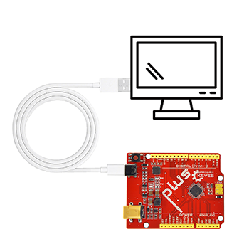
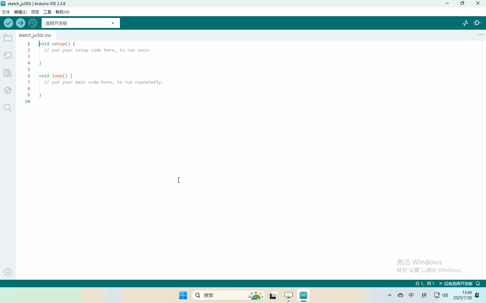

# 4. Arduino软件下载与配置

## 4.1 资料下载

**Arduino资料包含库文件和项目代码，请先点击下载进行后续的学习！！！！**

下载：[Arduino资料](./Arduino)

APP下载：[APP](./APP.7z)

## 4.2 Windows系统

### 4.2.1软件下载与安装

打开浏览器，搜索"https://www.arduino.cc/en/software"，操作如下：

### 4.2.2 库文件的添加

**解压4.1下载的Arduino资料**

## 4.3 Mac系统软件

### 4.3.1 软件下载与安装

打开浏览器，搜索"https://www.arduino.cc/en/software"，操作如下：

### 4.3.2库文件导入

打开Arduino IDE,按照[项目]--->[导入库]--->[添加.zip库] (动图仅导入两个库供以展示导入方法，实际操作请全部导入)

注意，该方法一次只能导入一个库文件，产品存在多个库请参照该过程依次导入！

## 4.4上传第一个代码

上传代码前先将主板连接到电脑

由于软件在windows系统和Mac系统的界面一致，这里以Windows操作展示

程序上传成功，开发板上的LED灯亮一秒钟，灭一秒钟！

**将开发板连接到电脑，按照[工具] --->[端口]选择开发板端口（注意：如果不能确认哪个端口是开发板的，请接上主板手机拍照记录全部端口，之后拔掉开发板重新拍照记录全部端口，对比找到消失的端口，拔掉主板后消失的端口就是开发板端口，后续选择该端口就行）**

至此，已经完成了Arduino IDE的软件安装、库文件导入等操作，请继续具体课程的学习。

