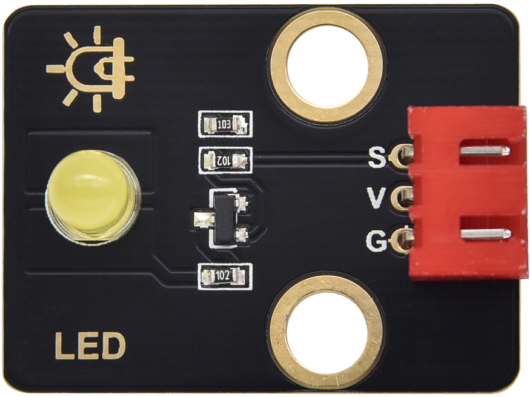

### 项目一 LED闪烁

1.项目介绍：

前面我们已经组装好了智能家居。接下来的项目我们就要由简单到复杂，一步一步探索Arduino的世界了。首先我们要来完成经典的“Arduino点亮LED”，也就是Blink项目。Blink对于学习Arduino的爱好者而言，是最基础的项目，也是新手必须经历的一个练习。

LED，即发光二极管的简称。由含镓（Ga）、砷（As）、磷（P）、氮（N）等的[化合物](https://baike.baidu.com/item/%E5%8C%96%E5%90%88%E7%89%A9/1142931)制成。当电子与[空穴](https://baike.baidu.com/item/%E7%A9%BA%E7%A9%B4/3517781)复合时能辐射出可见光，因而可以用来制成发光二极管。在电路及仪器中作为指示灯，或者组成文字或数字显示。砷化镓二极管发红光，磷化镓二极管发绿光，碳化硅二极管发黄光，氮化镓二极管发蓝光。因化学性质又分有机发光二极管OLED和无机发光二极管LED。

为了实验的方便，我们将LED发光二极管做成了一个LED模块，在这个项目中，我们用一个最基本的测试代码来控制LED，亮一秒钟，灭一秒钟，来实现闪烁的效果。你可以改变代码中LED灯亮灭的时间，实现不同的闪烁效果。LED模块信号端S为高电平时LED亮起，S为低电平时LED熄灭。

2.模块相关资料


-  工作电压: DC 3.3-5V
- 工作电流： &lt; 20mA
-  最大功率： 0.1W
-  控制接口: 数字口（数字输入）
- 工作温度： -10°C ~ +50°C
-  LED显示颜色： 黄色

3.实验组件

| 控制板 * 1                               | 扩展板 * 1                               | USB线*1                                  | LED模块 *1                               | 3P转杜邦线母 *1                          |
| ---------------------------------------- | ---------------------------------------- | ---------------------------------------- | ---------------------------------------- | ---------------------------------------- |
|  |  |  |  |  |

4.模块接线图


注意：这里体现的是实验使用到的模块接线图，若前面已经组装好智能家居并不用拆掉。

5.测试代码

```
/*
  Keyes
  Blink
  www.keyes-robot.com
*/
int LED = 5;  //定义LED引脚

void setup() 
{
  pinMode(LED, OUTPUT);//设置引脚为输出
}

void loop() 
{
  digitalWrite(LED, HIGH);   // 点亮LED灯
  delay(1000);               // 延时1s
  digitalWrite(LED, LOW);    // 熄灭LED灯
  delay(1000);               // 延时1S
}
```

6.将再将船型开关上的“1”端按下，同时黄色LED亮1000毫秒，灭1000毫秒，循环交替。

7.代码说明

```
 pinMode(LED, OUTPUT); 设置引脚为输出模式

 digitalWrite(LED, HIGH); 设置引脚输出高电平

 delay(1000); 延时1000毫秒

 digitalWrite(LED, LOW); 设置引脚输出低电平
```

