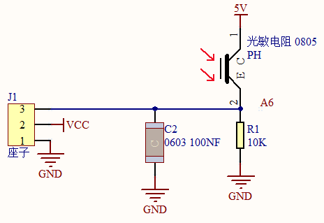
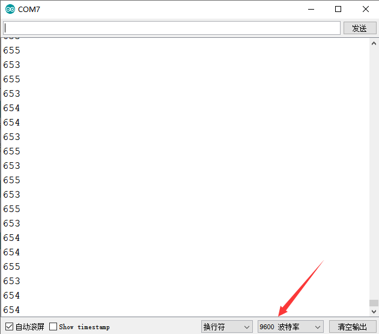

### 项目七 光控灯

1.项目介绍

在这个套件中，有一个Keyes DIY电子积木光敏电阻传感器，这是一个常用的光敏电阻传感器，它主要采用光敏电阻元件。该电阻元件电阻大小随着光照强度的变化而变化，该传感器就是利用光敏电阻元件这一特性，搭建电路将电阻变化转换为电压变化。光敏电阻传感器可以模拟人对环境光线的强度的判断，可广泛应用于各种光控电路，如对灯光的控制、调节等场合，也可用于光控开关。

实验中，我们将传感器信号端(S端)输入到arduino系列单片机的模拟口，感知模拟值的变化，在串口监视器上显示出对应的模拟值，当小于某个值时点亮LED灯。

2.模块相关资料



- 工作电压: DC 3.3-5V
- 工作电流： &lt; 20mA
-  最大功率： 0.1W
-  控制接口: 输出信号：模拟信号
- 工作温度： -10°C ~ +50°C
- 原理图分析：当没有亮光时，电阻大小为0.2MΩ，信号端（2点）检测的电压接近0，当随着光照抢度增大，光线传感器的电阻值越来越小，所以信号端检测的电压越来越小。

3.实验组件

| 控制板 * 1                               | 扩展板 * 1                               | USB线*1                                  |
| ---------------------------------------- | ---------------------------------------- | ---------------------------------------- |
|  |  |  |
| 3P 转杜邦线母*2                          | 黄色LED模块* 1                           | Keyes 光敏电阻传感器*1                   |
|  |  |  |

4.模块接线图


5.测试代码

```
/*
  Keyes Arduino 智能家居套装
  课程 7
  光控灯
  http://www.keyes-robot.com
*/

int LED = 5; // 定义LED引脚D5
int val = 0; 
void setup () 
{
    pinMode (LED, OUTPUT); //设置模式为输出
    Serial.begin (9600); // 设置波特率为9600
}

void loop () 
{
    val = analogRead (A1); // 读取光敏传感器数值
    Serial.println (val); // 串口显示光敏传感器读取到的数值
    if(val <300)
    {// 当数值小于300时，点亮LED灯
       	digitalWrite (LED, HIGH);
    } 
    else 
    {//否则熄灭LED灯
       	digitalWrite (LED, LOW);
    }
    delay (10); // 延时10ms
} 
```

6.实验结果

按照上图接好线，上传好程序，利用USB线上电后，设置波特率为9600，我们看到在串口显示器中打印出光敏传感器测到的值，光敏电阻传感器测到的值小于等于300时，则黄色LED亮；反之，黄色LED不亮。



7.代码说明

(1) analogRead(pin)这个函数从指定的模拟引脚pin读取值。 Arduino板包含一个多通道、10 位模数转换器。 这意味着它会将 0 和工作电压（5V     或 3.3V我们这里是5V）之间的输入电压映射为 0 和 1023     之间的整数值。例如，在 Arduino UNO     上，这会产生以下读数之间的分辨率：5 伏/1024 单位即每单位 0.0049 伏(4.9 mV)。在基于 ATmega     的板卡（UNO、Nano、Mini、Mega）上，读取模拟输入大约需要 100     微秒（0.0001 s），因此最大读取速率约为每秒 10,000 次。

(2) pin：要读取的模拟输入引脚的名称（大多数板上的A0到A5，我们plus板上的A0到A7，Mega2560上的A0到A15）。设置1个整数变量item，将所测结果赋值给item。函数返回值为引脚上的模拟读数。虽然它受限于模数转换器的分辨率（0-1023     为 10 位或 0-4095 为 12 位）。数据类型：int。

(3) 串口监视器显示analogVal 的值，显示前需设置波特率（我们默认设置为9600，可更改）。