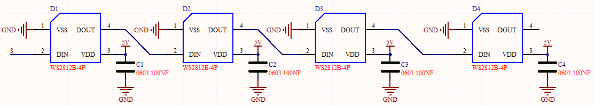
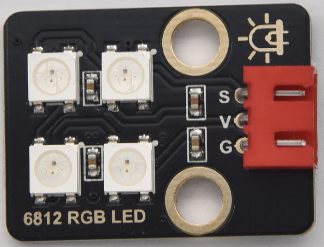
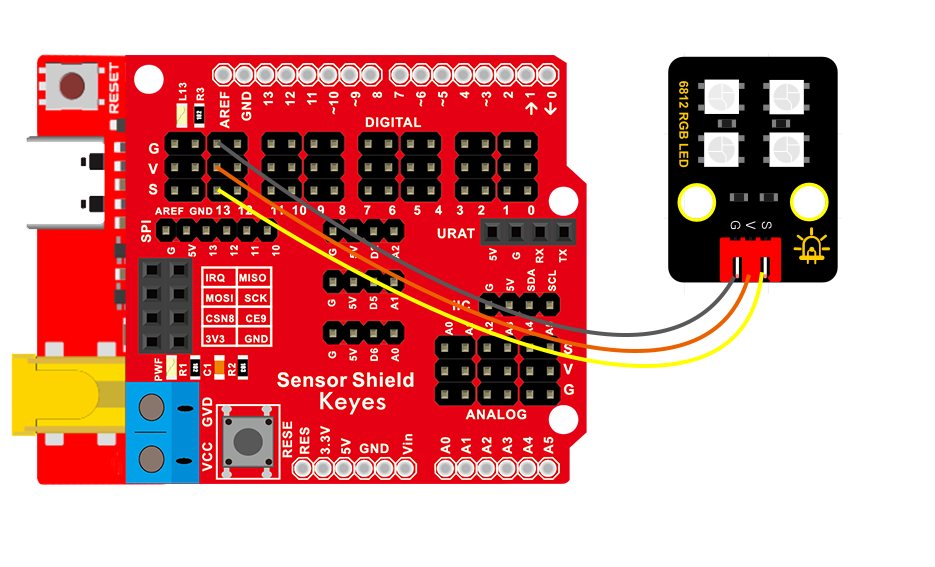

### 项目三 6812RGB彩灯

1.项目介绍

我们这个套价中，还有一个Keyes DIY电子积木 6812 RGB模块，这个SK6812 RGB模块只需要一个引脚就能控制，这是一个集控制电路与电路于一体的智能外控LED光源。每个LED原件其外型与一个5050LED灯珠相同，每个元件即为一个像点，我们这个模块上有四个灯珠即四个像素，实验中，我们分别使不同的灯亮出不同的颜色。

2.模块相关资料

从原理图中我们可以看出，这四个像素点灯珠都是串联起来的，其实不论多少个，我们都可以用一个引脚控制任一一个灯，并且让它显示任一种颜色。像素点内部包含了智能数字接口数据锁存信号整形放大驱动电路，还包含有高精度的内部振荡器和12V高压可编程定电流控制部分，有效保证了像素点光的颜色高度一致。

数据协议采用单线归零码的通讯方式，像素点在上电复位以后，S端接受从控制器传输过来的数据，首先送过来的24bit数据被第一个像素点提取后，送到像素点内部的数据锁存器。这个6812RGB通讯协议与驱动已经在底层封装好了，我们直接调用函数的接口就可以使用，简单方便，LED具有低电压驱动，环保节能，亮度高，散射角度大，一致性好，超低功率，超长寿命等优点。



3.实验组件

| 控制板 * 1                               | 扩展板 * 1                               | USB线*1                                  | 6812模块 *1                              | 3P转杜邦线母*1                           |
| ---------------------------------------- | ---------------------------------------- | ---------------------------------------- | ---------------------------------------- | ---------------------------------------- |
|  |  |  |  |  |

4.模块接线图



5.测试代码

```
/*
  Keyes Arduino智能家居套装
  第三课 6812RGB
  http://www.keyes-robot.com
*/
//添加RGB6812库文件
#include <Wire.h>
#include <Adafruit_NeoPixel.h>

Adafruit_NeoPixel  rgb_display(4);  //定义一个像素的类

void setup() 
{
  rgb_display.begin();  //启动6812RGB
  rgb_display.setPin(13);  //设置6812管脚接数字口13
  rgb_display.setBrightness(80); //设置亮度为100，范围为0~255
}

void loop() 
{
  rgb_display.setPixelColor(0, 255, 0, 0); //第一颗灯珠亮红色
  rgb_display.setPixelColor(1, 0, 255, 0); //第二颗灯珠亮绿色
  rgb_display.setPixelColor(2, 0, 0, 255); //第三颗灯珠亮蓝色
  rgb_display.setPixelColor(3, 255, 255, 255); //第四颗灯珠亮白色
  rgb_display.show(); //显示灯珠颜色
}
```

6.实验结果

再将船型开关上的“1”端按下,按照接线图连接好线，上电后，我们可以看到模块上的四个灯珠分别亮红绿蓝白色；

7.代码说明

```
我们介绍下主要的几个函数接口及功能：

rgb_display.begin();这个函数用来初始化6812RGB，这是必要的

rgb_display.setPin(13);这个函数用来设置6812RGB所连接的引脚，是必要的

rgb_display.setBrightness(80);这个函数用来设置6812RGB显示的亮度，范围是（0~255），值越大，灯珠越亮，如果我们没有设置亮度，那么默认255，也就是最亮。

rgb_display.setPixelColor(uint16_t n, uint8_t r, uint8_t g, uint8_t b);这个函数用来设置6812RGB的灯珠号也就是位置，及每颗灯珠的颜色。

rgb_display.show();这个函数用来设置显示6812RGB，是必要的，如果没有这条语句，灯珠将不刷新显示
```

