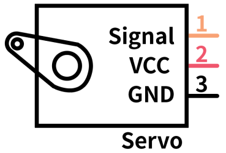
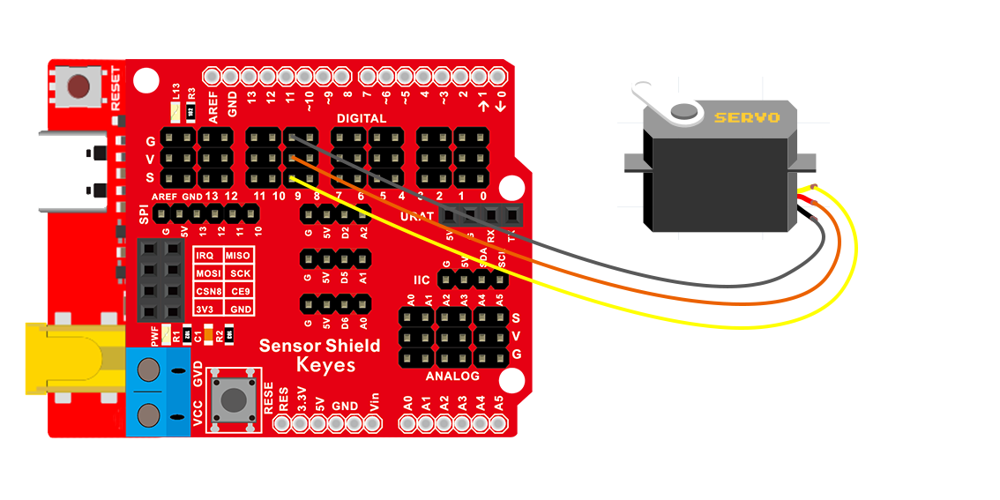

### 项目九 控制舵机

1.项目介绍



当我们在制作智能家居时，经常会将舵机和门、窗等固定在一起。这样，我们就可以利用舵机转动，带动门、窗等开或关，从而起到家居生活的智能化功能。在这课程中我们着重介绍下智能家居套件中的舵机的原理和使用方法。

舵机是一种位置伺服的驱动器，主要是由外壳、电路板、无核心马达、齿轮与位置检测器所构成。与马达不同，我们一般控制马达的转速和方向。而舵机更多的是控制指定的角度。常用的舵机可旋转的角度范围是0°到180°。舵机引线为3线，分别用棕、红、橙三种颜色进行区分，舵机品牌和生产厂家不同，会有些许差异，使用之前需查看资料。我们使用的是最常见的舵机，棕、红、橙分别对应“电源负极，电源正极，控制信号”。

2.舵机相关资料

舵机的伺服系统由可变宽度的脉冲来进行控制，橙色的控制线是用来传送脉冲的。一般而言，PWM控制舵机的基准信号周期为20ms（50Hz），理论上脉宽应在1ms到2ms之间，对应控制舵机角度是0°～180°。但是，实际上更多控制舵机的脉宽范围是0.5ms
到2.5ms，具体需要自己实际调试下。


经过实测，舵机的脉冲范围为0.65ms~2.5ms。180度舵机，对应的控制关系是这样的：

 高电平时间 舵机角度 基准信号周期时间（20ms）

-  0.65ms 0度 0.65ms高电平+19.35ms低电平

-  1.5ms 90度 1.5ms高电平+18.5ms低电平

-  2.5ms 180度 2.5ms高电平+17.5ms低电平

舵机的规格参数：

-  工作电压： DC 4.8V〜6V 可操作角度范围： 大约180°(在500→2500μsec)

-  脉波宽度范围： 500→2500 μsec 外观尺寸： 22.9*12.2*30mm

-  空载转速：0.12±0.01 sec/60度（DC 4.8V） 0.1±0.01 sec/60度（DC 6V）

-  空载电流：200±20mA（DC 4.8V） 220±20mA（DC 6V）

-  停止扭力：1.3±0.01kg·cm（DC 4.8V） 1.5±0.1kg·cm（DC 6V）

-  停止电流：≦850mA（DC 4.8V） ≦1000mA（DC 6V）

-  待机电流：3±1mA（DC 4.8V） 4±1mA（DC 6V）

-  重量:9±1g (without servo horn)

-  使用温度：-30℃~60℃

3.实验组件

| 控制板 * 1                               | 扩展板 * 1                               | USB线*1                                  | 180度舵机 *1                             |
| ---------------------------------------- | ---------------------------------------- | ---------------------------------------- | ---------------------------------------- |
|  |  |  |  |

4.模块接线图



5.测试代码

```
/*
  Keyes Arduino 智能家居套装
  课程 9
  伺服舵机-库函数
  http://www.keyes-robot.com
*/

#include <Servo.h>  //舵机库
Servo myservo;

void setup() 
{
  myservo.attach(9);//舵机连接数字口9
}

void loop() 
{
  for (int pos = 0; pos < 180; pos++) 
  {
    myservo.write(pos); //转动到pos角度
    delay(15);  //加延时转慢一点
  }
  for (int pos = 180; pos > 0; pos--) 
  {
    myservo.write(pos);
    delay(15);
  }
  delay(2000);//等待2秒
}
```

6.实验结果

上传测试代码成功，外接电源开关打开后，“智能家居的门”0~180度来回转动，并且每15ms转动一度。

 7.项目拓展

我们不调用舵机库能控制？当然能，如下就是不调用舵机库的程序，上传测试程序成功，外接电源开关打开后，“智能家居的门”由0度，90度，180度三个角度循环转动。

```
/*
  Keyes Arduino 智能家居套装
  课程 9
  伺服舵机-2
  http://www.keyes-robot.com
*/

int servoPin = 9;//舵机的PIN

void setup() 
{
  pinMode(servoPin, OUTPUT);//舵机引脚设置为输出
}

void loop()
{
  servopulse(servoPin, 0);//转动到0度
  delay(1000);//延时1秒
  servopulse(servoPin, 90);//转动到90度
  delay(1000);
  servopulse(servoPin, 180);//转动到180度
  delay(1000);
}

void servopulse(int pin, int myangle) 
{ //脉冲函数
  int pulsewidth = map(myangle, 0, 180, 500, 2500); //将角度映射到脉宽
  for (int i = 0; i < 5; i++) 
  { //多输出几次脉冲
    digitalWrite(pin, HIGH);//将舵机接口电平至高
    delayMicroseconds(pulsewidth);//延时脉宽值的微秒数
    digitalWrite(pin, LOW);//将舵机接口电平至低
    delay(20 - pulsewidth / 1000);
  }
}
```

8.代码说明

代码1：myservo.write(pos)**为转动到pos角度值。**myservo.read()是读取舵机当前角度值。

代码2：

（1）map(value, fromLow, fromHigh, toLow, toHigh)；value为我们要映射的值；fromLow, fromHigh为当前值的下限和上限；toLow, toHigh为我们要映射到的目标范围的下限和上限。比如我们在实验中map(myangle, 0, 180, 500, 2500)的意思就是我们传进来一个需要转动的角度值为myangle，然后这个值的范围是0度到180度，我们要映射的范围为500us到2500us，即把0到180转到了500到2500然后被返回了，返回的数据类型为整型，余数会被截断，不进行四舍五入或平均。

（2）
之后我们调用我们定义的的函数servopulse（）就能让舵机转动了，代码中我们设置了让舵机从0度转动到90度再转动到180度，再转动到0度，中间暂停一秒，反复循环。