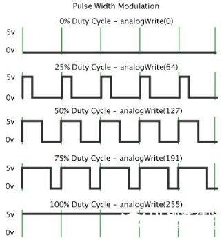

### 项目二 呼吸灯

1.项目介绍


前面课程中，我们详细的介绍了通过测试代码控制LED亮灭，实现闪烁的效果。这节课我们使用PWM来控制LED亮度不断地变化，模拟我们呼吸的效果。

PWM是使用数字手段来控制模拟输出的一种手段。使用数字控制产生占空比不同的方波（一个不停在高电平与低电平之间切换的信号)来控制模拟输出。一般来说端口的输出电压只有两个0V与5V。如果想要改变灯的亮度怎么办呢个？有同学说串联电阻，对，这个方法是正确的。但是，如果想要得到不同的亮度，且在不同亮度之间来回变动怎么办呢？不可能不停地切换电阻吧。这种情况下就需要使用PWM了，那它是怎么控制的呢？

对于keyes UNO PLUS开发板的数字端口电压输出只有LOW与HIGH两个，对应的就是0V与5V的电压输出，可以把LOW定义为0，HIGH定义为1，1秒内让keyes UNO PLUS开发板输出500个0或者1的信号。如果这500个全部为1，那就是完整的5V，如果全部为0，那就是0V。如果010101010101这样输出，刚好一半，端口输出的平均电压就为2.5V了。这个和放映电影是一个道理，咱们所看的电影并不是完全连续的，它其实是每秒输出25张图片。在这种情况下，人的肉眼是分辨不出来的，看上去就是连续的了。PWM也是同样的道理，如果想要不同的电压，就控制0与1的输出比例控制就可以了。当然这和真实的连续输出还是有差别的，单位时间内输出的0,1信号越多，控制的就越精确。（输出电压=（开启时间/脉冲时间）\*最大电压值）

在下图中，绿线之间代表一个周期，其值也是PWM频率的倒数。换句话说，如果keyes UNO PLUS开发板的PWM频率是500Hz，那么两绿线之间的周期就是2毫秒。

analogWrite()命令中可以操控的范围为0-255，analogWrite(255)表示100%占空比（常开），analogWrite(127)占空比大约为50%（一半的时间）。




脉冲宽度调制（PWM）有多种应用：灯亮度调节、电机调速、发声等。
以下是PMW的四个基本参数：

- 脉冲宽度的振幅（最小/最大）

- 脉冲周期（1秒内脉冲频率的倒数）
- 电压水平（如：0V-5V）
- keyes UNO PLUS开发板的PMW接口：D3 D5 D6 D9 D10 D11

2.模块相关资料


- 工作电压: DC 3.3-5V

- 工作电流： &lt; 20mA

- 最大功率： 0.1W

- 控制接口: 数字口（数字输入）
- 工作温度： -10°C ~ +50°C
-  LED显示颜色： 黄色

3.实验组件

| 控制板 * 1                               | 扩展板 * 1                               | USB线*1                                  | LED模块*1                                | 3P转杜邦线母 *1                          |
| ---------------------------------------- | ---------------------------------------- | ---------------------------------------- | ---------------------------------------- | ---------------------------------------- |
|  |  |  |  |  |

4.模块接线图


注意：这里体现的是实验使用到的模块接线图，若前面已经组装好智能家居并不用拆掉。

5.测试代码

```
/*
  Keyes Arduino智能家居套装
  第二课 呼吸灯
  www.keyes-robot.com
*/
int ledPin = 5; //定义LED引脚

void setup () 
{
      pinMode (ledPin, OUTPUT); // 设置引脚为输出模式
}

void loop () 
{
    for (int value = 0; value<255; value = value + 1) 
    {  //从0到255，每次加1
         analogWrite (ledPin, value); 
         delay (5); // 延时 5MS
     }
     for (int value = 255; value>0; value = value-1) 
     { //从0到255，每次减1
         analogWrite (ledPin, value); 
         delay (5); // 延时 5MS
     }
}
```

6.实验结果

将再将船型开关上的“1”端按下，黄色LED灯逐渐变暗。然后又逐渐变亮，循环交替，如人体呼吸一样。

7.代码说明

```
pinMode(LED, OUTPUT); 设置引脚为输出模式

int value = 0; value&lt;255; value = value +1 value从0到255，每次加1

analogWrite (ledPin, value); ledPin为PWM口，value是要输出的PWM值（0~255）
```

