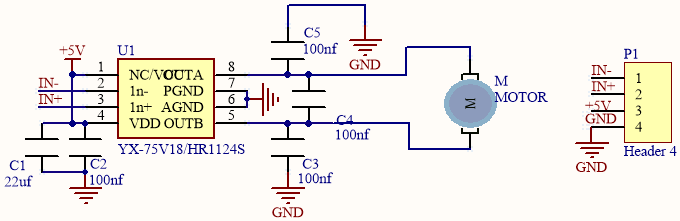
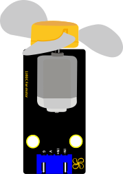
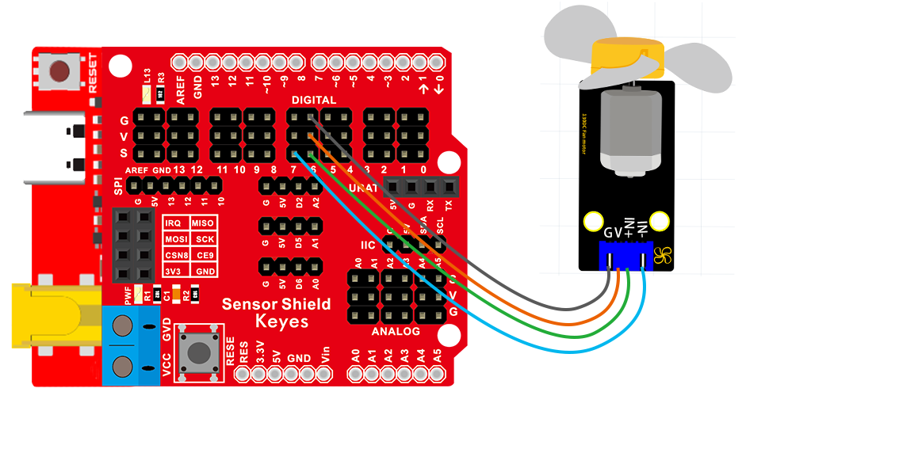

### 项目八 小风扇转动

1.项目介绍

130电机控制模块采用HR1124S电机控制芯片。HR1124S是应用于直流电机方案的单通道H桥驱动器芯片。HR1124S的H桥驱动部分采用低导通电阻的PMOS和NMOS功率管。低导通电阻保证芯片低的功率损耗，使得芯片安全工作更长时间。此外HR1124S拥有低待机电流，低静态工作电流，这些性能使HR1124S易用于玩具方案。

该模块兼容各种单片机控制板，如arduino系列单片机。模块上自带的防反插红色端子间距为2.54mm，实验中，我们可通过输出到两个信号端IN+和IN-的电压方向来控制电机的转动方向，让电机转动起来。

2.模块相关资料

- 3.3-5V(DC) 最大电流： 200mA (DC5V)
- 最大功率： 1W 
-  控制接口： 双数字口（数字输入）
- 工作温度： -10°C ~+50°C 
- 环保属性： ROHS



3.实验组件

| 控制板 * 1                               | 扩展板 * 1                               | USB线 *1                                 | Keyes DIY电子积木 130电机模块 *1         | 4P 转杜邦线母 *1                         |
| ---------------------------------------- | ---------------------------------------- | ---------------------------------------- | ---------------------------------------- | ---------------------------------------- |
|  |  |  |  |  |

4.模块接线图



5.测试代码

```
/*
  Keyes Arduino 智能家居套装
  课程 8
  小风扇转动
  http://www.keyes-robot.com
*/
//定义电机的两个管脚接口，分别为6、7

int INA = 6;
int INB = 7;

void setup() 
{
  //设置电机引脚为输出
  pinMode(INA, OUTPUT);
  pinMode(INB, OUTPUT);
}

void loop() 
{
  //逆时针转
  digitalWrite(INA, HIGH);
  digitalWrite(INB, LOW);
  delay(2000);
  //停止
  digitalWrite(INA, LOW);
  digitalWrite(INB, LOW);
  delay(1000);
  //顺时针转
  digitalWrite(INA, LOW);
  digitalWrite(INB, HIGH);
  delay(2000);
  //停止
  digitalWrite(INA, LOW);
  digitalWrite(INB, LOW);
  delay(1000);
}
```

6.实验结果

烧录好测试程序，打开电源开关后，风扇顺时针转动2秒；停止1秒；逆时针转动2秒；停止1秒；循环交替。

7.代码说明

将管脚设置为6、7，当6输出为低电平即INA输入低电平，7输出为高电平即INB输入高电平时（输入与输出是相对的，这个实验中对于我们单片机的引脚来说，单片机输出高低电平，自然模块就为输入了，即从单片机输出到模块；例如按键模块则相反，是模块输出到单片机），电机顺时针旋转；当6输出为高电平，7输出为低电平时，电机逆时针旋转；当两个管脚都设置为低电平时，电机停止转动。