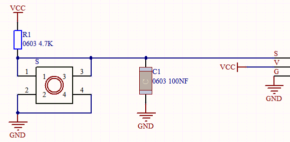
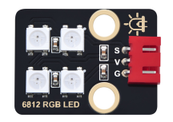

### 项目六 按键控灯

1.项目介绍

按键模块按下我们的单片机读取到低电平，松开读取到高电平。在这一实验课程中，我们利用按键和RGB做一个扩展，当按键按下时即读取到低电平时我们点亮RGB灯，松开按键时即读取到高电平时我们熄灭RGB灯，这样就可以通过一个模块控制另一个模块了。

2.模块相关资料



附原理图，按键有四个引脚，其中1和3是相连的，2和4是相连的，在我们未按下按键时，13与24是断开的，信号端S读取的是被4.7K的上拉电阻R1所拉高的高电平，而当我们按下按键时，13和24连通。信号端S连接到了GND，此时读取到的电平为低电平，即按下按键，传感器信号端为低电平；松开按键时，信号端为高电平。

3.实验组件

| 控制板 * 1                               | 扩展板 * 1                               | USB线*1                                  |
| ---------------------------------------- | ---------------------------------------- | ---------------------------------------- |
|  |  |  |
| 3P 转杜邦线母*1                          | RGB灯*1                                  | 按键*1                                   |
|  |  |  |

4.模块接线图


5.测试代码

```
/*
  Keyes Arduino 智能家居套装
  课程6
  按键控制RGB灯
  http://www.keyes-robot.com
*/

#include <Wire.h>
#include <Adafruit_NeoPixel.h>
Adafruit_NeoPixel  rgb_display(8);  //定义一个像素的类
int inpin = 4; //定义按键的管脚接数字口4
int val = 0; 

void setup ()
{
  rgb_display.begin();  //启动6812RGB
  rgb_display.setPin(13);  //设置6812管脚接数字口13
  rgb_display.setBrightness(100); //设置亮度为100，范围为0~255
  pinMode (inpin, INPUT); // 按键的管脚接数字口4并设置为输入模式
}

void loop ()
{
  val = digitalRead (inpin); // 读取按键值
  if (val == LOW) //按键按下时
  {
    rgb_display.setPixelColor(0, 255, 0, 0); //第一颗灯珠亮红色
    rgb_display.setPixelColor(1, 0, 255, 0); //第二颗灯珠亮绿色
    rgb_display.setPixelColor(2, 0, 0, 255); //第三颗灯珠亮蓝色
    rgb_display.setPixelColor(3, 255, 255, 255); //第四颗灯珠亮白色
    rgb_display.show(); //显示灯珠颜色
  }
  else
  {
    rgb_display.setPixelColor(0, 0, 0, 0); //第一颗灯珠亮红色
    rgb_display.setPixelColor(1, 0, 0, 0); //第二颗灯珠亮绿色
    rgb_display.setPixelColor(2, 0, 0, 0); //第三颗灯珠亮蓝色
    rgb_display.setPixelColor(3, 0, 0, 0); //第三颗灯珠亮蓝色
    rgb_display.show();
  }
}
```

6.实验结果

上传测试代码成功，上电后，当我们按下智能家居**⑪号位置**的按键，RGB灯被点亮，松开按键，RGB灯熄灭。

7.代码说明

```
digitalRead(button):读取按键的数字电平，高HIGH或者低LOW。如果该引脚未连接任何东西，则digitalRead（）可以返回HIGH或LOW（并且可以随机更改）

if..else..语句：当if后面（）的逻辑判断为真时，执行大括号里的代码；否则执行else后面{}里的代码。
```

