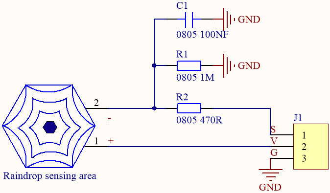
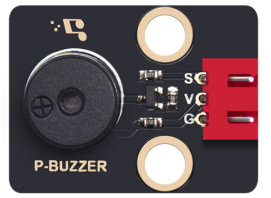
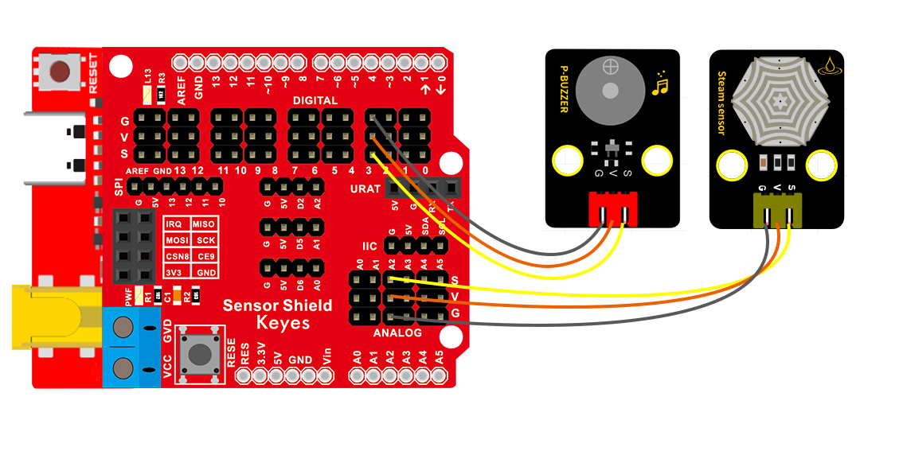
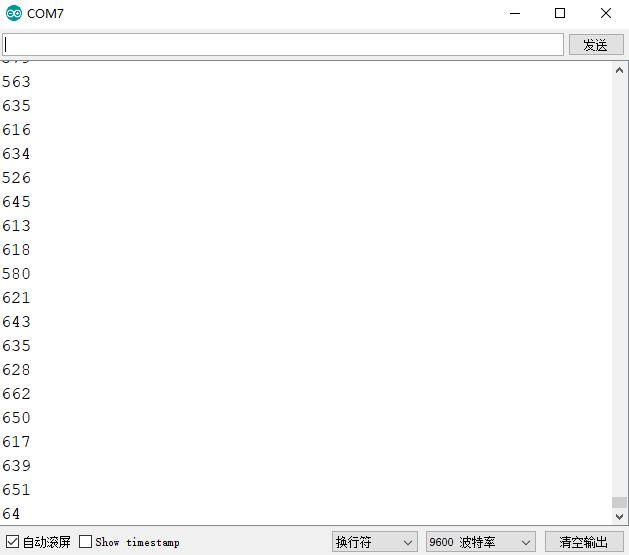

### 项目十 水滴警报

1.项目介绍


这是一个常用的水滴水蒸气传感器。它的原理是通过电路板上裸露的金属花纹区检测水量的大小。水量越多，就会有更多的导线被联通，随着导电的接触面积增大，输出的电压就会逐步上升。除了可以检测水量的大小，它还可以检测空气中的水蒸气。即：水滴传感器是一种模拟传感器，可以作为一个简单的雨水探测器和液位开关。当传感器表面的湿度升高时，输出电压将升高，读取到的模拟值即增大。

该传感器兼容各种单片机控制板，如Arduino系列单片机。实验中，将传感器信号端输入到开发板的模拟口，感知模拟值的变化，并在串口监视器上显示出对应的模拟值，当数值达到某一数值时控制蜂鸣器发声。

2.模块相关资料



-  工作电压： DC 3.3-5V
-  工作温度范围： －10℃～＋70℃

-  最大工作电流： 5uA (DC5V，或者当水滴传感器两脚直接短接)

-  控制接口： 模拟输出

3.实验组件

| 控制板 * 1                               | 扩展板 * 1                               | 无源蜂鸣器模块                           | 水滴水蒸气传感器模块*1                   | 3P 转杜邦线母 *2                         |
| ---------------------------------------- | ---------------------------------------- | ---------------------------------------- | ---------------------------------------- | ---------------------------------------- |
|  |  |  |  |  |

4.模块接线图



5.测试代码

```
/*
  Keyes Arduino 智能家居套装
  课程10
  水滴报警器
  http://www.keyes-robot.com
*/

int val = 0;
void setup() 
{
  pinMode(3, OUTPUT);//无源蜂鸣器接D3
  Serial.begin(9600); //设置波特率为9600
}

void loop() 
{
  val = analogRead(A2);//读取水滴模拟值
  Serial.println(val);
  if (val > 700) {//模拟值大于800
    tone(3, 392);         //控制引脚3输出模拟值为262的脉冲
    delay(125);         //延迟125毫秒
    tone(3, 392);
    delay(125);
  }
  else //否则蜂鸣器停止发声
  {
    noTone(3);
  }
}
```

6.实验结果

上传好测试程序，打开Arduino智能家居的电源开关，打开串口显示窗口，设置波特率为9600，我们看到在串口显示器中打印水滴传感器测到的湿度模拟值，传感器表面的湿度升高时，输出电压将升高，读取到的模拟值即增大，当大于700时，无源蜂鸣器发声警报。

