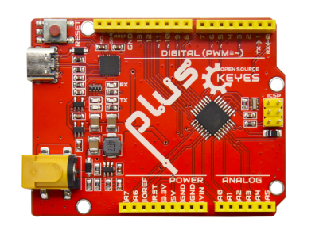
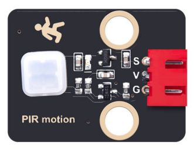

### 项目十一 人体红外传感器实验

1.项目介绍

人体红外热释电传感器是一款基于热释电效应的人体热释电红外运动传感器，能检测运动的人体或动物身上发出的红外信号，配合菲涅尔透镜能使传感器探测范围更远更广。它主要采用RE200B-P传感器元件，当附近有人或动物运动时，人体红外热释电传感器能根据检测到的红外线，将红外线信号转化为数字信号并输出一个高电平。它可以应用于多种场合来检测人体的运动。传统的热释电红外传感器体积大，电路复杂，可靠性低。

现在我们推出这款一款新的热释电红外运动传感器，该传感器集成了数字热释电红外传感器和连接管脚。具有灵敏度高、可靠性强、超低功耗，体积小、重量轻，超低电压工作模式和外围电路简单等特点。

2.模块相关资料


- 工作电压： DC 4.5-6.5V 
- 最大工作电流： 50MA

-  静态电流: &lt;50uA

-  控制接口： 数字输出(高电平为3.3V，低电平0V)

-  控制信号： 数字信号1/0

-  工作温度： -10 ~ 50 ℃

-  最大探测距离： 4米

-  感应角度： ＜100°锥角

-  触发方式: L 不可重复触发/H 重复触发

3.实验组件

| 控制板 * 1                               | 扩展板 * 1                               | 人体红外热释传感器* 1                    | 黄色LED模块*1                            |
| ---------------------------------------- | ---------------------------------------- | ---------------------------------------- | ---------------------------------------- |
|  |  |  |  |
| 130电机模块*1                            | 4P 转杜邦线母*1                          | 3P 转杜邦线母*2                          | USB线*1                                  |
|  |  |  |  |

4.模块接线图


5.测试代码

```
/*
 Keyes  Arduino智能家居套装
 第11课
 人体红外传感器
 www.keyes-robot.com
*/

void setup () 
{
   Serial.begin (9600); // 波特率9600
   pinMode (3, INPUT); // 定义人体红外传感器引脚D2,并设置为输入模式
   pinMode (5, OUTPUT); // 定义LED引脚D5,并设置为输出模式
   pinMode (7, OUTPUT); // 定义小风扇INB引脚D7,并设置为输出模式
   pinMode (6, OUTPUT); // 定义小风扇INA引脚D6,并设置为输出模式
}

void loop () 
{
   Serial.println (digitalRead (3));
   delay (500); // 延时 500ms
   // 如果检测到有人，黄色LED灯点亮，小风扇转动
   if (digitalRead (3) == 1) 
   {
     digitalWrite (5, HIGH); 
     digitalWrite (7, HIGH);
     analogWrite (6,150); 

   } 
   else //否则黄色LED灯熄灭，小风扇停止转动
   {
     digitalWrite (5, LOW); 
     digitalWrite (7, LOW);
     analogWrite (6,0); 
   }
}
```

6.实验结果

上传好代码，打开串口监视器，设置波特率为9600，如果人体红外热释电传感器检测到人体在附近运动时，串口监视器上显示数字信号1，同时外接在数字引脚5的黄色LED将亮起，小风扇转起；如果未检测到人体在附近运动时，串口监视器上显示数字信号0，同时外接在数字引脚5的黄色LED不亮，小风扇停止转起。


