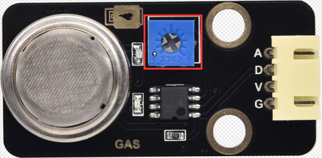
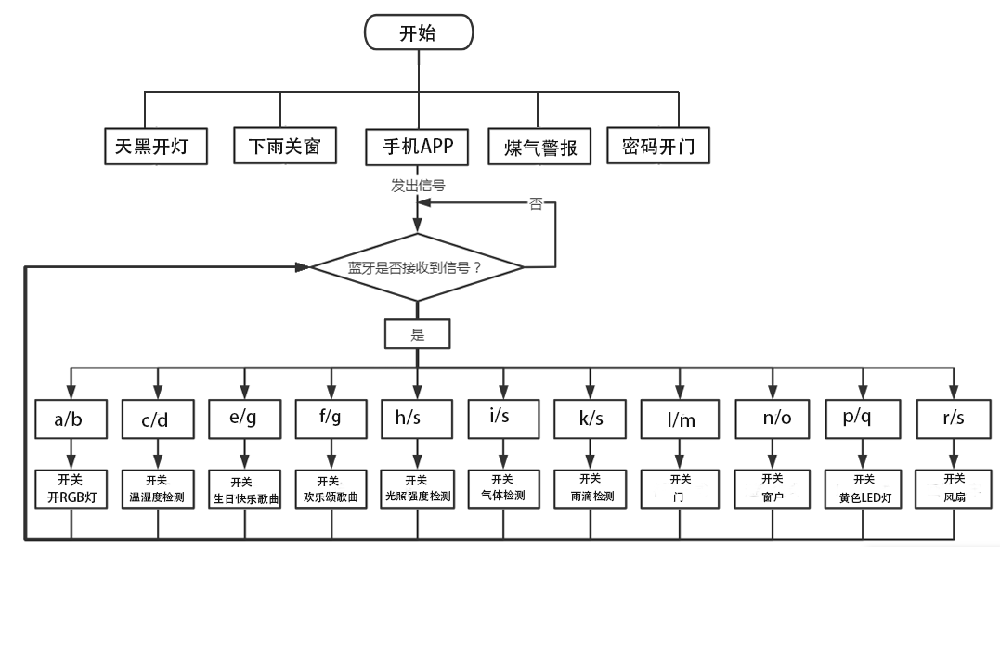

### 项目十七 智能家居完整版课程

1.项目介绍

前面已经安装了智能家居套件的结构部分和学习了各传感器和模块的使用方法，在最后这个综合的实验中，我们来实现智能家居的所有功能。

2.实验主要组件

| 控制板 * 1                               | 扩展板 * 1                               | USB线*1                                  | LED模块                                  | 6812模块                                 |
| ---------------------------------------- | ---------------------------------------- | ---------------------------------------- | ---------------------------------------- | ---------------------------------------- |
|  |  |  |  |  |
| 无源蜂鸣器模块                           | Keyes 光敏电阻传感器*1                   | Keyes130电机模块*1                       | 180度舵机*2                              | Keyes水滴水蒸气传感器模块*1              |
|  |  |  |  |  |
| Keyes人体红外热释传感器*1                | KeyesMQ2传感器*1                         | KeyesXHT11传感器*1                       | Keyes LCD1602模块* 1                     | BT-24蓝牙*1                              |
|  |  |  |  |  |
| Keyes按键*2                              | 充电模块*1                               | 4P 转杜邦线母若干                        | 3P 转杜邦线母若干*1                      |                                          |
|  |  |  |  |                                          |

3.接线图


传感器模块名称

传感器模块引脚与传感器扩展板对应的接线

 人体红外传感器模块 G/V/S G/V/2

 无源蜂鸣器模块 G/V/S G/V/3

 按键传感器模块1 G/V/S G/V/4

 黄色LED模块 G/V/S G/V/5

 小风扇模块 GND/VCC/IN+/IN- G/V/6/7

 按键传感器模块2 G/V/S G/V/8

 控制门的舵机1 棕色线/红色线/橙色线 G/V/9

 控制窗的舵机2 棕色线/红色线/橙色线 G/V/10

 MQ-2烟雾传感器模块 GND/VCC/D0/A0 G/V/11/A0

 XHT11模块 G/V/S G/V/12

 GRB灯模块 G/V/S G/V/13

 LCD1602显示屏模块 GND/VCC/SDA/SCL GND/5V/SDA/SCL

 光敏传感器模块 G/V/S G/V/A1

 水蒸气传感器模块 G/V/S G/V/A2

 BT-24蓝牙模块 5V/G/RX/TX VCC/GND/TX/RX

4.流程图



5.测试代码

```
/*
 Arduino 智能家居套装
 Project 17
 www.keyes-robot.com
*/
#include <Servo.h>//调用相关库文件
#include <Wire.h>
#include <LiquidCrystal_I2C.h>
#include <Adafruit_NeoPixel.h>
#include <dht11.h> 
#define DHT11_PIN 12 //定义DHT11为数子口12

LiquidCrystal_I2C mylcd(0x27,16,2);
dht11 DHT;
Adafruit_NeoPixel  rgb_display(4);  //定义一个像素的类
volatile int btn1_num;//设置变量btn1_num
volatile int btn2_num;//设置变量btn2_num
volatile int button1;//设置变量button1
volatile int button2;//设置变量button2
String fans_char;    //string类型变量fans_char
volatile int fans_val; //设置变量fans_char
volatile int flag;  //设置变量flag
volatile int flag2; //设置变量flag2
volatile int flag3; //设置变量flag3
volatile int gas; //设置变量gas
volatile int infrar; //设置变量infrar
String led2; //string类型变量led2
volatile int light; //设置变量light
String pass; //string类型变量 pass
String passwd; //string类型变量passwd
String servo1; //string类型变量servo1
volatile int servo1_angle; //设置变量light
String servo2; //string类型变量servo2
volatile int servo2_angle; //设置变量servo2_angle
volatile int soil; //设置变量soil
volatile int val;  //设置变量 val
volatile int value_led2; //设置变量value_led2
volatile int water; //设置变量water

void DHT11()
{
   int chk;
  chk = DHT.read(DHT11_PIN);    // READ DATA
  switch (chk) 
  {
    case DHTLIB_OK:
      break;
    case DHTLIB_ERROR_CHECKSUM: //校检和错误返回
      break;
    case DHTLIB_ERROR_TIMEOUT: //超时错误返回
      break;
    default:
      break;
  }
  // DISPLAT DATA
  mylcd.setCursor (0, 0);
  mylcd.print ("humidity:   %");
  mylcd.setCursor (0, 1);
  mylcd.print ("temperature:  C");
  mylcd.setCursor (10, 0);
  mylcd.print (DHT.humidity);//第一行显示湿度
  mylcd.setCursor (12, 1);
  mylcd.print (DHT.temperature);//第二行显示温度
  Serial.print("humidity:");
  Serial.print(DHT.humidity);
  Serial.print("   temperature:");
  Serial.println(DHT.temperature);
  delay(200);
}
  
void birthday()//设置生日快乐歌曲
{
  tone(3,294);//数字口3输出294Hz频率声音
  delay(250); //延迟250毫秒
  tone(3,440);
  delay(250);
  tone(3,392);
  delay(250);
  tone(3,532);
  delay(250);
  tone(3,494);
  delay(500);
  tone(3,392);
  delay(250);
  tone(3,440);
  delay(250);
  tone(3,392);
  delay(250);
  tone(3,587);
  delay(250);
  tone(3,532);
  delay(500);
  tone(3,392);
  delay(250);
  tone(3,784);
  delay(250);
  tone(3,659);
  delay(250);
  tone(3,532);
  delay(250);
  tone(3,494);
  delay(250);
  tone(3,440);
  delay(250);
  tone(3,698);
  delay(375);
  tone(3,659);
  delay(250);
  tone(3,532);
  delay(250);
  tone(3,587);
  delay(250);
  tone(3,532);
  delay(500);
}

//定义各个声音频率名称
#define D0 -1
#define D1 262
#define D2 293
#define D3 329
#define D4 349
#define D5 392
#define D6 440
#define D7 494
#define M1 523
#define M2 586
#define M3 658
#define M4 697
#define M5 783
#define M6 879
#define M7 987
#define H1 1045
#define H2 1171
#define H3 1316
#define H4 1393
#define H5 1563
#define H6 1755
#define H7 1971

#define WHOLE 1
#define HALF 0.5
#define QUARTER 0.25
#define EIGHTH 0.25
#define SIXTEENTH 0.625
//设置两个舵机接口 分别是数字口9和数字口10
Servo servo_10;
Servo servo_9;
//设置声音播放频率
int tune[]=
{
  M3,M3,M4,M5,
  M5,M4,M3,M2,
  M1,M1,M2,M3,
  M3,M2,M2,
  M3,M3,M4,M5,
  M5,M4,M3,M2,
  M1,M1,M2,M3,
  M2,M1,M1,
  M2,M2,M3,M1,
  M2,M3,M4,M3,M1,
  M2,M3,M4,M3,M2,
  M1,M2,D5,D0,
  M3,M3,M4,M5,
  M5,M4,M3,M4,M2,
  M1,M1,M2,M3,
  M2,M1,M1
};

//设置音乐节拍
float durt[]=
 {
  1,1,1,1,
  1,1,1,1,
  1,1,1,1,
  1+0.5,0.5,1+1,
  1,1,1,1,
  1,1,1,1,
  1,1,1,1,
  1+0.5,0.5,1+1,
  1,1,1,1,
  1,0.5,0.5,1,1,
  1,0.5,0.5,1,1,
  1,1,1,1,
  1,1,1,1,
  1,1,1,0.5,0.5,
  1,1,1,1,
  1+0.5,0.5,1+1,
 };

 int length;
 int tonepin=3;//设置无源蜂鸣器信号端为数字口3

void Ode_to_Joy()//播放欢乐颂歌曲
{
  for(int x=0;x<length;x++)
  {
    tone(tonepin,tune[x]);
    delay(300*durt[x]);
  }
}

//气体检测
void auto_sensor() 
{
  gas = analogRead(A0);//模拟口A0的模拟值赋值给gas
  if (gas > 700) {    //如果变量gas大于1000
    flag = 1; //变量flag设为1
    while (flag == 1) { //如果flag为1，循环程序
      Serial.println("danger"); //换行输出"danger"字符
      tone(3,440);
      delay(125);
      delay(100);
      noTone(3);
      delay(100);
      tone(3,440);
      delay(125);
      delay(100);
      noTone(3);
      delay(300);
      gas = analogRead(A0); //模拟口A0的模拟值赋值给gas
      if (gas < 100)         //如果变量gas小于100
      {
        flag = 0; //变量flag设为0
        break;    //退出循环

      }
    }

  } else {
    noTone(3);  //数字口3停止输出音乐

  }
  //功能：天黑人路过灯亮
  light = analogRead(A1); //模拟口A1的模拟值赋值给 light 
  if (light < 300) {      //如果变量light小于300
    infrar = digitalRead(2); //数字口2的数字值赋值给变量infrar
    Serial.println(infrar);  
    if (infrar == 1) {       //如果变量infra为1
      rgb_display.setPixelColor(0, 255, 0, 0); //RGB灯亮红色
      rgb_display.setPixelColor(1, 255, 0, 0); 
      rgb_display.setPixelColor(2, 255, 0, 0); 
      rgb_display.setPixelColor(3, 255, 0, 0); 
      rgb_display.show(); //显示灯珠颜色

    } else {
      rgb_display.setPixelColor(0, 0, 0, 0); //熄灭RGB灯
      rgb_display.setPixelColor(1, 0, 0, 0); 
      rgb_display.setPixelColor(2, 0, 0, 0); 
      rgb_display.setPixelColor(3, 0, 0, 0); 
      rgb_display.show(); 
    }

  }
  
  //功能：检测到下雨关窗
  water = analogRead(A2);//读取水滴传感器检测数值
  if (water > 800) {    //当数据大于800时舵机转动120度关窗
    flag2 = 1;
    while (flag2 == 1) {
      Serial.println("rain");
      servo_10.write(0);
      delay(400);
      water = analogRead(A2); //如果变量water小于30
      if (water < 30) {
        flag2 = 0; //变量flag2设置为0
        break;    //退出循环程序
      }
    }
  } else {
    if (val != 'u' && val != 'o') {
      servo_10.write(120); //数字口10处舵机设置为120度
      delay(10);
    }
  }
  door();//运行子程序
}

//功能函数：输入密码开门
void door() 
{
  button1 = digitalRead(4);//数字看4的数字值赋值给变量button1
  button2 = digitalRead(8);//数字看8的数字值赋值给变量button2
  if (button1 == 0) //如果变量button1为0
  {
    delay(10); //延迟10毫秒
    while (button1 == 0) //如果变量button1为0，循环程序
    {  
      button1 = digitalRead(4); //数字看4的数字值赋值给变量button1
      btn1_num = btn1_num + 1;  //变量btn1_num加1
      delay(100); //延迟100毫秒
    }

  }
  if (btn1_num >= 1 && btn1_num < 5) //如果变量btn1_num大于等于1并且小于5
  { 
    Serial.print(".");
    Serial.print("");
    passwd = String(passwd) + String("."); //设置passwd 字符
    pass = String(pass) + String("*"); //设置pass字符
    mylcd.setCursor(1-1, 2-1); //LCD从第一行第一个字符开始显示pass字符
    mylcd.print(pass);

  }
  //如果变量btn1_num大于等于5
  if (btn1_num >= 5) 
  {
    Serial.print("-");
    passwd = String(passwd) + String("-"); //设置passwd 字符
    pass = String(pass) + String("*"); //设置pass字符
    mylcd.setCursor(1-1, 2-1); //LCD从第一行第一个字符开始显示pass字符
    mylcd.print(pass);
  }
  if (button2 == 0) //如果变量button2为0
  {
    delay(10);
    if (button2 == 0) //如果变量button2为0
    {
      if (passwd == ".--.-.") //如果passwd字符为".--.-."
      {
        mylcd.clear();//LCD清屏
        mylcd.setCursor(1-1, 2-1);//LCD从第二行第一个字符开始显示"open!"字符
        mylcd.print("open!");
        servo_9.write(180);//数字口9处舵机设置为180度
        delay(300);
        delay(5000);
        passwd = "";
        pass = "";
        mylcd.clear();
        mylcd.setCursor(1-1, 1-1);
        mylcd.print("password:");

      } 
      else 
      {
        mylcd.clear();
        mylcd.setCursor(1-1, 1-1);
        mylcd.print("error!");
        passwd = "";
        pass = "";
        delay(2000);
        mylcd.setCursor(1-1, 1-1);
        mylcd.print("again");

      }
    }
  }
  infrar = digitalRead(2); //读取人体红外传感器数据
  //如果变量infrar为0且val字符不是'l' 和 't'字符
  if (infrar == 0 && (val != 'l' && val != 't')) 
  {
    servo_9.write(0);//数字口9处舵机设置为0度
    delay(50);
  }
  if (button2 == 0) //如果变量button2为0
  {
    delay(10);
    while (button2 == 0) 
    {
      button2 = digitalRead(8);//数字口8的数字值赋值给变量button2
      btn2_num = btn2_num + 1;//变量btn2_num加1
      delay(100);
      if (btn2_num >= 15)  //如果变量btn2_num大于等于15
      { 
        tone(3,532);
        delay(125);
        mylcd.clear();
        //LCD从第一行第一个字符开始显示"wait"字符
        mylcd.setCursor(1-1, 1-1);
        mylcd.print("password:");

      } 
      else 
      {
        noTone(3);//数字口3设置停止播放音乐
      }
    }
  }
  btn1_num = 0;//变量 btn1_num设置为0
  btn2_num = 0;//变量 btn2_num设置为0
}
//生日快乐歌曲

void music1() 
{
  birthday();
}
//欢乐颂歌曲
void music2() 
{
  Ode_to_Joy();
}
//PWM控制
void pwm_control() 
{
  switch (val) 
  {
   case 't'://val为字符't'时，循环程序
    servo1 = Serial.readStringUntil('#');
    servo1_angle = String(servo1).toInt();
    servo_9.write(servo1_angle); //数字口9舵机角度设置为servo1_angle
    delay(300);//退出循环
    break;
   case 'u': //val为字符'u'时，循环程序
    servo2 = Serial.readStringUntil('#');
    servo2_angle = String(servo2).toInt();
    servo_10.write(servo2_angle);//数字口10舵机角度设置为servo2_angle
    delay(300);
    break; //退出循环
   case 'v': //val为字符'v'时，循环程序
    led2 = Serial.readStringUntil('#');
    value_led2 = String(led2).toInt();
    analogWrite(5,value_led2); //数字口5的PWM值为value_led2
    break; //退出循环
   case 'w': //val为字符'w'时，循环程序
    fans_char = Serial.readStringUntil('#');
    fans_val = String(fans_char).toInt();
    digitalWrite(7,LOW);
    analogWrite(6,fans_val);//设置数字口6的PWM值为fans_val，数值越大，风扇速度越快
    break;//退出循环
  }
}

void setup()
{
  Serial.begin(9600);//设置波特率为9600
  rgb_display.begin();  //启动6812RGB
  rgb_display.setPin(13);  //设置6812管脚接数字口13
  rgb_display.setBrightness(80); //设置亮度为100，范围为0~255
  rgb_display.setPixelColor(0, 0, 0, 0); //熄灭RGB灯
  rgb_display.setPixelColor(1, 0, 0, 0); 
  rgb_display.setPixelColor(2, 0, 0, 0); 
  rgb_display.setPixelColor(3, 0, 0, 0); 
  rgb_display.show(); 
  mylcd.init();
  mylcd.backlight();//初始LCD设置
  servo_9.attach(9);//设置舵机连接在数字口9
  servo_10.attach(10);//设置舵机连接在数字口10
  pinMode(7, OUTPUT);//数字口7设置为输出
  pinMode(6, OUTPUT);//数字看6设置为输出
  servo_9.write(0);//数字口9处舵机设置为0度
  delay(300);
  servo_10.write(120);//数字口10处舵机设置为120度
  delay(300);
  //LCD从第一行第一个位置显示"passcord:"字符
  mylcd.setCursor(0, 0);
  mylcd.print("password:");
  digitalWrite(7,HIGH);//数字口7设置为高电平
  digitalWrite(6,HIGH);//数字口6设置为高电平
  pinMode(4, INPUT);//数字口4设置为输入
  pinMode(8, INPUT);//数字口8设置为输入
  pinMode(2, INPUT);//数字口2设置为输入
  pinMode(3, OUTPUT);//数字口3设置为输出
  pinMode(A0, INPUT);//A0端设置为输入
  pinMode(A1, INPUT);//A1端设置为输入
  pinMode(A2, INPUT);//A2端设置为输入
  val = 0;//变量val设置为0
  button1 = 0;//变量 button1设置为0
  button2 = 0;//变量 button2设置为0
  btn1_num = 0;//变量 btn1_num设置为0
  btn2_num = 0;
  passwd = "";
  pass = "";
  gas = 0;
  flag = 0;
  light = 0;
  infrar = 0;
  water = 0;
  flag2 = 0;
  soil = 0;
  flag3 = 0;
  servo1 = "";
  servo1_angle = 0;
  servo2 = "";
  servo2_angle = 0;
  led2 = "";
  value_led2 = 0;
  fans_char = "";
  fans_val = 0;
  pinMode(5, OUTPUT);
  pinMode(3, OUTPUT);
  length=sizeof(tune)/sizeof(tune[0]);
}

void loop()
{
  auto_sensor();
  if (Serial.available() > 0) //串口读取到字符
  {
    val = Serial.read();//val设置为串口读取到的字符
    Serial.println(val);//换行输出val字符
    pwm_control();

  }
  switch (val) 
  {
   case 'a': //如果val为 'a'字符，循环程序
    rgb_display.setPixelColor(0, 0, 0, 255); //RGB灯亮蓝色
    rgb_display.setPixelColor(1, 0, 0, 255);
    rgb_display.setPixelColor(2, 0, 0, 255);
    rgb_display.setPixelColor(3, 0, 0, 255);
    rgb_display.show(); //显示灯珠颜色
    break;
   case 'b':
    rgb_display.setPixelColor(0, 0, 0, 0); //熄灭RGB灯
    rgb_display.setPixelColor(1, 0, 0, 0);
    rgb_display.setPixelColor(2, 0, 0, 0);
    rgb_display.setPixelColor(3, 0, 0, 0);
    rgb_display.show();
    break;
   case 'e':
    music1();//播放生日快乐歌曲
    break;
   case 'f':
    music2();//播放欢乐颂歌曲
    break;//退出循环
   case 'g':
    noTone(3);//数字口3设置停止播放音乐
    break;
   case 'h':
    Serial.println(light);//换行输出变量light数值
    delay(100);
    break;
   case 'i':
    Serial.println(gas);//换行输出变量gas数值
    delay(100);
    break;
   case 'j':
    Serial.println(soil);//换行输出变量soil数值
    delay(100);
    break;
   case 'k':
    Serial.println(water);//换行输出变量water数值
    delay(100);
    break;
   case 'l':
    servo_9.write(100);//数字口9处舵机设置为100度
    delay(500);
    break;
   case 'm':
    servo_9.write(0);//数字口9处舵机设置为0度
    delay(500);
    break;
   case 'n':
    servo_10.write(120);
    delay(500);
    break;
   case 'o':
    servo_10.write(0);
    delay(500);
    break;
   case 'p':
    digitalWrite(5,HIGH);//数字口5设置为高电平,LED亮起
    break;
   case 'q':
    digitalWrite(5,LOW);//数字口5设置为低电平LED熄灭
    break;
   case 'r':
    digitalWrite(7,LOW);//风扇以最快速度逆时针转动
    digitalWrite(6,HIGH);
    break;
   case 's':
    digitalWrite(7,LOW);//小风扇停止转动
    digitalWrite(6,LOW);
    break;
  }
  //如果字符为“C”,LCD屏上显示温湿度
  if (val == 'c')
  {
    DHT11();
    delay(400);
    mylcd.clear();
  }
   //否则如果字符为“d”,切换密码开门功能模式
  else if (val == 'd')
  {
    mylcd.setCursor(0, 0);
    mylcd.print("password:");
    door();
  }
}

```

6.代码说明

（1）在上传代码时，不能连接蓝牙模块，需要把蓝牙模块取下，否则整个程序代码上传不成功。上传测试代码成功后再插上蓝牙模块，配对，连接APP。

（2）APP的下载和使用参考**第16课**

7.实验结果

组装好智能家居，上传好上面的实验程序，太阳能电源板的开关拨到ON位置，按下船型开关的1,打开手机APP连接好蓝牙，按下APP的功能按键就可以控制智能家居了，功能如下：

（1）

按钮:

功能：配对连接BT-24蓝牙模块

 按钮:


功能：断开蓝牙连接

按钮:控制字符：点一下发送 “a”；再点一下发送“b”。 功能：点一下，开启门前的RGB灯；再点一下，关闭门前的RGB灯。

 按钮:控制字符：点一下发送 “c”；再点一下发送“d”。 功能：点一下，LCD屏显示温湿度；再点一下，进入输入密码开锁模式。

 按钮:控制字符：按住发送 “e”；松开发送“g”。 功能：点一下，播放一次生日快乐歌曲。

 按钮:控制字符：按住发送 “f”；松开发送“g”。 功能：点一下，播放一首欢乐颂音乐。

 按钮:控制字符：点一下发送 “h”；再点一下发送“S”。 功能：点一下，开始接收光敏传感器检测到的数据，light处显示检测到的数据；再点一下，关闭光敏传感器。

按钮:控制字符：点一下发送 “i”；再点一下发送“S”。 功能：点一下，开始接收气体传感器检测到的数据，gas处显示检测到的数据；再点一下，关闭气体传感器。

按钮:控制字符：点一下发送 “j”；再点一下发送“S”。 这里没有功能，可自行扩展其他其他传感器。

 按钮:控制字符：点一下发送 “k”；再点一下发送“S”。 功能：点一下，开始接收水蒸气传感器检测到的数据，water处显示检测到的数据；再点一下，关闭水蒸气传感器。

按钮:控制字符：点一下发送 “l”；再点一下发送“m”。 功能：点一下，开启门；再点一下，关闭门。

拖动条:

控制字符：拖动拖动条松开时发送“t 50#”，字符‘t’表示起始字符；数字50表示舵机1的角度；字符‘#’表示终止字符。 功能：拖动条，控制门的转动大小，就是控制舵机1的角度，door处显示拖动条对应的值。

 按钮: 控制字符：点一下发送 “n”；

再点一下发送“o”。 功能：点一下，开启窗户；
再点一下，关闭窗户。

 拖动条:

 控制字符：拖动拖动条松开时发送“u 34
#”，字符‘u’表示起始字符；数字34表示舵机2的角度；字符‘#’表示终止字符。 功能：拖动条，控制窗户的转动大小，就是控制舵机2的角度，win处显示拖动条对应的值。

 按钮: 控制字符：点一下发送 “p”；
再点一下发送“q”。 功能：点一下，开启室内LED；
再点一下，关闭室内LED。

 拖动条:

 控制字符：拖动拖动条松开时发送“v 100
#”，字符‘v’表示起始字符；数字100表示led2的PWM值；字符‘#’表示终止字符。 功能：拖动条，控制室内LED的亮度，led2处显示拖动条对应的PWM值。

 按钮: 控制字符：点一下发送 “r”；
再点一下发送“s”。 功能：点一下，开启小风扇；
再点一下，关闭小风扇。

 拖动条:

 控制字符：拖动拖动条松开时发送“w 153
#”，字符‘w’表示起始字符；数字153表示小风扇的PWM值；字符‘#’表示终止字符。 功能：拖动条，控制小风扇的转速，fans处显示拖动条对应的PWM值。

（2）煤气警报：当MQ2气体传感器检测到煤气泄漏时（数值\>700，这里可以用打火机气体测试）,蜂鸣器发声警报，小于100时停止发声。

（3）下雨关窗：当水滴滴传感器检测数据大于800时，接在引脚10的舵机转动120度关窗，否则转到零度。

（4）天黑开灯：当光敏传感器检测数据小于300并且人体红外传感器检测到有人时，RGB灯亮红色；否则熄灭RGB灯。

（5）输入密码开门：门上有1602LCD显示屏、两个按钮、舵机1，按按钮1输入密码，正确密码是:**. - - . - .****(”.”的意思是点击按钮，” -”的意思是长按按钮2S以上)**输入一位显示屏就显示一个“\*”号，密码输入完成，按下按钮2，如果密码正确，显示屏显示open，舵机1转到180度，开门，5秒之后，人体红外传感器检测到没人时就会自动关门。如果密码错误，显示屏显示error，两秒后显示again之后可重新输入密码。还可以长按，按钮2，蜂鸣器会响，相当于门铃。
