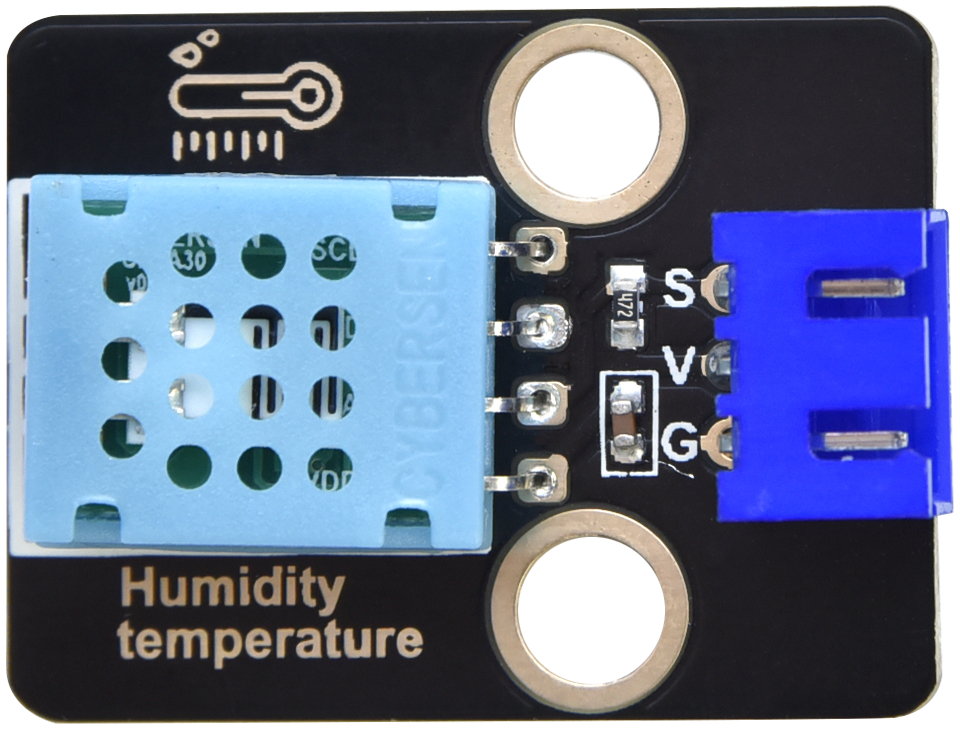
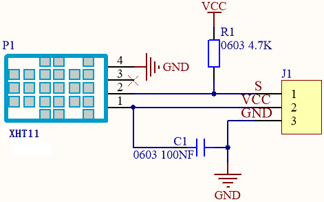
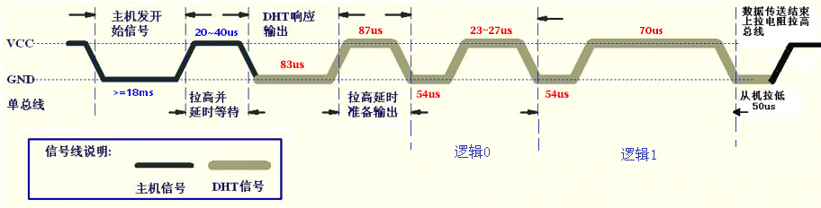
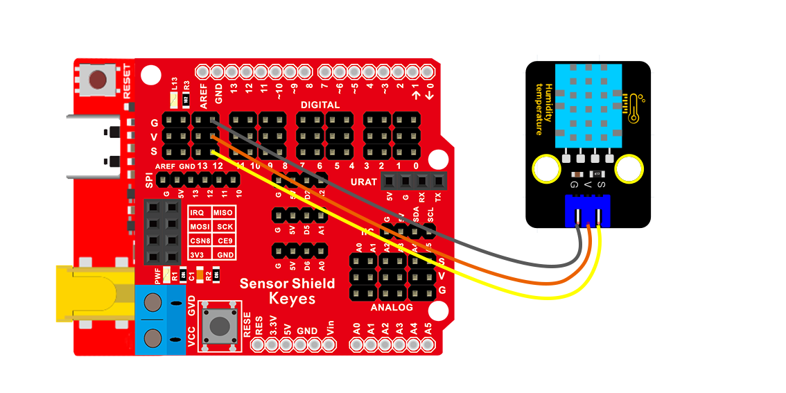
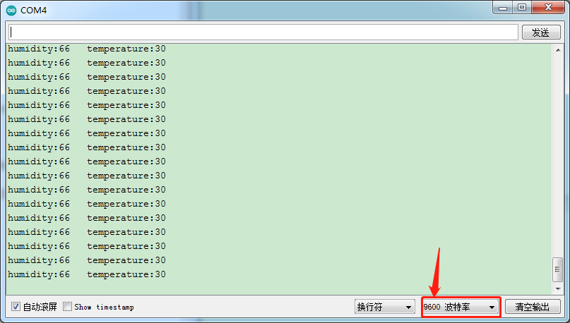

### 项目十三 XHT11温湿度传感器

1.项目介绍



XHT11温湿度传感器（XHT11完全兼容DHT11）是一款含有已校准数字信号输出的温湿度复合传感器，其精度：湿度±5%RH，温度±2℃；量程：湿度20-90%RH，温度0~50℃。

XHT11温湿度传感器应用专用的数字模块采集技术和温湿度传感技术，确保产品具有极高的可靠性和卓越的长期稳定性。XHT11温湿度传感器包括一个电阻式感湿元件和一个NTC测温元件，非常适用于对精度和实时性要求不高的温湿度测量场合。

XHT11有三个引脚，分别为V，G，和S。S为数据输出的引脚，使用的是串行通讯。

2.模块相关资料



- 工作电压： 3.3V-5V（DC） 
- 最大工作电流： 50mA

-  最大功率： 0.25W

-  控制接口： 数字双向单总线

-  温度范围： 0-50℃（±2℃）

-  湿度范围： 20-90%RH（±5%RH）

-  工作温度： -25℃~+60℃

- XHT11温湿度传感器的单总线格式定义：

-  名称:单总线格式定义

-  起始信号:微处理器把数据总线（SDA）拉低一段时间至少 18ms（最大不得超过30ms），通知传感器准备数据。

-  响应信号：传感器把数据总线（SDA）拉低 83µs，再接高 87µs以响应主机的起始信号。

-  湿度：湿度高位为湿度整数部分数据，湿度低位为湿度小数部分数据

-  温度：温度高位为温度整数部分数据，温度低位为温度小数部分数据，且温度低位Bit8 为 1 则表示负温度，否则为正温度。

-  校验位：校验位＝湿度高位+湿度低位+温度高位+温度低位

HT11温湿度传感器数据时序图：用户主机（MCU）发送一次开始信号后，XHT11从低功耗模式转换到高速模式，待主机开始信号结束后，XHT11发送响应信号，送出 40bit 的数据，并触发一次信采集。信号发送如图所示。



3.实验组件

| 控制板 * 1                               | 扩展板 * 1                               | USB线*1                                  | XHT11传感器 *1                           | 3P 转杜邦线母 *1                         |
| ---------------------------------------- | ---------------------------------------- | ---------------------------------------- | ---------------------------------------- | ---------------------------------------- |
|  |  |  |  |  |

4.模块接线图



5.测试代码

```
/*
  Keyes Arduino 智能家居套装
  课程 13
  DHT11温湿度传感器
  http://www.keyes-robot.com
*/

#include <dht11.h>  //include the library code:
dht11 DHT;
#define DHT11_PIN 12 //定义DHT11为数子口12

void setup() 
{
  Serial.begin(9600);
}

void loop() 
{
  int chk;
  chk = DHT.read(DHT11_PIN);    // READ DATA
  switch (chk) 
  {
    case DHTLIB_OK:
      break;
    case DHTLIB_ERROR_CHECKSUM: //校检和错误返回
      break;
    case DHTLIB_ERROR_TIMEOUT: //超时错误返回
      break;
    default:
      break;
  }
  // DISPLAT DATA
  Serial.print("humidity:");
  Serial.print(DHT.humidity);
  Serial.print("   temperature:");
  Serial.println(DHT.temperature);
  delay(200);
}
```

6.实验结果

上传测试代码成功，利用USB线上电后，打开串口监视器，设置波特率为9600。串口监视器显示当前环境中的温湿度数据，如下图：



7.代码说明

(1)在实验中，我们需要先导入DHT11的库文件。

(2)我们把管脚设置为3，**DHT.temperature**获取温度和**DHT.humidity**获取湿度。

(3)设置两个小数变量，分别为val1和val2，将所测结果赋值给val1和val2。

(4)串口监视器显示val1和val2的值，显示前需设置波特率（我们默认设置为9600，可更改）。

(5)显示时，我们在数据后面添加单位。如果温度单位直接设置为℃，测试结果可能出现乱码，所以我们直接用C代替℃；湿度单位直接设置为%。