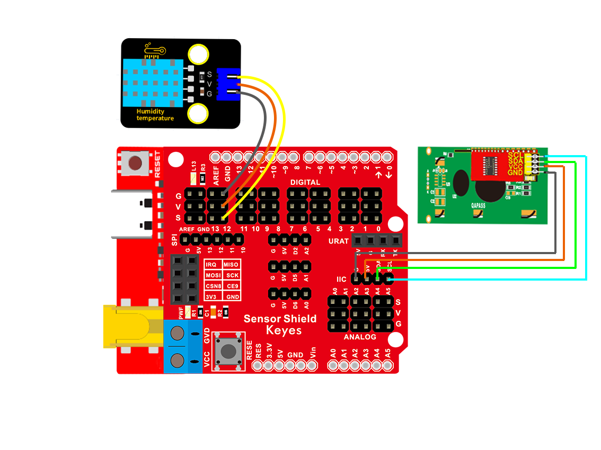
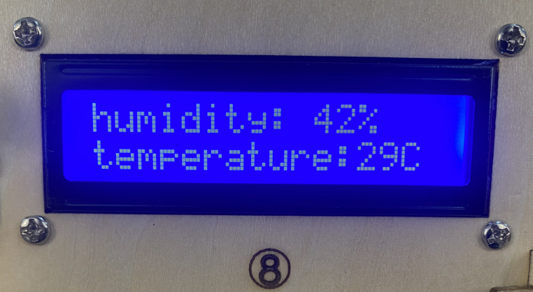

### 项目十五 温湿度仪表

1.项目介绍

在冬季时，空气中的湿度很低，就是空气很干燥，再加上寒冷，人体的皮肤就容易过于干燥而裂，所以需要再用加湿器给家里的空气增加湿度，但是怎么知道空气过于干燥了呢？那就需要检测空气湿度的设备。前面我们已经学习了XHT11温湿度传感器和LCD1602显示器，这节课我们就使用这两者结合做一个实验，让温湿度在LCD1602显示，实现温湿度仪表功能。

2.实验组件

| 控制板 * 1                               | 扩展板 * 1                               | USB线*1                                  | XHT11传感器 *1                           |
| ---------------------------------------- | ---------------------------------------- | ---------------------------------------- | ---------------------------------------- |
|  |  |  |  |
| 3P 转杜邦线母*1                          | Keyes LCD1602模块* 1                     | 4P 转杜邦线母*1                          |                                          |
|  |  |  |                                          |

3.模块接线图



4.测试代码

```
/*
  Keyes Arduino 智能家居套装
  课程 15
  温湿度表
  http://www.keyes-robot.com
*/

#include <dht11.h>  //include the library code:
#include <Wire.h>
#include <LiquidCrystal_I2C.h>
LiquidCrystal_I2C lcd (0x27, 16, 2); //16个字符和2行显示，LCD IIC地址为0x27
dht11 DHT;
#define DHT11_PIN 12 //定义DHT11为数子口12

void setup() 
{
  lcd.init (); //初始化
  lcd.backlight ();//LCD清屏
  Serial.begin(9600);
}

void loop() 
{
  int chk;
  chk = DHT.read(DHT11_PIN);    // READ DATA
  switch (chk) 
  {
    case DHTLIB_OK:
      break;
    case DHTLIB_ERROR_CHECKSUM: //校检和错误返回
      break;
    case DHTLIB_ERROR_TIMEOUT: //超时错误返回
      break;
    default:
      break;
  }
  // DISPLAT DATA
  lcd.setCursor (0, 0);
  lcd.print ("humidity:   %");
  lcd.setCursor (0, 1);
  lcd.print ("temperature:  C");
  lcd.setCursor (10, 0);
  lcd.print (DHT.humidity);//第一行显示湿度
  lcd.setCursor (12, 1);
  lcd.print (DHT.temperature);//第二行显示温度
  Serial.print("humidity:");
  Serial.print(DHT.humidity);
  Serial.print("   temperature:");
  Serial.println(DHT.temperature);
  delay(200);
}
```

5.实验结果

上传好示例程序，打开Arduino智能家居的电源开关，就可以看到LCD1602显示器第一行显示湿度，第二行显示温度。

