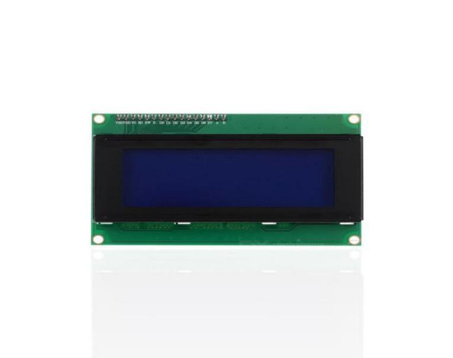

### 项目十四 LCD1602显示

1.项目介绍



Keyes I2C 1602 LCD模块是可以显示2行，每行16个字符的液晶显示器模块。液晶显示器显示蓝底白字，自带I2C通信模块，使用时只需连接单片机I2C通信接口，大大节约了单片机资源。最初的1602 LCD需要7个IO端口来启动和运行，而Keyes I2C 1602 LCD模块内置Arduino IIC/I2C接口，节省了5个IO端口。和Arduino液晶库文件兼容，用起来很简单。

LCD非常适合打印数据和显示数字。可以显示32个字符(16x2)。在Keyes I2C 1602 LCD模块的背面有一个蓝色的电位器，可以转动电位器来调整对比度。**连接时请注意，LCD的GND和VCC不能接反，否则会损坏LCD。**

2.模块相关资料

- 工作电压： DC5V I2C地址： 0x27 控制接口： I2C

-  工作电流： &lt; 130mA 工作环境温度： 0°C ~ 45°C（推荐） 驱动芯片： PCF8574T

- GND：一个接地的引脚

- VCC：一个连接到+5V电源的引脚

- SDA：一个连接到SDA（或A4）的引脚，用于IIC通信

- SCL：一个连接到SCL（或A5）的引脚，用于IIC通信

- 背光（蓝底白字）

- 可调对比度

3.实验组件

| 控制板 * 1                               | 扩展板 * 1                               | Keyes LCD1602模块* 1                     | 4P 转杜邦线母*1                          |
| ---------------------------------------- | ---------------------------------------- | ---------------------------------------- | ---------------------------------------- |
|  |  |  |  |

4.模块接线图


5.测试代码

```
/*
 Arduino 智能家居套装
 第14课 
 1602 LCD显示
 www.keyes-robot.com
*/

#include <Wire.h>
#include <LiquidCrystal_I2C.h>
LiquidCrystal_I2C lcd (0x27,16,2); //16个字符和2行显示，LCD IIC地址为0x27

void setup ()
{
    lcd.init (); //初始化
    lcd.backlight ();//LCD清屏
    //在（2，1）的位置显示Hello, world!
    lcd.setCursor (2,1);
    lcd.print ("Hello, world!");
    //在（5，0）的位置显示keyes!
    lcd.setCursor (5,0);
    lcd.print ("keyes");
}

void loop ()
{
}
```

6.实验结果

上传好程序，打开Arduino智能家居的电源开关,LED1602显示屏第一行显示keyes；第二行显示Hello,world!


7.代码说明

```
LiquidCrystal_I2C lcd (0x27,16,2):这个LCD1602可以显示2行16个字符，LCD IIC地址为0x27

lcd.init ()：LCD初始化函数

lcd.backlight ()：LCD清屏函数

lcd.print ("Hello, world!")：LCD显示内容
```

