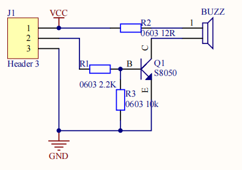
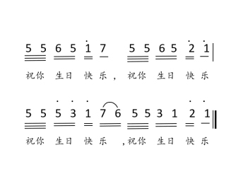

### 项目四 无源蜂鸣器播放音乐

1.项目介绍

本实验用无源蜂鸣器播放音乐，无源蜂鸣器是通过PWM脉冲宽度调制脉冲进而调节音调，PWM比较多用于调节LED灯的亮度或者调节无源蜂鸣器的频率，或者是电机的转动速度，电机带动的车轮速度也就能很容易控制了，在玩一些Arduino机器人时，更能体现PWM的好处。

音乐除了要“唱的准”，还要“节奏对”，每一个音符的持续时间，就是节拍啦。我们可以用延时多少来设置节拍的，例如：1拍，1秒即1000毫秒；1/2拍，0.5秒即500毫秒；1/4拍，0.25秒即250毫秒；1/8拍，0.125秒即125毫秒….，我们可以试一试组合不同的音调和节拍，看看会有什么不同的效果。

2.模块相关资料



- 工作电压：3.3-5V（DC）
- 电流：50MA
- 工作温度：-10摄氏度 到 +50摄氏度
- 尺寸：31.6mmx23.7mm
- 接口：3PIN接口
- 输入信号：数字信号（方波）

3.实验组件

| 控制板 * 1                               | 扩展板 * 1                               | USB线*1                                  | 无源蜂鸣器模块                           | 3P 转杜邦线母 *1                         |
| ---------------------------------------- | ---------------------------------------- | ---------------------------------------- | ---------------------------------------- | ---------------------------------------- |
|  |  |  |  |  |

4.模块接线图


5.测试代码

```
/*
  Keyes Arduino智能家居套装
  第4课 无源蜂鸣器
  http://www.keyes-robot.com
*/

void setup()
{
  pinMode(3, OUTPUT);        //设置3为输出
}

void loop()
{
  tone(3,392);          //控制引脚3输出模拟值为262的脉冲
  delay(125);         //延迟125毫秒   
  tone(3,392);
  delay(125);
  tone(3,440);
  delay(250);
  tone(3,392);
  delay(250);
  tone(3,532);
  delay(250);
  tone(3,494);
  delay(500);
  tone(3,392);
  delay(125);
  tone(3,392);
  delay(125);
  tone(3,440);
  delay(250);
  tone(3,392);
  delay(250);
  tone(3,587);
  delay(250);
  tone(3,532);
  delay(500);
  tone(3,392);
  delay(125);
  tone(3,392);
  delay(125);
  tone(3,784);
  delay(250);
  tone(3,659);
  delay(250);
  tone(3,532);
  delay(250);
  tone(3,494);
  delay(250);
  tone(3,440);
  delay(250);
  tone(3,392);
  delay(125);
  tone(3,392);
  delay(125);
  tone(3,330);
  delay(250);
  tone(3,262);
  delay(250);
  tone(3,587);
  delay(250);
  tone(3,532);
  delay(500);
}
```

6.实验结果

上传代码到开发板，就会听到无源蜂鸣器播放这首“生日快乐歌”了

7.代码说明

在音乐中有两个重要的因素：音调和节拍

在音乐课上，老师教过我们唱“1（Do）、2（Re）、3(Mi)、4(Fa) 、5(Sol) 、6(La) 、7(Si)”是音乐当中的唱名，就对应了音调中的C、D、E、F、G、A、B这些音名。

 1（Do） 2（Re） 3(Mi) 4(Fa) 5(Sol) 6(La) 7(Si)

 C D E F G A B

比如程序 tone(3,262););的意思是让引脚3输出模拟值为262的脉冲，即对应音调1（D0）;同理2（Re）、3(Mi)、4(Fa) 、5(Sol) 、6(La) 、7(Si)的音调分别对应输出模拟值为294，330，349，196，440，494的脉冲。

频率（音调）高低判断时先看后面的数字，数字越大，音调越高，数字相同时看前面的字母，从C到B频率（音调）越来越高；而节拍是音符延时时间，数值越大，延时时间越长。这里我按照“生日快乐歌”来设计了音调和节拍，我们先来看它的简谱：



节拍是指每个音符持续的时间。音谱中不带线的一个音符就是一拍，延时1000毫秒，而带一条下划线的音符节拍是不带线音符节拍的1/2，带两条下划线的音符节拍是不带线音符节拍的1/4（动画：根据对话圈出相应的音符和标注）。


例如：第一个音符下面有两条线，所以就是1/4拍，延时250毫秒。