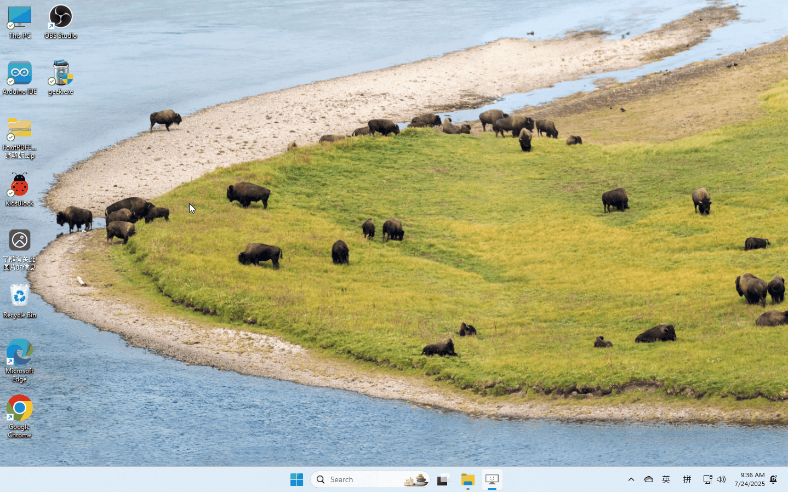
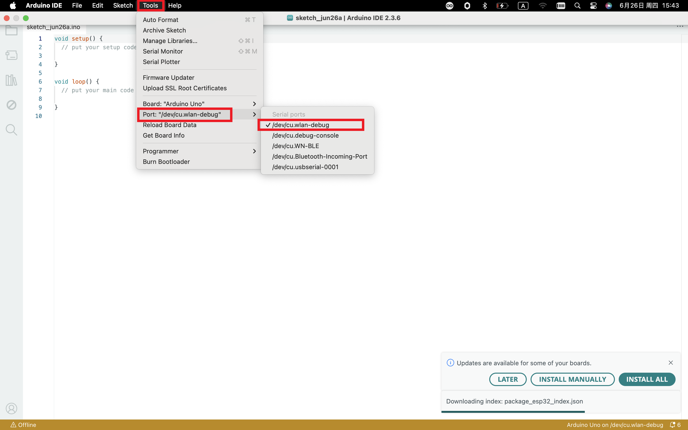

The driver is usually installed automatically when the board is
connected to the computer. When the Arduino IDE can recognize the board
port and upload the program, it proves that the installation has been
completed automatically, so there is no need to carry out the operation
of the tutorial in this section. If you can’t recognize the board port
and upload the program, please refer to the tutorial to install the
driver manually.

4. Driver installation
======================

4.1 Windows System
------------------

**Checking the driver**

1. Connect the motherboard to the computer.

2. Open Device Manager，Open the device manager, if the prompt
   **“USB-SERIAL CH340(COMX)”** appears to prove that the driver has
   been installed, please skip the **“Driver installation”** part.

**Manual driver installation**

1. Driver download

- Windowns System:  :download:`Windowns System driver <./Windows.7z>`

2. Connect the motherboard to the computer, open the device manager, if
   there is a yellow exclamation mark in front of the driver in the
   picture, it proves that the driver is not installed, please download
   the driver and install it manually.

.. figure:: media/2.gif
   :alt: qqqq

4.2 MAC System
--------------

**1 Checking the driver**

Connect the development board to the computer, according to [Tools] —>
[Port] to select the development board port (Note: If you can not
confirm which port is the development board, please connect the
motherboard to take pictures to record all the ports, and then unplug
the development board to re-take pictures to record all the ports, and
then compare to find the disappeared ports, and then unplug the
motherboard after the disappeared ports is the port of the board, and
then select the port on the line)If you can not recognize the port,
please replace the computer USB port or around the phone cable to
re-recognize the port, if it still does not work refer to the following
steps to install the driver.

|image1|

**2 Manual driver installation**

1. Driver download

​Mac System:  :download:`Mac System driver <./Mac.7z>`

2. double-click to decompress the downloaded driver zip package

.. figure:: media/4.gif
   :alt: qqqq8

At this point, the port can be recognized by plugging in the board
again.

