MicroPython教程
===============

一、下载代码
------------

请先下载本教程需要用到的所有： :download:`资料下载 <./Python.7z>`，保存至您方便使用的路径下。

本项目中使用的代码保存在文件夹“\*\*..:raw-latex:`\程序代码`:raw-latex:`\Python`\_代码\ **”中，你可以将代码移至任何你方便使用的地方。**\ 本MicroPython课程的所有实验都是以将代码文件夹移动到（D:）盘中为例的\ **，命名为**
代码\ **，移动后路径为“**\ D::raw-latex:`\代码`\*\*”。

二、开发环境配置
----------------

1、下载安装Thonny
~~~~~~~~~~~~~~~~~

Thonny是一个免费、开源的软件平台，体积小，界面简单，操作简单，功能丰富，是一个适合初学者的Python
IDE。在本教程中，我们使用 Thonny
这个IDE在整个实验课程过程中开发ESP32。Thonny支持多种操作系统，包括Windows,
Mac OS, Linux。

（1）软件下载和开源代码库分享

- Thonny的开源代码库：\ https://github.com/thonny/thonny

- Thonny软件官网：\ https://thonny.org
  （请根据您的操作系统选择相应的选项下载安装）

请根据您的操作系统选择相应的版本下载。

**注意：本教程使用的是 4.1.7
版本，请保持一致，以免出现代码不兼容情况。**

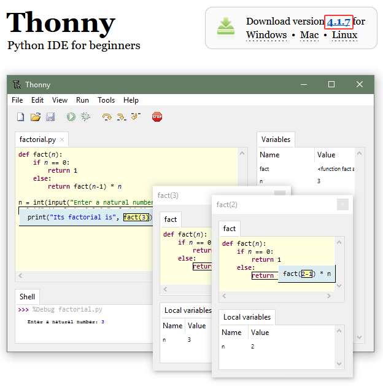

   img

我们提供的安装包在 |1102| 路径下。

（2）鼠标左键双击\ |1103|\ ，选择“\ **Install for all
users**\ ”。你也可以选择“Install for me only”进行操作。

   img

（3）如果你不熟系电脑软件的安装，可以一直单击“\ **Next**\ ”直至安装完成。

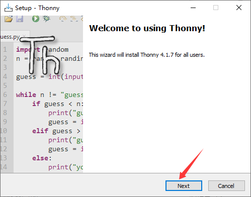

   img

   img

（4）Thonny软件的安装路径。默认此安装路径继续下一步，单击“\ **Next**\ ”。如果您想选择一个不同的文件夹，请单击“\ **Browse…**\ ”进行修改。

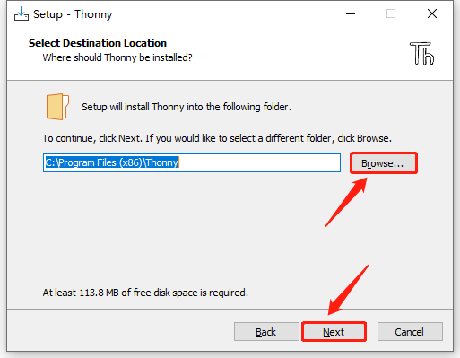

   img

（5）程序将在下面的开始菜单文件夹中创建程序的快捷方式。默认此文件夹继续下一步，单击“\ **Next**\ ”。如果您想选择一个不同的文件夹，请单击“\ **Browse…**\ ”。

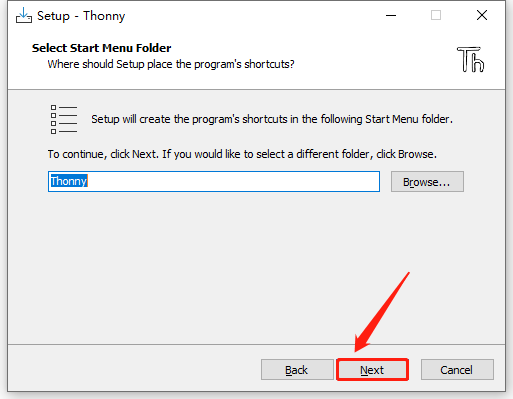

   img

（6）选中“\ **Creak desktop icon**\ ”，在桌面生成快捷方式。

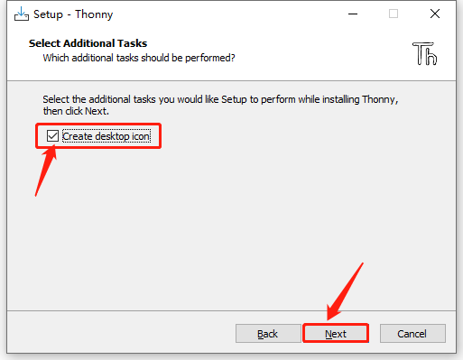

   img

（7）单击“\ **Install**\ ”安装软件。等待安装成功。

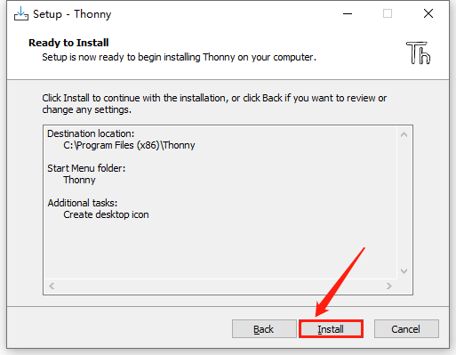

   img

（8）安装完成，单击“\ **Finish**\ ”结束安装。

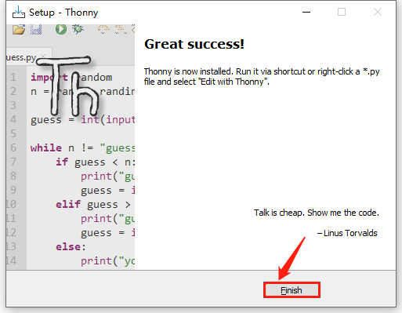

   img

--------------

2、 Thonny软件基本配置与介绍
~~~~~~~~~~~~~~~~~~~~~~~~~~~~

2.1 Thonny软件基本配置
^^^^^^^^^^^^^^^^^^^^^^

（1）双击桌面的Thonny软件图标\ |img|\ ，出现语言选择和初始设置界面。

   img

Language 选择“\ **简体中文**\ ”。然后单击“\ **Let’s go!**\ ”结束设置。

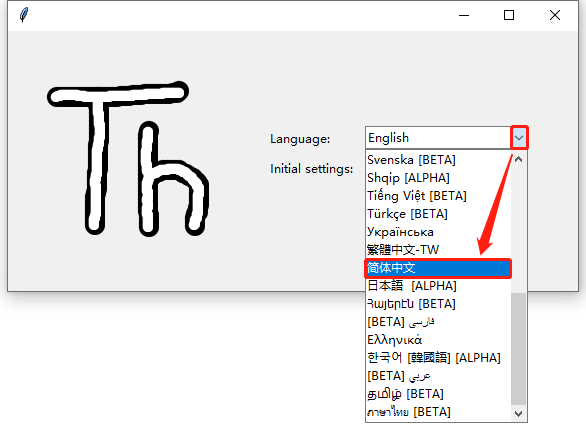

   img

   img

（2）单击“\ **视图**\ ”，勾选“\ **Shell**\ ”和“\ **文件**\ ”

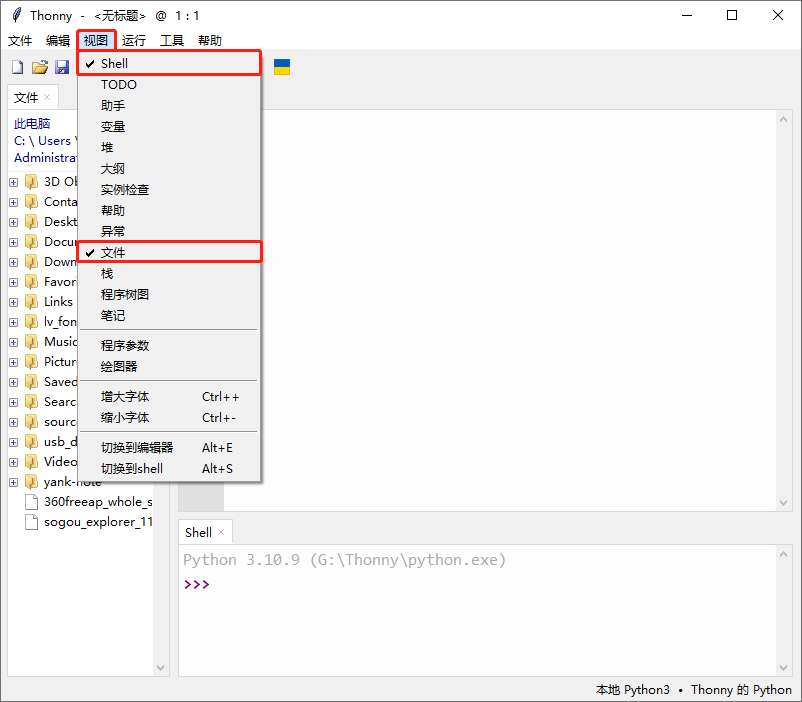

   img

--------------

2.2 Thonny软件的介绍
^^^^^^^^^^^^^^^^^^^^

（1）工具栏介绍

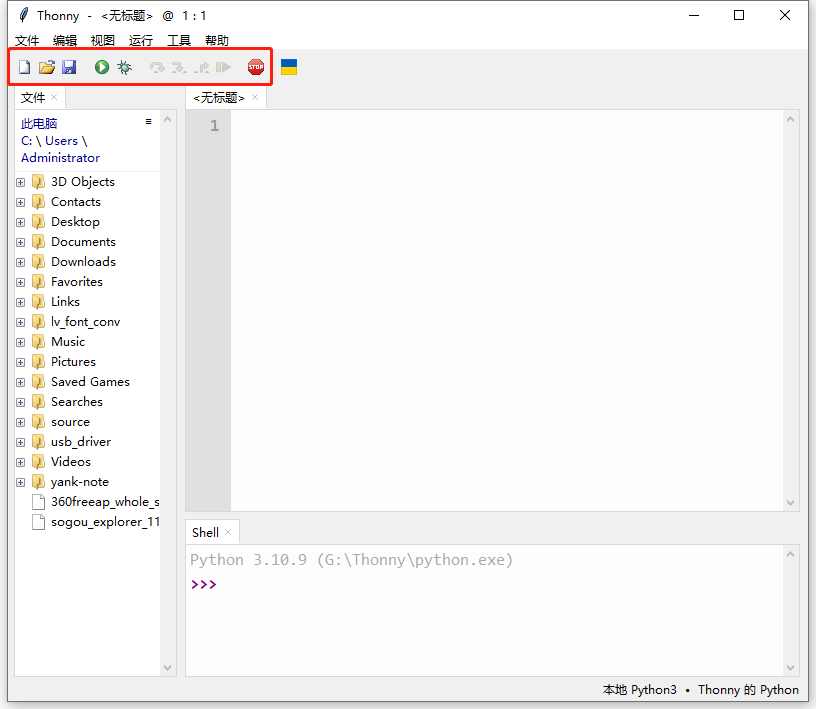

   img

========= =================
按钮      功能
========= =================
|image1|  新建
|image2|  打开…
|image3|  保存
|image4|  运行当前脚本
|image5|  调试当前脚本
|image6|  步过
|image7|  步进
|image8|  步出
|image9|  恢复执行
|image10| 停止/重启后端进程
========= =================

（2）界面介绍

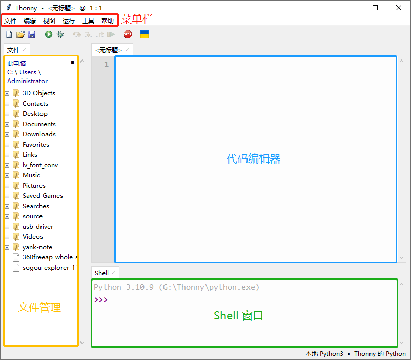

   img

--------------

3、烧录固件
~~~~~~~~~~~

要在ESP32主板上运行Python程序，我们需要先将固件烧入到ESP32主板。

3.1 下载Micropython固件
^^^^^^^^^^^^^^^^^^^^^^^

- microPython的ESP32固件：\ https://micropython.org/download/esp32/

打开microPython的ESP32固件网址，下载固件。

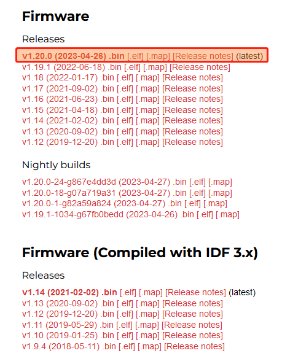

   img

本教程中使用的固件是：\ **esp32-20230426-v1.20.0.bin**
。我们的资料中也提供了此版本的固件，路径如下图。

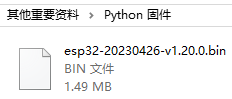

   img

3.2 烧录Micropython固件
^^^^^^^^^^^^^^^^^^^^^^^

（1）将ESP32主板通过USB线连接到计算机。

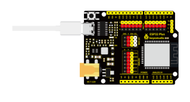

   img

（2）打开Thonny，点击\ **运行** ，选择 **配置解释器**\ 。

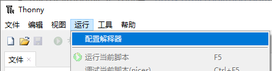

   4105

在解释器页面，按下图所示选择（COM号以你电脑的端口为准），\ **然后单击安装或更新MicroPython（esptool）**\ 。

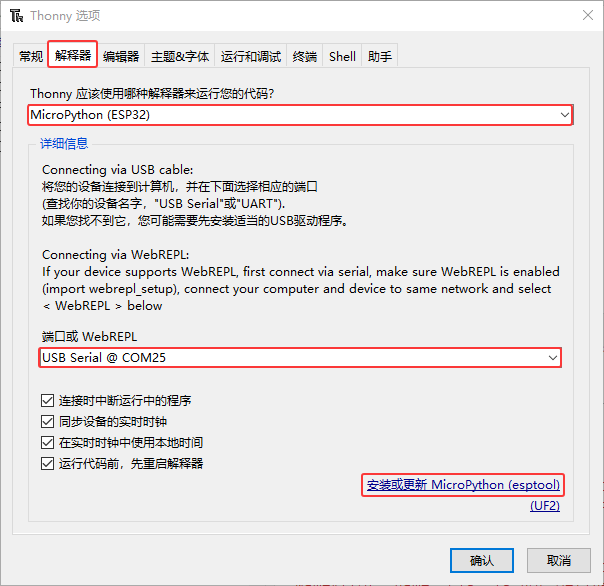

   4106

按下图所示选择，打开固件存放的路径，选中 **esp32-20230426-v1.20.0.bin**
。

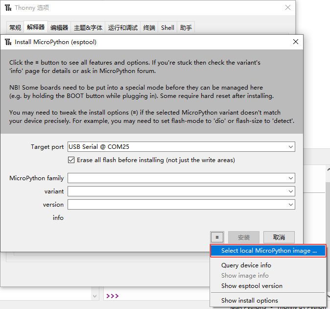

   4107

单击\ **安装**\ ，等待安装完成提示。

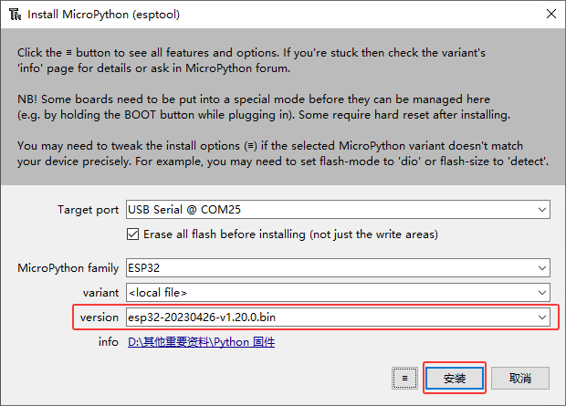

   4108

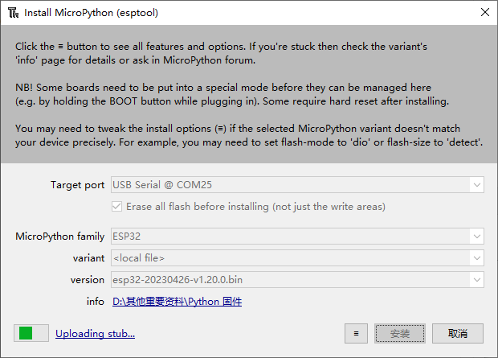

   4109

（3）安装完成，单击\ **关闭**\ 。

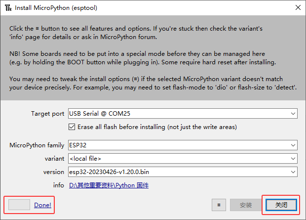

   4110

单击\ **确认**\ 。

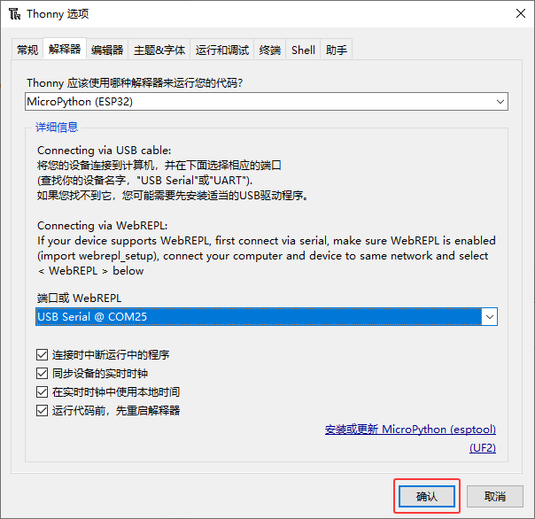

   4111

（5）点击\ |1311|\ **停止/重启后端进程**\ 按钮。

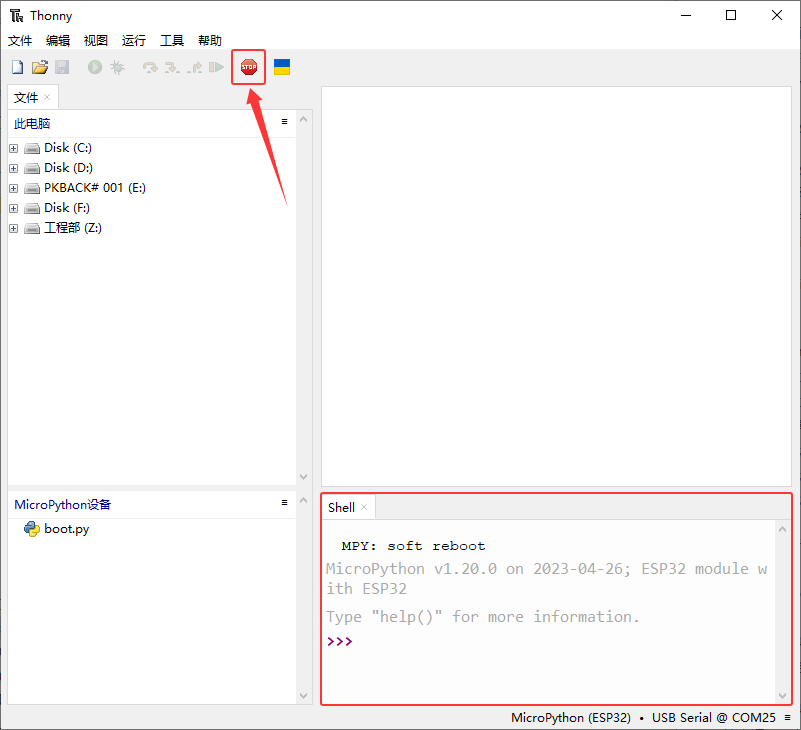

   4112

现在，一切准备工作都已就绪。

--------------

4、测试
~~~~~~~

4.1 测试Shell命令
^^^^^^^^^^^^^^^^^

在\ **Shell**\ 窗口中输入\ ``print('hello world')``\ ，然后按下\ **Enter**\ 键。

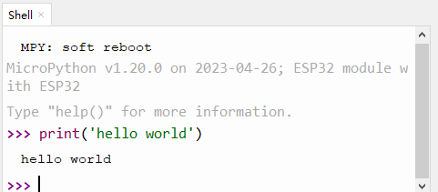

   img

--------------

4.2 在线运行
^^^^^^^^^^^^

ESP32开发过程中，可通过USB-TTL串口与上位机建立在线调试连接。开发者可使用Thonny
IDE进行实时编程、烧录和交互式调试，支持REPL（Read-Eval-Print
Loop）即时执行模式。

（1）打开Tonny并单击\ |1303|\ ，然后单击\ **此电脑**\ 。

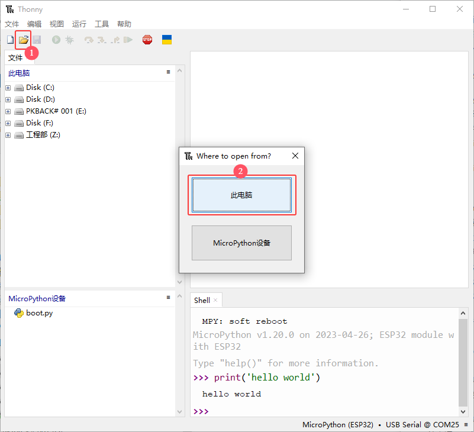

   img

（2）在弹出的页面选择路径“\ **..:raw-latex:`\代码`\\01 Hello
World**\ ”下的“\ **lesson_01_HelloWorld.py**\ “Python
文件，然后单击\ **打开**\ 。

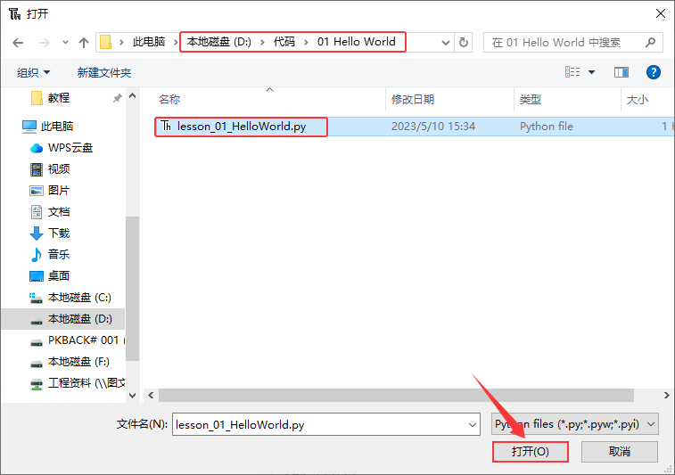

   img

（3）单击\ |1305|\ 或按下\ **F5**\ 键，Shell窗口将打印出\ **Hello
World**\ 。

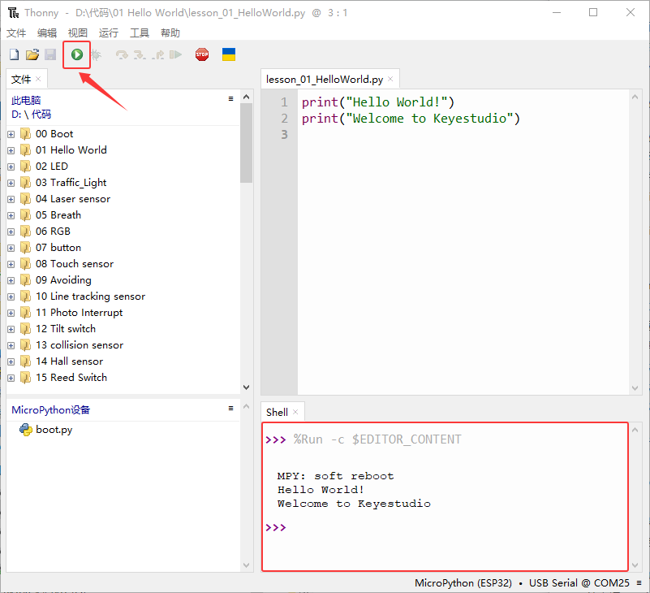

   img

**注意：**
如果在线运行时，按下ESP32的复位键，用户的代码将不会再次执行。如果你希望在重置代码后自动运行该代码，请参考下面章节
**4.3 离线运行** 的内容。

--------------

4.3 离线运行
^^^^^^^^^^^^

ESP32复位后，首先运行根目录下的boot.py文件，然后运行你的代码文件，最后进入“Shell”。因此，为了让ESP32在重置后执行用户程序，我们需要在boot.py中添加一个引导程序来执行用户代码。

（1）将程序文件夹\ **Python_代码**\ （路径为：“\*\*..:raw-latex:`\程序代码`:raw-latex:`\Python`\_代码\ **”）移动到此电脑的(D)，命名为**\ 代码\ **，移动后路径为**\ D::raw-latex:`\代码*`\*。

（2）打开Thonny，在文件管理框单击\ **此电脑**\ ，双击\ **（D:）**\ ，然后双击展开\ **代码**\ 文件夹。

|image11|\ |image12|\ |image13|

（3）展开\ **00 Boot**\ ，然后鼠标左键双击\ **boot.py**\ 。

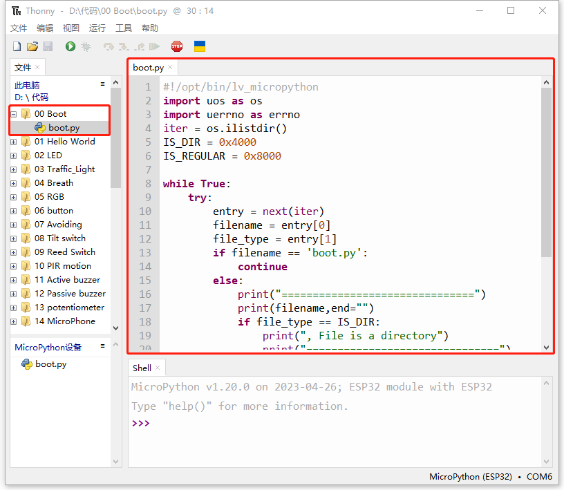

   img

（4）如果想让程序离线运行，需要上传我们提供的\ **boot.py**\ 和你编写的程序代码到\ **MicroPython
设备**\ ，然后按下ESP32的复位按键。

展开文件夹 00 Boot。右键单击\ **boot.py**\ ，选择\ **上传到/**\ 。

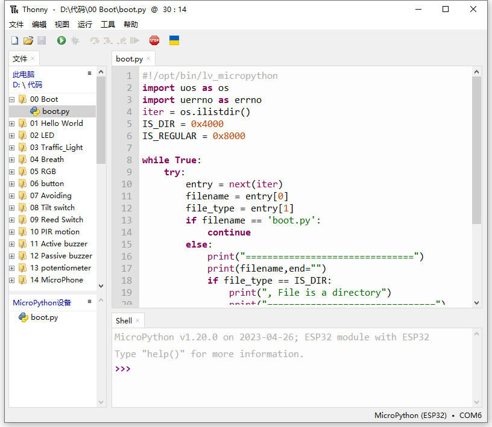

   img

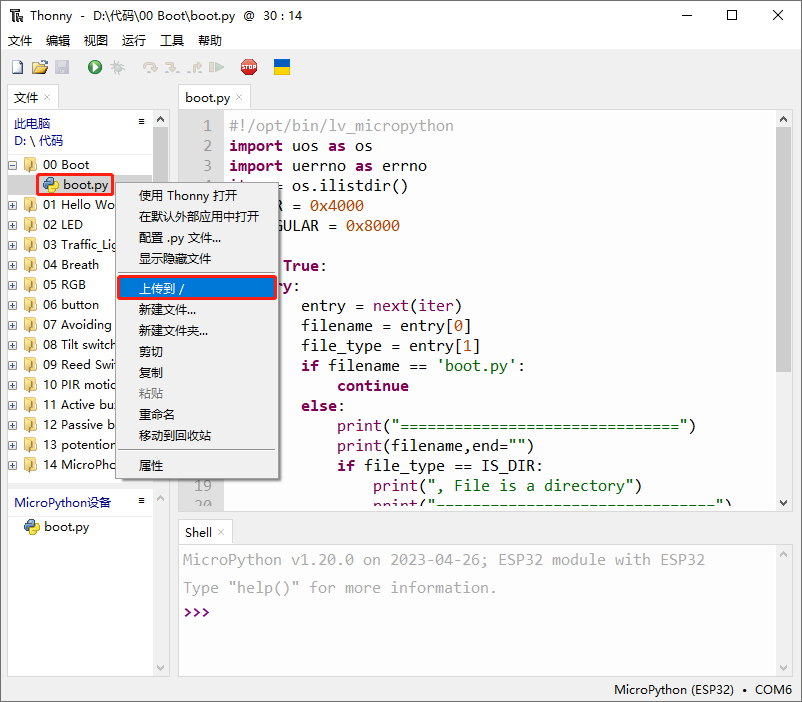

   5306

单击\ **确定**\ 。

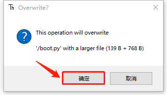

   img

（5）同样，将\ **lesson_01_HelloWorld.py**\ 上传到 **MicroPython
设备**\ 。

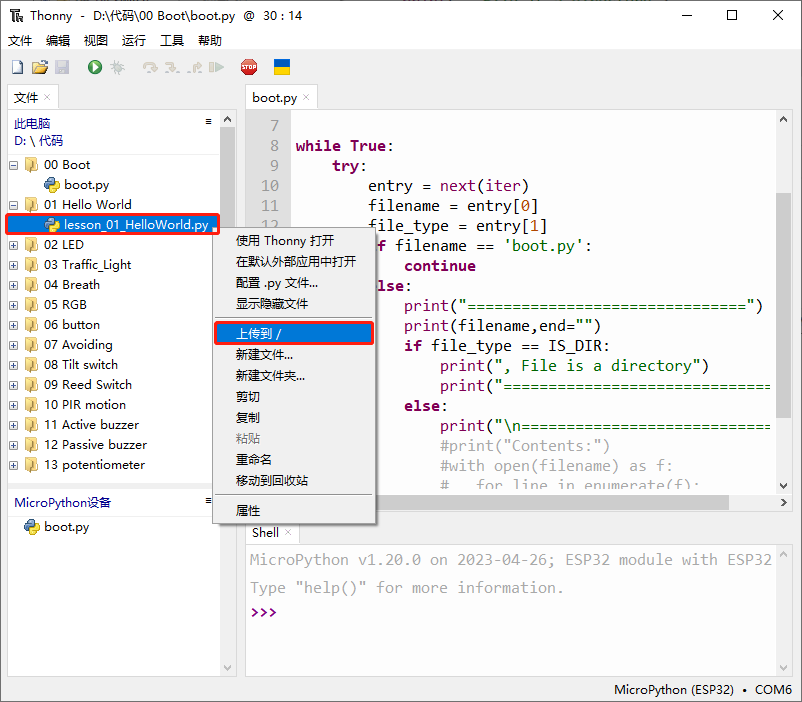

   img

可以在 **MicroPython 设备**\ 看到代码已成功上传。

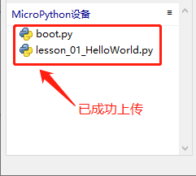

   img

（6）按下ESP32的\ **Reset按键**\ ，在Shell窗口中能看到代码被执行。

   img

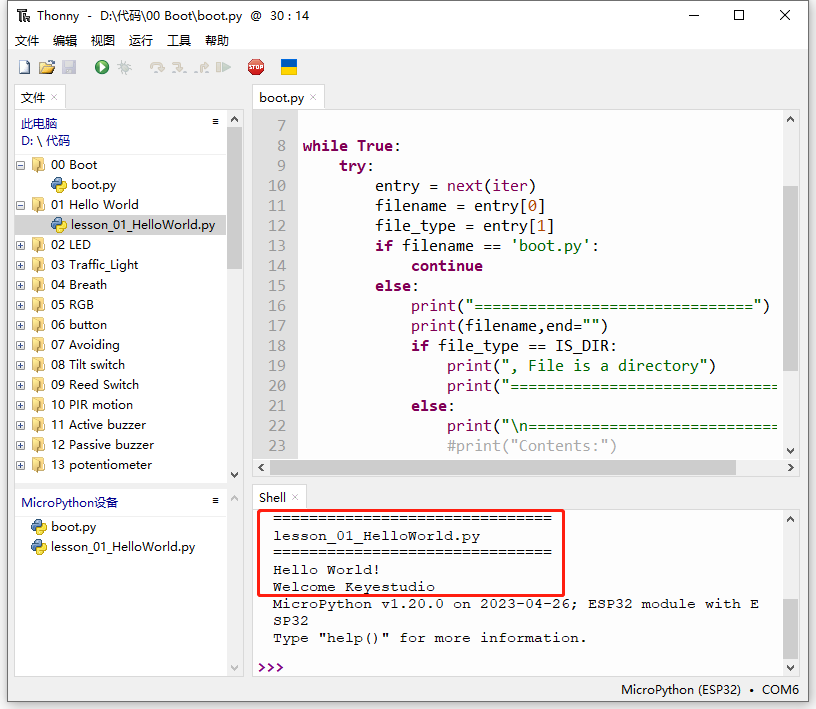

   img

--------------

5、Thonny常见的操作
~~~~~~~~~~~~~~~~~~~

5.1 上传代码到ESP32
^^^^^^^^^^^^^^^^^^^

为了方便起见，我们以\ **boot.py**\ 为例。如果我们在每个代码目录中都添加了boot.py。ESP32每次重启时，它将首先执行根目录中的\ **boot.py**\ 。

在\ **02
LED**\ 文件夹中选择\ **boot.py**\ ，右键单击鼠标，选择\ **Upload to
/**\ 将代码上传到ESP32的根目录，然后选择\ **确定**\ 。

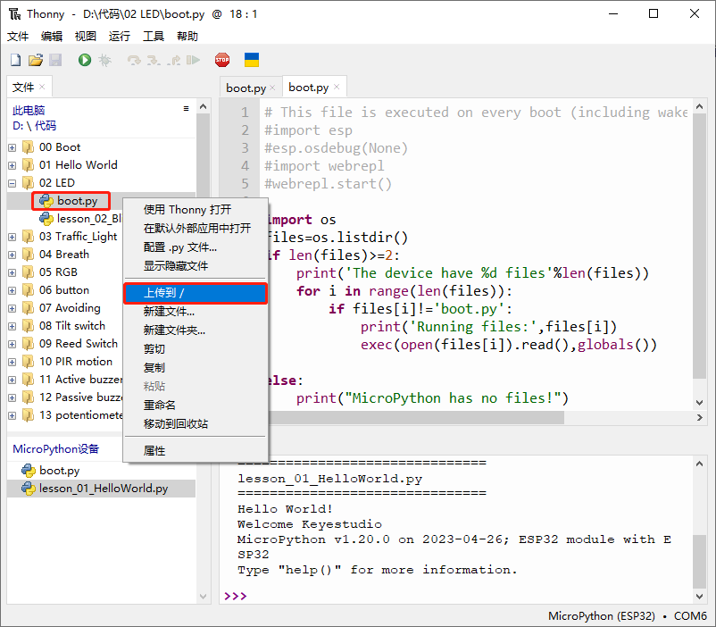

   img

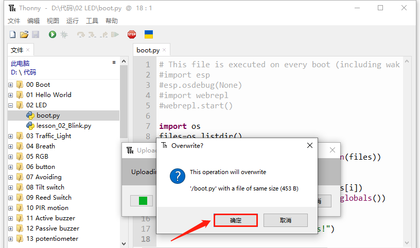

   img

--------------

5.2 下载代码到电脑
^^^^^^^^^^^^^^^^^^

在\ **MicroPython 设备**\ 内选中\ **boot.py**\ ，右键选择**下载到
D::raw-latex:`\代码*`\*把代码下载到你的电脑里。

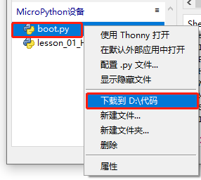

   img

--------------

5.3 删除ESP32根目录下的文件
^^^^^^^^^^^^^^^^^^^^^^^^^^^

在\ **MicroPython
设备**\ 内选中\ **boot.py**\ ，右键单击它且选择\ **删除**\ ，将\ **boot.py**\ 从ESP32的根目录中删除。

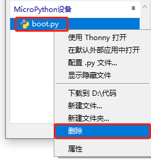

   img

在02
LED文件夹内选中\ **lesson_02_Blink.py**\ ，右键单击它并选择\ **移动到回收站**\ 将其从02
LED文件夹中删除。

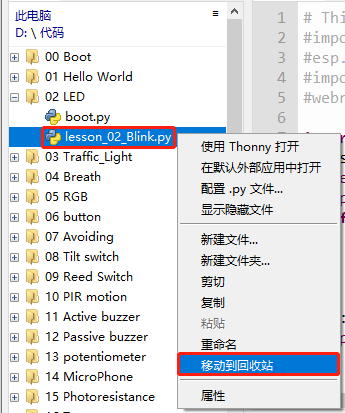

   img

--------------

5.4 创建并保存代码
^^^^^^^^^^^^^^^^^^

单击\ **文件**\ ，然后选择\ **新建**\ 。

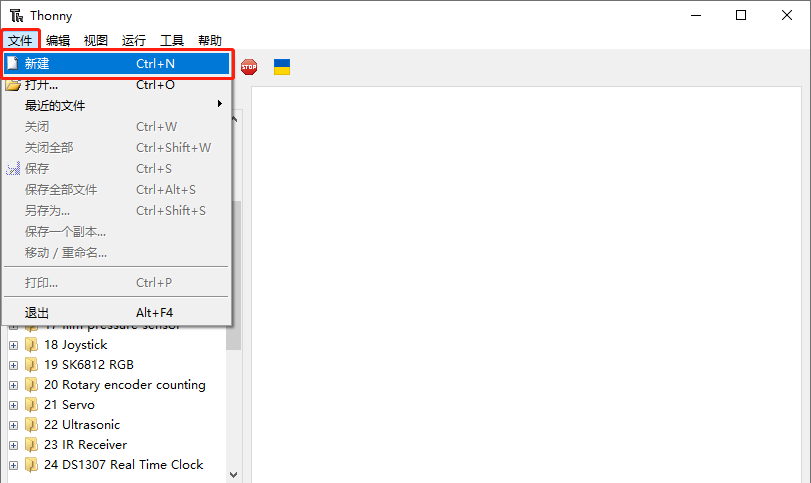

   img

编写代码（以lesson 02. LED.py为例）。

.. figure:: ./media/6402.png
   :alt: img

   img

单击菜单栏上的\ |image14|,可以将代码保存到你的电脑或ESP32上。这里选择保存到\ **MicroPython
设备**\ 。

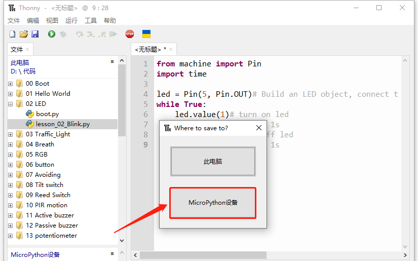

   img

文件名命名为\ **main.py**\ ，然后单击\ **好的**\ 。

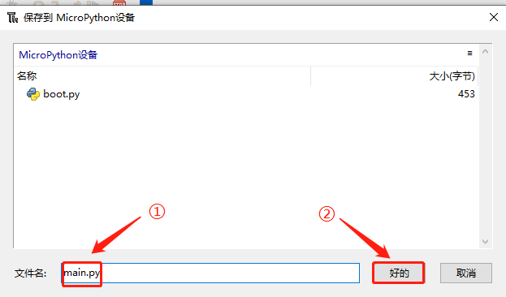

   img

代码已经上传到ESP32。

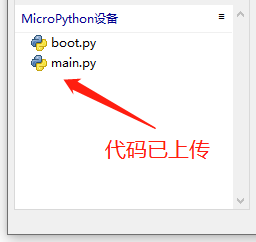

   img

三、课程
--------

项目一 Hello World
~~~~~~~~~~~~~~~~~~

1.1 项目介绍

对于ESP32的初学者，先从一些简单的开始学习吧！在这个项目中，你只需要一个ESP32主板和USB线就可以完成“Hello
World!”项目。它不仅是ESP32主板和计算机的通信测试，也是ESP32的初级项目。这也是一个入门实验，让你进入Python的编程世界。

1.2 实验组件

================= ========
|image15|         |USB|
================= ========
ESP32 Plus主板 x1 USB线 x1
================= ========

1.3 实验接线图

.. figure:: ./media/011301.png
   :alt: 011301

   011301

1.4 在线运行代码

在线运行ESP32，需要把ESP32连接到电脑上，才可以使用Thonny软件编译或调试程序。

优点：

1. 可以编译或调试程序。

2. 通过“Shell”窗口，可以查看程序运行过程中产生的错误信息和输出结果，并可以在线查询相关功能信息，帮助改进程序。

缺点：

1. 要在线运行ESP32，必须将ESP32 连接到一台电脑上并和Thonny软件一起运行。

2. 如果ESP32与电脑断开连接，当它们重新连接时，程序将无法再次运行。

本项目中使用的代码保存在文件夹“\*\*..:raw-latex:`\程序代码`:raw-latex:`\Python`\_代码\ **”中，你可以将代码移至任何你方便使用的地方。**\ 本MicroPython课程的所有实验都是以将代码文件夹移动到（D:）盘中为例的\ **，命名为**
代码\ **，移动后路径为“**\ D::raw-latex:`\代码`\*\*”。

打开Thonny并单击\ |1303|\ ，然后单击“\ **此电脑**\ ”。

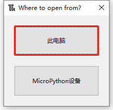

   img

选中“\**D::raw-latex:`\代码*`\*”路径，打开代码文件’’\ **lesson_01_HelloWorld.py**\ ”。

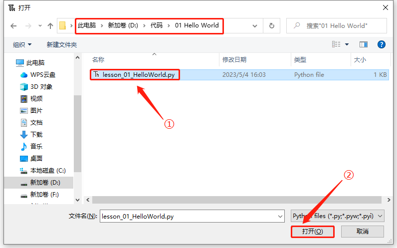

   img

.. code:: python

   print("Hello World!")
   print("Welcome to Keyestudio")

1.5 实验结果

按照接线图正确接好模块，用USB线连接到计算机上电，单击\ |1305|\ 来执行程序代码。代码开始执行，能看到“Shell”窗口打印出“\ **Hello
World!**\ ”、“\ **Welcome to Keyestudio**\ ”。

当在线运行时，单击\ |1311|\ 或按Ctrl+C退出程序。

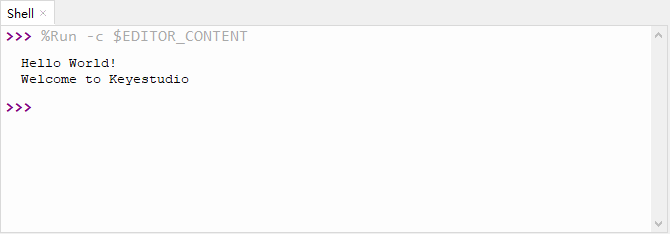

   img

项目二 LED
~~~~~~~~~~

1.1 项目介绍

LED，即发光二极管的简称。由含镓（Ga）、砷（As）、磷（P）、氮（N）等的\ `化合物 <https://baike.baidu.com/item/化合物/1142931>`__\ 制成。当电子与\ `空穴 <https://baike.baidu.com/item/空穴/3517781>`__\ 复合时能辐射出可见光，因而可以用来制成发光二极管。在电路及仪器中作为指示灯，或者组成文字或数字显示。砷化镓二极管发红光，磷化镓二极管发绿光，碳化硅二极管发黄光，氮化镓二极管发蓝光。因化学性质又分有机发光二极管OLED和无机发光二极管LED。

为了实验的方便，我们将紫色LED发光二极管做成了一个紫色LED模块。它的控制方法非常简单，只要让LED两端有一定的电压就可以点亮LED。在这个项目中，我们用一个最基本的测试代码来控制LED，亮一秒钟，灭一秒钟，来实现闪烁的效果。你可以改变代码中LED灯亮灭的时间，实现不同的闪烁效果。我们通过编程控制信号端S的高低电平，从而控制LED的亮灭。LED模块信号端S为高电平时LED亮起，S为低电平时LED熄灭。

1.2 模块参数

工作电压：DC 3.3-5V

控制信号：数字信号

尺寸：32 x 23.5 x 12 mm

定位孔大小：直径为 4.8 mm

接口：间距为2.54 mm 3pin防反接口

1.3 模块原理图

.. figure:: ./media/021301.jpg
   :alt: img

   img

这是一个常用的LED模块，它采用F5-白发紫LED（外观白色，显示紫光）元件。同时，模块上自带一个间距为2.54mm的防反插红色端子。控制时，模块上GND
VCC供电后，信号端S为高电平时，模块上LED亮起。

模块兼容各种单片机控制板，如arduino系列单片机。

1.4 实验组件

+----------------+----------------+-------------------+--------------+
| |image16|      | |image17|      | |image18|         | |image19|    |
+================+================+===================+==============+
| ESP32 Plus主板 | Keyes          | XH2.54-3P         | USB线 x1     |
| x1             | 紫色LED模块 x1 | 转杜邦线母单线 x1 |              |
+----------------+----------------+-------------------+--------------+

1.5 模块接线图

.. figure:: ./media/021501.png
   :alt: img

   img

1.6 在线运行代码

本项目中使用的代码保存在文件夹“\*\*..:raw-latex:`\程序代码`:raw-latex:`\Python`\_代码\ **”中，你可以将代码移至任何你方便使用的地方。**\ 本课程的所有实验都是以将代码文件夹移动到（D:）盘中为例的\ **，命名为**
代码\ **，移动后路径为“**\ D::raw-latex:`\代码*`\*”。

打开Thonny并单击\ |1303|\ ，然后单击“\ **此电脑**\ ”。

   img

选中“\**D::raw-latex:`\代码*`\*”路径，打开代码文件’’\ **lesson_02_Blink.py**\ ”。

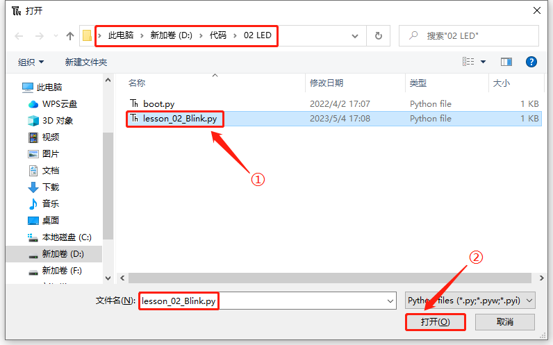

   img

.. code:: python

   from machine import Pin
   import time

   led = Pin(5, Pin.OUT)# 搭建一个LED对象，将外接LED灯连接到5号引脚，设置5号引脚为输出模式
   while True:
       led.value(1)#打开灯
       time.sleep(1)# 延迟1s
       led.value(0)# 关闭灯
       time.sleep(1)# 延迟1s

1.7 代码说明

+------------------+------------------------------------------------------------------------------------------------------------------------------------+
| 代码             | 说明                                                                                                                               |
+==================+====================================================================================================================================+
| from machine     | machine模块里对ESP32主板的一些配置等已经设置好了，我们需导入它，然后调用。                                                         |
| import Pin       |                                                                                                                                    |
+------------------+------------------------------------------------------------------------------------------------------------------------------------+
| time.sleep(1)    | time模块主要是用于时间延迟设置。括号里是1，延时1秒。                                                                               |
+------------------+------------------------------------------------------------------------------------------------------------------------------------+
| led = Pin(5,     | 构建一个引脚类实例，我们将其命名为led，5表示我们连接的引脚为GP5，Pin.OUT表示引脚5为输出模式，即可以使用value()方法输出高电平(3.3V) |
| Pin.OUT)         | ：led.value(1)，或者低电平(0V) ：led.value(0)。                                                                                    |
+------------------+------------------------------------------------------------------------------------------------------------------------------------+
| while True:      | 循环函数，在此函数下面的语句循环执行，除非True变False。                                                                            |
+------------------+------------------------------------------------------------------------------------------------------------------------------------+

1.8 实验结果

按照接线图正确接好模块，用USB线连接到计算机上电，单击\ |1305|\ 来执行程序代码。代码开始执行，能看到模块上的紫色LED一亮一灭，循环闪烁。

.. figure:: ./media/021701.png
   :alt: img

   img

.. figure:: ./media/021702.png
   :alt: img

   img

项目三 交通灯模块
~~~~~~~~~~~~~~~~~

1.1 项目介绍

交通灯，也就是马路上十字路口的红绿灯，在我们的日常生活中很常见。交通灯是由红、黄、绿三种颜色组成的，根据一定的时间规律循环交替亮起或熄灭。每个人都应该遵守交通规则，这可以避免许多交通事故。

想学习交通灯的原理吗？我们可以用红、黄、绿3个LED外接电路来模拟马路上的交通灯。因此我们特别设计了这款交通灯模块，模块上的红、黄、绿3个LED灯模拟交通灯。

1.2 模块参数

工作电压 : DC 5V

电流 ：100 mA

最大功率 ：0.5 W

工作温度 ：-10°C ~ +50°C

输入信号 : 数字信号

尺寸 ：47.6 x 23.8 x 11.8 mm

定位孔大小：直径为 4.8 mm

接口 ：间距为2.54 mm 5pin防反接口

1.3 模块原理图

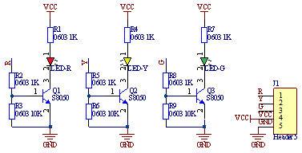

   img

前面实验二我们就学习了如何控制一个LED，由原理图可以得知，控制这个模块就好比分别控制3个独立的LED灯(我们这个灯可直接由单片机IO口驱动)，给对应颜色灯高电平就亮起对应的颜色。比如，我们给信号“R”输出高电平，也就是3.3V，则红色LED点亮。

1.4 实验组件

+----------------+----------------+-------------------+--------------+
| |image20|      | |image21|      | |image22|         | |image23|    |
+================+================+===================+==============+
| ESP32 Plus主板 | Keyes          | XH2.54-5P         | USB线 x1     |
| x1             | 交通灯模块 x1  | 转杜邦线母单线 x1 |              |
+----------------+----------------+-------------------+--------------+

1.5 模块接线图

.. figure:: ./media/031501.jpg
   :alt: img

   img

1.6 在线运行代码

打开Thonny并单击\ |1303|\ ，然后单击“\ **此电脑**\ ”。

选中“\**D::raw-latex:`\代码*`\*”路径，打开代码文件’’\ **lesson_03_Traffic_Light.py**\ ”。

.. code:: python

   import machine
   import time 

   led_red = machine.Pin(5, machine.Pin.OUT)
   led_yellow = machine.Pin(13, machine.Pin.OUT)
   led_green = machine.Pin(12, machine.Pin.OUT)

   while True:
       led_green.value(1) # 绿灯亮
       time.sleep(5) # 延迟5 s
       led_green.value(0) # 绿灯关闭
       for i in range(3): #黄灯闪烁3次
           led_yellow.value(1)
           time.sleep(0.5)
           led_yellow.value(0)
           time.sleep(0.5)
       led_red.value(1) # 红灯亮
       time.sleep(5) # 延迟5 s
       led_red.value(0) #红灯关闭

1.7 代码说明

+--------------+----------------------------------------------------------------------------------------------------------------------------------------------------------------------------------------------------------+
| 代码         | 说明                                                                                                                                                                                                     |
+==============+==========================================================================================================================================================================================================+
| range ()     | range () 函数的使用 ：range(start, stop,[ step])，分别是起始、终止和步长。range（3）即：从0到3，不包含3，即0,1,2。                                                                                       |
+--------------+----------------------------------------------------------------------------------------------------------------------------------------------------------------------------------------------------------+
| for i in     | for i in                                                                                                                                                                                                 |
| range(3)     | range()函数的基本用法是启动一个循环，从一个给定的数开始，依次递增的遍历到给定的数字，并在遇到其他条件下停止。结合range(3)可以知道这里是让黄灯闪烁3次（0,1,2共3次）的意思。亮0.5秒，灭0.5秒组成一次闪烁。 |
+--------------+----------------------------------------------------------------------------------------------------------------------------------------------------------------------------------------------------------+

1.8 实验结果

按照接线图正确接好模块，用USB线连接到计算机上电，单击\ |1305|\ 来执行程序代码。代码开始执行，能看到模块上绿色LED亮5秒然后熄灭，黄色LED闪烁3次然后熄灭，红色LED亮5秒然后熄灭。模块按此顺序循环亮灭。

单击\ |1311|\ 或按Ctrl+C退出程序。

项目四 激光头传感器模块发出激光
~~~~~~~~~~~~~~~~~~~~~~~~~~~~~~~

1.1 项目介绍

在这个套件中，有一个Keyes
激光头传感器，激光与常见的光不同。一方面，激光的单色性好。另一方面，激光发射器内部特定的结构，使得激光能够被聚集成单束光，朝着同一方向射出，亮度高，方向性好。

正是由于这些特性，激光被广泛用于对特定材料进行切割、焊接、表面处理等等。激光的能量非常高，玩具激光笔照射人眼可能导致眩光，长时间可能导致视网膜损害，我国也禁止用激光照射航行的飞机。因此，\ **请注意不要用激光发射器对准人眼。**

1.2 模块参数

工作电压 ：DC 5V

工作温度 ：-10°C ~ +50°C

输入信号 ：数字信号

尺寸 ：32 x 23.8 x 10 mm

定位孔大小 ：直径为 4.8 mm

接口 ：间距为2.54 mm 3pin防反接口

1.3 模块原理图

.. figure:: ./media/041301.png
   :alt: img

   img

激光头传感器主要由激光头组成，激光头由发光管芯、聚光透镜、铜可调套筒三部分组成。

从激光模块的电路原理图我们可以知道，它是用三极管驱动的。激光头的 1
脚始终上拉到VCC，在信号端 S
处输入一个高电平数字信号，NPN三极管Q1导通，激光头的 2
脚被下拉到GND，此时传感器开始工作。在信号端 S
处输入低电平时NPN三极管Q1不导通，传感器停止工作。

1.4 实验组件

+----------------+----------------+-------------------+--------------+
| |image24|      | |image25|      | |image26|         | |image27|    |
+================+================+===================+==============+
| ESP32 Plus主板 | Keyes 激光模块 | XH2.54-3P         | USB线 x1     |
| x1             | x1             | 转杜邦线母单线 x1 |              |
+----------------+----------------+-------------------+--------------+

1.5 模块接线图

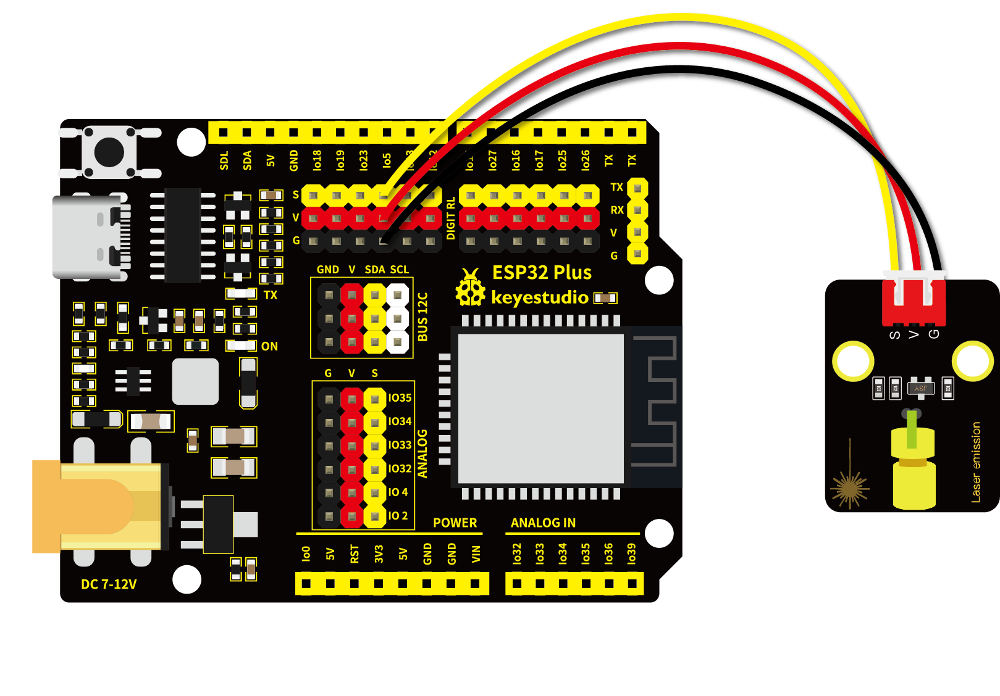

   img

1.6 在线运行代码

打开Thonny并单击\ |1303|\ ，然后单击“\ **此电脑**\ ”。

选中“\**D::raw-latex:`\代码*`\*”路径，打开代码文件’’\ **lesson_04_Laser.py**\ ”。

.. code:: python

   from machine import Pin
   import time

   laser = Pin(5, Pin.OUT)# 建立一个激光对象，将激光器连接到5号引脚，将5号引脚设置为输出模式
   while True:
       laser.value(1) # 打开激光器
       time.sleep(2) # 延时2s
       laser.value(0) # 关掉激光
       time.sleep(2) # 延时2s

1.7 代码说明

此课程代码与第二课代码类似，这里就不多做介绍了。

1.8 实验结果

按照接线图正确接好模块，用USB线连接到计算机上电，单击\ |1305|\ 来执行程序代码。能看到模块上激光管发射红色激光信号2秒，然后关闭发射2秒，循环交替。

单击\ |1311|\ 或按Ctrl+C退出程序。

.. figure:: ./media/041701.png
   :alt: img

   img

项目五 呼吸灯
~~~~~~~~~~~~~

1.1 项目介绍

在第二课我们学习了如何让LED闪烁。但是LED的玩法远不仅如此。在日常生活中你有没有遇到过灯光慢慢变亮或者慢慢变暗呢？这叫呼吸灯。所谓呼吸灯，就是控制LED逐渐变亮，然后逐渐变暗，循环交替。上一课我们学会了直接用高电平点亮LED，低电平熄灭LED。如果要让LED不那么亮但又不完全熄灭，介于中间状态，只需控制流过LED的电流就可以实现。电流减小LED变暗，电流增大LED变亮。所以只需要调节LED两端的电压减小或增大（电流也会随之减小或增大）就能控制LED的亮暗程度了。

数字端口电压输出只有LOW与HIGH两个开关，对应的就是0V与3.3V（或5V）的电压输出。可以把LOW定义为0，HIGH定义为1，1秒内让单片机输出500个0或者1的信号。如果这500个信号全部为1，那就是完整的3.3V；如果全部为0，那就是0V。如果010101010101这样输出，刚好一半，端口输出的平均电压就为1.65V了。这和放映电影是一个道理。我们所看的电影并不是完全连续的，它其实是每秒输出25张图片，人的肉眼分辨不出来，看上去就是连续的了，PWM也是同样的道理。如果想要不同的电压，就控制0与1的输出比例就可以了。当然这和真实的连续输出还是有差别的，单位时间内输出的0,1信号越多，控制的就越精确。

那么什么是PWM呢？PWM简称脉宽调制，是利用微处理器的数字输出来对模拟电路进行控制的一种非常有效的技术。

.. figure:: ./media/061101.jpg
   :alt: img

   img

PWM的频率是指在1秒钟内，信号从高电平到低电平再回到高电平的次数，也就是说一秒钟PWM有多少个周期，单位Hz。

PWM的周期，T=1/f，T是周期，f是频率。如果频率为50Hz
，也就是说一个周期是20ms，那么一秒钟就有 50次PWM周期。

占空比，是一个脉冲周期内，高电平的时间与整个周期时间的比例，单位是%
(0%-100%) 一个周期的长度。如下图所示。

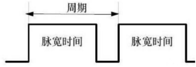

   img

这一课学习使用PWM来控制0与1的输出比例实现控制电压。

1.2 模块参数

工作电压 : DC 3.3 ~ 5V

工作温度 ：-10°C ~ +50°C

控制信号 : 数字信号

尺寸 ：32 x 23.8 x 12 mm

定位孔大小：直径为 4.8 mm

接口 ：间距为2.54 mm 3pin防反接口

1.3 模块原理图

.. figure:: ./media/021301.jpg
   :alt: img

   img

前面实验二我们就学习了如何控制一个LED，由原理图可以得知，控制时，模块上GND
VCC供电后，信号端S为高电平时，模块上LED亮起。

1.4 实验组件

+----------------+----------------+-------------------+--------------+
| |image28|      | |image29|      | |image30|         | |image31|    |
+================+================+===================+==============+
| ESP32 Plus主板 | Keyes          | XH2.54-3P         | USB线 x1     |
| x1             | 紫色LED模块 x1 | 转杜邦线母单线 x1 |              |
+----------------+----------------+-------------------+--------------+

1.5 模块接线图

.. figure:: ./media/021501.png
   :alt: img

   img

1.6 在线运行代码

打开Thonny并单击\ |1303|\ ，然后单击“\ **此电脑**\ ”。

选中“\**D::raw-latex:`\代码*`\*”路径，打开代码文件’’\ **lesson_05_Breath.py**\ ”。

.. code:: python

   import time
   from machine import Pin,PWM

   #ESP32 PWM引脚输出的方式与传统控制器不同
   #在初始化阶段通过配置PWM的参数，可以改变频率和占空比
   #定义GPIO 5的输出频率为10000Hz，占空比为0，分配给PWM
   pwm =PWM(Pin(5,Pin.OUT),10000)

   try:
       while True: 
   #占空比范围为0-1023，因此我们使用第一个for环来控制PWM以改变占空比
   #周期值，使PWM输出0% -100%;使用第二个for环路使PWM输出100%-0%
           for i in range(0,1023):
               pwm.duty(i)
               time.sleep_ms(1)
               
           for i in range(0,1023):
               pwm.duty(1023-i)
               time.sleep_ms(1)  
   except:
   #每次使用PWM时，硬件定时器将打开以配合它。因此，每次使用PWM后
   #需要调用deinit()来关闭计时器。否则会导致下次PWM工作失败
       pwm.deinit()

1.7 代码说明

+--------------+-------------------------------------------------------------------------------------------------------------------------+
| 代码         | 说明                                                                                                                    |
+==============+=========================================================================================================================+
| pwm.deinit() | 每次使用PWM时，硬件定时器将打开以配合它。因此，每次使用PWM后，需要调用deinit()来关闭计时器。否则会导致下次PWM工作失败。 |
+--------------+-------------------------------------------------------------------------------------------------------------------------+

1.8 实验结果

按照接线图正确接好模块，用USB线连接到计算机上电，单击\ |1305|\ 来执行程序代码。代码开始执行，能看到模块上的紫色LED从暗逐渐变亮，再从亮逐渐变暗，就像呼吸一样。

单击\ |1311|\ 或按Ctrl+C退出程序。

项目六 RGB模块调节LED颜色
~~~~~~~~~~~~~~~~~~~~~~~~~

1.1 项目介绍

在这个套件中，有一个Keyes
共阴RGB模块，它采用F10-全彩RGB雾状共阴LED元件。控制时，我们需要将模块的R、G、B脚连接至单片机的PWM口。由于我们这个RGB模块是共阴的，公共管脚就接GND（共阳RGB公共管脚接VCC)。

RGB三色也就是三基色，红色、绿色、蓝色。人眼对RGB三色最为敏感，大多数的颜色可以通过RGB三色按照不同的比例合成产生。同样绝大多数单色光也可以分解成RGB三种色光。这是色度学的最基本原理，即三基色原理。RGB三基色按照不同的比例相加合成混色称为相加混色，除了相加混色法之外还有相减混色法。可根据需要相加相减调配颜色。

接下来，我们基于刚刚学习的三基色原理，通过PWM端口控制R、G、B各色的占空比，使R、G、B三色按照不同的比例合成产生多重颜色显示在LED上。

1.2 模块参数

工作电压 ：DC 3.3 ~ 5V

工作温度 ：-10°C ~ +50°C

输入信号 ：PWM信号

尺寸 ：32 x 23.8 x 16.9 mm

定位孔大小 ：直径为 4.8 mm

接口 ：间距为2.54 mm 4pin防反接口

1.3 模块原理图

.. figure:: ./media/061301.jpg
   :alt: img

   img

通过调节R、G、B、三个灯的PWM值，控制LED元件显示红光、绿光和蓝光的比例，从而控制RGB模块上LED显示不同颜色灯光。当设置的PWM值越大，对应显示的颜色比例越重。理论上来说，通过调节这3中颜色光的混合比例，可以模拟出所有颜色的灯光。

1.4 实验组件

+----------------+----------------+-------------------+--------------+
| |image32|      | |image33|      | |image34|         | |image35|    |
+================+================+===================+==============+
| ESP32 Plus主板 | Keyes          | XH2.54-4P         | USB线 x1     |
| x1             | 共阴RGB模块 x1 | 转杜邦线母单线 x1 |              |
+----------------+----------------+-------------------+--------------+

1.5 模块接线图

.. figure:: ./media/061501.png
   :alt: img

   img

1.6 在线运行代码

打开Thonny并单击\ |1303|\ ，然后单击“\ **此电脑**\ ”。

选中“\**D::raw-latex:`\代码*`\*”路径，打开代码文件’’\ **lesson_06_RGB.py**\ ”。

.. code:: python

   #导入Pin, PWM和Random功能模块
   from machine import Pin, PWM
   from random import randint
   import time

   #配置GPIO32、GPIO4和GPIO2的输出模式为PWM输出，PWM频率为10000Hz
   pins = [32, 4, 2]

   pwm0 = PWM(Pin(pins[0]),10000)  
   pwm1 = PWM(Pin(pins[1]),10000)
   pwm2 = PWM(Pin(pins[2]),10000)

   #定义一个函数来设置RGBLED的颜色
   def setColor(r, g, b):
       pwm0.duty(1023-r)
       pwm1.duty(1023-g)
       pwm2.duty(1023-b)
       
   try:
       while True:
           red   = randint(0, 1023) 
           green = randint(0, 1023)
           blue  = randint(0, 1023)
           setColor(red, green, blue)
           time.sleep_ms(200)
   except:
       pwm0.deinit()
       pwm1.deinit()
       pwm2.deinit()

1.7 代码说明

+--------------------------+----------------------------------------------------+
| 代码                     | 说明                                               |
+==========================+====================================================+
| pins = [32, 4, 2]        | 定义一个数组，这个数组是红灯、绿灯、蓝灯的引脚号。 |
+--------------------------+----------------------------------------------------+
| pwm0 =                   | 定义GP32脚为PWM输出并命名为pwm0，频率为10000Hz。   |
| PWM(Pin(pins[0]),10000)  |                                                    |
+--------------------------+----------------------------------------------------+
| pwm0.duty(1023-r)        | 设置占空比.                                        |
+--------------------------+----------------------------------------------------+
| randint(a，b)            | randint(a,b)函数：生成一个[a,b]之间的随机整数。    |
+--------------------------+----------------------------------------------------+

1.8 实验结果

按照接线图正确接好模块，用USB线连接到计算机上电，单击\ |1305|\ 来执行程序代码。代码开始执行，能看到模块上RGB
LED开始随机显示颜色。

单击\ |1311|\ 或按Ctrl+C退出程序。

.. figure:: ./media/061701.png
   :alt: img

   img

.. figure:: ./media/061702.png
   :alt: img

   img

项目七 按键传感器检测实验
~~~~~~~~~~~~~~~~~~~~~~~~~

1.1 项目介绍

在这个套件中，有一个Keyes单路按键模块，它主要由1个轻触开关组成，自带1个黄色按键帽。第二课我们学习了怎么让单片机的引脚输出一个高电平或者低电平，这节课程我们就来学习怎么读取引脚的电平。

按键模块的按键按下，单片机读取到低电平，松开按键读取到高电平。通过读取传感器上S端的高低电平，判断按键是否按下，并且在”Shell”窗口上显示测试结果。

1.2 模块参数

工作电压 : DC 3.3 ~ 5V

工作温度 ：-10°C ~ +50°C

控制信号 : 数字信号

尺寸 ：32 x 23.8 x 15.6 mm

定位孔大小：直径为 4.8 mm

接口 ：间距为2.54 mm 3pin防反接口

1.3 模块原理图

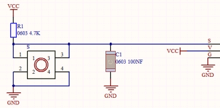

   img

按键有四个引脚，其中1与3相连，2与4相连。按键未被按下时，13与24是断开的。信号端S读取的电平是被4.7K的上拉电阻R1所拉高的高电平。而当按键被按下时，13和24连通，原本上拉的13脚被24脚接的GND下拉至低电平，此时信号端S读取到低电平。即按下按键，传感器信号端S为低电平；松开按键时，信号端S为高电平。

1.4 实验组件

+----------------+----------------+-------------------+--------------+
| |image36|      | |image37|      | |image38|         | |image39|    |
+================+================+===================+==============+
| ESP32 Plus主板 | Keyes          | XH2.54-3P         | USB线 x1     |
| x1             | 单路按键模块   | 转杜邦线母单线 x1 |              |
|                | x1             |                   |              |
+----------------+----------------+-------------------+--------------+

1.5 模块接线图

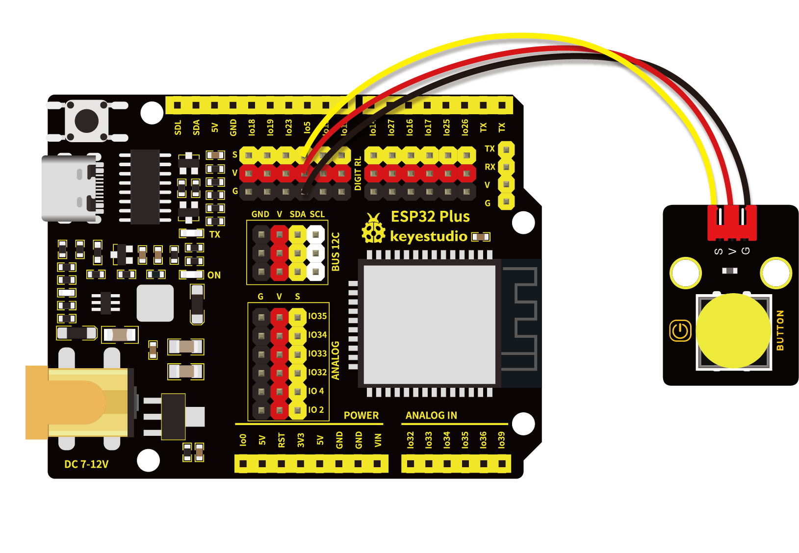

   img

1.6 在线运行代码

打开Thonny并单击\ |1303|\ ，然后单击“\ **此电脑**\ ”。

选中“\**D::raw-latex:`\代码*`\*”路径，打开代码文件’’\ **lesson_07_button.py**\ ”。

.. code:: python

   from machine import Pin
   import time

   button = Pin(5, Pin.IN, Pin.PULL_UP)

   while True:
       if button.value() == 0:
           print("You pressed the button!")   #按下打印相应信息
       else:
           print("You loosen the button!")
       time.sleep(0.1) #延时0.1秒

1.7 代码说明

+--------------------------+---------------------------------------------------------------------------------------------------------------------------------------------------------------------------------------------------------------------------------------------------------------------------------------------------+
| 代码                     | 说明                                                                                                                                                                                                                                                                                              |
+==========================+===================================================================================================================================================================================================================================================================================================+
| button = Pin(5, Pin.IN,  | 定义按键管脚为GPIO5，设置为输入上拉模式。如果使用button = Pin(5,                                                                                                                                                                                                                                  |
| Pin.PULL_UP)             | Pin.IN)设置为输入模式而不使用输入上拉，此时引脚处于高阻抗状态，会导致不可预测的电平结果。为了确保开关断开时的读数正确，推荐使用上拉或下拉电阻。我们的模块已经使用上拉电阻R1，可以不设置输入上拉，该电阻的目的是在开关断开时将引脚拉至已知状态。通常选择一个4.7K/10                                |
|                          | K欧姆的电阻，因为它的阻值足够低，可以可靠地防止输入悬空，同时，该阻值也要足够高，以使开关闭合时不会消耗太多电流。如果使用下拉电阻，则当开关断开时，输入引脚将为低电平；当开关闭合时，输入引脚将为高电平。如果使用上拉电阻，则当开关断开时，输入引脚将为高电平；当开关闭合时，输入引脚将为低电平。 |
+--------------------------+---------------------------------------------------------------------------------------------------------------------------------------------------------------------------------------------------------------------------------------------------------------------------------------------------+
| button.value()           | 读取按键的数字电平，函数返回高(HIGH)或者低(LOW)。                                                                                                                                                                                                                                                 |
+--------------------------+---------------------------------------------------------------------------------------------------------------------------------------------------------------------------------------------------------------------------------------------------------------------------------------------------+
| if.. else：..            | 当if后面的逻辑判断为True时，执行if下缩进的代码；否则执行else下缩进的代码。python代码是严格使用缩进的。                                                                                                                                                                                            |
+--------------------------+---------------------------------------------------------------------------------------------------------------------------------------------------------------------------------------------------------------------------------------------------------------------------------------------------+

1.8 实验结果

按照接线图正确接好模块，用USB线连接到计算机上电，单击\ |1305|\ 来执行程序代码。代码开始执行，当按下传感器模块上的按键时，按键值value为0，“Shell”窗口打印出“\ **You
pressed the
button!**\ ”；松开按键时，按键值value为1，“Shell”窗口打印出“\ **You
loosen the button!**\ ”字符。

单击\ |1311|\ 或按Ctrl+C退出程序。

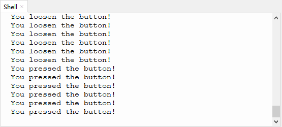

   img

项目八 电容触摸传感器检测实验
~~~~~~~~~~~~~~~~~~~~~~~~~~~~~

1.1 项目介绍

在这个套件中，有一个Keyes 电容触摸模块，它主要由1个触摸检测芯片
TTP223-BA6
构成。模块上提供一个触摸按键，功能是用可变面积的按键取代传统按键。当我们上电之后，传感器需要约0.5秒的稳定时间，此时间段内不要触摸按键，此时所有功能都被禁止，始终进行自校准，校准周期约为4秒。

1.2 模块参数

工作电压 ：DC 3.3 ~ 5V

最大功率 ：0.3 W

工作温度 ：-10°C ~ +50°C

输出信号 ：数字信号

尺寸 ：32 x 23.8 x 9 mm

定位孔大小 ：直径为 4.8 mm

接口 ：间距为2.54 mm 3pin防反接口

1.3 模块原理图

.. figure:: ./media/081301.png
   :alt: img

   img

TTP223N-BA6 的输出通过 AHLB（4）引脚选择高电平或低电平有效。通过
TOG（6）引脚选择直接模式或触发模式。

=== ==== =====================
TOG AHLB 引脚Q的功能
=== ==== =====================
0   0    直接模式，高电平有效
0   1    直接模式，低电平有效
1   0    触发模式，上电状态为0
1   1    触发模式，上电状态为1
=== ==== =====================

从原理图我们可以知道 TOG 脚和 AHLB
脚是悬空的，此时输出为直接模式，高电平有效。

当我们用手指触摸模块上的感应区时，信号端 S
输出高电平（上一课学习的按键模块与之相反，当按键感应到按下输出低电平），板载红色LED点亮，我们通过读取模块上
S 端的高低电平，判断电容触摸模块上的感应区是否感应到触摸。

1.4 实验组件

+----------------+----------------+-------------------+--------------+
| |image40|      | |image41|      | |image42|         | |image43|    |
+================+================+===================+==============+
| ESP32 Plus主板 | Keyes          | XH2.54-3P         | USB线 x1     |
| x1             | 电容触摸模块   | 转杜邦线母单线 x1 |              |
|                | x1             |                   |              |
+----------------+----------------+-------------------+--------------+

1.5 模块接线图

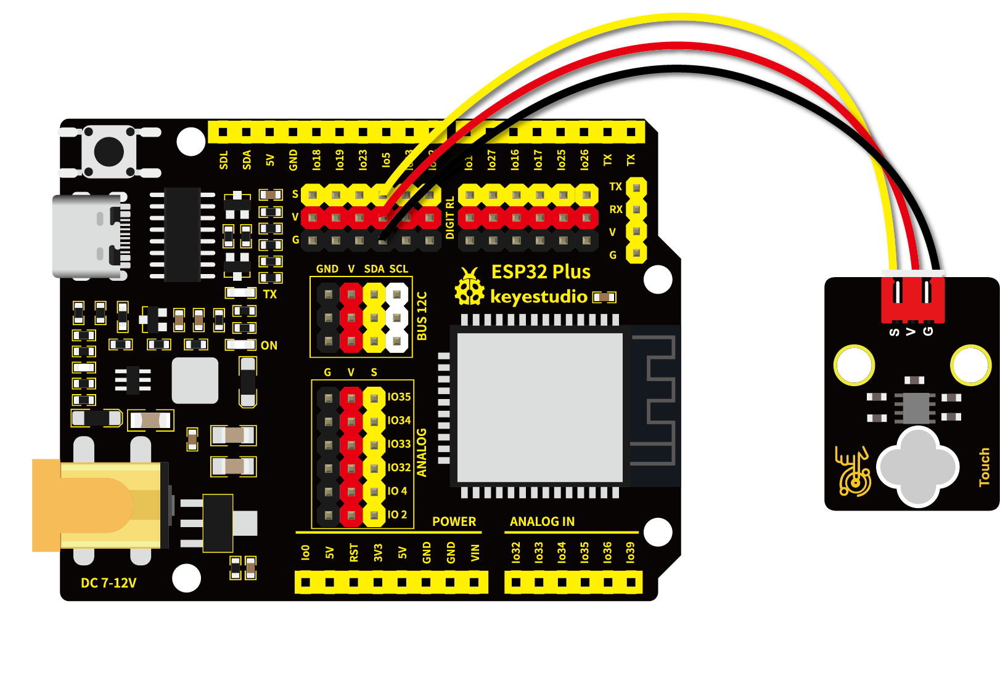

   img

1.6 在线运行代码

打开Thonny并单击\ |1303|\ ，然后单击“\ **此电脑**\ ”。

选中“\**D::raw-latex:`\代码*`\*”路径，打开代码文件’’\ **lesson_08_Touch.py**\ ”。

.. code:: python

   from machine import Pin
   import time

   touch = Pin(5, Pin.IN, Pin.PULL_UP)

   while True:
       if touch.value() == 1:
           print("You pressed the button!")   #按下打印相应信息
       else:
           print("You loosen the button!")
       time.sleep(0.1) #延迟0.1s

1.7 代码说明

此课程代码与第七课代码类似，这里就不多做介绍了。

1.8 实验结果

按照接线图正确接好模块，用USB线连接到计算机上电，单击\ |1305|\ 来执行程序代码。

代码开始执行，当触摸模块上的感应区感应到触摸时，板载红色LED点亮，value
值为 1，“Shell”窗口打印出“\ **You pressed the
button!**\ ”；当没有感应到触摸时，板载红色LED熄灭，value 值为
0，“Shell”窗口打印出“\ **You loosen the button!**\ ”。

单击\ |1311|\ 或按Ctrl+C退出程序。

.. figure:: ./media/081701.png
   :alt: img

   img

.. figure:: ./media/081702.png
   :alt: img

   img

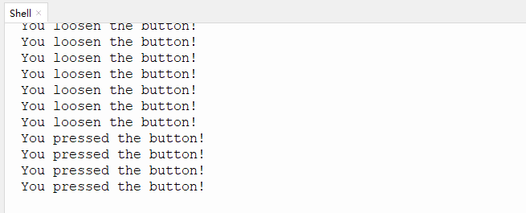

   img

项目九 避障传感器检测障碍物
~~~~~~~~~~~~~~~~~~~~~~~~~~~

1.1 项目介绍

在这个套件中，有一个Keyes
避障传感器，它主要由一对红外线发射与接收管元件组成。实验中，我们通过读取传感器上S端高低电平，判断是否存在障碍物；并且，在
Shell 窗口上显示测试结果。

1.2 模块参数

工作电压 : DC 5V

电流 : 50 mA

最大功率 : 0.3 W

工作温度 ：-10°C ~ +50°C

输出信号 : 数字信号

感应距离 : 2 ~ 40 cm

尺寸 ：32 x 23.8 x 11 mm

定位孔大小：直径为 4.8 mm

接口 ：间距为2.54 mm 3pin防反接口

1.3 模块原理图

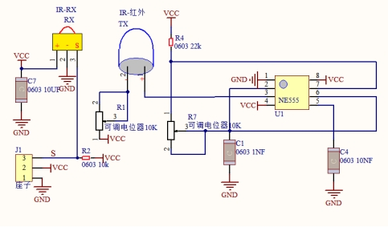

   img

NE555时基电路提供给发射管TX发射出一定频率的红外信号，红外信号会随着传送距离的加大逐渐衰减，如果遇到障碍物，就会形成红外反射。当检测方向RX遇到反射回来的信号比较弱时，接收检测引脚输出高电平，说明障碍物比较远；当反射回来的信号比较强，接收检测引脚输出低电平，说明障碍物比较近，此时指示灯亮起。传感器上有两个电位器，一个用于调节发送功率，一个用于调节接收频率，通过调节两个电位器，我们可以调节它的有效距离。

1.4 实验组件

+----------------+----------------+-------------------+--------------+
| |image44|      | |image45|      | |image46|         | |image47|    |
+================+================+===================+==============+
| ESP32 Plus主板 | Keyes          | XH2.54-3P         | USB线 x1     |
| x1             | 避障传感器 x1  | 转杜邦线母单线 x1 |              |
+----------------+----------------+-------------------+--------------+

1.5 模块接线图

.. figure:: ./media/091501.png
   :alt: img

   img

1.6 在线运行代码

打开Thonny并单击\ |1303|\ ，然后单击“\ **此电脑**\ ”。

选中“\**D::raw-latex:`\代码*`\*”路径，打开代码文件’’\ **lesson_09_Avoiding.py**\ ”。

.. code:: python

   from machine import Pin
   import time  

   sensor = Pin(5, Pin.IN) 
   while True:
       if sensor.value() == 0:
           print("There are obstacles")
       else:
           print("All going well")
       time.sleep(0.1)

1.7 代码说明

此课程代码与第七课代码类似，这里就不多做介绍了。

1.8 实验结果

按照接线图正确接好模块，用USB线连接到计算机上电，单击\ |1305|\ 来执行程序代码。代码开始执行，接着开始调节传感器模块上的两个电位器感应距离。避障传感器上有两个电位器，分别是接收频率调节电位器和发射功率调节电位器，如下图所示。

**注意：**\ 调节时保持传感器前方没有障碍物阻挡，否则调节后的检测距离较短。

.. figure:: ./media/091701.jpg
   :alt: img

   img

先调节发射功率调节电位器，先将电位器顺时针到尽头，然后逆时针慢慢往回调，当调节到SLED灯亮起时，微调使传感器上SLED灯介于亮与不亮之间的\ **不亮**\ 状态。

接着设置接收频率调节电位器，同样将电位器顺时针到尽头，然后逆时针慢慢往回调，当SLED灯亮起时，微调使传感器上SLED灯介于亮与不亮之间的\ **不亮**\ 状态，此时能检测障碍物的距离最长。

调节完成后查看“Shell”窗口。当传感器检测到障碍物时，value值为\ **0**\ ，SLED灯亮，“Shell”窗口打印出
“\ **There are obstacles**\ ”
；没有检测到障碍物时，value值为\ **1**\ ，SLED灯灭，“Shell”窗口打印出
“\ **All going well**\ ” 。

单击\ |1311|\ 或按Ctrl+C退出程序。

   img

.. figure:: ./media/091703.png
   :alt: img

   img

.. figure:: ./media/091704.png
   :alt: img

   img

项目十 循迹传感器检测黑白线
~~~~~~~~~~~~~~~~~~~~~~~~~~~

1.1 项目介绍

在这个套件中，有一个Keyes 单路循线传感器，它主要由1个TCRT5000
反射型黑白线识别传感器元件组成。

1.2 模块参数

工作电压 ：DC 3.3 ~ 5V

工作温度 ：-10°C ~ +50°C

输入信号 ：PWM信号

尺寸 ：32 x 23.8 x 9.4 mm

定位孔大小 ：直径为 4.8 mm

接口 ：间距为2.54 mm 3pin防反接口

1.3 模块原理图

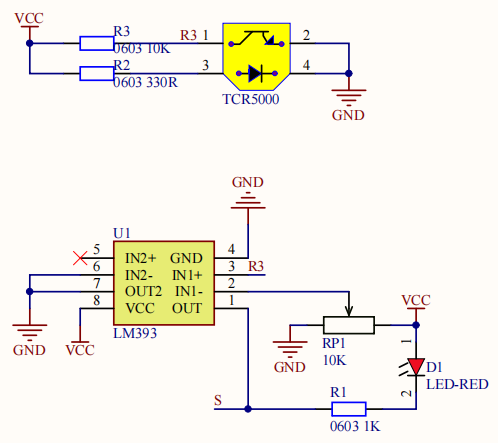

   img

上一课我们学习了避障传感器的原理，而巡线传感器的原理也是相类似的。TCRT5000
反射型传感器包含了一个红外发射器和光电探测器，彼此相邻。巡线传感器的红外发射器持续发出红外线，红外线经过反射后被接收。接收后会产生电流，这个电流随着红外线光增强而变大。接收后利用电压比较器
LM393 ，将接收到红外线后 LM393 的 3 脚的电压值与可调电位器给 LM393 的 2
脚设置的阈值电压进行比较。

当发射出的红外线没有被反射回来或被反射回来但强度不够大时，红外接收管一直处于关闭状态，此时
R3 处的电压接近VCC，即 LM393 的 3 脚电压接近 VCC。而LM393 的 2
脚电压小于 VCC，通过 LM393 比较器后比较 1
脚输出高电平，LED不导通。随着反射回来的红外线光增强，电流也随之变大。此时
3 脚的电压值等于 VCC - I*R3，随着电流的增大，3
脚的电压就会越来越小。当电压小到比 2 脚的电压还小的时候，接收检测引脚 1
脚输出低电平，LED导通，被点亮。

当红外信号发送到黑色轨道时，由于黑色吸光能力比较强，红外信号发送出去后就会被吸收掉，反射部分很微弱。而白色反射率高，所以白色轨道就会把大部分红外信号反射回来。即检测到黑色或没检测到物体时，信号端为高电平；检测到白色物体时，信号端为低电平。它的检测高度为
0—3cm。我们可以通过旋转传感器上电位器，调节灵敏度，即调节检测高度。当旋转电位器，使传感器上红色
LED介于不亮与亮之间的临界点时，灵敏度最好。

1.4 实验组件

+----------------+------------------+-------------------+--------------+
| |image48|      | |image49|        | |image50|         | |image51|    |
+================+==================+===================+==============+
| ESP32 Plus主板 | Keyes            | XH2.54-3P         | USB线 x1     |
| x1             | 单路循线传感器x1 | 转杜邦线母单线 x1 |              |
+----------------+------------------+-------------------+--------------+

1.5 模块接线图

.. figure:: ./media/101501.png
   :alt: img

   img

1.6 在线运行代码

打开Thonny并单击\ |1303|\ ，然后单击“\ **此电脑**\ ”。

选中“\**D::raw-latex:`\代码*`\*”路径，打开代码文件’’\ **lesson_10_Line_tracking.py**\ ”。

.. code:: python

   from machine import Pin
   import time

   sensor = Pin(5, Pin.IN, Pin.PULL_UP)

   while True:
       if sensor.value() == 0:
           print("0   White")   #按下打印相应信息
       else:
           print("1   Black")
       time.sleep(0.1) #延时 0.1s

1.7 代码说明

此课程代码与第七课代码类似，这里就不多做介绍了。

1.8 实验结果

按照接线图正确接好模块，用USB线连接到计算机上电，单击\ |1305|\ 来执行程序代码。

代码开始执行，“Shell”窗口打印出对应的数据和字符。当传感器检测到黑色物体货检测距离太远时，value值为
1 ，LED不亮，“Shell”窗口打印出“\ **1
Black**\ ”；检测到白色物体（能够反光）时，value值为 0
，LED亮，“Shell”窗口打印出“\ **0 White**\ ”。

单击\ |1311|\ 或按Ctrl+C退出程序。

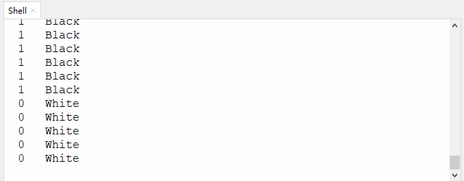

   img

项目十一 光折断计数
~~~~~~~~~~~~~~~~~~~

1.1 项目介绍

在这个套件中，有一个Keyes 光折断模块，它主要由 1 个 ITR-9608
光电开关组成，它属于对射光电开关传感器。

这一课，我们通过设置代码，模拟出流水线上利用类似传感器实现对产品进行计数的功能。

1.2 模块参数

工作电压 ：DC 3.3 ~ 5V

工作温度 ：-10°C ~ +50°C

输入信号 ：PWM信号

尺寸 ：32 x 23.8 x 13 mm

定位孔大小 ：直径为 4.8 mm

接口 ：间距为2.54 mm 3pin防反接口

1.3 模块原理图

光电开关是是利用被检测物体对光束的遮挡或反射，由同步回路选通电路，从而检测遮挡物体的有无。所有能反射光线的物体都可以被检测。光电开关将输入的电流在发射器上转换为光信号并射出，然后接收器根据接收到的光线强弱或有无，对目标物体进行检测。

.. figure:: ./media/111301.jpg
   :alt: img

   img

当用不透明物体放置在传感器凹槽时，C 脚与 VCC 连通，传感器信号端 S
为高电平，自带红色 LED熄灭；传感器凹槽没有任何东西时，传感器信号端被 R2
拉低为低电平，自带红色LED亮起。

1.4 实验组件

+---------------+-----------------+--------------------+---------------+
| |image52|     | |image53|       | |image54|          | |image55|     |
+===============+=================+====================+===============+
| ESP32         | Keyes           | XH2.54-3P          | USB线 x1      |
| Plus主板 x1   | 光折断模块 x1   | 转杜邦线母单线 x1  |               |
+---------------+-----------------+--------------------+---------------+

1.5 模块接线图

   img

1.6 在线运行代码

打开Thonny并单击\ |1303|\ ，然后单击“\ **此电脑**\ ”。

选中“\**D::raw-latex:`\代码*`\*”路径，打开代码文件’’\ **lesson_11_Photo_Interrupt.py**\ ”。

.. code:: python

   from machine import Pin
   import time

   sensor = Pin(5, Pin.IN, Pin.PULL_UP)
   last_state = sensor.value()  # 初始化为当前状态
   push_counter = 0
   DEBOUNCE_MS = 50  # 消抖时间（毫秒）

   while True:
       current_state = sensor.value()
       if current_state != last_state:
           time.sleep_ms(DEBOUNCE_MS)  # 等待消抖
           if sensor.value() == 1:     # 确认上升沿
               push_counter += 1
               print(push_counter)
       last_state = current_state

1.7 代码说明

**逻辑实现**

- 通过比较当前状态（\ ``current_state``\ ）和上一次状态（\ ``last_state``\ ）检测
  **边沿变化**\ （上升沿或下降沿）。
- 当检测到 **上升沿**\ （\ ``current_state`` 从 ``0`` 变为
  ``1``\ 时），计数器 ``PushCounter`` 加 1 并打印。

+----------------------------+-----------------------------------------------------------------------+
| 代码                       | 说明                                                                  |
+============================+=======================================================================+
| time.sleep_ms(DEBOUNCE_MS) | 50ms                                                                  |
|                            | 延时（\ ``DEBOUNCE_MS``\ ）过滤机械抖动，确保一次按下只触发一次计数。 |
+----------------------------+-----------------------------------------------------------------------+
| last_state = current_state | 更新 ``last_state`` 为当前状态，进入下一轮循环。                      |
+----------------------------+-----------------------------------------------------------------------+

1.8 实验结果

按照接线图正确接好模块，用USB线连接到计算机上电，单击\ |1305|\ 来执行程序代码。

“Shell”窗口打印出 PushCounter
的数据，物体每穿过传感器凹槽一次，PushCounter 数据加 1。

.. figure:: ./media/111701.png
   :alt: img

   img

.. figure:: ./media/111702.png
   :alt: img

   img

   img

项目十二 倾斜模块的原理
~~~~~~~~~~~~~~~~~~~~~~~

1.1 项目介绍

在这个套件中，有一个Keyes
倾斜传感器，主要由一个倾斜开关组成，其内部带有一颗滚珠，用来监测倾斜情况。倾斜开关可以依据模块是否倾斜而输出不同的电平信号。当开关高于水平位置倾斜时开关导通，低于水平位置时开关断开。倾斜模块可用于倾斜检测、报警器制作或者其他检测。

1.2 模块参数

工作电压 : DC 3.3 ~ 5V

电流 : 50 mA

最大功率 : 0.3 W

工作温度 ：-10°C ~ +50°C

输出信号 : 数字信号

尺寸 ：32 x 23.8 x 8 mm

定位孔大小：直径为 4.8 mm

接口 ：间距为2.54 mm 3pin防反接口

1.3 模块原理图

.. figure:: ./media/121301.png
   :alt: img

   img

Keyes
倾斜传感器的原理非常简单，主要是利用滚珠在开关内随不同倾斜角度的变化使滚珠开关P1的引脚1和2导通或者不导通，当滚珠开关P1的引脚1和2导通时，由于1脚接GND，所以信号端S被拉低为低电平，此时红色LED和R2组成的电路形成回路，电流经过红色LED，点亮红色LED；当滚珠开关P1的引脚1和2不导通时，滚珠开关P1的引脚2被4.7K的上拉电阻R1拉高使得信号端S为高电平，电流不经过红色LED，红色LED熄灭。

1.4 实验组件

+----------------+----------------+-------------------+--------------+
| |image56|      | |image57|      | |image58|         | |image59|    |
+================+================+===================+==============+
| ESP32 Plus主板 | Keyes          | XH2.54-3P         | USB线 x1     |
| x1             | 倾斜传感器 x1  | 转杜邦线母单线 x1 |              |
+----------------+----------------+-------------------+--------------+

1.5 模块接线图

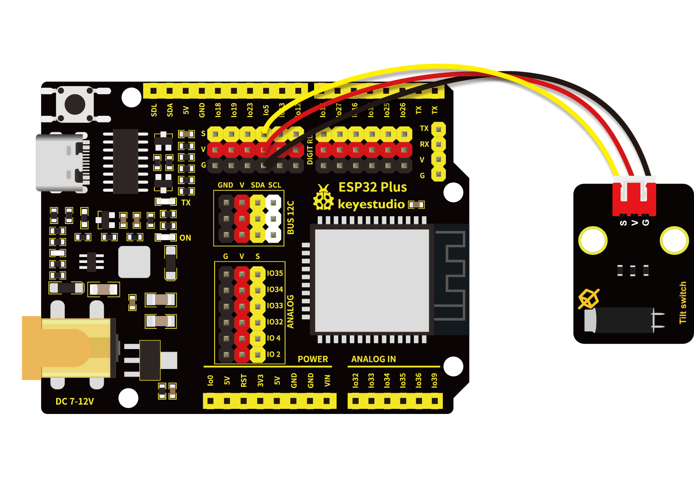

   img

1.6 在线运行代码

打开Thonny并单击\ |1303|\ ，然后单击“\ **此电脑**\ ”。

选中“\**D::raw-latex:`\代码*`\*”路径，打开代码文件’’\ **lesson_12_Tilt_switch.py**\ ”。

.. code:: python

   from machine import Pin
   import time

   TiltSensor = Pin(5, Pin.IN)

   while True:
       value = TiltSensor.value()
       print(value, end = " ")
       if  value== 0:
           print("The switch is turned on")
       else:
           print("The switch is turned off")
       time.sleep(0.1)

1.7 代码说明

此课程代码与第七课代码类似，这里就不多做介绍了。

1.8 实验结果

按照接线图正确接好模块，用USB线连接到计算机上电，单击\ |1305|\ 来执行程序代码。代码开始执行，将倾斜模块往某一边倾斜，若模块上的红色LED\ **不亮**\ ，“Shell”窗口打印出“\ **1
The switch is turned
off**\ ”；若模块上的红色LED点\ **亮**\ ，“Shell”窗口打印出“\ **0 The
switch is turned on**\ ”。

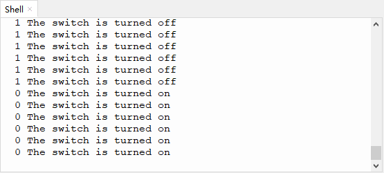

   img

.. figure:: ./media/121702.png
   :alt: img

   img

.. figure:: ./media/121703.png
   :alt: img

   img

项目十三 碰撞传感器的原理
~~~~~~~~~~~~~~~~~~~~~~~~~

1.1 项目介绍

在这个套件中，有一个Keyes
碰撞传感器。上一课我们学习的倾斜模块用的是滚珠开关，这一课我们学习的碰撞传感器用的是轻触开关。碰撞传感器常用于3D打印机内做限位开关。

1.2 模块参数

工作电压：DC 3.3-5V

控制信号：数字信号

尺寸：39.5 x 23.5 x 9.2 mm

定位孔大小：直径为 4.8 mm

接口：间距为2.54 mm 3pin防反接口

1.3 模块原理图

.. figure:: ./media/131301.png
   :alt: img

   img

碰撞传感器主要由 1 个轻触开关组成。当物体碰到轻触开关弹片，下压时，2
脚和 3 脚导通，传感器信号端 S 被下拉为低电平，模块上自带的红色 LED
点亮；当没有物体碰撞轻触开关时，2 脚和 3 脚不导通，3 脚被 4.7 K的电阻 R1
上拉为高电平，即传感器信号端S为高电平，此时自带红色 LED
熄灭。碰撞传感器的原理与倾斜模块的电路原理几乎一样，不同之处在于导通方式。

1.4 实验组件

+---------------+---------------+---------------------+---------------+
| |image60|     | |image61|     | |image62|           | |image63|     |
+===============+===============+=====================+===============+
| ESP32         | Keyes         | XH2.54-3P           | USB线 x1      |
| Plus主板 x1   | 碰撞传感器 x1 | 转杜邦线母单线 x1   |               |
+---------------+---------------+---------------------+---------------+

1.5 模块接线图

   img

1.6 在线运行代码

打开Thonny并单击\ |1303|\ ，然后单击“\ **此电脑**\ ”。

选中“\**D::raw-latex:`\代码*`\*”路径，打开代码文件’’\ **lesson_13_collision_sensor.py**\ ”。

.. code:: python

   from machine import Pin
   import time

   CollisionSensor = Pin(5, Pin.IN)

   while True:
       value = CollisionSensor.value()
       print(value, end = " ")
       if  value== 0:
           print("The end of this!")
       else:
           print("All going well")
       time.sleep(0.1)

1.7 代码说明

此课程代码与第十二课代码类似，这里就不多做介绍了。

1.8 实验结果

按照接线图正确接好模块，用USB线连接到计算机上电，单击\ |1305|\ 来执行程序代码。

将传感器的上弹片下压时，value值为0，模块上LED点亮，“Shell”窗口打印出“\ **0
The end of this!**\ ”
；当松开弹片时，value值为1，模块上LED熄灭，“Shell”窗口打印出“\ **1 All
going well!**\ ”。

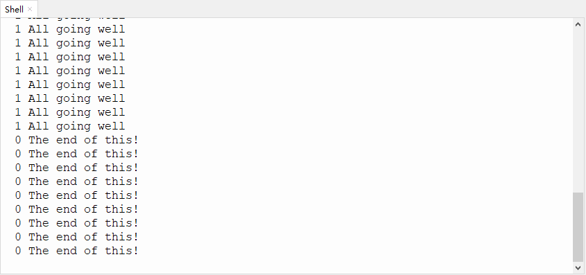

   img

项目十四 霍尔传感器检测南极磁场
~~~~~~~~~~~~~~~~~~~~~~~~~~~~~~~

1.1 项目介绍

在这个套件中，有一个Keyes 霍尔传感器，它主要由 A3144
线性霍尔元件组成。该元件是由电压调整器、霍尔电压发生器、差分放大器、史密特触发器，温度补偿电路和集电极开路的输出级组成的磁敏传感电路，其输入为磁感应强度，输出是一个数字电压讯号。

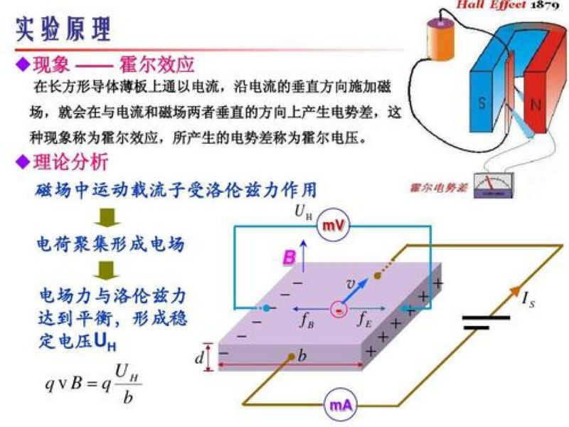

   img

霍尔效应传感器有两种主要类型，一种提供模拟输出，另一种提供数字输出。
A3144 是数字输出霍尔传感器。

1.2 模块参数

工作电压：DC 3.3-5V

控制信号：数字信号

尺寸：32 x 23.5 x 9.2 mm

定位孔大小：直径为 4.8 mm

接口：间距为2.54 mm 3pin防反接口

1.3 模块原理图

.. figure:: ./media/141301.jpg
   :alt: img

   img

传感器感应到无磁场或北极磁场时，信号端为高电平；感应到南极磁场时，信号端为低电平。当感应磁场强度越强时，感应距离越长。

1.4 实验组件

+-----------------+---------------+--------------------+---------------+
| |image64|       | |image65|     | |image66|          | |image67|     |
+=================+===============+====================+===============+
| ESP32 Plus主板  | Keyes         | XH2.54-3P          | USB线 x1      |
| x1              | 霍尔传感器 x1 | 转杜邦线母单线 x1  |               |
+-----------------+---------------+--------------------+---------------+

1.5 模块接线图

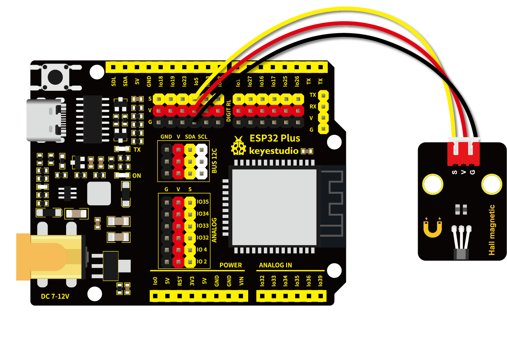

   img

1.6 在线运行代码

打开Thonny并单击\ |1303|\ ，然后单击“\ **此电脑**\ ”。

选中“\**D::raw-latex:`\代码*`\*”路径，打开代码文件’’\ **lesson_14_Hall.py**\ ”。

.. code:: python

   from machine import Pin
   import time

   hall = Pin(5, Pin.IN)
   while True:
       value = hall.value()
       print(value, end = " ")
       if value == 0:
           print("A magnetic field")
       else:
           print("There is no magnetic field")
       time.sleep(0.1)

1.7 代码说明

此课程代码与第七课代码类似，这里就不多做介绍了。

1.8 实验结果

按照接线图正确接好模块，用USB线连接到计算机上电，单击\ |1305|\ 来执行程序代码。

当传感器感应到北极磁场或无磁场感应时，“Shell”窗口打印出“\ **1 There is
no magnetic
field**\ ”，且传感器上的LED处于熄灭状态；当传感器感应到磁铁时，“Shell”窗口打印出“\ **0
A magnetic field**\ ”，且模块上的LED被点亮。

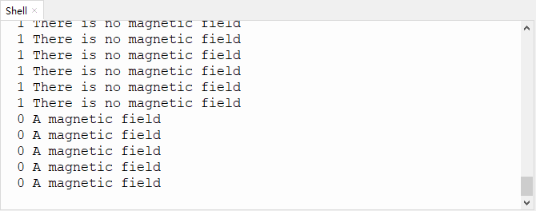

   img

项目十五 干簧管检测附近磁场
~~~~~~~~~~~~~~~~~~~~~~~~~~~

1.1 项目介绍

在这个套件中，有一个Keyes 干簧管模块，它主要由一个MKA10110
绿色磁簧元件组成。簧管是干式舌簧管的简称，是一种有触点的无源电子开关元件，具有结构简单，体积小便于控制等优点。它的外壳是一根密封的玻璃管，管中装有两个铁质的弹性簧片电板，还灌有一种惰性气体。

实验中，我们通过读取模块上S端高低电平，判断模块附近是否存在磁场；并且在“Shell”窗口上显示测试结果。

1.2 模块参数

工作电压 : DC 3.3 ~ 5V

电流 : 50 mA

最大功率 : 0.3 W

工作温度 ：-10°C ~ +50°C

输出信号 : 数字信号

尺寸 ：32 x 23.8 x 7.4 mm

定位孔大小：直径为 4.8 mm

接口 ：间距为2.54 mm 3pin防反接口

1.3 模块原理图

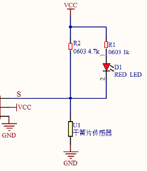

   img

一般状态下，玻璃管中的两个由特殊材料制成的簧片是分开的，此时信号端S被电阻R2上拉为高电平，LED熄灭。当有磁性物质靠近玻璃管时，在磁场磁力线的作用下，管内的两个簧片被磁化而互相吸引接触，簧片就会吸合在一起，使结点所接的电路连通，即信号端S连通GND，此时LED点亮。外磁力消失后，两个簧片由于本身的弹性而分开，线路也就断开了。该传感器就是利用元件这一特性，搭建电路将磁场信号转换为高低电平变换信号。

1.4 实验组件

+----------------+----------------+-------------------+--------------+
| |image68|      | |image69|      | |image70|         | |image71|    |
+================+================+===================+==============+
| ESP32 Plus主板 | Keyes          | XH2.54-3P         | USB线 x1     |
| x1             | 干簧管模块 x1  | 转杜邦线母单线 x1 |              |
+----------------+----------------+-------------------+--------------+

1.5 模块接线图

.. figure:: ./media/151501.png
   :alt: img

   img

1.6 在线运行代码

打开Thonny并单击\ |1303|\ ，然后单击“\ **此电脑**\ ”。

选中“\**D::raw-latex:`\代码*`\*”路径，打开代码文件’’\ **lesson_15_Reed_Switch**\ ”。

.. code:: python

   from machine import Pin
   import time

   ReedSensor = Pin(5, Pin.IN)
   while True:
       value = ReedSensor.value()
       print(value, end = " ")
       if value == 0:
           print("A magnetic field")
       else:
           print("There is no magnetic field")
       time.sleep(0.1)

1.7 代码说明

此课程代码与第七课代码类似，这里就不多做介绍了。

1.8 实验结果

按照接线图正确接好模块，用USB线连接到计算机上电，单击\ |1305|\ 来执行程序代码。代码开始执行。

拿一块带有磁性的物体靠近干簧管模块，当模块检测到磁场时，value值为0且模块上的红色LED点亮，“Shell”窗口打印出“\ **0
A magnetic
field**\ ”；没有检测到磁场时，value值为1，模块上红色LED熄灭，“Shell”窗口打印出“\ **1
There is no magnetic field**\ ”。

.. figure:: ./media/151701.png
   :alt: img

   img

项目十六 附近有人吗
~~~~~~~~~~~~~~~~~~~

1.1 项目介绍

在这个套件中，有一个Keyes
人体红外热释传感器，它主要由一个RE200B-P传感器元件组成。它是一款基于热释电效应的人体热释运动传感器，能检测到人体或动物身上发出的红外线，配合菲涅尔透镜能使传感器探测范围更远更广。

实验中，通过读取模块上S端高低电平，判断附近是否有人在运动；并且在 Shell
窗口上显示测试结果。

1.2 模块参数

工作电压 : DC 5 ~ 15V

工作电流 : 50 mA

最大功率 : 0.3 W

静态电流 : <50 uA

工作温度 ：-10°C ~ +50°C

控制信号 : 数字信号

触发方式 : L 不可重复触发/H 重复触发

最大检测距离 : 7米

感应角度 : <100 度锥角

尺寸 ：32 x 23.8 x 7.4 mm

定位孔大小：直径为 4.8 mm

接口 ：间距为2.54 mm 3pin防反接口

1.3 模块原理图

.. figure:: ./media/161301.png
   :alt: img

   img

这个模块的原理图可能较前面的模块稍复杂，我们一部分一部分来看。先看电压转换部分，作用是将5V输入电压转换为3.3V输入电压。因为我们模块上用到的热释电红外传感器的工作电压是3.3V，不能直接用5V电压供电使用。有了这个电压转换部分，3.3V输入电压和5V输入电压都适用于此热释电红外传感器。

当红外热释传感器没有检测到红外信号时，红外热释传感器的1脚输出低电平，此时模块上的LED两端有电压差，有电流流过，LED被点亮，MOS管Q1导通（Q1是NPN
MOS管，型号为2N7002。由于红外热释传感器的1脚输出低电平，所以Q1的源极Vs=0V，而Q1的栅极Vg=3.3V，于是Q1的栅极G和Q1的源极S之间的电压
Vgs = 3.3V 大于Q1的阈值电压 2.5V，Q1导通。），信号端S检测到低电平。

当红外热释传感器检测到红外信号时，红外热释传感器的1脚输出高电平，此时模块上的LED熄灭，MOS管Q1不导通，则信号端S检测到被10K上拉电阻R5拉高的高电平。

1.4 实验组件

+----------------+--------------------+-------------------+--------------+
| |image72|      | |image73|          | |image74|         | |image75|    |
+================+====================+===================+==============+
| ESP32 Plus主板 | Keyes              | XH2.54-3P         | USB线 x1     |
| x1             | 人体红外热释传感器 | 转杜邦线母单线 x1 |              |
|                | x1                 |                   |              |
+----------------+--------------------+-------------------+--------------+

1.5 模块接线图

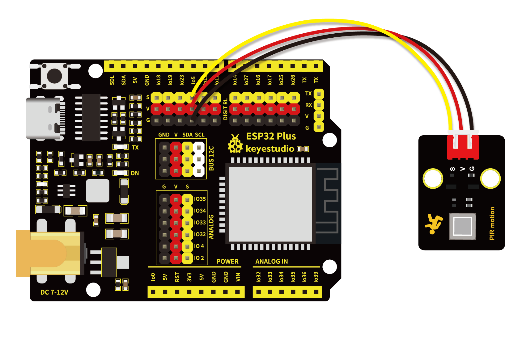

   img

1.6 在线运行代码

打开Thonny并单击\ |1303|\ ，然后单击“\ **此电脑**\ ”。

选中“\**D::raw-latex:`\代码*`\*”路径，打开代码文件’’\ **lesson_16_PIR_motion.py**\ ”。

.. code:: python

   from machine import Pin
   import time

   PIR = Pin(5, Pin.IN)
   while True:
       value = PIR.value()
       print(value, end = " ")
       if value == 1:
           print("Some body is in this area!")
       else:
           print("No one!")
       time.sleep(0.1)

1.7 代码说明

此课程代码与第七课代码类似，这里就不多做介绍了。

1.8 实验结果

按照接线图正确接好模块，用USB线连接到计算机上电，单击\ |1305|\ 来执行程序代码。代码开始执行.

当传感器检测到附近有人在运动时，value值为1，模块上LED熄灭， Shell
窗口显示“\ **1 Somebody is in this
area!**\ ”；没有检测到附近有人在运动时，value值为0，模块上LED点亮，
Shell 窗口显示“\ **0 No one!**\ ”。

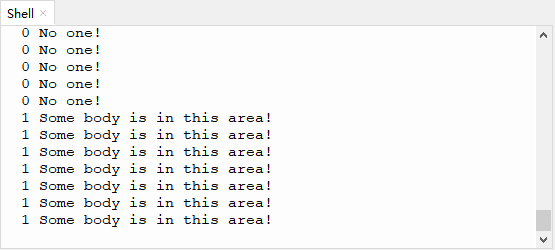

   img

项目十七 有源蜂鸣器模块播放声音
~~~~~~~~~~~~~~~~~~~~~~~~~~~~~~~

1.1 项目介绍

在这个套件中，有一个有源蜂鸣器模块，还有一个功放模块（原理相当于无源蜂鸣器）。在这个实验中，我们来学习尝试控制有源蜂鸣器发出声音。有源蜂鸣器元件内部自带震荡电路，使用时，我们只需要给蜂鸣器元件足够的电压，蜂鸣器就会自动响起。

1.2 模块参数

工作电压 : DC 3.3 ~ 5V

工作温度 ：-10°C ~ +50°C

输入信号 : 数字信号

尺寸 ：32 x 23.8 x 12.3 mm

定位孔大小：直径为 4.8 mm

接口 ：间距为2.54 mm 3pin防反接口

1.3 模块原理图

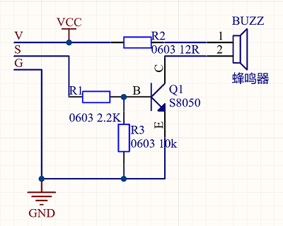

   img

从原理图我们可以得知，蜂鸣器的1脚通过串联一个电阻R2连接到电压正极；蜂鸣器的2脚连接到NPN三极管Q1的C极，集电极；Q1的B极，也就是基极通过串联一个电阻R1连接到S信号端；发射集接到GND。

当三极管Q1导通时，蜂鸣器的2脚连通GND，有源蜂鸣器便会工作。那么如何让三极管Q1导通呢？\ **NPN三极管的导通条件是基极（B）电压比发射极（E）电压高
0.3V
以上，**\ 只需要基极（B）被上拉至高电平即可。虽然三极管Q1的基极（B）有一个下拉电阻R3导致其不导通，但是R3电阻的阻值大，使其为弱下拉电阻。三极管Q1的基极（B）还连接了一个阻值小的强上拉电阻R1，只要我们用单片机IO口给S信号端输入高电平，强上拉电阻R1会将三极管Q1的基极（B）强上拉为高电平，三极管Q1就会导通，有源蜂鸣器就会工作。

1.4 实验组件

+----------------+----------------+-------------------+--------------+
| |image76|      | |image77|      | |image78|         | |image79|    |
+================+================+===================+==============+
| ESP32 Plus主板 | Keyes          | XH2.54-3P         | USB线 x1     |
| x1             | 有源蜂鸣器模块 | 转杜邦线母单线 x1 |              |
|                | x1             |                   |              |
+----------------+----------------+-------------------+--------------+

1.5 模块接线图

.. figure:: ./media/171501.png
   :alt: img

   img

1.6 在线运行代码

打开Thonny并单击\ |1303|\ ，然后单击“\ **此电脑**\ ”。

选中“\**D::raw-latex:`\代码*`\*”路径，打开代码文件’’\ **lesson_17_Active_buzzer.py**\ ”。

.. code:: python

   from machine import Pin
   import time

   buzzer = Pin(5, Pin.OUT)
   while True:
       buzzer.value(1)
       time.sleep(1)
       buzzer.value(0)
       time.sleep(1)

1.7 代码说明

此课程代码与第一课代码类似，这里就不多做介绍了。

1.8 实验结果

按照接线图正确接好模块，用USB线连接到计算机上电，单击\ |1305|\ 来执行程序代码。代码开始执行，模块上有源蜂鸣器响起1秒，停1秒，循环交替。

项目十八 8002b功放 喇叭模块
~~~~~~~~~~~~~~~~~~~~~~~~~~~

1.1 项目介绍

在这个套件中，有一个Keyes 8002b功放
喇叭模块，这个模块主要由一个可调电位器、一个喇叭和一个音频放大芯片组成。上一课我们学习了有源蜂鸣器模块的使用方法，这一课我们来学习套件中的8002b功放
喇叭模块的使用方法。这个模块主要功能是：可以对输出的小音频信号进行放大，大概放大倍数为8.5倍，并且可以通过自带的小功率喇叭播放出来，也可以用来播放音乐，作为一些音乐播放设备的外接扩音设备。

1.2 模块参数

工作电压 : DC 5V

工作电流 : ≥100 mA

最大功率 : 2.5 W

喇叭功率 : 0.15 W

喇叭声音 : 80 db

放大芯片 : SC8002B

工作温度 ：-10°C ~ +50°C

尺寸 ：47.6 x 23.8 x 10 mm

定位孔大小：直径为 4.8 mm

接口 ：间距为2.54 mm 3pin防反接口

1.3 模块原理图

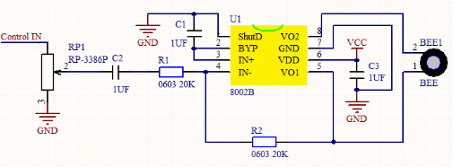

   img

其实这个喇叭就类似于于一个无源蜂鸣器，上一课我们介绍过，有源蜂鸣器自带振荡源，只要我们给它足够的电压就能响起来，而无源蜂鸣器元件内部不带震荡电路，需要在元件正极（也就是1脚）输入不同频率的方波，负极（也就是2脚）接地，从而控制蜂鸣器响起不同频率的声音。

1.4 实验组件

+----------------+------------------+-------------------+--------------+
| |image80|      | |image81|        | |image82|         | |image83|    |
+================+==================+===================+==============+
| ESP32 Plus主板 | Keyes 8002b功放  | XH2.54-3P         | USB线 x1     |
| x1             | 喇叭模块 x1      | 转杜邦线母单线 x1 |              |
+----------------+------------------+-------------------+--------------+

1.5 模块接线图

.. figure:: ./media/181501.png
   :alt: img

   img

1.6 在线运行代码

打开Thonny并单击\ |1303|\ ，然后单击“\ **此电脑**\ ”。

选中“\**D::raw-latex:`\代码*`\*”路径，打开代码文件’’\ **lesson_18_Passive_buzzer.py**\ ”。

.. code:: python

   from machine import Pin, PWM
   from time import sleep
   buzzer = PWM(Pin(4))

   while True:
       buzzer.duty(1000) 
       buzzer.freq(523)#DO
       sleep(0.5)
       buzzer.freq(586)#RE
       sleep(0.5)
       buzzer.freq(658)#MI
       sleep(0.5)
       buzzer.freq(697)#FA
       sleep(0.5)
       buzzer.freq(783)#SO
       sleep(0.5)
       buzzer.freq(879)#LA
       sleep(0.5)
       buzzer.freq(987)#SI
       sleep(0.5)
       buzzer.duty(0)
       sleep(0.5)

1.7 代码说明

+-------------------+----------------------------------------------------------------------------+
| 代码              | 说明                                                                       |
+===================+============================================================================+
| buzzer =          | 创建一个PWM类实例，蜂鸣器引脚连接GPIO4。                                   |
| PWM(Pin(4))       |                                                                            |
+-------------------+----------------------------------------------------------------------------+
| buzzer.duty(1000) | 设置占空比，占空比为1000/4950，这个值越大蜂鸣器越响，设置为0时蜂鸣器不响。 |
+-------------------+----------------------------------------------------------------------------+
| buzzer.freq(523)  | 频率设置方法。声音的音调取决于频率，设置好频率就可以设置音调。             |
+-------------------+----------------------------------------------------------------------------+

1.8 实验结果

按照接线图正确接好模块，用USB线连接到计算机上电，单击\ |1305|\ 来执行程序代码。代码开始执行，功放喇叭模块循环播放对应频率对应节拍的声音：DO，Re，Mi，Fa，So，La，Si各响半秒。如果觉得喇叭声音太大或太小，可以使用十字螺丝刀调节模块上的电位器以调整音量大小。

项目十九 130电机模块
~~~~~~~~~~~~~~~~~~~~

1.1 项目介绍

在这个套件中，有一个Keyes
130电机驱动模块。HR1124S是应用于直流电机方案的单通道H桥驱动器芯片。HR1124S的H桥驱动部分采用低导通电阻的PMOS和NMOS功率管。低导通电阻保证芯片低的功率损耗，使得芯片安全工作更长时间。此外HR1124S拥有低待机电流，低静态工作电流，这些性能使HR1124S易用于玩具方案。

实验中，我们可通过输出到两个信号端IN+和IN-的电压方向来控制电机的转动方向，让电机转动起来。

1.2 模块参数

工作电压 : DC 3.3 ~ 5V

电流 : 50 mA

最大功率 : 0.3 W

工作温度 ：-10°C ~ +50°C

输出信号 : 数字信号

尺寸 ：32 x 23.8 x 24.5 mm

定位孔大小：直径为 4.8 mm

接口 ：间距为2.54 mm 4pin防反接口

1.3 模块原理图

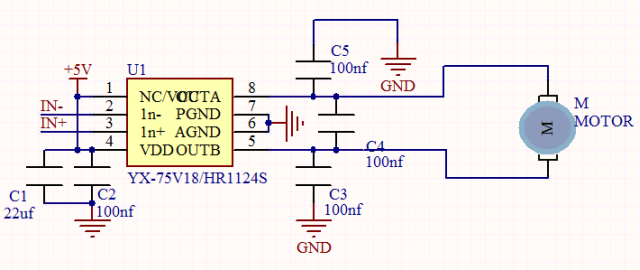

   img

HR1124S芯片的作用是助于驱动电机。而电机所需电流较大，无法用三极管驱动更无法直接用IO口驱动。让电机转动起来的方法很简单，给电机两端添加电压即可。不同电压方向电机转向也不相同，额度电压内，电压越大，电机转动得越快；反之电压越低，电机转动得越慢，甚至无法转动。所以我们可以用PWM口来控制电机的转速，这一课我们先学习用高低电平来控制电机。

1.4 实验组件

+---------------------+---------------------+-------------------------+
| |image84|           | |image85|           | |image86|               |
+=====================+=====================+=========================+
| ESP32 Plus主板 x1   | Keyes 130电机模块   | XH2.54-4P               |
|                     | x1                  | 转杜邦线母单线 x1       |
+---------------------+---------------------+-------------------------+
| |image87|           | |image88|           | |image89|               |
+---------------------+---------------------+-------------------------+
| USB线 x1            | 6节5号电池盒 x1     | 5号电池\ **(自备)** x6  |
+---------------------+---------------------+-------------------------+

**注意：电机与风扇叶是分开装的，需要组合到一起。**

1.5 模块接线图

**注意：请勿用手握住风扇叶，请将风扇叶对着空旷的地方，以免受伤。**

.. figure:: ./media/191501.png
   :alt: img

   img

1.6 在线运行代码

打开Thonny并单击\ |1303|\ ，然后单击“\ **此电脑**\ ”。

选中“\**D::raw-latex:`\代码*`\*”路径，打开代码文件’’\ **lesson_19_130_Motor.py**\ ”。

.. code:: python

   from machine import Pin
   import time

   #电机的两个引脚
   INA = Pin(5, Pin.OUT) #INA corresponds to IN+
   INB = Pin(13, Pin.OUT)#INB corresponds to IN- 

   while True:
       #逆时针方向 2s
       INA.value(1)
       INB.value(0)
       time.sleep(2)
       #停止 1s
       INA.value(0)
       INB.value(0)
       time.sleep(1)
       #顺时针旋转 2s
       INA.value(0)
       INB.value(1)
       time.sleep(2)
       #停止 1s
       INA.value(0)
       INB.value(0)
       time.sleep(1)

1.7 代码说明

====================== ======================================
代码                   说明
====================== ======================================
INA = Pin(5, Pin.OUT)  # INA对应电机驱动模块的IN+（正转控制）
INB = Pin(13, Pin.OUT) # INB对应电机驱动模块的IN-（反转控制）
====================== ======================================

- **INA** 和 **INB**
  是电机驱动模块（如L298N、DRV8833等）的控制信号输入引脚。
- 通过设置 ``INA`` 和 ``INB`` 的高低电平组合，控制电机转向：

  - ``INA=1, INB=0``\ ：正转（逆时针）
  - ``INA=0, INB=1``\ ：反转（顺时针）
  - ``INA=0, INB=0``\ ：停止
  - ``INA=1, INB=1``\ ：刹车（部分驱动模块支持）

1.8 实验结果

**注意：请勿用手握住风扇叶，请将风扇叶对着空旷的地方，以免受伤。**

按照接线图正确接好模块，注意，\ **一定要接电池盒**\ 。用USB线连接到计算机上电，单击\ |1305|\ 来执行程序代码。

代码开始执行，风扇逆时针转动2秒；停止1秒；顺时针转动2秒；停止1秒；循环交替。

项目二十 读取旋转电位器传感器的值
~~~~~~~~~~~~~~~~~~~~~~~~~~~~~~~~~

1.1 项目介绍

在这个套件中，有一个Keyes
旋转电位器传感器，它一个模拟传感器。前面我们学习过的传感器，都是数字传感器。例如我们前面学习的按键模块，当按键没有按下去时，我们读取到高电平（3.3V），当按键按下去时，我们读取到低电平（0V），而在0~3.3V中间的电压值，我们数字IO口无法读取到，当然按键模块也只能输出高低电平。而模拟传感器就可以通过我们ESP32主板上的16个ADC模拟口读取中间的电压值。

1.2 模块参数

工作电压 : DC 3.3 ~ 5V

工作电流 : 20 mA

工作功率 : 0.1 W

工作温度 ：-10°C ~ +50°C

输出信号 : 模拟信号

尺寸 ：32 x 23.8 x 28.4 mm

定位孔大小：直径为 4.8 mm

接口 ：间距为2.54 mm 3pin防反接口

1.3 模块原理图

.. figure:: ./media/201301.png
   :alt: img

   img

旋转电位器原理是靠电刷在电阻体上滑动，在电路中获取与输入电压形成一定关系地输出电压。Keyes
旋转电位器传感器选用了一个10K可调电阻。通过旋转电位器，我们可以改变电阻大小，信号端S检测到电压变化（0
~
3.3V），而这个电压变化是一个连续变化的模拟量，也就是在0~3.3V内可以取任意值，我们必须先对这个模拟量进行ADC采集，来测量连续的这些模拟量。A/D
是模拟量到数字量的转换，依靠的是模数转换器(Analog to Digital
Converter)，简称ADC。我们的ESP32主板已经集成了ADC采集，可以直接使用。

我们的ESP32主板ADC位数是12位。一个 n 位的 ADC 表示这个 ADC 共有 2 的 n
次方个刻度，12位的 ADC，输出的是从0～4095一共4096个数字量，也就是 2 的
12 次方个数据刻度，每个刻度就是3.3V/4095≈0.00081V，这也叫分辨率。

ADC：ADC是一种电子集成电路，用于将模拟信号(如电压)转换为由1和0表示的数字信号。我们在ESP32上的ADC的范围是12位（ADC的位数表示将模拟量转换成数字量后所用的二进制位数），其可存储数字量范围为：0
~ 2^12即0 ~
4096。假设它的参考电压是3.3V，也就是说把参考电压分成4095份，最小分辨率为3.3V/4095，模拟值的范围对应于ADC值。因此，ADC拥有的比特越多，模拟的分区就越密集，最终转换的精度也就越高。

.. figure:: ./media/201302.png
   :alt: img

   img

纵坐标数字0 : 0V ~ 3.3/4095V 范围内的模拟量（横坐标）;

纵坐标数字1 : 3.3/ 4095V ~ 2*3.3 /4095V 范围内的模拟量（横坐标）;

……

模拟将被相应地划分。换算公式如下：

.. figure:: ./media/201303.png
   :alt: img

   img

DAC：这一过程的可逆需要DAC，数字到模拟转换器。数字I/O端口可以输出高电平和低电平(0或1)，但不能输出中间电压值，这就是DAC有用的地方。ESP32有两个8位精度的DAC输出引脚GPIO25和GPIO26，可以将VCC(这里是3.3V)分成2\ *8=256个部分。例如，当数字量为1时，输出电压值为3.3/256*
1V，当数字量为128时，输出电压值为3.3/256 \*128=1.65V,
DAC的精度越高，输出电压值的精度就越高。

换算公式如下：

.. figure:: ./media/201304.png
   :alt: img

   img

ADC on ESP32：

ESP32有16个引脚，可以用来测量模拟信号。GPIO引脚序列号和模拟引脚定义如下表所示：

======================= =====================
**ADC number in ESP32** **ESP32 GPIO number**
======================= =====================
ADC0                    GPIO 36
ADC3                    GPIO 39
ADC4                    GPIO 32
ADC5                    GPIO33
ADC6                    GPIO34
ADC7                    GPIO 35
ADC10                   GPIO 4
ADC11                   GPIO0
ADC12                   GPIO2
ADC13                   GPIO15
ADC14                   GPIO13
ADC15                   GPIO 12
ADC16                   GPIO 14
ADC17                   GPIO27
ADC18                   GPIO25
ADC19                   GPIO26
======================= =====================

DAC on ESP32：

ESP32有两个8位数字模拟转换器，分别连接到GPIO25和GPIO26引脚，它是不可变的。如下表所示：

======================= ===============
**Simulate pin number** **GPIO number**
======================= ===============
DAC1                    GPIO25
DAC2                    GPIO26
======================= ===============

1.4 实验组件

+----------------+------------------+-------------------+--------------+
| |image90|      | |image91|        | |image92|         | |image93|    |
+================+==================+===================+==============+
| ESP32 Plus主板 | Keyes            | XH2.54-3P         | USB线 x1     |
| x1             | 旋转电位器传感器 | 转杜邦线母单线 x1 |              |
|                | x1               |                   |              |
+----------------+------------------+-------------------+--------------+

1.5 模块接线图

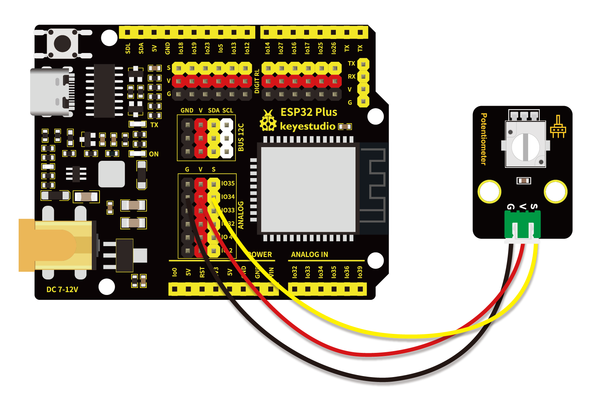

   img

1.6 在线运行代码

打开Thonny并单击\ |1303|\ ，然后单击“\ **此电脑**\ ”。

选中“\**D::raw-latex:`\代码*`\*”路径，打开代码文件’’\ **lesson_20_potentiometer.py**\ ”。

.. code:: python

   ### 导入引脚、ADC和DAC模块
   from machine import ADC,Pin,DAC 
   import time

   ### 开启并配置ADC，量程为0-3.3V
   adc=ADC(Pin(34))
   adc.atten(ADC.ATTN_11DB)
   adc.width(ADC.WIDTH_12BIT)

   ### 每0.1秒读取一次ADC值，将ADC值转换为DAC值输出;
   #并将这些数据打印到“Shell”
   try:
       while True:
           adcVal=adc.read()
           dacVal=adcVal//16
           voltage = adcVal / 4095.0 * 3.3
           print("ADC Val:",adcVal,"DACVal:",dacVal,"Voltage:",voltage,"V")
           time.sleep(0.1)
   except:
       pass

1.7 代码说明

+----------------------------+----------------------------------------------------------+
| 代码                       | 说明                                                     |
+============================+==========================================================+
| from machine import        | 使用ACD、DAC模块之前，需要将它们添加到python文件的顶部。 |
| ADC,Pin,DAC                |                                                          |
+----------------------------+----------------------------------------------------------+
| adc=ADC(Pin(34))           | 创建一个与给定pin关联的ADC对象。                         |
+----------------------------+----------------------------------------------------------+
| adc.read()                 | 读取ADC值并返回ADC值。                                   |
+----------------------------+----------------------------------------------------------+
| adc.atten(ADC.ATTN_11DB)   | 设定衰减比。                                             |
+----------------------------+----------------------------------------------------------+
| DB                         | 衰减比 / 衰减率。                                        |
+----------------------------+----------------------------------------------------------+
| ADC.ATTN_11DB              | 3.3V全量程。                                             |
+----------------------------+----------------------------------------------------------+
| adc.width(ADC.WIDTH_12BIT) | 设置数据宽度。                                           |
+----------------------------+----------------------------------------------------------+
| ADC.WIDTH_12BIT            | 12数据宽度。                                             |
+----------------------------+----------------------------------------------------------+

--------------

1.8 实验结果

按照接线图正确接好模块，用USB线连接到计算机上电，单击\ |1305|\ 来执行程序代码。代码开始执行，转动电位器手柄时，“Shell”窗口打印出此时电位器的ADC值、DAC值和电压的值。

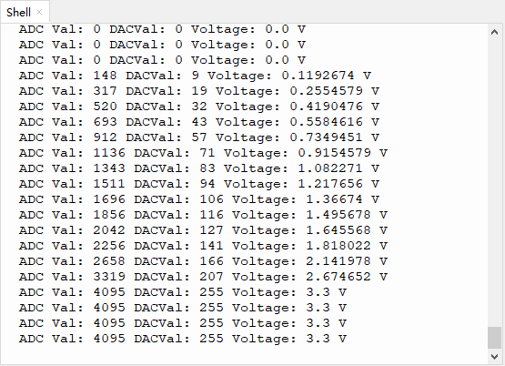

   img

项目二十一 水滴水蒸气传感器
~~~~~~~~~~~~~~~~~~~~~~~~~~~

1.1 项目介绍

在这个套件中，有一个Keyes
水滴传感器，它是一个模拟（数字）输入模块，也叫雨水、雨量传感器。可用于各种天气状况的监测，检测是否下雨及雨量的大小，转成数字信号（DO）和模拟信号（AO）输出，并广泛应用于Arduino
机器人套件，雨滴，下雨传感器，可用于各种天气状况的监测，并转成数定信号和
AO 输出，也可用于汽车自动刮水系统、智能灯光系统和智能天窗系统等。

1.2 模块参数

工作电压 : DC 5V

电流 : 30 mA

最大功率 : 0.15 W

工作温度 ：-10°C ~ +50°C

控制信号 : 模拟信号

尺寸 ：32 x 23.8 x 9.3 mm

定位孔大小：直径为 4.8 mm

接口 ：间距为2.54 mm 3pin防反接口

1.3 模块原理图

.. figure:: ./media/211301.jpg
   :alt: img

   img

Keyes
水滴传感器通过电路板上裸露的印刷平行线检测水量的大小。水量越多，就会有更多的导线被联通，随着导电的接触面积增大，雨滴感应区
2 脚输出的电压就会逐步上升。信号端 S
检测到的模拟值就越大。除了可以检测水量的大小，它还可以检测空气中的水蒸气。

1.4 实验组件

+----------------+----------------+-------------------+--------------+
| |image94|      | |image95|      | |image96|         | |image97|    |
+================+================+===================+==============+
| ESP32 Plus主板 | Keyes          | XH2.54-3P         | USB线 x1     |
| x1             | 水滴传感器 x1  | 转杜邦线母单线 x1 |              |
+----------------+----------------+-------------------+--------------+

1.5 模块接线图

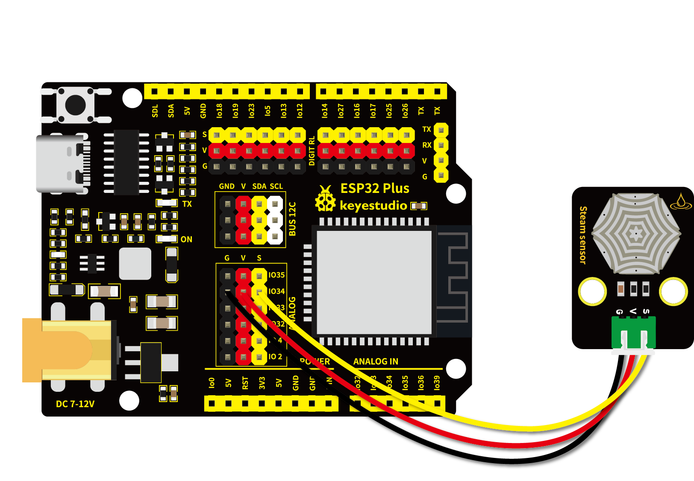

   img

1.6 在线运行代码

打开Thonny并单击\ |1303|\ ，然后单击“\ **此电脑**\ ”。

选中“\**D::raw-latex:`\代码*`\*”路径，打开代码文件’’\ **lesson_21_Steam_sensor.py**\ ”。

.. code:: python

   ### 导入引脚、ADC和DAC模块
   from machine import ADC,Pin,DAC
   import time

   ### 开启并配置ADC，量程为0-3.3V
   adc=ADC(Pin(34))
   adc.atten(ADC.ATTN_11DB)
   adc.width(ADC.WIDTH_12BIT)

   ### 每0.1秒读取一次ADC值，将ADC值转换为DAC值输出
   ### 并将这些数据打印到“Shell”
   try:
       while True:
           adcVal=adc.read()
           dacVal=adcVal//16
           voltage = adcVal / 4095.0 * 3.3
           print("ADC Val:",adcVal,"DACVal:",dacVal,"Voltage:",voltage,"V")
           time.sleep(0.1)
   except:
       pass

1.7 代码说明

+----------------------------+---------------------------------------------------+
| 代码                       | 说明                                              |
+============================+===================================================+
| from machine import ADC    | ``ADC``\ ：用于模拟信号输入（ESP32 的 ADC 精度为  |
|                            | 12 位，量程 0~3.3V）。                            |
+----------------------------+---------------------------------------------------+
| from machine import DAC    | ``DAC``\ ：用于模拟信号输出（ESP32 仅支持 8 位    |
|                            | DAC，对应引脚为 GPIO25/26，代码中未实际使用       |
|                            | ``DAC`` 模块，仅计算了 DAC 值）。                 |
+----------------------------+---------------------------------------------------+
| adc.atten(ADC.ATTN_11DB)   | ``ATTN_11DB``\ ：选择 11dB 衰减，支持最大 3.3V    |
|                            | 输入。                                            |
+----------------------------+---------------------------------------------------+
| adc.width(ADC.WIDTH_12BIT) | ``WIDTH_12BIT``\ ：12 位分辨率（值范围            |
|                            | 0~4095），ESP32 的 ADC 实际有效位约为 9~10 位。   |
+----------------------------+---------------------------------------------------+
| dacVal=adcVal//16          | ESP32 的 DAC 为 8 位（0~255），因此将 12 位 ADC   |
|                            | 值右移 4 位（\ ``//16``\ ）。                     |
+----------------------------+---------------------------------------------------+
| voltage = adcVal / 4095.0  | 电压计算，公式：\ ``电压 = (ADC值 / 4095) * 3.3`` |
| \* 3.3                     |                                                   |
+----------------------------+---------------------------------------------------+

1.8 实验结果

按照接线图正确接好模块，用USB线连接到计算机上电，单击\ |1305|\ 来执行程序代码。

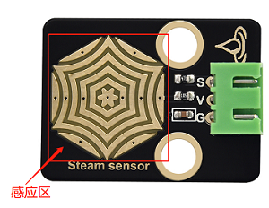

   img

在水滴传感器的感应区滴几滴水（\ **小心用水，注意不要滴到感应区以外的其他任何地方，包括ESP32主板**\ ）或者用湿润的手指触摸感应区，“Shell”窗口打印出此时水滴传感器的ADC值、DAC值和电压的值。水量变化，ADC值、DAC值和电压值也会发生变化。水量越多，输出的ADC值，DAC值和电压值越大。

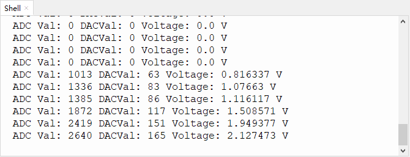

   img

项目二十二 声音传感器检测声量
~~~~~~~~~~~~~~~~~~~~~~~~~~~~~

1.1 项目介绍

在这个套件中，有一个Keyes
声音传感器。实验中，我们利用这个传感器测试当前环境中的声音对应的ADC值、DAC值和输出的电压值。声音越大，ADC值、DAC值和电压值越大；在“Shell”窗口上显示测试结果。

1.2 模块参数

工作电压 : DC 3.3 ~ 5V

工作电流 : 100 mA

最大功率 : 0.5 W

工作温度 ：-10°C ~ +50°C

输出信号 : 模拟信号

尺寸 ：32 x 23.8 x 10.3 mm

定位孔大小：直径为 4.8 mm

接口 ：间距为2.54 mm 3pin防反接口

1.3 模块原理图

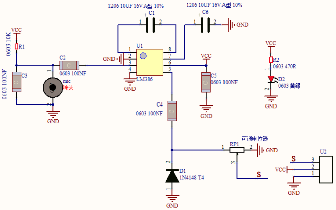

   img

Keyes
声音传感器主要由一个高感度麦克风元件和LM386音频功率放大器芯片组成。高感度麦克风元件用于检测外界的声音。利用LM386音频功率放大器芯片设计对高感度麦克风检测到的声音进行放大的电路，最大倍数为200倍。使用时我们可以通过旋转传感器上电位器，调节声音的放大倍数。顺时针调节电位器到尽头，放大倍数最大。

1.4 实验组件

+----------------+----------------+-------------------+--------------+
| |image98|      | |image99|      | |image100|        | |image101|   |
+================+================+===================+==============+
| ESP32 Plus主板 | Keyes          | XH2.54-3P         | USB线 x1     |
| x1             | 声音传感器 x1  | 转杜邦线母单线 x1 |              |
+----------------+----------------+-------------------+--------------+

1.5 模块接线图

.. figure:: ./media/221501.png
   :alt: img

   img

1.6 在线运行代码

打开Thonny并单击\ |1303|\ ，然后单击“\ **此电脑**\ ”。

选中“\**D::raw-latex:`\代码*`\*”路径，打开代码文件’’\ **lesson_22_MicroPhone.py**\ ”。

.. code:: python

   #导入引脚、ADC和DAC模块
   from machine import ADC,Pin,DAC
   import time

   ### 开启并配置ADC，量程为0-3.3V
   adc=ADC(Pin(34)) 
   adc.atten(ADC.ATTN_11DB)
   adc.width(ADC.WIDTH_12BIT)

   ### 每0.1秒读取一次ADC值，将ADC值转换为DAC值输出
   ### 并将这些数据打印到“Shell”
   try:
       while True:
           adcVal=adc.read()
           dacVal=adcVal//16
           voltage = adcVal / 4095.0 * 3.3
           print("ADC Val:",adcVal,"DACVal:",dacVal,"Voltage:",voltage,"V")
           time.sleep(0.1)
   except:
       pass

1.7 代码说明

此课程代码与第二十一课代码类似，这里就不多做介绍了。

1.8 实验结果

按照接线图正确接好模块，用USB线连接到计算机上电，单击\ |1305|\ 来执行程序代码。

代码开始执行，“Shell”窗口打印出声音传感器接收到的声音对应的ADC值、DAC值和电压值。对准MIC头大声说话，可以看到接收到的声音对应的ADC值、DAC值和电压值变大。

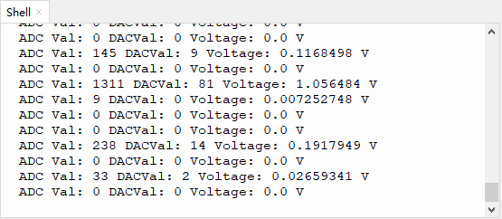

   img

项目二十三 光敏电阻传感器
~~~~~~~~~~~~~~~~~~~~~~~~~

1.1 项目介绍

在这个套件中，有一个Keyes
光敏电阻传感器，这是一个常用的光敏电阻传感器，它主要由一个光敏电阻元件组成。光敏电阻元件的阻值随着光照强度的变化而变化，此传感器就是利用光敏电阻元件这一特性，设计电路将阻值变化转换为电压变化。光敏电阻传感器可以模拟人对环境光线的强度的判断，方便做出与人友好互动的应用。

1.2 模块参数

工作电压 : DC 3.3 ~ 5V

电流 : 20 mA

最大功率 : 0.1 W

工作温度 ：-10°C ~ +50°C

输出信号 : 模拟信号

尺寸 ：32 x 23.8 x 7.4 mm

定位孔大小：直径为 4.8 mm

接口 ：间距为2.54 mm 3pin防反接口

1.3 模块原理图

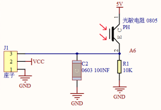

   img

当没有光照射时，电阻大小为0.2
MΩ，光敏电阻的信号端（2脚）检测的电压接近0。随着光照强度增大，光线传感器的电阻值越来越小，所以信号端能检测到的电压越来越大。

1.4 实验组件

+----------------+----------------+-------------------+--------------+
| |image102|     | |image103|     | |image104|        | |image105|   |
+================+================+===================+==============+
| ESP32 Plus主板 | Keyes          | XH2.54-3P         | USB线 x1     |
| x1             | 光敏电阻传感器 | 转杜邦线母单线 x1 |              |
|                | x1             |                   |              |
+----------------+----------------+-------------------+--------------+

1.5 模块接线图

.. figure:: ./media/231501.png
   :alt: img

   img

1.6 在线运行代码

打开Thonny并单击\ |1303|\ ，然后单击“\ **此电脑**\ ”。

选中“\**D::raw-latex:`\代码*`\*”路径，打开代码文件’’\ **lesson_23_photoresistance.py**\ ”。

.. code:: python

   ### 导入引脚、ADC和DAC模块
   from machine import ADC,Pin,DAC
   import time

   ### 开启并配置ADC，量程为0-3.3V
   adc=ADC(Pin(34)) 
   adc.atten(ADC.ATTN_11DB)
   adc.width(ADC.WIDTH_12BIT)

   ### 每0.1秒读取一次ADC值，将ADC值转换为DAC值输出
   ### 并将这些数据打印到“Shell”
   try:
       while True:
           adcVal=adc.read()
           dacVal=adcVal//16
           voltage = adcVal / 4095.0 * 3.3
           print("ADC Val:",adcVal,"DACVal:",dacVal,"Voltage:",voltage,"V")
           time.sleep(0.1)
   except:
       pass

1.7 代码说明

此课程代码与第二十一课代码类似，这里就不多做介绍了。

1.8 实验结果

按照接线图正确接好模块，用USB线连接到计算机上电，单击\ |1305|\ 来执行程序代码。代码开始执行，“Shell”窗口打印出光敏传感器的ADC值、DAC值和电压值。光照越强，可以看到ADC值，DAC值和电压值越大。

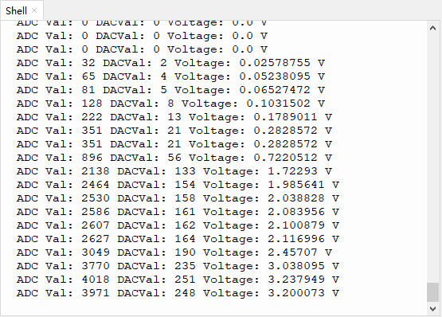

   img

项目二十四 NTC-MF52AT模拟温度传感器
~~~~~~~~~~~~~~~~~~~~~~~~~~~~~~~~~~~

1.1 项目介绍

在这个套件中，有一个Keyes
NTC-MF52AT模拟温度传感器，它的原理与光敏电阻传感器类似，只是感应的器件不同。将传感器信号端接到ESP32主板模拟口，可以读出对应的ADC值，电压值和温度值。我们可以利用ADC值，输出电压值，通过特定公式，计算出当前环境的温度。

1.2 模块参数

工作电压 : DC 3.3 ~ 5V

电流 : 20 mA

最大功率 : 0.1 W

工作温度 ：-10°C ~ +50°C

输出信号 : 模拟信号

尺寸 ：32 x 23.8 x 7.4 mm

定位孔大小：直径为 4.8 mm

接口 ：间距为2.54 mm 3pin防反接口

1.3 模块原理图

.. figure:: ./media/241301.png
   :alt: img

   img

Keyes
NTC-MF52AT模拟温度传感器主要由NTC-MF52AT热敏电阻元件组成。NTC-MF52AT热敏电阻元件能够感知周边环境温度的变化，随着温度的升高，热敏电阻的阻值降低，4.7K电阻两端的电压上升，从而引起信号端S的电压变化。

**NTC 热敏电阻温度计算公式：Rt = R \* EXP( B \* (1/T1-1/T2) ) 。**

其中，T1和T2指的是K度，即开尔文温度。K度=273.15(绝对温度)+摄氏度。

Rt 是热敏电阻在周围温度为T1（当前温度）时的电阻值。

R是热敏电阻在周围温度为T2常温（常温取25℃）时的标称阻值。参考规格书可知我们用的NTC-MF52AT模拟温度传感器在
25℃ 下热敏电阻的零功率电阻值为10KΩ ± 5%（即R=10K），T2=(273.15+25) 。

B值是热敏电阻的重要参数，为材料常数，在25℃下测得。参考规格书可知B值为
3950±1%。

EXP() 是e^()，e的n次方。

通过转换可以得到温度T1与电阻Rt的关系：T1=1 / (ln(Rt/R) /B+1/T2)
，这里可以将ln换算成log，即T1=1/ ( log(Rt/R)/B + 1/T2 ) 。

那么我们唯一需要知道的就是Rt的值。回到上面的原理图，设热敏电阻两端电压为VRt，固定的
R1电阻两端的电压为VR，由电阻分压知识VR/VRt = R1/Rt可以知道：Rt = R1
*(3.3-VR)/VR 。而我们实际得到的VR是转换后的ADC值，需要转换成电压值，即VR
= adcValue / 4095.0* 3.3。

**注意**\ ：计算出来的温度是开尔文温度，因此需要减去K值，对应的摄氏温度
t = T1 - 273.15，同时加上0.5的误差矫正。

1.4 实验组件

+----------------+--------------------------+-------------------+--------------+
| |image106|     | |image107|               | |image108|        | |image109|   |
+================+==========================+===================+==============+
| ESP32 Plus主板 | NTC-MF52AT模拟温度传感器 | XH2.54-3P         | USB线 x1     |
| x1             | x1                       | 转杜邦线母单线 x1 |              |
+----------------+--------------------------+-------------------+--------------+

1.5 模块接线图

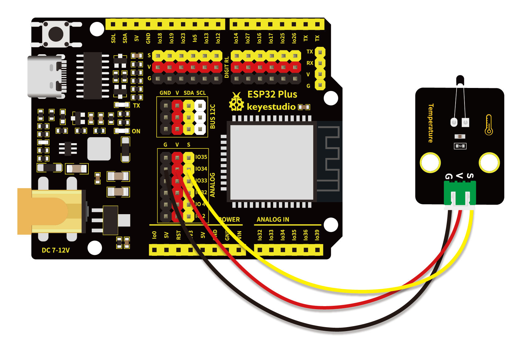

   img

1.6 在线运行代码

打开Thonny并单击\ |1303|\ ，然后单击“\ **此电脑**\ ”。

选中“\**D::raw-latex:`\代码*`\*”路径，打开代码文件’’\ **lesson_24_temperature.py**\ ”。

.. code:: python

   from machine import Pin, ADC
   import time
   import math

   #Set ADC
   adc=ADC(Pin(34))
   adc.atten(ADC.ATTN_11DB)
   adc.width(ADC.WIDTH_12BIT)

   try: 
       while True:
           adcValue = adc.read()
           voltage = adcValue / 4095 * 3.3
           Rt =(3.3-voltage) / voltage * 4700
           tempK = (1 / (1 / (273.15+25) + (math.log(Rt/10000)) / 3950))
           tempC = (tempK - 273.15) + 0.5
           print("ADC value:",adcValue,"  Voltage:",voltage,"V","  Temperature: ",tempC,"C");
           time.sleep(1)
   except:
       pass

1.7 代码说明

+-----------------------------------+-----------------------------------------------------------------+
| 代码                              | 说明                                                            |
+===================================+=================================================================+
| voltage = adcValue / 4095 \* 3.3  | 将R1电阻两端转换后的ADC值转换成电压值，数据类型为单精度浮点型。 |
+-----------------------------------+-----------------------------------------------------------------+
| Rt =(3.3-voltage) / voltage \*    | 计算热敏电阻在当前温度下的电阻值。                              |
| 4700                              |                                                                 |
+-----------------------------------+-----------------------------------------------------------------+
| tempK = (1 / (1 / (273.15+25) +   | 计算当前环境的K度。                                             |
| (math.log(Rt/10000)) / 3950))     |                                                                 |
+-----------------------------------+-----------------------------------------------------------------+

1.8 实验结果

按照接线图正确接好模块，用USB线连接到计算机上电，单击\ |1305|\ 来执行程序代码。代码开始执行，“Shell”窗口打印出热敏传感器当前所处环境下的ADC值、电压值和温度值。

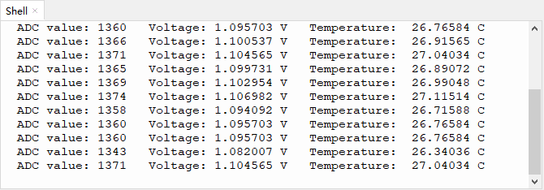

   img

项目二十五 薄膜压力传感器
~~~~~~~~~~~~~~~~~~~~~~~~~

1.1 项目介绍

在这个套件中，有一个Keyes
薄膜压力传感器，薄膜压力传感器是基于新型纳米压敏材料辅以舒适杨式模量的超薄薄膜衬底一次性贴片而成，兼具防水和压敏双重功能。

通过采集模块上S端模拟信号，判断压力大小。ADC值、DAC值和电压值越小，压力越大；并在“Shell”窗口上显示测试结果。

1.2 模块参数

工作电压 : DC 3.3 ~ 5V

电流 : 20 mA

最大功率 : 0.1W

量程 : 0-5KG

响应点 : 150g

重复性 : ＜±9.7%（60%负载）

一致性 : ±10%

耐久性 : ＞100万次

初始电阻 : 大于10MΩ(无负载)

响应时间 : ＜1ms

恢复时间 : ＜15ms

工作温度 ：-10°C ~ +50°C

输出信号 : 模拟信号

尺寸 ：32 x 23.8 x 7.4 mm

定位孔大小：直径为 4.8 mm

接口 ：间距为2.54 mm 3pin防反接口

1.3 模块原理图

.. figure:: ./media/251301.png
   :alt: img

   img

当传感器感知到外界压力时，传感器的电阻值发生变化。Keyes
薄膜压力传感器使用LM321运算放大器芯片将传感器感知到的压力变化的压力信号转换成相应变化强度的电信号输出。这样就可以通过检测电压信号变化得知压力变化情况。

1.4 实验组件

+----------------+----------------+-------------------+--------------+
| |image110|     | |image111|     | |image112|        | |image113|   |
+================+================+===================+==============+
| ESP32 Plus主板 | Keyes          | XH2.54-3P         | USB线 x1     |
| x1             | 薄膜压力传感器 | 转杜邦线母单线 x1 |              |
|                | x1             |                   |              |
+----------------+----------------+-------------------+--------------+

1.5 模块接线图

.. figure:: ./media/251501.png
   :alt: img

   img

1.6 在线运行代码

打开Thonny并单击\ |1303|\ ，然后单击“\ **此电脑**\ ”。

选中“\**D::raw-latex:`\代码*`\*”路径，打开代码文件’’\ **lesson_25_film
pressure.py**\ ”。

.. code:: python

   #导入引脚、ADC和DAC模块
   from machine import ADC,Pin,DAC
   import time

   #开启并配置ADC，量程为0-3.3V
   adc=ADC(Pin(34)) 
   adc.atten(ADC.ATTN_11DB)
   adc.width(ADC.WIDTH_12BIT)

   ### 每0.1秒读取一次ADC值，将ADC值转换为DAC值输出
   ### 并将这些数据打印到“Shell”
   try:
       while True:
           adcVal=adc.read()
           dacVal=adcVal//16
           voltage = adcVal / 4095.0 * 3.3
           print("ADC Val:",adcVal,"DACVal:",dacVal,"Voltage:",voltage,"V")
           time.sleep(0.1)
   except:
       pass

1.7 代码说明

此课程代码与二十一课代码类似，这里就不多做介绍了。

1.8 实验结果

为了使实验数据最精准，请将薄膜压力传感器尽量平放。按照接线图正确接好模块，用USB线连接到计算机上电，单击\ |1305|\ 来执行程序代码。

代码开始执行，“Shell”窗口打印出薄膜压力传感器的ADC值、DAC值和电压值。用手按压薄膜时，随着力量的增大，可以看到ADC值，DAC值和电压值逐渐变小。

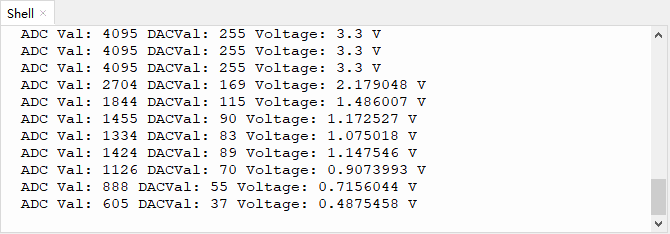

   img

项目二十六 火焰传感器
~~~~~~~~~~~~~~~~~~~~~

1.1 项目介绍

在这个套件中，有一个Keyes
火焰传感器，它对火焰光谱特别灵敏，且灵敏度可调。性能稳定，是救火机器人的必备部件。火焰传感器上有一个远红外火焰探头，起着非常重要的作用，它可以用作机器人的眼睛来寻找火源或足球。利用它可以制作灭火机器人、足球机器人等。

该传感器有两个信号输出端，分别可输出数字信号与模拟信号。实验中，我们分别读取模块传感器数字信号与模拟信号，将测试结果在”Shell”窗口上显示。

1.2 模块参数

工作电压 : DC 3.3 ~ 5V

电流 : 100 mA

最大功率 : 0.5 W

输出信号 ：模拟信号和数字信号

工作温度 ：-10°C ~ +50°C

尺寸 ：32 x 23.8 x 9.2 mm

定位孔大小：直径为 4.8 mm

接口 ：间距为2.54 mm 4pin防反接口

1.3 模块原理图

红外火焰传感器能够探测到波长在700纳米～1000纳米范围内的红外光，探测角度为60，其中红外光波长在880纳米附近时，其灵敏度达到最大。从电路原理图我们可以看到，上电后红色LED2先点亮，红色LED1处于熄灭状态，检测到火焰时，数字信号端D0输出低电平，红色LED1将点亮。红外火焰探头将外界红外光的强弱变化转化为电流的变化，通过A/D转换器反映为0～255范围内数值的变化。外界红外光越强，数值越小；红外光越弱，数值越大。

.. figure:: ./media/261301.png
   :alt: img

   img

1.4 实验组件

+----------------+----------------+-------------------+--------------+
| |image114|     | |image115|     | |image116|        | |image117|   |
+================+================+===================+==============+
| ESP32 Plus主板 | Keyes          | XH2.54-4P         | USB线 x1     |
| x1             | 火焰传感器 x1  | 转杜邦线母单线 x1 |              |
+----------------+----------------+-------------------+--------------+

1.5 模块接线图

.. figure:: ./media/261501.png
   :alt: img

   img

1.6 在线运行代码

打开Thonny并单击\ |1303|\ ，然后单击“\ **此电脑**\ ”。

选中“\**D::raw-latex:`\代码*`\*”路径，打开代码文件’’\ **lesson_26_Flame_sensor.py**\ ”。

.. code:: python

   ### 导入引脚、ADC和DAC模块
   from machine import ADC,Pin,DAC
   import time

   flame_D = Pin(13, Pin.IN)
   ### 开启并配置ADC，量程为0-3.3V
   adc=ADC(Pin(34))
   adc.atten(ADC.ATTN_11DB)
   adc.width(ADC.WIDTH_12BIT)

   ### 每0.1秒读取一次数字值和ADC值，将ADC值转换为DAC值和电压值输出
   ### 并将这些数据打印到“Shell”
   try:
       while True:
           digitalVal = flame_D.value() 
           adcVal=adc.read()
           dacVal=adcVal//16
           voltage = adcVal / 4095.0 * 3.3
           print("digitalVal:",digitalVal,"ADC Val:",adcVal,"DACVal:",dacVal,"Voltage:",voltage,"V")
           time.sleep(0.1)
   except:
       pass

1.7 代码说明

此课程代码与第二十一课代码类似，这里就不多做介绍了。

1.8 实验结果

按照接线图正确接好模块，用USB线连接到计算机上电，单击\ |1305|\ 来执行程序代码。

此时火焰传感器上的红色LED2点亮。旋转火焰传感器上的电位器，微调使传感器上红色LED1灯介于亮与不亮之间的\ **不亮**\ 状态。

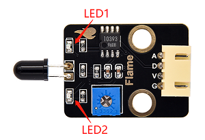

   img

“Shell”窗口打印出火焰传感器的digital值，ADC值，DAC值和电压值。当传感器检测到火焰时，红色LED1点亮，在”Shell”窗口中可以看到数字值由1变为0，ADC值，DAC值和电压值变小。

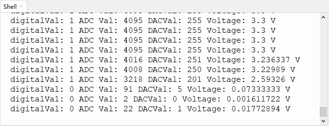

   img

项目二十七 MQ-2 烟雾传感器
~~~~~~~~~~~~~~~~~~~~~~~~~~

1.1 项目介绍

在这个套件中，有一个Keyes MQ-2模拟气体传感器，它主要用到了MQ-2
可燃气体、烟雾传感器元件。该元件所使用的气敏材料是在清新空气中电导率较低的二氧化锡(SnO2)。当传感器所处环境中存在可燃气体时，传感器的电导率随空气中可燃气体浓度的增加而增大。该传感器对液化气、丙烷、氢气的灵敏度高，对天然气和其它可燃蒸汽的检测也很理想。它可检测多种可燃性气体，是一款适合多种应用的低成本传感器。

实验中，我们读取传感器 A 端模拟值，和 D
端数字值，判断空气中气体的含量，以及它们是否超标。

1.2 模块参数

工作电压 : DC 3.3 ~ 5V

电流 : 100 mA

最大功率 : 0.5 W

输出信号 ：模拟信号和数字信号

工作温度 ：-10°C ~ +50°C

尺寸 ：47.6 x 23.8 x 17.9 mm

定位孔大小：直径为 4.8 mm

接口 ：间距为2.54 mm 4pin防反接口

1.3 模块原理图

当Keyes
MQ-2模拟气体传感器与烟雾接触时，晶粒间界处的势垒受到烟雾的浓度变化而变化，就会引起表面导电率的变化。利用这一点就可以获得这种烟雾存在的信息，烟雾的浓度越大，导电率越大，输出电阻越低，则输出的模拟信号就越大。

使用时，A 端读取对应气体的模拟值；D
端连接一个LM393芯片（电压比较器），我们可以通过电位器调节测量气体报警临界点，在
D 端输出数字值。当测量气体含量超过临界点时，D
端输出低电平；测量气体含量没超过临界点时，D 端输出高电平。

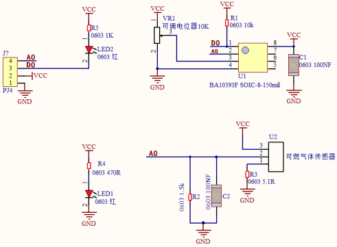

   img

1.4 实验组件

+----------------+--------------------+-------------------+--------------+
| |image118|     | |image119|         | |image120|        | |image121|   |
+================+====================+===================+==============+
| ESP32 Plus主板 | Keyes              | XH2.54-4P         | USB线 x1     |
| x1             | MQ-2模拟气体传感器 | 转杜邦线母单线 x1 |              |
|                | x1                 |                   |              |
+----------------+--------------------+-------------------+--------------+

1.5 模块接线图

.. figure:: media/271501.png
   :alt: 271501

   271501

1.6 在线运行代码

打开Thonny并单击\ |1303|\ ，然后单击“\ **此电脑**\ ”。

选中“\**D::raw-latex:`\代码*`\*”路径，打开代码文件’’\ **lesson_27_MQ-2.py**\ ”。

.. code:: python

   #导入引脚、ADC和DAC模块
   from machine import ADC,Pin,DAC
   import time

   mq2_D = Pin(13, Pin.IN)
   ### 开启并配置ADC，量程为0-3.3V
   adc=ADC(Pin(34)) 
   adc.atten(ADC.ATTN_11DB)
   adc.width(ADC.WIDTH_12BIT)

   ### 每0.1秒读取一次数字值和ADC值，将ADC值转换为DAC值和电压值输出
   ### 并将这些数据打印到“Shell”

   while True:
       digitalVal = mq2_D.value()
       adcVal=adc.read()
       dacVal=adcVal//16
       voltage = adcVal / 4095.0 * 3.3
       print("digitalVal:",digitalVal,"ADC Val:",adcVal,"DACVal:",dacVal,"Voltage:",voltage,"V", end = "  ")
       if digitalVal == 0:
           print("Exceeding")
       else:
           print("Normal")
       time.sleep(0.1)

1.7 代码说明

此课程代码与第二十一课代码类似，这里就不多做介绍了。

1.8 实验结果

按照接线图正确接好模块，用USB线连接到计算机上电，单击\ |1305|\ 来执行程序代码。

代码开始执行，旋转MQ-2模拟气体传感器上的电位器，微调使传感器上红色LED灯介于亮与不亮之间的\ **不亮**\ 状态。

“Shell”窗口打印出对应的数据和字符，当传感器检测到烟雾或可燃性气体时，红色LED点亮，在”Shell”窗口中可以看到数字值由1变为0，ADC值，DAC值和电压值变大。

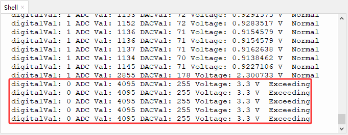

   271701

项目二十八 MQ-3 酒精传感器
~~~~~~~~~~~~~~~~~~~~~~~~~~

1.1 项目介绍

在这个套件中，有一个Keyes
MQ-3酒精传感器，它跟我们上一课学习的烟雾传感器原理几乎相同，只有检测器件不同。它到的是MQ-3
酒精、乙醇蒸汽传感器元件。该元件所使用的气敏材料是在清新空气中电导率较低的二氧化锡(SnO2)。当传感器所处环境中存在酒精蒸汽时，传感器的电导率随空气中酒精气体浓度的增加而增大。使用简单的电路即可将电导率的变化转换为与该气体浓度相对应的输出信号。

实验中，我们读取传感器A 端模拟值，和D
端数字值，判断空气中气体的含量，以及它们是否超标。

1.2 模块参数

工作电压 : DC 3.3 ~ 5V

电流 : 100 mA

最大功率 : 0.5 W

输出信号 ：模拟信号和数字信号

工作温度 ：-10°C ~ +50°C

尺寸 ：47.6 x 23.8 x 17.9 mm

定位孔大小：直径为 4.8 mm

接口 ：间距为2.54 mm 4pin防反接口

1.3 模块原理图

当Keyes
MQ-2模拟气体传感器与烟雾接触时，晶粒间界处的势垒受到烟雾的浓度变化而变化，就会引起表面导电率的变化。利用这一点就可以获得这种烟雾存在的信息，烟雾的浓度越大，导电率越大，输出电阻越低，则输出的模拟信号就越大。

使用时，A 端读取对应气体的模拟值；D
端连接一个LM393芯片（电压比较器），我们可以通过电位器调节测量气体报警临界点，在
D 端输出数字值。当测量气体含量超过临界点时，D
端输出低电平；测量气体含量没超过临界点时，D 端输出高电平。

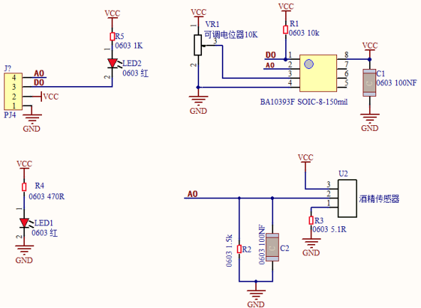

   img

1.4 实验组件

+----------------+----------------+-------------------+--------------+
| |image122|     | |image123|     | |image124|        | |image125|   |
+================+================+===================+==============+
| ESP32 Plus主板 | Keyes          | XH2.54-4P         | USB线 x1     |
| x1             | MQ-3酒精传感器 | 转杜邦线母单线 x1 |              |
|                | x1             |                   |              |
+----------------+----------------+-------------------+--------------+

1.5 模块接线图

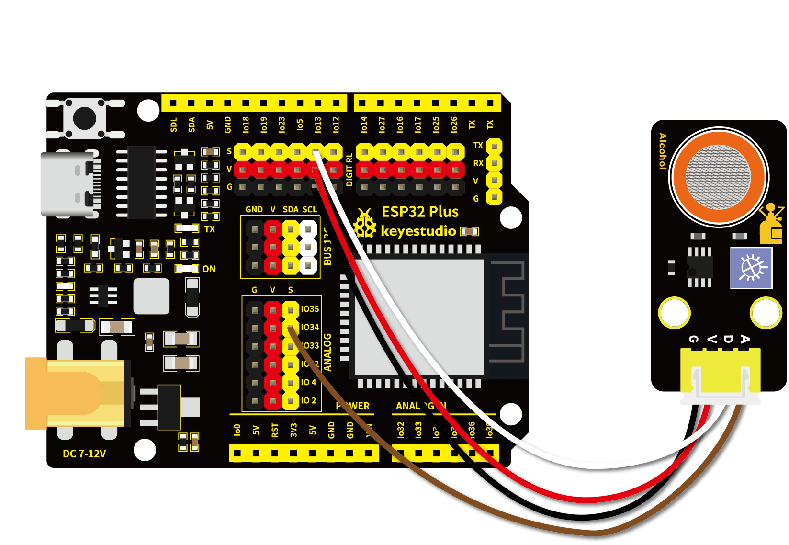

   281501

1.6 在线运行代码

打开Thonny并单击\ |1303|\ ，然后单击“\ **此电脑**\ ”。

选中“\**D::raw-latex:`\代码*`\*”路径，打开代码文件’’\ **lesson_28_MQ-3.py**\ ”。

.. code:: python

   ### 导入引脚、ADC和DAC模块
   from machine import ADC,Pin,DAC
   import time

   mq3_D = Pin(13, Pin.IN)
   ### 开启并配置ADC，量程为0-3.3V
   adc=ADC(Pin(34))
   adc.atten(ADC.ATTN_11DB) 
   adc.width(ADC.WIDTH_12BIT)

   ### 每0.1秒读取一次数字值和ADC值，将ADC值转换为DAC值和电压值输出;
   ### 并将这些数据打印到“Shell”
   while True:
       digitalVal = mq3_D.value()
       adcVal=adc.read()
       dacVal=adcVal//16
       voltage = adcVal / 4095.0 * 3.3
       print("digitalVal:",digitalVal,"ADC Val:",adcVal,"DACVal:",dacVal,"Voltage:",voltage,"V", end = "  ")
       if digitalVal == 0:
           print("Exceeding")
       else:
           print("Normal")
       time.sleep(0.1)

1.7 代码说明

此课程代码与第二十一课代码类似，这里就不多做介绍了。

1.8 实验结果

按照接线图正确接好模块，用USB线连接到计算机上电，单击\ |1305|\ 来执行程序代码。

旋转MQ-3酒精传感器上的电位器，微调使传感器上黄绿色LED灯介于亮与不亮之间的\ **不亮**\ 状态。

“Shell”窗口打印出对应的数据和字符，当传感器检测到酒精气体时，黄绿色LED点亮，在“Shell”窗口中可以看到数字值由1变为0，ADC值，DAC值和电压值变大。

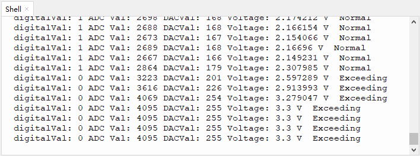

   281701

项目二十九 五路AD按键
~~~~~~~~~~~~~~~~~~~~~

1.1 项目介绍

第七课我们学习了单路按键模块，当按下按键时输出低电平，松开按键时输出高电平，只能读取到这两个数字信号。在这个套件中，有一个Keyes
五路AD按键模块，与单路按键模块原理不同，五路AD按键模块只占用一个模拟量端口，节省资源。模拟量采集，按下不同的按键输出不同的电压。

1.2 模块参数

工作电压 : DC 3.3 ~ 5V

电流 : 20 mA

最大功率 : 0.1 W

数据类型 : 模拟信号

工作温度 ：-10°C ~ +50°C

尺寸 ：47.6 x 23.8 x 9.3 mm

定位孔大小：直径为 4.8 mm

接口 ：间距为2.54 mm 3pin防反接口

1.3 模块原理图

.. figure:: ./media/291301.png
   :alt: img

   img

当没有按下按键时，输出到信号端S的OUT被R1拉低，此时我们读取到的是低电平0V；

当按下按键SW1时，输出到信号端S的OUT相当于直接连接到了VCC，此时我们读取到的是高电平3.3V；

当按下按键SW2时，我们读取到的信号OUT端电压就是R2与R1之间的电压，即VCC*R1/(R2+R1)，约为2.63V，模拟值约为3244；

当按下按键SW3时，我们读取到的信号OUT端电压就是R2+R3与R1之间的电压，即VCC*R1/(R3+R2+R1)，约为1.98V，模拟值约为2386；

当按下按键SW4时，我们读取到的信号OUT端电压就是R2+R3+R4与R1之间的电压，即VCC*R1/(R4+R3+R2+R1)，约为1.31V，模拟值约为1530；

当按下按键SW5时，我们读取到的信号OUT端电压就是R2+R3+R4+R5与R1之间的电压，即VCC*R1/(R5+R4+R3+R2+R1)，约为0.68V，模拟值约为707。

1.4 实验组件

+----------------+----------------+-------------------+--------------+
| |image126|     | |image127|     | |image128|        | |image129|   |
+================+================+===================+==============+
| ESP32 Plus主板 | Keyes          | XH2.54-3P         | USB线 x1     |
| x1             | 五路AD按键模块 | 转杜邦线母单线 x1 |              |
|                | x1             |                   |              |
+----------------+----------------+-------------------+--------------+

1.5 模块接线图

.. figure:: ./media/291501.png
   :alt: img

   img

1.6 在线运行代码

打开Thonny并单击\ |1303|\ ，然后单击“\ **此电脑**\ ”。

选中“\**D::raw-latex:`\代码*`\*”路径，打开代码文件’’\ **lesson_29_Five_AD_keys.py**\ ”。

.. code:: python

   ### 导入引脚和ADC模块
   from machine import ADC,Pin
   import time 

   ### 开启并配置ADC，量程为0-3.3V
   adc=ADC(Pin(34))
   adc.atten(ADC.ATTN_11DB)
   adc.width(ADC.WIDTH_12BIT)

   while True:
       adcvalue = adc.read() 
       print(adcvalue, end = '')
       if adcvalue <= 500:
           print("  no key  is pressed")
       elif adcvalue <= 1000:
           print("  SW5 is pressed")
       elif adcvalue <= 2000:
           print("  SW4 is pressed")
       elif adcvalue <= 3000:
           print("  SW3 is pressed")
       elif adcvalue <= 4000:
           print("  SW2 is pressed")
       else:
           print("  SW1 is pressed")
       time.sleep(0.1)

1.8 实验结果

按照接线图正确接好模块，用USB线连接到计算机上电，单击\ |1305|\ 来执行程序代码。代码开始执行，当按下按键时，“Shell”窗口打印出对应的信息。

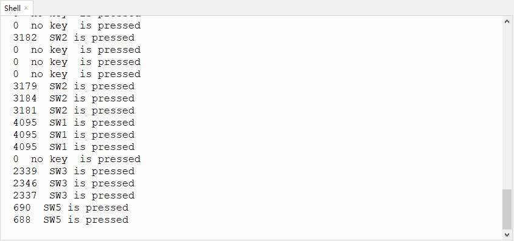

   img

1.7 代码说明

将读取到的模拟值赋给变量val，“Shell”窗口打印出val的值。

对读取到的模拟值进行判断，当模拟值低于500时，判断按键没有被按下；当模拟值处于500
~ 1000之间时，判断按键SW5被按下；当模拟值处于1000 ~
2000之间时，判断按键SW4被按下；当模拟值处于2000 ~
3000之间时，判断按键SW3被按下；当模拟值处于3000 ~
4000之间时，判断按键SW2被按下；当模拟值大于4000时，判断按键SW1被按下。

项目三十 摇杆模块
~~~~~~~~~~~~~~~~~

1.1 项目介绍

你看过游戏手柄吗？游戏手柄上有按键，还有摇杆。摇杆是什么工作原理呢？在我们这个套件中，就有一个Keyes
摇杆模块，它的主要元件是PS2手柄摇杆。控制时，我们需要将模块的X端口和Y端口连接至单片机的模拟口。B端口连接至单片机数字口，V端口接至单片机电源输出端（3.3-5V），GND接单片机GND。通过读取两个模拟值和一个数字口的高低电平情况，可以判断模块上摇杆的工作状态。

1.2 模块参数

工作电压 : DC 3.3 ~ 5V

电流 : 50 mA

最大功率 : 0.25 W

输出信号 : 信号端X、Y 模拟电压输出

信号端B : 数字电平输出

工作温度 ：-10°C ~ +50°C

控制信号 : 数字信号

尺寸 ：47.6 x 23.8 x 34.5 mm

定位孔大小：直径为 4.8 mm

接口 ：间距为2.54 mm 5pin防反接口

1.3 模块原理图

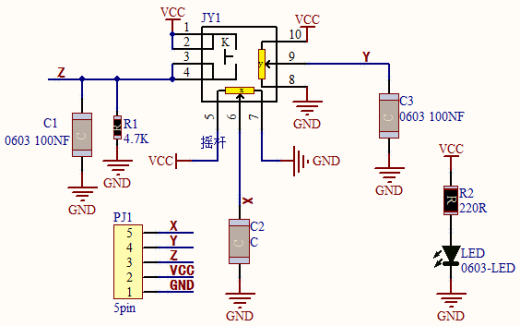

   img

其实它的原理非常简单，内部相当于两个可调电位器（左右和上下）和一个按键。按键没有按下时被R1下拉为低电平，按下时接通VCC即为高电平，与我们前面学习过的按键模块的电平值是相反的。摇动摇杆时内部的电位器就会根据摇杆的摇动调节，从而输出不同的电压，可以读取到模拟值。

1.4 实验组件

+----------------+----------------+-------------------+--------------+
| |image130|     | |image131|     | |image132|        | |image133|   |
+================+================+===================+==============+
| ESP32 Plus主板 | Keyes 摇杆模块 | XH2.54-5P         | USB线 x1     |
| x1             | x1             | 转杜邦线母单线 x1 |              |
+----------------+----------------+-------------------+--------------+

1.5 模块接线图

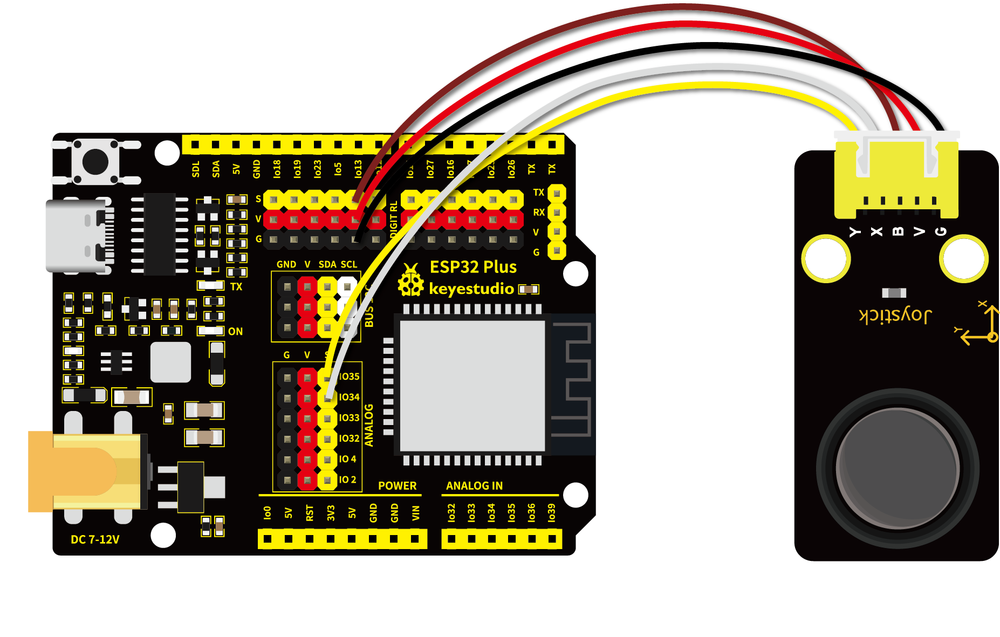

   img

1.6 在线运行代码

打开Thonny并单击\ |1303|\ ，然后单击“\ **此电脑**\ ”。

选中“\**D::raw-latex:`\代码*`\*”路径，打开代码文件’’\ **lesson_30_joystick.py**\ ”。

.. code:: python

   from machine import Pin, ADC
   import time
   #初始化摇杆模块(ADC功能)
   rocker_x=ADC(Pin(34)) 
   rocker_y=ADC(Pin(35))
   button_z=Pin(13,Pin.IN,Pin.PULL_UP)

   ### 设置两个ADC通道的电压采集范围为0-3.3V，
   ### 并且采集的数据宽度为0-4095
   rocker_x.atten(ADC.ATTN_11DB)
   rocker_y.atten(ADC.ATTN_11DB)
   rocker_x.width(ADC.WIDTH_12BIT)
   rocker_y.width(ADC.WIDTH_12BIT)
    
   ### 在代码中，将Z_Pin配置为上拉输入模式
   ### 在loop()中，使用Read()读取X轴和Y轴的值
   ### 并使用value()读取Z轴的值，然后显示它们
   while True:
       print("X,Y,Z:",rocker_x.read(),",",rocker_y.read(),",",button_z.value())
       time.sleep(0.5)

1.7 代码说明

+-------------------------------------+-------------------------------------------------------+
| 代码                                | 说明                                                  |
+=====================================+=======================================================+
| button_z=Pin(13,Pin.IN,Pin.PULL_UP) | 将引脚设置为输入上拉模式。                            |
+-------------------------------------+-------------------------------------------------------+
| rocker_x.read()                     | 读取X轴ADC值（0~4095，中间值约2048表示摇杆居中）。    |
+-------------------------------------+-------------------------------------------------------+
| rocker_y.read()                     | 读取Y轴ADC值。                                        |
+-------------------------------------+-------------------------------------------------------+
| button_z.value()                    | 读取Z轴按钮状态（\ ``1``\ =未按下，\ ``0``\ =按下）。 |
+-------------------------------------+-------------------------------------------------------+

1.8 实验结果

按照接线图正确接好模块，用USB线连接到计算机上电，单击\ |1305|\ 来执行程序代码。代码开始执行，“Shell”窗口将打印出当前摇杆X轴和Y轴对应的模拟值以及Z轴对应的数字值，移动摇杆或按下它将改变“Shell”窗口中的模拟值和数字值。当按下摇杆时，Z值为1；未按下摇杆时，Z值为0。X值从左到右由0增长到4095。Y值从下到上由0增长到4095。

.. figure:: ./media/301701.png
   :alt: img

   img

在X轴上移动摇杆，使数据从小到大。

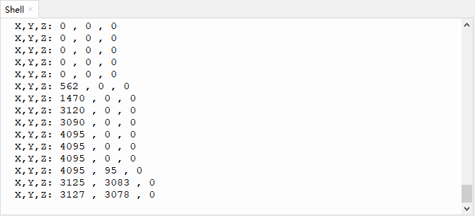

   img

在Y轴上移动摇杆，使数据从小到大。

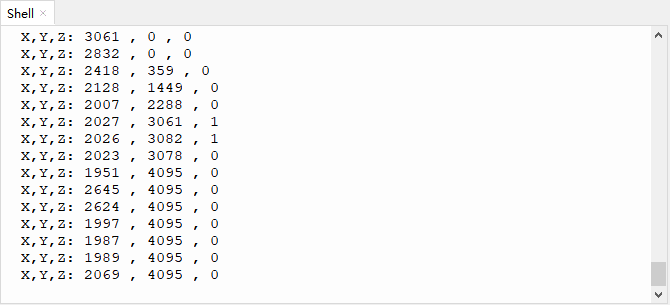

   img

按下摇杆。

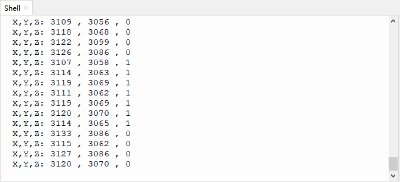

   img

项目三十一 继电器模块
~~~~~~~~~~~~~~~~~~~~~

1.1 项目介绍

在日常生活中，一般使用交流电来驱动电气设备，有时我们会用开关来控制电器。如果将开关直接连接到交流电路上，一旦发生漏电，人就有危险。从安全的角度考虑，我们特别设计了这款具有NO（常开）端和NC（常闭）端的继电器模块。

1.2 模块参数

工作电压 : DC 5V

电流 : 50 mA

最大功率 : 0.25 W

输入信号 : 数字信号

触电电流 : 小于 3 A

工作温度 ：-10°C ~ +50°C

控制信号 : 数字信号

尺寸 ：47.6 x 23.8 x 19 mm

定位孔大小：直径为 4.8 mm

接口 ：间距为2.54 mm 3pin防反接口

1.3 模块原理图

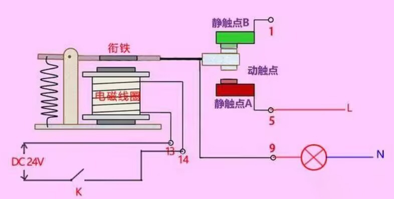

   img

一个继电器拥有一个动触点以及两个静触点A和B。

当开关K断开时，继电器线路无电流通过，此时动触点与静触点B相接触，上半部分的电路导通。静触点B被称为常闭触点（NC）。常闭——NC（normal
close）通常情况下是关合状态，即线圈未得电的情况下闭合的。

当开关K闭合时，继电器电路通过电流产生磁力，此时动触点与静触点A相接触，下半部分电路导通。静触点A被称为常开触点（NO）。常开——NO（normal
open）通常情况下是断开状态，即线圈未得电的情况下断开的。

而动触点也被称为公共触点（COM）。

继电器简单来说就是一个开关，VCC表示电源正极、GND表示电源负极、IN表示信号输入脚，COM表示公共端，NC（normal
close）表示常闭端，NO(normal open)表示常开端。

.. figure:: ./media/311302.png
   :alt: img

   img

继电器能兼容多种单片机控制板，是用小电流去控制大电流运作的一种“自动开关”。它可以让单片机控制板驱动3A以下负载，如LED灯带、直流马达、微型水泵、电磁阀可插拔式接口设计，方便使用。

1.4 实验组件

+----------------+------------------+-------------------+--------------+
| |image134|     | |image135|       | |image136|        | |image137|   |
+================+==================+===================+==============+
| ESP32 Plus主板 | Keyes            | XH2.54-3P         | USB线 x1     |
| x1             | 单路5V继电器模块 | 转杜邦线母单线 x1 |              |
|                | x1               |                   |              |
+----------------+------------------+-------------------+--------------+

1.5 模块接线图

.. figure:: ./media/311501.png
   :alt: img

   img

1.6 在线运行代码

打开Thonny并单击\ |1303|\ ，然后单击“\ **此电脑**\ ”。

选中“\**D::raw-latex:`\代码*`\*”路径，打开代码文件’’\ **lesson_31_Relay.py**\ ”。

.. code:: python

   from machine import Pin
   import time

   ### 创建继电器从引脚13，设置引脚13输出
   relay = Pin(13, Pin.OUT)
    
   ### 继电器断开，继电器上COM和NO连接，COM和NC断开
   def relay_on():
       relay(1)
    
   ### 继电器闭合，继电器上的COM和NO断开，COM和NC连接
   def relay_off():
       relay(0)
    
   ### 循环，继电器开一秒关一秒
   while True:
       relay_on()
       time.sleep(1)
       relay_off()
       time.sleep(1)

1.7 代码说明

此课程代码与第二课代码类似，这里就不多做介绍了。

1.8 实验结果

按照接线图正确接好模块，用USB线连接到计算机上电，单击\ |1305|\ 来执行程序代码。

继电器将循环开与关，开启1秒，关闭1秒。同时可以听到继电器开与关的声音，还可以看到继电器上的指示灯指示状态的变化。

项目三十二 SK6812 RGB
~~~~~~~~~~~~~~~~~~~~~

1.1 项目介绍

前面学习了插件RGB模块，利用PWM信号对模块的三个引脚进行调色。我们这个套件中，还有一个Keyes
6812 RGB模块。SK6812 RGB
模块驱动原理与插件RGB模块的驱动原理不相同，只需要一个引脚控制。这是一个集控制电路与发光电路于一体的智能外控LED光源。每个LED原件其外型与一个5050LED灯珠相同，每个元件即为一个像素点，我们这个模块上有四个灯珠即四个像素点。

1.2 模块参数

工作电压 : DC 3.3 ~ 5V

最大功率 : 1W

光源 : SMD 5050 RGB

IC型号 : 4颗/WS2811

灰度等级 : 256级

发光角度 : 180°

发光颜色 : 可以通过控制器调为白，红，黄，蓝，绿,等

工作温度 ：-10°C ~ +50°C

尺寸 ：32 x 23.8 x 7.4 mm

定位孔大小：直径为 4.8 mm

接口 ：间距为2.54 mm 3pin防反接口

1.3 模块原理图

.. figure:: ./media/321301.png
   :alt: img

   img

从原理图中我们可以看出，这四个像素点灯珠串联。其实不论多少个灯珠串联，我们都可以用一个引脚控制其中任意一个灯让它显示任意一种颜色。像素点内部包含了智能数字接口数据锁存信号整形放大驱动电路，还包含有高精度的内部振荡器和12V高压可编程定电流控制部分，有效保证了像素点光的颜色高度一致。

数据协议采用单线归零码的通讯方式，像素点在上电复位以后，S端接受从控制器传输过来的数据，首先送过来的24bit数据被第一个像素点提取后，送到像素点内部的数据锁存器。这个6812RGB通讯协议与驱动已经在底层封装好了，我们直接调用函数的接口就可以使用。

1.4 实验组件

+----------------+----------------+-------------------+--------------+
| |image138|     | |image139|     | |image140|        | |image141|   |
+================+================+===================+==============+
| ESP32 Plus主板 | Keyes 6812     | XH2.54-3P         | USB线 x1     |
| x1             | RGB模块 x1     | 转杜邦线母单线 x1 |              |
+----------------+----------------+-------------------+--------------+

1.5 模块接线图

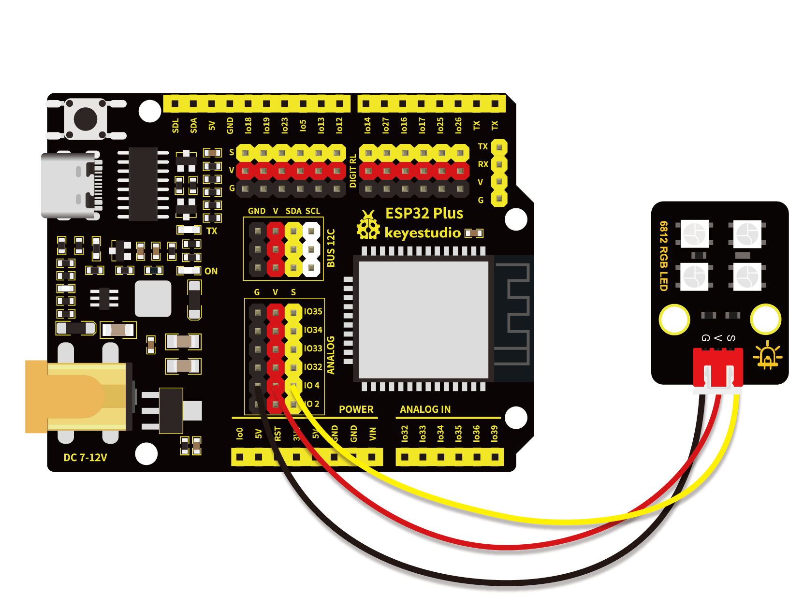

   img

1.6 在线运行代码

打开Thonny并单击\ |1303|\ ，然后单击“\ **此电脑**\ ”。

选中“\**D::raw-latex:`\代码*`\*”路径，打开代码文件’’\ **lesson_32_Sk6812_RGB.py**\ ”。

.. code:: python

   #导入Pin, neopiexl和time模块
   from machine import Pin
   import neopixel
   import time

   #定义连接到新像素的引脚和led的数量
   pin = Pin(4, Pin.OUT)
   np = neopixel.NeoPixel(pin, 4) 

   #亮度:0 - 255
   brightness=100                                
   colors=[[brightness,0,0],                    #红
           [0,brightness,0],                    #绿
           [0,0,brightness],                    #蓝
           [brightness,brightness,brightness],  #白
           [0,0,0]]                             #关闭

   #嵌套两个for循环，使模块反复显示红、绿、蓝、白、OFF五种状态    
   while True:
       for i in range(0,5):
           for j in range(0,4):
               np[j]=colors[i]
               np.write()
               time.sleep_ms(50)
           time.sleep_ms(500)
       time.sleep_ms(500)

1.7 代码说明

+---------------------------+------------------------------------------------+
| 代码                      | 说明                                           |
+===========================+================================================+
| pin = Pin(4, Pin.OUT)     | 定义引脚号。                                   |
+---------------------------+------------------------------------------------+
| np =                      | 灯珠的数量，板子上灯珠为4颗，所以这里设置为4。 |
| neopixel.NeoPixel(pin, 4) |                                                |
+---------------------------+------------------------------------------------+
| brightness=100            | 亮度设置，255最亮。                            |
+---------------------------+------------------------------------------------+

1.8 实验结果

按照接线图正确接好模块，用USB线连接到计算机上电，单击\ |1305|\ 来执行程序代码。代码开始执行，可以看到模块上的4个RGB
LED一个接一个地填充红色、绿色、蓝色、白色。

.. figure:: ./media/321701.png
   :alt: img

   img

.. figure:: ./media/321702.png
   :alt: img

   img

项目三十三 旋转编码器模块计数
~~~~~~~~~~~~~~~~~~~~~~~~~~~~~

1.1 项目介绍

在这个套件中，有一个Keyes
旋转编码器模块，也叫开关编码器、旋转编码器。此款编码器有20脉冲20定位点、15脉冲30定位点两种。编码器主要用于汽车电子、多媒体音响、仪器仪表、家用电器、智能家居、计算机周边、医疗器械等领域。主要用于频率调节、亮度调节、温度调节、音量调节的参数控制等。

1.2 模块参数

工作电压 : DC 5V

电流 : 20 mA

最大功率 : 0.1 W

工作温度 ：-10°C ~ +50°C

控制信号 : 数字信号

尺寸 ：32 x 23.8 x 30.6 mm

定位孔大小：直径为 4.8 mm

接口 ：间距为2.54 mm 5pin防反接口

1.3 模块原理图

.. figure:: ./media/331301.png
   :alt: img

   img

增量式编码器是将位移转换成周期性的电信号，再把这个电信号转变成计数脉冲，用脉冲的个数表明位移的巨细。Keyes
旋转编码器模块采用的是20脉冲旋转编码器元件，它可以通过旋转计数正方向和反方向转动过程中输出脉冲的次数，这种转动计数是没有限制的，复位到初始状态，即从0开始计数。

旋转编码器提供两种交互方式： - **按钮**
单击旋钮以按下按钮。按下时，按钮将 SW 引脚与 GND
引脚连接，也就是SW引脚的电平为低电平。

- **旋转** 每次旋转旋钮时，会在 DT 和 CLK 引脚上产生一个 LOW 信号。

  - 顺时针旋转会导致 CLK 引脚首先变低，然后 DT 引脚也变低。

  - 逆时针旋转会导致 DT 引脚先变低，然后 CLK 引脚变低。

  两个引脚将在几毫秒内返回高电平。如下图所示：

  .. figure:: ./media/331302.png
     :alt: img

     img

1.4 实验组件

+----------------+----------------+-------------------+--------------+
| |image142|     | |image143|     | |image144|        | |image145|   |
+================+================+===================+==============+
| ESP32 Plus主板 | Keyes          | XH2.54-5P         | USB线 x1     |
| x1             | 旋转编码器模块 | 转杜邦线母单线 x1 |              |
|                | x1             |                   |              |
+----------------+----------------+-------------------+--------------+

1.5 模块接线图

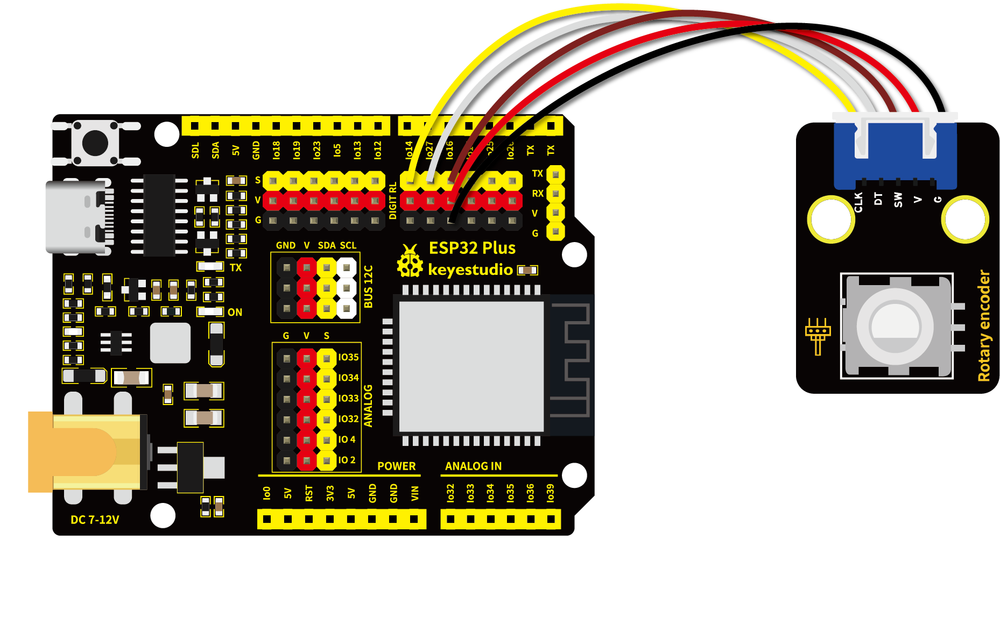

   img

1.6 在线运行代码

上传代码前先添加库。打开Thonny，在文件管理框单击“\ **此电脑**\ ”，双击“\ **（D:）**\ ”，然后双击展开“\ **代码**\ ”文件夹。展开“\ **33
Rotary encoder
counting**\ ”文件夹，右键单击“\ **rotary.py**\ ”，选择“\ **上传到/**\ ”，等待被上传到ESP32。然后继续右键单击“\ **rotary_irq_rp2.py**\ ”，选择“\ **上传到/**\ ”，等待被上传到ESP32。

上传完成后双击打开代码文件“\ **lesson_33_Rotary_encoder_counting.py**\ ”。

.. code:: python

   import time
   from rotary_irq_rp2 import RotaryIRQ
   from machine import Pin

   SW=Pin(16,Pin.IN,Pin.PULL_UP)  
   r = RotaryIRQ(pin_num_clk=14,
                 pin_num_dt=27,
                 min_val=0,
                 reverse=False,
                 range_mode=RotaryIRQ.RANGE_UNBOUNDED)
   val_old = r.value()
   while True:
       try:
           val_new = r.value()
           if SW.value()==0 and n==0:
               print("Button Pressed")
               print("Selected Number is : ",val_new)
               n=1
               while SW.value()==0:
                   continue
           n=0
           if val_old != val_new:
               val_old = val_new
               print('result =', val_new)
           time.sleep_ms(50)
       except KeyboardInterrupt:
           break

1.7 代码说明

+--------------+-----------------------------------------------------------------------+
| 代码         | 说明                                                                  |
+==============+=======================================================================+
| try:…except… | python语言异常捕捉处理语句，try执行代码，except发生异常时执行的代码。 |
+--------------+-----------------------------------------------------------------------+
| r.value()    | 返回编码器的值。                                                      |
+--------------+-----------------------------------------------------------------------+

1.8 实验结果

按照接线图正确接好模块，用USB线连接到计算机上电，单击\ |1305|\ 来执行程序代码。代码开始执行，顺时针旋转编码器，“Shell”窗口打印出来的数据\ **减小**\ ；逆时针旋转编码器，“Shell”窗口打印出来的数据\ **增大**\ ；按下编码器中间按键，“Shell”窗口打印“\ **Button
Pressed** **Selected Number is :（当前值)**\ ”。

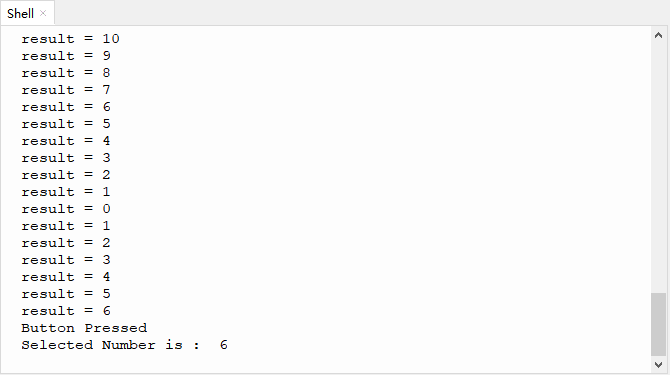

   img

项目三十四 舵机的控制原理
~~~~~~~~~~~~~~~~~~~~~~~~~

1.1 项目介绍

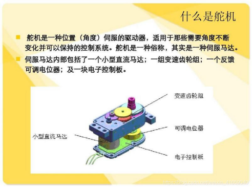

   img

舵机是一种位置伺服的驱动器，主要是由外壳、电路板、无核心马达、齿轮与位置检测器所构成。舵机有很多规格，但所有的舵机都有外接三根线。由于舵机品牌不同，颜色也会有所差异，我们实验用到的这款舵机分别用棕、红、橙三种颜色进行区分，棕色为接地线，红色为电源正极，橙色为信号线。

.. figure:: ./media/341102.png
   :alt: img

   img

舵机分为360度舵机、180度舵机和90度舵机，我们实验用到的这款舵机为90度舵机，但是它转动的角度范围最大接近180度，所以我们也可把它当做180度舵机使用，控制原理都是一样的。

.. figure:: ./media/341103.png
   :alt: img

   img

1.2 模块参数

工作电压 : DC 3.3 ~ 5V

工作温度 ：-10°C ~ +50°C

尺寸 ：32.25 x 12.25 x 30.42 mm

接口 ：间距为2.54 mm 3pin接口

1.3 模块原理图

.. figure:: ./media/341301.png
   :alt: img

   img

舵机的控制信号是周期为20ms （50Hz）的PWM（脉冲宽度调制）信号。

舵机的转动的角度是通过调节PWM信号的占空比来实现的，一般在 0.5ms ~ 2.5ms
的范围内去控制，总间隔为 2ms，相对应舵盘的位置为0度 ~
180度，呈线性变化。当脉冲宽度为 1.5ms 时，舵机旋转至中间角度，大于 1.5ms
时舵机旋转角度增大，小于 1.5ms 时舵机旋转角度减小。

也就是说，舵机的控制需要单片机产生一个周期为20ms的脉冲信号，以0.5ms到2.5ms的高电平来控制舵机转动的角度。具体脉冲参数下图所示：

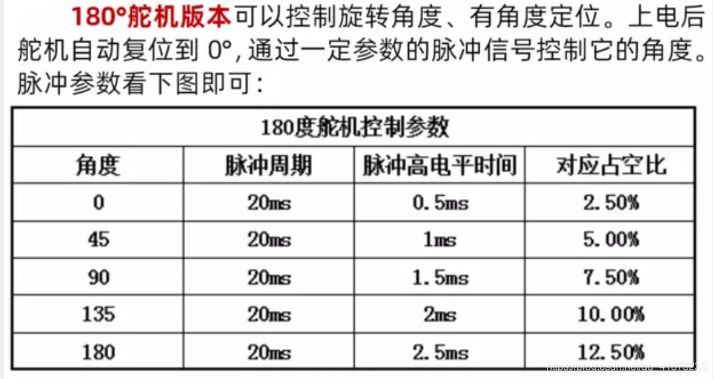

   img

注意，由于舵机品牌不同，对于同一信号，不同品牌的舵机旋转的角度也会有所不同。

1.4 在线运行组件

+-------------------------+---------------------+----------------------+
| |image146|              | |image147|          | |image148|           |
+=========================+=====================+======================+
| ESP32 Plus主板 x1       | 9G 180度数字舵机 x1 | USB线 x1             |
+-------------------------+---------------------+----------------------+

1.5 实验

1.5.1 实验①：

（1）实验接线图

.. figure:: ./media/341501.png
   :alt: img

   img

（2）在线运行代码

打开Thonny并单击\ |1303|\ ，然后单击“\ **此电脑**\ ”。

选中“\**D::raw-latex:`\代码*`\*”路径，打开代码文件’’\ **lesson_34_Servo_test1.py**\ ”。

.. code:: python

   from machine import Pin, PWM
   import time
   pwm = PWM(Pin(4))  
   pwm.freq(50)

   '''
   Duty cycle corresponding to the Angle
   0°----2.5%----25
   45°----5%----51.2
   90°----7.5%----77
   135°----10%----102.4
   180°----12.5%----128
   '''
   angle_0 = 25
   angle_90 = 77
   angle_180 = 128

   while True:
       pwm.duty(angle_0)
       time.sleep(1)
       pwm.duty(angle_90)
       time.sleep(1)
       pwm.duty(angle_180)
       time.sleep(1)

（3）实验结果

按照接线图正确接好模块，用USB线连接到计算机上电，单击\ |1305|\ 来执行程序代码。代码开始执行，舵机由0度转到90度，停顿1秒；再转到180度，停顿1秒；然后回到0度，停顿1秒，循环转动。

单击\ |1311|\ 或按Ctrl+C退出程序。

1.5.2 实验②：

（1）实验接线图

.. figure:: ./media/341501.png
   :alt: img

   img

（2）在线运行代码

打开Thonny并单击\ |1303|\ ，然后单击“\ **此电脑**\ ”。

选中“\**D::raw-latex:`\代码*`\*”路径，打开代码文件’’\ **lesson_34_Servo_test2.py**\ ”。

.. code:: python

   from utime import sleep
   from machine import Pin
   from machine import PWM

   pwm = PWM(Pin(4))#舵机销连接GP4
   pwm.freq(50)#20ms周期，所以频率为50Hz
   '''
   Duty cycle corresponding to the Angle
   0°----2.5%----25
   45°----5%----51.2
   90°----7.5%----77
   135°----10%----102.4
   180°----12.5%----128
   '''
   ### 设置伺服旋转角度
   def setServoCycle (position):
       pwm.duty(position)
       sleep(0.01)

   ### 将旋转角度转换为占空比
   def convert(x, i_m, i_M, o_m, o_M):
       return max(min(o_M, (x - i_m) * (o_M - o_m) // (i_M - i_m) + o_m), o_m)

   while True:
       for degree in range(0, 180, 1):#伺服电机从0到180
           pos = convert(degree, 0, 180, 20, 150)
           setServoCycle(pos)

       for degree in range(180, 0, -1):#伺服电机从180到0
           pos = convert(degree, 0, 180, 20, 150)
           setServoCycle(pos)

（3）实验结果

按照接线图正确接好模块，用USB线连接到计算机上电，单击\ |1305|\ 来执行程序代码。代码开始执行，舵机在0度
~ 180度之间来回转动，每15ms转动一度。

1.6 代码说明

+------------------------+----------------------------------------------------------------------------------------------------------------------------------------------------------------------------------------------------+
| 代码                   | 说明                                                                                                                                                                                               |
+========================+====================================================================================================================================================================================================+
| pwm.duty(angle_0)      | 根据信号脉宽的角度换算成占空比，公式为：2.5+角度/180\ *10 ，以ESP32的 PWM 引脚解析度为 2^10 = 1024，换算成 0 度时，其占空比值为 1024* 2.5% = 25.6 ，当角度为180度时，其占空比值为1024 \* 12.5% =   |
|                        | 128，这两个值会跟程序有关，考虑到误差及转动角度，将占空比定在10与150 之间，可以让舵机顺利转动0~180度。                                                                                             |
+------------------------+----------------------------------------------------------------------------------------------------------------------------------------------------------------------------------------------------+
| convert(degree, 0,     | 传进来一个需要转动的角度值为degree，然后这个值的范围是0度到180度，我们要映射的占空比范围为20到150，即把0到180转到了10到150然后被返回了，返回的数据类型为整型，余数会被截断，不进行四舍五入或平均。 |
| 180, 20, 150)          |                                                                                                                                                                                                    |
+------------------------+----------------------------------------------------------------------------------------------------------------------------------------------------------------------------------------------------+

项目三十五 超声波传感器的原理
~~~~~~~~~~~~~~~~~~~~~~~~~~~~~

1.1 项目介绍

蝙蝠和某些海洋动物都能够利用高频率的声音进行回声定位或信息交流。它们能通过口腔或鼻腔把从喉部产生的超声波发射出去，利用折回的声波来定向，并判定附近物体的位置、大小以及是否在移动。超声波是一种频率高于20000赫兹的声波，它的方向性好，穿透能力强，易于获得较集中的声能，在水中传播距离远，可用于测距、测速、清洗、焊接、碎石、杀菌消毒等。在医学、军事、工业、农业上有很多的应用。超声波因其频率下限大于人的听觉上限而得名。科学家们将每秒钟振动的次数称为声音的频率，它的单位是赫兹(Hz)。

在这个套件中，有一个HC-SR04超声波传感器，它可以发送出一种频率很高的人类无法听到的超声波信号，这些超声波的信号碰到障碍物，就会立刻反射回来。在接收到返回的信息之后，根据发射信号和接收信号的时间差，计算出传感器和障碍物的详细距离，和蝙蝠飞行的原理一样。

1.2 模块参数

超声波传感器工作电压 : DC 5V

超声波传感器工作电流 : 15 mA

超声波传感器工作频率 : 40 Hz

超声波传感器射程范围 : 2 cm ~ 4 m

超声波传感器测量角度 : <= 15度

超声波传感器输入触发信号 : 10 uS 的TTL脉冲

超声波传感器输出回响信号 : 输出TTL电平信号与射程成正比

工作温度 ：-10°C ~ +50°C

超声波传感器尺寸 ：45.5 x 26.7 x 17.6 mm

超声波转接板模块尺寸 ：32 x 23.8 x 11.85 mm

超声波转接板模块定位孔大小：直径为 4.8 mm

超声波转接板模块接口 ：间距为2.54 mm 4pin防反接口

1.3 模块原理图

最常用的超声测距的方法是回声探测法。当有脉冲电压触发时（单片机给Trig引脚发送高电平），超声波发射器探头里的晶片就会振动，继而产生超声波。在超声波发射时刻的同时计数器开始计时，超声波在空气中传播，途中碰到障碍物面阻挡就立即反射回来（Echo引脚发送高电平信号给单片机），超声波接收器收到反射回的超声波就立即停止计时。

超声波是一种声波，其声速V与温度有关。一般情况下超声波在空气中的传播速度为340m/s，根据计时器记录的时间t，就可以计算出超声波探头发射点距障碍物面的距离s，即：s=340t/2
。

.. figure:: ./media/351301.png
   :alt: img

   img

HC-SR04超声波测距模块可提供范围为2厘米至4米的非接触式距离感测功能，测距精度可达高到3mm。超声波传感器包括超声波发射器、超声波接收器与控制电路。其基本工作原理：

(1)采用IO口Trig触发测距，给至少10us的高电平信号;

(2)模块自动发送8个40khz的方波，自动检测是否有信号返回；

(3)有信号返回，通过IO口Echo输出一个高电平，高电平持续的时间就是超声波从发射到返回的时间。

.. figure:: ./media/351302.png
   :alt: img

   img

1.4 实验组件

+------------+----------------+---------------+----------------+------------+
| |image149| | |image150|     | |image151|    | |image152|     | |image153| |
+============+================+===============+================+============+
| ESP32      | Keyes          | HC-SR04       | XH2.54-4P      | USB线 x1   |
| Plus主板   | 超声波转接模块 | 超声波传感器  | 转杜邦线母单线 |            |
| x1         | x1             | x1            | x1             |            |
+------------+----------------+---------------+----------------+------------+

1.5 模块接线图

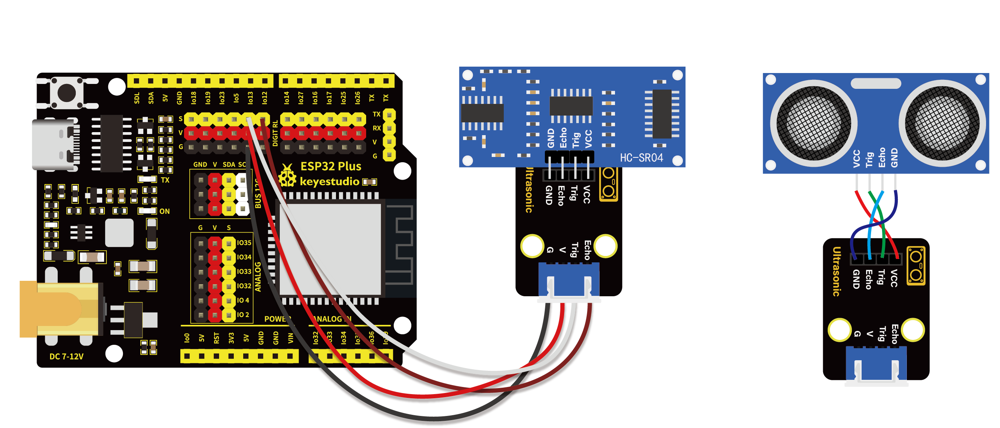

   img

1.6 在线运行代码

打开Thonny并单击\ |1303|\ ，然后单击“\ **此电脑**\ ”。

选中“\**D::raw-latex:`\代码*`\*”路径，打开代码文件’’\ **lesson_35_ultrasonic.py**\ ”。

.. code:: python

   from machine import Pin
   import time

   # 定义超声波测距模块的控制引脚
   Trig = Pin(13, Pin.OUT, 0) 
   Echo = Pin(12, Pin.IN, 0)

   distance = 0 # 将初始距离定义为0
   soundVelocity = 340 # 声速

   # getDistance()函数用于驱动超声波模块测量距离
   def getDistance():
       # 发送10μs触发脉冲
       Trig.value(1)
       time.sleep_us(10)
       Trig.value(0)
       
       # 等待Echo引脚拉高（超声波发射）
       while not Echo.value():
           pass
       pingStart = time.ticks_us()  # 记录开始时间
       
       # 等待Echo引脚拉低（回波接收）
       while Echo.value():
           pass
       pingStop = time.ticks_us()  # 记录结束时间
       
       # 计算时间差（除以2得到单向时间），转换为距离（厘米）
       pingTime = time.ticks_diff(pingStop, pingStart) // 2
       distance = int(soundVelocity * pingTime // 10000)  # 340×t/(2×10^-4)
       return distance

   # 延时2秒，等待超声波模块稳定
   # 打印每500毫秒从超声波模块获得的数据
   time.sleep(2)
   while True:
       time.sleep_ms(500)
       distance = getDistance()
       print("Distance: ", distance, "cm")

1.7 代码说明

+-------------------------+------------------------------------------------+
| 代码                    | 说明                                           |
+=========================+================================================+
| Trig = Pin(13, Pin.OUT, | 控制超声波模块发射声波（需10μs高电平脉冲）。   |
| 0)                      |                                                |
+-------------------------+------------------------------------------------+
| Echo = Pin(12, Pin.IN,  | 检测模块返回的高电平脉冲宽度（与距离成正比）。 |
| 0)                      |                                                |
+-------------------------+------------------------------------------------+
| time.ticks_us()         | 高精度微秒计时，避免溢出。                     |
+-------------------------+------------------------------------------------+

1.8 实验结果

按照接线图正确接好模块，用USB线连接到计算机上电，单击\ |1305|\ 来执行程序代码。代码开始执行，放置障碍物在超声波传感器探头前感应，“Shell”窗口打印出超声波传感器与障碍物之间的距离值。

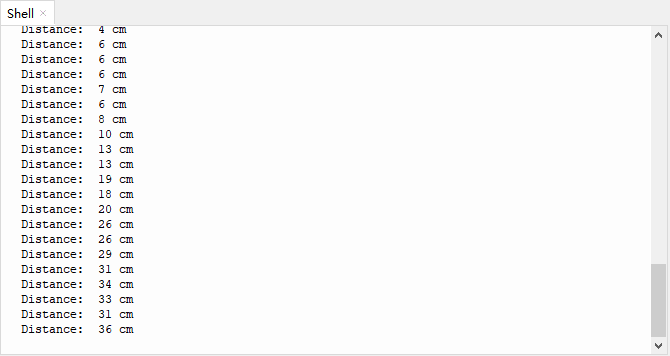

   img

项目三十六 红外遥控与接收
~~~~~~~~~~~~~~~~~~~~~~~~~

1.1 项目介绍

红外线遥控是目前使用最广泛的一种通信和遥控手段。因红外线遥控装置具有体积小、功耗低、功能强、成本低等特点，录音机、音响设备、空凋机以及玩具等其它小型电器装置上纷纷采用红外线遥控。红外遥控的发射电路是采用红外发光二极管发出经过调制的红外光波；红外接收电路由红外接收二极管、三极管或硅光电池组成，它们将红外发射器发射的红外光转换为相应的电信号，再送到后置放大器。

Keyes
红外接收模块选择的是VS1838B红外接收传感器元件，该元件是集接收、放大、解调一体的器件，内部IC就已经完成了解调，输出的就是数字信号。它可接收标准38KHz调制的遥控器信号。

1.2 模块参数

工作电压 : DC 3.3 ~ 5V

电流 : 50 mA

最大功率 : 0.25 W

工作温度 ：-10°C ~ +50°C

控制信号 : 数字信号

尺寸 ：32 x 23.8 x 10.8 mm

定位孔大小：直径为 4.8 mm

接口 ：间距为2.54 mm 3pin防反接口

1.3 模块原理图

.. figure:: ./media/361301.png
   :alt: img

   img

红外遥控系统的主要部分为调制、发射和接收。红外遥控是以调制的方式发射数据，就是把数据和一定频率的载波进行“与”操作，这样既可以提高发射效率又可以降低电源功耗。调制载波频率一般在30khz到60khz之间，大多数使用的是38kHz，占空比1/3的方波。红外接收的信号端加上了4.7K的上拉电阻R3，工作时，首先等待检测低电平，接收到信号后，信号端立即由高电平转为低电平。

1.4 实验组件

+------------+--------------+----------------+----------------+------------+
| |image154| | |image155|   | |image156|     | |image157|     | |image158| |
+============+==============+================+================+============+
| ESP32      | Keyes        | Keyes 遥控器   | XH2.54-3P      | USB线 x1   |
| Plus主板   | 红外接收模块 | x1             | 转杜邦线母单线 |            |
| x1         | x1           |                | x1             |            |
+------------+--------------+----------------+----------------+------------+

1.5 模块接线图

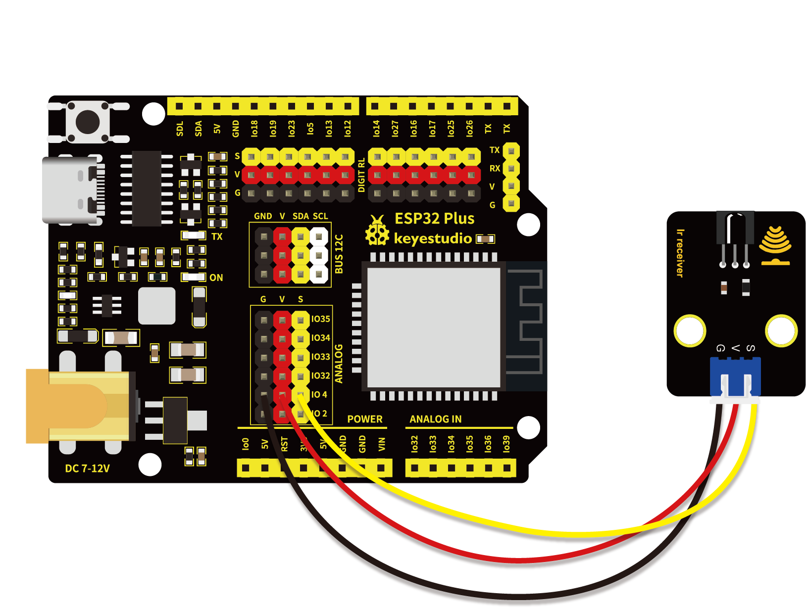

   img

1.6 在线运行代码

打开Thonny并单击\ |1303|\ ，然后单击“\ **此电脑**\ ”。

选中“\**D::raw-latex:`\代码*`\*”路径，打开代码文件’’\ **lesson_36_IR_receiver.py**\ ”。

.. code:: python

   import utime
   from machine import Pin 

   ird = Pin(4,Pin.IN)

   act = {"1": "LLLLLLLLHHHHHHHHLHHLHLLLHLLHLHHH","2": "LLLLLLLLHHHHHHHHHLLHHLLLLHHLLHHH","3": "LLLLLLLLHHHHHHHHHLHHLLLLLHLLHHHH",
          "4": "LLLLLLLLHHHHHHHHLLHHLLLLHHLLHHHH","5": "LLLLLLLLHHHHHHHHLLLHHLLLHHHLLHHH","6": "LLLLLLLLHHHHHHHHLHHHHLHLHLLLLHLH",
          "7": "LLLLLLLLHHHHHHHHLLLHLLLLHHHLHHHH","8": "LLLLLLLLHHHHHHHHLLHHHLLLHHLLLHHH","9": "LLLLLLLLHHHHHHHHLHLHHLHLHLHLLHLH",
          "0": "LLLLLLLLHHHHHHHHLHLLHLHLHLHHLHLH","Up": "LLLLLLLLHHHHHHHHLHHLLLHLHLLHHHLH","Down": "LLLLLLLLHHHHHHHHHLHLHLLLLHLHLHHH",
          "Left": "LLLLLLLLHHHHHHHHLLHLLLHLHHLHHHLH","Right": "LLLLLLLLHHHHHHHHHHLLLLHLLLHHHHLH","Ok": "LLLLLLLLHHHHHHHHLLLLLLHLHHHHHHLH",
          "*": "LLLLLLLLHHHHHHHHLHLLLLHLHLHHHHLH","#": "LLLLLLLLHHHHHHHHLHLHLLHLHLHLHHLH"}

   # 信号解码函数
   def read_ircode(ird):
       wait = 1
       complete = 0
       seq0 = []  # 存储低电平时间
       seq1 = []  # 存储高电平时间
       
       # 等待红外信号开始（检测到低电平）
       while wait == 1:
           if ird.value() == 0:
               wait = 0
       
       # 捕获完整的脉冲序列
       while wait == 0 and complete == 0:
           start = utime.ticks_us()
           while ird.value() == 0:  # 测量低电平持续时间
               ms1 = utime.ticks_us()
           diff = utime.ticks_diff(ms1,start)
           seq0.append(diff)
           
           while ird.value() == 1 and complete == 0:  # 测量高电平持续时间
               ms2 = utime.ticks_us()
               diff = utime.ticks_diff(ms2,ms1)
               if diff > 10000:  # 超过10ms视为信号结束
                   complete = 1
           seq1.append(diff)

       # 将脉冲时间转换为"H"（长）或"L"（短）
       code = ""
       for val in seq1:
           if val < 2000:
               if val < 700:
                   code += "L"
               else:
                   code += "H"
       
       # 匹配预定义的按键编码
       command = ""
       for k,v in act.items():
           if code == v:
               command = k
       if command == "":
           command = code
       return command  # 返回键名或原始编码

   while True:
       command = read_ircode(ird)  # 读取红外信号
       print(command)  # 打印按键名称
       utime.sleep(0.5)  # 防抖间隔

1.7 代码说明

.. code:: python

   act = {
       "1": "LLLLLLLLHHHHHHHHLHHLHLLLHLLHLHHH",
       "2": "LLLLLLLLHHHHHHHHHLLHHLLLLHHLLHHH",
       # ...（其他按键定义）
       "#": "LLLLLLLLHHHHHHHHLHLHLLHLHLHLHHLH"
   }

- **``act``\ 字典**\ ：存储了每个按键对应的红外信号特征（\ ``L``\ =短脉冲，\ ``H``\ =长脉冲）。
- **信号格式**\ ：NEC协议（常见于家电遥控器），由引导码、用户码、数据码和反码组成。

1.8 实验结果

Keyes 遥控器上每一个按键都对应着一个红外信号特征，如下表所示。

==== ================================
按键 红外信号特征
==== ================================
1    LLLLLLLLHHHHHHHHLHHLHLLLHLLHLHHH
2    LLLLLLLLHHHHHHHHHLLHHLLLLHHLLHHH
3    LLLLLLLLHHHHHHHHHLHHLLLLLHLLHHHH
4    LLLLLLLLHHHHHHHHLLHHLLLLHHLLHHHH
5    LLLLLLLLHHHHHHHHLLLHHLLLHHHLLHHH
6    LLLLLLLLHHHHHHHHLHHHHLHLHLLLLHLH
7    LLLLLLLLHHHHHHHHLLLHLLLLHHHLHHHH
8    LLLLLLLLHHHHHHHHLLHHHLLLHHLLLHHH
9    LLLLLLLLHHHHHHHHLHLHHLHLHLHLLHLH
0    LLLLLLLLHHHHHHHHLHLLHLHLHLHHLHLH
↑    LLLLLLLLHHHHHHHHLHHLLLHLHLLHHHLH
↓    LLLLLLLLHHHHHHHHHLHLHLLLLHLHLHHH
←    LLLLLLLLHHHHHHHHLLHLLLHLHHLHHHLH
→    LLLLLLLLHHHHHHHHHHLLLLHLLLHHHHLH
OK   LLLLLLLLHHHHHHHHLLLLLLHLHHHHHHLH
\*   LLLLLLLLHHHHHHHHLHLLLLHLHLHHHHLH
#    LLLLLLLLHHHHHHHHLHLHLLHLHLHLHHLH
==== ================================

按照接线图正确接好模块，用USB线连接到计算机上电，单击\ |1305|\ 来执行程序代码。代码开始执行。

找到红外遥控器，拔出绝缘片。对准红外接收模块的红外接收传感器的接收头，按下遥控器任意按键，接收到信号后，“Shell”窗口打印出当前接收到的按键值对应的按键，同时，红外接收传感器上的LED会闪烁。

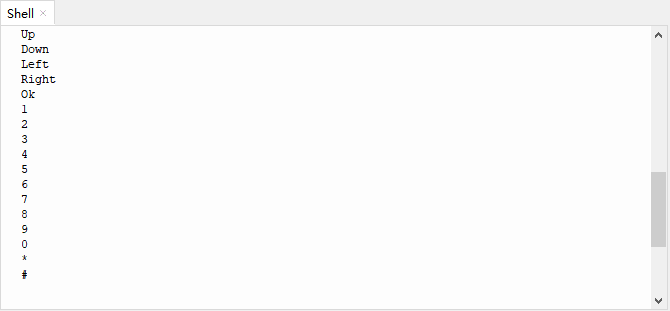

   img

项目三十七 DS18B20温度传感器检测温度
~~~~~~~~~~~~~~~~~~~~~~~~~~~~~~~~~~~~

1.1 项目介绍

在这个套件中，有一个Keyes DS18B20温度传感器，DS18B20
是美国DALLAS公司的一款温度传感器，单片机可以通过 1-Wire 协议与 DS18B20
进行通信，最终将温度读出。测试结果为℃,范围为-55℃到+125℃。

1.2 模块参数

工作电压 : DC 5V

电流 : 20 mA

最大功率 : 0.1 W

工作温度 ：-10°C ~ +50°C

测量精度 ：±0.5℃（-10℃至+85℃范围内）

输出信号 : 数字信号

尺寸 ：32 x 23.8 x 9.35 mm

定位孔大小：直径为 4.8 mm

接口 ：间距为2.54 mm 3pin防反接口

1.3 模块原理图

.. figure:: ./media/371301.png
   :alt: img

   img

1-Wire 总线的硬件接口很简单，只需要把 DS18B20 的数据引脚和单片机的一个
IO
口接上就可以了。硬件简单，随之而来的，就是软件时序的复杂。1-Wire总线的时序比较复杂，很多同学在这里独立看时序图都看不明白，我们在库里面已经把复杂的时序操作封装好了，直接使用库函数就可以。我们来看一下
DS18B20 的硬件原理图，如图所示。 DS18B20 通过编程，可以实现最高 12
位的温度存储值，在寄存器中，以补码的格式存储，如下图所示。

1.4 实验组件

+----------------+-------------------+-------------------+--------------+
| |image159|     | |image160|        | |image161|        | |image162|   |
+================+===================+===================+==============+
| ESP32 Plus主板 | DS18B20温度传感器 | XH2.54-3P         | USB线 x1     |
| x1             | x1                | 转杜邦线母单线 x1 |              |
+----------------+-------------------+-------------------+--------------+

1.5 模块接线图

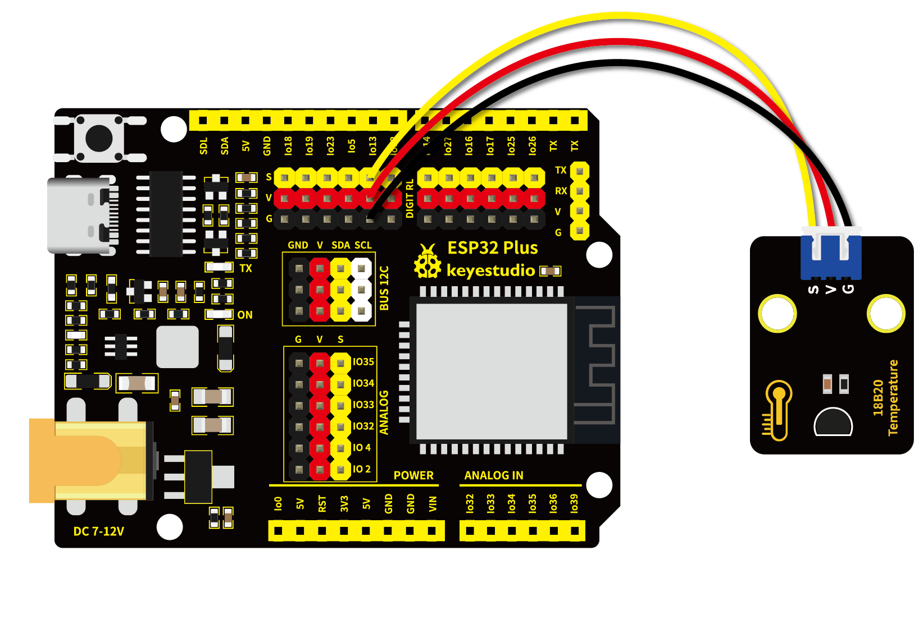

   img

1.6 在线运行代码

上传代码前先添加库。打开Thonny，在文件管理框单击“\ **此电脑**\ ”，双击“\ **（D:）**\ ”，然后双击展开“\ **代码**\ ”文件夹。展开“\ **37
DS18B20**\ ”文件夹，右键单击“\ **ds18x20.py**\ ”，选择“\ **上传到/**\ ”，等待被上传到ESP32。然后继续右键单击“\ **onewire.py**\ ”，选择“\ **上传到/**\ ”，等待被上传到ESP32。

**注意：在上传代码前先接好模块，否则代码可能上传不成功。**

上传完成后双击打开代码文件’’\ **lesson_37_ds18b20.py**\ ”。

.. code:: python

   import machine, onewire, ds18x20, time

   ds_pin = machine.Pin(13)

   ds_sensor = ds18x20.DS18X20(onewire.OneWire(ds_pin))

   roms = ds_sensor.scan()

   print('Found DS devices: ', roms)

   while True:

     ds_sensor.convert_temp()

     time.sleep_ms(750)

     for rom in roms:

       #print(rom)

       print(ds_sensor.read_temp(rom))

     time.sleep(1)

1.7 代码说明

======================== ============
代码                     说明
======================== ============
ds_sensor.read_temp(rom) 读取温度值。
======================== ============

1.8 实验结果

按照接线图正确接好模块，用USB线连接到计算机上电，单击\ |1305|\ 来执行程序代码。代码开始执行，“Shell”窗口打印出当前环境的温度值。

   img

项目三十八 XHT11温湿度传感器检测温湿度
~~~~~~~~~~~~~~~~~~~~~~~~~~~~~~~~~~~~~~

1.1 项目介绍

在这个套件中，有一个Keyes
XHT11温湿度传感器。XHT11作为一款低价的入门级温湿度传感器，它主要由一个电阻式感湿元件和一个NTC测温元件组成。XHT11为4针单排引脚封装，采用单线制串行接口，只需加适当的上拉电阻，信号传输距离可达20米以上，Keyes
XHT11温湿度传感器具有超快响应、抗干扰能力强、性价比极高等优点。

1.2 模块参数

工作电压 : DC 3.3 ~ 5V

电流 : 50 mA

最大功率 : 0.25 W

工作温度 : -25°C ~ +60°C

温度范围 : 0 ~ 50°C ± 2℃

湿度范围 : 20% ~ 90%RH ± 5%RH

输出信号 : 数字双向单总线

尺寸 ：32 x 23.8 x 9.7 mm

定位孔大小：直径为 4.8 mm

接口 ：间距为2.54 mm 3pin防反接口

1.3 模块原理图

.. figure:: ./media/381301.png
   :alt: img

   img

单片机与
XHT11之间的通讯和同步,采用单总线数据格式,一次通讯时间4ms左右,数据分小数部分和整数部分,具体格式在下面说明,当前小数部分用于以后扩展,现读出为零，操作流程：一次完整的数据传输为40bit，高位先出。

**数据格式**\ ：8bit湿度整数数据+8bit湿度小数数据+8bi温度整数数据+8bit温度小数数据+8bit校验和。

**8位校验和**\ ：8bit湿度整数数据+8bit湿度小数数据+8bi温度整数数据+8bit温度小数数据”相加所得结果的末8位

1.4 实验组件

+----------------+---------------------+-------------------+--------------+
| |image163|     | |image164|          | |image165|        | |image166|   |
+================+=====================+===================+==============+
| ESP32 Plus主板 | Keyes               | XH2.54-3P         | USB线 x1     |
| x1             | XHT11温湿度度传感器 | 转杜邦线母单线 x1 |              |
|                | x1                  |                   |              |
+----------------+---------------------+-------------------+--------------+

1.5 模块接线图

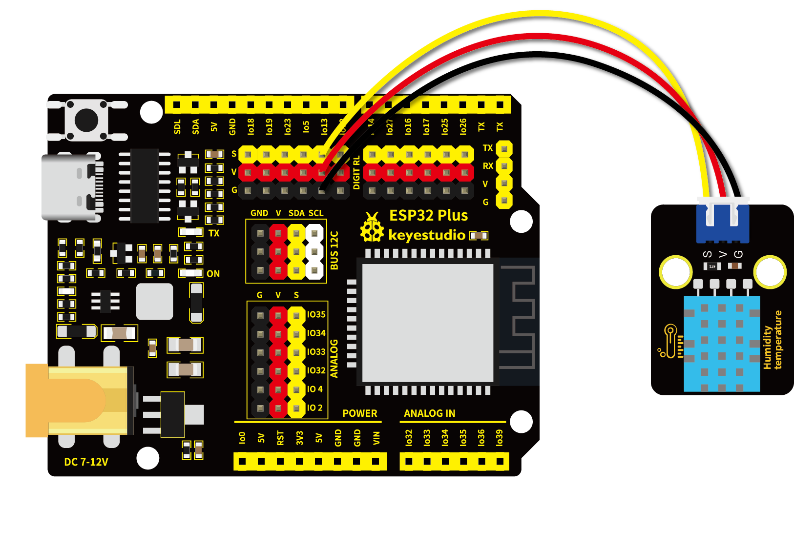

   img

1.6 实验代码

打开Thonny并单击\ |1303|\ ，然后单击“\ **此电脑**\ ”。

选中“\**D::raw-latex:`\代码*`\*”路径，打开代码文件’’\ **lesson_38_XHT11.py**\ ”。

.. code:: python

   # 导入机器、时间和dht模块
   import machine
   import time
   import dht

   #将DHT11与引脚(13)关联
   DHT = dht.DHT11(machine.Pin(13))

   # 每秒获取1次温湿度数据并打印
   while True:
       DHT.measure() # 启动DHT11测量一次数据
       
       # 调用DHT的内置函数来获取温度和湿度数据，并打印在“Shell”中
       print('temperature:',DHT.temperature(),'℃','humidity:',DHT.humidity(),'%')
       time.sleep_ms(1000)

1.7 代码说明

============= ==============================================
代码          说明
============= ==============================================
import dht    导入DHT系列温湿度传感器驱动库。
DHT.measure() 触发传感器采集数据（需先调用此方法才能读取）。
temperature() 返回温度值（整数，单位℃）。
humidity()    返回湿度值（整数，单位%）。
============= ==============================================

1.8 实验结果

按照接线图正确接好模块，用USB线连接到计算机上电，单击\ |1305|\ 来执行程序代码。代码开始执行，“Shell”窗口打印出当前环境的温湿度数据。

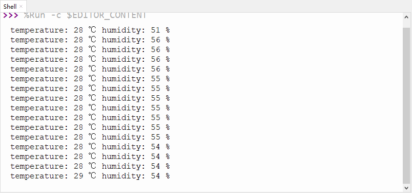

   img

项目三十九 DS1307时钟模块
~~~~~~~~~~~~~~~~~~~~~~~~~

1.1 项目介绍

这个模块主要用到的芯片是美国DALLAS公司推出的I2C总线接口实时时钟芯片DS1307，它可独立于CPU工作，不受CPU主晶振及其电容的影响；计时准确，月累积误差一般小于10秒。此芯片还具有主电源掉电情况下的时钟保护电路，DS1307的时钟靠后备电池维持工作，拒绝CPU对其读出和写入访问。同时还具有备用电源自动切换控制电路，因而可在主电源掉电和其它一些恶劣环境场合中保证系统时钟的定时准确性。DS1307具有产生秒、分、时、日、月、年等功能，且具有闰年自动调整功能。同时，DS1307芯片内部还集成有一定容量、具有掉电保护特性的静态RAM，可用于保存一些关键数据。

1.2 模块参数

中断类型 : 全天时间

存储器容量 : 56 bytes

存储器类型 : RAM

接口类型 : Serial, I2C

时钟频率 : 32.768kHz

特点 : 方波输出

电压, Vcc 最大 : 5V

电源电压 最小 : 4.5V

类型 : RTC

工作温度 ：-10°C ~ +50°C

通讯方式 ：I2C通讯

尺寸 ：47.6 x 23.8 x 7.4 mm

定位孔大小：直径为 4.8 mm

接口 ：间距为2.54 mm 3pin防反接口

1.3 模块原理图

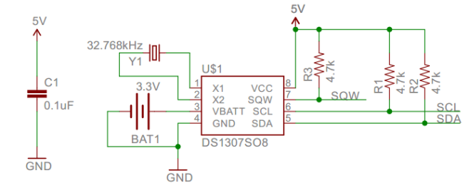

   img

DS1307 把8 个寄存器和56 字节的RAM
进行了统一编址，记录年、月、日、时、分、秒及星期; AM、PM
分别表示上午和下午; 56 个字节的NVRAM存放数据; 2线串口;
可编程的方波输出;电源故障检测及自动切换电路;电池电流小于500nA。

主要引脚定义如下：

========== ====================
DS1307引脚 定义
========== ====================
X1、X2     32.768kHz 晶振接入端
VBAT       +3V 电池电压输入
VCC        电源电压
SQW        方波驱动器
SCL        串行时钟
SDA        串行数据
========== ====================

1.4 实验组件

+---------------+----------------------+------------------+-------------+
| |image167|    | |image168|           | |image169|       | |image170|  |
+===============+======================+==================+=============+
| ESP32         | Keyes                | XH2.54-4P        | USB线 x1    |
| Plus主板 x1   | DS1307时钟传感器模块 | 转杜邦线母单线   |             |
|               | x1                   | x1               |             |
+---------------+----------------------+------------------+-------------+

1.5 模块接线图

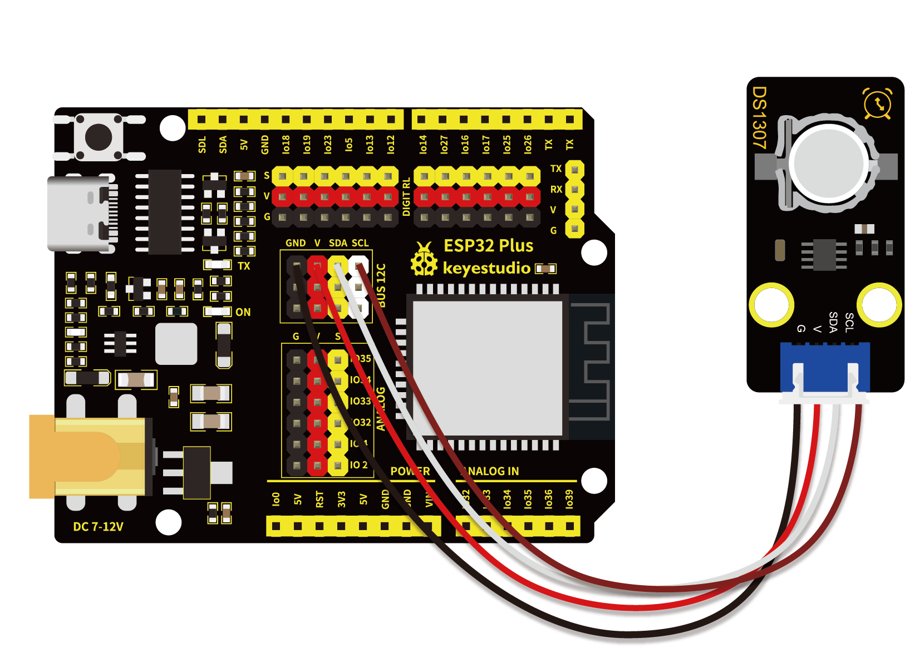

   img

1.6 在线运行代码

打开Thonny并单击\ |1303|\ ，然后单击“\ **此电脑**\ ”。

选中“\**D::raw-latex:`\代码*`\*”路径，打开代码文件’’\ **lesson_39_DS1307.py**\ ”。

.. code:: python

   from machine import I2C, Pin
   import time

   # 配置I2C总线
   i2c = I2C(scl=Pin(22), sda=Pin(21), freq=400000)
   #DS1307写入时间已启用
   year0 = int(input("Year : "))
   month0 = int(input("month (Jan --> 1 , Dec --> 12): "))
   day0 = int(input("day : "))
   weekday0 = int(input("weekday (1 --> monday , 2 --> Tuesday ... 0 --> Sunday): "))
   hours0 = int(input("hour (24 Hour format): "))
   minutes0 = int(input("minute : "))
   seconds0 = int(input("second : "))
   # 用户输入时间（年、月、日、星期、时、分、秒）
   seconds = ((seconds0 // 10) << 4) + (seconds0 % 10)  # BCD编码
   minutes = ((minutes0 // 10) << 4) + (minutes0 % 10)
   hours = ((hours0 // 10) << 4) + (hours0 % 10)
   weekday = weekday0 % 7 
   day = ((day0 // 10) << 4) + (day0 % 10)
   month = ((month0 // 10) << 4) + (month0 % 10)
   year = ((year0 - 2000) // 10 << 4) + (year0 - 2000) % 10
   #将时间写入DS1307
   i2c.writeto_mem(0x68, 0x00, bytes([seconds, minutes, hours, weekday, day, month, year]))

   while True:   
       # 发送命令读取当前时间
       i2c.writeto(0x68, bytes([0x00]))

       # 从DS1307读取当前时间
       data = i2c.readfrom(0x68, 7)
       seconds = (data[0] & 0x0f) + ((data[0] & 0x70) >> 4) * 10
       minutes = (data[1] & 0x0f) + ((data[1] & 0x70) >> 4) * 10
       hours = (data[2] & 0x0f) + (((data[2] & 0x30) >> 4) % 2) * 10
       weekday = data[3]
       day = (data[4] & 0x0f) + ((data[4] & 0x30) >> 4) * 10
       month = (data[5] & 0x0f) + ((data[5] & 0x10) >> 4) * 10
       year = (data[6] & 0x0f) + ((data[6] & 0xf0) >> 4) * 10
       print('20{:02}/{:02}/{:02} {:02}:{:02}:{:02} {:2}'.format(year, month, day, hours, minutes, seconds,weekday))
       time.sleep(1)                   

1.7 代码说明

+-----------------------------------+------------------------------------------------------------------------------------+
| 代码                              | 说明                                                                               |
+===================================+====================================================================================+
| i2c = I2C(scl=Pin(22),            | # 初始化I2C，速率400kHz                                                            |
| sda=Pin(21), freq=400000)         |                                                                                    |
+-----------------------------------+------------------------------------------------------------------------------------+
| seconds = ((seconds0 // 10) << 4) | BCD编码：将十进制数字转换为二进制编码的十进制（如\ ``59秒`` → ``0x59``\ ）。       |
| + (seconds0 % 10)                 |                                                                                    |
+-----------------------------------+------------------------------------------------------------------------------------+
| weekday = weekday0 % 7            | 星期处理：\ ``weekday = weekday0 % 7`` 确保值在0~6（0=周日）。                     |
+-----------------------------------+------------------------------------------------------------------------------------+
| i2c.writeto_mem(0x68, 0x00,       | ``writeto_mem``\ ：向DS1307的寄存器\ ``0x00``\ （秒寄存器）连续写入7字节时间数据。 |
| bytes([seconds, minutes, hours,   | 寄存器顺序：秒、分、时、星期、日、月、年。                                         |
| weekday, day, month, year]))      |                                                                                    |
+-----------------------------------+------------------------------------------------------------------------------------+
| seconds = (data[0] & 0x0f) +      | 将BCD码转换回十进制。                                                              |
| ((data[0] & 0x70) >> 4) \* 10     |                                                                                    |
+-----------------------------------+------------------------------------------------------------------------------------+

1.8 实验结果

按照接线图正确接好模块，用USB线连接到计算机上电，单击\ |1305|\ 来执行程序代码。代码开始执行。

需要在“Shell”窗口\ **手动输入年、月、日、周、时、分、秒**\ ，设为初始时间，此后每秒刷新一次时间并打印出来。

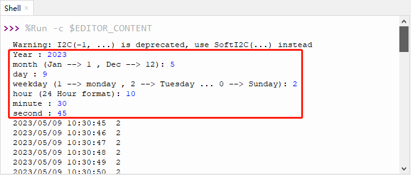

   img

项目四十 ADXL345加速度传感器
~~~~~~~~~~~~~~~~~~~~~~~~~~~~

1.1 项目介绍

在这个套件中，有一个Keyes ADXL345加速度传感器模块，它主要由 ADXL345BCCZ
芯片组成。ADXL345BCCZ
是一款小而薄的低功耗3轴加速度计芯片，分辨率高（13位），测量范围达±16g，既能测量运动或冲击导致的动态加速度，也能测量静止加速度，例如重力加速度，使得器件可作为倾斜传感器使用。

1.2 模块参数

工作电压 ：DC 3.3 ~ 5V

测量范围 ：±16 g

工作温度 ：-10°C ~ +50°C

通讯方式 ：IIC/SPI 通信协议

尺寸 ：47.6 x 23.8 x 9.3 mm

定位孔大小：直径为 4.8 mm

接口 ：间距为2.54 mm 4pin防反接口

1.3 模块原理图

.. figure:: ./media/401301.png
   :alt: img

   img

ADXL345是一款完整的3轴加速度测量系统，可选择的测量范围有±2 g，±4 g，±8
g或±16
g。它数字输出数据为16位二进制补码格式，可通过SPI（3线或4线）或I2C数字接口访问。该传感器可以在倾斜检测应用中测量静态重力加速度，还可以测量运动或冲击导致的动态加速度。其高分辨率(3.9mg/LSB)，能够测量不到1.0°的倾斜角度变化。

1.4 实验组件

+---------------+-------------------------+------------------+-------------+
| |image171|    | |image172|              | |image173|       | |image174|  |
+===============+=========================+==================+=============+
| ESP32         | Keyes                   | XH2.54-4P        | USB线 x1    |
| Plus主板 x1   | ADXL345加速度传感器模块 | 转杜邦线母单线   |             |
|               | x1                      | x1               |             |
+---------------+-------------------------+------------------+-------------+

1.5 模块接线图

.. figure:: ./media/401501.png
   :alt: img

   img

1.6 在线运行代码

上传代码前先添加库。打开Thonny，在文件管理框单击“\ **此电脑**\ ”，双击“\ **（D:）**\ ”，然后双击展开“\ **代码**\ ”文件夹。展开“\ **40
ADXL345**\ ”文件夹，右键单击“\ **ADXL345.py**\ ”，选择“\ **上传到/**\ ”，等待被上传到ESP32。

上传完成后双击打开代码文件’’\ **lesson_40_adxl345_test.py**\ ”。

注意：在上传代码前先接好模块，否则代码可能上传不成功。

.. code:: python

   from machine import Pin
   import time
   from ADXL345 import adxl345

   scl = Pin(22) 
   sda = Pin(21)
   bus = 0
   snsr = adxl345(bus, scl, sda)
   while True:
       x,y,z = snsr.readXYZ()
       print('x:',x,'y:',y,'z:',z,'uint:mg')
       time.sleep(0.1)

1.7 代码说明

+-----------------------+-----------------------------------------------------------+
| 代码                  | 说明                                                      |
+=======================+===========================================================+
| from ADXL345 import   | # 导入ADXL345驱动库                                       |
| adxl345               |                                                           |
+-----------------------+-----------------------------------------------------------+
| scl = Pin(22)         | # I2C时钟线                                               |
+-----------------------+-----------------------------------------------------------+
| sda = Pin(21)         | # I2C数据线                                               |
+-----------------------+-----------------------------------------------------------+
| bus = 0               | # I2C总线编号（ESP32通常为0）                             |
+-----------------------+-----------------------------------------------------------+
| snsr = adxl345(bus,   | # 初始化传感器                                            |
| scl, sda)             |                                                           |
+-----------------------+-----------------------------------------------------------+
| readXYZ()             | 返回X/Y/Z轴的原始加速度值（需根据量程转换为实际物理值）。 |
+-----------------------+-----------------------------------------------------------+

1.8 实验结果

按照接线图正确接好模块，用USB线连接到计算机上电，单击\ |1305|\ 来执行程序代码。代码开始执行，“Shell”窗口打印出三轴加速度对应的值，单位为mg。

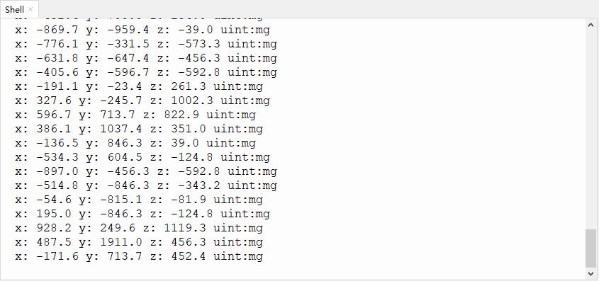

   img

项目四十一 TM1650四位数码管模块
~~~~~~~~~~~~~~~~~~~~~~~~~~~~~~~

1.1 项目介绍

Keyes TM1650四位数码管模块选用的 0.36
英寸红色共阴4位数码管的驱动芯片是TM1650。TM1650是一种带键盘扫描接口的LED驱动控制专用电路的芯片。内部集成有MCU输入输出控制数字接口、数据锁存器、LED
驱动、键盘扫描等电路。TM1650性能稳定、质量可靠、抗干扰能力强，可适用于24小时长期连续工作的应用场合。TM1650采用两线串行传输协议通讯（注意：该数据传输协议不是标准的I2C协议）。该芯片只需要通过两个引脚与MCU通讯就可以完成数码管的驱动，可以节省MCU引脚资源。

实验中使用Keyes
TM1650四位数码管模块时，我们只需要2根信号线即可使单片机控制4位数码管，大大节约了控制板IO口资源。

1.2 模块参数

工作电压 : DC 5V

电流 : 100 mA

最大功率 : 0.5 W

数码管显示颜色 : 红色

LED极性 : 共阴

通讯方式 ：2线高速串行接口（CLK,DAT）

工作温度 ：-10°C ~ +50°C

尺寸 ：47.6 x 23.8 x 10.6 mm

定位孔大小：直径为 4.8 mm

接口 ：间距为2.54 mm 4pin防反接口

1.3 模块原理图

TM1650与MCU之间的通讯采用2线高速串行接口（CLK,DAT），这两个连线分别是数据线DAT和同步时钟线CLK。其中DAT为双向数据传输线，TM1650既用该线从MCU接收数据，也用该线向MCU发送数据。

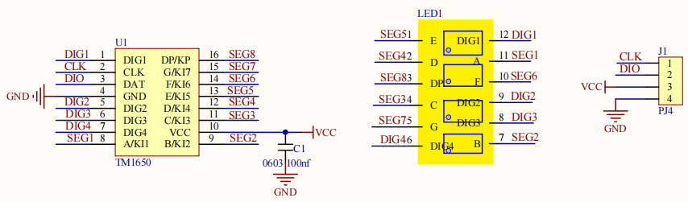

   411301

实验中我们使用封装好的库函数。如果大家有兴趣也可以接着往下学习了解 1.3.1
TM1650通讯时序格式和 1.3.2
指令集说明，然后再去了解底层的库函数是如何实现的。

1.3.1 TM1650通讯时序格式

TM1650采用下图1 中2线串行传输协议通讯：

.. figure:: ./media/411302.png
   :alt: img

   img

（1）开始信号（START）/结束信号(STOP)

开始信号：保持 CLK 为“1”电平，DAT 从“1”跳“0”，认为是开始信号，如上图1的
A 段； 结束信号：保持 CLK 为“1”电平，DAT
从“0”跳“1”，认为是结束信号，如上图1的 E 段；

（2）ACK 信号

如果本次通讯正常，芯片在串行通讯的第 8 个时钟下降沿后，TM1650 主动把 DAT
拉低，直到 CLK 检测到上升沿，DAT 释放为输入状态（对芯片而言）,如上图1的
D 段。

（3） 写“1”和写“0”

写“1”：保持 DAT 为“1”电平，CLK
从“0”跳到“1”,再从“1”跳到“0”，则认为是写入“1” ，如上图 1的 B 段。
写“0”：保持 DAT 为“0”电平，CLK
从“0”跳到“1”,再从“1”跳到“0”，则认为是写入“0” ，如上图 1的 C 段。

（4） 一个字节（8 位）数据传输格式

.. figure:: ./media/411303.png
   :alt: img

   img

一个字节数据的传输格式如图上 2，数据发送时 MSB 在前，LSB
在后，即高位先进。微处理器的数据通过 2 线 串行接口和 TM1650 通信，当 CLK
是高电平时，DAT 上的信号必须保持不变；只有 CLK 上的时钟信号为低电平时，
DAT 上的信号才能改变。数据输入的开始条件是 CLK 为高电平时，DAT
由高变低；结束条件是 CLK 为高时，DAT 由低电平变为高电平。

（5）写显示操作

.. figure:: ./media/411304.png
   :alt: img

   img

ADDRESS：显示地址（68H、6AH、6CH、6EH）； DATA：显示数据。

（6）完整操作时序

.. figure:: ./media/411305.png
   :alt: img

   img

command1：系统命令 48H；

command2：系统参数设置；

ADDRESS：显示地址（68H、6AH、6CH、6EH）；

DATA：显示数据。

备注：

1、设置系统参数和写入显存数据是两个独立的过程，它们之间的顺序不影响实际应用；

2、每次输入系统命令（48H）和系统参数设置命令都会改变系统参数，请特别注意待机指令操作。

1.3.2 指令集说明

（1）数据命令设置

.. figure:: ./media/411306.png
   :alt: img

   img

注意：使用的指令是 16 进制 H，输入数据和读取数据都是从高位开始。

所以在代码中我们数据命令设置为
0x48，使用TM1650点亮数码管的功能，而不使用按键扫描的功能。

（2）显示命令设置

.. figure:: ./media/411307.png
   :alt: img

   img

注意：在发送上述系统显示命令前需要先输入系统命令48H,如48H+11H=1级亮度开屏显示。

B[7:0] 这里实际是一个字节数据，只是不同位部分代表不同功能。

B[6:4] ：设置数码管亮度。注意，000 最亮。

B[3] ：设置是否显示小数点。

B[0] ：设置数码管的开屏、关屏。

（3） 显存地址

.. figure:: ./media/411308.png
   :alt: img

   img

如果要显示小数点，则必须先需要将段模式设置为 8 段输出。

.. figure:: ./media/411309.png
   :alt: img

   img

--------------

1.4 实验组件

+---------------+----------------------+------------------+-------------+
| |image175|    | |image176|           | |image177|       | |image178|  |
+===============+======================+==================+=============+
| ESP32         | Keyes                | XH2.54-4P        | USB线 x1    |
| Plus主板 x1   | TM1650四位数码管模块 | 转杜邦线母单线   |             |
|               | x1                   | x1               |             |
+---------------+----------------------+------------------+-------------+

1.5 模块接线图

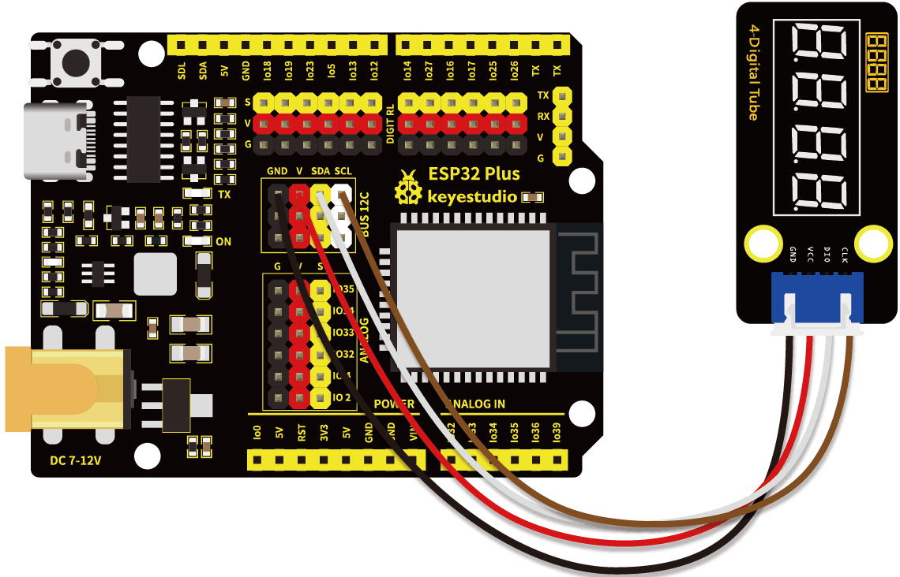

   411501

1.6 在线运行代码

打开Thonny并单击\ |1303|\ ，然后单击“\ **此电脑**\ ”。

选中“\**D::raw-latex:`\代码*`\*”路径，打开代码文件’’\ **lesson_41_TM1650.py**\ ”。

**注意：在上传代码前先接好模块，否则代码可能上传不成功。**

.. code:: python

   from machine import Pin
   import time

   ### TM1650的定义
   ADDR_DIS = 0x48  #加密模式命令
   ADDR_KEY = 0x49  #读键值命令

   ### 亮度的定义
   BRIGHT_DARKEST = 0
   BRIGHT_TYPICAL = 2
   BRIGHTEST      = 7

   on  = 1
   off = 0

   ### number:0~9
   NUM = [0x3f,0x06,0x5b,0x4f,0x66,0x6d,0x7d,0x07,0x7f,0x6f] 
   DIG = [0x6e,0x6c,0x6a,0x68]
   DOT = [0,0,0,0]

   clkPin = 22
   dioPin = 21
   clk = Pin(clkPin, Pin.OUT)
   dio = Pin(dioPin, Pin.OUT)

   DisplayCommand = 0

   def writeByte(wr_data):
       global clk,dio
       for i in range(8):
           if(wr_data & 0x80 == 0x80):
               dio.value(1)
           else:
               dio.value(0)
           clk.value(0)
           time.sleep(0.0001)
           clk.value(1)
           time.sleep(0.0001)
           clk.value(0)
           wr_data <<= 1
       return

   def start():
       global clk,dio
       dio.value(1)
       clk.value(1)
       time.sleep(0.0001)
       dio.value(0)
       return
       
   def ack():
       global clk,dio
       dy = 0
       clk.value(0)
       time.sleep(0.0001)
       dio = Pin(dioPin, Pin.IN)
       while(dio.value() == 1):
           time.sleep(0.0001)
           dy += 1
           if(dy>5000):
               break
       clk.value(1)
       time.sleep(0.0001)
       clk.value(0)
       dio = Pin(dioPin, Pin.OUT)
       return 
       
   def stop():
       global clk,dio
       dio.value(0)
       clk.value(1)
       time.sleep(0.0001)
       dio.value(1)
       return
       
   def displayBit(bit, num):
       global ADDR_DIS
       if(num > 9 and bit > 4):
           return
       start()
       writeByte(ADDR_DIS)
       ack()
       writeByte(DisplayCommand)
       ack()
       stop()
       start()
       writeByte(DIG[bit-1])
       ack()
       if(DOT[bit-1] == 1):
           writeByte(NUM[num] | 0x80)
       else:
           writeByte(NUM[num])
       ack()
       stop()
       return
       
   def clearBit(bit):
       if(bit > 4):
           return
       start()
       writeByte(ADDR_DIS)
       ack()
       writeByte(DisplayCommand)
       ack()
       stop()
       start()
       writeByte(DIG[bit-1])
       ack()
       writeByte(0x00)
       ack()
       stop()
       return
       
       
   def setBrightness(b = BRIGHT_TYPICAL):
       global DisplayCommand,brightness
       DisplayCommand = (DisplayCommand & 0x0f)+(b<<4)
       return

   def setMode(segment = 0):
       global DisplayCommand
       DisplayCommand = (DisplayCommand & 0xf7)+(segment<<3)
       return
       
   def displayOnOFF(OnOff = 1):
       global DisplayCommand
       DisplayCommand = (DisplayCommand & 0xfe)+OnOff
       return

   def displayDot(bit, OnOff):
       if(bit > 4):
           return
       if(OnOff == 1): 
           DOT[bit-1] = 1;
       else:
           DOT[bit-1] = 0;
       return
           
   def InitDigitalTube():
       setBrightness(2)
       setMode(0)
       displayOnOFF(1)
       for _ in range(4):
           clearBit(_)
       return

   def ShowNum(num): #0~9999
       displayBit(1,num%10)
       if(num < 10):
           clearBit(2)
           clearBit(3)
           clearBit(4)
       if(num > 9 and num < 100):
           displayBit(2,num//10%10)
           clearBit(3)
           clearBit(4)
       if(num > 99 and num < 1000):
           displayBit(2,num//10%10)
           displayBit(3,num//100%10)
           clearBit(4)
       if(num > 999 and num < 10000):
           displayBit(2,num//10%10)
           displayBit(3,num//100%10)
           displayBit(4,num//1000)

   InitDigitalTube()

   while True:
       #displayDot(1,on)     # 开或关, DigitalTube.Display(bit,number); bit=1---4  number=0---9
       for i in range(0,9999):
           ShowNum(i)
           time.sleep(0.01)

1.7 代码说明

================================= ============================
代码                              说明
================================= ============================
clearBit(bit)                     清除bit(1~4)位显示。
setBrightness(b = BRIGHT_TYPICAL) 亮度设置。
DigitalTube.clearBit(b)           清除位显示。
displayOnOFF(OnOff = 1)           显示小数点，0为关，1为开。
ShowNum(num)                      显示整数num，范围为0~9999 。
================================= ============================

1.8 实验结果

按照接线图正确接好模块，用USB线连接到计算机上电，单击\ |1305|\ 来执行程序代码。代码开始执行，能看到4位数码管显示数字，从0开始，每10毫秒加1，直至加到9999后又从0开始循环。

.. figure:: ./media/411704.png
   :alt: img

   img

项目四十二 HT16K33_8X8点阵模块
~~~~~~~~~~~~~~~~~~~~~~~~~~~~~~

1.1 项目介绍

点阵，多个LED组成的阵列，他们的集合称为“阵”，其中单个单元称为“点”。8X8点阵共由64个发光二极管组成，且每个发光二极管是放置在行线和列线的交叉点上。

第二课我们学习了一个IO口控制一个led，这节课我们来学习用更少的IO口控制更多的led。

1.2 模块参数

工作电压 : DC 5V

电流 : 200 mA

最大功率 : 1 W

工作温度 ：-10°C ~ +50°C

通讯方式 ：I2C通讯

I2C通信地址 ：0X70

点阵屏显示颜色 ：蓝色

尺寸 ：32 x 23.8 x 7.4 mm

定位孔大小：直径为 4.8 mm

接口 ：间距为2.54 mm 4pin防反接口

1.3 模块原理图

.. figure:: ./media/421301.png
   :alt: img

   img

如原理图所示，如果想要点亮第一行第一列的LED灯，只需要将C1置高电平、R1置低电平就可以了。如果我们想让第一行led全部点亮，只需要将R1置为低电平，C1~C8全部置为高电平就可以了。原理非常简单，但是这样设置的话我们总共需要用到16个IO口，非常浪费单片机资源。为了节省IO口不浪费单片机资源，我们特别设计了这个HT16K33_8X8点阵模块，利用HT16K33芯片驱动1个8*8点阵，只需要利用单片机的I2C通信端口就能控制点阵的64个发光二极管。

我们这款Keyes HT16K33_8X8点阵模块已经固定了通信地址，地址为0x70。

1.4 实验组件

+----------------+---------------------+------------------+-------------+
| |image179|     | |image180|          | |image181|       | |image182|  |
+================+=====================+==================+=============+
| ESP32 Plus主板 | Keyes               | XH2.54-4P        | USB线 x1    |
| x1             | HT16K33_8X8点阵模块 | 转杜邦线母单线   |             |
|                | x1                  | x1               |             |
+----------------+---------------------+------------------+-------------+

1.5 模块接线图

.. figure:: ./media/421501.png
   :alt: img

   img

1.6 在线运行代码

上传代码前先添加库。打开Thonny，在文件管理框单击“\ **此电脑**\ ”，双击“\ **（D:）**\ ”，然后双击展开“\ **代码**\ ”文件夹。展开“\ **42
HT16K33 dot
matrix**\ ”文件夹，右键单击“\ **ht16k33.py**\ ”，选择“\ **上传到/**\ ”，等待被上传到ESP32。然后继续右键单击“\ **ht16k33matrix.py**\ ”，选择“\ **上传到/**\ ”，等待被上传到ESP32。

注意：在上传代码前先接好模块，否则代码可能上传不成功。

上传完成后双击打开代码文件’’\ **lesson_42_matrix_dot.py**\ ”。

.. code:: python

   import utime as time
   from machine import I2C, Pin, RTC
   from ht16k33matrix import HT16K33Matrix

   ### 常量
   DELAY = 0.01
   PAUSE = 3

   ### 初始
   if __name__ == '__main__':
       i2c = I2C(scl=Pin(22), sda=Pin(21))
       display = HT16K33Matrix(i2c)
       display.set_brightness(2)

       # 在LED上绘制自定义图标
       icon = b"\x00\x66\x00\x00\x18\x42\x3c\x00"
       display.set_icon(icon).draw()
       display.set_angle(0).draw()
       time.sleep(PAUSE)

1.7 实验结果

按照接线图正确接好模块，用USB线连接到计算机上电，单击\ |1305|\ 来执行程序代码。代码开始执行，HT16K33_8X8点阵模块显示“笑脸”图案。

.. figure:: ./media/421703.png
   :alt: img

   img

若代码上传成功后点阵屏不显示“笑脸”图案，尝试按一下RESET键。

   img

项目四十三 LCD_128X32_DOT模块
~~~~~~~~~~~~~~~~~~~~~~~~~~~~~

1.1 项目介绍

在这个套件中，有一个Keyes
LCD_128X32_DOT模块，它是一个像素为128*32的液晶屏模块，驱动芯片为
ST7567A。此模块使用IIC通信方式。我们提供了包含所有英文字母和常用符号的库，可以直接调用，还能设置大小。为了方便设置图案显示，我们还提供一个取模软件，可将特定的图案转化成控制代码，在测试代码中使用。

1.2 模块参数

工作电压 ：DC 5V

分辨率 ：128 X 32

电流 ：100 mA

最大功率 ：0.5W

工作温度 ：0°C ~ +40°C

通讯方式 ：IIC/SPI 通信协议

尺寸 ：47.6 x 23.8 x 9.3 mm

定位孔大小：直径为 4.8 mm

接口 ：间距为2.54 mm 4pin防反接口

1.3 模块原理图

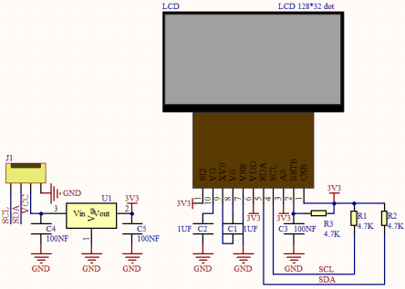

   img

该模块使用IIC通讯原理，底层函数已经封装在库里面，直接调用库函数就可以。如果感兴趣的话可以自行了解底层驱动。

1.4 实验组件

+----------------+--------------------+-------------------+--------------+
| |image183|     | |image184|         | |image185|        | |image186|   |
+================+====================+===================+==============+
| ESP32 Plus主板 | Keyes              | XH2.54-4P         | USB线 x1     |
| x1             | LCD_128X32_DOT模块 | 转杜邦线母单线 x1 |              |
|                | x1                 |                   |              |
+----------------+--------------------+-------------------+--------------+

1.5 模块接线图

.. figure:: ./media/431501.png
   :alt: img

   img

1.6 在线运行代码

上传代码前先添加库。打开Thonny，在文件管理框单击“\ **此电脑**\ ”，双击“\ **（D:）**\ ”，然后双击展开“\ **代码**\ ”文件夹。展开“\ **43
lcd128_32**\ ”文件夹，右键单击“\ **lcd128_32_fonts.py**\ ”，选择“\ **上传到/**\ ”，等待被上传到ESP32。然后继续用相同的操作将“\ **lcd128_32.py**\ ”上传到ESP32。

注意：在上传代码前先接好模块，否则代码可能上传不成功。

选中“\**D::raw-latex:`\代码*`\*”路径，打开代码文件’’\ **lesson_43_lcd128_32_test.py**\ ”。

.. code:: python

   import machine
   import time 
   import lcd128_32_fonts
   from lcd128_32 import lcd128_32

   #i2c配置
   clock_pin = 22
   data_pin = 21
   bus = 0
   i2c_addr = 0x3f
   use_i2c = True

   def scan_for_devices():
       i2c = machine.I2C(bus,sda=machine.Pin(data_pin),scl=machine.Pin(clock_pin))
       devices = i2c.scan()
       if devices:
           for d in devices:
               print(hex(d))
       else:
           print('no i2c devices')

   if use_i2c:
       scan_for_devices()
       lcd = lcd128_32(data_pin, clock_pin, bus, i2c_addr)

   lcd.Clear()

   lcd.Cursor(0, 7)
   lcd.Display("KEYES")
   lcd.Cursor(1, 0)
   lcd.Display("ABCDEFGHIJKLMNOPQR")
   lcd.Cursor(2, 0)
   lcd.Display("123456789+-*/<>=$@")
   lcd.Cursor(3, 0)
   lcd.Display("%&(){}:;'|?,.~\\[]")

   while True:
       #scan_for_devices()
       time.sleep(0.5)

1.7 代码说明

================ ==============
代码             说明
================ ==============
lcd.Init()       初始化显示屏。
lcd.Clear()      清除显示。
lcd.Cursor( , )  设置显示位置。
lcd.Display(” “) 设置显示字符。
================ ==============

1.8 实验结果

按照接线图正确接好模块，用USB线连接到计算机上电，单击\ |1305|\ 来执行程序代码。

代码开始执行，模块显示屏第一行显示“\ **KEYES**\ ”、第二行显示“\ **ABCDEFGHIJKLMNOPQR**\ ”、第三行显示“\ **123456789+-/<>=$@\*\ ”、第四行显示“**\ %^&(){}:;’\|?,.~\\[]*\*”。

.. figure:: ./media/431701.png
   :alt: img

   img

项目四十四 RFID刷卡模块
~~~~~~~~~~~~~~~~~~~~~~~

1.1 项目介绍

在这个套件中，有一个Keyes
RFID刷卡模块。RFIDRFID-RC522射频模块采用Philips
MFRC522原装芯片设计读卡电路，使用方便，成本低廉，适用于设备开发、读卡器开发等高级应用的用户，也适用于需要进行射频卡终端设计/生产的用户。本模块可直接装入各种读卡器模具,通过IIC接口简单的2条线就可以直接与用户任何CPU主板或单片机相连接通信。
实验中用刷卡模块读取到的数据是4个16进制数，我们把这四个16进制数串以字符串的形式打印出来。例如本实验中读取到的IC卡的数据为：0xED、0xF7、0x94、0x5A，在
Shell 窗口显示出信息字符串就是ED F7 94
5A；读取钥匙扣的数据为：0x4C、0x09、0x6B、0x6E，在 Shell
窗口打印出来的信息字符串就是4C 09 6B
6E。有时候看到的不是两位数，是因为前面有个0省略了，如0a它显示的就是a。不同的IC卡和钥匙扣，其数据是不一样的。

1.2 模块参数

工作电压 : DC 5V

工作电流 : 13 ~ 100 mA /DC 5V

空闲电流 : 10 ~ 13 mA /DC 5V

休眠电流 : < 80 uA

峰值电流 : < 100 mA

工作频率 : 13.56 MHz

最大功率 : 0.5 W

支持的卡类型：mifare1 S50、mifare1 S70、mifare UltraLight、mifare
Pro、mifare Desfire

数据传输速率：最大10Mbit/s

工作温度 ：-10°C ~ +50°C

尺寸 ：47.6 x 23.8 x 9.3 mm

定位孔大小：直径为 4.8 mm

接口 ：间距为2.54 mm 4pin防反接口

1.3 模块原理图

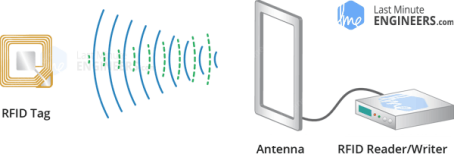

   img

RFID（Radio Frequency
Identification）：无线射频识别，读卡器由频射模块及高平磁场组成。Tag应答器为待感应设备，此设备不包含电池。他只包含微型集成电路芯片及存储数据的介质以及接收和发送信号的天线。读取tag中的数据，首先要放到读卡器的读取范围内。读卡器会产生一个磁场，因为磁能生电由楞次定律，RFID
Tag就会供电，从而激活设备。

.. figure:: ./media/441302.png
   :alt: img

   img

1.4 实验组件

+---------------------+---------------------+-------------------------+
| |image187|          | |image188|          | |image189|              |
+=====================+=====================+=========================+
| ESP32 Plus主板 x1   | Keyes RFID刷卡模块  | XH2.54-4P               |
|                     | x1                  | 转杜邦线母单线 x1       |
+---------------------+---------------------+-------------------------+
| |image190|          | |image191|          | |image192|              |
+---------------------+---------------------+-------------------------+
| USB线 x1            | 钥匙扣 x1           | IC卡 x1                 |
+---------------------+---------------------+-------------------------+

1.5 模块接线图

.. figure:: ./media/441501.png
   :alt: img

   img

1.6 在线运行代码

上传代码前先添加库。打开Thonny，在文件管理框单击“\ **此电脑**\ ”，双击“\ **（D:）**\ ”，然后双击展开“\ **代码**\ ”文件夹。展开“\ **44
RFID
RC522**\ ”文件夹，右键单击“\ **mfrc522_config.py**\ ”，选择“\ **上传到/**\ ”，等待被上传到ESP32。然后继续用相同的操作将“\ **mfrc522_i2c.py**\ ”和“\ **soft_iic.py**\ ”上传到ESP32。

注意：在上传代码前先接好模块，否则代码可能上传不成功。

选中“\**D::raw-latex:`\代码*`\*”路径，打开代码文件’’\ **lesson_44_mfrc522.py**\ ”。

.. code:: python

   import machine
   import time
   from mfrc522_i2c import mfrc522

   #i2c配置
   addr = 0x28
   scl = 22
   sda = 21
       
   rc522 = mfrc522(scl, sda, addr)
   rc522.PCD_Init()
   rc522.ShowReaderDetails()    # 显示PCD - MFRC522读卡器的详细信息

   while True:
       if rc522.PICC_IsNewCardPresent():
           if rc522.PICC_ReadCardSerial() == True:
               print("Card UID:")
               print(rc522.uid.uidByte[0 : rc522.uid.size])
       #time.sleep(1)

1.7 代码说明

+-------------------+------------------------------------------------------+
| 库名称            | 说明                                                 |
+===================+======================================================+
| mfrc522_config.py | 这是一个配置文件，里面定义了一些参数和命令。         |
+-------------------+------------------------------------------------------+
| mfrc522_i2c.py    | 是一些初始化和读写函数。                             |
+-------------------+------------------------------------------------------+
| Soft_iic.py       | 是软件I2C的底层读写函数，我们这里用的是io口模拟I2C。 |
+-------------------+------------------------------------------------------+

1.8 实验结果

按照接线图正确接好模块，用USB线连接到计算机上电，单击\ |1305|\ 来执行程序代码。

代码开始执行，用IC卡和钥匙扣靠近RFID模块，“Shell”窗口打印出RFID刷卡模块读取到的数据信息。

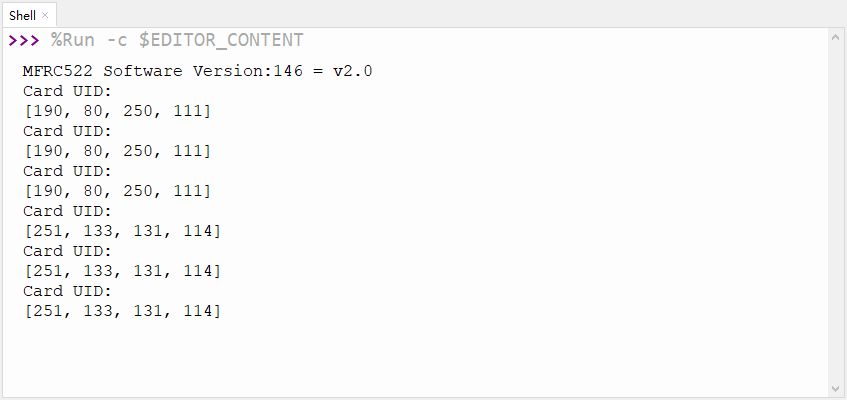

   img

**注意：不同的IC卡和钥匙扣，其数据是不一样的。**

若代码上传成功后 Shell 窗口不打印数据信息，尝试按一下RESET键。

   img

项目四十五 按键控制LED灯
~~~~~~~~~~~~~~~~~~~~~~~~

1.1 项目介绍

从前面的实验课程中我们学习了按键模块，按下按键我们的单片机读取到低电平，松开按键读取到高电平。在这一实验课程中，我们将按键模块和紫色LED模块组合实验，实现按下按键LED点亮，再次按下按键LED熄灭，再次按下再次点亮的效果。

1.2 实验组件

+-------------+--------------+-------------+----------------+------------+
| |image193|  | |image194|   | |image195|  | |image196|     | |image197| |
+=============+==============+=============+================+============+
| ESP32       | Keyes        | Keyes       | XH2.54-3P      | USB线 x1   |
| Plus主板 x1 | 单路按键模块 | 紫色LED模块 | 转杜邦线母单线 |            |
|             | x1           | x1          | x2             |            |
+-------------+--------------+-------------+----------------+------------+

1.3 实验接线图

.. figure:: ./media/451301.png
   :alt: img

   img

1.4 在线运行代码

打开Thonny并单击\ |1303|\ ，然后单击“\ **此电脑**\ ”。

选中“\**D::raw-latex:`\代码*`\*”路径，打开代码文件’’\ **lesson_45_button_control_LED.py**\ ”。

.. code:: python

   from machine import Pin
   import time

   led = Pin(12, Pin.OUT) # 从引脚12创建LED对象，设置引脚12输出             
   button = Pin(13, Pin.IN, Pin.PULL_UP) #从GP13创建按钮对象，设置GP13为输入

   #自定义一个函数并将其命名为reverseGPIO()，它将反转LED的输出电平
   def reverseGPIO():
       if led.value():
           led.value(0)     #设置led关闭
       else:
           led.value(1)     #设置led开启

   try:
       while True:
           if not button.value():
               time.sleep_ms(20)
               if not button.value():
                   reverseGPIO()
                   while not button.value():
                       time.sleep_ms(20)
   except:
       pass

1.5 实验结果

按照接线图正确接好模块，用USB线连接到计算机上电，单击\ |1305|\ 来执行程序代码。代码开始执行，按下按键，LED点亮，再次按下，LED熄灭。循环进行。

单击\ |1311|\ 或按Ctrl+C退出程序。

.. figure:: ./media/451501.png
   :alt: img

   img

.. figure:: ./media/451502.png
   :alt: img

   img

项目四十六 障碍物报警实验
~~~~~~~~~~~~~~~~~~~~~~~~~

1.1 项目介绍

在前面实验课程中中，我们使用一个输入模块控制另一个输出模块。在这一实验中，我们还是用一个模块控制另一个模块。

生活中，我们可以利用一个检测传感器控制一个有源蜂鸣器响起或者LED点亮，做声光报警设备，如检测磁场（干簧管）、检测倾斜（倾斜模块）等等。这一实验课程中我们将避障传感器和有源蜂鸣器模块组合实验，实现避障传感器检测到障碍物时有源蜂鸣器响起的效果。

1.2 实验组件

+-------------+-------------+----------------+----------------+------------+
| |image198|  | |image199|  | |image200|     | |image201|     | |image202| |
+=============+=============+================+================+============+
| ESP32       | Keyes       | Keyes          | XH2.54-3P      | USB线 x1   |
| Plus主板 x1 | 避障传感器  | 有源蜂鸣器模块 | 转杜邦线母单线 |            |
|             | x1          | x1             | x2             |            |
+-------------+-------------+----------------+----------------+------------+

1.3 实验接线图

.. figure:: ./media/461301.png
   :alt: img

   img

1.4 在线运行代码

打开Thonny并单击\ |1303|\ ，然后单击“\ **此电脑**\ ”。

选中“\**D::raw-latex:`\代码*`\*”路径，打开代码文件’’\ **lesson_46_Avoiding_alarm.py**\ ”。

.. code:: python

   from machine import Pin
   import time

   buzzer = Pin(13, Pin.OUT)
   sensor = Pin(12, Pin.IN)
   while True:
       buzzer.value(not(sensor.value()))
       time.sleep(0.01)

1.5 实验结果

按照接线图正确接好模块，用USB线连接到计算机上电，单击\ |1305|\ 来执行程序代码。代码开始执行，当避障传感器检测到障碍物时，避障传感器上SLED灯亮起，同时有源蜂鸣器发出声响；当避障传感器检测不到障碍物时，有源蜂鸣器停止发出声响。

.. figure:: ./media/461501.png
   :alt: img

   img

项目四十七 入侵检测报警器
~~~~~~~~~~~~~~~~~~~~~~~~~

1.1 项目介绍

上一课实验中我们学习了使用避障传感器检测障碍物进行报警提醒。在这一实验课程中我们将人体红外热释传感器、紫色LED模块和有源蜂鸣器模块组合实验，实现人体红外热释传感器检测到附近有人经过时有源蜂鸣器响起，紫色LED快速闪烁的效果。

1.2 实验组件

+---------------------+-------------------------+---------------------+
| |image203|          | |image204|              | |image205|          |
+=====================+=========================+=====================+
| ESP32 Plus主板 x1   | Keyes                   | Keyes               |
|                     | 人体红外热释传感器 x1   | 有源蜂鸣器模块 x1   |
+---------------------+-------------------------+---------------------+
| |image206|          | |image207|              | |image208|          |
+---------------------+-------------------------+---------------------+
| Keyes 紫色LED模块   | XH2.54-3P               | USB线 x1            |
| x1                  | 转杜邦线母单线 x3       |                     |
+---------------------+-------------------------+---------------------+

1.3 模块接线图

.. figure:: ./media/471301.png
   :alt: img

   img

1.4 在线运行代码

打开Thonny并单击\ |1303|\ ，然后单击“\ **此电脑**\ ”。

选中“\**D::raw-latex:`\代码*`\*”路径，打开代码文件’’\ **lesson_47_PIR_alarm.py**\ ”。

.. code:: python

   #导入引脚和时间模块
   from machine import Pin 
   import time 

   ### 定义人体红外传感器，led和主动蜂鸣器的引脚
   sensor_pir = Pin(12, Pin.IN)
   led = Pin(5, Pin.OUT)
   buzzer = Pin(13, Pin.OUT)

   while True: 
         if sensor_pir.value():
             print("Warning! Intrusion detected！")
             buzzer.value(1)
             led.value(1)
             time.sleep(0.2)
             buzzer.value(0)
             led.value(0)
             time.sleep(0.2)         
         else:
             buzzer.value(0)
             led.value(0)

1.5 实验结果

按照接线图正确接好模块，用USB线连接到计算机上电，单击\ |1305|\ 来执行程序代码。代码开始执行，当人体红外热释传感器检测到附近有人经过时，人体红外热释传感器上的红灯灭，有源蜂鸣器发出警报，紫色LED灯快速闪烁，“Shell”窗口打印出“\ **Warning!
Intrusion detected！**\ ”。

单击\ |1311|\ 或按Ctrl+C退出程序。

.. figure:: ./media/471501.png
   :alt: img

   img

.. figure:: ./media/471502.png
   :alt: img

   img

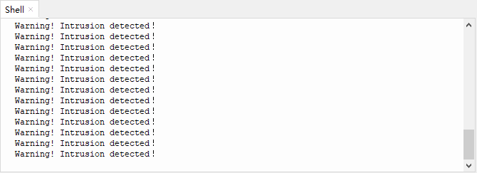

   img

项目四十八 模拟灭火机器人
~~~~~~~~~~~~~~~~~~~~~~~~~

1.1 项目介绍

你知道灭火机器人吗？根据国家犯罪记录局（NCRB）的估计，从2010年至2014年，印度发生的火灾事故已造成超过120万死亡。即使为火灾事故采取了许多预防措施，但这些自然/人为灾难却还是时有发生。发生火灾时，为了营救人员和灭火，非常需要消防员等人力资源。随着技术的进步、机器人技术的发展，未来很有可能使用机器人代替消防员灭火。这将提高灭火的效率，也能保障消防员的生命安全。

在这个项目中，我们将学习如何使用ESP32主板构建一个非常简单的机器人。用火焰传感器检测火焰，并启动130电机吹灭火源。

1.2 实验组件

+----------------+----------------+----------------+-------------------+
| |image209|     | |image210|     | |image211|     | |image212|        |
+================+================+================+===================+
| ESP32 Plus主板 | Keyes          | Keyes          | XH2.54-4P         |
| x1             | 130电机模块 x1 | 火焰传感器 x1  | 转杜邦线母单线 x2 |
+----------------+----------------+----------------+-------------------+
| |image213|     | |image214|     | |image215|     |                   |
+----------------+----------------+----------------+-------------------+
| USB线 x1       | 6节5号电池盒   | 5号电池(自备)  |                   |
|                | x1             | x6             |                   |
+----------------+----------------+----------------+-------------------+

1.3 模块接线图

.. figure:: ./media/481301.png
   :alt: img

   img

**注意：130电机模块的GND线一定要接到图示位置，电池盒也必须接上，否则容易造成瞬时电流过大。**

1.4 在线运行代码

打开Thonny并单击\ |1303|\ ，然后单击“\ **此电脑**\ ”。

选中“\**D::raw-latex:`\代码*`\*”路径，打开代码文件’’\ **48_Fire_fighting_robot.py**\ ”。

.. code:: python

   ### 导入引脚和ADC模块
   from machine import ADC,Pin
   import time

   ### 开启并配置ADC，量程为0-3.3V
   adc=ADC(Pin(34))
   adc.atten(ADC.ATTN_11DB)
   adc.width(ADC.WIDTH_12BIT)

   ### 电机的两个引脚
   INA = Pin(5, Pin.OUT) # INA对应IN+
   INB = Pin(13, Pin.OUT)# INB对应IN-

   while True:
       adcVal=adc.read()
       print(adcVal)
       if adcVal < 3000:
           # 开启
           INA.value(0)
           INB.value(1)
       else:
           # 停止
           INA.value(0)
           INB.value(0)
       time.sleep(0.1)

1.5 代码说明

在代码中我们设置了阈值为3000（item <
3000），阈值可以根据实际情况更改。当火焰传感器检测到ADC值低于这个阈值时，风扇将自动开启；否则关闭。风扇的驱动方式请查看课程十九。

1.6 实验结果

由于风扇在转动时，所需的电流比其他传感器要大，会引起电路中电压电流波动，特别是风扇进行正反转时，电压电流波动过大，导致ESP32开发板的电压电流过低，会导致复位。

按照接线图正确接好模块，用USB线连接到计算机上电，单击\ |1305|\ 来执行程序代码。

“Shell”窗口打印出火焰的ADC值，当ADC值低于3000时打开风扇灭火；当ADC值高于3000时关闭风扇。这个ADC阈值可以根据实际情况设置。

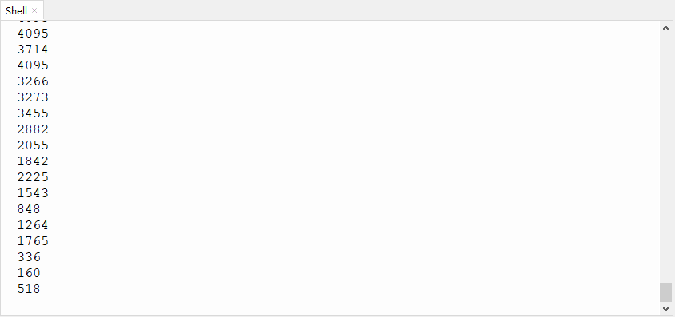

   img

项目四十九 旋转编码器控制RGB
~~~~~~~~~~~~~~~~~~~~~~~~~~~~

1.1 项目介绍

在第三十三课的实验中我们学习了使用旋转编码器计数。在这一实验课程中我们将旋转编码器模块和共阴RGB模块组合实验，通过旋转编码器计数的结果，控制RGB模块上LED显示不同的颜色。

1.2 实验组件

+------------------------+------------------------+--------------------+
| |image216|             | |image217|             | |image218|         |
+========================+========================+====================+
| ESP32 Plus主板 x1      | Keyes 旋转编码器模块   | Keyes 共阴RGB模块  |
|                        | x1                     | x1                 |
+------------------------+------------------------+--------------------+
| |image219|             | |image220|             | |image221|         |
+------------------------+------------------------+--------------------+
| XH2.54-5P              | XH2.54-4P              | USB线 x1           |
| 转杜邦线母单线 x1      | 转杜邦线母单线 x1      |                    |
+------------------------+------------------------+--------------------+

1.3 模块接线图

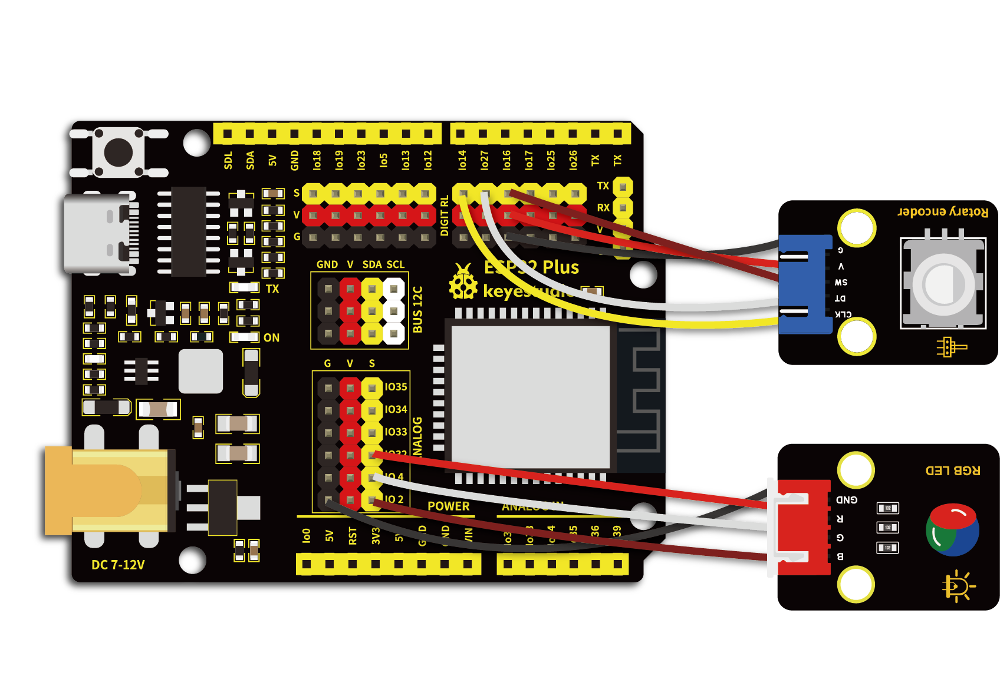

   img

1.4 在线运行代码

上传代码前先添加库。打开Thonny，在文件管理框单击“\ **此电脑**\ ”，双击“\ **（D:）**\ ”，然后双击展开“\ **代码**\ ”文件夹。展开“\ **49
Encoder control
RGB**\ ”文件夹，右键单击“\ **rotary.py**\ ”，选择“\ **上传到/**\ ”，等待被上传到ESP32。然后继续右键单击“\ **rotary_irq_rp2.py**\ ”，选择“\ **上传到/**\ ”，等待被上传到ESP32。

上传完成后双击打开代码文件’’\ **lesson_49_Encoder_control_RGB.py**\ ”。

.. code:: python

   import time
   from rotary_irq_rp2 import RotaryIRQ
   from machine import Pin, PWM

   pwm_r = PWM(Pin(32)) 
   pwm_g = PWM(Pin(4))
   pwm_b = PWM(Pin(2))

   pwm_r.freq(1000)
   pwm_g.freq(1000)
   pwm_b.freq(1000)

   def light(red, green, blue):
       pwm_r.duty(red)
       pwm_g.duty(green)
       pwm_b.duty(blue)

   SW=Pin(16,Pin.IN,Pin.PULL_UP)
   r = RotaryIRQ(pin_num_clk=14,
                 pin_num_dt=27,
                 min_val=0,
                 reverse=False,
                 range_mode=RotaryIRQ.RANGE_UNBOUNDED)

   while True:
       val = r.value()
       print(val%3)
       if val%3 == 0:
           light(1023, 0, 0)
       elif val%3 == 1:
           light(0, 1023, 0)
       elif val%3 == 2:
           light(0, 0, 1023)
       time.sleep(0.1)

1.5 实验结果

按照接线图正确接好模块，用USB线连接到计算机上电，单击\ |1305|\ 来执行程序代码。代码开始执行，任意方向旋转编码器，
Shell
窗口打印出对应余数；RGB模块上的LED显示余数对应的颜色：余数0显示红色、余数1显示绿色、余数2显示蓝色。按下旋转编码器，RGB模块上LED保持当前颜色不变。

单击\ |1311|\ 或按Ctrl+C退出程序。

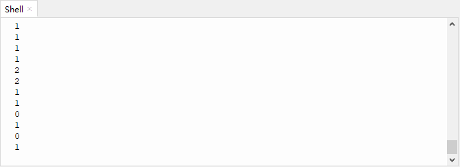

   img

项目五十 电位器调节灯光亮度
~~~~~~~~~~~~~~~~~~~~~~~~~~~

1.1 项目介绍

从前面的课程实验中我们学习了设计呼吸灯和按键控制LED灯。在这一实验课程中我们尝试将呼吸灯和按键控制LED灯这两个实验现象组合起来，用可调电位器代替按键，实现利用旋转可调电位器读取到的模拟值控制紫色LED亮度的效果。可调电位器模拟值的范围是0
~ 4095；LED的亮度由PWM值控制，范围为0 ~ 255。

1.2 实验组件

+-------------+------------------+-------------+----------------+------------+
| |image222|  | |image223|       | |image224|  | |image225|     | |image226| |
+=============+==================+=============+================+============+
| ESP32       | Keyes            | Keyes       | XH2.54-3P      | USB线 x1   |
| Plus主板 x1 | 旋转电位器传感器 | 紫色LED模块 | 转杜邦线母单线 |            |
|             | x1               | x1          | x2             |            |
+-------------+------------------+-------------+----------------+------------+

1.3 模块接线图

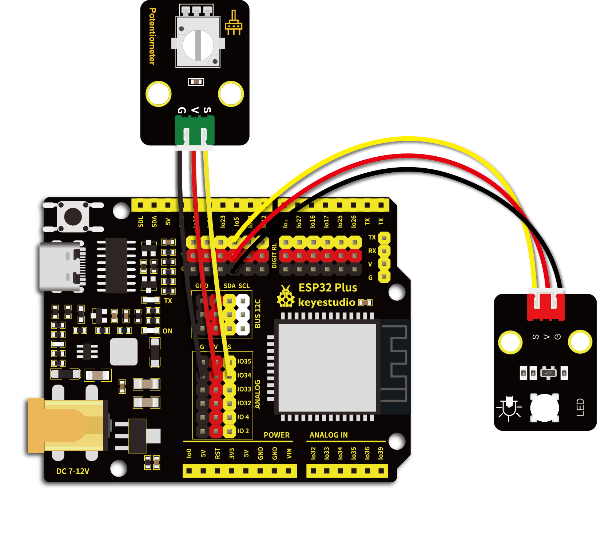

   img

1.4 在线运行代码

打开Thonny并单击\ |1303|\ ，然后单击“\ **此电脑**\ ”。

选中“\**D::raw-latex:`\代码*`\*”路径，打开代码文件’’\ **lesson_50_adjust_the_light.py**\ ”。

.. code:: python

   from machine import Pin,PWM,ADC
   import time

   pwm =PWM(Pin(5,Pin.OUT),1000)
   adc=ADC(Pin(34))
   adc.atten(ADC.ATTN_11DB)
   adc.width(ADC.WIDTH_10BIT)

   try:
       while True:
           adcValue=adc.read()
           pwm.duty(adcValue) 
           print(adc.read())
           time.sleep_ms(100)
   except:
       pwm.deinit()

1.5 实验结果

按照接线图正确接好模块，用USB线连接到计算机上电，单击\ |1305|\ 来执行程序代码。代码开始执行，旋转电位器，可以调节紫色LED的亮度，“Shell”窗口打印出当前PWM的值。

单击\ |1311|\ 或按Ctrl+C退出程序。

.. figure:: ./media/501501.png
   :alt: img

   img

.. figure:: ./media/501502.png
   :alt: img

   img

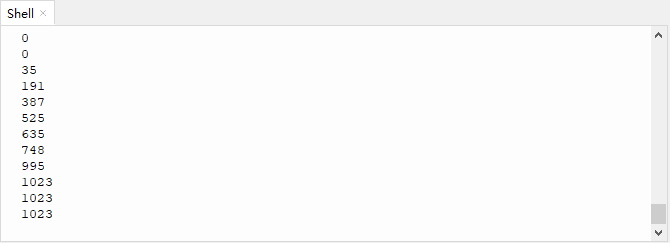

   img

项目五十一 模拟智能窗户
~~~~~~~~~~~~~~~~~~~~~~~

1.1 项目介绍

生活中能看到各种各样的智能产品，例如智能窗帘、智能窗户、智能电视、智能灯光等等。这一课我们来学习做一个智能窗帘，利用水滴水蒸气传感器模块检测雨水，然后通过设置舵机的角度来达到关窗和开窗的效果。

当然，这只是我们模拟的一个场景，主要用于加深我们的印象，达到对模块学以致用的效果。现实生活中，智能窗户并不是使用舵机来开关的。

1.2 实验组件

+-------------+-------------+---------------+----------------+------------+
| |image227|  | |image228|  | |image229|    | |image230|     | |image231| |
+=============+=============+===============+================+============+
| ESP32       | Keyes       | 9G            | XH2.54-3P      | USB线 x1   |
| Plus主板 x1 | 水滴传感器  | 180度数字舵机 | 转杜邦线母单线 |            |
|             | x1          | x1            | x1             |            |
+-------------+-------------+---------------+----------------+------------+

1.3 模块接线图

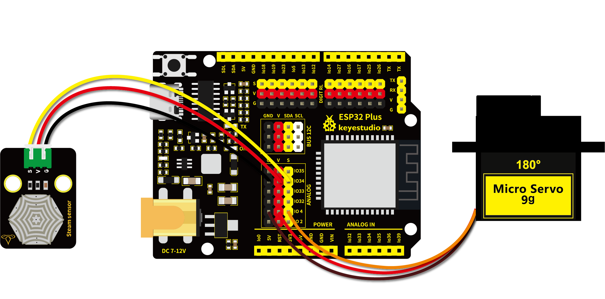

   img

1.4 在线运行代码

打开Thonny并单击\ |1303|\ ，然后单击“\ **此电脑**\ ”。

选中“\**D::raw-latex:`\代码*`\*”路径，打开代码文件’’\ **lesson_51_Smart_window.py**\ ”。

.. code:: python

   ### 导入引脚和ADC模块
   from machine import ADC,Pin,PWM
   import time 

   ### 开启并配置ADC，量程为0-3.3V
   adc=ADC(Pin(34))
   adc.atten(ADC.ATTN_11DB)
   adc.width(ADC.WIDTH_12BIT)

   pwm = PWM(Pin(4))#转向销连接到GP4
   pwm.freq(50)#20ms周期，所以频率为50Hz
   '''
   占空比对应的角度
   0°----2.5%----25
   45°----5%----51.2
   90°----7.5%----77
   135°----10%----102.4
   180°----12.5%----128
   考虑到误差，占空比设为1000~9000，可平稳旋转0~180度
   '''
   angle_0 = 25
   angle_90 = 77
   angle_180 = 128
       
   while True:
       adcVal=adc.read()
       print(adcVal)
       if adcVal > 2000:
           pwm.duty(angle_0)
           time.sleep(0.5)
       else:
           pwm.duty(angle_180)
           time.sleep(0.5)

1.5 实验结果

按照接线图正确接好模块，用USB线连接到计算机上电，单击\ |1305|\ 来执行程序代码。代码开始执行，当水滴传感器检测到一定水量（大于2000)，舵机转动达到关窗的效果。否则舵机转动到另一个角度，达到开窗的效果。

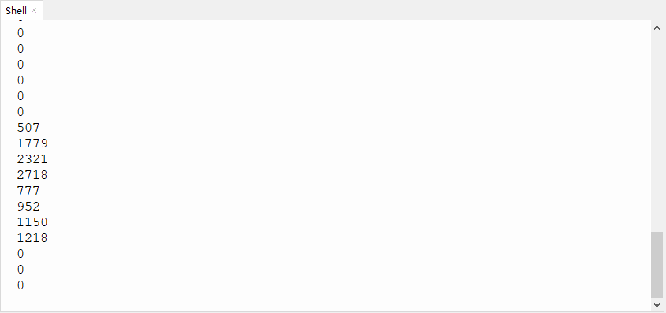

   img

1.6 代码说明

这一课代码设置和前面课程类似，通过设置一个阈值（阈值2000可以根据实际情况适当的更改）来控制舵机，当超过这个阈值时转动舵机，模拟关窗的效果。

项目五十二 声控灯
~~~~~~~~~~~~~~~~~

1.1 项目介绍

如今智能家居发展迅速，你使用过智能家居当中的智能声控灯吗？当我们跺跺脚或者拍拍手时，智能声控灯自动亮起；当没有声音时，智能声控灯处于熄灭状态。智能声控灯上安装有声音探测传感器，这些传感器将外界声音的大小，转换成对应数值。智能声控灯设置一个临界点，当声音转换后对应的数值超过该临界点时，灯光亮起一段时间。

在这一实验课程中，我们将声音传感器和紫色LED模块组合实验，学习制作一个最简单的智能声控灯。

1.2 实验组件

+-------------+-------------+-------------+----------------+------------+
| |image232|  | |image233|  | |image234|  | |image235|     | |image236| |
+=============+=============+=============+================+============+
| ESP32       | Keyes       | Keyes       | XH2.54-3P      | USB线 x1   |
| Plus主板 x1 | 声音传感器  | 紫色LED模块 | 转杜邦线母单线 |            |
|             | x1          | x1          | x2             |            |
+-------------+-------------+-------------+----------------+------------+

1.3 模块接线图

.. figure:: ./media/521301.png
   :alt: img

   img

1.4 在线运行代码

打开Thonny并单击\ |1303|\ ，然后单击“\ **此电脑**\ ”。

选中“\**D::raw-latex:`\代码*`\*”路径，打开代码文件’’\ **lesson_52_sound_controlled_lights.py**\ ”。

.. code:: python

   from machine import ADC, Pin
   import time
    
   ### 开启并配置ADC，量程为0-3.3V
   adc=ADC(Pin(34))
   adc.atten(ADC.ATTN_11DB)
   adc.width(ADC.WIDTH_12BIT)

   led = Pin(5,Pin.OUT)

   while True: 
       adcVal=adc.read()
       if adcVal > 400:
           led.value(1)
           print(adcVal, "led on")
           time.sleep(3)
       else:
           led.value(0)
           print(adcVal, "led off")
           time.sleep(0.1)

1.5 实验结果

按照接线图正确接好模块，用USB线连接到计算机上电，单击\ |1305|\ 来执行程序代码。代码开始执行，“Shell”窗口打印出声音传感器接收到的声音对应的ADC值，接收到的声音增大时ADC值也增大，当ADC值大于400时，LED模块上LED亮起3秒，然后熄灭。

单击\ |1311|\ 或按Ctrl+C退出程序。

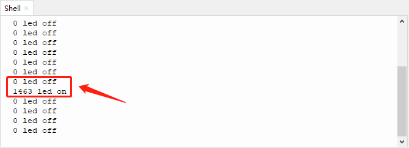

   img

项目五十三 火焰报警
~~~~~~~~~~~~~~~~~~~

1.1 项目介绍

生活中，火灾的危害是相当大的。这一课我们来学习制作一个火灾报警系统，它虽然简单，但却是非常具有意义的。原理很简单，利用火焰传感器检测，检测的结果控制一个有源蜂鸣器响起。

1.2 实验组件

+------------------------+------------------------+--------------------+
| |image237|             | |image238|             | |image239|         |
+========================+========================+====================+
| ESP32 Plus主板 x1      | Keyes 有源蜂鸣器模块   | Keyes 火焰传感器   |
|                        | x1                     | x1                 |
+------------------------+------------------------+--------------------+
| |image240|             | |image241|             | |image242|         |
+------------------------+------------------------+--------------------+
| XH2.54-3P              | XH2.54-4P              | USB线 x1           |
| 转杜邦线母单线 x1      | 转杜邦线母单线 x1      |                    |
+------------------------+------------------------+--------------------+

1.3 模块接线图

.. figure:: ./media/531301.png
   :alt: img

   img

1.4 在线运行代码

打开Thonny并单击\ |1303|\ ，然后单击“\ **此电脑**\ ”。

选中“\**D::raw-latex:`\代码*`\*”路径，打开代码文件’’\ **lesson_53_Flame_alarm.py**\ ”。

.. code:: python

   from machine import Pin
   import time

   buzzer = Pin(15, Pin.OUT)
   sensor = Pin(4, Pin.IN)
    
   while True:
       Val = sensor.value()
       print(Val)
       if Val == 0:
           buzzer.value(1)
       else:
           buzzer.value(0)
       time.sleep(0.5)

1.5 实验结果

按照接线图正确接好模块，用USB线连接到计算机上电，单击\ |1305|\ 来执行程序代码。代码开始执行，此时火焰传感器上的红色LED2点亮。旋转火焰传感器上的电位器，微调使传感器上红色LED1灯介于亮与不亮之间的\ **不亮**\ 状态。

   img

当火焰传感器检测到火焰时，有源蜂鸣器响起，否则有源蜂鸣器不响。

项目五十四 烟雾报警器
~~~~~~~~~~~~~~~~~~~~~

1.1 项目介绍

在前面课程中，我们学习了如何使用有源蜂鸣器模块、学习了如何使用MQ-2
烟雾传感器检测可燃气体、还学会了如何控制四位数码管显示数字或字符。这一课程，我们尝试着将这三个实验结合在一起，制作一个烟雾报警器。制作思路是通过烟雾传感器测试出可燃气体的浓度，然后利用检测结果控制有源蜂鸣器报警、四位数码管显示检测到的值。

1.2 实验组件

+------------------+------------------+----------------+----------------+
| |image243|       | |image244|       | |image245|     | |image246|     |
+==================+==================+================+================+
| ESP32 Plus主板   | Keyes            | Keyes          | Keyes          |
| x1               | 有源蜂鸣器模块   | 模拟气体传感器 | 四位数码管模块 |
|                  | x1               | x1             | x1             |
+------------------+------------------+----------------+----------------+
| |image247|       | |image248|       | |image249|     |                |
+------------------+------------------+----------------+----------------+
| XH2.54-3P        | XH2.54-4P        | USB线 x1       |                |
| 转杜邦线母单线   | 转杜邦线母单线   |                |                |
| x1               | x2               |                |                |
+------------------+------------------+----------------+----------------+

1.3 模块接线图

.. figure:: media/541301.png
   :alt: 541301

   541301

1.4 在线运行代码

打开Thonny并单击\ |1303|\ ，然后单击“\ **此电脑**\ ”。

选中“\**D::raw-latex:`\代码*`\*”路径，打开代码文件’’\ **lesson_54_smoke_alarm.py**\ ”。

.. code:: python

   ### 导入引脚和ADC模块
   from machine import ADC,Pin
   import time

   ### 开启并配置ADC，量程为0-3.3V
   adc=ADC(Pin(34))
   adc.atten(ADC.ATTN_11DB)
   adc.width(ADC.WIDTH_12BIT)

   buzzer = Pin(5, Pin.OUT)
   ### TM1650的定义
   ADDR_DIS = 0x48  #加密模式命令
   ADDR_KEY = 0x49  #读键值命令

   ### 亮度的定义
   BRIGHT_DARKEST = 0
   BRIGHT_TYPICAL = 2
   BRIGHTEST      = 7

   on  = 1
   off = 0

   ### number:0~9
   NUM = [0x3f,0x06,0x5b,0x4f,0x66,0x6d,0x7d,0x07,0x7f,0x6f] 
   ### DIG = [0x68,0x6a,0x6c,0x6e]
   DIG = [0x6e,0x6c,0x6a,0x68]
   DOT = [0,0,0,0]

   clkPin = 22
   dioPin = 21
   clk = Pin(clkPin, Pin.OUT)
   dio = Pin(dioPin, Pin.OUT)

   DisplayCommand = 0

   def writeByte(wr_data):
       global clk,dio
       for i in range(8):
           if(wr_data & 0x80 == 0x80):
               dio.value(1)
           else:
               dio.value(0)
           clk.value(0)
           time.sleep(0.0001)
           clk.value(1)
           time.sleep(0.0001)
           clk.value(0)
           wr_data <<= 1
       return

   def start():
       global clk,dio
       dio.value(1)
       clk.value(1)
       time.sleep(0.0001)
       dio.value(0)
       return
       
   def ack():
       global clk,dio
       dy = 0
       clk.value(0)
       time.sleep(0.0001)
       dio = Pin(dioPin, Pin.IN)
       while(dio.value() == 1):
           time.sleep(0.0001)
           dy += 1
           if(dy>5000):
               break
       clk.value(1)
       time.sleep(0.0001)
       clk.value(0)
       dio = Pin(dioPin, Pin.OUT)
       return
       
   def stop():
       global clk,dio
       dio.value(0)
       clk.value(1)
       time.sleep(0.0001)
       dio.value(1)
       return
       
   def displayBit(bit, num):
       global ADDR_DIS
       if(num > 9 and bit > 4):
           return
       start()
       writeByte(ADDR_DIS)
       ack()
       writeByte(DisplayCommand)
       ack()
       stop()
       start()
       writeByte(DIG[bit-1])
       ack()
       if(DOT[bit-1] == 1):
           writeByte(NUM[num] | 0x80)
       else:
           writeByte(NUM[num])
       ack()
       stop()
       return
       
   def clearBit(bit):
       if(bit > 4):
           return
       start()
       writeByte(ADDR_DIS)
       ack()
       writeByte(DisplayCommand)
       ack()
       stop()
       start()
       writeByte(DIG[bit-1])
       ack()
       writeByte(0x00)
       ack()
       stop()
       return
       
       
   def setBrightness(b = BRIGHT_TYPICAL):
       global DisplayCommand,brightness
       DisplayCommand = (DisplayCommand & 0x0f)+(b<<4)
       return

   def setMode(segment = 0):
       global DisplayCommand
       DisplayCommand = (DisplayCommand & 0xf7)+(segment<<3)
       return
       
   def displayOnOFF(OnOff = 1):
       global DisplayCommand
       DisplayCommand = (DisplayCommand & 0xfe)+OnOff
       return

   def displayDot(bit, OnOff):
       if(bit > 4):
           return
       if(OnOff == 1): 
           DOT[bit-1] = 1;
       else:
           DOT[bit-1] = 0;
       return
           
   def InitDigitalTube():
       setBrightness(2)
       setMode(0)
       displayOnOFF(1)
       for _ in range(4):
           clearBit(_)
       return

   def ShowNum(num): #0~9999
       displayBit(1,num%10)
       if(num < 10):
           clearBit(2)
           clearBit(3)
           clearBit(4)
       if(num > 9 and num < 100):
           displayBit(2,num//10%10)
           clearBit(3)
           clearBit(4)
       if(num > 99 and num < 1000):
           displayBit(2,num//10%10)
           displayBit(3,num//100%10)
           clearBit(4)
       if(num > 999 and num < 10000):
           displayBit(2,num//10%10)
           displayBit(3,num//100%10)
           displayBit(4,num//1000)

   InitDigitalTube()

   while True:
       adcVal=adc.read()
       print(adcVal) 
       ShowNum(adcVal)
       if adcVal > 1000:
           buzzer.value(1)
       else:
           buzzer.value(0)
       time.sleep(0.1)

1.5 实验结果

按照接线图正确接好模块，用USB线连接到计算机上电，单击\ |1305|\ 来执行程序代码。代码开始执行，当传感器检测到可燃气体浓度超标（ADC值大于1000)时，有源蜂鸣器模块发出警报，四位数码管显示浓度值。

.. figure:: media/541501.png
   :alt: 541501

   541501

.. figure:: media/541502.png
   :alt: 541502

   541502

项目五十五 酒精报警器
~~~~~~~~~~~~~~~~~~~~~

1.1 项目介绍

在上一课程中，我们制作了烟雾报警器，这一课利用同样的原理，使用有源蜂鸣器模块，MQ-3
酒精传感器，四位数码管制作一个酒精报警器。通过酒精传感器测试出酒精浓度，然后利用浓度大小控制有源蜂鸣器发出警报、四位数码管显示浓度值。从而达到酒精检测仪的模拟效果。

1.2 实验组件

+------------------+------------------+---------------+----------------+
| |image250|       | |image251|       | |image252|    | |image253|     |
+==================+==================+===============+================+
| ESP32 Plus主板   | Keyes            | Keyes         | Keyes          |
| x1               | 有源蜂鸣器模块   | 酒精传感器 x1 | 四位数码管模块 |
|                  | x1               |               | x1             |
+------------------+------------------+---------------+----------------+
| |image254|       | |image255|       | |image256|    |                |
+------------------+------------------+---------------+----------------+
| XH2.54-3P        | XH2.54-4P        | USB线 x1      |                |
| 转杜邦线母单线   | 转杜邦线母单线   |               |                |
| x1               | x2               |               |                |
+------------------+------------------+---------------+----------------+

1.3 模块接线图

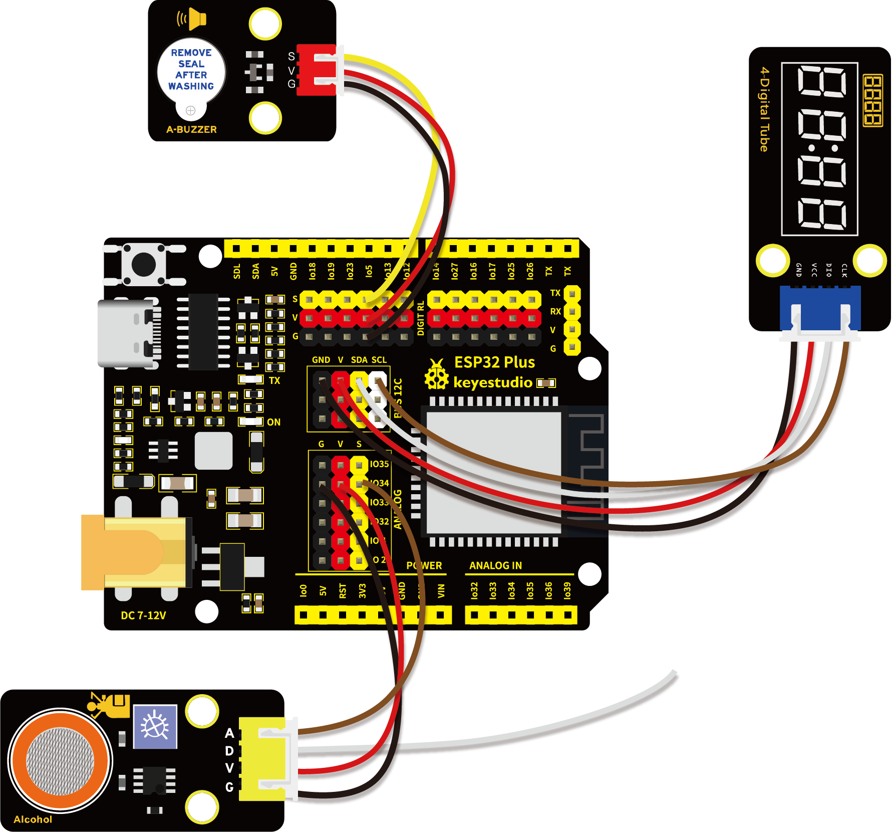

   img

1.4 实验代码

打开Thonny并单击\ |1303|\ ，然后单击“\ **此电脑**\ ”。

选中“\**D::raw-latex:`\代码*`\*”路径，打开代码文件’’\ **lesson_55_breathalyzer.py**\ ”。

.. code:: python

   ### 导入引脚和ADC模块
   from machine import ADC,Pin
   import time

   adc=ADC(Pin(34))
   adc.atten(ADC.ATTN_11DB)
   adc.width(ADC.WIDTH_12BIT)

   buzzer = Pin(5, Pin.OUT)
   ### TM1650的定义
   ADDR_DIS = 0x48  #加密模式命令 
   ADDR_KEY = 0x49  #读键值命令

   ### 亮度的定义
   BRIGHT_DARKEST = 0
   BRIGHT_TYPICAL = 2
   BRIGHTEST      = 7

   on  = 1
   off = 0

   ### number:0~9
   NUM = [0x3f,0x06,0x5b,0x4f,0x66,0x6d,0x7d,0x07,0x7f,0x6f] 
   ### DIG = [0x68,0x6a,0x6c,0x6e]
   DIG = [0x6e,0x6c,0x6a,0x68]
   DOT = [0,0,0,0]

   clkPin = 22
   dioPin = 21
   clk = Pin(clkPin, Pin.OUT)
   dio = Pin(dioPin, Pin.OUT)

   DisplayCommand = 0

   def writeByte(wr_data):
       global clk,dio
       for i in range(8):
           if(wr_data & 0x80 == 0x80):
               dio.value(1)
           else:
               dio.value(0)
           clk.value(0)
           time.sleep(0.0001)
           clk.value(1)
           time.sleep(0.0001)
           clk.value(0)
           wr_data <<= 1
       return

   def start():
       global clk,dio
       dio.value(1)
       clk.value(1)
       time.sleep(0.0001)
       dio.value(0)
       return
       
   def ack():
       global clk,dio
       dy = 0
       clk.value(0)
       time.sleep(0.0001)
       dio = Pin(dioPin, Pin.IN)
       while(dio.value() == 1):
           time.sleep(0.0001)
           dy += 1
           if(dy>5000):
               break
       clk.value(1)
       time.sleep(0.0001)
       clk.value(0)
       dio = Pin(dioPin, Pin.OUT)
       return
       
   def stop():
       global clk,dio
       dio.value(0)
       clk.value(1)
       time.sleep(0.0001)
       dio.value(1)
       return
       
   def displayBit(bit, num):
       global ADDR_DIS
       if(num > 9 and bit > 4):
           return
       start()
       writeByte(ADDR_DIS)
       ack()
       writeByte(DisplayCommand)
       ack()
       stop()
       start()
       writeByte(DIG[bit-1])
       ack()
       if(DOT[bit-1] == 1):
           writeByte(NUM[num] | 0x80)
       else:
           writeByte(NUM[num])
       ack()
       stop()
       return
       
   def clearBit(bit):
       if(bit > 4):
           return
       start()
       writeByte(ADDR_DIS)
       ack()
       writeByte(DisplayCommand)
       ack()
       stop()
       start()
       writeByte(DIG[bit-1])
       ack()
       writeByte(0x00)
       ack()
       stop()
       return
       
       
   def setBrightness(b = BRIGHT_TYPICAL):
       global DisplayCommand,brightness
       DisplayCommand = (DisplayCommand & 0x0f)+(b<<4)
       return

   def setMode(segment = 0):
       global DisplayCommand
       DisplayCommand = (DisplayCommand & 0xf7)+(segment<<3)
       return
       
   def displayOnOFF(OnOff = 1):
       global DisplayCommand
       DisplayCommand = (DisplayCommand & 0xfe)+OnOff
       return

   def displayDot(bit, OnOff):
       if(bit > 4):
           return
       if(OnOff == 1): 
           DOT[bit-1] = 1;
       else:
           DOT[bit-1] = 0;
       return
           
   def InitDigitalTube():
       setBrightness(2)
       setMode(0)
       displayOnOFF(1)
       for _ in range(4):
           clearBit(_)
       return

   def ShowNum(num): #0~9999
       displayBit(1,num%10)
       if(num < 10):
           clearBit(2)
           clearBit(3)
           clearBit(4)
       if(num > 9 and num < 100):
           displayBit(2,num//10%10)
           clearBit(3)
           clearBit(4)
       if(num > 99 and num < 1000):
           displayBit(2,num//10%10)
           displayBit(3,num//100%10)
           clearBit(4)
       if(num > 999 and num < 10000):
           displayBit(2,num//10%10)
           displayBit(3,num//100%10)
           displayBit(4,num//1000)

   InitDigitalTube()

   while True:
       adcVal=adc.read() 
       print(adcVal)
       ShowNum(adcVal)
       if adcVal > 1000:
           buzzer.value(1)
       else:
           buzzer.value(0)
       time.sleep(0.1)

1.5 实验结果

按照接线图正确接好模块，用USB线连接到计算机上电，单击\ |1305|\ 来执行程序代码。

当传感器检测到可燃气体浓度超标（ADC值大于1000)时，有源蜂鸣器模块发出警报，四位数码管显示浓度值。

.. figure:: media/551501.png
   :alt: 551501

   551501

项目五十六 超声波雷达
~~~~~~~~~~~~~~~~~~~~~

1.1 项目介绍

蝙蝠飞行与获取猎物是通过回声定位的。回声定位：某些动物能通过口腔或鼻腔把从喉部产生的超声波发射出去，利用折回的声音来定向，这种空间定向的方法称为回声定位。科学家们从蝙蝠身上得到的启示发明了雷达，即雷达的天线相当于蝙蝠的嘴,而天线发出的无线电波就相当于蝙蝠的超声波,雷达接收电波的荧光屏就相当于蝙蝠的耳朵。

这一课我们就来学习制作一个简易雷达。将HC-SR04 超声波传感器、8002b功放
喇叭模块、共阴RGB模块和TM1650四位数码管模块组合实验，利用距离大小控制功放喇叭模块模块响起对应频率的声音、RGB亮起对应颜色，然后把这个距离显示在四位数码管上。这样就搭建好了一个简易的超声波雷达系统。

1.2 实验组件

+----------------------+----------------------+-----------------------+
| |image257|           | |image258|           | |image259|            |
+======================+======================+=======================+
| ESP32 Plus主板 x1    | HC-SR04 超声波传感器 | Keyes 超声波转接模块  |
|                      | x1                   | x1                    |
+----------------------+----------------------+-----------------------+
| |image260|           | |image261|           | |image262|            |
+----------------------+----------------------+-----------------------+
| Keyes 8002b功放      | Keyes 共阴RGB模块 x1 | Keyes                 |
| 喇叭模块 x1          |                      | TM1650四位数码管模块  |
|                      |                      | x1                    |
+----------------------+----------------------+-----------------------+
| |image263|           | |image264|           | |image265|            |
+----------------------+----------------------+-----------------------+
| XH2.54-3P            | XH2.54-4P            | USB线 x1              |
| 转杜邦线母单线 x1    | 转杜邦线母单线 x3    |                       |
+----------------------+----------------------+-----------------------+

1.3 模块接线图

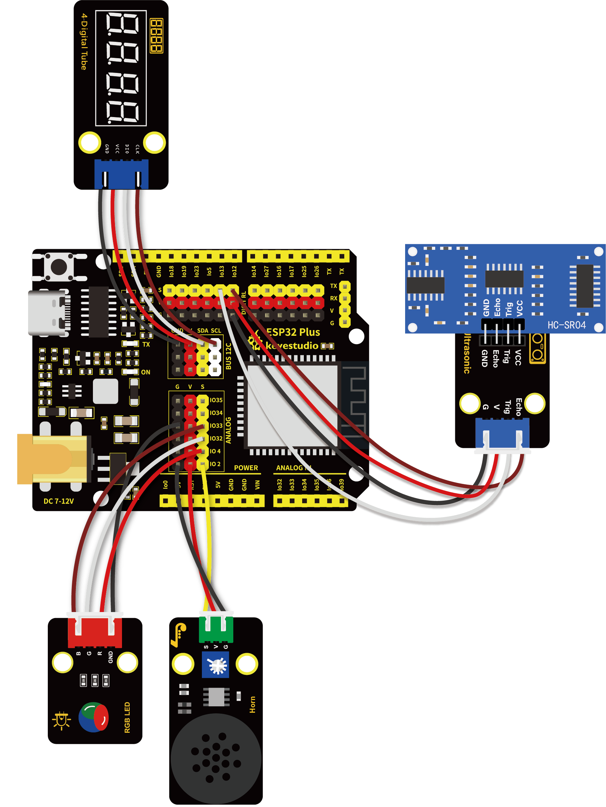

   561301

1.4 在线运行代码

打开Thonny并单击\ |1303|\ ，然后单击“\ **此电脑**\ ”。

选中“\**D::raw-latex:`\代码*`\*”路径，打开代码文件’’\ **lesson_56_Ultrasonic_radar.py**\ ”。

.. code:: python

   from machine import Pin, PWM
   import utime
    
   ### TM1650的定义
   ADDR_DIS = 0x48  #mode command
   ADDR_KEY = 0x49  #read key value command

   ### 亮度的定义
   BRIGHT_DARKEST = 0
   BRIGHT_TYPICAL = 2
   BRIGHTEST      = 7

   on  = 1
   off = 0

   ### number:0~9
   NUM = [0x3f,0x06,0x5b,0x4f,0x66,0x6d,0x7d,0x07,0x7f,0x6f] 
   DIG = [0x6e,0x6c,0x6a,0x68]
   DOT = [0,0,0,0]

   clkPin = 22
   dioPin = 21
   clk = Pin(clkPin, Pin.OUT)
   dio = Pin(dioPin, Pin.OUT)

   DisplayCommand = 0

   def writeByte(wr_data):
       global clk,dio
       for i in range(8):
           if(wr_data & 0x80 == 0x80):
               dio.value(1)
           else:
               dio.value(0)
           clk.value(0)
           utime.sleep(0.0001)
           clk.value(1)
           utime.sleep(0.0001)
           clk.value(0)
           wr_data <<= 1
       return

   def start():
       global clk,dio
       dio.value(1)
       clk.value(1)
       utime.sleep(0.0001)
       dio.value(0)
       return
       
   def ack():
       global clk,dio
       dy = 0
       clk.value(0)
       utime.sleep(0.0001)
       dio = Pin(dioPin, Pin.IN)
       while(dio.value() == 1):
           utime.sleep(0.0001)
           dy += 1
           if(dy>5000):
               break
       clk.value(1)
       utime.sleep(0.0001)
       clk.value(0)
       dio = Pin(dioPin, Pin.OUT)
       return
       
   def stop():
       global clk,dio
       dio.value(0)
       clk.value(1)
       utime.sleep(0.0001)
       dio.value(1)
       return
       
   def displayBit(bit, num):
       global ADDR_DIS
       if(num > 9 and bit > 4):
           return
       start()
       writeByte(ADDR_DIS)
       ack()
       writeByte(DisplayCommand)
       ack()
       stop()
       start()
       writeByte(DIG[bit-1])
       ack()
       if(DOT[bit-1] == 1):
           writeByte(NUM[num] | 0x80)
       else:
           writeByte(NUM[num])
       ack()
       stop()
       return
       
   def clearBit(bit):
       if(bit > 4):
           return
       start()
       writeByte(ADDR_DIS)
       ack()
       writeByte(DisplayCommand)
       ack()
       stop()
       start()
       writeByte(DIG[bit-1])
       ack()
       writeByte(0x00)
       ack()
       stop()
       return
       
       
   def setBrightness(b = BRIGHT_TYPICAL):
       global DisplayCommand,brightness
       DisplayCommand = (DisplayCommand & 0x0f)+(b<<4)
       return

   def setMode(segment = 0):
       global DisplayCommand
       DisplayCommand = (DisplayCommand & 0xf7)+(segment<<3)
       return
       
   def displayOnOFF(OnOff = 1):
       global DisplayCommand
       DisplayCommand = (DisplayCommand & 0xfe)+OnOff
       return

   def displayDot(bit, OnOff):
       if(bit > 4):
           return
       if(OnOff == 1): 
           DOT[bit-1] = 1;
       else:
           DOT[bit-1] = 0;
       return
           
   def InitDigitalTube():
       setBrightness(2)
       setMode(0)
       displayOnOFF(1)
       for _ in range(4):
           clearBit(_)
       return

   def ShowNum(num): #0~9999
       displayBit(1,num%10)
       if(num < 10):
           clearBit(2)
           clearBit(3)
           clearBit(4)
       if(num > 9 and num < 100):
           displayBit(2,num//10%10)
           clearBit(3)
           clearBit(4)
       if(num > 99 and num < 1000):
           displayBit(2,num//10%10)
           displayBit(3,num//100%10)
           clearBit(4)
       if(num > 999 and num < 10000):
           displayBit(2,num//10%10)
           displayBit(3,num//100%10)
           displayBit(4,num//1000)

   pwm_r = PWM(Pin(4)) 
   pwm_g = PWM(Pin(32))
   pwm_b = PWM(Pin(33))

   pwm_r.freq(1000)
   pwm_g.freq(1000)
   pwm_b.freq(1000)

   def light(red, green, blue):
       pwm_r.duty(red)
       pwm_g.duty(green)
       pwm_b.duty(blue)

   #超声波测距，单位:厘米
   def getDistance(trigger, echo):
       # 产生10us方波
       trigger.value(0)   #事先给一个短的低电平，以确保一个干净的高脉冲;
       utime.sleep_us(2)
       trigger.value(1)
       utime.sleep_us(10)#拉高后，等待10微秒，立即调低
       trigger.value(0)
       
       while echo.value() == 0: #建立while循环，检测回波引脚值是否为0，并记录此时的时间
           start = utime.ticks_us()
       while echo.value() == 1: #建立while循环，检查回波引脚值是否为1，并记录此时的时间
           end = utime.ticks_us()
       d = (end - start) * 0.0343 / 2 #声波的传播时间x声速(343.2 m/s, 0.0343 cm/微秒)，再除以来回距离2
       return d

   ### 设置引脚
   trigger = Pin(13, Pin.OUT)
   echo = Pin(12, Pin.IN)

   buzzer = PWM(Pin(2))
   def playtone(frequency):
       buzzer.duty(1000)
       buzzer.freq(frequency)

   def bequiet():
       buzzer.duty(0)
       
   ### 主程序
   InitDigitalTube()
   while True:
       distance = int(getDistance(trigger, echo))
       ShowNum(distance)
       if distance <= 10:
           playtone(880)
           utime.sleep(0.1)
           bequiet() 
           light(1023, 0, 0)
       elif distance <= 20:
           playtone(532)
           utime.sleep(0.2)
           bequiet()
           light(0, 0, 1023)
       else:
           light(0, 1023, 0)

1.5 实验结果

按照接线图正确接好模块，用USB线连接到计算机上电，单击\ |1305|\ 来执行程序代码。代码开始执行，当超声波传感器检测到障碍物距离范围在10cm
以内时，RGB
LED灯亮红色，并将检测到障碍物的距离显示在四位数码管上。同时8002b功放
喇叭模块发出频率较快的声响，起到提示的作用。

.. figure:: ./media/561501.png
   :alt: img

   img

当超声波传感器检测到障碍物距离范围在10cm ~ 20cm 以内时，RGB
LED灯亮绿色，并将检测到障碍物的距离显示在四位数码管上。同时8002b功放
喇叭模块发出声响，起到提示的作用。

.. figure:: ./media/561502.png
   :alt: img

   img

当超声波传感器检测到障碍物距离范围在20cm 以外时，RGB
LED灯亮蓝色，并将检测到障碍物的距离显示在四位数码管上。

.. figure:: ./media/561503.png
   :alt: img

   img

项目五十七 红外遥控灯
~~~~~~~~~~~~~~~~~~~~~

1.1 项目介绍

在前面实验中，我们学会了点亮或熄灭LED、学会了利用PWM调节灯光的亮度、学会了使用红外接收模块，并将接收到的遥控器对应的键值打印出来。在这一实验课程中，我们将红外接收模块和紫色LED模块组合实验，实现用红外遥控器控制紫色LED的亮灭以及控制紫色LED显示不同亮度。

当红外接收模块接收到红外遥控器的按键值时，通过设置此按键值的输出PWM值实现设置不同LED亮度的效果，控制LED的亮灭也一样。

在这一实验课程中我们想要使用 “OK”
键这一个按键来控制LED亮和灭的两种情况该如何实现呢？这一实验课程我们将学习使用一个新的基本数据类型
—— boolean，来实现同一个按键控制LED亮灭的效果。

**boolean 数据类型**\ ，变量存储为 8位（1 个字节）的数值形式，\ **只能是
True 或是 False**\ 。boolean 变量的值显示为 True 或 False（在使用 Print
的时候），或者 #TRUE# 或 #FALSE#（在使用 Write #
的时候）。使用关键字True 与 False 可将 boolean
变量赋值为这两个状态中的一个。

设置代码，按下“OK”键且满足某一条件，点亮LED；按下“OK”键且满足另一条件，熄灭LED。这个条件我们用
boolean 来实现是最简单方便的，因为 boolean 只有 True 或是 False
两种状态。我们只需要设置按下“OK”键的同时 flag 为
true，即可点亮LED；同理按下“OK”键的同时 flag 为 false，熄灭LED。

1.2 实验组件

+--------------------------+-----------------------+-------------------+
| |image266|               | |image267|            | |image268|        |
+==========================+=======================+===================+
| ESP32 Plus主板 x1        | Keyes 红外接收模块 x1 | Keyes 紫色LED模块 |
|                          |                       | x1                |
+--------------------------+-----------------------+-------------------+
| |image269|               | |image270|            | |image271|        |
+--------------------------+-----------------------+-------------------+
| Keyes 遥控器 x1          | XH2.54-3P             | USB线 x1          |
|                          | 转杜邦线母单线 x2     |                   |
+--------------------------+-----------------------+-------------------+

1.3 模块接线图

.. figure:: ./media/571301.png
   :alt: img

   img

1.4 在线运行代码

打开Thonny并单击\ |1303|\ ，然后单击“\ **此电脑**\ ”。

选中“\**D::raw-latex:`\代码*`\*”路径，打开代码文件’’\ **lesson_57_IR_control_LED.py**\ ”。

.. code:: python

   import time
   from machine import Pin

   led = Pin(5, Pin.OUT)
   ird = Pin(35,Pin.IN)

   act = {"1": "LLLLLLLLHHHHHHHHLHHLHLLLHLLHLHHH","2": "LLLLLLLLHHHHHHHHHLLHHLLLLHHLLHHH","3": "LLLLLLLLHHHHHHHHHLHHLLLLLHLLHHHH",
          "4": "LLLLLLLLHHHHHHHHLLHHLLLLHHLLHHHH","5": "LLLLLLLLHHHHHHHHLLLHHLLLHHHLLHHH","6": "LLLLLLLLHHHHHHHHLHHHHLHLHLLLLHLH",
          "7": "LLLLLLLLHHHHHHHHLLLHLLLLHHHLHHHH","8": "LLLLLLLLHHHHHHHHLLHHHLLLHHLLLHHH","9": "LLLLLLLLHHHHHHHHLHLHHLHLHLHLLHLH",
          "0": "LLLLLLLLHHHHHHHHLHLLHLHLHLHHLHLH","Up": "LLLLLLLLHHHHHHHHLHHLLLHLHLLHHHLH","Down": "LLLLLLLLHHHHHHHHHLHLHLLLLHLHLHHH",
          "Left": "LLLLLLLLHHHHHHHHLLHLLLHLHHLHHHLH","Right": "LLLLLLLLHHHHHHHHHHLLLLHLLLHHHHLH","Ok": "LLLLLLLLHHHHHHHHLLLLLLHLHHHHHHLH",
          "*": "LLLLLLLLHHHHHHHHLHLLLLHLHLHHHHLH","#": "LLLLLLLLHHHHHHHHLHLHLLHLHLHLHHLH"}

   def read_ircode(ird):
       wait = 1
       complete = 0
       seq0 = []
       seq1 = []

       while wait == 1:
           if ird.value() == 0:
               wait = 0
       while wait == 0 and complete == 0:
           start = time.ticks_us()
           while ird.value() == 0:
               ms1 = time.ticks_us()
           diff = time.ticks_diff(ms1,start)
           seq0.append(diff)
           while ird.value() == 1 and complete == 0:
               ms2 = time.ticks_us()
               diff = time.ticks_diff(ms2,ms1)
               if diff > 10000:
                   complete = 1
           seq1.append(diff)

       code = ""
       for val in seq1:
           if val < 2000:
               if val < 700:
                   code += "L"
               else:
                   code += "H"
       # print(code)
       command = ""
       for k,v in act.items():
           if code == v:
               command = k
       if command == "":
           command = code
       return command

   flag = False
   while True:
   #     global flag
       command = read_ircode(ird)
       print(command, end = "  ")
       print(flag, end = "  ")
       if command == "Ok":
           if flag == True:
               led.value(1)
               flag = False
               print("led on") 
           else:
               led.value(0)
               flag = True
               print("led off")
       time.sleep(0.1)

1.5 实验结果

按照接线图正确接好模块，用USB线连接到计算机上电，单击\ |1305|\ 来执行程序代码。代码开始执行。第一次按下红外遥控器上的
“\ **OK**\ ”
键，此时的布尔变量“\ **flag**\ ”为真，紫色LED被点亮，实现开灯的效果。“Shell”窗口打印出“\ **OK
True led on**\ ” 。点亮后布尔变量“\ **flag**\ ”又被设置为假。

再次按下红外遥控器上的 “\ **OK**\ ”
键，布尔变量“\ **flag**\ ”在LED点亮后被设置为假，紫色LED熄灭，实现关灯的效果。“Shell”窗口打印出“\ **OK
False led off**\ ” 。

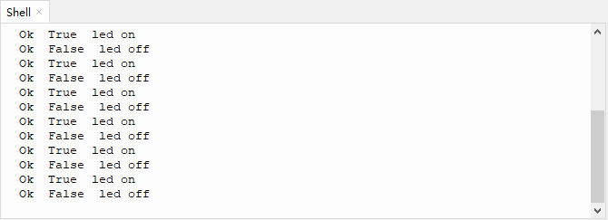

   img

项目五十八 模拟温度散热装置
~~~~~~~~~~~~~~~~~~~~~~~~~~~

1.1 项目介绍

生活中，我们的电脑或者电路板芯片等器件会由于工作时间过长或者功耗过大的问题而发热严重，所以我们常常需要一个散热装置。

在前面的课程我们学习了如何使用温度传感器和电机模块，这一课我们学习把它们结合起来做成一个智能散热装置。当检测到环境温度高于某一个值时的时候，电机开启，从而达到降低环境温度、散热效果。再把此刻的温度值显示在四位数码管中。

1.2 实验组件

+--------------------+-----------------------+------------------------+
| |image272|         | |image273|            | |image274|             |
+====================+=======================+========================+
| ESP32 Plus主板 x1  | Keyes 130电机模块 x1  | Keyes                  |
|                    |                       | TM1650四位数码管模块   |
|                    |                       | x1                     |
+--------------------+-----------------------+------------------------+
| |image275|         | |image276|            | |image277|             |
+--------------------+-----------------------+------------------------+
| Keyes              | XH2.54-3P             | XH2.54-4P              |
| 18B20温度传感器 x1 | 转杜邦线母单线 x1     | 转杜邦线母单线 x2      |
+--------------------+-----------------------+------------------------+
| |image278|         | |image279|            | |image280|             |
+--------------------+-----------------------+------------------------+
| USB线 x1           | 6节5号电池盒 x1       | 5号电池\ **(自备)** x6 |
+--------------------+-----------------------+------------------------+

1.3 模块接线图

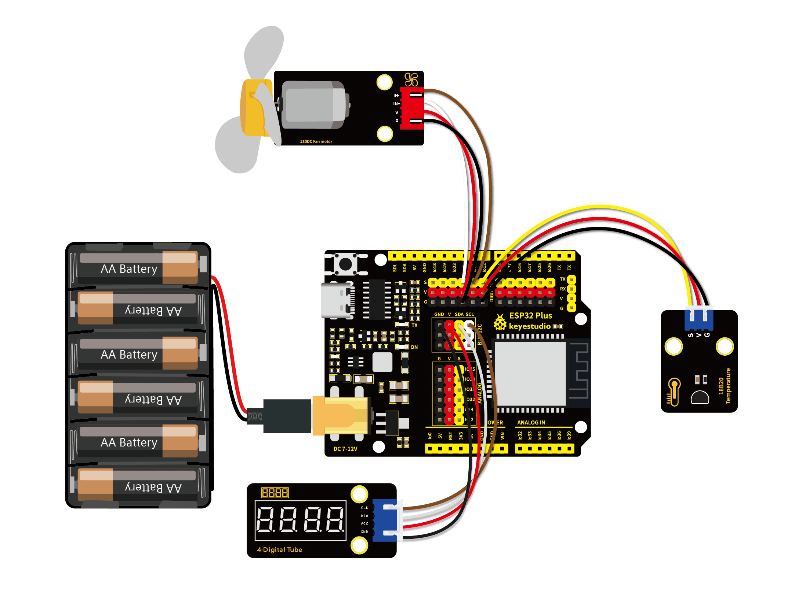

   img

1.4 在线运行代码

打开Thonny并单击\ |1303|\ ，然后单击“\ **此电脑**\ ”。

选中“\**D::raw-latex:`\代码*`\*”路径，打开代码文件’’\ **lesson_58_heat_abstractor.py**\ ”。

注意：在上传代码前先接好模块，否则代码可能上传不成功。

**若上传不成功，请查看是否添加了库。**

.. code:: python

   from machine import Pin
   import machine, onewire, ds18x20, time

   ds_pin = machine.Pin(12)

   ds_sensor = ds18x20.DS18X20(onewire.OneWire(ds_pin))

   roms = ds_sensor.scan()

   #电机的两个引脚
   INA = Pin(5, Pin.OUT) #INA对应IN+
   INB = Pin(13, Pin.OUT)#INB对应IN-
   # TM1650的定义
   ADDR_DIS = 0x48  #加密模式命令
   ADDR_KEY = 0x49  #读键值命令

   # 亮度的定义
   BRIGHT_DARKEST = 0
   BRIGHT_TYPICAL = 2
   BRIGHTEST      = 7

   on  = 1
   off = 0

   # number:0~9
   NUM = [0x3f,0x06,0x5b,0x4f,0x66,0x6d,0x7d,0x07,0x7f,0x6f] 
   # DIG = [0x68,0x6a,0x6c,0x6e]
   DIG = [0x6e,0x6c,0x6a,0x68]
   DOT = [0,0,0,0]

   clkPin = 22
   dioPin = 21
   clk = Pin(clkPin, Pin.OUT)
   dio = Pin(dioPin, Pin.OUT)

   DisplayCommand = 0

   def writeByte(wr_data):
       global clk,dio
       for i in range(8):
           if(wr_data & 0x80 == 0x80):
               dio.value(1)
           else:
               dio.value(0)
           clk.value(0)
           time.sleep(0.0001)
           clk.value(1)
           time.sleep(0.0001)
           clk.value(0)
           wr_data <<= 1
       return

   def start():
       global clk,dio
       dio.value(1)
       clk.value(1)
       time.sleep(0.0001)
       dio.value(0)
       return
       
   def ack():
       global clk,dio
       dy = 0
       clk.value(0)
       time.sleep(0.0001)
       dio = Pin(dioPin, Pin.IN)
       while(dio.value() == 1):
           time.sleep(0.0001)
           dy += 1
           if(dy>5000):
               break
       clk.value(1)
       time.sleep(0.0001)
       clk.value(0)
       dio = Pin(dioPin, Pin.OUT)
       return
       
   def stop():
       global clk,dio
       dio.value(0)
       clk.value(1)
       time.sleep(0.0001)
       dio.value(1)
       return
       
   def displayBit(bit, num):
       global ADDR_DIS
       if(num > 9 and bit > 4):
           return
       start()
       writeByte(ADDR_DIS)
       ack()
       writeByte(DisplayCommand)
       ack()
       stop()
       start()
       writeByte(DIG[bit-1])
       ack()
       if(DOT[bit-1] == 1):
           writeByte(NUM[num] | 0x80)
       else:
           writeByte(NUM[num])
       ack()
       stop()
       return
       
   def clearBit(bit):
       if(bit > 4):
           return
       start()
       writeByte(ADDR_DIS)
       ack()
       writeByte(DisplayCommand)
       ack()
       stop()
       start()
       writeByte(DIG[bit-1])
       ack()
       writeByte(0x00)
       ack()
       stop()
       return
       
       
   def setBrightness(b = BRIGHT_TYPICAL):
       global DisplayCommand,brightness
       DisplayCommand = (DisplayCommand & 0x0f)+(b<<4)
       return

   def setMode(segment = 0):
       global DisplayCommand
       DisplayCommand = (DisplayCommand & 0xf7)+(segment<<3)
       return
       
   def displayOnOFF(OnOff = 1):
       global DisplayCommand
       DisplayCommand = (DisplayCommand & 0xfe)+OnOff
       return

   def displayDot(bit, OnOff):
       if(bit > 4):
           return
       if(OnOff == 1): 
           DOT[bit-1] = 1;
       else:
           DOT[bit-1] = 0;
       return
           
   def InitDigitalTube():
       setBrightness(2)
       setMode(0)
       displayOnOFF(1)
       for _ in range(4):
           clearBit(_)
       return

   def ShowNum(num): #0~9999
       displayBit(1,num%10)
       if(num < 10):
           clearBit(2)
           clearBit(3)
           clearBit(4)
       if(num > 9 and num < 100):
           displayBit(2,num//10%10)
           clearBit(3)
           clearBit(4)
       if(num > 99 and num < 1000):
           displayBit(2,num//10%10)
           displayBit(3,num//100%10)
           clearBit(4)
       if(num > 999 and num < 10000):
           displayBit(2,num//10%10)
           displayBit(3,num//100%10)
           displayBit(4,num//1000)

   InitDigitalTube()
   print('Found DS devices: ', roms)

   while True:
       ds_sensor.convert_temp()
       time.sleep_ms(750)
       for rom in roms:
           value = ds_sensor.read_temp(rom)
           print(value)
           ShowNum(int(value))
           if value > 30:
               INA.value(0)
               INB.value(1)
           else:
               INA.value(0)
               INB.value(0)

1.5 实验结果

按照接线图正确接好模块，接好电池盒，用USB线连接到计算机上电，单击\ |1305|\ 来执行程序代码。代码开始执行，可以在四位数码管模块上看到当前温度值，当温度超过代码中设定的30°C时，风扇转动，散热。

.. figure:: ./media/581501.png
   :alt: img

   img

项目五十九 智能门禁系统
~~~~~~~~~~~~~~~~~~~~~~~

1.1 项目介绍

生活中，很多门禁系统都是使用射频模块进行开锁的，既方便又安全。这一课，学习利用RFID522刷卡模块和舵机设置一个智能门禁系统。

原理很简单，使用RFID522刷卡模块感应，使用IC卡或者钥匙卡来开锁，舵机的作用即门禁锁。

1.2 实验组件

+----------------+----------------+-------------------+--------------+
| |image281|     | |image282|     | |image283|        | |image284|   |
+================+================+===================+==============+
| ESP32 Plus主板 | Keyes          | 钥匙扣 x1         | USB线 x1     |
| x1             | RFID刷卡模块   |                   |              |
|                | x1             |                   |              |
+----------------+----------------+-------------------+--------------+
| |image285|     | |image286|     | |image287|        |              |
+----------------+----------------+-------------------+--------------+
| IC卡 x1        | 9G             | XH2.54-4P         |              |
|                | 180度数字舵机  | 转杜邦线母单线 x1 |              |
|                | x1             |                   |              |
+----------------+----------------+-------------------+--------------+

1.3 模块接线图

.. figure:: ./media/591301.png
   :alt: img

   img

1.4 实验代码

打开Thonny并单击\ |1303|\ ，然后单击“\ **此电脑**\ ”。

选中“\**D::raw-latex:`\代码*`\*”路径，打开代码文件’’\ **lesson_59_Intelligent_access_contro.py**\ ”。

**若上传不成功，请查看是否添加了库。**

**特别注意：对于不同的IC卡和钥匙扣，其读取的IC卡和钥匙扣的UID码值可能都不一样。在代码运行前，需要将你自己的IC卡和钥匙扣的UID码值替换程序代码中的UID码（UID码在第44课完成实验可以得知），替换位置如下图所示。**

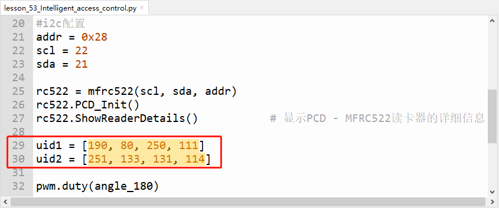

   img

.. code:: python

   from machine import Pin, PWM
   import time
   from mfrc522_i2c import mfrc522

   pwm = PWM(Pin(4))
   pwm.freq(50)

   '''
   占空比对应的角度
   0°----2.5%----25
   45°----5%----51.2
   90°----7.5%----77
   135°----10%----102.4
   180°----12.5%----128
   '''
   angle_0 = 25
   angle_90 = 77
   angle_180 = 128

   #i2c配置
   addr = 0x28
   scl = 22
   sda = 21
       
   rc522 = mfrc522(scl, sda, addr)
   rc522.PCD_Init()
   rc522.ShowReaderDetails()           # 显示PCD - MFRC522读卡器的详细信息

   uid1 = [190, 80, 250, 111] 
   uid2 = [251, 133, 131, 114]

   pwm.duty(angle_180)
   time.sleep(1)

   while True:
       if rc522.PICC_IsNewCardPresent():
           if rc522.PICC_ReadCardSerial() == True:
               print("\nopen the door!")
               print("Card UID:", end=' ')
               print(rc522.uid.uidByte[0 : rc522.uid.size])
               if rc522.uid.uidByte[0 : rc522.uid.size] == uid1 or rc522.uid.uidByte[0 : rc522.uid.size] == uid2:
                   pwm.duty(angle_0)
               else :
                   pwm.duty(angle_180)
               time.sleep(500)

1.5 实验结果

按照接线图正确接好模块，用USB线连接到计算机上电，单击\ |1305|\ 来执行程序代码。代码开始执行，使用正确的IC卡或者钥匙扣刷卡时，“Shell”窗口打印出“\ **open
the
door!**\ ”和卡或钥匙扣的UID码，同时舵机转动到相应的角度模拟开门的效果。

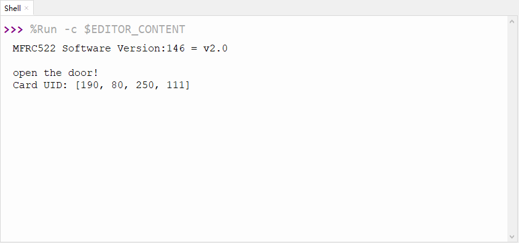

   img

项目六十 WiFi Station Mode
~~~~~~~~~~~~~~~~~~~~~~~~~~

1.1 项目介绍

ESP32有3种不同的WiFi工作模式：

- Station模式（作为WiFi设备主动连接路由器，也叫做WiFi Client）
- AP模式（作为一个Access Point，让其他WiFi设备来连接）即WiFi热点
- Station+AP共存模式（ESP32连接路由器的同时自身也是一个热点供其他WiFi设备来连接）

所有WiFi编程项目在使用WiFi前必须配置WiFi运行模式，否则无法使用WiFi。在这节实验课程中，我们将学习使用ESP32的WiFi
Station模式。

**Station 模式：**

当ESP32选择Station模式时，它作为一个WiFi客户端。它可以连接路由器网络，通过WiFi连接与路由器上的其他设备通信。如下图所示，PC和路由器已经连接，ESP32如果要与PC通信，需要将PC和路由器连接起来。

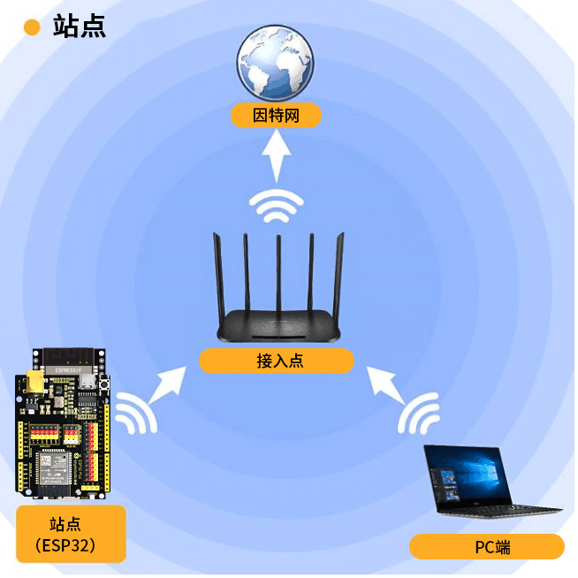

   img

1.2 实验组件

================= ==========
|image288|        |image289|
================= ==========
ESP32 Plus主板 x1 USB线 x1
================= ==========

1.3 模块接线图

.. figure:: ./media/011301.png
   :alt: img

   img

1.4 在线运行代码

打开Thonny并单击\ |1303|\ ，然后单击“\ **此电脑**\ ”。

选中“\**D::raw-latex:`\代码*`\*”路径，打开代码文件’’\ **lesson_60_WiFi_Station_Mode.py**\ ”。

路由器的SSID是无线网的无线名称。SSID是 ServiceSetldentifier
的缩写，意思是:服务集标识。SSID技术可以将一个无线局域网分为几个需要不同身份验证的子网络，每一个子网络都需要独立的身份验证，只有通过身份验证的用户才可以进入相应的子网络，防止未被授权的用户进入本网络。所以在代码运行之前，需要配置
WiFi 名称和密码，将其修改为你自己使用的WiFi 名称和密码，如下图所示。

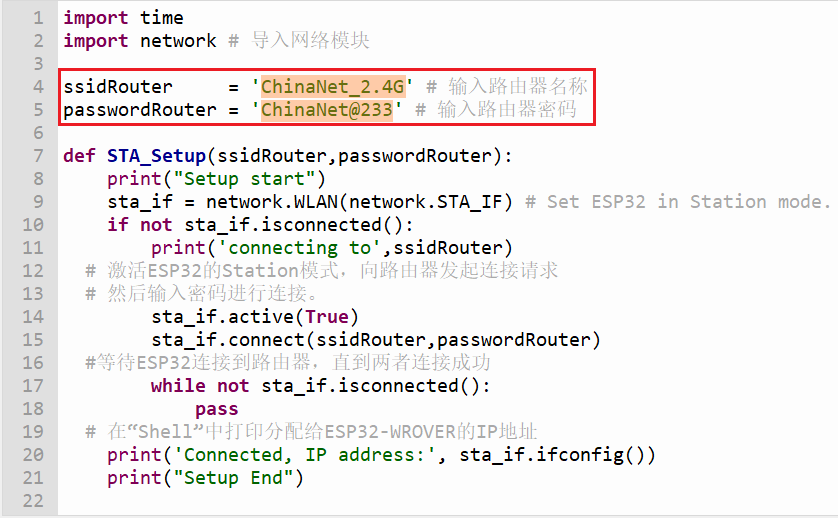

   img

.. code:: python

   import time
   import network # 导入网络模块

   ssidRouter     = 'ChinaNet_2.4G' # 输入路由器名称
   passwordRouter = 'ChinaNet@233' # 输入路由器密码

   def STA_Setup(ssidRouter,passwordRouter):
       print("Setup start")
       sta_if = network.WLAN(network.STA_IF) # Set ESP32 in Station mode.
       if not sta_if.isconnected():
           print('connecting to',ssidRouter)
     # 激活ESP32的Station模式，向路由器发起连接请求
     # 然后输入密码进行连接。   
           sta_if.active(True)
           sta_if.connect(ssidRouter,passwordRouter)
     #等待ESP32连接到路由器，直到两者连接成功    
           while not sta_if.isconnected():
               pass
     # 在“Shell”中打印分配给ESP32-WROVER的IP地址
       print('Connected, IP address:', sta_if.ifconfig())
       print("Setup End")

   try:
       STA_Setup(ssidRouter,passwordRouter)
   except:
       sta_if.disconnect()

1.5 实验结果

按照接线图正确接好模块，用USB线连接到计算机上电，单击\ |1305|\ 来执行程序代码。代码开始执行，开始连接，当ESP32成功连接到路由器的
SSID 时，“Shell”窗口将打印出路由器分配给ESP32的\ **IP地址**\ 。

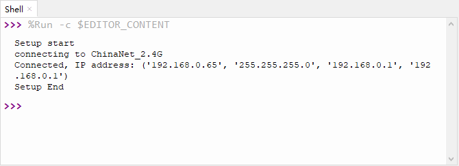

   img

**注意：如果打开 Shell 窗口且设置好波特率， Shell
窗口还是没有显示任何信息，可以尝试按下ESP32的RESET按键。**

   RESET

项目六十一 WiFi AP Mode
~~~~~~~~~~~~~~~~~~~~~~~

1.1 项目介绍

从上一课实验中我们知道ESP32有3种不同的WiFi工作模式：

- Station模式（作为WiFi设备主动连接路由器，也叫做WiFi Client）
- AP模式（作为一个Access Point，让其他WiFi设备来连接）即WiFi热点
- Station+AP共存模式（ESP32连接路由器的同时自身也是一个热点供其他WiFi设备来连接）

所有WiFi编程项目在使用WiFi前必须配置WiFi运行模式，否则无法使用WiFi。在这节实验课程中，我们将接着学习使用ESP32的WiFi
AP模式。

**AP模式：**

接入点Access Point（AP）是一种提供 Wi-Fi
网络访问的设备，并将其连接到有线网络的装置。ESP32除了不具有与有线网络的接口外，还可以提供类似的功能。这种操作模式称为软接入点（soft-AP）。可以同时连接到soft-AP的最大站数可以设置4，默认为4。

当ESP32单独处于AP模式下时，可以被认为是一个无法访问外网的局域网WiFi路由器节点，它可以接受各类设备的连接请求。并可以和连接设备进行TCP、UDP连接，实现数据流。在局域物联网的设计中可以承担数据收发节点的作用。如下图所示，以ESP32为热点。如果手机或PC需要与ESP32通信，则必须连接到ESP32的热点。只有通过与ESP32建立连接后才能进行通信。

.. figure:: ./media/611101.png
   :alt: img

   img

1.2 实验组件

================= ==========
|image290|        |image291|
================= ==========
ESP32 Plus主板 x1 USB线 x1
================= ==========

1.3 模块接线图

.. figure:: ./media/011301.png
   :alt: img

   img

1.4 在线运行代码

打开Thonny并单击\ |1303|\ ，然后单击“\ **此电脑**\ ”。

选中“\**D::raw-latex:`\代码*`\*”路径，打开代码文件’’\ **lesson_61_WiFi_AP_Mode.py**\ ”。

在代码运行之前，需要配置ESP32的
AP名称和连接密码，如下图所示。当然，你也可以不修改它，使用默认的名称和连接密码。

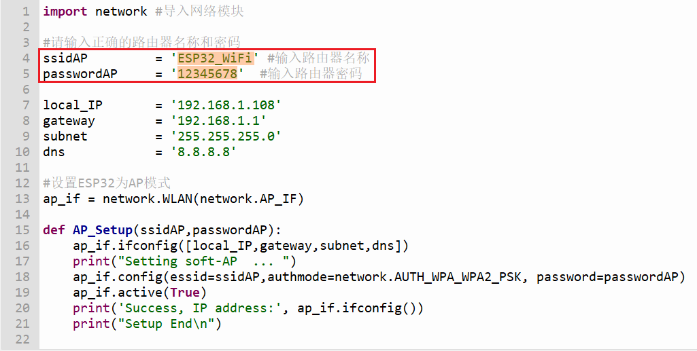

   img

.. code:: python

   import network #导入网络模块

   #请输入正确的路由器名称和密码
   ssidAP         = 'ESP32_WiFi' #输入路由器名称
   passwordAP     = '12345678'  #输入路由器密码

   local_IP       = '192.168.1.108'
   gateway        = '192.168.1.1'
   subnet         = '255.255.255.0'
   dns            = '8.8.8.8'

   #设置ESP32为AP模式
   ap_if = network.WLAN(network.AP_IF)

   def AP_Setup(ssidAP,passwordAP):
       ap_if.ifconfig([local_IP,gateway,subnet,dns])
       print("Setting soft-AP  ... ")
       ap_if.config(essid=ssidAP,authmode=network.AUTH_WPA_WPA2_PSK, password=passwordAP)
       ap_if.active(True)
       print('Success, IP address:', ap_if.ifconfig())
       print("Setup End\n")

   try:
       AP_Setup(ssidAP,passwordAP)
   except:
       print("Failed, please disconnect the power and restart the operation.")
       ap_if.disconnect()

1.5 实验结果

按照接线图正确接好模块，用USB线连接到计算机上电，单击\ |1305|\ 来执行程序代码。代码开始执行，打开ESP32的AP功能，“Shell”窗口中打印接入点信息。

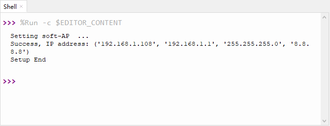

   img

**注意：如果打开 Shell 窗口且设置好波特率， Shell
窗口还是没有显示任何信息，可以尝试按下ESP32的RESET按键。**

   RESET

打开手机的 WiFi 扫描功能，可以看到ESP32的 SSID ，在本课程代码中的名称为
“\ **ESP32_WiFi**\ ” 。

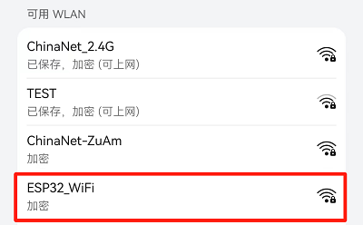

   img

你可以输入密码 “\ **12345678**\ ”
连接它，也可以通过修改程序代码来修改它的AP名称和密码。

.. figure:: ./media/611503.png
   :alt: img

   img

项目六十二 WiFi Station+AP Mode
~~~~~~~~~~~~~~~~~~~~~~~~~~~~~~~

1.1 项目介绍

从第六十课实验中我们知道ESP32有3种不同的WiFi工作模式：

- Station模式（作为WiFi设备主动连接路由器，也叫做WiFi Client）
- AP模式（作为一个Access Point，让其他WiFi设备来连接）即WiFi热点
- Station+AP共存模式（ESP32连接路由器的同时自身也是一个热点供其他WiFi设备来连接）

所有WiFi编程项目在使用WiFi前必须配置WiFi运行模式，否则无法使用WiFi。在这节实验课程中，我们将接着学习使用ESP32的WiFi
Station+AP模式。

**AP+Station模式：**

ESP32除AP模式和Station模式外，还可以同时使用AP模式和Station模式。此模式包含前两种模式的功能。打开ESP32的Station模式，将其连接到路由器网络，它可以通过路由器与Internet通信。同时开启其AP模式，创建热点网络。其他WiFi设备可以选择连接路由器网络或热点网络与ESP32通信。

1.2 实验组件

================= ==========
|image292|        |image293|
================= ==========
ESP32 Plus主板 x1 USB线 x1
================= ==========

1.3 模块接线图

.. figure:: ./media/011301.png
   :alt: img

   img

1.4 在线运行代码

打开Thonny并单击\ |1303|\ ，然后单击“\ **此电脑**\ ”。

选中“\**D::raw-latex:`\代码*`\*”路径，打开代码文件’’\ **lesson_62_WiFi_Station+AP_Mode.py**\ ”。

在代码运行之前，需要配置 WiFi 名称和密码、ESP32的
AP名称和连接密码，如下图所示。

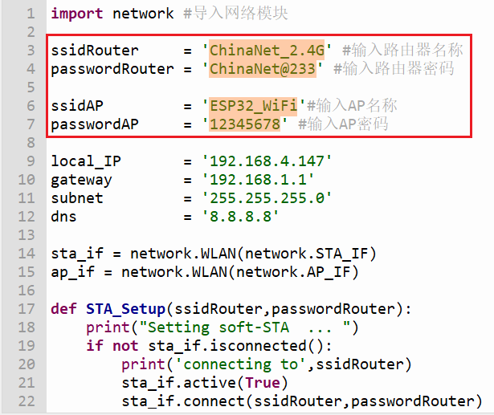

   img

.. code:: python

   import network #导入网络模块

   ssidRouter     = 'ChinaNet_2.4G' #输入路由器名称
   passwordRouter = 'ChinaNet@233' #输入路由器密码

   ssidAP         = 'ESP32_WiFi'#输入AP名称
   passwordAP     = '12345678' #输入AP密码

   local_IP       = '192.168.4.147'
   gateway        = '192.168.1.1'
   subnet         = '255.255.255.0'
   dns            = '8.8.8.8'

   sta_if = network.WLAN(network.STA_IF)
   ap_if = network.WLAN(network.AP_IF)
       
   def STA_Setup(ssidRouter,passwordRouter):
       print("Setting soft-STA  ... ")
       if not sta_if.isconnected():
           print('connecting to',ssidRouter)
           sta_if.active(True)
           sta_if.connect(ssidRouter,passwordRouter)
           while not sta_if.isconnected():
               pass
       print('Connected, IP address:', sta_if.ifconfig())
       print("Setup End")
       
   def AP_Setup(ssidAP,passwordAP):
       ap_if.ifconfig([local_IP,gateway,subnet,dns])
       print("Setting soft-AP  ... ")
       ap_if.config(essid=ssidAP,authmode=network.AUTH_WPA_WPA2_PSK, password=passwordAP)
       ap_if.active(True)
       print('Success, IP address:', ap_if.ifconfig())
       print("Setup End\n")

   try:
       AP_Setup(ssidAP,passwordAP)    
       STA_Setup(ssidRouter,passwordRouter)
   except:
       sta_if.disconnect()
       ap_if.idsconnect()

1.5 实验结果

按照接线图正确接好模块，用USB线连接到计算机上电，单击\ |1305|\ 来执行程序代码。代码开始执行，开始连接，“Shell”窗口中将显示如下：

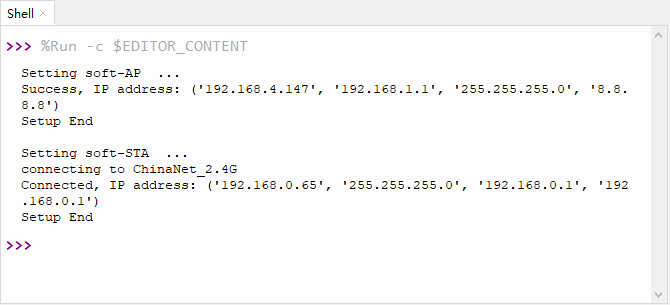

   img

**注意：如果打开 Shell 窗口且设置好波特率， Shell
窗口还是没有显示任何信息，可以尝试按下ESP32的RESET按键。**

   RESET

打开手机 WiFi 扫描功能，可以看到ESP32的SSID，名称为 “\ **ESP32_WiFi**\ ”
。

.. figure:: ./media/611503.png
   :alt: img

   img

项目六十三 综合实验
~~~~~~~~~~~~~~~~~~~

1.1 项目介绍

我们已经学习了所有的模块和传感器的使用方法，也学习了将它们搭配在一起组合实验。在这一实验课程中我们将搭配更多的模块和传感器组合在一起。参考前面实验编程的方法，利用按键模块，实现每按一次按键，功能就变换一次的效果。

实验多种多样，大家可以发挥想象力，搭配模块和传感器做出更多具有意义的实验。

1.2 实验组件

+-----------------+---------------+-----------------+-----------------+
| |image294|      | |image295|    | |image296|      | |image297|      |
+=================+===============+=================+=================+
| ESP32 Plus主板  | Keyes         | Keyes           | Keyes           |
| x1              | 紫色LED模块   | 单路按键模块 x1 | 旋转电位器模块  |
|                 | x1            |                 | x1              |
+-----------------+---------------+-----------------+-----------------+
| |image298|      | |image299|    | |image300|      | |image301|      |
+-----------------+---------------+-----------------+-----------------+
| Keyes           | Keyes         | HC-SR04         | Keyes           |
| 避障传感器 x1   | 摇杆模块 x1   | 超声波传感器 x1 | 超声波转接模块  |
|                 |               |                 | x1              |
+-----------------+---------------+-----------------+-----------------+
| |image302|      | |image303|    | |image304|      | |image305|      |
+-----------------+---------------+-----------------+-----------------+
| Keyes           | USB线 x1      | XH2.54-3P       | XH2.54-4P       |
| 共阴RGB模块 x1  |               | 转杜邦线母单线  | 转杜邦线母单线  |
|                 |               | x4              | x2              |
+-----------------+---------------+-----------------+-----------------+
| |image306|      |               |                 |                 |
+-----------------+---------------+-----------------+-----------------+
| XH2.54-5P       |               |                 |                 |
| 转杜邦线母单线  |               |                 |                 |
| x1              |               |                 |                 |
+-----------------+---------------+-----------------+-----------------+

1.3 模块接线图

.. figure:: ./media/631301.png
   :alt: img

   img

1.4 在线运行代码

打开Thonny并单击\ |1303|\ ，然后单击“\ **此电脑**\ ”。

选中“\**D::raw-latex:`\代码*`\*”路径，打开代码文件’’\ **lesson_63_Comprehensive_experiment.py**\ ”。

.. code:: python

   from machine import ADC, Pin, PWM
   import time
   import machine
   import random

   pwm_r = PWM(Pin(2))
   pwm_g = PWM(Pin(4))
   pwm_b = PWM(Pin(32))

   pwm_r.freq(1000)
   pwm_g.freq(1000)
   pwm_b.freq(1000)

   potentiometer_adc=ADC(Pin(35))
   potentiometer_adc.atten(ADC.ATTN_11DB)
   potentiometer_adc.width(ADC.WIDTH_10BIT)

   button = Pin(23, Pin.IN)
   led = PWM(Pin(5,Pin.OUT),1000)

   Avoiding = Pin(14, Pin.IN, Pin.PULL_UP) 

   button_z=Pin(18,Pin.IN,Pin.PULL_UP)
   rocker_x=ADC(Pin(33))
   rocker_y=ADC(Pin(34))
   rocker_x.atten(ADC.ATTN_11DB)
   rocker_y.atten(ADC.ATTN_11DB)
   rocker_x.width(ADC.WIDTH_10BIT)
   rocker_y.width(ADC.WIDTH_10BIT)

   ### 设置超声波引脚
   trigger = Pin(13, Pin.OUT)
   echo = Pin(12, Pin.IN)

   def light(red, green, blue):
       pwm_r.duty(red)
       pwm_g.duty(green)
       pwm_b.duty(blue)

   ### 超声波测距，单位:厘米
   def getDistance(trigger, echo):
       # 产生10us方波
       trigger.value(0)   #事先给一个短的低电平，以确保一个干净的高脉冲;
       time.sleep_us(2)
       trigger.value(1)
       time.sleep_us(10)#拉高后，等待10微秒，立即调低
       trigger.value(0)
       
       while echo.value() == 0: #建立while循环，检测回波引脚值是否为0，并记录此时的时间
           start = time.ticks_us()
       while echo.value() == 1: #建立while循环，检查回波引脚值是否为1，并记录此时的时间
           end = time.ticks_us()
       d = (end - start) * 0.0343 / 2 #声波的传播时间x声速(343.2 m/s, 0.0343 cm/微秒)，再除以来回距离2
       return d

   keys = 0
   nums = 0
   print(keys % 5)
   def toggle_handle(pin):
       global keys
       keys += 1
       print(keys % 4)

   button.irq(trigger = Pin.IRQ_FALLING, handler = toggle_handle)

   def showRGB():
       R = random.randint(0,1023)
       G = random.randint(0,1023)
       B = random.randint(0,1023)
       light(R, G, B)
       time.sleep(0.3)

   def showAvoiding():
       if Avoiding.value() == 0:
           print("0   There are obstacles")   #按下打印相应信息
       else:
           print("1   All going well")
       time.sleep(0.1) #延时0.1秒
       
   def showJoystick():
       B_value = button_z.value()
       X_value = rocker_x.read()
       Y_value = rocker_y.read()
       print("button:", end = " ")
       print(B_value, end = " ")
       print("X:", end = " ") 
       print(X_value, end = " ")
       print("Y:", end = " ")
       print(Y_value)
       time.sleep(0.1)

   def adjustLight():
       pot_value = potentiometer_adc.read()
       led.duty(pot_value)
       print(pot_value)
       time.sleep(0.1)

   def showDistance():
       distance = getDistance(trigger, echo)
       print("The distance is ：{:.2f} cm".format(distance))
       time.sleep(0.1)

   while True:
       nums = keys % 5  #按键次数对5取模得到0,1,2,3,4
       if nums == 0:  #根据RGB
           showRGB() 
       elif nums == 1:  #显示避让传感器的高低电平
           showAvoiding() 
       elif nums == 2: #显示摇杆值
           showJoystick()
       elif nums == 3:  #电位器调节LED
           adjustLight()
       elif nums == 4:  #显示超声波测距值
           showDistance()

1.5 实验结果

按照接线图正确接好模块，用USB线连接到计算机上电，单击\ |1305|\ 来执行程序代码，代码开始执行。

（1）初始时没有按下按键，按键次数为 0 ，余数为 0
，RGB模块循环闪烁随机颜色。

.. figure:: ./media/631507.png
   :alt: img

   img

（2）按一下按键（时间稍长以便能检测到按键按下），RGB
LED灯停止闪烁。此时按键次数为 1 ，余数为 1
，实验实现避障传感器检测障碍物并读取高低电平的功能。

当传感器没有检测到障碍物时，value为\ **1**\ ，“Shell”窗口打印出 “\ **1
All going well**\ ” ，灯 SLED **不亮**\ ；

当传感器检测到障碍物时，value为\ **0**\ ，“Shell”窗口打印出 “\ **0 There
are obstacles**\ ” ，灯 SLED **亮**\ 。

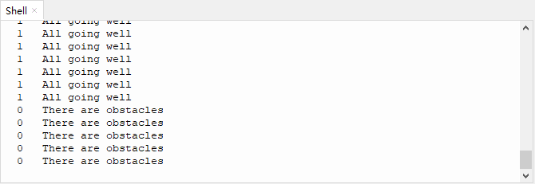

   img

.. figure:: ./media/631505.png
   :alt: img

   img

.. figure:: ./media/631506.png
   :alt: img

   img

（3）再按一下按键，按键次数为 2 ，余数为 2
。实验实现读取当前摇杆X轴和Y轴对应的模拟值以及Z轴（B接口）对应的数字值的功能。“Shell”窗口打印出当前摇杆X轴、Y轴和Z轴对应的值。

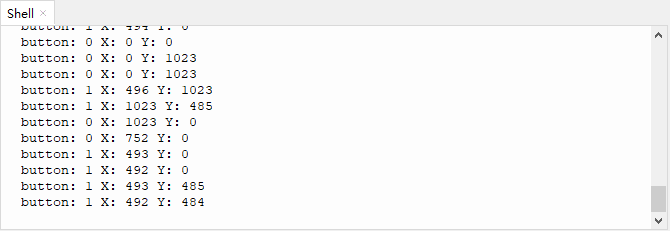

   img

（4）再按一下按键，按键次数为 3 ，余数为 3
。实验实现利用可调电位器模块调节
LED（GPIO5）接口输出的PWM值，从而调节紫色LED模块上LED亮度的功能。“Shell”窗口打印出当前输出的模拟值。

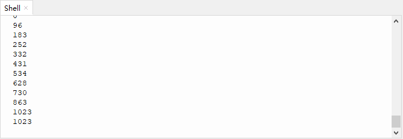

   img

（5）再按一下按键，按键次数为 4 ，余数为 4
。实验实现的功能是利用超声波模块检测距离并在“Shell”窗口打印出来，“Shell”窗口显示图如下。

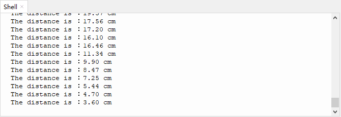

   img

（6）再按一下按键，按键次数为 5 ，余数为 0
。实现初始时RGB循环闪烁随机颜色的效果。不断地按下按键，余数循环变化，实验功能也循环变化。

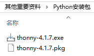

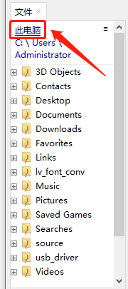
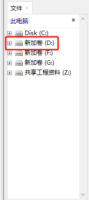
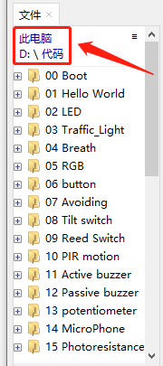

.. |image15| image:: ./media/KS5016.png
.. |USB| image:: ./media/USB.jpg
.. |image16| image:: ./media/KS5016.png
.. |image17| image:: ./media/KE4001.png
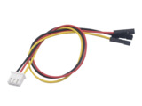
.. |image19| image:: ./media/USB.jpg
.. |image20| image:: ./media/KS5016.png
.. |image21| image:: ./media/KE4008.png
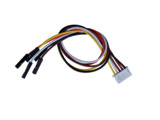
.. |image23| image:: ./media/USB.jpg
.. |image24| image:: ./media/KS5016.png
.. |image25| image:: ./media/KE4043.png

.. |image27| image:: ./media/USB.jpg
.. |image28| image:: ./media/KS5016.png
.. |image29| image:: ./media/KE4001.png

.. |image31| image:: ./media/USB.jpg
.. |image32| image:: ./media/KS5016.png
.. |image33| image:: ./media/KE4074.png
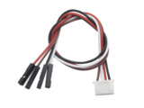
.. |image35| image:: ./media/USB.jpg
.. |image36| image:: ./media/KS5016.png
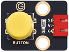

.. |image39| image:: ./media/USB.jpg
.. |image40| image:: ./media/KS5016.png
.. |image41| image:: ./media/KE4013.png

.. |image43| image:: ./media/USB.jpg
.. |image44| image:: ./media/KS5016.png
.. |image45| image:: ./media/KE4019.png

.. |image47| image:: ./media/USB.jpg
.. |image48| image:: ./media/KS5016.png
.. |image49| image:: ./media/KE4024.png

.. |image51| image:: ./media/USB.jpg
.. |image52| image:: ./media/KS5016.png
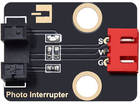

.. |image55| image:: ./media/USB.jpg
.. |image56| image:: ./media/KS5016.png
.. |image57| image:: ./media/KE4017.png

.. |image59| image:: ./media/USB.jpg
.. |image60| image:: ./media/KS5016.png
.. |image61| image:: ./media/KE4023.png

.. |image63| image:: ./media/USB.jpg
.. |image64| image:: ./media/KS5016.png
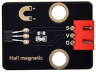

.. |image67| image:: ./media/USB.jpg
.. |image68| image:: ./media/KS5016.png
.. |image69| image:: ./media/KE4015.png

.. |image71| image:: ./media/USB.jpg
.. |image72| image:: ./media/KS5016.png
.. |image73| image:: ./media/KE4018.png

.. |image75| image:: ./media/USB.jpg
.. |image76| image:: ./media/KS5016.png
.. |image77| image:: ./media/KE4010.png

.. |image79| image:: ./media/USB.jpg
.. |image80| image:: ./media/KS5016.png
.. |image81| image:: ./media/KE4067.png

.. |image83| image:: ./media/USB.jpg
.. |image84| image:: ./media/KS5016.png
.. |image85| image:: ./media/KE4038.png

.. |image87| image:: ./media/USB.jpg
.. |image88| image:: ./media/OR0266.png
.. |image89| image:: ./media/6.png
.. |image90| image:: ./media/KS5016.png
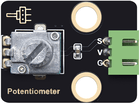

.. |image93| image:: ./media/USB.jpg
.. |image94| image:: ./media/KS5016.png
.. |image95| image:: ./media/KE4048.png

.. |image97| image:: ./media/USB.jpg
.. |image98| image:: ./media/KS5016.png
.. |image99| image:: ./media/KE4027.png

.. |image101| image:: ./media/USB.jpg
.. |image102| image:: ./media/KS5016.png
.. |image103| image:: ./media/KE4026.png

.. |image105| image:: ./media/USB.jpg
.. |image106| image:: ./media/KS5016.png
.. |image107| image:: ./media/KE4025.png

.. |image109| image:: ./media/USB.jpg
.. |image110| image:: ./media/KS5016.png
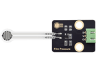

.. |image113| image:: ./media/USB.jpg
.. |image114| image:: ./media/KS5016.png
.. |image115| image:: ./media/KE4020.png

.. |image117| image:: ./media/USB.jpg
.. |image118| image:: ./media/KS5016.png
.. |image119| image:: ./media/KE4029.png

.. |image121| image:: ./media/USB.jpg
.. |image122| image:: ./media/KS5016.png
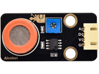

.. |image125| image:: ./media/USB.jpg
.. |image126| image:: ./media/KS5016.png
.. |image127| image:: ./media/KE4068.png

.. |image129| image:: ./media/USB.jpg
.. |image130| image:: ./media/KS5016.png
.. |image131| image:: ./media/KE4050.png

.. |image133| image:: ./media/USB.jpg
.. |image134| image:: ./media/KS5016.png
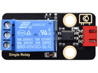

.. |image137| image:: ./media/USB.jpg
.. |image138| image:: ./media/KS5016.png
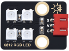

.. |image141| image:: ./media/USB.jpg
.. |image142| image:: ./media/KS5016.png
.. |image143| image:: ./media/KE4049.png

.. |image145| image:: ./media/USB.jpg
.. |image146| image:: ./media/KS5016.png
.. |image147| image:: ./media/9G.jpg
.. |image148| image:: ./media/USB.jpg
.. |image149| image:: ./media/KS5016.png
.. |image150| image:: ./media/KE4039.png
.. |image151| image:: ./media/ultrasonic.png

.. |image153| image:: ./media/USB.jpg
.. |image154| image:: ./media/KS5016.png
.. |image155| image:: ./media/KE4036.png
.. |image156| image:: ./media/remote_control.png

.. |image158| image:: ./media/USB.jpg
.. |image159| image:: ./media/KS5016.png
.. |image160| image:: ./media/KE4034.png

.. |image162| image:: ./media/USB.jpg
.. |image163| image:: ./media/KS5016.png
.. |image164| image:: ./media/KE4033.png

.. |image166| image:: ./media/USB.jpg
.. |image167| image:: ./media/KS5016.png
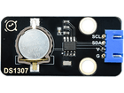

.. |image170| image:: ./media/USB.jpg
.. |image171| image:: ./media/KS5016.png
.. |image172| image:: ./media/KE4073.png

.. |image174| image:: ./media/USB.jpg
.. |image175| image:: ./media/KS5016.png
.. |image176| image:: ./media/KE4060.png

.. |image178| image:: ./media/USB.jpg
.. |image179| image:: ./media/KS5016.png
.. |image180| image:: ./media/KE4066.png

.. |image182| image:: ./media/USB.jpg
.. |image183| image:: ./media/KS5016.png
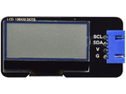

.. |image186| image:: ./media/USB.jpg
.. |image187| image:: ./media/KS5016.png
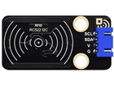

.. |image190| image:: ./media/USB.jpg
.. |image191| image:: ./media/3210.png
.. |image192| image:: ./media/IC.png
.. |image193| image:: ./media/KS5016.png

.. |image195| image:: ./media/KE4001.png

.. |image197| image:: ./media/USB.jpg
.. |image198| image:: ./media/KS5016.png
.. |image199| image:: ./media/KE4019.png
.. |image200| image:: ./media/KE4010.png

.. |image202| image:: ./media/USB.jpg
.. |image203| image:: ./media/KS5016.png
.. |image204| image:: ./media/KE4018.png
.. |image205| image:: ./media/KE4010.png
.. |image206| image:: ./media/KE4001.png

.. |image208| image:: ./media/USB.jpg
.. |image209| image:: ./media/KS5016.png
.. |image210| image:: ./media/KE4038.png
.. |image211| image:: ./media/KE4020.png

.. |image213| image:: ./media/USB.jpg
.. |image214| image:: ./media/OR0266.png
.. |image215| image:: ./media/6.png
.. |image216| image:: ./media/KS5016.png
.. |image217| image:: ./media/KE4049.png
.. |image218| image:: ./media/KE4074.png

.. |image221| image:: ./media/USB.jpg
.. |image222| image:: ./media/KS5016.png

.. |image224| image:: ./media/KE4001.png

.. |image226| image:: ./media/USB.jpg
.. |image227| image:: ./media/KS5016.png
.. |image228| image:: ./media/KE4048.png
.. |image229| image:: ./media/9G.jpg

.. |image231| image:: ./media/USB.jpg
.. |image232| image:: ./media/KS5016.png
.. |image233| image:: ./media/KE4027.png
.. |image234| image:: ./media/KE4001.png

.. |image236| image:: ./media/USB.jpg
.. |image237| image:: ./media/KS5016.png
.. |image238| image:: ./media/KE4010.png
.. |image239| image:: ./media/KE4020.png

.. |image242| image:: ./media/USB.jpg
.. |image243| image:: ./media/KS5016.png
.. |image244| image:: ./media/KE4010.png
.. |image245| image:: ./media/KE4029.png
.. |image246| image:: ./media/KE4060.png

.. |image249| image:: ./media/USB.jpg
.. |image250| image:: ./media/KS5016.png
.. |image251| image:: ./media/KE4010.png

.. |image253| image:: ./media/KE4060.png

.. |image256| image:: ./media/USB.jpg
.. |image257| image:: ./media/KS5016.png
.. |image258| image:: ./media/ultrasonic.png
.. |image259| image:: ./media/KE4039.png
.. |image260| image:: ./media/KE4067.png
.. |image261| image:: ./media/KE4074.png
.. |image262| image:: ./media/KE4060.png

.. |image265| image:: ./media/USB.jpg
.. |image266| image:: ./media/KS5016.png
.. |image267| image:: ./media/KE4036.png
.. |image268| image:: ./media/KE4001.png
.. |image269| image:: ./media/remote_control.png

.. |image271| image:: ./media/USB.jpg
.. |image272| image:: ./media/KS5016.png
.. |image273| image:: ./media/KE4038.png
.. |image274| image:: ./media/KE4060.png
.. |image275| image:: ./media/KE4034.png

.. |image278| image:: ./media/USB.jpg
.. |image279| image:: ./media/OR0266.png
.. |image280| image:: ./media/6.png
.. |image281| image:: ./media/KS5016.png

.. |image283| image:: ./media/3210.png
.. |image284| image:: ./media/USB.jpg
.. |image285| image:: ./media/IC.png
.. |image286| image:: ./media/9G.jpg

.. |image288| image:: ./media/KS5016.png
.. |image289| image:: ./media/USB.jpg
.. |image290| image:: ./media/KS5016.png
.. |image291| image:: ./media/USB.jpg
.. |image292| image:: ./media/KS5016.png
.. |image293| image:: ./media/USB.jpg
.. |image294| image:: ./media/KS5016.png
.. |image295| image:: ./media/KE4001.png

.. |image298| image:: ./media/KE4019.png
.. |image299| image:: ./media/KE4050.png
.. |image300| image:: ./media/ultrasonic.png
.. |image301| image:: ./media/KE4039.png
.. |image302| image:: ./media/KE4074.png
.. |image303| image:: ./media/USB.jpg

