4.1 Data download
~~~~~~~~~~~~~~~~~

Mixly information contains project ,please click to download for
follow-up study.

Data download：\  :download:`Data download <./Mixly.zip>`
 ### 4.2 Install
software **Introduction**

Mixly is a free open-source graphical Arduino programming software,
based on Google’s Blockly graphical programming framework, and developed
by Mixly Team@ BNU.

It is a free open-source graphical programming tool for creative
electronic development; a complete support ecosystem for creative
e-education; a stage for maker educators to realize their dreams.

|mixly-icon|\ Although there is an Ardublock graphical programming
software launched by Arduino official, Ardublock is not perfect enough,
and many common functions cannot be realized.

**Design Concept**

**(1) Usability**

Mixly is designed to be completely green. Currently Mixly supports win,
ubuntu, mac. Windows users can download the Mixly package directly from
the Internet, and unzip it to run on Windows XP and above (download link
is attached below).

**(2) Simplicity**

Mixly uses the Blockly graphical programming engine to replace complex
text manipulation with graphical building blocks, providing a good
foundation for beginners to get started quickly.

1. Use the different color icons to represent different types of
   functional blocks, very convenient for users to classify.

2. Provide default options in the composite function block to
   effectively reduce the number of user drags.

3. Integrate all the features of the software in the same interface.

4. Provide the reference tutorial and code examples.

**(3) Functionality**

It has versatile functions. Mixly can almost implement all the functions
that Arduino IDE has. Support all official development boards of
arduino.

**(4) Continuity**

The goal of the graphical programming system is definitely not to
replace the original text programming method, but to better understand
the programming principles and program thinking through graphical
programming, and lay the foundation for future text programming.

It is also the design philosophy for Mixly. More continuous content has
been added to the design of the software to protect the user’s learning
outcomes. To be specific, it includes the introduction of variable
types, the consistency of text programming as much as possible in the
design of the module, and the support of both graphical and text
programming.

**(5) Ecological**

The most important design concept of Mixly is its ecological feature,
which can distinguish it from other Arduino graphical programming.

In order to achieve sustainable development, Mixly is designed to allow
manufacturers to develop their own unique modules (currently supports
DfRobot, StartLab, MakeBlock, Sense, Seeed, Lubot. But users require
JavaScript programming foundation to make this part of the module).

It also allows users directly use Mixly’s graphical programming function
to generate common modules (such as LED digital display, buzzer
broadcast, etc. Users are able to make this part of the module only
using Mixly).

Both of the two kinds of modules mentioned above can be imported into
the Mixly system through the “Import” function, thereby realizing the
user’s own value in the popularity of Mixly software.

**User Groups**

From the above design concept, it can be seen that Mixly is suitable for
primary and secondary school students to cultivate programming thinking.
It is also available for quick programming when creating a work. Of
course, it is good for those lovely friends who don’t want to learn text
programming, but want to do some small works with intelligent control.

**Mixly Blocks Functions**

**System Functions**

Look at the main interface of Mixly, it includes five parts, that is,
Blocks selection, code edit, text code (hidden), system function and
message prompt area. Shown below.

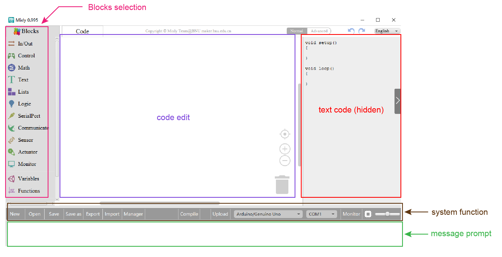

   Interface 1

**Some common functions**

|Function 1|\ Through this interface, you can complete the code
compile、upload、save and manage. It support four remove methods: drag
it left out code window, or drag to Recycle Bin, delete key, or
right-click to delete block. It supports four languages: English,
Español, Spanish, Chinese Simplified, Chinese Traditional.

**In/Out Block**

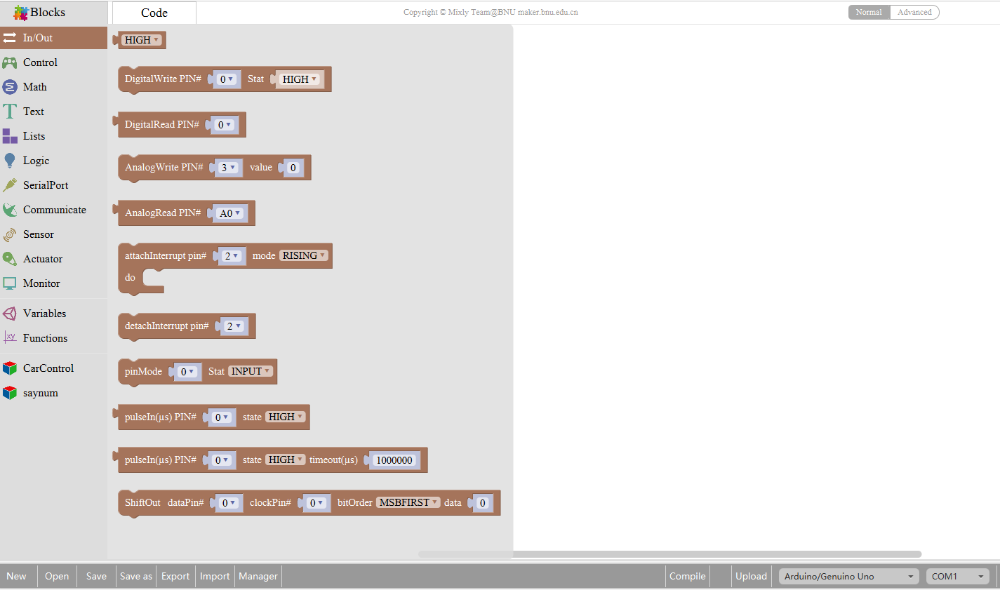

   IO

+---------+-----------+--------------------------------------------------------+
| **NO.** | **BLOCK   | **DEFINITION**                                         |
|         | ICON**    |                                                        |
+=========+===========+========================================================+
| **1**   | |image1|  | Returns HIGH or LOW voltage                            |
+---------+-----------+--------------------------------------------------------+
| **2**   | |image2|  | Write digital value to a specific Port. Digital        |
|         |           | Output: set the HIGH or LOW output for IO pins         |
+---------+-----------+--------------------------------------------------------+
| **3**   | |image3|  | Returns a digital value of a specific Port. Digital IO |
|         |           | Read Pin, generally used to read the HIGH or LOW level |
|         |           | detected by Digital sensor                             |
+---------+-----------+--------------------------------------------------------+
| **4**   | |image4|  | Write analog value between 2 and 255 to a specific     |
|         |           | Port. Analog Output: set the Analog value output by    |
|         |           | Analog IO pins (0~255).                                |
+---------+-----------+--------------------------------------------------------+
| **5**   | |image5|  | Returns value between 0 and 1023 of a specific Port.   |
|         |           | Analog IO Read Pin, generally used to read the Analog  |
|         |           | value detected by Analog sensor.                       |
+---------+-----------+--------------------------------------------------------+
| **6**   | |image6|  | External Interrupts function, with three trigger       |
|         |           | interrupt modes RISING, FALLING, CHANGE.               |
+---------+-----------+--------------------------------------------------------+
| **7**   | |image7|  | Detachs interrupt to a specific Port. Turn off the     |
|         |           | given interrupt function.                              |
+---------+-----------+--------------------------------------------------------+
| **8**   | |image8|  | Set the IO pins as Output or Input state               |
+---------+-----------+--------------------------------------------------------+
| **9**   | |image9|  | Read the continuous time of HIGH or LOW pulse from IO  |
|         |           | pins ( generally used for ultrasonic ranging)          |
+---------+-----------+--------------------------------------------------------+
| **10**  | |image10| | Read a pulse (either HIGH or LOW) on a pin within a    |
|         |           | time set in timeout.                                   |
+---------+-----------+--------------------------------------------------------+
| **11**  | |image11| | Set the ShiftOut data pin, clock pin. Output the data  |
|         |           | needed from the bitOrder MSBFIRST or LSBFIRST (Most    |
|         |           | Significant Bit First, or, Least Significant Bit       |
|         |           | First). Generally used for controlling the 74HC595     |
|         |           | CHIP.                                                  |
+---------+-----------+--------------------------------------------------------+
| **12**  | |image12| | This is the function interface under Normal mode. If   |
|         |           | select Advanced mode, the functions will be more.      |
+---------+-----------+--------------------------------------------------------+

**Control Block**

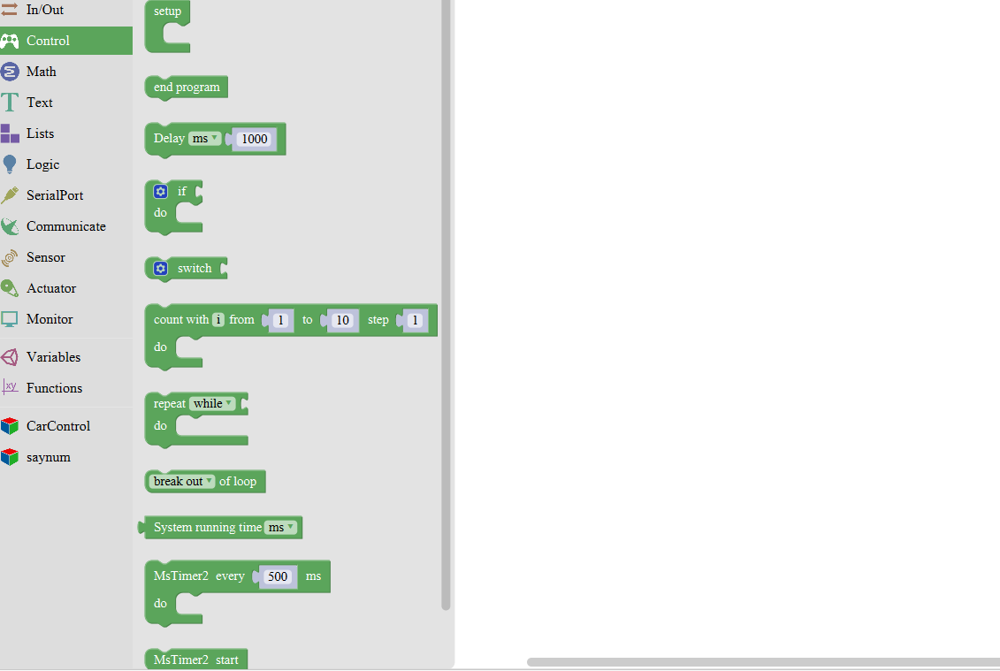

   control

+---------+-----------+-----------------------------------------------------------------------------------------------+
| **NO.** | **BLOCK   | **DEFINITION**                                                                                |
|         | ICON**    |                                                                                               |
+=========+===========+===============================================================================================+
| **1**   | |image13| | Initialization (run only once)                                                                |
+---------+-----------+-----------------------------------------------------------------------------------------------+
| **2**   | |image14| | End the program, means the program will stop running when use this block.                     |
+---------+-----------+-----------------------------------------------------------------------------------------------+
| **3**   | |image15| | Delay function, click to select **ms** or **us** (pause the program for the amount of time    |
|         |           | (in milliseconds) specified as parameter. There are 1000 milliseconds in a second.)           |
+---------+-----------+-----------------------------------------------------------------------------------------------+
| **4**   | |image16| | **if_do** function (first evaluate a value be `true or                                        |
|         |           | false <https://www.arduino.cc/reference/en/language/variables/constants/constants/>`__, if a  |
|         |           | value is true, then do some statement. You can click the blue gear icon to select the **else  |
|         |           | if** block or **else** block.)                                                                |
+---------+-----------+-----------------------------------------------------------------------------------------------+
| **5**   | |image17| | **switch** function. You can click the blue gear icon to select the **case** block or         |
|         |           | **default** block. (used to evaluate several programs then execute the corresponding function |
|         |           | matched with program.)                                                                        |
+---------+-----------+-----------------------------------------------------------------------------------------------+
| **6**   | |image18| | Equal to `for                                                                                 |
|         |           | statement <https://www.arduino.cc/reference/en/language/structure/control-structure/for/>`__. |
+---------+-----------+-----------------------------------------------------------------------------------------------+
| **7**   | |image19| | A **while** loop statement.                                                                   |
+---------+-----------+-----------------------------------------------------------------------------------------------+
| **8**   | |image20| | **break** function, used to exit from the containing loop.                                    |
+---------+-----------+-----------------------------------------------------------------------------------------------+
| **9**   | |image21| | **millis()** function, returns the system running time since the program started. (The unit   |
|         |           | can be **ms** (milliseconds) or **μs**\ （microsecond)).                                      |
+---------+-----------+-----------------------------------------------------------------------------------------------+
| **10**  | |image22| | Timer interrupt function, that is, set a trigger interrupt for the amount of time (in         |
|         |           | milliseconds) specified as parameter.                                                         |
+---------+-----------+-----------------------------------------------------------------------------------------------+
| **11**  | |image23| | Timer interrupt start block                                                                   |
+---------+-----------+-----------------------------------------------------------------------------------------------+
| **12**  | |image24| | Timer interrupt stop block                                                                    |
+---------+-----------+-----------------------------------------------------------------------------------------------+

**Math Block**

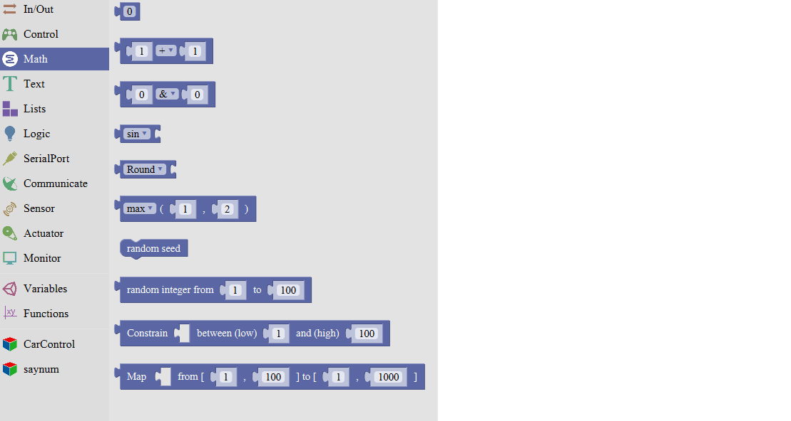

   Math

+---------+-----------+--------------------------------------------------------------------------------------------------------------------------+
| **NO.** | **BLOCK   | **DEFINITION**                                                                                                           |
|         | ICON**    |                                                                                                                          |
+=========+===========+==========================================================================================================================+
| **1**   | |image25| | A number                                                                                                                 |
+---------+-----------+--------------------------------------------------------------------------------------------------------------------------+
| **2**   | |image26| | Click to select the Arithmetic Operators:                                                                                |
|         |           | `＋(addition) <https://www.arduino.cc/reference/en/language/structure/arithmetic-operators/addition/>`__\ **;**          |
|         |           | `－(subtraction) <https://www.arduino.cc/reference/en/language/structure/arithmetic-operators/subtraction/>`__\ **;** `x |
|         |           | (Multiplication) <https://www.arduino.cc/reference/en/language/structure/arithmetic-operators/multiplication/>`__\ **;** |
|         |           | `÷ (division) <https://www.arduino.cc/reference/en/language/structure/arithmetic-operators/division/>`__\ **;** `%       |
|         |           | (remainder) <https://www.arduino.cc/reference/en/language/structure/arithmetic-operators/remainder/>`__\ **;**\ `^       |
|         |           | (bitwise xor) <https://www.arduino.cc/reference/en/language/structure/bitwise-operators/bitwisexor/>`__                  |
+---------+-----------+--------------------------------------------------------------------------------------------------------------------------+
| **3**   | |image27| | Click to select the `& (bitwise                                                                                          |
|         |           | end) <https://www.arduino.cc/reference/en/language/structure/bitwise-operators/bitwiseand/>`__\ **;** `l (bitwise        |
|         |           | or) <https://www.arduino.cc/reference/en/language/structure/bitwise-operators/bitwiseor/>`__\ **;** `<< (bitshift        |
|         |           | left) <https://www.arduino.cc/reference/en/language/structure/bitwise-operators/bitshiftleft/>`__\ **;** `>> (bitshift   |
|         |           | right) <https://www.arduino.cc/reference/en/language/structure/bitwise-operators/bitshiftright/>`__                      |
+---------+-----------+--------------------------------------------------------------------------------------------------------------------------+
| **4**   | |image28| | |image29|\ Click to select the `sin <https://www.arduino.cc/reference/en/language/functions/trigonometry/sin/>`__\ **;** |
|         |           | `cos <https://www.arduino.cc/reference/en/language/functions/trigonometry/cos/>`__\ **;**                                |
|         |           | `tan <https://www.arduino.cc/reference/en/language/functions/trigonometry/tan/>`__\ **; asin; acos; atan; ln; log10; e^; |
|         |           | 10^;** `++ (increment) <https://www.arduino.cc/reference/en/language/structure/compound-operators/increment/>`__ **;**   |
|         |           | `– (decrement) <https://www.arduino.cc/reference/en/language/structure/compound-operators/decrement/>`__                 |
+---------+-----------+--------------------------------------------------------------------------------------------------------------------------+
| **5**   | |image30| | Click to select the **Round; Ceil; Floor;**                                                                              |
|         |           | `abs <https://www.arduino.cc/reference/en/language/functions/math/abs/>`__\ **;**                                        |
|         |           | `sq <https://www.arduino.cc/reference/en/language/functions/math/sq/>`__\ **;**                                          |
|         |           | `sqrt <https://www.arduino.cc/reference/en/language/functions/math/sqrt/>`__ **Round:** Returns the integer part a       |
|         |           | number using around. **Ceil:** Returns the integer part a number using ceil. **Floor:** Returns the integer part a       |
|         |           | number using floor. **abs:** Return the absolute value of a number. **sq:** Return the square of a number. **sqrt:**     |
|         |           | Return the square root of a number.                                                                                      |
+---------+-----------+--------------------------------------------------------------------------------------------------------------------------+
| **6**   | |image31| | If select the **max**, returns the larger number; if select the **min**, returns the smaller number.                     |
+---------+-----------+--------------------------------------------------------------------------------------------------------------------------+
| **7**   | |image32| | Initialize the random seed                                                                                               |
+---------+-----------+--------------------------------------------------------------------------------------------------------------------------+
| **8**   | |image33| | Return a random integer between the two specified limits, inclusive.                                                     |
+---------+-----------+--------------------------------------------------------------------------------------------------------------------------+
| **9**   | |image34| | Constrain a number to be between the specified limits (inclusive). (generally used to constrain an analog value read     |
|         |           | from sensor)                                                                                                             |
+---------+-----------+--------------------------------------------------------------------------------------------------------------------------+
| **10**  | |image35| | Map a number from the first interval to the second interval. (For instance, potentiometer-controlled servo, map the      |
|         |           | range of potentiometer (0, 1023) to the angle of servo (0, 180)).                                                        |
+---------+-----------+--------------------------------------------------------------------------------------------------------------------------+

**Text Block**

**Text**

+---------+---------------+---------------------------------------------------+
| **NO.** | **BLOCK       | **DEFINITION**                                    |
|         | ICON**        |                                                   |
+=========+===============+===================================================+
| **1**   | |image36|     | character string: a letter, word, or line of      |
|         |               | text.                                             |
+---------+---------------+---------------------------------------------------+
| **2**   | |image37|     | A character                                       |
+---------+---------------+---------------------------------------------------+
| **3**   | |image38|     | Creates a piece of text by joining together two   |
|         |               | piece of text. ( Here Hello join Mixly equals     |
|         |               | HelloMixly)                                       |
+---------+---------------+---------------------------------------------------+
| **4**   | |image39|     | Converts a string into an integer or an float.    |
+---------+---------------+---------------------------------------------------+
| **5**   | |image40|     | Returns the char corresponding to an ASCII code   |
|         |               | (Decimal number 97 corresponding to a)            |
+---------+---------------+---------------------------------------------------+
| **6**   | |image41|     | Returns the ASCII code corresponding to a char.   |
+---------+---------------+---------------------------------------------------+
| **7**   | |image42|     | Converts a number into a string.                  |
+---------+---------------+---------------------------------------------------+
| **8**   | |image43|     | Calculates the length of a string                 |
+---------+---------------+---------------------------------------------------+
| **9**   | |image44|     | Output the char of a string (the char at 0 of     |
|         |               | hello is h)                                       |
+---------+---------------+---------------------------------------------------+
| **10**  | |image45|     | The first string equals or startsWith or endsWith |
|         |               | the second string, returns 1, otherwise returns   |
|         |               | 0. (if equals, both strings are abc, returns 1.)  |
+---------+---------------+---------------------------------------------------+
| **11**  | |image46|     | Returns a decimal value of the first string       |
|         |               | subtracts the second string.                      |
+---------+---------------+---------------------------------------------------+

**List Block**

**List**

+---------+--------------------+---------------------------------------------+
| **NO.** | **BLOCK ICON**     | **DEFINITION**                              |
+=========+====================+=============================================+
| **1**   | |image47|          | Create a list with any number of items      |
+---------+--------------------+---------------------------------------------+
| **2**   | |image48|          | Creats a list from a text. (int mylist [    |
|         |                    | ]={0,0,0};)                                 |
+---------+--------------------+---------------------------------------------+
| **3**   | |image49|          | Returns the length of a list                |
+---------+--------------------+---------------------------------------------+
| **4**   | |image50|          | Returns the value of at the specified       |
|         |                    | position in a list.                         |
+---------+--------------------+---------------------------------------------+
| **5**   | |image51|          | Sets the value of at the specified position |
|         |                    | in a list. Set the first item in mylist to  |
|         |                    | another item.                               |
+---------+--------------------+---------------------------------------------+

**Logic Block**

**Logic**

+---------+-----------+---------------------------------------------------------------+
| **NO.** | **BLOCK   | **DEFINITION**                                                |
|         | ICON**    |                                                               |
+=========+===========+===============================================================+
| **1**   | |image52| | **logic comparision** **=**: Return true if both inputs equal |
|         |           | each other. **≠** : Return true if both inputs are not equal  |
|         |           | to each other. **<**: Return true if the first input is       |
|         |           | smaller than the second input. **≤** : Return true if the     |
|         |           | first input is smaller than or equal to the second input.     |
|         |           | **>**: Return true if the first input is greater than the     |
|         |           | second input. **≥ :** Return true if the first input is       |
|         |           | greater than or equal to the second input.                    |
+---------+-----------+---------------------------------------------------------------+
| **2**   | |image53| | **and:** Return true if both inputs are true; **or:** Return  |
|         |           | true if at least one of the inputs is true                    |
+---------+-----------+---------------------------------------------------------------+
| **3**   | |image54| | Returns true if the input is false. Returns false if the      |
|         |           | input is true.                                                |
+---------+-----------+---------------------------------------------------------------+
| **4**   | |image55| | Returns either true or false.                                 |
+---------+-----------+---------------------------------------------------------------+
| **5**   | |image56| | Returns null                                                  |
+---------+-----------+---------------------------------------------------------------+
| **6**   | |image57| | If the first number is true, the second number is returned,   |
|         |           | otherwise the third number.                                   |
+---------+-----------+---------------------------------------------------------------+

**Variable Block**

**Variable**

+---------+-----------+-------------------------------------------------------------------------------------------------+
| **NO.** | **BLOCK   | **DEFINITION**                                                                                  |
|         | ICON**    |                                                                                                 |
+=========+===========+=================================================================================================+
| **1**   | |image58| | Declare and initialize a variable. Click to select                                              |
|         |           | `int <https://www.arduino.cc/reference/en/language/variables/data-types/int/>`__\ **,**         |
|         |           | `long <https://www.arduino.cc/reference/en/language/variables/data-types/long/>`__\ **,**       |
|         |           | `float <https://www.arduino.cc/reference/en/language/variables/data-types/float/>`__\ **,**     |
|         |           | `boolean <https://www.arduino.cc/reference/en/language/variables/data-types/boolean/>`__\ **,** |
|         |           | `byte <https://www.arduino.cc/reference/en/language/variables/data-types/byte/>`__\ **,**       |
|         |           | `char <https://www.arduino.cc/reference/en/language/variables/data-types/char/>`__\ **,**       |
|         |           | `string <https://www.arduino.cc/reference/en/language/variables/data-types/string/>`__          |
+---------+-----------+-------------------------------------------------------------------------------------------------+
| **2**   | |image59| | Define the data types                                                                           |
+---------+-----------+-------------------------------------------------------------------------------------------------+

**Serial Port Block**

**SerialPort**

+---------+-----------------+-------------------------------------------------+
| **NO.** | **BLOCK ICON**  | **DEFINITION**                                  |
+=========+=================+=================================================+
| **1**   | |image60|       | Set the serial buad rate to 9600                |
+---------+-----------------+-------------------------------------------------+
| **2**   | |image61|       | Write the specified number, text or other       |
|         |                 | value.                                          |
+---------+-----------------+-------------------------------------------------+
| **3**   | |image62|       | Print the specified number, text or other value |
|         |                 | on monitor.                                     |
+---------+-----------------+-------------------------------------------------+
| **4**   | |image63|       | Print the specified number, text or other value |
|         |                 | on newline of monitor.                          |
+---------+-----------------+-------------------------------------------------+
| **5**   | |image64|       | Print the specified number in hexademical       |
|         |                 | format on newline of monitor.                   |
+---------+-----------------+-------------------------------------------------+
| **6**   | |image65|       | If the serial port is available, it returns     |
|         |                 | true, otherwise returns false. (generally used  |
|         |                 | in Bluetooth communication)                     |
+---------+-----------------+-------------------------------------------------+
| **7**   | |image66|       | Returns a string in serial port                 |
+---------+-----------------+-------------------------------------------------+
| **8**   | |image67|       | A string read from serial port to a string      |
|         |                 | variable, pause until read the specified        |
|         |                 | character.                                      |
+---------+-----------------+-------------------------------------------------+
| **9**   | |image68|       | Read the serial data by byte (generally used to |
|         |                 | read the value sent from Bluetooth) (delete the |
|         |                 | data has been read)                             |
+---------+-----------------+-------------------------------------------------+
| **10**  | |image69|       | Wait for the output data completed              |
+---------+-----------------+-------------------------------------------------+
| **11**  | |image70|       | Set the software serial port (call this         |
|         |                 | function if need to use several serial ports)   |
+---------+-----------------+-------------------------------------------------+
| **12**  | |image71|       | Event function trigger by serial port data,     |
|         |                 | that is, serial port is ready to call this      |
|         |                 | function. (equal to an interrupt function)      |
+---------+-----------------+-------------------------------------------------+

**Communicate Block**

**Communicate**

+---------+------------------+------------------------------------------------+
| **NO.** | **BLOCK ICON**   | **DEFINITION**                                 |
+=========+==================+================================================+
| **1**   | |image72|        | Do something when receiving infrared signals.  |
|         |                  | |image73|                                      |
+---------+------------------+------------------------------------------------+
| **2**   | |image74|        | Sends infrared signals of the specified types. |
|         |                  | IR transmitter sends the data, here use the    |
|         |                  | libraries, only PIN3 port.                     |
+---------+------------------+------------------------------------------------+
| **3**   | |image75|        | Enable IR decoding                             |
+---------+------------------+------------------------------------------------+
| **4**   | |image76|        | Print the Infrared signal in RAW types when    |
|         |                  | receiving it.                                  |
+---------+------------------+------------------------------------------------+
| **5**   | |image77|        | Sends RAW infrared signals (set the pin        |
|         |                  | number, list, length of list and IR frequency) |
+---------+------------------+------------------------------------------------+

**Sensor Block**

**Sensor**

+---------+-----------------+-------------------------------------------------+
| **NO.** | **BLOCK ICON**  | **DEFINITION**                                  |
+=========+=================+=================================================+
| **1**   | |image78|       | Set the Trig and Echo pin of ultrasonic sensor. |
|         |                 | Returns the distance of ultrasonic sensor       |
|         |                 | measured. (**unit:** cm)                        |
+---------+-----------------+-------------------------------------------------+
| **2**   | |image79|       | Set the control pin of DHT11 temperature and    |
|         |                 | humidity sensor. Returns the temperature or     |
|         |                 | humidity of DHT 11 sensor measured.             |
+---------+-----------------+-------------------------------------------------+
| **3**   | |image80|       | Set the pin of digital temperature sensor       |
|         |                 | DS18B20. Returns the temperature value of       |
|         |                 | DS18B20 sensor measured.                        |
+---------+-----------------+-------------------------------------------------+

**Actuator Block**

**Actuator**

+---------+---------------------+--------------------------------------------+
| **NO.** | **BLOCK ICON**      | **DEFINITION**                             |
+=========+=====================+============================================+
| **1**   | |image81|           | Sets the servo pin; Moves between 0-180    |
|         |                     | degree; Delay time for servo to rotate.    |
+---------+---------------------+--------------------------------------------+
| **2**   | |image82|           | Returns that degree with the last servo    |
|         |                     | move. Read the degree of servo connected   |
|         |                     | to IO pin set                              |
+---------+---------------------+--------------------------------------------+
| **3**   | |image83|           | Set the pin and specified frequency for    |
|         |                     | buzzer to play sound.                      |
+---------+---------------------+--------------------------------------------+
| **4**   | |image84|           | Stop playing sound                         |
+---------+---------------------+--------------------------------------------+

**Monitor Block**

**Monitor**

+---------+-------------------------+----------------------------------------+
| **NO.** | **BLOCK ICON**          | **DEFINITION**                         |
+=========+=========================+========================================+
| **1**   | |image85|               | Set the IIC LCD1602 address            |
+---------+-------------------------+----------------------------------------+
| **2**   | |image86|               | Input the value on LCD line 1 and line |
|         |                         | 2 from left to right.                  |
+---------+-------------------------+----------------------------------------+
| **3**   | |image87|               | Set the row and column of LCD to print |
|         |                         | the char                               |
+---------+-------------------------+----------------------------------------+
| **4**   | |image88|               | Clear the LCD screen                   |
+---------+-------------------------+----------------------------------------+
| **5**   | |image89|               | Set the control pin and the number of  |
|         |                         | RGB light.                             |
+---------+-------------------------+----------------------------------------+
| **6**   | |image90|               | Set the RGB light pin, light number    |
|         |                         | and brightness                         |
+---------+-------------------------+----------------------------------------+
| **7**   | |image91|               | Set the control pin, light number and  |
|         |                         | color. (click to select the color)     |
+---------+-------------------------+----------------------------------------+
| **8**   | |image92|               | Clear the data, namely turn off        |
|         |                         | digital display                        |
+---------+-------------------------+----------------------------------------+
| **9**   | |image93|               | Four-digit display, displaying abcd.   |
+---------+-------------------------+----------------------------------------+
| **10**  | |image94|               | Turn on or off the digitdisplay (here  |
|         |                         | turn on the first digitdisplay)        |
+---------+-------------------------+----------------------------------------+

**Functions Block**

**Function**

+---------+-----------------+--------------------------------------------------+
| **NO.** | **BLOCK ICON**  | **DEFINITION**                                   |
+=========+=================+==================================================+
| **1**   | |image95|       | Creates a function with no output. Click the     |
|         |                 | blue icon to set the procedure parameter. (no    |
|         |                 | return value)                                    |
+---------+-----------------+--------------------------------------------------+
| **2**   | |image96|       | Creates a function with an output. Click the     |
|         |                 | blue icon to set the procedure parameter. (with  |
|         |                 | return value and can set the data types)         |
+---------+-----------------+--------------------------------------------------+
| **3**   | |image97|       | If a value is true, then return a second value.  |
+---------+-----------------+--------------------------------------------------+

4.3 Project(1)
~~~~~~~~~~~~~~

Project 1: Light up LED
~~~~~~~~~~~~~~~~~~~~~~~

Introduction

In the above sections, we have introduced the Mixly block software. Want
to have a try? Great, let’s get started from a more basic program,
lighting up the LED.

Here we will use our keyestudio EASY plug white Piranha LED module.

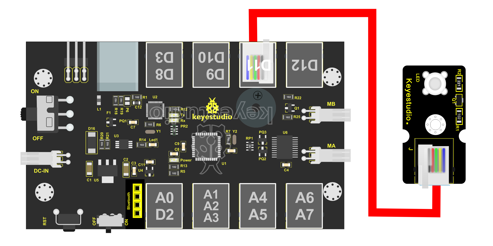

   KS0353 1

Wiring Diagram

The wiring is pretty simple. You can connect the EASY plug Piranha LED
module to the `KETBOT control
board <http://wiki.keyestudio.com/index.php/Ks0350_Keyestudio_KEYBOT_Coding_Robot_Control_Board>`__
using only an RJ11 cable.

|image98|

Hookup as the above diagram, next we will show the first program to
light up the LED module, making LED on for one second then off for one
second, repeatedly.

**Test Code 1**

After copy and paste the above code to Mixly software, if done
compiling, click on the Upload button.

When upload well the code to the board, you will see the status at the
bottom show “Upload success! ”. And the LED on the module lights up for
one second, then off for one second, repeatedly. Congrats! The first
program is completed successfully.

|image99|

Project 2: LED Brightness Controlled by PWM
-------------------------------------------

**Introduction**

In the previous lesson, you have learned how to turn on or off the LED.
Furthermore, you may be interested in changing the brightness of LED
light, just like your bedside lamp.

It is indeed important for you to master the knowledge of PWM. PWM is
short for Pulse Width Modulation. How can it be understood in a simple
way? We all know that the voltage output of Arduino Digital port only
has two states, LOW and HIGH, corresponding to the voltage output of 0V
and 5V. If merely make use of LOW and HIGH state, it cannot control the
brightness of an LED light.

However, if convert the voltage output of 0 Volts and 5 Volts into the
value within 0-255, this way you can change the value within 0-255 to
control the brightness of light. It is much more feasible, right?

Pulse Width Modulation, or PWM, is a technique for getting analog
results with digital means. Digital control is used to create a square
wave of different duty cycle, a signal switched between on and off. This
on-off pattern can simulate voltages in between full on (5 Volts) and
off (0 Volts) by changing the portion of the time the signal spends on
versus the time that the signal spends off.

The Arduino UNO has totally 6 PWM outputs, which are Digital 3, 5, 6, 9,
10 and 11.

|image100|

These PWM pins can be used as Digital output or Analog output. If used
as Analog output, need to call the Mixly block and this analogWrite()
function can be controlled in the range of 0-255.

In the graphic below, the green lines represent a regular time period.
This duration or period is the inverse of the PWM frequency. In other
words, with Arduino’s PWM frequency at about 500Hz, the green lines
would measure 2 milliseconds each.

A call to analogWrite() is on a scale of 0-255, such that
analogWrite(255) requests a 100% duty cycle (always on), and
analogWrite(127) is a 50% duty cycle (on half the time) for example.

.. figure:: media/54ef6da144b4531dd9ada686a7e67c56.GIF
   :alt: pwm

   pwm

PWM can be applied to lots of applications, like dimming lamps, motor
speed, sound production, etc.

In the following, you will learn how to control the light brightness?

Firstly, you can connect the EASY plug Piranha LED module to KETBOT
coding control board with only a 6P6C RJ11 cable. In fact, it works on
either D11 or D9-D10 connector. (If connecting the D11 to test the LED,
D9-D10 cannot be used.)

Wiring Diagram

Below is a wiring diagram used to control the LED brightness.

   KS0353 1

**Test Code 2**

**Code Explanation**

|image101|

**AnalogWrite(pin,value);**

Writes an analog value (`PWM
wave <http://arduino.cc/en/Tutorial/PWM>`__) to a pin 11.

It has two parameters:

- **PIN#:** the pin to write to. Allowed data types: int.

- **value:** the duty cycle: between 0 (always off) and 255 (always on).
  Allowed data types: int

Can be used to light a LED at varying brightnesses or drive a motor at
various speeds. After a call to analogWrite(), the pin will generate a
steady square wave of the specified duty cycle until the next call to
analogWrite() (or a call to digitalRead() or digitalWrite()) on the same
pin.

The frequency of the PWM signal on most pins is approximately 490 Hz.

**Phenomenon Show**

Furthermore, in the motor driving project below, it also involves the
PWM.

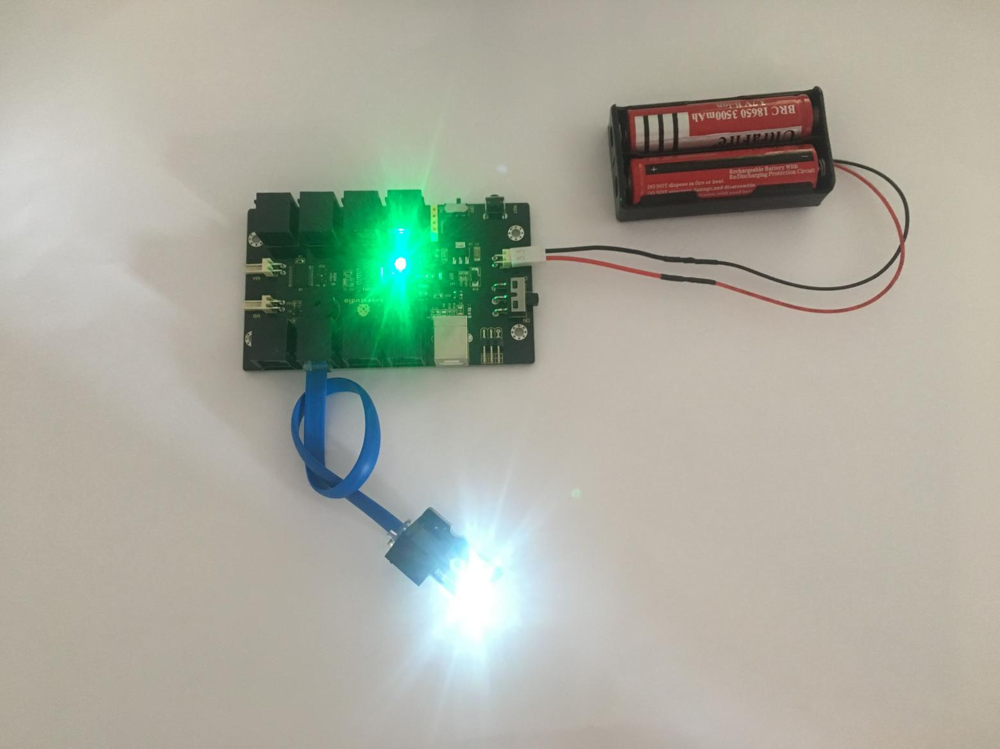

   ks0353- result 1

Project 3: KEYBOT Line Tracking Robot
-------------------------------------

Principle and Application of Line Tracking Sensor

**Introduction**

The tracking sensor is actually an infrared sensor. The component used
here is the TCRT5000 infrared tube. Its working principle is to use the
different reflectivity of infrared light to the color, then convert the
strength of the reflected signal into a current signal. During the
process of detection, black is active at HIGH level, but white is active
at LOW level. And detection height is 0-3 cm.

The following figure is our `KEYBOT 3-channel line tracking
module <http://wiki.keyestudio.com/index.php/KS0352_Keyestudio_KEYBOT_Programmable_Robot_3-way_Line_Tracking_Sensor>`__.
We have integrated 3 sets of TCRT5000 infrared tube on a single board,
pretty convenient for wiring and controlling.

By rotating the adjustable potentiometer on the sensor, it can adjust
the detection sensitivity of the sensor. The sensitivity is the best
when the S1, S2 and S3 are adjusted to make the LEDs between on and off
state.

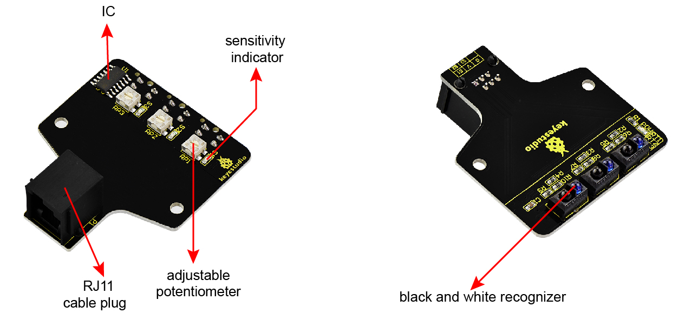

   KEYBOT tracking sensor

**Parameters**

- Operating Voltage: DC 5V

- Interface: RJ11 connector

- Output Signal: 3-channel digital signal

- Detection Height: 0-3cm

**Wiring Diagram**

Okay, next let’s do a simple test for this tracking module. Connect the
KEYBOT 3-channel line tracking sensor to the plug A1-A2-A3 of control
board. Then connect the white Piranha LED module to the plug D9. When
the sensor of any channel detects a white object, a LED on the module
will light up.

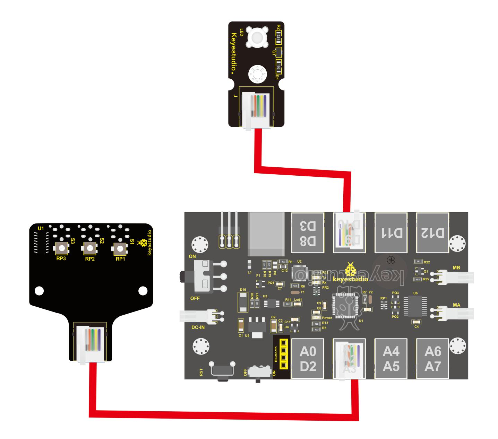

   KS0353 2

**Test Code 3**

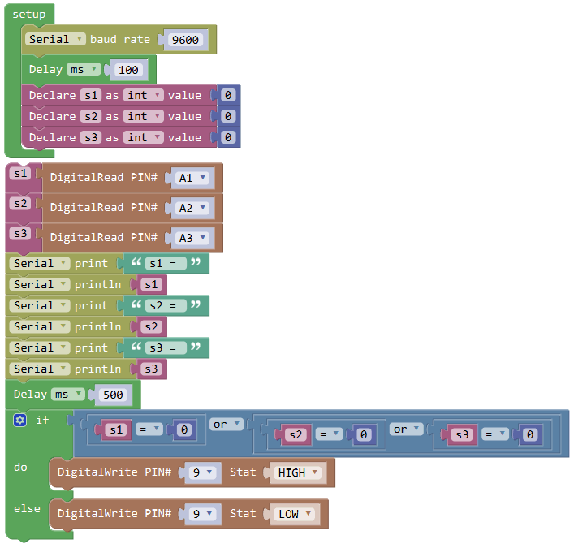

   IMG_256

Upload well the code to the board, if pick up a white object close to
the tracking module, you should see the white LED module light up. Shown
below.

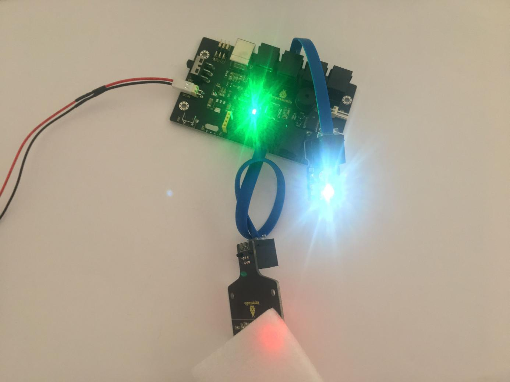

   ks0353- result 2

Project 4: Motor Driving and Speed Control
------------------------------------------

**Introduction**

The Keyestudio KEYBOT Coding Control Board is particularly designed for
car robot control.

This control board has integrated the UNO R3 control board and a motor
driver into one circuit board, which can directly drive two DC motors.

For the convenience of car design, this control board comes with a
Bluetooth interface (fully compatible with HC-06 Bluetooth module), 2
servo interfaces and a passive buzzer.

For easy car control, this control board also comes with 2 slide
switches and a reset button. The large slide switch is used for an
external power supply control. While the small switch is used for the
serial port communication of Bluetooth module.

For simple connection, it extends all the digital and analog ports out
as RJ11 sockets. It also comes with a power interface. The RJ11 socket
integrates the digital and analog ports together, so you just need a
cable to connect it with sensor modules, pretty simple and convenient.

**Specifications**

- Main control chip: ATMEGA328P-AU
- Motor drive chip: TB6612FNG
- USB to serial chip: ATMEGA16U2-MU
- Input voltage: DC 7-12V
- Motor drive current: 1.2A (ave) / 3.2A (peak)
- Standby current: 47mA
- Comes with a passive buzzer: D13 control
- Motor direction interface: D4 (motor A) and D7 (motor B)
- Motor speed interface: D5 (motor A) and D6 (motor B)
- Comes with 2 slide switches: power control switch (large one) and
  Bluetooth serial communication control switch (small one)
- Comes with a Bluetooth interface: suitable for HC-06 Bluetooth, fixed
  direction, can not be connected if reversed.
- Comes with 2 servo interfaces: D9 and D10 control respectively
- Comes with a reset button
- Comes with a power input interface
- 2 DC motor connection interfaces (labeled MA and MB)
- It has 8 RJ11 sockets for external sensors and modules (internal with
  power interface). The control terminals are: D3 and D8, D9 and D10,
  D11, D12, D2 and A0, A1 A2 and A3, A4 and A5, A6 and A7.

**Elements and Interfaces**

Here is an explanation of what every element and interface of the board
does:

**KS0350 -pinouts**

**Driving DC Motor**

In the previous section, we have introduced the basic parameters and
interfaces of KETBOT control board. After that, let’s connect the
control board to drive the two DC motors.

**KS0353 3**\ Note that the motor with longer lead is connected to the
connector MB, so another motor with short lead is connected to MA.

Well, it is time to create the sketch.

The code logic of the KEYBOT is nothing more than 5 kinds of movement
modes, namely go forward, go backward, turn left, turn right and stop.
So think about it. How could it implement those functions?

Simply, for example, both left and right motor of KEYBOT turn forward,
so the robot is able to go forward. If both the left and right motor
turn reverse, KEYBOT robot will go backward.

Besides, if the left motor turns forward but right motor turns reverse,
KEYBOT will turn right. If the right motor turns forward but left motor
turns reverse, KEYBOT will turn left.

So how to control the forward and backward of motor? Actually, you can
easily achieve that by controlling the microcontroller pin for motor
direction to be HIGH or LOW level.

It is much more easier to understand the motor rotation, however, it
would be a little bit complicated to work out the speed control of
motor.

As for the speed control of motor, it involves the PWM mode. So what is
PWM? Actually PWM is the short for Pulse Width Modulation. PWM is a
technique for getting analog results with digital means. Digital control
is used to create a square wave (a signal switched between on and off)
to control the analog output.

The output voltage of Arduino Digital port has only LOW and HIGH level,
so does Mixly block, corresponding to the output voltage of 0 Volts and
5 Volts.

In the graphic below, the green lines represent a regular time period.
This duration or period is the inverse of the PWM frequency. In other
words, with Arduino’s PWM frequency at about 500Hz, the green lines
would measure 2 milliseconds each.

|image102|

A call to analogWrite() is on a scale of 0-255, such that
analogWrite(255) requests a 100% duty cycle (always on), and
analogWrite(127) is a 50% duty cycle (on half the time) for example.

**PWM analog output**

.. figure:: media/54ef6da144b4531dd9ada686a7e67c56.GIF
   :alt: pwm

   pwm

The speed control has already connected to D5 and D6 on the control
board, that is PWM port.

|image103|

The PWM calls the function **analogWrite(pin, value)**

Note: Change the PIN# to the corresponding pin. The value is between 0
(always off) and 255 (always on).

The speed of the motor is controlled actually by this value. The bigger
the value is, the faster the speed is. Rather, the smaller the value is,
the slower the speed it is until stop.

In the following figure, look at the language logic of motor’s 5 states:
go forward, backward, turn left, turn right and stop.

The digital output pin **PIN#4** and **PIN#7** control the two motors
direction, that is, forward and backward rotation. The analog output pin
**PIN#5** and **PIN#6** control the motor’s speed.

+----------+-----------+-----------+---------------+-----------+-----------+--------------+
|          | **PIN#5** | **PIN#4** |               | **PIN#6** | **PIN#7** |              |
+==========+===========+===========+===============+===========+===========+==============+
| Forward  | 200       | HIGH      | Motor A goes  | 200       | HIGH      | Motor B goes |
|          |           |           | forward       |           |           | forward      |
+----------+-----------+-----------+---------------+-----------+-----------+--------------+
| Backward | 200       | LOW       | Motor A goes  | 200       | LOW       | Motor B goes |
|          |           |           | backward      |           |           | backward     |
+----------+-----------+-----------+---------------+-----------+-----------+--------------+
| Left     | 200       | LOW       | Motor A goes  | 200       | HIGH      | Motor B goes |
|          |           |           | backward      |           |           | forward      |
+----------+-----------+-----------+---------------+-----------+-----------+--------------+
| Right    | 200       | HIGH      | Motor A goes  | 200       | LOW       | Motor B goes |
|          |           |           | forward       |           |           | backward     |
+----------+-----------+-----------+---------------+-----------+-----------+--------------+
| Stop     | 0         | LOW       | Motor A stops | 0         | LOW       | Motor B      |
|          |           |           |               |           |           | stops        |
+----------+-----------+-----------+---------------+-----------+-----------+--------------+

**Test Code 4**

**Test Result**

Done uploading the code to the board, connect two external DC motors to
the board, then power it with DC 7-12V. Turn on the larger slide switch
on the board, finally you should see the two motors turn forward for 1
second, stop for 1 second and then reverse for 1 second, stop for 1
second, repeatedly.

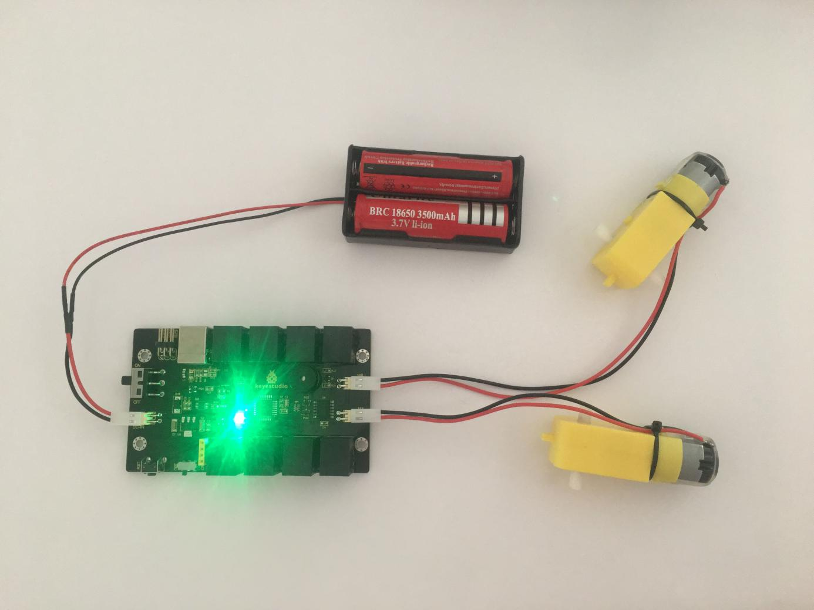

   ks0353- result 3

Project 5: KEYBOT Line Following
--------------------------------

**Introduction**

In the previous sections, you have learned the principles and
applications of both line tracking module and motor driving. After that,
combine the tracking sensor and control board to build a line following
KEYBOT.

So at first what does line tracking mean? It refers to follow the line
trajectory. You might often see some robots always follow or track the
black line.

The principle is using the tracking sensor to detect the black track on
the pavement, and detection signal will feed back to the main control
board. Then main control board will analyze and judge the collected
signals to control and drive the motor in time, thus can adjust KEYBOT
turning direction. That is why the KEYBOT can automatically follow the
black track, achieving the automatic line tracking function.

This technology has been applied to many areas such as driverless
vehicles, unmanned factories, warehouses, and service robots.

**Project Principle**

Using the characteristic that black has low reflectivity to light. When
flat surface is not black, the infrared light transmitted by the sensor
will be reflected back mostly, so the sensor outputs LOW level 0.

When the flat surface has a black line and the sensor is over the black
line, the reflected infrared light is very less due to the weak
reflectivity of black, so it does not reach the action level and sensor
outputs HIGH level 1.

Use the main control board to determine whether the output end of sensor
is 0 or 1, finally detect the black line. The main control board will
control the turning direction of motor according to the received signal.
This is a simple line tracking KEYBOT.

**Wiring Diagram**

Connect the tracking sensor, two motors and battery to the control board
as follows.

.. figure:: media/8366bc1258b7789000f5839b07c74e7f.jpeg
   :alt: KS0353 4

   KS0353 4

**Write the Code**

Wire it up well as the above diagram. Okay, let’s move on to write the
test code. Think about the code logic.

There are two kinds of tracking sensor’s states as follows:

1. If the middle tracking sensor detects a black line, the robot will go
   forward.

2. The middle tracking sensor does not detect a black line. If the left
   sensor detects a white line, and the right sensor detects a black
   line, the robot will turn right. On the contrary, if the right sensor
   detects a white line, and the left one detects a black line, the
   robot will turn left. If three sensors all detect a white line, it
   will stop.

Well, figure out the logic, then combine with the example code of motor
driving mentioned in the above section, you can have a try to write out
the code logic of line tracking.

**Test Code 5**

|image104|

**Test Result**

Done uploading the code to the board, then power it with DC 7-12V. Turn
on the larger slide switch on the board, and draw a black line on the
ground, the KEYBOT will follow the black line.

|image105|

Project 6: KEYBOT Avoiding Obstacles
------------------------------------

Principle and Application of Ultrasonic Module

|image106|

**Introduction**

There is an animal called bat in nature. The bats can fly at night, not
depend on its eyes, but on its ears and vocal organs. When the bat
flies, it will emit a scream, an ultrasonic signal that humans cannot
hear because of its high audio frequency. If these ultrasonic signals
hit other objects on the flight path, they will be reflected back
immediately. After receive the returned information, the bats complete
the whole process of listening, seeing, calculating and bypassing
obstacles during the flutter.

The principle of the ultrasonic rangefinder module is as the same as the
above principle. The ultrasonic module will emit the ultrasonic waves
after trigger signal. When the ultrasonic waves encounter the object and
are reflected back, the module outputs an echo signal, so it can
determine the distance of object from the time difference between
trigger signal and echo signal. Ultrasonic sensor has a wide range of
sensitivity, no blind area, and no interference with obstacles.

As the following picture shown, it is our KEYBOT ultrasonic module. It
has two somethings like eyes. One is transmitting end, the other is
receiving end.

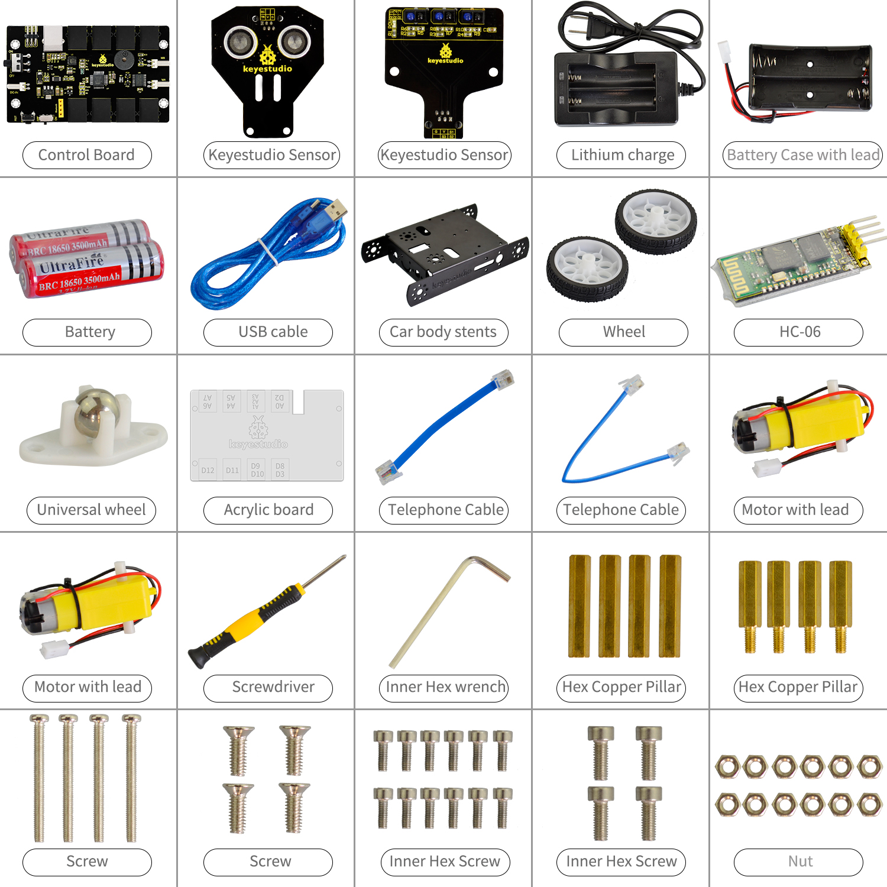

   清单

**Parameters**

- Operating Voltage: 5V（DC）

- Operating Current: 15mA

- Operating Frequency: 40khz

- Maximum Detection Distance: 3-5m

- Minimum Detection Distance: 3-4cm

- Sensing Angle: less than 15 degrees

**Hookup Guide**

Connect the ultrasonic module to the control board with only a 6P6C RJ11
cable. Shown as below.

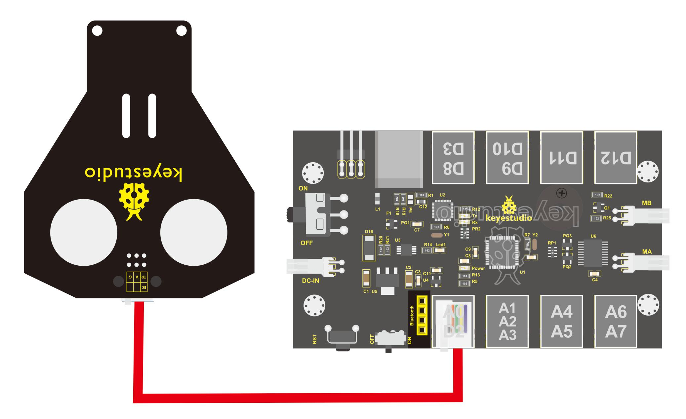

   KS0353 5

**【Notice:】**

1. Must first connect the ultrasonic module and then power up.

2. Measurement period is better at more than 60ms. To prevent the impact
   of the transmitted signal to the echo signal.

**When using it:**

(1) Use IO trigger ranging, at least 10us HIGH level signal; that is,
    first pull the Trip Low, then give a HIGH level signal of 10us.

(2) The module automatically sends eight square waves of 40khz to
    automatically detect whether there is a signal return back;

(3) There is a signal return, through the IO output a High level, and
    the duration period of High level is the time of Ultrasonic wave
    from emission to return.

Test distance = (High level time \* speed of sound (340M/S))/2;

Then you can get the distance formula: detection distance = (High level
time/58) (cm);

**Test Code 6**

**Library function:**

**Test Result**

|image107|

Hook it up and upload well the code to main board, then open the serial
monitor, and set the baud rate to 9600. When ultrasonic sensor detects
an obstacle ahead, on the monitor you should see the distance between
the sensor and an obstacle, displaying every 0.5 second.

Project 7: KEYBOT Avoiding Obstacle
-----------------------------------

Introduction

It is rather not suitable for human to work in some relatively harsh
environments. At this moment, if we have a robot that can shuttle freely
in such environments, then how good should it be!

Based on this original intention, our team develop this KEYBOT that be
able to automatically avoid an obstacle when running on complicated
terrain.

This project is a simple and automatic obstacle avoidance system based
on KETBOT control board. The smart robot with KEYBOT control board as
the core, makes use of ultrasonic module to detect the obstacle ahead,
and the detection signal will feed back to the control board.

The control board will then analyze and judge the collected signals to
control the motor driving in time, thus adjust the KEYBOT direction.
Finally control the KEYBOT automatically avoid an obstacle ahead to run
forward smoothly.

**Project Principle**

1. Use the ultrasonic module to detect the distance between the KEYBOT
   and obstacle ahead.

2. KEYBOT control board will control the motor’s rotating direction
   according to the distance value measured by ultrasonic sensor between
   KEYBOT and an obstacle.

3. When the measured distance between ultrasonic sensor and obstacle
   ahead is greater than 25cm, KEYBOT goes forward. If less than 25cm,
   KEYBOT turns left, and detects the distance between sensor and
   obstacles, then KEYBOT turns right, and detects the distance between
   sensor and obstacles.

When the left distance is greater than the right distance, KEYBOT will
turn left. Otherwise, it turns right.

**Hookup Guide**

Connect the ultrasonic module to control board with only an RJ11 cable.
And separately connect two motors and batteries to the board. Shown as
below.

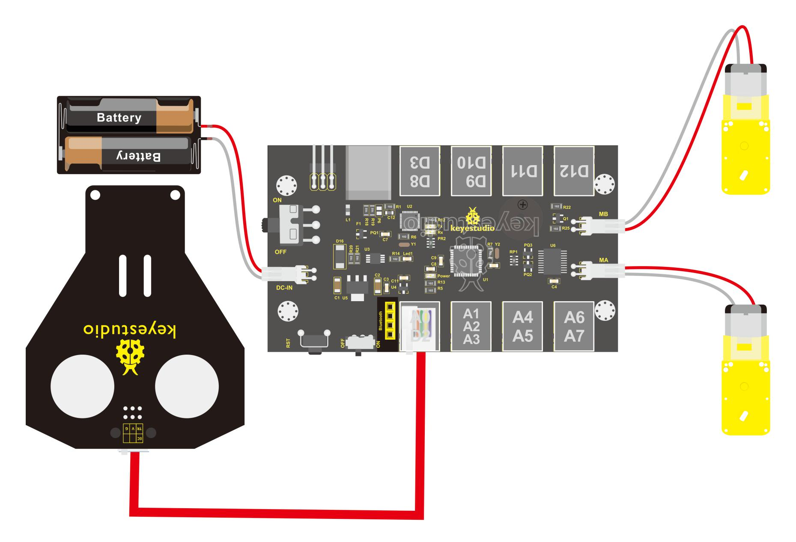

   KS0353 6

**Test Code 7**

**避障**

|image108|

**Test Result**

Done uploading the code to the board, then power it with DC 7-12V. Turn
on the larger slide switch on the board, if place an obstacle in front
of the KEYBOT, it can automatically avoid an obstacle ahead to run.

|image109|

Project 8: Bluetooth Controlled KEYBOT
--------------------------------------

Principle and Application of Bluetooth Remote Control

Introduction

Bluetooth, as the name implies, blue teeth, and is not used to bite
people, but a wireless data transmission method. Bluetooth technology is
a wireless standard technology that enables short-range data exchange
among fixed devices, mobile devices, and personal area networks of
buildings (UHF radio waves in the ISM band of 2.4 to 2.485 GHz).

There are two kinds of commonly used Bluetooth module on the market,
HC-05 and HC-06 models. The difference between them is that the HC-05 is
a master-slave one. It can not only make small reports to its own
“master”, but also can receive the command given to it.

The HC-06 can only work in slave mode, which can only accept the
superior command. For instance, in many cases you may want to be an
overbearing man, letting the subordinates obey the order without any
nonsense. So in such situation, it is enough to use the HC-06 module
shown as below.

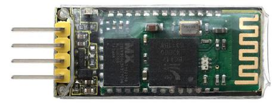

   hc-06

**Parameters**

- Bluetooth Protocol: Bluetooth 2.1+ EDR Standard

- USB Protocol: USB v1.1/2.0

- Operating Frequency: 2.4GHz ISM Frequency Band

- Modulation Mode: Gauss Frequency Shift Keying

- Transmit Power: ≤ 4dBm, Second Stage

- Sensitivity: ≤-84dBm at 0.1% Bit Error Rate

- Transmission Speed: 2.1Mbps(Max)/160
  kbps(Asynchronous)；1Mbps/1Mbps(Synchronous)

- Safety Feature: Authentication and Encryption

- Supported Configuration: Bluetooth Serial Port (major and minor)

- Supply Voltage: DC 5V

- Operating Temperature: -20℃ to 55℃

**Wiring Diagram**

Next, we are going to do a small experiment. When Bluetooth module
receives a signal sent by phone, control the LED module on and off.
First of all connect the LED module and battery to control board, and
then directly plug the Bluetooth module into the Bluetooth header.

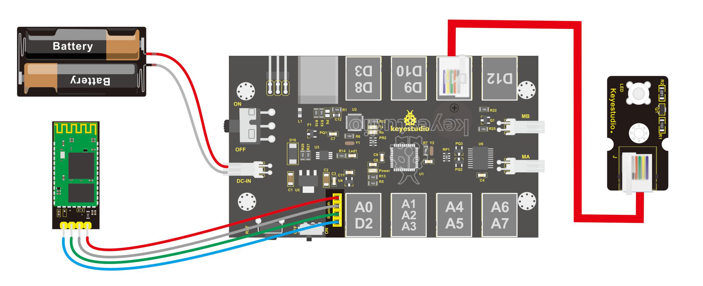

   KS0353 7

**Test Code 8**

After wiring, upload the above code to the board, and connect well the
Bluetooth module. Pay more attention to the connecting direction of
Bluetooth module. Plug it correctly and you should see an LED on the
module flash.

**Pay special attention to:**

You must first upload the code to the board and then plug in the
Bluetooth module, otherwise the program fails to compile. Because the
data transmits of Bluetooth module will occupy the microcontroller’s TX
and RX pins that are also used for the code upload of microcontroller,
it exists a conflict.

|image110|

After uploading the code, you have to do another thing, that is, install
an application of Bluetooth serial assistant on the phone. You can click
the icon to download it or click here:

https://drive.google.com/open?id=1D16V4HZ5H6k7p1-NMCqb0JRy_dl5tvuC

The Bluetooth we used here is Bluetooth 2.0. Currently, it only supports
the Android devices. Do not support Apple devices. Please pay attention
to this when using it.

After the serial assistant is installed, we must first connect the
device, open the mobile Bluetooth, search for a Bluetooth device. If
find a Bluetooth device named HC-06, pair and enter 1234, finally you
should see the paired device shown as below.

|BTClient|\ |bluetooth-1|

Then open the Bluetooth serial communication APP, namely BT Client, and
connect well the Bluetooth just paired.

Done connecting, an LED on the Bluetooth module is always on. If enter
the letter *a* on the Bluetooth APP, the LED connected on the pin 11 is
on; if enter the letter *b*, the LED will be off.

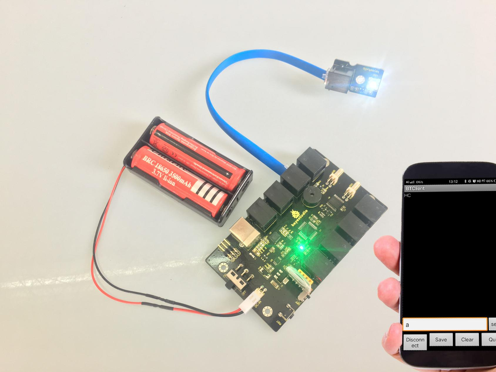

   q

Project 9: Bluetooth Controlled KEYBOT
--------------------------------------

Introduction

In the previous section, you have learned the principles of Bluetooth
and how to use Bluetooth to control a small light. Okay, based on that,
could we use Bluetooth to send a command to control the KEYBOT run?
Absolutely yeah. In the previous section, we can use a mobile APP to
send a character. Use a Bluetooth module to receive the Bluetooth signal
from the mobile phone, and feed it back to the main control board. Then
main control board will analyze and judge the collected signals. If
correct, it will control the KEYBOT run.

|image111|

Here we don’t need a Bluetooth serial assistant as mentioned above. Just
use an Android APP developed by our keyestudio team to control the
KEYBOT.

You can click the icon to download it or clink here:

https://drive.google.com/open?id=1g-bwP1SyJVfQseywRORQ6rOJOVd3JU5i

The interface of this APP is very simple, as shown below.

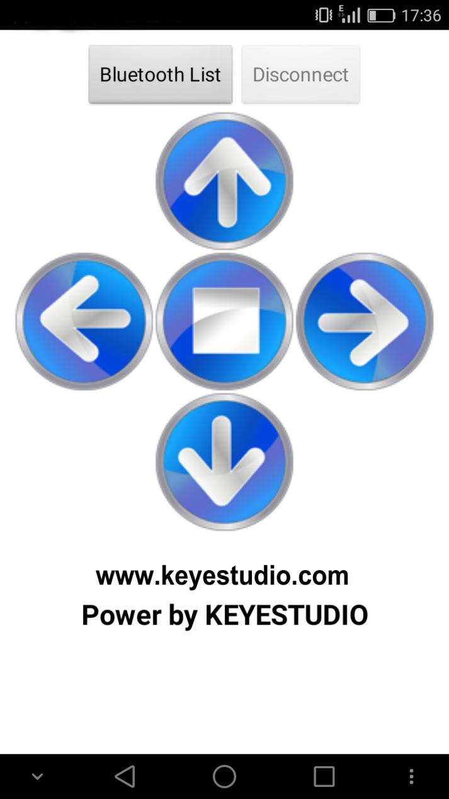

   Bluetooth

Connected the Bluetooth, let’s make use of a little program that can
read the serial data, to check what character the five buttons send so
that apply them to the example code of Bluetooth KEYBOT in the following
projects.

**Test Code 9**

From the above program test, you can know that the five buttons are
Upward (“U”), Downward (“D”), Left (“L”), Right (“R”), and Stop (“S”).

The principle is very simple. When Bluetooth module receives these
characters sent by mobile phone, and then it will send them to ARDUINO.
ARDUINO will control the rotation direction of motor according to the
preset value in the code. When receive the information “U”, KEYBOT moves
forward. When receive “D”, KEYBOT goes backward. If receive “L”, KEYBOT
turns left. If receive “R”, KEYBOT turns right. The KEYBOT will stop
when receiving the “S”.

**Hookup Guide**

Refer to the connection diagram below. Directly plug the Bluetooth
module into control board. Connect the motor with longer wire to MB,
while another motor with short wire is connected to MA. Then connect the
batteries to DC-IN.

|KS0353 8| **Test Code 10**

**Test Result**

Done uploading the above code to control board, open APP, connect the
Bluetooth, you should see the LED on the Bluetooth module is always on.
Press down any buttons on APP, you are able to control the KEYBOT run
freely.

|image112|

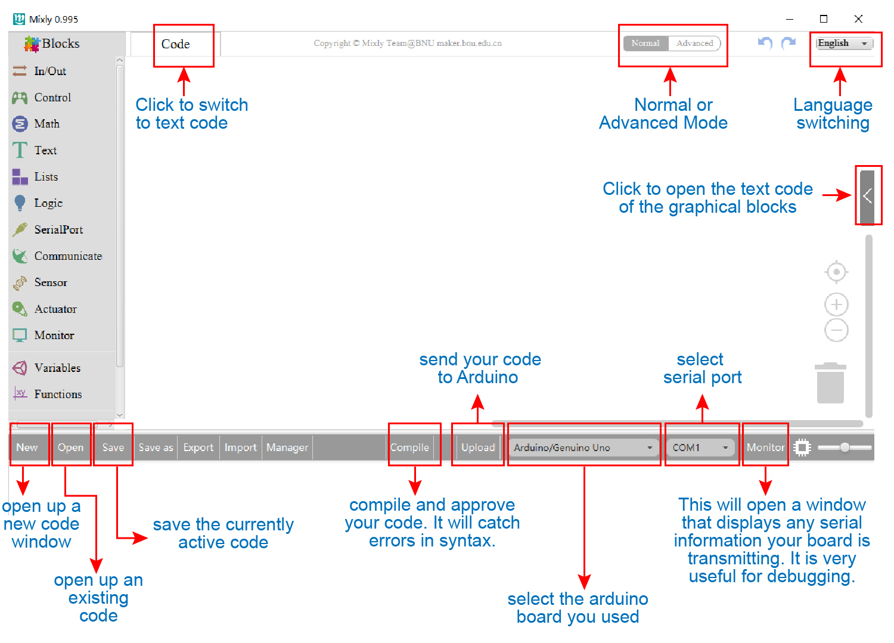
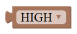
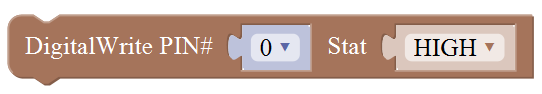
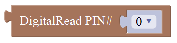
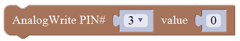
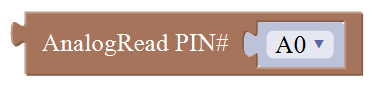
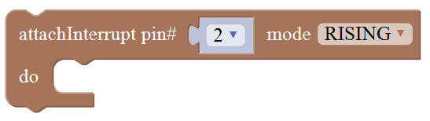
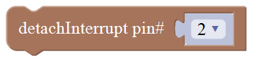
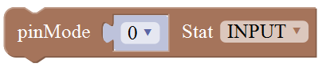
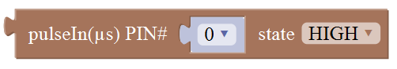
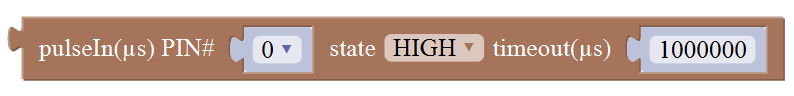
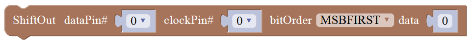
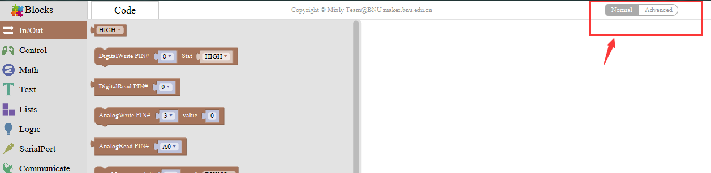

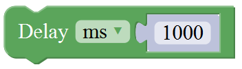
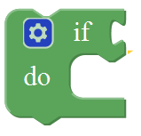

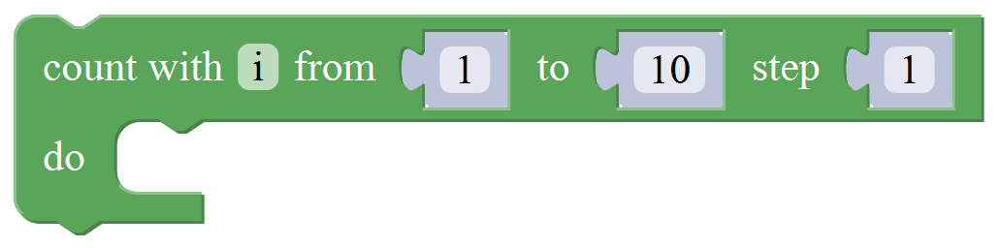
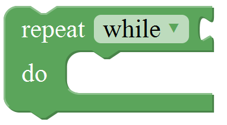

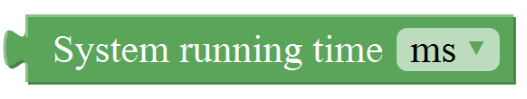
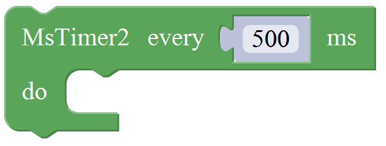

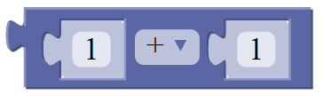
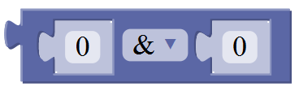

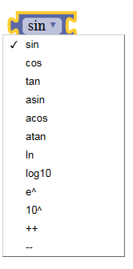

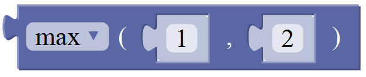
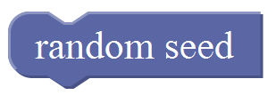
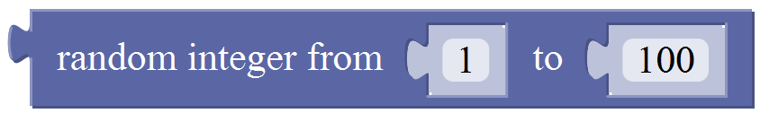

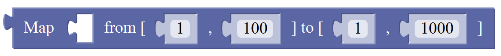

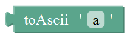
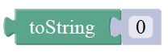

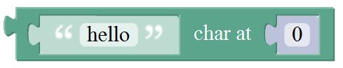

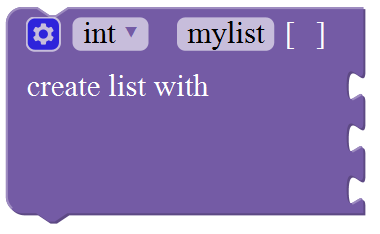
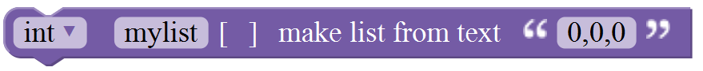

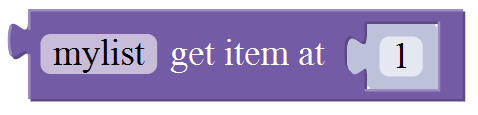


