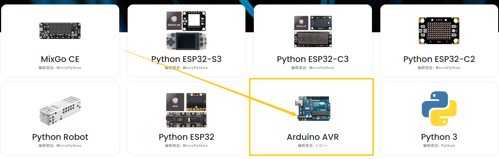
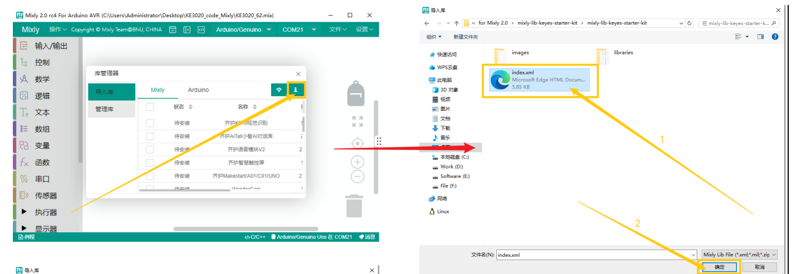

4. Mixly
========

4.1 资料下载
------------

资料下载：:download:`资料下载 <./Mixly.7z>`
（包含库文件，软件安装包，项目PP和代码）

4.2 软件安装
------------

1. 下载压缩包，压缩包存放路径不要有中文

|image1|

2. 解压压缩包，打开文件夹，打开\ |image2|\ 。

3. 需要输入的地方全部输入“y”，等待更新即可。

|image3|

4. 更新完毕后，关闭。

   |image4|

5.再次打开文件夹，可以看到软件已存在，点击打开。

|image5|

4.3 软件介绍
------------

1. 打开软件后，选择“Arduino AVR”.

2. 工具栏介绍

   |image6|

4.4 导入库文件
--------------

1. 点击“设置”—->“管理库”

   |image7|

2.选择本地导入，再选择所需的库文件，选择库文件中的“.xml”后缀的文件导入。

|image8|

4.5 上传代码文件
----------------

1. 点击“文件”—->“打开”

|image9|

2. 找到代码保存的位置，选择“.mix”文件，点击“确定”

|image10|

3. 点击“上传”。

   .. figure:: ./media/image-20250610151751682.png
      :alt: image-20250610151751682

.. |image1| image:: ./media/image-20250610134847834.png
.. |image2| image:: ./media/image-20250610135141637.png
.. |image3| image:: ./media/image-20250610135733798.png
.. |image4| image:: ./media/image-20250610141058386.png
.. |image5| image:: ./media/image-20250610144118850.png
.. |image6| image:: ./media/image-20250610144636311.png
.. |image7| image:: ./media/image-20250610150044409.png

.. |image9| image:: ./media/image-20250610151244614.png
.. |image10| image:: ./media/image-20250610151446877.png
