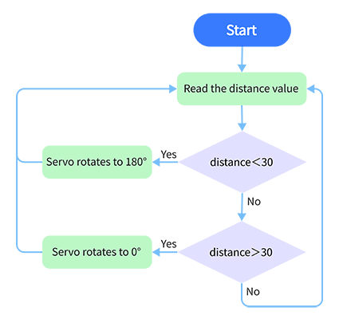

### Project 28 Intelligent Gate

**1. Description**

The intelligent gate is an intelligent parking lot system that  integrates MCU and ultrasonic sensor, which automatically controls the gate according to the distance of cars, so as to better control the car access. 

When a certain distance is reached, MCU receives the signal from the sensor and estimates the distance via the signal intensity. If the car is approaching or leaving, MCU will open or close the gate via a servo. 

**2. Flow Chart**

**3. Wiring Diagram**

**4. Test Code**

Define a variable "distance" with the assignment of detected distance value by the ultrasonic module. 

Next, Compare the distance value with 30cm. If it is smaller than 30cm, the servo will rotate to 180° for 5s. Otherwise, the servo returns to 0°.

**5. Test Result**

After connecting the wiring and uploading code, the servo will rotate to 180° for 5s if the detected distance is less than 30cm. On the contrary, the servo will rotate to 0°.