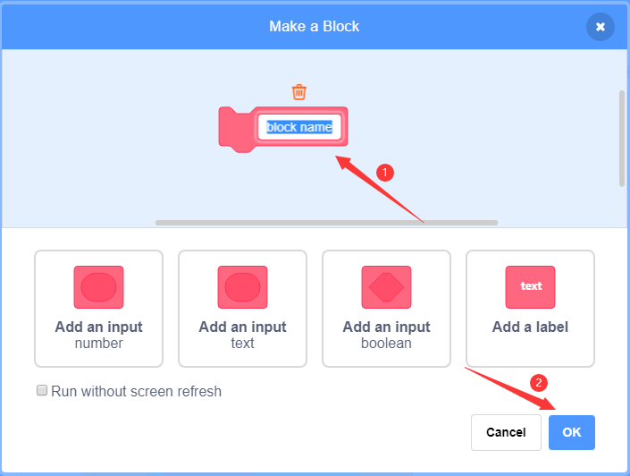

### Project 30 Smart Home

**1. Description**

In this technology era, we are all familiar with smart home. It is a system that can control electric appliance via buttons. 

In this project, we seek to stimulate a smart home via an IR remote control. With Arduino MCU as its core, it can be used to  control light, air conditioners, TV and security monitors. 

**2. Flow Chart**

**3. Wiring Diagram**

**4. Test Code**

With the IR remote control, this smart home reveals various sensor values on LCD, including a temperature and humidity sensor, a sound sensor, a photoresistor, a potentiometer and an ultrasonic sensor. 

**5. Test Result**

After connecting the wiring and uploading code, we can see the corresponding contents on LCD by pressing buttons. OK button clears the sensor display.

**6. Code Explanation**

The blocks are so many that we adopt "Make a Block" function. By doing this, numerous blocks are packaged and can be directly recalled, which vastly simplify the whole program. 

Click “My Block” to make a self-defined block, and you may build your own code blocks. 

