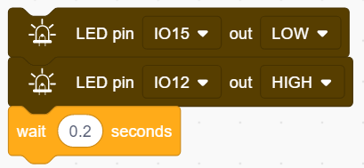
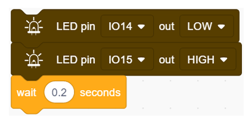

### Project 6 Water Flow Light

**1. Description**

This simple water flow light project enables to help you learn electronic packaging. In this project, we will control LEDs to change the color in a specified speed via a Arduino board.

**2. Wiring Diagram**

**3. Test Code**

A water flow light consists of a stream of LED lighting from left to right.

1. Drag the two basic code blocks.

2. Set the pin mode to “output”.

3. Drag the following blocks from "LED" part and set the IO15 pin to LOW, the IO12 pin to HIGH. Then set the delay time to 0.2s.  

4. Drag the following blocks from "LED" part and set the IO12 pin to LOW, the IO13 pin to HIGH. Then set the delay time to 0.2s.  

5. Drag the following blocks from "LED" part and set the IO13 pin to LOW, the IO14 pin to HIGH. Then set the delay time to 0.2s. 

6. Drag the following blocks from "LED" part and set the IO14 pin to LOW, the IO15 pin to HIGH. Then set the delay time to 0.2s.  

   

**Complete Code：**

**4. Test Result**  

After uploading code and powering on, the LEDs light up from left to right.