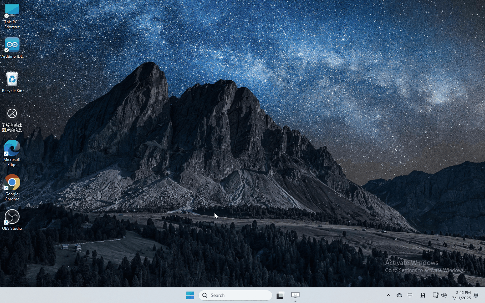

4. Kidsblock Tutorial
=====================

4.1 Data download
-----------------

Scratch information contains project ,please click to download for
follow-up study.

Data download：\ `Data download <./Scratch.7z>`__

4.2 Software installation of Windows System
-------------------------------------------

1. Download kidsblock: https://xiazai.keyesrobot.cn/KidsBlock.exe

|image1|

2. software installation

|image2|

4.3 Software installation of Mac System
---------------------------------------

1. Download kidsblock: https://xiazai.keyesrobot.cn/KidsBlock.dmg

|image3|

4.4 Use KidsBlock
-----------------

1、operating software

First connect the development board to the computer

|image4|

2、If you are unable to upload the code, please refer to the following
tutorial to install the driver (optional reading)

Install driver（Windows)

|image5|

Install driver（MAC)

|image6|

Note: If your development board is not the driver of CH340, there will
be a prompt of CH340 failure as shown in the picture, please close the
interface directly and upload the code.

.. |image2| image:: media/2.gif
.. |image3| image:: media/3.gif
.. |image4| image:: media/4.gif
.. |image5| image:: media/5.gif
.. |image6| image:: media/6.gif
