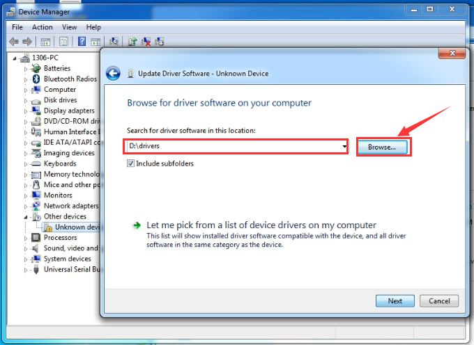
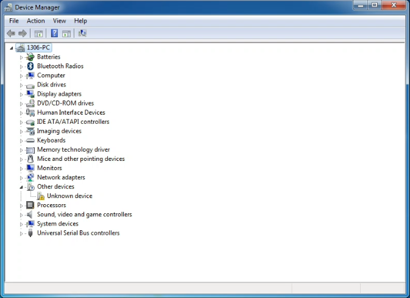
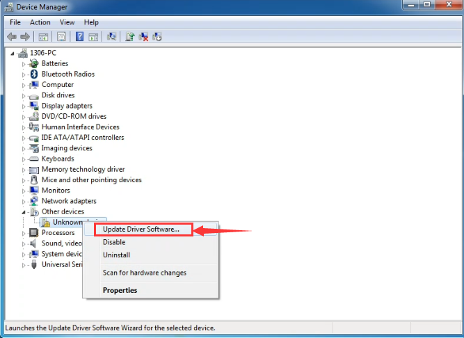
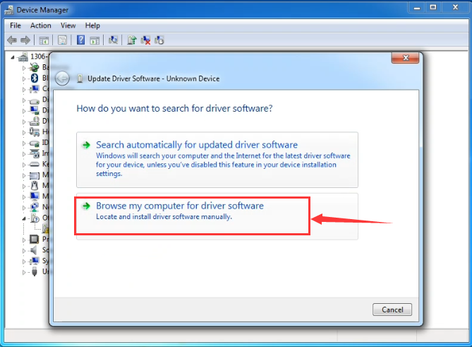
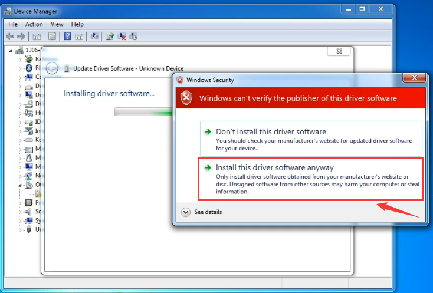
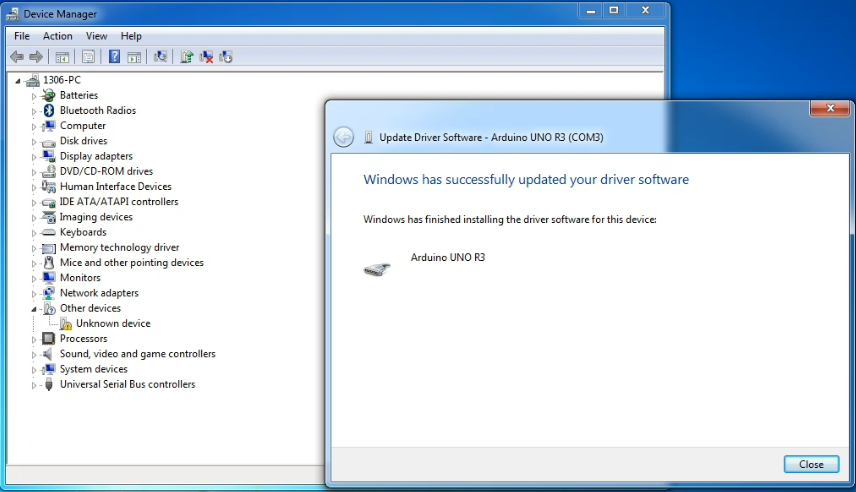
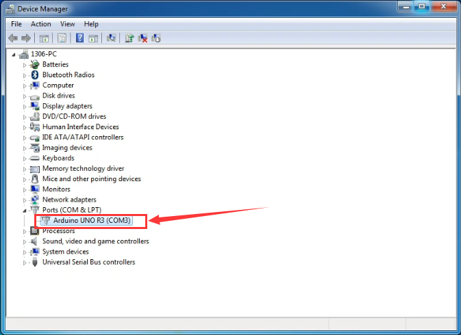

Next, we will introduce the board driver installation. The driver
installation may have slight difference in different computer systems.
So in the following let’s move on to the driver installation in the WIN
7 system.

The Arduino folder contains both the Arduino program itself and the
drivers that allow the Arduino to be connected to your computer by a USB
cable. Before we launch the Arduino software, you are going to install
the USB drivers.

Plug one end of your USB cable into the board and the other into a USB
socket on your computer.

When you connect the board to your computer at the first time, right
click the icon of your **“Computer” —>for “Properties”—> click the
“Device manager”**, under “Other Devices”, you should see an icon for
“Unknown device” with a little yellow warning triangle next to it.

|image1|

Then right-click on the device and select the top menu option (Update
Driver Software…) shown as the figure below.

|image2|

It will then be prompted to either “Search Automatically for updated
driver software” or “Browse my computer for driver software”. Shown as
below. In this page, select “Browse my computer for driver software”.

|image3|

After that, select the option to browse and navigate to the “drivers”
folder of Arduino installation.

   A}ZM5FU2XKL(5GSSBWT0KGX

Click “Next” and you may get a security warning, if so, allow the
software to be installed. Shown as below.

|image4|

Once the software has been installed, you will get a confirmation
message. Installation completed, click “Close”.

|image5|

Up to now, the driver is installed well. Then you can right click
**“Computer” —>“Properties”—>“Device manager”**, you should see the
device as the figure shown below.

|image6|

