5. Kidsblock Tutorial
=====================

5.1 Download code file
----------------------

Click to download the code file required for the course：\ :download:`Click to download <./Kidsblock.7z>`

5.2 Software installation of Windows System
-------------------------------------------

1、Download
kidsblock: https://wiki.kidsbits.cc/projects/KidsBlock/en/latest/

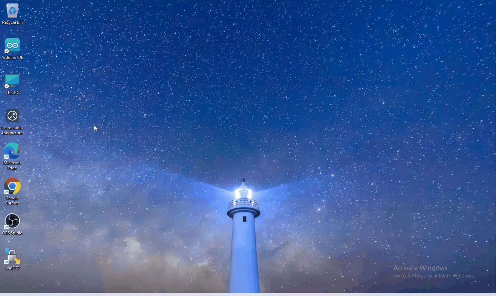

   Ani

2、software installation

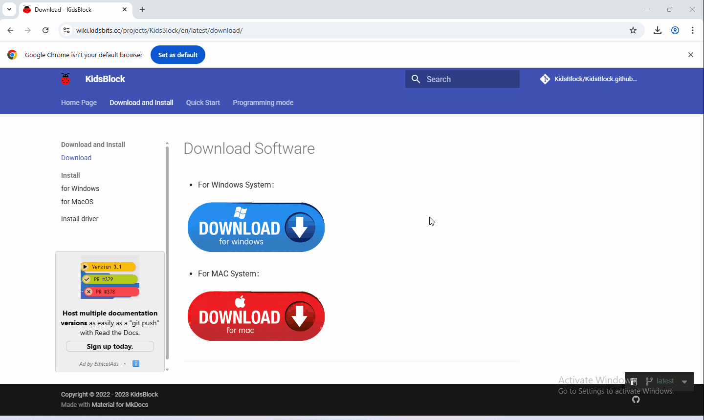

   An

3.operating software

First connect the development board to the computer

.. figure:: ./media/A3.gif
   :alt: A

   A

5.3 Software installation of Mac System
---------------------------------------

1.Download kidsblock: https://xiazai.keyesrobot.cn/KidsBlock.dmg

2.Click KidsBlock, and drag KidsBlock Desktop into Applications. |Img|

3.Wait for installing. KidsBlock icon will show up in Launchpad if it is
installed successfully. |image1|

5.5 How to use KidsBlock
------------------------

We demonstrate how to use KidsBlock on Windows system

1.Interface

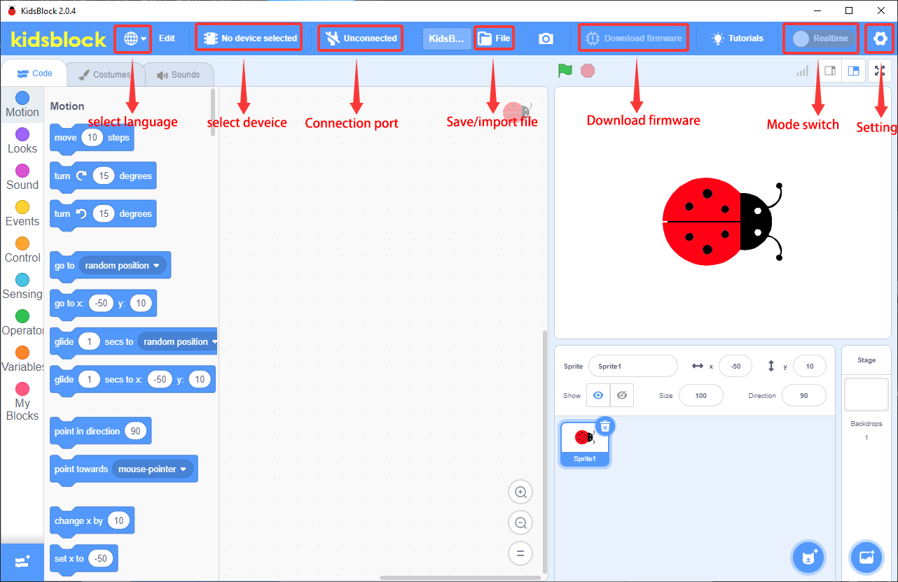

   QQ20250516-104217

2.Click\ |image2|\ to switch to different languages.

|image3|

3.Click |image4| to enter the main page, select the control board
needed. In this project, we select the “**UNO development board**”
mainboard and click **Connect,** then it is connected. Click **Go to
Editor** to return the code editor. Icon |image5| will change
into\ |image6| ，and\ |image7|\ will change into
|image-20250516094316842|. This means the Uno Plus mainboard and
ports（COM)are connected.

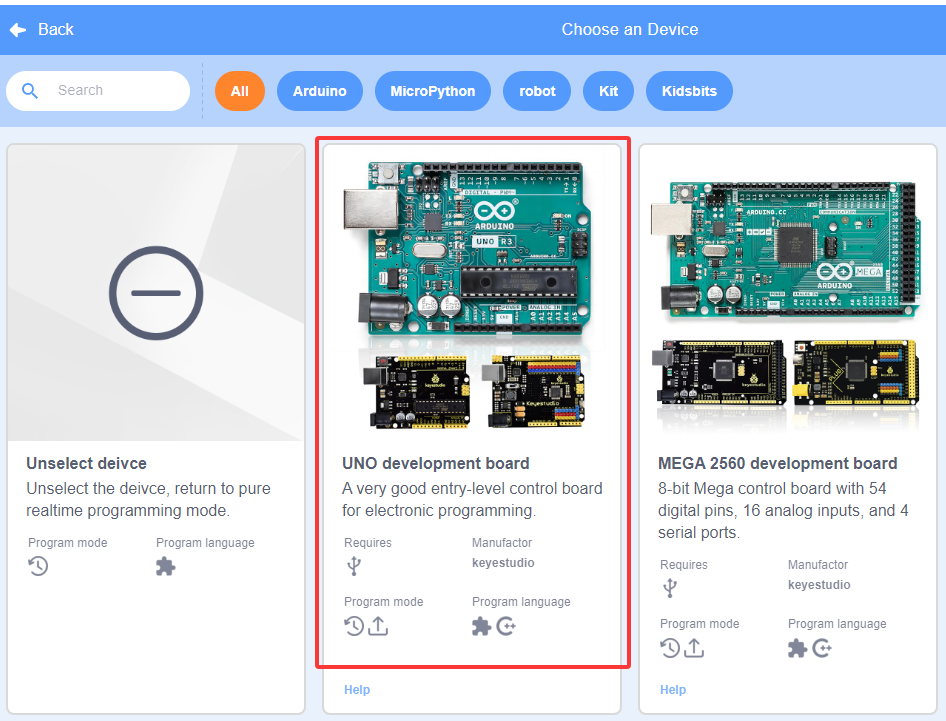

   image-20250516093857221

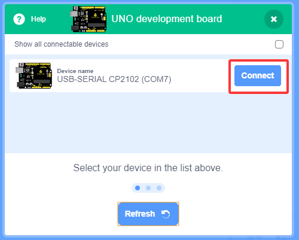

   image-20250516094005544

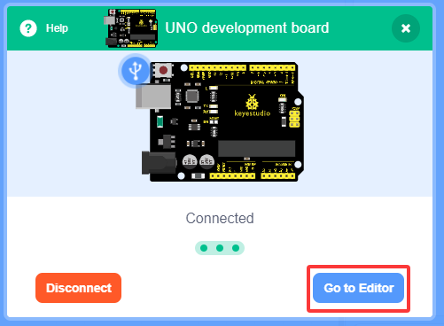

   image-20250516094026631

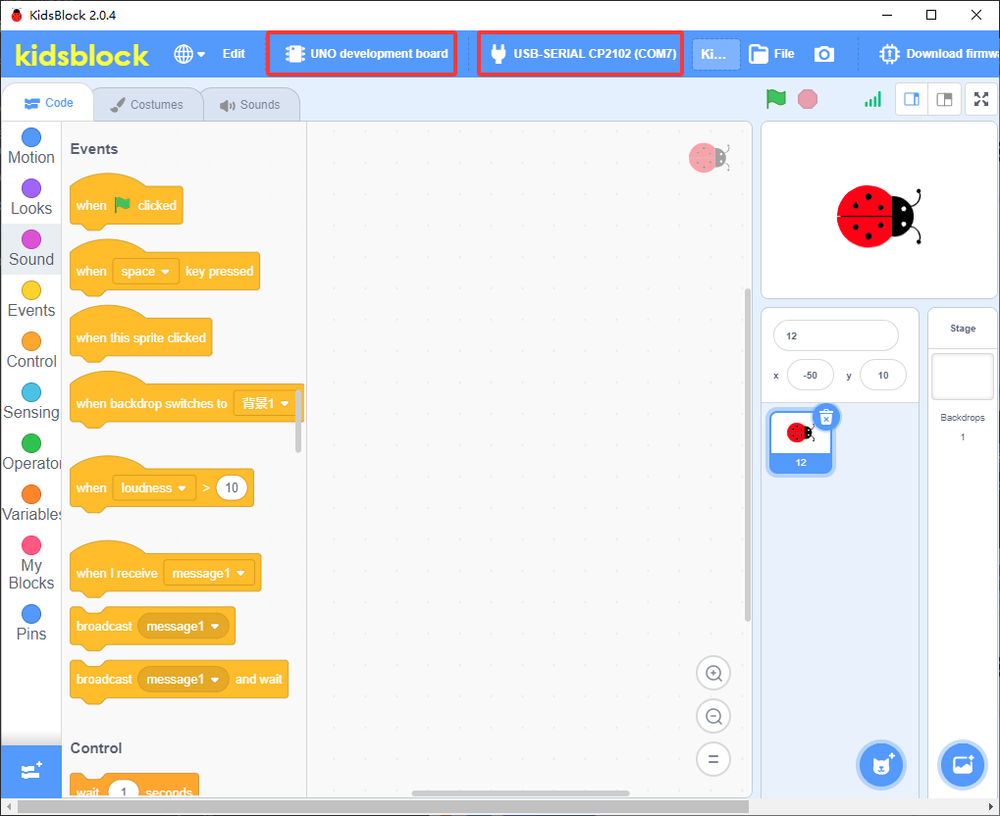

   image-20250516094244414

4.If the Uno Plus mainboard is connected , but |image8| icondoesn’t
change into |image-20250516094348761|. You need to click |image9|\ to
connect the COM port. Click |image10| and then click **Connect**. Then
you will find a page pop up, showing **Connected**.

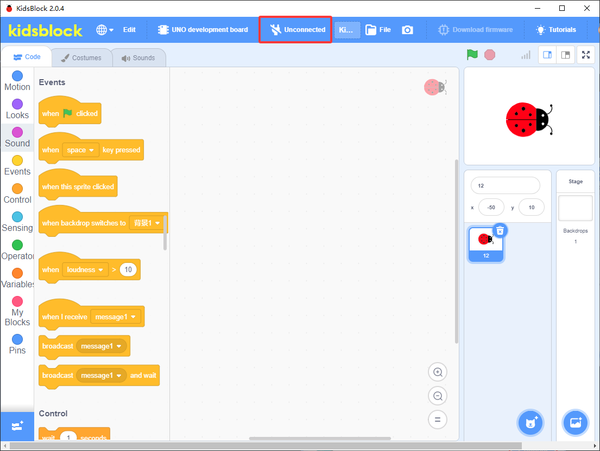

   image-20250516094454628

   image-20250516094005544

   image-20250516094026631

   image-20250516094244414

To disconnect the port, just click |image-20250516094402344|
and\ **Disconnect**.

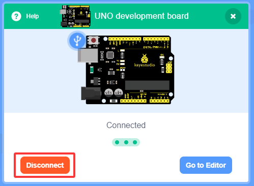

   image-20250516094608713

5.The Uno Plus mainboard and the COM port are connected, then
click\ |image11| will change into |image12|.

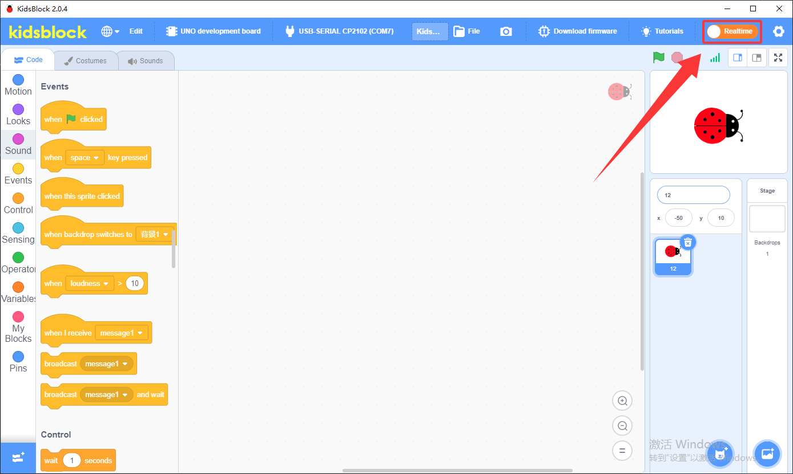

   image-20250516094638798

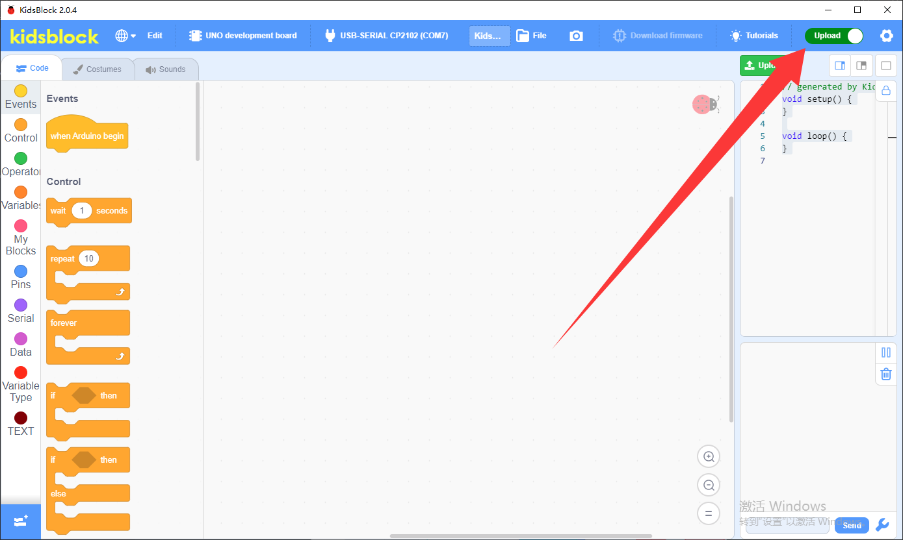

   image-20250516094700571

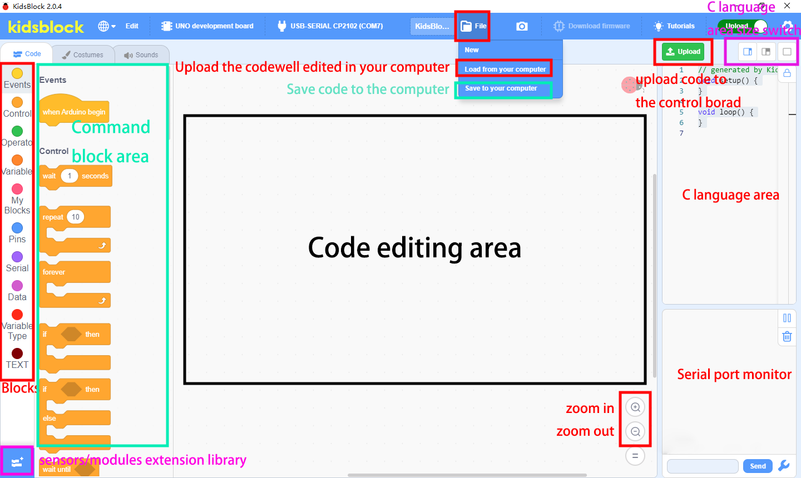

   QQ20250516-095952

Note: if you want to update libraries of KidsBlock, click\ |image13|
then Clear cache and restart.

|image14|

6.\ |image15|\ stands for extension libraries of sensors and modules.
Click |image16| to enter the page of extension libraries, click a sensor
or module to add.

For example, if click the“passive buzzer”module\ |image17|,“\ **Not
loaded**\ ”will change into “\ **Loaded**\ ”. Then the passive buzzer is
added.

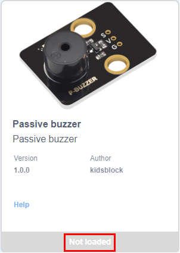

   Img

|image18|

Click |image19| to return the code editor. Then you can view the passive
buzzer in the blocks area.

|image20|

If you want to delete the passive buzzer, click |image21| to select the
passive buzzer\ |image22|. Then “\ **Loaded**\ ” will change into
“\ **Not loaded**\ ”. Then the passive buzzer is deleted.

|image23|

|image24|

The way of deleting other sensors or modules is as same as the passive
buzzer.

7.How to open SB3 type files：

1). Double-click SB3 type files to open them. For instance, open
|image-20250516105019155|, then we need to double-click |image25|.

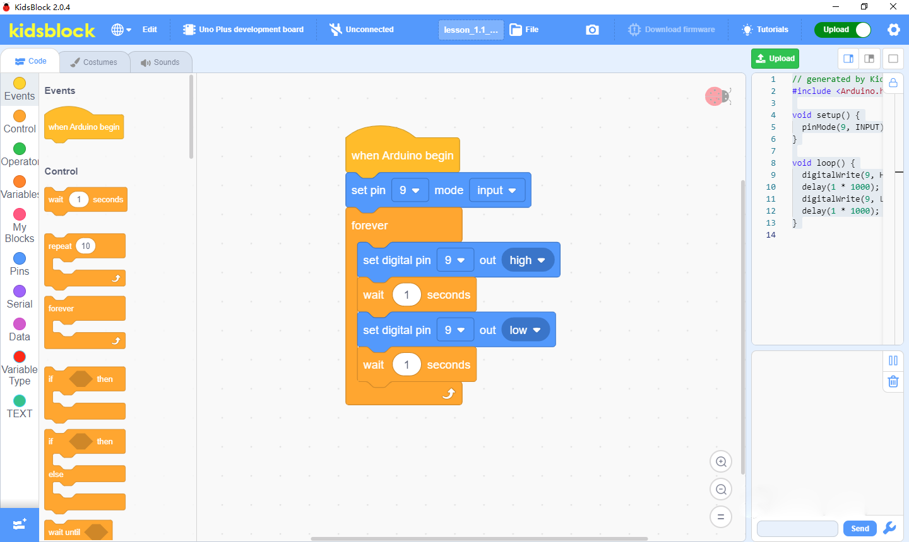

   image-20250516102748387

2). Open Kidsblock，click **file and Load from your computer**\ ，then
select the SB3 type file on the computer.（for example: |image26|).

|image27|

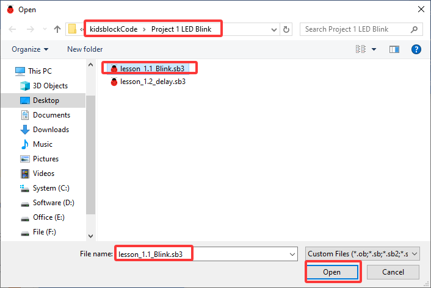

   image-20250516105121551

   image-20250516102748387

Note：Please refer to the following link for
MacOS：\ https://kidsblocksite.readthedocs.io/en/latest/

5.6 Projects
------------

Project 1 LED Blink
~~~~~~~~~~~~~~~~~~~

**1.Description**

|image28|

For starters and enthusiasts, LED Blink is a fundamental program. LED,
the abbreviation of light emitting diodes, consists of Ga, As, P, N
chemical compounds and so on.

The LED can flash in diverse color by altering the delay time in the
test code. When in control, power on GND and VCC, the LED will be on if
S end is in high level, otherwise it will go off.

**2.Specification**

- Control interface: digital port

- Working voltage: DC 3.3-5V

- Pin spacing: 2.54mm

- LED display color: red

|image29|

**3.Components**

+-----------------------+-----------------------+-----------------------+
| Development Board \*1 | 8833 Motor Driver \*1 | Red LED Module*1      |
+=======================+=======================+=======================+
| |img|                 | |image30|             | |image31|             |
+-----------------------+-----------------------+-----------------------+
| 3P F-F Dupont Wire*1  | USB Cable*1           |                       |
+-----------------------+-----------------------+-----------------------+
| |image32|             | |image33|             |                       |
+-----------------------+-----------------------+-----------------------+

**4.Wiring Diagram**

|image34|

As can be seen from the above figure, the Keyestudio 8833 motor driver
expansion board is stacked on the Keyestudio 4.0 development board.

The pin G, V and S of the LED module are connected to G, 5V and D9 of
the expansion board respectively.

**5.Test Code**

You can drag blocks to edit. Blocks listed below are for your reference.

(1).\ |image35|

(2).\ |image36|

(3).\ |image37|

**Complete Test Code**

|image38|

**6.Test Result**

After successfully uploading the code to the V4.0 board, connect the
wirings according to the wiring diagram, and use a USB cable to connect
the computer to power the board. After powering on, you will see the LED
connected to the D9 will be on and off. 

**7.Extension Practice**

Next, we look to change the frequency of LED flicker by changing the
wait time.

|image39|

After successfully uploading the code to the V4.0 board, connect the
wirings according to the wiring diagram, and use a USB cable to connect
the computer to power the board. The test result shows that the LED
flashes faster.

Project 2: Adjust LED Brightness
~~~~~~~~~~~~~~~~~~~~~~~~~~~~~~~~

**1.Description**

In previous lesson, we control LED on and off and make it blink.

In this project, we will control LED’s brightness through PWM simulating
breathing effect.

PWM is a means of controlling the analog output via digital means.
Digital control is used to generate square waves with different duty
cycles (a signal that constantly switches between high and low levels)
to control the analog output. In general, the input voltages of ports
are 0V and 5V.

What if the 3V is required? Or a switch among 1V, 3V and 3.5V? We cannot
change resistors constantly. For this reason, we resort to PWM.

|image40|

For the Arduino digital port voltage output, there are only LOW and
HIGH, which correspond to the voltage output of 0V and 5V. You can
define LOW as 0 and HIGH as 1, and let the Arduino output five hundred 0
or 1 signals within 1s.

If all of the output five hundred are 1, that is 5V; if all of which are
0, that is 0V. If output 010101010101 in this way then the output port
is 2.5V, which is like showing movie. The movie we watch are not
completely continuous. It actually outputs 25 pictures per second. In
this case, the human can’t see it, neither does PWM. If we want
different voltage, we need to control the ratio of 0 and 1. The more 0,1
signals output per unit time, the more accurate the control.

PWM is a technology that uses digital methods to obtain analog
quantities. Digital control enables to form a square wave, the square
wave signal only has on and off two states (high and low).  A voltage
ranging from 0 to 5V can be simulated by controlling the ratio of on to
off duration.  The time spent on (technically called high level) is
called pulse width, so PWM is also called pulse width modulation. 

|image41|

The green vertical bars represent one period of the square wave.  The
value written in each analogWrite(value) corresponds to a percentage,
which is also called Duty Cycle. This percentage refers to the ratio of
time occupied by the high level in a cycle, that is, duty cycle = high
level time/cycle time. 

 In the figure, from top to bottom, the duty cycle of the first square
wave is 0%, and the corresponding value is 0, and the LED brightness is
the lowest, that is, off state.  The longer the high level lasts, the
brighter it will be.  Therefore, the value of the last duty cycle of
100% is 255, and the LED is the brightest.  50% is the brightest half,
and 25% is darker.  

PWM is more used to adjust the brightness of LED lights or the rotation
speed of the motors, and the wheels speed driven by the motors can be
easily controlled. When playing with some Arduino robots, the benefits
of PWM can be better reflected. 

**2.Components**

+-----------------------+-----------------------+-----------------------+
| Development Board \*1 | 8833 Motor Driver \*1 | Red LED Module*1      |
+=======================+=======================+=======================+
| |img|                 | |image42|             | |image43|             |
+-----------------------+-----------------------+-----------------------+
| 3P F-F Dupont Wire*1  | USB Cable*1           |                       |
+-----------------------+-----------------------+-----------------------+
| |image44|             | |image45|             |                       |
+-----------------------+-----------------------+-----------------------+

**3.Wiring Diagram**

Keep the wiring-up unchanged.

|image46|

**4.Test Code**

You can drag blocks to edit. Blocks listed below are for your reference.

(1).\ |image47|

(2).\ |image48|

(3).\ |image49|

(4).\ |image50|

(5).\ |image51|

(6).\ |image52|

**Complete Test Code**

|image53|

**5.Test Result**

After successfully uploading the code to the V4.0 board, connect the
wirings according to the wiring diagram, and use a USB cable to connect
the computer to power the board. After powering on, you will see that
the LED gradually changes from bright to dark, like human’s breath,
rather than turning on and off immediately.

**6.Extension Practice**

Keep pins of the LED unchanged, then change code(values behind wait)

|image54|

Upload the code to the development board, then the LED will blink more
slowly.

Project 3: Line Tracking Sensor
~~~~~~~~~~~~~~~~~~~~~~~~~~~~~~~

|image55|

**1.Description**

The tracking sensor is actually an infrared sensor. The component used
here is the TCRT5000 infrared tube. Its working principle is to use
different reflectivity of infrared light to colors, then convert the
strength of the reflected signal into a current signal.

During the process of detection, black is active at HIGH level while
white is active at LOW level. The detection height is 0-3 cm.

Keyestudio 3-channel line tracking module has integrated 3 sets of
TCRT5000 infrared tubes on a board, which is more convenient for wiring
and control.

By rotating the adjustable potentiometer on the sensor, it can adjust
the detection sensitivity of the sensor.

**2.Specification**

- Operating Voltage: 3.3-5V (DC)

- Interface: 5PIN

- Output Signal: Digital signal

- Detection Height: 0-3 cm

|image56|

Note: Before testing, rotate the potentiometer on the sensor to adjust
the detection sensitivity. The sensitivity is best when adjusting the
LED to a threshold between ON and OFF. 

**3.Components**

+-----------------+-----------------+-----------------+-----------------+
| Development     | 8833 Motor      | Red LED         | Line Tracking   |
| Board \*1       | Driver \*1      | Module*1        | Sensor*1        |
+=================+=================+=================+=================+
| |image57|       | |image58|       | |image59|       | |image60|       |
+-----------------+-----------------+-----------------+-----------------+
| 5P Dupont       | USB Cable*1     | 3P Dupont       |                 |
| Wire*1          |                 | Wire*1          |                 |
+-----------------+-----------------+-----------------+-----------------+
| |image61|       | |image62|       | |image63|       |                 |
+-----------------+-----------------+-----------------+-----------------+

**4.Wiring Diagram**

|image64|

G, V, S1, S2 and S3 of the line tracking sensor are connected to
G（GND), V（VCC), D11, D7 and D8 of the sensor expansion board.

**5.Test Code**

You can drag blocks to edit. Blocks listed below are for your reference.

(1).\ |image65|

(2).\ |image66|

(3).\ |image67|

(4).\ |image68|

(5).\ |image69|

**Complete Test Code**

|image70|

|image71|

**6.Test Result**

After successfully uploading the code to the V4.0 board, connect the
wirings according to the wiring diagram, and use a USB cable to connect
the computer to power the board.

After powering on, click\ |image72|\ to set the baud rate to 9600 and
you will view status of three line tracking sensors. When no signals are
received, the value is 1. If we cover the sensor with a white paper, the
value will be 0.

|image73|

|image74|

**7.Extension Practice**

After knowing its working principle, you can connect an LED to D9 so as
to control LED by it.

|image75|

You can drag blocks to edit. Blocks listed below are for your reference.

(1).\ |image76|

(2).\ |image77|

(3).\ |image78|

(4).\ |image79|

(5).\ |image80|

(6).\ |image81|

(7).\ |image82|

**Complete Test Code**

|image83|

|image84|

After successfully uploading the code to the V4.0 board, connect the
wirings according to the wiring diagram, and use a USB cable to connect
the computer to power the board.

After powering on, make a paper close to the sensor, then we can find
the LED light up when covering the line tracking sensor.

Project 4 Servo Control
~~~~~~~~~~~~~~~~~~~~~~~

**1.Description**

|image85|

Servo motor is a position control rotary actuator. It mainly consists of
a housing, a circuit board, a core-less motor, a gear and a position
sensor. Its working principle is that the servo receives the signal sent
by MCUs or receivers and produces a reference signal with a period of
20ms and width of 1.5ms, then compares the acquired DC bias voltage to
the voltage of the potentiometer and obtain the voltage difference
output.

|image86|

In general, servo has three lines in brown, red and orange. The brown
wire is grounded, the red one is a positive pole line and the orange one
is a signal line.

The rotation angle of servo motor is controlled by regulating the duty
cycle of PWM (Pulse-Width Modulation) signal. The standard cycle of PWM
signal is 20ms (50Hz). Theoretically, the width is distributed
between 1ms-2ms, but in fact, it’s between 0.5ms-2.5ms. The width
corresponds the rotation angle from 0° to 180°. But note that for
different brand motors, the same signal may have different rotation
angles. 

|image87|

The corresponding servo angles are shown below:

|image88|

**2.Specification**

- Working voltage: DC 4.8V ~ 6V

- Operating angle range: about 180 ° (at 500 → 2500 μsec)

- Pulse width range: 500 → 2500 μsec

- No-load speed: 0.12 ± 0.01 sec / 60 (DC 4.8V) 0.1 ± 0.01 sec / 60(DC
  6V)

- No-load current: 200 ± 20mA (DC 4.8V) 220 ± 20mA (DC 6V)

- Stopping torque: 1.3 ± 0.01kg · cm (DC 4.8V) 1.5 ± 0.1kg · cm (DC6V)

- Stop current: ≦ 850mA (DC 4.8V) ≦ 1000mA (DC 6V)

- Standby current: 3 ± 1mA (DC 4.8V) 4 ± 1mA (DC 6V)

**3.Components**

+------------------+------------------+--------------------------------+
| Development      | 8833 Motor       | Servo*1                        |
| Board \*1        | Driver \*1       |                                |
+==================+==================+================================+
| |image89|        | |image90|        | |image91|                      |
+------------------+------------------+--------------------------------+
| 18650 Battery    | USB Cable*1      | 18650                          |
| Holder*1         |                  | Battery*2（self-provided）     |
+------------------+------------------+--------------------------------+
| |image92|        | |image93|        | |image94|                      |
+------------------+------------------+--------------------------------+

**4.Wiring Diagram**

|image95|

Wiring note: The servo is connected to G（GND）、V（VCC）and A3, the
brown line of servo is linked with Gnd(G), the red one is connected to
5v(V) and the orange one is attached to A3.

The servo is obliged to connect to the external power due to its high
demand for driving servo current. Generally, the current of development
board is not big enough. If without connecting the external power, the
development board could be burnt.

**5.Test Code**

Before writing the code, it is necessary to import the servo library
file. The specific steps are as follows: 

Click |image96|\ to enter the extension library interface of
sensors/modules/components, then look for “**Servo**”.

|image97| component and click it. In this way, “**Not Loaded**” changes
to “**loaded**”, indicating that “**Servo**” component was added
successfully. 

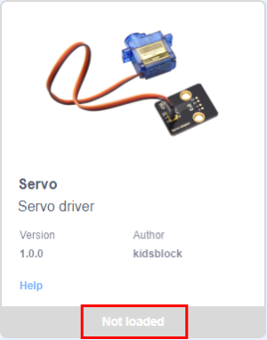

   Img

|image98|

Click |image99|\ to go back to the code editor, and in the modules area
you can see the “**Servo**” component directive block added. 

|image100|

You can drag blocks to edit. Blocks listed below are for your reference.

(1).\ |image101|

(2).\ |image102|

(3).\ |image103|

**Complete Test Code**

|image104|

**6.Test Result**

After successfully uploading the code to the V4.0 board, connect the
wirings according to the wiring diagram, and power on the external
power. After powering on, turn the dip switch to the “ON” end, then
servo will swing in the range of 0° to 180°.

Project 5 Ultrasonic Sensor
~~~~~~~~~~~~~~~~~~~~~~~~~~~

**1.Description**

|image105|

The HC-SR04 ultrasonic sensor uses sonar to determine distance to an
object like what bats do. It offers excellent non-contact range
detection with high accuracy and stable readings in an easy-to-use
package. It comes complete with an ultrasonic transmitter and receiver
modules.

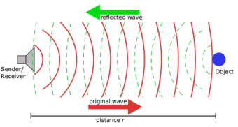

   Img

The HC-SR04 or the ultrasonic sensor is being used in a wide range of
electronics projects for creating obstacle detection and distance
measuring application as well as various other applications. Here we
have brought the simple method to measure the distance with arduino and
an ultrasonic sensor and how to use the ultrasonic sensor with Arduino.

**2.Specification**

- Working Voltage :+5V DC

- Quiescent Current : <2mA

- Working Current: 15mA

- Effectual Angle: <15°

- Distance Range : 2cm – 300 cm

- Precision : 0.3 cm

- Measuring Angle: 30 degree

- Trigger Input Pulse width: 10uS

|image106|

**3.Components**

+-----------------+-----------------+-----------------+-----------------+
| Development     | 8833 Motor      | Red LED         | Ultrasonic      |
| Board \*1       | Driver \*1      | Module*1        | Sensor*1        |
+=================+=================+=================+=================+
| |image107|      | |image108|      | |image109|      | |image110|      |
+-----------------+-----------------+-----------------+-----------------+
| 4P Dupont       | USB Cable*1     | 3P Dupont       |                 |
| Wire*1          |                 | Wire*1          |                 |
+-----------------+-----------------+-----------------+-----------------+
| |image111|      | |image112|      | |image113|      |                 |
+-----------------+-----------------+-----------------+-----------------+

**4.Working Principle**

As the above picture shown, it is like two eyes. One is transmitting
end, the other is receiving end.

The ultrasonic module will emit the ultrasonic waves after triggering a
signal. When the ultrasonic waves encounter the object and are reflected
back, the module outputs an echo signal, so it can determine the
distance of the object from the time difference between the trigger
signal and the echo signal.

The t is the time that emitting signal meets obstacle and returns. And
the propagation speed of sound in the air is about 343m/s, and distance
= speed \* time. However, the ultrasonic wave emits and comes back,
which is 2 times of distance. Therefore, it needs to be divided by 2,
the distance measured by ultrasonic wave = (speed \* time)/2.

**Use method and chart of ultrasonic module:**

1).Use the GPIO pin to give a high level signal of at least 10μs to the
Trig pin of SR04, which can trigger it to detect distance.

2).After triggering, the module will automatically send eight 40KHz
ultrasonic pulses and detect whether there is a signal return. This step
will be completed automatically by the module.

3).If the signal returns, the Echo pin will output a high level, and the
duration of the high level is the time from the transmission of the
ultrasonic wave to the return.

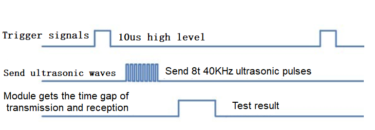

   image-20250509143833078

**Circuit diagram of ultrasonic sensor:**

|image114|

**5.Wiring Diagram**

|image115|

VCC, Trig, Echo and Gnd of the ultrasonic sensor are connected to 5V(V),
D12, D13 and Gnd(G)

**6.Test Code**

Before writing the code, it is necessary to import the library file of
the ultrasonic sensor. The specific steps are as follows: 

Click |image116|\ to enter the extension library interface of
sensors/modules/components, then search for “**Ultrasonic**” sensor
|image117|\ and click it. In this way, “**Not loaded**” changes to
“**loaded**”, indicating that “**Ultrasonic**” sensor was added
successfully. 

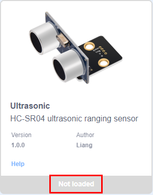

   Img

|image118|

Click |image119|\ to return to the code editor interface, the
instruction block of the added “**Ultrasonic**” sensor can be seen in
the module area. 

|image120|

You can drag blocks to edit. Blocks listed below are for your reference.

（1).\ |image121|

(2).\ |image122|

(3).\ |image123|

(4).\ |image124|

(5).\ |image125|

(6).\ |image126|

(7).\ |image127|

**Complete Test Code**

|image128|

**7.Test Result**

After successfully uploading the code to the V4.0 board, connect the
wirings according to the wiring diagram, then connect the computer via a
USB cable to power the board. After powering on, click |image129|\ to
set baud rate to 9600.

The detected distance will be displayed, and the unit is cm and inch.
Hinder the ultrasonic sensor by hand, the displayed distance value gets
smaller.

|image130|

**8.Extension Practice**

We have just measured the distance displayed by the ultrasonic. How
about controlling the LED with the measured distance? Let’s try it and
connect an LED light module to the D9 pin.

|image131|

You can drag blocks to edit. Blocks listed below are for your reference.

(1).\ |image132|

(2).\ |image133|

(3).\ |image134|

(4).\ |image135|

(5).\ |image136|

(6).\ |image137|

(7).\ |image138|

**Complete Test Code**

|image139|

|image140|

After successfully uploading the code to the V4.0 board, connect the
wirings according to the wiring diagram, then connect the computer via a
USB cable to power the board. After powering on, block the ultrasonic
sensor by hand(the distance is between 2-10cm), then check if the LED is
on.

Project 6 IR Reception
~~~~~~~~~~~~~~~~~~~~~~

|image141|

**1.Description**

There is no doubt that infrared remote control is ubiquitous in daily
life. It is used to control various household appliances, such as TVs,
stereos, video recorders and satellite signal receivers. Infrared remote
control is composed of infrared transmitting and infrared receiving
systems, that is, an infrared remote control and infrared receiving
module and a single-chip microcomputer capable of decoding.  

|image142|

The 38K infrared carrier signal emitted by remote controller is encoded
by the encoding chip in the remote controller. It is composed of a
section of pilot code, user code, user inverse code, data code, and data
inverse code. The time interval of the pulse is used to distinguish
whether it is 0 or 1 signal and the encoding is made up of these 0, 1
signals.

The user code of the same remote control is constant while the data code
can distinguish the key.

When the remote control button is pressed, the remote control sends out
an infrared carrier signal. When the IR receiver receives the signal,
the program will decode the carrier signal and determines which key is
pressed. The MCU decodes the received 01 signal, thereby judging what
key is pressed by the remote control.

Infrared receiver we use is an infrared receiver module. Mainly composed
of an infrared receiver head, which is a device that integrates
reception, amplification, and demodulation. Its internal IC has
completed demodulation, and can achieve from infrared reception to
output and be compatible with TTL signals.

Additionally, it is suitable for infrared remote control and infrared
data transmission. The infrared receiving module made by the receiver
has only three pins, signal line, VCC and GND. It is very convenient to
communicate with Arduino and other microcontrollers.

**2.Specification**

- Operating Voltage: 3.3-5V（DC)

- Output Signal: Digital signal

- Receiving Angle: 90 degrees

- Frequency: 38khz

- Receiving Distance: 10m

The picture shows the real product and circuit diagram of the infrared
receiver.

|image143|

|image144|

**3.Components**

+-----------------------+-----------------------+-----------------------+
| Development Board \*1 | 8833 Motor Driver \*1 | Red LED Module*1      |
+=======================+=======================+=======================+
| |img|                 | |image145|            | |image146|            |
+-----------------------+-----------------------+-----------------------+
| 3P F-F Dupont Wire*1  | USB Cable*1           |                       |
+-----------------------+-----------------------+-----------------------+
| |image147|            | |image148|            |                       |
+-----------------------+-----------------------+-----------------------+

Since the 8833 board integrates with the IR receiver, it doesn’t need
wiring up. Pins of IR receiver module are G(GND）, V（VCC）and D3.

**4.Test Code**

Please note: The infrared module shown in the software demonstration is
already integrated into the expansion board and is not supplied
separately. Consequently, you will not find the module depicted in the
image below within the product.

|image149|

Before writing the code, it is necessary to import the library file of
the IR receiver sensor. The specific steps are as follows: 

Click |image150|\ to enter the extension library interface of
sensors/modules/components, then search for“\ **ir remote**\ ”
sensor\ |image151| and click it. In this way, “**Not loaded**” changes
to “**loaded**”, indicating that ir remote”sensor was added
successfully. 

   Img

|image152|

Click |image153|\ to return to the code editor interface, the
instruction block of the added “\ **ir remote**\ ”sensor can be seen in
the module area. 

|image154|

You can drag blocks to edit. Blocks listed below are for your reference.

(1).\ |image155|

(2).\ |image156|

(3).\ |image157|

(4).\ |image158|

**Complete Test Code**

|image159|

**5.Test Result**

After successfully uploading the code to the V4.0 board, connect the
wirings according to the wiring diagram, then connect the computer via a
USB cable to power the board. After powering on, click |image160|\ to
set baud rate to 9600.

Take out the remote control, and send signal to the infrared receiver
sensor. You can see the key value of the corresponding key, if the key
time is too long, FFFFFFFF is prone to garbled characters.

|image161|

The keys value of remote control are shown below.

|image162|

**6.Extension Practice**

We have decoded the key value of the IR remote control. How about
controlling LED by the measured value? We could design an experiment.

Attach an LED to D9, then press the keys of remote control to make LED
light on and off.

|image163|

You can drag blocks to edit. Blocks listed below are for your reference.

(1).\ |image164|

(2).\ |image165|

(3).\ |image166|

(4).\ |image167|

(5).\ |image168|

(6).\ |image169|

(7).\ |image170|

(8).\ |image171|

**Complete Test Code**

|image172|

After successfully uploading the code to the V4.0 board, connect the
wirings according to the wiring diagram, then connect the computer via a
USB cable to power the board. After powering on, press the “**OK**” key
on remote control can make the LED on and off.

Project 7 Bluetooth Remote Control
~~~~~~~~~~~~~~~~~~~~~~~~~~~~~~~~~~

|image173|

**1.Description**

There is a DX-BT24 5.1 Bluetooth module in this kit. This bluetooth
module comes with 256Kb space and complies with V5.1BLE bluetooth
specification, which supports AT commands. Users can change parameters
such as the baud rate and device name of the serial port as required.

Furthermore, it supports UART interface and bluetooth serial port
transparent transmission, which also contains the advantages of low
cost, small size, low power consumption and high sensitivity for sending
and receiving. Notably, it solely needs a few peripheral components to
realize its powerful functions.  

**2.Specification**

- Bluetooth protocol: Bluetooth Specification V5.1 BLE

- Working distance: In an open environment, it can achieve 40m
  ultra-long distance communication

- Operating frequency: 2.4GHz ISM band

- Communication interface: UART

- Bluetooth certification: Accord with FCC CE ROHS REACH certification
  standard

- Serial port parameters: 9600, 8 data bits, 1 stop bit, invalid bit, no
  flow control

- Power: 5V DC

- Operating temperature: –10℃ to +65℃

**3.Application**

The DX-BT24 module also supports the BT5.1 BLE protocol, which can be
directly connected to iOS devices with BLE Bluetooth function, and
supports resident running of background programs. It is mainly used in
the field of short-distance data wireless transmission. It enables to
avoid cumbersome cable connections and can directly replace serial
cables.

**Successful application areas of BT24 modules:**

※ Bluetooth wireless data transmission;

※ Mobile phone, computer peripheral equipment;

※ Handheld POS equipment;

※ Wireless data transmission of medical equipment;

※ Smart home control;

※ Bluetooth printer;

※ Bluetooth remote control toys;

※ Shared bicycles;

**Ports**

|image174|

①STATE：Status pin

②RX：Receiving pin

③TX：sending pin

④GND：GND

⑤VCC：Power

⑥EN： Enable pin

Connect the BT module to the development board.

.. raw:: html

   <table border="1">

.. raw:: html

   <tbody>

.. raw:: html

   <tr class="odd">

.. raw:: html

   <td>

Uno

.. raw:: html

   </td>

.. raw:: html

   <td>

BT24

.. raw:: html

   </td>

.. raw:: html

   </tr>

.. raw:: html

   <tr class="even">

.. raw:: html

   <td>

TX

.. raw:: html

   </td>

.. raw:: html

   <td>

RX

.. raw:: html

   </td>

.. raw:: html

   </tr>

.. raw:: html

   <tr class="odd">

.. raw:: html

   <td>

RX

.. raw:: html

   </td>

.. raw:: html

   <td>

TX

.. raw:: html

   </td>

.. raw:: html

   </tr>

.. raw:: html

   <tr class="even">

.. raw:: html

   <td>

VCC

.. raw:: html

   </td>

.. raw:: html

   <td>

5V

.. raw:: html

   </td>

.. raw:: html

   </tr>

.. raw:: html

   <tr class="odd">

.. raw:: html

   <td>

GND

.. raw:: html

   </td>

.. raw:: html

   <td>

GND

.. raw:: html

   </td>

.. raw:: html

   </tr>

.. raw:: html

   </tbody>

.. raw:: html

   </table>

**4.Components**

+----------------------+----------------------+-----------------------+
| Development Board    | 8833 Motor Driver    | Red LED Module*1      |
| \*1                  | \*1                  |                       |
+======================+======================+=======================+
| |image175|           | |image176|           | |image177|            |
+----------------------+----------------------+-----------------------+
| 3P F-F Dupont Wire*1 | USB Cable*1          | DX-BT24 Bluetooth     |
|                      |                      | Module*1              |
+----------------------+----------------------+-----------------------+
| |image178|           | |image179|           | |image180|            |
+----------------------+----------------------+-----------------------+

**5.Wiring Diagram**

|image181|

RXD, TXD, GND and VCC of the BT module are connected to TX, RX, G and
5V.

STATE and BRK of the BT module don’t need connection.

Note: the direction of the BT module when inserting it onto the 8833
board. And don’t insert it before uploading the code.

**6.Test Code**

You can drag blocks to edit. Blocks listed below are for your reference.

(1).\ |image182|

(2).\ |image183|

(3).\ |image184|

(4).\ |image185|

(5).\ |image186|

**Complete Test Code**

Note: Before uploading the test code, you need to remove the Bluetooth
module, otherwise the code will fail to be uploaded.Connect the
Bluetooth module after uploading the code successfully.

|image187|

**7.Test Result**

After successfully uploading the code to the V4.0 board, connect the
wirings according to the wiring diagram, then connect the computer via a
USB cable to power the board. After powering on, insert the BT module
and the LED will flash, then we need to download the BT app.

**8.Download Bluetooth APP**

**Apple system**

(1).Open the App Store on the iPhone.

(2).Search keyes BT car and download the APP to your phone.

|image188|

(3).After installation, enter its interface.

|image189|

(4).Click “**Connect**” button in the upper left corner to automatically
search for Bluetooth. When **BT24** is found, click “**Connect**” to
connect Bluetooth, and then click |image190|\ to enter the control
interface of 4WD smart car. 

|image191|

**Android System**

(1).Enter google play store to search for“\ **keyes 4wd**\ ”.

|image192|

(2).The app icon is shown below after installation.

|image193|

(3).Click app to enter the following page.

|image194|

(4).After connecting Bluetooth, plug in power and LED indicator of
Bluetooth module will flicker. Tap“Connect”to search the Bluetooth.

|image195|

(5).When **BT24** is found, click “**connect**” to connect Bluetooth.
When “**connect**” turns into “**is connected**”, it indicates that the
Bluetooth connection is successful. As shown in the picture below, the
Bluetooth LED becomes will stay on.

|image196|

(6).After connecting Bluetooth module, click |image197|\ to set baud
rate to 9600. Pressing the button of the Bluetooth APP, and the
corresponding characters will be displayed, as shown below:

|image198|

+----------------------------------------+-----------------------------+
| Key                                    | Function                    |
+========================================+=============================+
| |wps14|                                | Pair DX-BT24 5.1 Bluetooth  |
|                                        | module                      |
+----------------------------------------+-----------------------------+
| |wps15|                                | Disconnect Bluetooth        |
+----------------------------------------+-----------------------------+

+-----------------------+-----------------------+-----------------------+
|                       | Control character     | Function              |
+=======================+=======================+=======================+
| |wps16|               | Press: F Release: S   | Press the button, the |
|                       |                       | car goes front;       |
|                       |                       | release to stop       |
+-----------------------+-----------------------+-----------------------+
| |wps17|               | Press: L Release: S   | Press the button, the |
|                       |                       | car turns left;       |
|                       |                       | release to stop       |
+-----------------------+-----------------------+-----------------------+
| |wps18|               | Press: R Release: S   | Press the button, the |
|                       |                       | car turns right;      |
|                       |                       | release to stop       |
+-----------------------+-----------------------+-----------------------+
| |wps19|               | Press: B Release: S   | Press the button, the |
|                       |                       | car goes back;        |
|                       |                       | release to stop       |
+-----------------------+-----------------------+-----------------------+
| |wps20|               | Press: “a” Release:   | Click to speed        |
|                       | “S”                   | up(maximum:255)       |
+-----------------------+-----------------------+-----------------------+
| |wps21|               | Press: “d” Release:   | Click to slow         |
|                       | “S”                   | down(minimum:0)       |
+-----------------------+-----------------------+-----------------------+
| |wps22|               | Click to start the    |                       |
|                       | gravity sensing       |                       |
|                       | function of the       |                       |
|                       | mobile phone: click   |                       |
|                       | again to exit the     |                       |
|                       | gravity sensing       |                       |
|                       | control               |                       |
+-----------------------+-----------------------+-----------------------+
| |wps23|               | Click to send“X”,     | Start line tracking   |
|                       | click again to        | function; click again |
|                       | send“S”               | to exit               |
+-----------------------+-----------------------+-----------------------+
| |wps24|               | Click to send“Y”,     | Start ultrasonic      |
|                       | click again to        | avoiding function;    |
|                       | send“S”               | click again to exit   |
+-----------------------+-----------------------+-----------------------+
| |wps25|               | Click to send“U”,     | Start ultrasonic      |
|                       | click again to        | follow function;      |
|                       | send“S”               | click again to exit   |
+-----------------------+-----------------------+-----------------------+
| |wps26|               | Click to              | Start restricting     |
|                       | send“G”,click again   | function; click again |
|                       | to send“S”            | to exit               |
+-----------------------+-----------------------+-----------------------+

**9.Extension Practice**

Here we look to use the command sent by the mobile phone to turn on or
off an LED light. Looking at the wiring diagram, an LED is connected to
the D9 pin.

|image199|

You can drag blocks to edit. Blocks listed below are for your reference.

(1).\ |image200|

(2).\ |image201|

(3).\ |image202|

(4).\ |image203|

(5).\ |image204|

(6).\ |image205|

(7).\ |image206|

**Complete Test Code**

|image207|

After successfully uploading the code to the V4.0 board, connect the
wirings according to the wiring diagram, then connect the computer via a
USB cable to power the board. After powering on, click

.. raw:: html

   <td>

|image208|

.. raw:: html

   </td>

and

.. raw:: html

   <td>

|image209|

.. raw:: html

   </td>

to control the LED turn on and turn off.

Project 8 Motor Driving and Speed Control
~~~~~~~~~~~~~~~~~~~~~~~~~~~~~~~~~~~~~~~~~

|image210|

**1.Description**

There are many ways to drive motors. Our car uses the most commonly used
DRV8833 motor driver chip, which provides a two-channel bridge electric
drive solution for toys, printers and other integrated motor
applications.

When we stack the driver expansion board on the 4.0 development board
and power on the BAT, then set the DIP switch to the ON end, the
external power supply will power on the two boards at the same time. To
facilitate wiring connections, the driver expansion board comes with an
anti-reverse port (PH2.0-2P-3P-4P-5P). You can connect the motors, power
supply, and sensor modules directly to the driver expansion board. 

The Bluetooth interface of the driver expansion board is fully
compatible with the DX-BT24 5.1 Bluetooth module. When connecting the
Bluetooth module, you solely need to plug it into the corresponding
interface.  At the same time, 2.54 row pins are used to draw out some
unused digital and analog ports on the driver expansion board, making it
accessible for you to add other sensors and carry out extension
experiments. 

The expansion board can be connected to four DC motors. When the jumper
cap is connected by default, the motors of ports A and A1 and B and B1
are connected in parallel and have the same motion law.  8 jumper caps
can be used to control the rotation direction of the 4 motor interfaces.

For example, when the 2 jumper caps in front of B1 of the M1 motor
change from transverse connection to longitudinal connection, the
rotation direction of M1 motor will be opposite to the original rotation
direction. 

**2.Specification**

- Input voltage for logic：DC 5V

- Input voltage for driving：DC 6-9 V

- Working current for logic：<36mA

- Working current for driving：<2A

- Maximum power dissipation：25W（T=75℃）

- Input level for control signal： high level is 2.3V<Vin<5V ，low level
  is -0.3V<Vin<1.5V

- Working temperature：-25＋130℃

**3.Keyestudio 8833 motor driver expansion board**

|image211|

**Working Principle**

We use the same side parallel connection mode for the four motors, which
can be regarded as two groups of motors.  As shown in the wiring
diagram, B and B1 are a group, and A and A1 are a group.

The motors in the same group should rotate in the same direction. If
they are different, please adjust the corresponding jumper caps next to
the terminal to change the direction.  

As shown below, if the directions of A and A1 are different, adjust the
direction of jumper caps until the motor movement direction of the same
group is consistent. 

|image212|

From the above diagram, it is known that the direction pin of A motor is
D4, the speed pin is D6; D2 is the direction pin of B motor; and D6 is
speed pin.

PWM drives the robot car. The PWM value is in the range of 0-255. When
we set the direction to HIGH, the smaller the PWM number, the faster the
rotation of the motor.

.. raw:: html

   <table border="1">

.. raw:: html

   <tbody>

.. raw:: html

   <tr class="odd">

.. raw:: html

   <td>

.. raw:: html

   </td>

.. raw:: html

   <td>

D2

.. raw:: html

   </td>

.. raw:: html

   <td>

D5（PWM）

.. raw:: html

   </td>

.. raw:: html

   <td>

B Motor（ left）

.. raw:: html

   </td>

.. raw:: html

   <td>

D4

.. raw:: html

   </td>

.. raw:: html

   <td>

D6（PWM）

.. raw:: html

   </td>

.. raw:: html

   <td>

A Motor（right）

.. raw:: html

   </td>

.. raw:: html

   </tr>

.. raw:: html

   <tr class="even">

.. raw:: html

   <td>

Go forward

.. raw:: html

   </td>

.. raw:: html

   <td>

HIGH

.. raw:: html

   </td>

.. raw:: html

   <td>

255-200

.. raw:: html

   </td>

.. raw:: html

   <td>

Rotate clockwise

.. raw:: html

   </td>

.. raw:: html

   <td>

HIGH

.. raw:: html

   </td>

.. raw:: html

   <td>

255-200

.. raw:: html

   </td>

.. raw:: html

   <td>

Rotate clockwise

.. raw:: html

   </td>

.. raw:: html

   </tr>

.. raw:: html

   <tr class="odd">

.. raw:: html

   <td>

Go back

.. raw:: html

   </td>

.. raw:: html

   <td>

LOW

.. raw:: html

   </td>

.. raw:: html

   <td>

200

.. raw:: html

   </td>

.. raw:: html

   <td>

Rotate anticlockwise

.. raw:: html

   </td>

.. raw:: html

   <td>

LOW

.. raw:: html

   </td>

.. raw:: html

   <td>

200

.. raw:: html

   </td>

.. raw:: html

   <td>

Rotate anticlockwise

.. raw:: html

   </td>

.. raw:: html

   </tr>

.. raw:: html

   <tr class="even">

.. raw:: html

   <td>

Turn left

.. raw:: html

   </td>

.. raw:: html

   <td>

HIGH

.. raw:: html

   </td>

.. raw:: html

   <td>

255-200

.. raw:: html

   </td>

.. raw:: html

   <td>

Rotate clockwise

.. raw:: html

   </td>

.. raw:: html

   <td>

LOW

.. raw:: html

   </td>

.. raw:: html

   <td>

200

.. raw:: html

   </td>

.. raw:: html

   <td>

Rotate anticlockwise

.. raw:: html

   </td>

.. raw:: html

   </tr>

.. raw:: html

   <tr class="odd">

.. raw:: html

   <td>

Turn right

.. raw:: html

   </td>

.. raw:: html

   <td>

LOW

.. raw:: html

   </td>

.. raw:: html

   <td>

200

.. raw:: html

   </td>

.. raw:: html

   <td>

Rotate anticlockwise

.. raw:: html

   </td>

.. raw:: html

   <td>

HIGH

.. raw:: html

   </td>

.. raw:: html

   <td>

255-200

.. raw:: html

   </td>

.. raw:: html

   <td>

Rotate clockwise

.. raw:: html

   </td>

.. raw:: html

   </tr>

.. raw:: html

   </tbody>

.. raw:: html

   </table>

**4.Components**

+--------------------+--------------------+---------------------------+
| Development Board  | 8833 Motor Driver  | USB Cable*1               |
| \*1                | \*1                |                           |
+====================+====================+===========================+
| |image213|         | |image214|         | |image215|                |
+--------------------+--------------------+---------------------------+
| 18650 Battery      | Motor*4            | 18650 Battery             |
| Holder*1           |                    | \*2（self-provided）      |
+--------------------+--------------------+---------------------------+
| |image216|         | |image217|         | |image218|                |
+--------------------+--------------------+---------------------------+

**5.Wiring Diagram**

|image219|

Connect the power supply to the BAT port.

**6.Test Code**

You can drag blocks to edit. Blocks listed below are for your reference

(1).\ |image220|

(2).\ |image221|

(3).\ |image222|

**Complete Test Code**

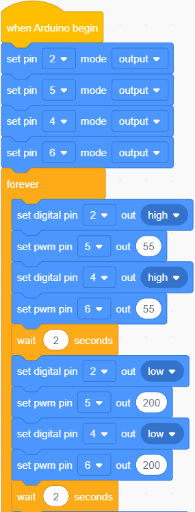

   Img

|image223|

**7.Test Result**

After successfully uploading the code to the V4.0 board, connect the
wirings according to the wiring diagram, then power on the external
power and turn the DIP switch to ON, the car will go forward for 2s,
back for 2s, turn left for 2s and right for 2s and stop for 2s.

**8.Code Explanation**

Adjust the speed that PWM controls the motor, hook up in the same way.

**Complete Test Code**

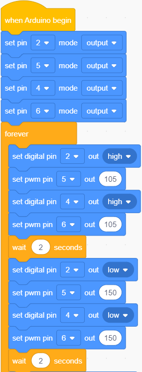

   Img

|image224|

After successfully uploading the code to the V4.0 board, connect the
wirings according to the wiring diagram, then power on the external
power and turn the DIP switch to ON, then you find the speed of the
motor is much slower.

Note: Low battery will lead to slow motor speed.

Project 9 Facial Expression LED Board
~~~~~~~~~~~~~~~~~~~~~~~~~~~~~~~~~~~~~

|image225|

**1.Description**

How fun it is if a expression board is added to the robot. And the
Keyestudio 8*16 LED board can do the trick. With the help of it, you
could design facial expressions, images, patterns and other displays by
yourselves.

The 8*16 LED board comes with 128 LEDs. The data of the
microprocessor(Arduino) communicates with the AiP1640 through a two-wire
bus interface. Therefore, it can control the on and off of 128 LEDs on
the module, so as to make the dot matrix on the module to display the
pattern you need. A HX-2.54 4Pin cable is provided for your convenience
of wiring.

**2.Specification**

- Working voltage: DC 3.3-5V

- Power loss: 400mW

- Oscillation frequency: 450KHz

- Drive current: 200mA

- Working temperature: -40~80℃

- Communication mode: I2C

**3.Circuit Diagram**

|image226|

**4.Working Principle**

How to control each LED of the 8*16 dot matrix? It is known that each
byte has 8 bits and each bit is 0 or 1. when it is 0, LED is off while
when it is 1 LED is on. One byte can control one column of the LED,and
naturally 16 bytes can control 16 columns of LEDs, that’s the 8*16 dot
matrix.

**5.Pins description and communication protocol**

The data of the microprocessor (Arduino) communicates with the AiP1640
through a two-wire bus cable.

The communication protocol diagram is as follows (SCLK) is SCL, (DIN) is
SDA.

|image227|

①The starting condition for data input: SCL is high level and SDA
changes from high to low.

②For data command setting, there are methods as shown in the figure
below.

In our sample program, select the way to **add 1 to the address
automatically**, the binary value is 0100 0000 and the corresponding
hexadecimal value is 0x40.

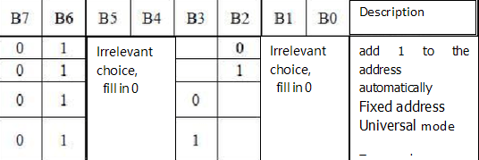

   Img

③For address command setting, the address can be selected as shown
below.

The first 00H is selected in our sample program, and the binary number
1100 0000 corresponds to the hexadecimal 0xc0.

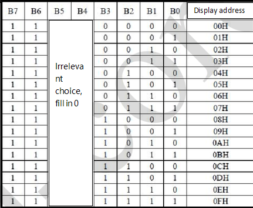

   Img

④The requirement for data input is that when SCL is at high level when
inputting data, the signal on SDA must remain unchanged. Only when the
clock signal on SCL is at low level, can the signal on SDA be changed.
The input of data is the low bit first, and the high bit later.

⑤The condition for the end of data transmission is that when SCL is at
low level, SDA at low level and SCL at high level, the level of SDA
becomes high.

⑥Display control, set different pulse width, pulse width can be selected
as shown in the figure below.

In the example, the pulse width is 4/16, and the hexadecimal
corresponding to 1000 1010 is 0x8A.

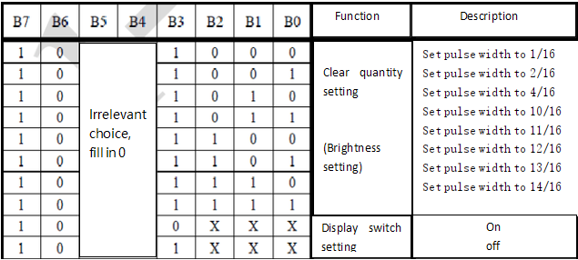

   Img

**Instructions for the use of modulus tool**

The dot matrix tool uses the online version, and the link is
:http://dotmatrixtool.com/#

①Enter the link and the page appears as shown below

|image228|

②The dot matrix is 8*16, so adjust the height to 8 and width to 16, as
shown in the figure below.

|image229|

③Generate hexadecimal data from the pattern

As shown in the figure below, press the left mouse button to select,
right click to cancel; draw the pattern you want, click Generate, and
the hexadecimal data we need will be generated.

|image230|

**6.Components**

+---------------------+--------------------------+---------------------+
| Development Board   | 8833 Motor Driver \*1    | 8x16 LED Panel*1    |
| \*1                 |                          |                     |
+=====================+==========================+=====================+
| |image231|          | |image232|               | |image233|          |
+---------------------+--------------------------+---------------------+
| USB Cable*1         | HX-2.54 4P Dupont Wire   |                     |
|                     | 200mm \*1                |                     |
+---------------------+--------------------------+---------------------+
| |image234|          | |image235|               |                     |
+---------------------+--------------------------+---------------------+

**7.Wiring Diagram**

|image236|

The GND, VCC, SDA, and SCL of the 8x16 LED light board are respectively
connected to the keyestudio sensor expansion board-(GND), + (VCC), A4,
A5 for two-wire serial communication.

(Note: Though it is connected with the IIC pin of Arduino, this module
is not for IIC communication. And the IO port here is to simulate I2C
communication and can be connected with any two pins ).

**8.Test Code**

Before writing the code, it is necessary to import the library file of
the 8x16 LED board. The specific steps are as follows: 

Click |image237|\ to enter the extension library interface of
sensors/modules/components, then search for“\ **Matrix 8*16
Aip1640**\ ”module |image238| and click it. In this way, “**Not
loaded**” changes to “**loaded**”, indicating that“\ **Matrix 8*16
Aip1640**\ ”module was added successfully. 

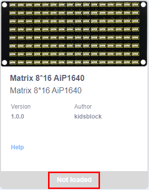

   Img

|image239|

Click |image240|\ to return to the code editor interface, the
instruction block of the added “\ **Matrix 8*16 Aip1640**\ ”module can
be seen in the module area. 

|image241|

You can drag blocks to edit. Blocks listed below are for your reference.

(1).\ |image242|

(2).\ |image243|

**Complete Test Code**

|image244|

**9.Test Result**

After successfully uploading the code to the V4.0 board, connect the
wirings according to the wiring diagram, then turn the DIP switch to ON,
a smile-shaped pattern will be displayed on the LED board.

|image245|

**10.Code Explanation**

We use the modulus tool we just learned, http://dotmatrixtool.com/#, to
make the dot matrix display the start pattern, going forward, and stop
and then clear the pattern. The time interval is 2000 ms.

|image-20250513092102687|\ |image-20250513092107293|\ |image-20250513092113035|\ |image-20250513092116952|

Instruction block for smiley face\ |image246|

Instruction block for expression：\ |image247|

Instruction block for heart |image248|

Instruction block for going forward\ |image249|

Instruction block for **stepping back** |image250|

Instruction block for **turning left** |image251|

Instruction block for **turning right** |image252|

Instruction block for **stop**\ |image253|

Instruction block for **clearing screen**\ |image254|

|image255|

You can drag blocks to edit. Blocks listed below are for your reference.

（1).\ |image256|

（2).\ |image257|

(3).\ |image258|

**Complete Test Code**

|image259|

After uploading test code, the facial expression board shows these
patterns orderly and repeats this sequence.

|image-20250513092222972|\ |image-20250513092233711|\ |image-20250513092238552|

Project 10 Restricting Smart Car
~~~~~~~~~~~~~~~~~~~~~~~~~~~~~~~~

|image260|

**1.Description**

In this project, we look to combine the knowledge of a line tracking
sensor and motor driver modules to make a restricting smart car.  In the
experiment, we aim to use the line tracking sensor to detect whether
there is a black line around the smart car, and then control the
rotation of the two motors according to the detection results in a way
that lock the smart car in a circle drawn in black line.

**2.Flow Chart**

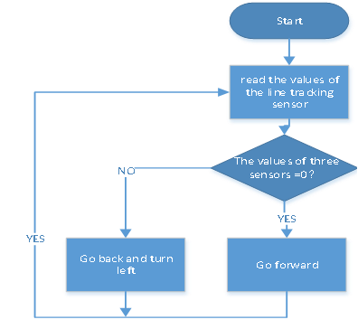

   img

The specific logic of the restricting 4WD smart car is shown in the
table.

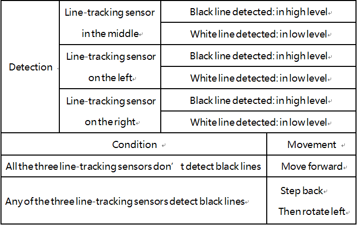

   Img

**3.Wiring Diagram**

|image261|

G, V, S1, S2 and S3 of the line tracking sensor are connected to
G（GND), V（VCC), D11, D7 and D8 of the sensor expansion board.

The power is connected to the BAT port

**4.Test Code**

You can drag blocks to edit. Blocks listed below are for your reference.

(1).\ |image262|

(2).\ |image263|

(3).\ |image264|

(4).\ |image265|

(5).\ |image266|

(6).\ |image267|

**Complete Test Code**

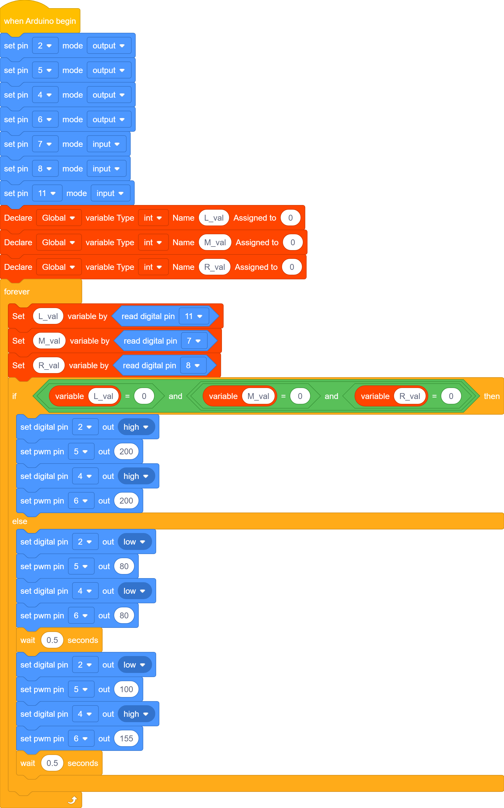

   KidsBlock Project-1747127137354

**5.Test Result**

After successfully uploading the code to the V4.0 board, connect the
wirings according to the wiring diagram, power on the external power
then turn the DIP switch to ON. Put the smart car in the black circle,
then it will move solely in the circle.

Project 11 Line Tracking Smart Car
~~~~~~~~~~~~~~~~~~~~~~~~~~~~~~~~~~

|image268|

**1.Description**

Based on the working principle of the line tracking sensor, we empower
to make a line tracking smart car.

In this project, we detect whether there is a black line at the bottom
of the smart car through a line tracking sensor, and then control the
rotation of the two groups of motors according to the detection results
in a way that controls the smart car to walk along the black line. 

**2.Flow Chart**

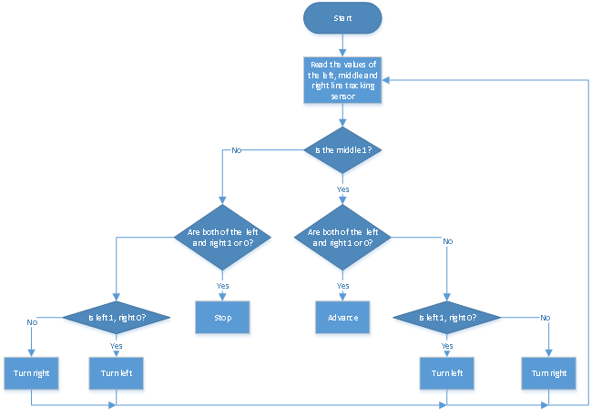

   img

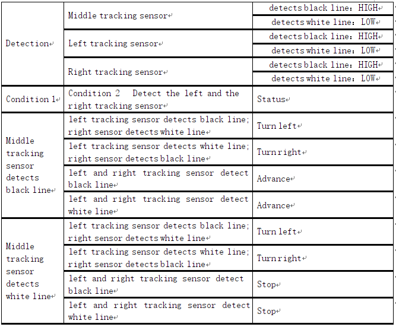

   Img

**3.Wiring Diagram**

|image269|

G, V, S1, S2 and S3 of the line tracking sensor are connected to
G（GND), V（VCC), D11, D7 and D8 of the sensor expansion board.

The power is connected to the BAT port

**4.Test Code**

You can drag blocks to edit. Blocks listed below are for your reference

(1).\ |image270|

(2).\ |image271|

(3).\ |image272|

(4).\ |image273|

(5).\ |image274|

**Complete Test Code**

|image275|

|image276|

|image277|

**5.Test Resul**

After successfully uploading the code to the V4.0 board, connect the
wirings according to the wiring diagram, power on the external power
then turn the DIP switch to ON. Then the smart car will walk along the
lines.

Project 12 Ultrasonic Following Smart Car
~~~~~~~~~~~~~~~~~~~~~~~~~~~~~~~~~~~~~~~~~

|image278|

**1.Description**

In this project, we will look to detect the distance between the 4WD
smart car and the obstacles ahead through an ultrasonic sensor to drive
two motors in a way that make the car move and make the 8*8 LED board
show a smile facial pattern.

**2.Flow Chart**

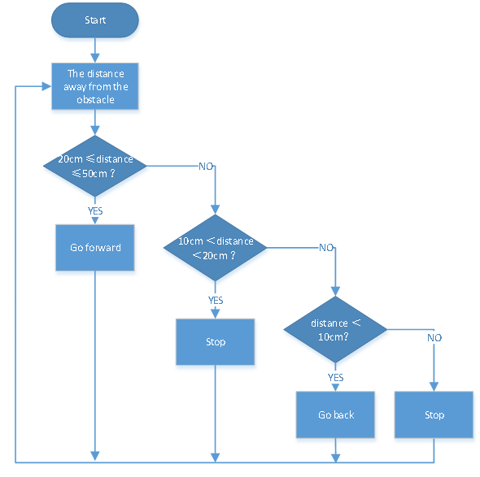

   img

.. raw:: html

   <table border="1">

.. raw:: html

   <tbody>

.. raw:: html

   <tr class="odd">

.. raw:: html

   <td>

Detection

.. raw:: html

   </td>

.. raw:: html

   <td>

Measured distance of front obstacles

.. raw:: html

   </td>

.. raw:: html

   <td>

distance（unit：cm）

.. raw:: html

   </td>

.. raw:: html

   </tr>

.. raw:: html

   <tr class="even">

.. raw:: html

   <td>

Setting

.. raw:: html

   </td>

.. raw:: html

   <td>

8*16 LED board shows a smile pattern.

.. raw:: html

   </td>

.. raw:: html

   <td>

.. raw:: html

   </td>

.. raw:: html

   </tr>

.. raw:: html

   <tr class="odd">

.. raw:: html

   <td>

.. raw:: html

   </td>

.. raw:: html

   <td>

Set servo to 90°

.. raw:: html

   </td>

.. raw:: html

   <td>

.. raw:: html

   </td>

.. raw:: html

   </tr>

.. raw:: html

   <tr class="even">

.. raw:: html

   <td>

Condition

.. raw:: html

   </td>

.. raw:: html

   <td>

distance≥20 and distance≤50

.. raw:: html

   </td>

.. raw:: html

   <td>

.. raw:: html

   </td>

.. raw:: html

   </tr>

.. raw:: html

   <tr class="odd">

.. raw:: html

   <td>

Status

.. raw:: html

   </td>

.. raw:: html

   <td>

Go forward

.. raw:: html

   </td>

.. raw:: html

   <td>

.. raw:: html

   </td>

.. raw:: html

   </tr>

.. raw:: html

   <tr class="even">

.. raw:: html

   <td>

Condition

.. raw:: html

   </td>

.. raw:: html

   <td>

distance＞10 and distance＜20

.. raw:: html

   </td>

.. raw:: html

   <td>

.. raw:: html

   </td>

.. raw:: html

   </tr>

.. raw:: html

   <tr class="odd">

.. raw:: html

   <td>

.. raw:: html

   </td>

.. raw:: html

   <td>

distance＞50

.. raw:: html

   </td>

.. raw:: html

   <td>

.. raw:: html

   </td>

.. raw:: html

   </tr>

.. raw:: html

   <tr class="even">

.. raw:: html

   <td>

Condition

.. raw:: html

   </td>

.. raw:: html

   <td>

stop

.. raw:: html

   </td>

.. raw:: html

   <td>

.. raw:: html

   </td>

.. raw:: html

   </tr>

.. raw:: html

   <tr class="odd">

.. raw:: html

   <td>

Condition

.. raw:: html

   </td>

.. raw:: html

   <td>

distance≤10

.. raw:: html

   </td>

.. raw:: html

   <td>

.. raw:: html

   </td>

.. raw:: html

   </tr>

.. raw:: html

   <tr class="even">

.. raw:: html

   <td>

Condition

.. raw:: html

   </td>

.. raw:: html

   <td>

Go back

.. raw:: html

   </td>

.. raw:: html

   <td>

.. raw:: html

   </td>

.. raw:: html

   </tr>

.. raw:: html

   </tbody>

.. raw:: html

   </table>

**3.Wiring Diagram**

|image279|

**Wiring up：**

1). GND, VCC, SDA and SCL of the 8*8 LED board are connected to G（GND),
V（VCC), A4 and A5 of the expansion board.

2). VCC, Trig, Echo and Gnd of the ultrasonic sensor are connected to
5V(V), D12(S), D13(S) and Gnd(G)

3). The servo is connected to G, V and A3. The brown wire is interfaced
with Gnd(G), the red wire is interfaced with 5V(V) and the orange wire
is interfaced with A3.

4). The power is connected to the BAT port

**4.Test Code**

Before writing the code, it is necessary to import the library files of
the ultrasonic sensor, 8x16 LED board and the servo. The specific steps
are as follows: 

Click |image280|\ to enter the extension library interface of
sensors/modules/components, then search
for“Ultrasonic”sensor\ |image281|\ and click it.

In this way, “**Not loaded**” changes to “**loaded**”, indicating that
the“\ **Ultrasonic**\ ”sensor was added successfully. 

.. figure:: media/A283.png
   :alt: Img

   Img

|image282|

The 8x16 LED board and servo library files are added in the same way as
the ultrasonic sensor.

Click |image283|\ to return to the code editor interface, the
instruction block of the added “\ **Ultrasonic**\ ”sensor,“\ **Matrix
8*16 Aip1640**\ ”module and “\ **Servo**\ ”component can be seen in the
module area. 

|image284|

You can drag blocks to edit. Blocks listed below are for your reference

(1).\ |image285|

(2).\ |image286|

(3).\ |image287|

(4).\ |image288|

(5).\ |image289|

(6).\ |image290|

(7).\ |image291|

(8).\ |image292|

(9).\ |image293|

**Complete Test Code**

|image294|

|image295|

|image296|

**5.Test Result**

After successfully uploading the code to the V4.0 board, connect the
wirings according to the wiring diagram, power on the external power
then turn the DIP switch to ON. Set the servo to 90°，the smart car will
move with the obstacles and the 8X16 LED board will show“smile”.

Project 13 Ultrasonic Obstacle Avoidance Smart Car
~~~~~~~~~~~~~~~~~~~~~~~~~~~~~~~~~~~~~~~~~~~~~~~~~~

|image297|

**1.Description**

In this project, we aim to make an ultrasonic obstacle avoidance smart
car. We will use the ultrasonic to detect the distance from the
obstacle, which can be used to control the servo to rotate so as to make
the car move. Meanwhile, the 8X16 LED board will display the
corresponding status pattern.

**2.Flow Chart**

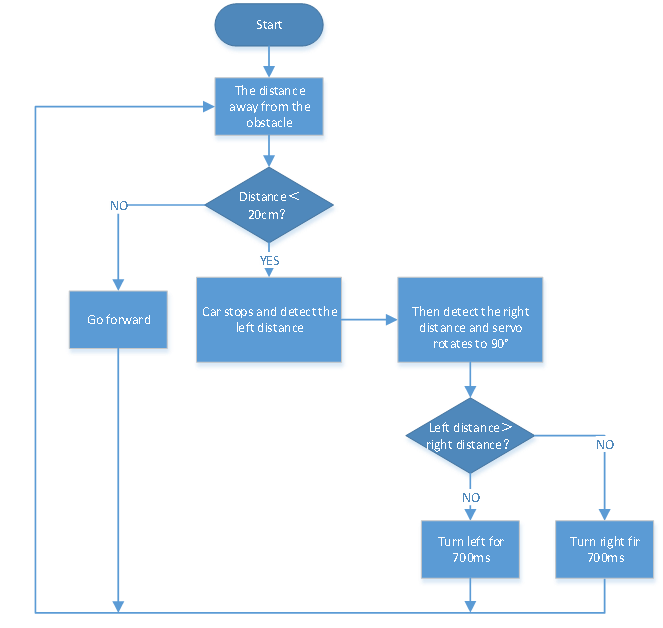

   img

**The specific logic of ultrasonic obstacle avoidance smart car is shown
below:**

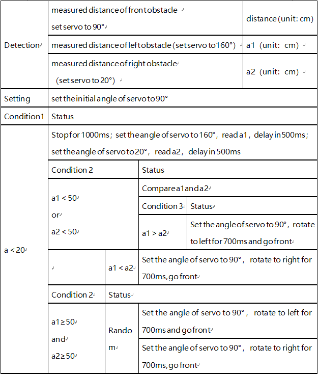

   Img

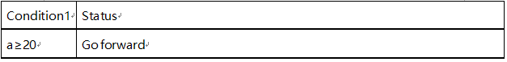

   Img

**3.Wiring Diagram**

|image298|

1). GND, VCC, SDA and SCL of the 8*8 LED board module are connected to
G（GND), V（VCC), A4 and A5 of the expansion board.

2). VCC, Trig, Echo and Gnd of the ultrasonic sensor are connected to
5V(V), D12(S), D13(S) and Gnd(G).

3). The servo is connected to G, V and A3. The brown wire is interfaced
with Gnd(G), the red wire is interfaced with 5V(V) and the orange wire
is interfaced with A3.

4). The power is connected to the BAT port

**4.Test Code**

Before writing the code, it is necessary to import the library files of
the ultrasonic sensor , 8x16 LED board and the servo. The specific steps
are as follows: 

Click |image299|\ to enter the extension library interface of
sensors/modules/components, then search for“Ultrasonic”sensor
|image300|\ and click it. In this way, “**Not loaded**” changes to
“**loaded**”, indicating that the“\ **Ultrasonic**\ ”sensor was added
successfully. 

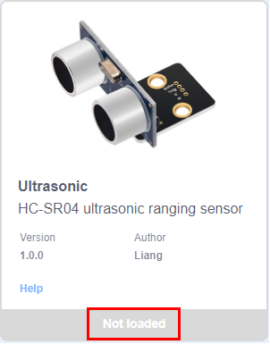

   Img

|image301|

Click |image302|\ to return to the code editor interface, the
instruction block of the added “\ **Ultrasonic”sensor**,“\ **Matrix 8*16
Aip1640**\ ”module and “\ **Servo**\ ”component can be seen in the
module area. 

|image303|

You can drag blocks to edit. Blocks listed below are for your reference.

(1).\ |image304|

(2).\ |image305|

(3).\ |image306|

(4).\ |image307|

(5).\ |image308|

(6).\ |image309|

(7).\ |image310|

(8).\ |image311|

(9).\ |image312|

(10).\ |image313|

**Complete Test Code**

|image314|

|image315|

|image316|

|image317|

**5.Test Result**

After successfully uploading the code to the V4.0 board, connect the
wirings according to the wiring diagram, power on the external power
then turn the DIP switch to ON.

The smart car moves forward and automatically avoids obstacles. When
there is no road ahead, the servo will drive the ultrasonic sensor to
scan the left, middle and right distances, and the car will turn to the
open side. Meanwhile, the 8X16 LED board will display the corresponding
status pattern.

Project 14 IR Remote Control Smart Car
~~~~~~~~~~~~~~~~~~~~~~~~~~~~~~~~~~~~~~

|image318|

**1.Description**

In this project, we will make an IR remote control smart car and press
the button on the IR remote control to drive the car to move.

**2.Flow Chart**

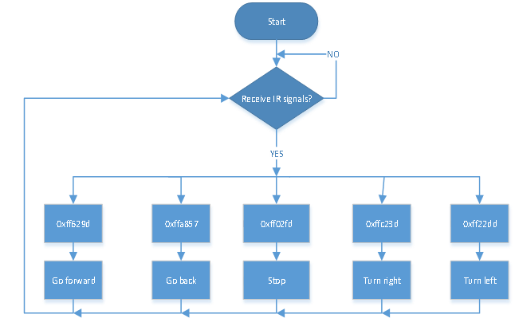

   img

**The specific logic of IR remote control smart car is shown below:**

+-----------------------------------+--------+-----------------------------+
| Initial setup                     |        | LED board displays smile    |
|                                   |        | face                        |
+===================================+========+=============================+
| Remote control                    | Key    | Key state                   |
|                                   | value  |                             |
+-----------------------------------+--------+-----------------------------+
| |wps6-1747037981476-25|           | FF629D | Go front8*8 LED board shows |
|                                   |        | front icon                  |
+-----------------------------------+--------+-----------------------------+
| |wps7-1747037985784-27|           | FFA857 | Back8*8 LED board shows     |
|                                   |        | back icon                   |
+-----------------------------------+--------+-----------------------------+
| |wps8|                            | FF22DD | Rotate to left8*8 LED board |
|                                   |        | shows leftward icon         |
+-----------------------------------+--------+-----------------------------+
| |wps9|                            | FFC23D | Rotate to right8*8 LED      |
|                                   |        | board shows rightward icon  |
+-----------------------------------+--------+-----------------------------+
| |wps10|                           | FF02FD | Stop8*8 LED board           |
|                                   |        | shows“STOP”                 |
+-----------------------------------+--------+-----------------------------+

**3.Wiring Diagram**

|image319|

1). GND, VCC, SDA and SCL of the 8*8 LED board module are connected to
G（GND), V（VCC), A4 and A5 of the expansion board.

2). As the IR receiver is integrated on the 8833 motor driver expansion
board, there is no need for additional wiring. The pins of the IR
receiver on the 8833 board are G (GND), V (VCC) and D3 respectively. 

3). The servo is connected to G, V and A3. The brown wire is interfaced
with Gnd(G), the red wire is interfaced with 5V(V) and the orange wire
is interfaced with A3.

4). The power is connected to the BAT port

**4.Test Code**

Please note: The infrared module shown in the software demonstration is
already integrated into the expansion board and is not supplied
separately. Consequently, you will not find the module depicted in the
image below within the product.

|image320|

Before writing the code, it is necessary to import the library files of
the ultrasonic sensor, 8x16 LED board and the servo. The specific steps
are as follows: 

Click |image321|\ to enter the extension library interface of
sensors/modules/components, then search for“ir
remote”sensor\ |image322|\ and click it. In this way, “**Not loaded**”
changes to “**loaded**”, indicating that the“\ **ir remote**\ ”sensor
was added successfully. 

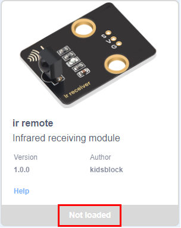

   Img

|image323|

Click |image324|\ to return to the code editor interface, the
instruction block of the added “\ **ir remote**\ ”sensor,“\ **Matrix
8*16 Aip1640**\ ”module and “\ **Servo**\ ”component can be seen in the
module area. 

|image325|

You can drag blocks to edit. Blocks listed below are for your reference

(1).\ |image326|

(2).\ |image327|

(3).\ |image328|

(4).\ |image329|

(5).\ |image330|

(6).\ |image331|

(7).\ |image332|

(8).\ |image333|

**Complete Test Code**

|image334|

|image335|

|image336|

|image337|

|image338|

**5.Test Result**

After successfully uploading the code to the V4.0 board, connect the
wirings according to the wiring diagram, power on the external power
then turn the DIP switch to ON. Then we enable to use the IR remote
control drive the car to move to and the 8X16 LED board will display the
corresponding status pattern.

Project 15 Bluetooth Control Smart Car
~~~~~~~~~~~~~~~~~~~~~~~~~~~~~~~~~~~~~~

|image339|

**1.Description**

We’ve learned the basic knowledge of Bluetooth. And in this lesson, we
will make a Bluetooth control smart car. In this project, we aim to
regard the mobile phone as the transmitter (host), and the smart car
connected to the BT24 Bluetooth module (slave) as the receiver and use
the mobile APP to control the smart car via the Bluetooth. 

**2.APP Control Button**

+----------------------------------------+-----------------------------+
| Key                                    | Function                    |
+========================================+=============================+
| |wps14|                                | Pair DX-BT24 5.1 Bluetooth  |
|                                        | module                      |
+----------------------------------------+-----------------------------+
| |wps15|                                | Disconnect Bluetooth        |
+----------------------------------------+-----------------------------+

+-----------------------+-----------------------+-----------------------+
|                       | Control character     | Function              |
+=======================+=======================+=======================+
| |wps16|               | Press: F Release: S   | Press the button, the |
|                       |                       | car goes front;       |
|                       |                       | release to stop       |
+-----------------------+-----------------------+-----------------------+
| |wps17|               | Press: L Release: S   | Press the button, the |
|                       |                       | car turns left;       |
|                       |                       | release to stop       |
+-----------------------+-----------------------+-----------------------+
| |wps18|               | Press: R Release: S   | Press the button, the |
|                       |                       | car turns right;      |
|                       |                       | release to stop       |
+-----------------------+-----------------------+-----------------------+
| |wps19|               | Press: B Release: S   | Press the button, the |
|                       |                       | car goes back;        |
|                       |                       | release to stop       |
+-----------------------+-----------------------+-----------------------+
| |wps20|               | Press: “a” Release:   | Click to speed        |
|                       | “S”                   | up(maximum:255)       |
+-----------------------+-----------------------+-----------------------+
| |wps21|               | Press: “d” Release:   | Click to slow         |
|                       | “S”                   | down(minimum:0)       |
+-----------------------+-----------------------+-----------------------+
| |wps22|               | Click to start the    |                       |
|                       | gravity sensing       |                       |
|                       | function of the       |                       |
|                       | mobile phone: click   |                       |
|                       | again to exit the     |                       |
|                       | gravity sensing       |                       |
|                       | control               |                       |
+-----------------------+-----------------------+-----------------------+
| |wps23|               | Click to send“X”,     | Start line tracking   |
|                       | click again to        | function; click again |
|                       | send“S”               | to exit               |
+-----------------------+-----------------------+-----------------------+
| |wps24|               | Click to send“Y”,     | Start ultrasonic      |
|                       | click again to        | avoiding function;    |
|                       | send“S”               | click again to exit   |
+-----------------------+-----------------------+-----------------------+
| |wps25|               | Click to send“U”,     | Start ultrasonic      |
|                       | click again to        | follow function;      |
|                       | send“S”               | click again to exit   |
+-----------------------+-----------------------+-----------------------+
| |wps26|               | Click to              | Start restricting     |
|                       | send“G”,click again   | function; click again |
|                       | to send“S”            | to exit               |
+-----------------------+-----------------------+-----------------------+

**3.Flow Chart**

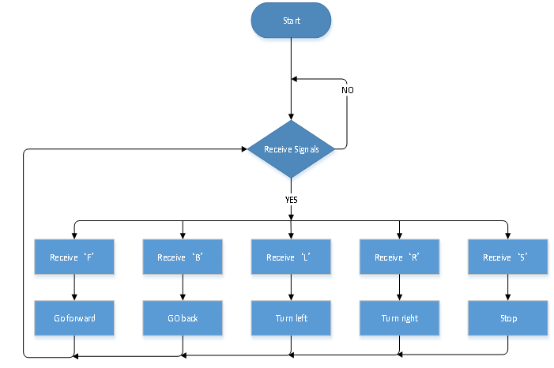

   img

**4.Wiring Diagram**

|image340|

1). GND, VCC, SDA and SCL of the 8*8 LED board are connected to G（GND),
V（VCC), A4 and A5 of the expansion board.

2). The RXD, TXD, GND and VCC of the Bluetooth module are respectively
connected to TX, RX, G and 5V on the 8833 motor driver expansion board,
while the STATE and BRK pins of the Bluetooth module do not need to be
connected. 

3). The servo is connected to G, V and A3. The brown wire is interfaced
with Gnd(G), the red wire is interfaced with 5V(V) and the orange wire
is interfaced with A3.

4). The power is connected to the BAT port

**5.Test Code**

Before writing the code, it is necessary to import the library files of
the 8x16 LED board and the servo. The specific steps are as follows: 

Click |image341|\ to enter the extension library interface of
sensors/modules/components, then search for“\ **Matrix 8*16
Aip1640**\ ”module\ |image342|\ and click it. In this way, “**Not
loaded**” changes to “**loaded**”, indicating that the“\ **Matrix 8*16
Aip1640**\ ”module was added successfully. 

   Img

|image343|

Click |image344|\ to return to the code editor interface, the
instruction block of the added“\ **Matrix 8*16 Aip1640**\ ”module and
“\ **Servo**\ ”component can be seen in the module area. 

|image345|

You can drag blocks to edit. Blocks listed below are for your reference.

(1).\ |image346|

(2).\ |image347|

(3).\ |image348|

(4).\ |image349|

(5).\ |image350|

(6).\ |image351|

(7).\ |image352|

(8).\ |image353|

(9).\ |image354|

**Complete Test Code**

Note: Before uploading the test code, you need to remove the Bluetooth
module, otherwise the code will fail to be uploaded.Connect the
Bluetooth module after uploading the code successfully.

|image355|

|image356|

|image357|

|image358|

|image359|

**6.Test Result**

After successfully uploading the code to the V4.0 board, connect the
wirings according to the wiring diagram, power on the external power
then turn the DIP switch to ON.

Inset the BT module and open your cellphone to connect the Bluetooth to
control the smart car. The can will move forward, backward, turn left
and right and stop. Also the 8*8 LED board will show the corresponding
patterns.

Project 16 Bluetooth Speed Control Smart Car
~~~~~~~~~~~~~~~~~~~~~~~~~~~~~~~~~~~~~~~~~~~~

|image360|

**1.Description**

In this project, we will use a Bluetooth to adjust the speed of the
smart car. We empower to define a variable speeds and change it to
change the speed of the smart car. 

**2.Flow Chart**

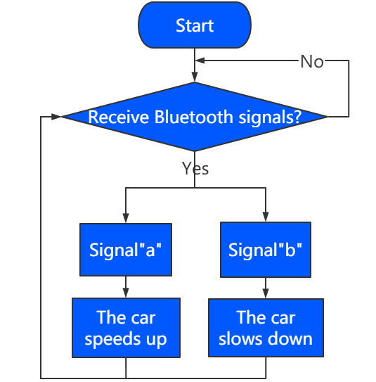

   image-20250513095810478

**3.Wiring Diagram**

|image361|

1). GND, VCC, SDA and SCL of the 8*8 LED board are connected to G（GND),
V（VCC), A4 and A5 of the expansion board.

2). The RXD, TXD, GND and VCC of the Bluetooth module are respectively
connected to TX, RX, G and 5V on the 8833 motor driver expansion board,
while the STATE and BRK pins of the Bluetooth module do not need to be
connected. 

3). The servo is connected to G, V and A3. The brown wire is interfaced
with Gnd(G), the red wire is interfaced with 5V(V) and the orange wire
is interfaced with A3.

4). The power is connected to the BAT port

**4.Test Code**

Before writing the code, it is necessary to import the library files of
the 8x16 LED board and the servo. The specific steps are as follows: 

Click |image362|\ to enter the extension library interface of
sensors/modules/components, then search for“Matrix 8*16
Aip1640”module\ |image363|\ and click it. In this way, “**Not loaded**”
changes to “**loaded**”, indicating that the“\ **Matrix 8*16
Aip1640**\ ”module was added successfully. 

   Img

|image364|

Click |image365|\ to return to the code editor interface, the
instruction block of the added “\ **Matrix 8*16 Aip1640**\ ”module and
“\ **Servo**\ ”component can be seen in the module area. 

|image366|

You can drag blocks to edit. Blocks listed below are for your reference

(1).\ |image367|

(2).\ |image368|

(3).\ |image369|

(4).\ |image370|

(5).\ |image371|

(6).\ |image372|

(7).\ |image373|

(8).\ |image374|

(9).\ |image375|

(10).\ |image376|

**Complete Test Code**

Note: Before uploading the test code, you need to remove the Bluetooth
module, otherwise the code will fail to be uploaded.Connect the
Bluetooth module after uploading the code successfully.

|image377|

|image378|

|image379|

|image380|

|image381|

|image382|

**5.Test Result**

After successfully uploading the code to the V4.0 board, connect the
wirings according to the wiring diagram, power on the external power
then turn the DIP switch to ON. Pairing the APP with Bluetooth, the
smart car can be controlled to move by the APP.

Press\ |image383|, the car will speed up, press |image384|, the car will
slow down, and the 8*16 LED board will display the corresponding status
pattern of the smart car.

Project 17 Multi-purpose Bluetooth Smart Car
~~~~~~~~~~~~~~~~~~~~~~~~~~~~~~~~~~~~~~~~~~~~

|image385|

**1.Description**

In previous projects, the car only performs a single function. However,
in this lesson, we will integrate all of its functions via a Bluetooth.

**2.Flow Chart**

|image386|

**3.Wiring Diagram**

|image387|

1). GND, VCC, SDA and SCL of the 8*8 LED board are connected to G（GND),
V（VCC), A4 and A5 of the expansion board.

2). The RXD, TXD, GND and VCC of the Bluetooth module are respectively
connected to TX, RX, G and 5V on the 8833 motor driver expansion board,
while the STATE and BRK pins of the Bluetooth module do not need to be
connected. 

3). The servo is connected to G, V and A3. The brown wire is interfaced
with Gnd(G), the red wire is interfaced with 5V(V) and the orange wire
is interfaced with A3.

4). G, V, S1, S2 and S3 of the line tracking sensor are connected to
G（GND), V（VCC), D11, D7 and D8 of the sensor expansion board.

5). VCC, Trig, Echo and Gnd of the ultrasonic sensor are connected to
5V(V), D12(S), D13(S) and Gnd(G).

6). The power is connected to the BAT port

**4.Test Code**

Before writing the code, it is necessary to import the library files of
the ultrasonic sensor, 8x16 LED board and the servo. The specific steps
are as follows: 

Click |image388|\ to enter the extension library interface of
sensors/modules/components, then search
for“\ **Ultrasonic**\ ”sensor\ |image389|\ and click it. In this way,
“**Not loaded**” changes to “**loaded**”, indicating that
the“\ **Ultrasonic**\ ”sensor was added successfully. 

   Img

|image390|

Click |image391|\ to return to the code editor interface, the
instruction block of the added “\ **Ultrasonic**\ ”sensor,“\ **Matrix
8*16 Aip1640**\ ”module and “\ **Servo**\ ”component can be seen in the
module area. 

|image392|

**Complete Test Code**

Note: Before uploading the test code, you need to remove the Bluetooth
module, otherwise the code will fail to be uploaded.Connect the
Bluetooth module after uploading the code successfully.

|image393|

**5.Test Result**

After successfully uploading the code to the V4.0 board, connect the
wirings according to the wiring diagram, power on the external power
then turn the DIP switch to ON.

After the Bluetooth module is plugged into the APP and the mobile APP is
successfully connected to the Bluetooth, the smart car can be controlled
by the mobile APP.  We can achieve the corresponding functions by
pressing the corresponding buttons on the mobile APP. 

.. |Img| image:: media/A4.png
.. |image1| image:: media/A5.png

.. |image3| image:: media/A8.png
.. |image4| image:: media/A9.png
.. |image5| image:: media/A10.png

.. |image-20250516094348761| image:: media/A18.png

.. |image-20250516094402344| image:: media/A20.png

.. |image13| image:: media/A27.png
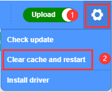

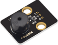
.. |image18| image:: media/A32.png

.. |image20| image:: media/A34.png

.. |image23| image:: media/A32.png
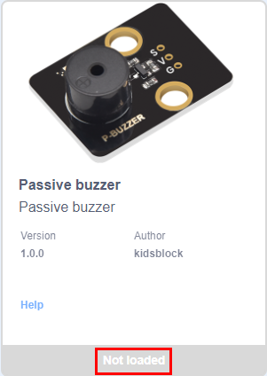
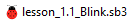

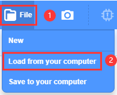
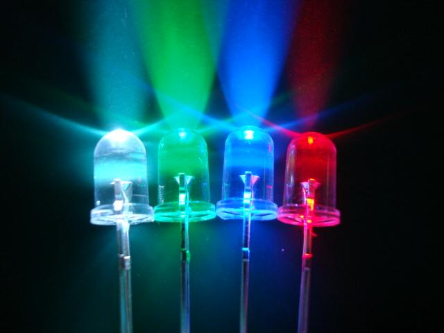
.. |image29| image:: media/A41.png
.. |img| image:: media/A42.jpg
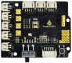
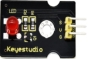
.. |image32| image:: media/A45.jpg

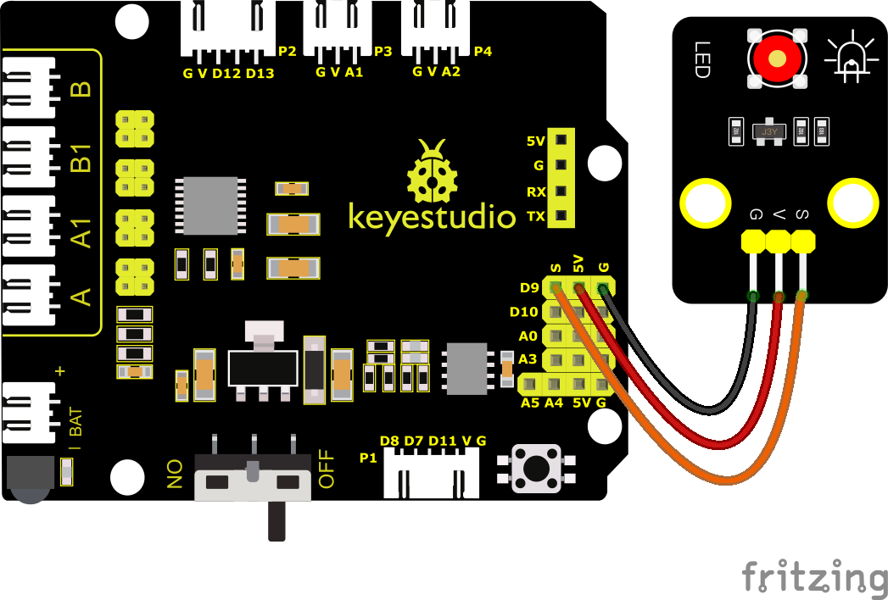
.. |image35| image:: media/A48.png
.. |image36| image:: media/A49.png
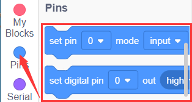
.. |image38| image:: media/A51.png
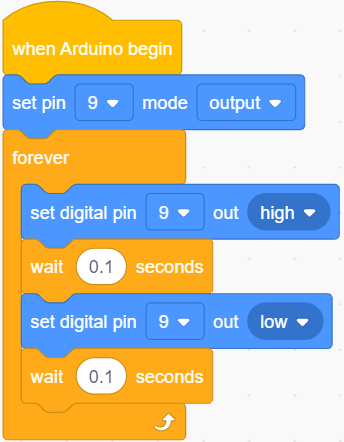

.. |image41| image:: media/A54.png

.. |image44| image:: media/A45.jpg


.. |image58| image:: media/A66.jpg
.. |image59| image:: media/A67.jpg


.. |image62| image:: media/A70.jpg
.. |image63| image:: media/A71.jpg
.. |image64| image:: media/A72.png
.. |image65| image:: media/A73.png


.. |image68| image:: media/A76.png


.. |image72| image:: media/A80.png

.. |image74| image:: media/A82.png

.. |image76| image:: media/A73.png


.. |image81| image:: media/A86.png
.. |image82| image:: media/A87.png


.. |image88| image:: media/A93.png
.. |image89| image:: media/A94.jpg
.. |image90| image:: media/A95.jpg


.. |image103| image:: media/A107.png


.. |image107| image:: media/A112.jpg
.. |image108| image:: media/A113.jpg
.. |image109| image:: media/A114.jpg


.. |image114| image:: media/A120.jpeg
.. |image115| image:: media/A121.png


.. |image123| image:: media/A128.png

.. |image125| image:: media/A130.png
.. |image126| image:: media/A131.png


.. |image129| image:: media/A80.png


.. |image134| image:: media/A128.png

.. |image136| image:: media/A130.png


.. |image147| image:: media/A45.jpg


.. |image157| image:: media/A149.png

.. |image159| image:: media/A151.png
.. |image160| image:: media/A80.png
.. |image161| image:: media/A152.png


.. |image166| image:: media/A155.png


.. |image169| image:: media/A157.png


.. |image172| image:: media/A160.png

.. |image174| image:: media/A162.png
.. |image175| image:: media/A163.jpg
.. |image176| image:: media/A164.jpg
.. |image177| image:: media/A165.jpg
.. |image178| image:: media/A166.jpg
.. |image179| image:: media/A167.jpg


.. |image183| image:: media/A170.png
.. |image184| image:: media/A171.png


.. |image187| image:: media/A174.png


.. |image197| image:: media/A80.png


.. |image201| image:: media/A170.png
.. |image202| image:: media/A171.png
.. |image203| image:: media/A199.png


.. |image213| image:: media/A208.jpg

.. |image215| image:: media/A210.jpg


.. |image226| image:: media/A222.png


.. |image263| image:: media/A265.png
.. |image264| image:: media/A266.png

.. |image266| image:: media/A268.png


.. |image273| image:: media/A268.png
.. |image274| image:: media/A276.png


.. |image282| image:: /media/A284.png


.. |image286| image:: media/A286.png


.. |image289| image:: media/A268.png


.. |image301| image:: /media/A284.png


.. |image309| image:: media/A268.png


.. |image327| image:: media/A317.png
.. |image328| image:: media/A318.png
.. |image329| image:: media/A319.png

.. |image331| image:: media/A320.png


.. |image347| image:: media/A317.png
.. |image348| image:: media/A331.png
.. |image349| image:: media/A319.png


.. |image353| image:: media/A268.png


.. |image368| image:: media/A317.png
.. |image369| image:: media/A331.png
.. |image370| image:: media/A319.png

.. |image374| image:: media/A268.png


.. |image393| image:: media/A352.png
