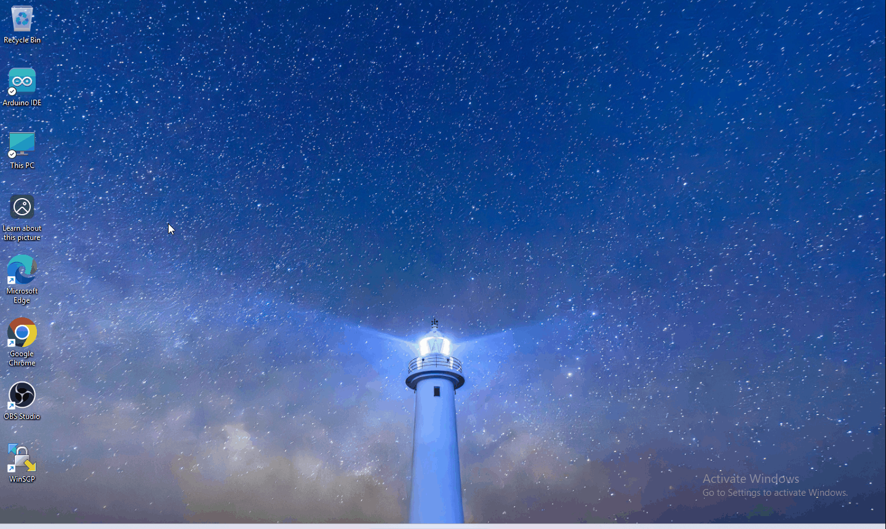
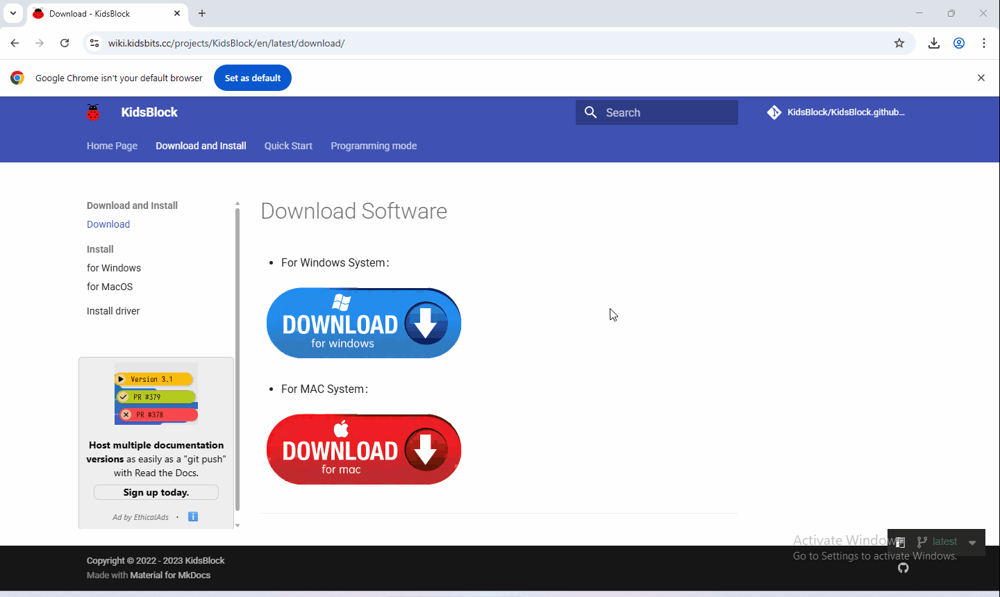
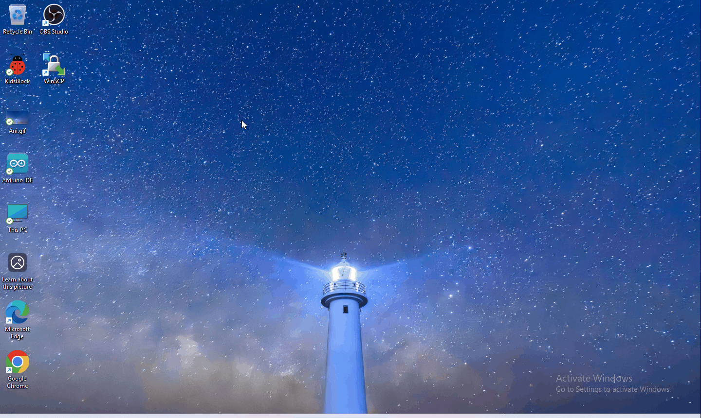
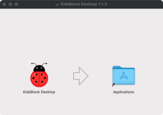

5. Scratch
==========

5.1 Data download
-----------------

Scratch information contains project ,please click to download for
follow-up study!!!!

Data download： :download:`Data download <./Scratch.7z>`

5.2 Software installation of Windows System
-------------------------------------------

1. Download
   kidsblock:  https://wiki.kidsbits.cc/projects/KidsBlock/en/latest/

   |image1|

2. software installation |image2|

3.operating software

First connect the development board to the computer

|image3|

5.3 Software installation of Mac System
---------------------------------------

1.Download kidsblock: www.kidsbits.net/Down/KidsBlockDesktop1.1.3.dmg.
|Img|

2.Click KidsBlock, and drag KidsBlock Desktop into Applications.
|image4|

3.Wait for installing. KidsBlock icon will show up in Launchpad if it is
installed successfully. |image5|

.. |Img| image:: ./media/img-20230302102209-1749281036490-1.png

.. |image5| image:: media/img-20230302102218.png
