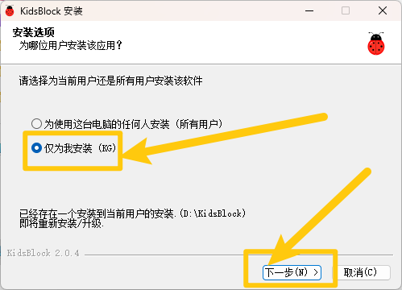
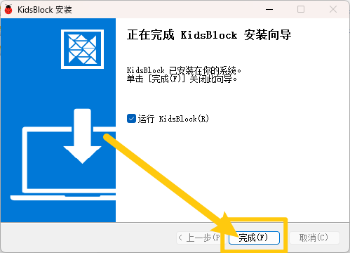
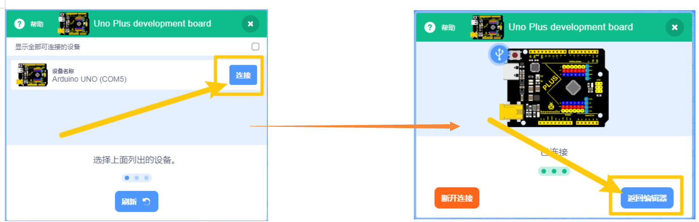
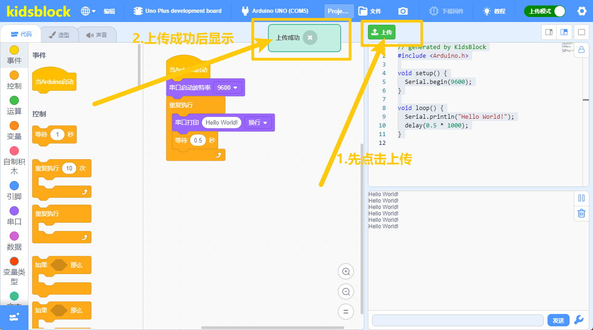
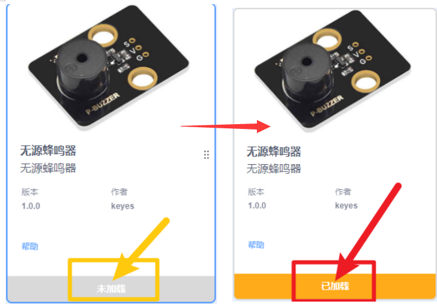
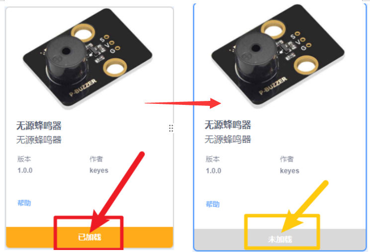

5. Scratch 课程
===============

5.1 下载课程
------------

:download:`Scratch课程 <./Scratch.7z>`

5.2 软件安装（Windows系统）
---------------------------

1. 点击链接 https://xiazai.keyesrobot.cn/KidsBlock.exe 下载软件。

2. 双击软件安装包\ |image1|\ ，选择\ **“仅为我安装”**\ ，选择\ **“下一步(N)”**\ 。

   |image2|

3. 点击\ **“浏览（B）”**\ ，可以自定义软件安装的位置，最后选择\ **“安装（I）”**\ 。

   |image3|

4. 安装完成后，选择\ **“完成（F）”**\ 。

   |image4|

   （首次打开时间稍久，请耐心等待！！！）

5.3 KidsBlock软件的使用说明
---------------------------

（以下是以Windows系统为例，MacOS系统可以参考）

1. 软件中各按钮的功能：

|image5|

2. 加载代码文件(*注意代码和开发板的选择以实物为准,不要完全照下列教程选择*\ ）

⽅法 **1**\ ： 双击⽂件（.SB3）直接打开。

⽅法 **2**\ ： 点击“⽂件”，选择“从电脑中上传”，选择⽂件（.SB3）即可。

|image6|

3. 代码上传

加载完代码文件后，确保开发板连接到电脑（如何安装驱动程序请参考驱动安装教程），点击“\ |image7|\ ”以选择对应开发板，点击\ |image8|\ 选择正确的端口，显示端口号证明已连接。

|image9|

最后点击“上传”，上传成功会显示“上传成功”。

|image10|

4. 添加库

   |image11|\ 是添加传感器/模块和元件的扩展包，点击\ |image12|\ 可以进入扩展库界面，例如需要添加无源蜂鸣器模块，点击“无源蜂鸣器”所处区域，“未加载”变成“已加载”，说明“无源蜂鸣器”模块添加成功。

   |image13|

   点击\ |image14|\ ，可以回到代码编辑器界面，在模块区可以看到添加\ |image15|\ 。

   如果需要删除“无源蜂鸣器”模块，只需要点击\ |image16|\ 再次进入传感器/模块扩展库界面，点击“无源蜂鸣器”所处区域，“已加载”变成“未加载”，则说明“无源蜂鸣器”模块删除成功。

   |image17|

   其他的传感器/模块和元器件的添加和删除，方法是一样的。

   **至此，软件已经安装成功，并且可以正常运行，如遇问题请先重新对照教程仔细检查，多次检查后如未解决请联系客服！！！**

.. |image3| image:: media/3.png

.. |image5| image:: media/5.png
.. |image6| image:: ./media/image-20250623155225528.png
.. |image7| image:: ./media/image-20250623142714902.png

.. |image11| image:: media/11.png
.. |image12| image:: media/12.png

.. |image16| image:: media/12.png

