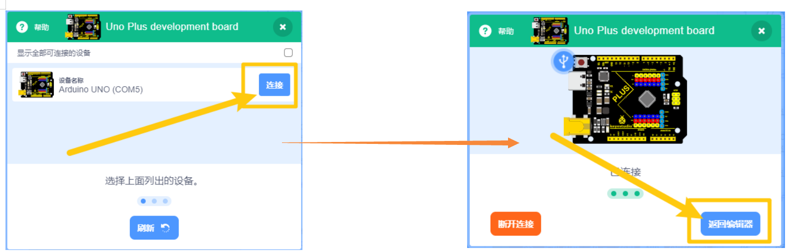
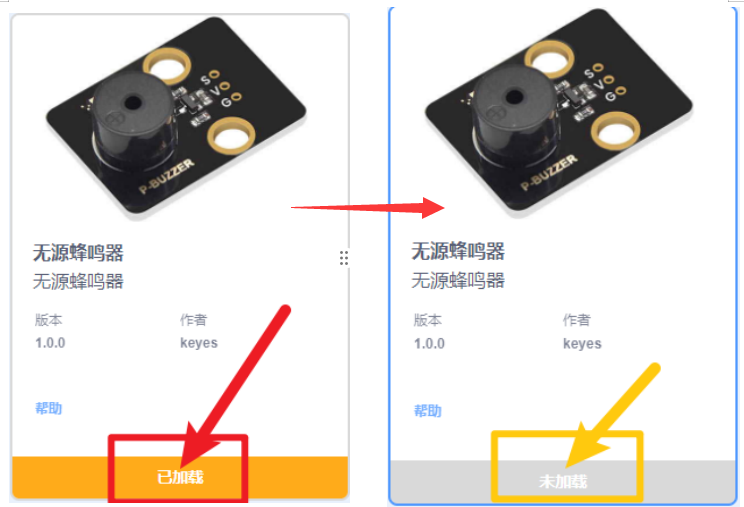

# 5. Scratch软件下载与配置

## 5.1 下载资料

**Scratch资料包含项目代码，请点击下载才能进行后续的学习！！！！**

资料下载：[Scratch](./Scratch.7z)

APP下载：[APP](./APP.7z)

## 5.2 软件安装

### Windows系统：

点击链接 https://xiazai.keyesrobot.cn/KidsBlock.exe下载软件。

### Mac系统：

点击链接https://www.kidsblock.cn/Down/KidsBlock-MACOS.dmg下载软件。

（首次打开时间稍久，请耐心等待！！！）

## 5.3驱动安装

如果无法上传代码，请参考以下教程安装驱动（选读）

1、Windows驱动安装

2、Mac驱动安装

## 5.4 KidsBlock软件的使用说明

（以下是以Windows系统为例，MacOS系统可以参考）

1. 软件中各按钮的功能：

2. 加载代码文件(*注意代码和开发板的选择以实物为准,不要完全照下列教程选择*）

⽅法 **1**： 双击⽂件（.SB3）直接打开。

⽅法 **2**： 点击“⽂件”，选择“从电脑中上传”，选择⽂件（.SB3）即可。

3. 代码上传

加载完代码文件后，确保开发板连接到电脑,点击“”以选择对应开发板，点击选择正确的端⼝，显示端口号证明已连接。

最后点击“上传”，上传成功会显示“上传成功”。

4. 添加库

   是添加传感器/模块和元件的扩展包，点击可以进入扩展库界面，例如需要添加无源蜂鸣器模块，点击“无源蜂鸣器”所处区域，“未加载”变成“已加载”，说明“无源蜂鸣器”模块添加成功。

   

   点击，可以回到代码编辑器界面，在模块区可以看到添加。

   如果需要删除“无源蜂鸣器”模块，只需要点击再次进入传感器/模块扩展库界面，点击“无源蜂鸣器”所处区域，“已加载”变成“未加载”，则说明“无源蜂鸣器”模块删除成功。

   

   其他的传感器/模块和元器件的添加和删除，方法是一样的。

   **至此，软件已经安装成功，并且可以正常运行，如遇问题请先重新对照教程仔细检查，多次检查后如未解决请联系客服！！！**

   

